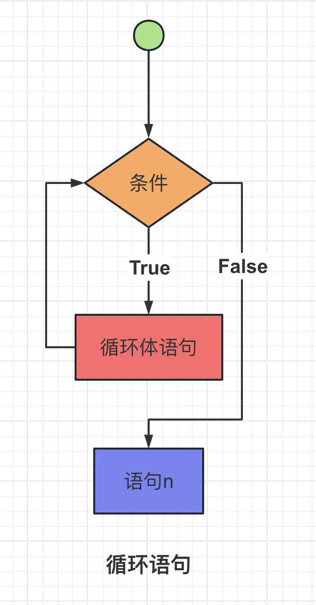
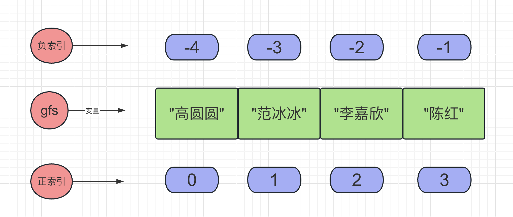
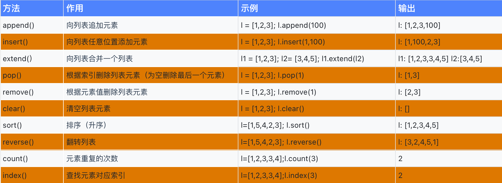

​			

# 模块1：Python基础


Python解释器

pycharm

## 一、基本语法

### 1. Python 代码结构与规范

#### 【1】注释语句


注释语句（Comment Statement）是在程序代码中添加的一种特殊类型的语句，用于提供对代码的解释、说明或备注。注释语句通常不会被编译器或解释器执行，而是被忽略或跳过。

注释语句的主要作用是为了增强代码的可读性和可维护性，以便程序员和其他人能够更好地理解代码的意图、功能和实现细节。注释可以包含对代码的解释、算法说明、特殊用途的标记、作者信息、相关链接等内容。

不同的编程语言使用不同的注释语法，但大多数编程语言都提供了以下两种常见的注释类型：

1. **单行注释**：在单行注释中，注释内容从注释符号开始（通常是一个特定的符号或字符序列），一直延伸到该行的结尾。单行注释用于注释单个代码行或在代码行末尾添加注释。例如：

   ```python
   # 这是一个单行注释
   print("hello world")  # 在控制台打印hello world字符串
   ```

2. **多行注释**：多行注释允许在多个行上添加注释内容。它通常用于注释多行代码块或提供更详细的代码解释。多行注释的语法和符号因编程语言而异。例如，在Python中，多行注释使用三个引号（'''）或三个双引号（"""）括起来，如：

```python
"""
这是一个多行注释的示例。
它可以跨越多个行，并提供对代码的详细解释。
"""
print("hello world") # 在控制台打印hello world字符串
```

需要注意的是，注释语句不会对程序的执行产生任何影响，它们只是用于辅助代码的理解和维护。在编写代码时，良好的注释实践可以提高代码的可读性和可维护性，有助于团队合作和代码重用。

> Pycharm的注释快捷键：Ctrl+/

#### 【2】语句&语句分隔符

语句分隔符（Statement Separator）是用于在编程语言中分隔不同语句的符号或字符。它指示编译器或解释器在代码中的哪个位置结束一条语句，并开始解析下一条语句。

在Python中，语句之间的分隔符有两个：`换行符`和`分号`，推荐`换行符`

```python
print("hello yuan");print("hello world") # 分号作为分隔符
print(100) # 换行符作为分隔符,
print(200)
```

#### 【3】pep8规范

PEP 8是Python编程语言的官方编码风格指南（Python Enhancement Proposal 8），它提供了一套规范和建议，用于编写清晰、易读和一致的Python代码。PEP 8旨在促进Python代码的可读性，并为Python开发者提供一致的编码样式。

以下是PEP 8的一些主要规范和建议：

1. **缩进和空格：** 使用4个空格进行缩进，不要使用制表符（Tab）。在二元运算符周围和逗号后面使用空格，但在括号、方括号和花括号内部不要有空格。
2. **行的长度：** 每行代码尽量不超过79个字符，对于长表达式或注释，可以适度延长到不超过72个字符。
3. **命名规范：** 使用全小写字母和下划线来命名变量、函数和模块。类名应该使用驼峰命名法，首字母大写。
4. **空行：** 使用空行来组织代码，例如在函数和类定义之间、函数内部的逻辑块之间使用空行。
5. **导入规范：** 在不同的行上导入不同的模块。避免使用通配符导入（`from module import *`），而是明确导入需要使用的函数、类或变量。
6. **注释：** 使用注释来解释代码的意图和功能。注释应该清晰、简洁，并遵循特定的注释规范。
7. **函数和类定义：** 在函数和类定义之间使用两个空行。函数定义应该包含文档字符串（docstring），用于描述函数的功能和参数。
8. **代码布局：** 使用合适的空格和空行来组织代码，使其易于阅读和理解。

PEP 8并非强制性规范，但它是Python社区广泛接受的编码风格指南。遵循PEP 8可以提高代码的可读性，使不同开发者之间的代码更加一致，并促进Python项目的可维护性。

```python
# 规范
#不规范


print(100) # 空两行，规范

x=10  # 不规范
x = 10  # 规范 =左右留一个空格

updateuserprofile = ""  # 变量命名不规范
updateUserProfile = ""  # 变量命名规范
```

> Pycharm的格式化快捷键：**Ctrl + Alt + L**

### 2. 变量


#### 【1】变量初识

在Python中，变量是一个标识符，用于引用存储在计算机内存中的数据。每个变量都有一个名称和一个关联的值，可以将值存储在变量中并在程序中多次使用。以下是有关Python变量的一些基本概念：

```python
# 用等号(=)将一个值赋给一个变量
# 游戏场景
role = "刺客"
name = "李白"
attack = 500
healthy = 100
level = 3
experience = 1000
is_movable = False # 是否可以移动（冰冻效果）
```

> 1. 在Python中，变量名（即标识符）是存储在命名空间中的。命名空间是一个变量名和对象之间的映射关系（一个字典结构），它将变量名与对象的引用关联起来。
>
> 2. 全局命名空间是在程序运行时创建的，并在整个程序执行期间一直存在。
>
> 3. 局部命名空间是在函数调用时创建的，并在函数执行期间存在。

#### 【2】变量的用法

##### （1） 基本用法

变量简单的使用就是直接赋值

```python
# （1）变量的多次使用
x = 10
y = 20 # 可以简写：x,y = 10,20

print(x + y)
print(x - y)
print(x * y)
print(x / y)

# （2）变量的重新赋值（修改变量值）
x = 1
x = 2 # 重新赋值

healthy = 100
healthy = 90

level = 1
level = 2
```

> id(数据)，是Python的一个内置函数，返回某个数据对象的内存地址

##### （2）变量传递

```python
x = 1
print(id(x))
y = x # 编程中十分重要的操作：变量传递，对于它的理解至关重要！
x = 2
print(id(x))
print(y)
```

案例：`交换两个变量值`

```python
x = 1
y = 2
# 方式1
t = x
x = y
y = t
# 方式2
x , y = y , x
```

##### （3）表达式赋值

```python
x = 1 + 1
y = x + 1
y = y + 1 
```

案例1：

```python
# 案例
print("游戏开始...")
player_exp = 500
player_level = 3

print("闯关成功")
player_exp = player_exp + 50
player_level = player_level + 1

print("当前级别：",player_level)
print("当前经验值：",player_exp)
# 生命值减少10怎么写？
```

#### 【3】变量的命名规范

Python的变量命名规范通常遵循以下规则：

> 1. 变量名应该具有描述性，以便代码的可读性更高，例如在代码中使用的名称应该清晰、简洁、有意义，避免使用缩写或单个字符。
>2. 变量名应该遵循一定的命名约定，采用驼峰命名法或下划线命名法：驼峰命名法指的是将每个单词的首字母大写，单词之间不使用下划线，例如`myVariableName`；下划线命名法指的是使用小写字母和下划线来分隔单词，例如`my_variable_name`。在Python中，推荐使用下划线命名法（也称为蛇形命名法）
> 3. 变量名只能包含字母、数字和下划线_,不能以数字开头。
>4. 变量名不能使用保留字(例如f、else、while等等)。

附：**Python的关键字**


### 3. 基本数据类型

在编程中，基本数据类型指的是编程语言中提供的最基本、最原始的数据类型，通常是原生支持的数据类型，而不是通过其他数据类型组合而来的。

在Python中，常见的基本数据类型包括：


#### 【1】整型和浮点型

整型（integer）和浮点型（float）是Python中常用的数字数据类型。它们用于表示不同种类的数值，并在数值计算和数据处理中发挥重要作用。

整型（integer）：

- 整型用于表示整数（正整数、负整数和零）。
- 在Python中，整型是一种不可变（immutable）的数据类型，表示为整数字面值，例如 `5`、`-10`、`0` 等。

```python
x = 1
y = -10
blood = 100
```

浮点型（float）：

- 浮点型用于表示带有小数部分的数值，也称为浮点数。
- 在Python中，浮点型是一种不可变的数据类型，表示为浮点数字面值，例如 `3.14`、`-2.5` 等。

```python
pi = 3.14
temperature = -2.5
pi_type = type(pi)
print(pi_type)
print(type(pi_type))
```

> 内置函数type(对象)可以获取某个数据对象的类型名称

整型对象和浮点型对象可以用于科学运算：

```python
print(1+1)
# 比如游戏的等级，血值，攻击力
```

#### 【2】字符串类型

字符串是一种在计算机程序中常用的数据类型，用于操作文本数据。字符串可以看作是由一系列字符组成的序列，每个字符可以是字母、数字、符号或其他字符。

在计算机程序中，字符串通常使用一对单引号(')或双引号(")括起来，例如：`"hello world"`或`'Python is fun!'`。同时Python还支持使用三重引号(`'''`或`"""`)来表示多行字符串。

以下是Python字符串的代码示例，输出"hello路飞学城":

```python
s1 = "hello 路飞学城"
print(s)

s2 = "hello yuan!"
s3 = "10"
```

这个例子中，我们使用了字符串类型，并将其赋值给一个变量，然后使用print函数输出该变量的值。注意，在字符串中可以使用中文字符，Python默认使用UTF-8编码，可以支持多种语言的字符。

#### 【3】布尔类型

布尔类型（boolean）是Python中的一种基本数据类型，用于表示逻辑值。布尔类型只有两个可能的取值：`True`（真）和 `False`（假）。


```python
print(2 > 1) # True
print(3 != 2) # False
```

布尔类型通常用于条件判断和逻辑运算，用于控制程序的流程和决策。

### 4. 运算符

* 语句是一条完整的执行指令，语句通常会改变程序的状态、执行特定的操作或控制程序的流程。语句可以是赋值语句、函数调用，条件语句、循环语句等。**语句没有返回值**。

* 表达式是由值、变量、运算符和函数调用组成的代码片段，它可以**计算出一个值**。表达式可以包含字面值（如数字、字符串）、变量、运算符（如加法、乘法）、函数调用等。表达式的执行会返回一个非空的结果值。**表达式具有返回值**，可以作为其他表达式的一部分使用。

举例来说：

> - `x = 5` 是一个赋值语句，将值 5 赋给变量 x，它没有返回值。
> - `y = x + 3 >4 ` 是一个赋值语句，将变量 x 的值加上 3，并将结果赋给变量 y，它也没有返回值。
> - `print(y)` 是一个打印语句，用于将变量 y 的值输出到控制台，它仅用于执行操作，没有返回值。
> - `type("hello")`函数调用，但是一个表达式，因为计算出结果了。

Python提供了多种类型的运算符，用于数学运算、逻辑判断、赋值操作等。下面是一些常见的运算符。

#### 【1】计算运算符


#### 【2】比较运算符


#### 【3】赋值运算符

赋值运算符是用于将一个值或表达式赋给一个变量的运算符。它们用于在程序中给变量赋值，以便存储和操作数据。


```python
print("游戏开始...")
player_exp = 100
player_level = 1
player_blood = 1000

print("闯关成功")

player_exp += 50  # player_exp = player_exp + 50
player_level += 1  # player_level = player_level + 1

print("当前级别：", player_level)
print("当前经验值：", player_exp)

print("受到攻击")
player_blood -= 20  # player_blood = player_blood - 20
print("当前生命值：", player_blood)
```

## 二、字符串

### 1. 格式化输出

格式化输出是一种将变量值和其他文本组合成特定格式的字符串的技术。它允许我们以可读性更好的方式将数据插入到字符串中，并指定其显示的样式和布局。

#### f-string格式

格式化字符串字面值（Formatted String Literal，或称为 f-string）来进行格式化输出。适用于 Python 3.6 及以上版本

```python
name = "yuan"
age = 18
height = 185.123456

s = f"姓名：{name: ^15}，年龄：{age}，身高：{height:^15.5}cm"
print(s)
name = "alex123456"
age = 18
height = 185

print(s)
```

### 2. 字符串序列操作


#### 【1】索引和切片

在编程中，索引（Index）和切片（Slice）是用于访问和操作序列（如字符串、列表、元组等）中元素的常用操作。

字符串属于序列类型，所谓序列，指的是一块可存放多个值的连续内存空间，这些值按一定顺序排列，可通过每个值所在位置的编号(称为索引)访问它们。

* 索引用于通过指定位置来访问序列中的单个元素。在大多数编程语言中，索引通常从0开始，表示序列中的第一个元素，然后依次递增。而负索引从 -1 开始，表示序列中的最后一个元素。使用方括号 `[]` 来访问特定索引位置的元素。
* 切片用于从序列中获取一定范围的子序列。它通过指定起始索引和结束索引来选择需要的子序列。切片操作使用方括号 `[]`，并在方括号内使用 `start:stop:step` 的形式。注意，`start`的元素可以获取到，`stop`的元素获取不到，最后一个元素是`[stop-1]`对应的元素。

```python
s = "hello yuan"
# (1) 索引:获取某个字符
print(s[0])  # "h"
print(s[-1])  # "n"
# (2) 切片:获取某段子字符串
print(s[2:5])  # 输出"1lo"
print(s[:5])  # 输出"hello"
print(s[6:-1])  # 输出"yua"
print(s[6:])  # 输出"yuan"
print(s[:])  # 输出"hello yuan"
print(s[-1:-3:-1])
print(s[::-1])  # 输出“hello yuan”
```

#### 【2】其它操作

```python
# 不支持修改，添加元素
# 这是因为字符串在Python中被视为不可更改的序列。一旦创建了一个字符串，就无法直接修改其字符。
# s[0] = "a"
# s[10] = "!"
# 支持的操作
# (1) 获取长度，即元素个数
print(len(s))  # 10
# (2) +、*拼接
s1 = "hello"
s2 = "yuan"
print(s1 + " " + s2)
print("*" * 100)
# 字符串累加
s = ""
s += s1
s += s2
# (3) in判断
print("yuan" in s)  # True
```

### 3 字符串内置方法


```python
# (1) 字符串转大写：upper(),字符串转小写：lower()
s = "YuanHao"
print(s.upper())  # YUANHAO
print(s.lower())  # yuanhao
# (2) 判断是否以xxx开头
name = "张三"
# 判断是不是姓张
print(name.startswith("张"))
# (3) 判断是否以xxx结尾
url = "/xxx/yyy/zzz/a.png"
print(url.endswith("png"))
# (4) find和index都是查找某子字符串的索引，find找不到返回-1,index找不到报错
print(name.find("三"))
print(name.index("三"))

# (5) 去除两端空格或换行符\n
name = input("请输入姓名:")
print(name, len(name))
name = name.strip()
print(name, len(name))

# (6) 判断某字符串是否全是数字
print("123".isdigit())


# (7) split()和join()
cities = "天津 北京 上海 哈尔滨"
cities_list = cities.split(" ")
print("cities_list", cities_list)
print(len(cities_list))
ret = ",".join(cities_list)
print(ret)  # "天津,北京,上海,哈尔滨

info = "yuan 19 180"
info_list = info.split(" ")
print(info_list[0])
print(info_list[1])
print(info_list[2])

# (8) replace(): 子字符串替换
sentence = "PHP is the best language.PHP...PHP...PHP..."
new_sentence = sentence.replace("PHP", "Python")
print(new_sentence)

comments = "这个产品真棒！我非常喜欢。服务很差，不推荐购买。这个餐厅的食物质量太差了，味道不好。我对这次旅行的体验非常满意。这个电影真糟糕，剧情一团糟。这个景点真糟糕，再也不来了！"
comments = comments.replace("差", "***").replace("不推荐", "***").replace("糟糕", "***")
print(comments)

# (9) count:计算字符串中某个子字符串出现的次数
print(sentence.count("PHP"))
```

## 三、流程控制语句

流程控制语句是计算机编程中用于控制程序执行流程的语句。它们允许根据条件来控制代码的执行顺序和逻辑，从而使程序能够根据不同的情况做出不同的决策。流程控制实现了更复杂和灵活的编程逻辑。

* 顺序语句

  顺序语句是按照编写的顺序依次执行程序中的代码。代码会按照从上到下的顺序有且仅执行一次。

* 分支语句

  根据条件的真假来选择性地执行不同的代码块。这使得程序能够根据不同的情况做出不同的响应。

* 循环语句

  允许重复执行一段代码，以便处理大量的数据或重复的任务。循环语句可以用于多次执行相同或类似的代码块，从而实现重复操作的需求。

流程控制是编程中的基本概念之一，对于编写高效、可靠的程序至关重要。


### 1. 分支语句


双分支语句是一种编程结构，用于根据条件的真假选择不同的执行路径。它基于条件的结果，决定程序执行的部分。在许多编程语言中，双分支语句通常使用 if-else 语句来实现。

```python
if 条件表达式:
  # 条件表达式为True执行的语句块
  # pass 语句可以占位
else:
  # 条件表达式为False执行的语句块
```

其中，条件是一个表达式或逻辑判断，它的结果可以是 True（真）或 False（假）。

当条件为真时，执行代码块A，也称为 if 代码块；当条件为假时，执行代码块B，也称为 else 代码块。

双分支语句允许根据不同的条件结果执行不同的代码逻辑，从而实现程序的分支选择和条件判断。它是一种基本的控制流程结构，常用于处理二选一的情况。


```python
# 案例1：获取用户年龄
age = int(input("请输入您的年龄:"))

# 判断是否进入成年电影
if age >= 18:
    print("进入成人电影院！")
    print("欧美区")
    print("日韩区")
    print("国产区")
else:
    print("进入青少年模式！")
    print("科幻冒险类")
    print("益智早教类")
    print("科普记录类")
    
# 案例2:根据用户输入的成绩判断其等级。如果成绩大于等于60分，则输出"及格"，否则输出"不及格"。   

# 案例3: 编写一个程序，判断一个年份是否为闰年。如果是闰年，则输出"是闰年"，否则输出"不是闰年"。闰年的判断条件是能够被4整除但不能被100整除，或者能够被400整除。

# 案例4:编写一个程序，根据用户输入的三个数字，判断这三个数字是否能够构成一个等边三角形。如果能够构成等边三角形，则输出"能构成等边三角形"，否则输出"不能构成等边三角形"。等边三角形的判断条件是三条边的长度相等。
    
# 案例5: 用户输入一个年龄，判断是否符合20-35
    
# 案例6: 输入一个数字，判断是否为偶数    
```

**重点：**

和其它程序设计语言（如 [Java](https://c.biancheng.net/java/)、C 语言）采用大括号“{}”分隔代码块不同，[Python](https://c.biancheng.net/python/) 采用代码缩进和冒号（ : ）来区分代码块之间的层次。

在 Python 中，对于类定义、函数定义、流程控制语句、异常处理语句等，行尾的冒号和下一行的缩进，表示下一个代码块的开始，而缩进的结束则表示此代码块的结束。

注意，Python 中实现对代码的缩进，可以使用空格或者 Tab 键实现。但无论是手动敲空格，还是使用 Tab 键，通常情况下都是采用 4 个空格长度作为一个缩进量（默认情况下，一个 Tab 键就表示 4 个空格）。

### 2. 循环语句

**预备知识：**

**循环语句**

> 循环语句是编程中的一种控制结构，用于重复执行特定的代码块，直到满足特定的条件为止。它允许程序根据需要多次执行相同或类似的操作，从而简化重复的任务。



#### 【1】while循环

while循环用于在条件为真的情况下重复执行一段代码，直到条件变为假为止。以下是while循环的语法：

```python
while条件：
   循环体
```

在执行while循环时，程序会先检查条件是否为真。如果条件为真，就执行循环体中的代码，然后再次检查条件。如果条件仍为真，就再次执行循环体中的代码，以此类推，直到条件变为假为止。

```python
# 无限循环
while 1:
    print("hello yuan!")

# 有限循环方式1
count = 0  # 初始语句
while count < 10:  # 判断条件
    # print("hello yuan")
    print("count:::", count)
    count += 1  # 步进语句

#有限循环方式2
count = 100  # 初始语句
while count > 0:  # 判断条件
    print("count:::", count)
    count -= 1  # 步进语句
   
```

#### for循环

for循环用于对一个容器对象(如字符串、列表、元组等)中的元素进行遍历和操作，直到所有元素都被遍历为止。以下是for循环的语法：

````python
for 变量 in 容器对象(字符串，列表，字典等)：
   循环体
  
for i in "hello world":
    # print("yuan")
    print(i)  
````

在执行for循环时，程序会依次将序列中的每个元素赋值给变量，并执行循环体中的代码，直到序列中的所有元素都被遍历完为止。

在 Python 中，`range()` 函数用于生成一个整数序列，它常用于循环和迭代操作。

```python
range(stop)
range(start, stop, step)
```

参数解释：

- `start`（可选）：序列的起始值，默认为 0。
- `stop`：序列的结束值（不包含在序列中）。
- `step`（可选）：序列中相邻两个值之间的步长，默认为 1。

```python

for i in range(100):  # 循环次数
    print("yuan")

    
# 基于for循环实现1+100的和的计算    
s = 0
for i in range(1, 101):  # 循环次数
    s += i
print(s)
```

## 四、列表

高级数据类型是一种编程语言中提供的用于表示复杂数据结构的数据类型。相比于基础数据类型（如整数、浮点数、布尔值等），高级数据类型可以存储和操作更多的数据，并且具备更丰富的功能和操作方法。

Python的高级数据类型主要包括`列表`、`元组`，`字典`，`集合`。

### 1. 列表的概念

在Python中，列表（List）是一种有序、可变、可重复的数据结构，用于存储一组元素。列表是Python中最常用的数据类型之一，它可以包含任意类型的元素，例如整数、浮点数、字符串等。

```python
gf_name_list = ["高圆圆", "范冰冰", "李嘉欣", "陈红"]
info = ["yuan", 18, False]
print(type(info))  # <class 'list'>
```

> 列表的特点：
>
> 1. 列表中的元素按照顺序进行存储和管理
> 2. 元素可以是任意类型且可以不一致
> 3. 元素的长度理论上没有限制
> 4. 列表允许包含重复的元素
> 5. 列表是可变数据类型

### 2. 列表的基本操作



> 索引是管理列表的核心！

* **索引操作**

```python 
# 查询
l = ['高圆圆', '刘亦菲', '赵丽颖', '范冰冰', '李嘉欣']
print(l[2])  # 12
print(l[-1]) # 14
# 修改
l[3] = "佟丽娅"
```

* **切片操作**

```python 
# 查询操作
l = [10,11,12,13,14]
print(l[2:5])
print(l[-3:-1])
print(l[:3])
print(l[1:])
print(l[:])
print(l[2:4])
print(l[-3:-1])
print(l[-1:-3])
print(l[-1:-3:-1])
print(l[::2])
# 修改操作
l[1:4] = [1,2,3]
```

> 1、取出的元素数量为：结束位置 - 开始位置；
>
> 2、取出元素不包含结束位置对应的索引，列表最后一个元素使用 `list[len(slice)] `获取；
>
> 3、当缺省开始位置时，表示从连续区域开头到结束位置；
>
> 4、当缺省结束位置时，表示从开始位置到整个连续区域末尾；
>
> 5、两者同时缺省时，与列表本身等效；
>
> 6、step为正，从左向右切，为负从右向左切。

* **判断成员是否存在**

 in 关键字检查某元素是否为序列的成员

```python 
l = [10,11,12,13,14]
print(20 in l) # False
print(12 in l) # True
```

* **相加**

```python 
l1 = [1,2,3]
l2 = [4,5,6]
print(l1 + l2) # [1, 2, 3, 4, 5, 6]
```

* **循环列表**

```python 
for name in ["张三",'李四',"王五"]:
    print(name)
    
for i in range(10): # range函数： range(start,end,step)
    print(i)
    
# 基于for循环从100打印到1  
for i in range(100,0,-1):
    print(i)
```

* **计算元素个数**

  ```python
  # len函数可以计算任意容器对象的元素个数!!!
  print(len("hello yuan!"))
  print(len([1, 2, 3, 4, 5, 6]))
  print(len(["rain", "eric", "alvin", "yuan", "Alex"]))
  print(len({"k1":"v1","k2":"v2"}))
  ```

### 3. 列表的内置方法



```python
gf_name_list = ['高圆圆', '刘亦菲', '赵丽颖', '范冰冰', '李嘉欣']

# 一、增
# (1) 列表最后位置追加一个值
gf_name_list.append("橘梨纱")
# (2) 向列表任意位置插入一个值
gf_name_list.insert(1, "橘梨纱")
# (3) 扩展列表
gf_name_list.extend(["橘梨纱", "波多野结衣"])
# 二、删
# (1) 按索引删除
gf_name_list.pop(3)
print(gf_name_list)
# (2) 按元素值删除
gf_name_list.remove("范冰冰")
print(gf_name_list)
# (3) 清空列表
gf_name_list.clear()
print(gf_name_list)

# 三、其他操作

l = [10, 2, 34, 4, 5, 2]
# 排序
l.sort()
print(l)
# 翻转
l.reverse()
print(l)
# 计算某元素出现个数
print(l.count(2))
# 查看某元素的索引
print(l.index(34))
```

## 五、字典

### 1. 字典的初识

#### 【1】字典的创建与价值

字典（Dictionary）是一种在Python中用于存储和组织数据的数据结构。元素由键和对应的值组成。其中，键（Key）必须是唯一的，而值（Value）则可以是任意类型的数据。在 Python 中，字典使用大括号{}来表示，键和值之间使用冒号:进行分隔，多个键值对之间使用逗号,分隔。

```python
# 列表
info_list = ["yuan", 18, 185, 70]
# 字典
info_dict = {"name": "yuan", "age": 18, "height": 185, "weight": 70} 
print(type(info_dict))  # <class 'dict'>
```

字典类型很像学生时代常用的新华字典。我们知道，通过新华字典中的音节表，可以快速找到想要查找的汉字。其中，字典里的音节表就相当于字典类型中的键，而键对应的汉字则相当于值。


字典的灵魂：

> 字典是由一个一个的 key-value 构成的，字典通过键而不是通过索引来管理元素。字典的操作都是通过 key 来完成的。

字典的特点：

> 1. **无序性**：字典中的元素没有特定的顺序，不像列表和元组那样按照索引访问。通过键来访问和操作字典中的值。
> 2. **键是唯一的且不可变类型对象**，用于标识值。值可以是任意类型的对象，如整数、字符串、列表、元组等。
> 3. **可变性**：可以向字典中添加、修改和删除键值对。这使得字典成为存储和操作动态数据的理想选择。

### 2. 字典的基本操作

```python
#  使用 { } 创建字典
gf = {"name":"高圆圆","age":32}
print(len(gf))

# (1) 查键值
print(gf["name"])  # 高圆圆
print(gf["age"])  # 32

# (2) 添加或修改键值对，注意：如果键存在，则是修改，否则是添加
gf["age"] = 29  # 修改键的值
gf["gender"] = "female"  # 添加键值对

# (3) 删除键值对 del 删除命令
print(gf)
del gf["age"]
print(gf)
del gf
print(gf)

# (4) 判断键是否存在某字典中
print("weight" in gf)

# (5) 循环
for key in gf:
    print(key,d[key])
```

> Python 字典中键（key）的名字不能被修改，我们只能根据键（key）修改值（value）。

### 3. 字典的内置方法


```python
gf = {"name": "高圆圆", "age": 32}

# (1) 创建字典
knowledge = ['语文', '数学', '英语']
scores = dict.fromkeys(knowledge, 60)
print(scores)

# (2) 获取某键的值
print(gf.get("name"))  # "高圆圆
# (3) 更新键值：添加或更改
gf.update({"age": 18, "weight": "50kg"})
print(gf)  # {'name': '高圆圆', 'age': 18, 'weight': '50kg'}

# (4) 删除weight键值对
ret = gf.pop("weight") # 返回删除的值  
print(gf)
# (5) 遍历字典键值对
for k, v in gf.items():
    print(k, v)
    
```

#### 天气预报数据解析

```python
# https://yiketianqi.com/
# https://v1.yiketianqi.com/api?unescape=1&version=v91&appid=47284135&appsecret=jlmX3A6s&ext=&cityid=&city=
```


## 六、函数基础

一个程序有些功能代码可能会用到很多次，如果每次都写这样一段重复的代码，不但费时费力、容易出错，而且交给别人时也很麻烦，所以编程语言支持将代码以固定的格式封装（包装）成一个独立的代码块，只要知道这个代码块的名字就可以重复使用它，这个代码块就叫做**函数（Function）**。

**函数的本质是一功能代码块组织在一个函数名下，可以反复调用。**

> 1. **去重**（函数可以减少代码的重复性。通过将重复的代码逻辑封装成函数，可以避免在不同的地方重复编写相同的代码）
>
> 2. **解耦**（函数对代码的组织结构化可以将代码分成逻辑上独立的模块，提高代码的可读性和可维护性，从而实现解耦）

```python
# 案例1：

poke_types = ['♥️', '♦️', '♠️', '♣️']
poke_nums = [2, 3, 4, 5, 6, 7, 8, 9, 10, 'J', 'Q', 'K', 'A']
for p_type in poke_types:
    for p_num in poke_nums:
        print(f"{p_type}{p_num}", sep="\t", end="")
    print()

```

> 1. 美国人将函数称为“Function”。Function 除了有“函数”的意思，还有“功能”的意思，中国人将 Function 译为“函数”而不是“功能”，是因为C语言中的函数和数学中的函数在使用形式上有些类似。
>
> 2. 函数是一种数学概念，它描述了两个数集之间的关系。通俗地说，函数就是一种将输入映射为输出的规则，它可以将一个或多个输入值转换为一个输出值。
>
> 3. 如果定义一个函数 f(x) = x^2，那么当输入为 3 时，函数的输出值为 9。

### 1. 函数声明与调用

```python
# (1) 函数声明
def 函数名():
  # 函数体【功能代码块】
  
# （2）函数调用
函数名()
```

案例1：

```python
# 函数声明
def print_pokes():
    print("=" * 40)
    poke_types = ['♥️', '♦️', '♠️', '♣️']
    poke_nums = [2, 3, 4, 5, 6, 7, 8, 9, 10, 'J', 'Q', 'K', 'A']
    for p_type in poke_types:
        for p_num in poke_nums:
            print(f"{p_type}{p_num}", sep="\t", end="")
        print()
    print("=" * 40)


# 函数调用
print_pokes()
# 函数调用
print_pokes()
# 函数调用
print_pokes()
```

### 2. 函数参数

在编程中，函数的参数指的是函数定义中声明的变量，用于接收函数调用时传递的数据。参数允许我们将值或引用传递给函数，以便在函数内部使用这些值进行计算、操作或处理。

函数参数可以有多个，每个参数都有一个名称和类型。函数定义中的参数称为形式参数（或简称为形参），而函数调用 时传递的实际值称为实际参数（或简称为实参）。

函数的参数允许函数在不同的上下文中接收不同的数据，并且增加了函数的灵活性和可复用性。通过合理使用函数参数，可以编写出更通用、灵活的函数。

```python
# 案例1:
def cal(n):
    ret = 0
    for i in range(1, n + 1):
        ret += i
    print(ret)

cal(100)
```

> 1. 内置函数：print，type都需要传参数
> 2. 函数传递参数本质是变量赋值，且该变量只在函数运行时存在，运行结束销毁

#### 【1】位置参数

位置参数是按照定义时的顺序进行传递的参数。调用函数时，实参的位置必须与形参的位置一一对应。

```python
# 案例1
def add(x, y):  # x,y是形式参数，简称形参
    print(x + y)


# add(10, 20)  # 10，20是实际参数，简称实参
a = 1
b = 2
add(a, b)


# 案例2
def cal(start, end):
    ret = 0
    for i in range(start, end + 1):
        ret += i
    print(ret)

cal(100, 1000)


# 案例3

def send_email(recipient, subject, content):
    print("发送邮件...")
    print(f"收件人:{recipient}", )
    print(f"主题:{subject}")
    print(f"内容:{content}")


r = "alex@example.com"
s = "重要通知"
c = "Alex，你已经被解雇，明天不用来公司了！"
send_email(r, s, c)

r = "yuan@example.com"
s = "重要通知"
c = "yuan老师，您太辛苦了,给您涨薪十万！！"
send_email(r, s, c)

```

### 3. 函数返回值

函数的返回值是指函数执行完毕后，通过 `return` 语句返回给调用者的结果。

使用 `return` 语句可以将一个值或对象作为函数的返回值返回。这个返回值可以是任何有效的Python对象，例如数字、字符串、列表、字典等。函数执行到 `return` 语句时，会立即结束函数的执行，并将指定的返回值传递给调用者。

> 如果函内没有return，默认返回None，代表没有什么结果返回

下面是一个简单的函数示例，演示了如何使用返回值：

```python
# 案例1
def add_numbers(a, b):
    s = a + b
    return s

result = add_numbers(3, 5)
print(result)  # 输出: 8

```

在案例1 中，`add_numbers` 函数接受两个参数 `a` 和 `b`，将它们相加得到 `sum`，然后通过 `return` 语句将 `sum` 返回给调用者。在函数被调用时，返回值被赋值给变量 `result`，然后可以在后续的代码中使用。

## 七、

## 常用模块

### 一、json模块

#### 【1】基本概念与语法

> 序列化是将数据结构或对象转换为字节流（二进制数据）以便存储或传输
>
> 反序列化是将字节流还原为原始数据结构或对象的过程。

序列化最重要的就是json序列化。

JSON(JavaScript Object Notation, JS 对象标记) 是一种轻量级的数据交换格式。简洁和清晰的层次结构使得 JSON 成为理想的数据交换语言。 易于人阅读和编写，同时也易于机器解析和生成，并有效地提升网络传输效率。

```vb
+-------------------+---------------+
| Python            | JSON          |
+===================+===============+
| dict              | object        |
+-------------------+---------------+
| list, tuple       | array         |
+-------------------+---------------+
| str               | string        |
+-------------------+---------------+
| int, float        | number        |
+-------------------+---------------+
| True              | true          |
+-------------------+---------------+
| False             | false         |
+-------------------+---------------+
| None              | null          |
+-------------------+---------------+
```

`json`模块是Python标准库中的一个模块，用于处理JSON（JavaScript Object Notation）数据。它提供了一组函数来解析和生成JSON数据，使得在Python中处理JSON变得非常方便。

```python
import json

# 序列化 ：将本语言支持的高级数据对象转为json格式字符串的过程

num = 3.14
name = 'yuan'
l = [1, 2, 3]
t = (4, 5, 6)
d = {'name': "yuan", 'age': 18, "is_married": False, "gf": None}

print(repr(json.dumps(num)))  # '3.14'
print(repr(json.dumps(name)))  # '"yuan"'
print(repr(json.dumps(l)))  # '[1, 2, 3]'
print(repr(json.dumps(t)))  # '[4,5,6]'
print(repr(json.dumps(d)))  # '{"name":"yuan","age":18,"is_married":false,"gf":null}'

# 存储和传输

# 反序列化：将json格式字符串转为本语言支持的数据对象格式
# 案例1
d = {'name': "yuan", 'age': 18, "is_married": False, "gf": None}

json_d = json.dumps(d)
print(json_d, type(json_d))

data = json.loads(json_d)
print(data, type(data))

name = data.get("name")
print(name)

# 案例2:

s = '{"name":"yuan","age":18,"isMarried":False}'
#  重点：反序列化前提数据得是json格式的字符串
data = json.loads(s)
print(data, type(data))

s2 = '[{"name":"yuan","age":18,"isMarried":false},{"name":"rain","age":28,"isMarried":true}]'
data2 = json.loads(s2)

print(data2,type(data2))

print(data2[1].get("name"))


# 思考：json.loads('{"name": "yuan", "age": 23, "is_married": 0}') 可以吗？
```

