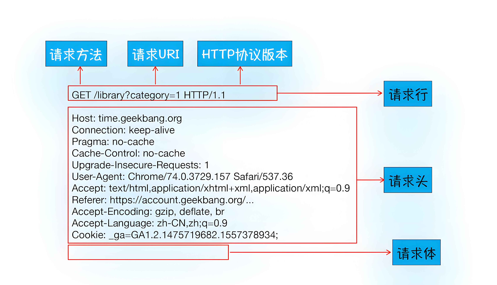
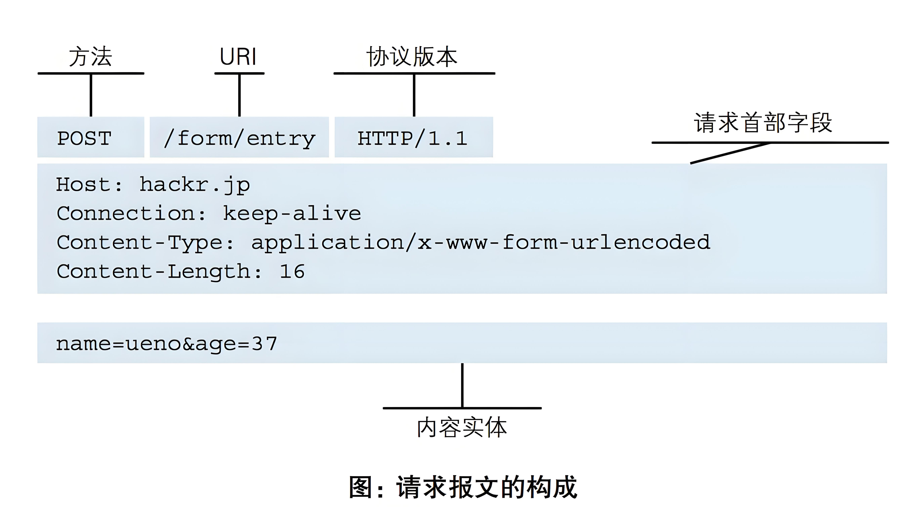

# API开发

## 一 API 概述

### 1.1 什么是 API

#### 定义

API（应用程序接口，Application Programming Interface）是一组定义了软件组件之间交互的规则和协议。它允许不同的软件系统、应用程序或服务相互通信并互换数据。API 可以是公开的，也可以是内部的，通常以文档的形式提供，描述如何使用接口和可用的功能。

#### API 的作用

- **功能调用**：API 提供了调用特定功能的方法，例如获取数据或执行操作，而无需了解内部实现。
- **数据交换**：不同系统之间可以通过 API 交换数据，促进互操作性。
- **服务集成**：API 可以将不同的服务和应用程序集成在一起，使它们能够协同工作。

#### API 的类型

- **Web API**：通过 HTTP 协议访问的接口，通常用于 web 应用程序与服务器之间的通信（如 RESTful 和 SOAP API）。
- **Library API**：提供给开发者的编程库接口，允许程序调用库中的功能（如 Java 的标准库 API）。
- **Operating System API**：操作系统提供的接口，允许应用程序与操作系统进行交互（如 Windows API 和 POSIX）。

### 1.2 API 的重要性

#### 提高开发效率

- **复用性**：开发者可以利用现有的 API 实现特定功能，而无需从头开始编写代码。
- **快速开发**：API 可以加速开发过程，开发者可以专注于应用程序的核心功能。

#### 促进系统集成

- **跨平台兼容性**：API 使得不同平台和技术栈的系统能够有效地集成和协同工作，增强了系统的灵活性。
- **模块化设计**：通过 API，可以将复杂的系统分解为多个模块，便于管理和维护。

#### 促进数据共享

- **数据访问**：API 允许多个应用程序安全地访问共享数据，从而实现数据的集中管理和使用。
- **开放性**：开放的 API 促进了数据的共享和创新，使开发者能够构建新的应用程序和服务。

通过理解 API 的概念、作用和重要性，开发者能够更好地利用 API 来提高应用程序的功能和效率。

### 1.3 API一览

关于字典补充：


#### 天气预报数据解析

```python
# http://yiketianqi.com/
# https://v1.yiketianqi.com/api?unescape=1&version=v91&appid=47284135&appsecret=jlmX3A6s&ext=&cityid=&city=
```


## 二 HTTP协议

HTTP协议是Hyper Text Transfer Protocol（超文本传输协议）的缩写,是用于万维网（WWW:World Wide Web ）服务器与本地浏览器之间传输超文本的传送协议。HTTP是一个属于应用层的面向对象的协议，由于其简捷、快速的方式，适用于分布式超媒体信息系统。它于1990年提出，经过几年的使用与发展，得到不断地完善和扩展。HTTP协议工作于客户端-服务端架构为上。浏览器作为HTTP客户端通过URL向HTTP服务端即WEB服务器发送所有请求。Web服务器根据接收到的请求后，向客户端发送响应信息。


### 【1】最简单的web应用程序

```golang
import socket

sock = socket.socket()
sock.bind(("127.0.0.1", 8000))
sock.listen(3)

print("服务器已经启动...")
while 1:
    conn, addr = sock.accept()
    data = conn.recv(1024)
    print("data:", data)
    conn.send(b"HTTP/1.1 200 ok\r\n\r\nhello yuan")
    conn.close()
```

> 基于postman完成测试！

### 【2】HTTP协议特性

* 基于TCP/IP协议

* 基于请求－响应模式

* 无状态保存

* 短连接和长连接

  HTTP1.0默认使用的是短连接。浏览器和服务器每进行一次HTTP操作，就建立一次连接，任务结束就中断连接。
  HTTP/1.1起，默认使用长连接。要使用长连接，客户端和服务器的HTTP首部的Connection都要设置为keep-alive，才能支持长连接。
  HTTP长连接，指的是复用TCP连接。多个HTTP请求可以复用同一个TCP连接，这就节省了TCP连接建立和断开的消耗。

### 【3】HTTP请求协议

HTTP协议包含由浏览器发送数据到服务器需要遵循的请求协议与服务器发送数据到浏览器需要遵循的请求协议。用于HTTP协议交互的信被为HTTP报文。

**HTTP 请求协议**：定义了客户端如何向服务器发起请求，包括请求的格式、方法和头信息。

**HTTP 响应协议**：定义了服务器如何向客户端返回请求的结果，包括状态信息和所请求的数据。

* 一个完整的URL包括：协议、ip、端口、路径、参数  
* 请求方式
  * 增（post请求）
  * 删（delete请求）
  * 改（put请求）
  * 查（get请求）


HTTP 请求通常由以下部分组成：

- **请求行**：包括 HTTP 方法（如 GET、POST）、请求 URL 和 HTTP 版本。
- **请求头**：包含有关请求的元数据，例如 `Content-Type`、`User-Agent` 等。
- **请求体**（可选）：在某些请求方法（如 POST）中，包含要发送的数据。

请求协议格式：





* GET请求请求参数通常附加在 URL 中，通过 `?` 和 `&` 分隔。例如：`https://example.com/api?name=John&age=30`。

* POST 请求请求参数包含在请求体中，而不是 URL 中。这使得可以传递大量数据，可以处理多种类型的数据，比如 JSON、XML、表单数据等。

### 【4】HTTP响应协议

HTTP 响应协议是指服务器对客户端请求的反馈，包含请求的处理结果和所请求资源的信息。

HTTP 响应通常由以下部分组成：

- **状态行**：包含 HTTP 版本、状态码和状态描述。
- 响应头：包含关于响应的信息，例如：
  - `Content-Type`：响应体的数据格式（如 JSON、HTML）。
  - `Content-Length`：响应体的长度。
- **响应体**：实际返回的数据，可以是 HTML、JSON 或其他格式。

常见状态码：


响应协议格式：

-3678513.jpeg)


### 【5】响应HTML与JSON


HTML

- **用途**：主要用于在浏览器中显示内容，构建用户界面。
- **格式**：使用标记语言（HTML tags）来描述页面结构和样式。
- **可视化**：浏览器直接渲染 HTML，用户可以看到页面内容。

 JSON

- **用途**：主要用于数据交换，尤其是在客户端与服务器之间传递数据。
- **格式**：采用键值对的结构，易于解析和生成。
- **可读性**：JSON 数据通常是人类可读的，适合机器处理。

何时使用 HTML 和 JSON

- **使用 HTML**：当需要向用户展示页面内容时。例如，加载一个网页或显示用户界面。
- **使用 JSON**：当需要在客户端和服务器之间交换数据时。例如，AJAX 请求、API 响应等。

理解 HTTP 请求和响应中 HTML 和 JSON 的使用场景和结构，对于开发现代 web 应用程序至关重要。HTML 用于展示内容，而 JSON 更适合数据交换。根据具体需求选择合适的格式，可以提高应用的性能和用户体验。

## 三 构建第一个 API

在本节中，我们将使用 FastAPI 框架构建一个简单的 RESTful API。我们将使用模拟数据来代替数据库，API 将管理用户信息，包括基本的 CRUD（创建、读取、更新、删除）操作。

首先，确保你已安装 FastAPI 和 Uvicorn。如果没有，请使用以下命令安装：

```apl
pip install fastapi uvicorn
```

### 完整的 API 代码

```python
from fastapi import FastAPI, HTTPException
from pydantic import BaseModel
from typing import List

app = FastAPI()

# 模拟数据库
users = []

# 数据模型
class User(BaseModel):
    id: int
    name: str
    email: str


# 获取用户列表
@app.get("/users", response_model=List[User])
def get_users():
    return users


# 创建新用户
@app.post("/users", response_model=User)
def create_user(user: User):
    users.append(user)
    return user


# 更新用户信息
@app.put("/users/{user_id}", response_model=User)
def update_user(user_id: int, user: User):
    for index, existing_user in enumerate(users):
        if existing_user.id == user_id:
            users[index] = user
            return user
    raise HTTPException(status_code=404, detail="User not found")


# 删除用户
@app.delete("/users/{user_id}")
def delete_user(user_id: int):
    for index, existing_user in enumerate(users):
        if existing_user.id == user_id:
            users.pop(index)
            return {"message": "User deleted"}
    raise HTTPException(status_code=404, detail="User not found")


if __name__ == "__main__":
    import uvicorn

    uvicorn.run(app, host="127.0.0.1", port=8000)

```

### 代码解释

- **导入库**：引入 FastAPI、HTTPException 和 Pydantic 的 BaseModel。
- **创建 FastAPI 应用**：实例化一个 FastAPI 应用。
- **模拟数据库**：使用一个列表 `users` 来模拟用户数据存储。
- 定义数据模型：
  - 使用 Pydantic 的 `BaseModel` 定义 `User` 数据模型，包含 `id`、`name` 和 `email` 字段。
- 定义路由：
  - `GET /users`：返回用户列表，使用 `response_model` 指定返回类型。
  - `POST /users`：接收 JSON 数据并将新用户添加到列表中。
  - `PUT /users/{user_id}`：更新指定用户的信息，若找不到用户则返回 404 错误。
  - `DELETE /users/{user_id}`：删除指定的用户，若找不到用户则返回 404 错误。

### 运行 API

在终端中运行脚本后，API 将启动在 `http://127.0.0.1:8000/`。可以使用 Postman 或 curl 测试 API。

`curl` 是一个命令行工具，它允许你向服务器发送请求，并从服务器接收响应。它支持多种协议，包括 HTTP、HTTPS、FTP、SMTP 等。`curl` 是一个非常强大的工具，它可以用于测试、调试和开发。

```bash
# 1. 基本的 GET 请求:
# 使用 curl 发送一个基本的 GET 请求，只需提供 URL 即可。
curl  http://127.0.0.1:8000/users
# 包含头部信息的 GET 请求:
curl -i  http://127.0.0.1:8000/users

# 2. 基本的 POST 请求:

curl -H "Content-Type: application/json" -X POST -d '{"id":2,"name":"rain","email":"678@123.com"}' http://127.0.0.1:8000/users

# 3. 基本的 DELETE 请求:
curl -X DELETE http://127.0.0.1:8000/users/1

# 4. 基本的 PUT 请求:
curl -X PUT -d '{"id":2,"name":"yuan","email":"666@123.com"}' -H "Content-Type: application/json" http://127.0.0.1:8000/users/2
```

### 生成API文档

API 文档是描述应用程序编程接口（API）功能和使用方法的文档。它为开发者提供了必要的信息，使他们能够有效地使用、集成和维护 API。良好的 API 文档是成功 API 的重要组成部分。

#### 1. 文档的重要性

* 提高可用性

  - **自助服务**：用户可以根据文档独立查找信息，快速解决问题，而不需要频繁咨询开发者。

  - **减少错误**：清晰的文档帮助开发者避免常见错误，确保他们正确使用 API。

* 增强协作效率

  - **团队一致性**：文档为团队成员提供了统一的参考，确保大家对 API 的理解一致。

  - **快速集成**：外部开发者或团队可以根据文档迅速了解 API，减少沟通成本。

#### 2. 文档工具

* Swagger/OpenAPI
  - 功能：
    - 自动生成 API 文档。
    - 提供交互式界面，允许用户测试 API。
    - 支持多种编程语言。

* Postman
  - 功能：
    - 创建和保存 API 请求。
    - 自动生成文档，并提供分享功能。
    - 支持环境变量和测试脚本。

* Redoc
  - 功能：
    - 生成美观的 API 文档。
    - 提供良好的导航和响应式设计。
    - 支持代码示例和多种语言高亮显示。

FastAPI 基于 OpenAPI 规范，自动生成 API 文档，并提供以下两种主要的文档界面：

1. **Swagger UI**：提供交互式文档，用户可以直接在浏览器中测试 API。
   - 访问地址：`http://127.0.0.1:8000/docs`
2. **ReDoc**：提供更为详细和美观的文档展示，适合查看 API 的结构和参数。
   - 访问地址：`http://127.0.0.1:8000/redoc`


