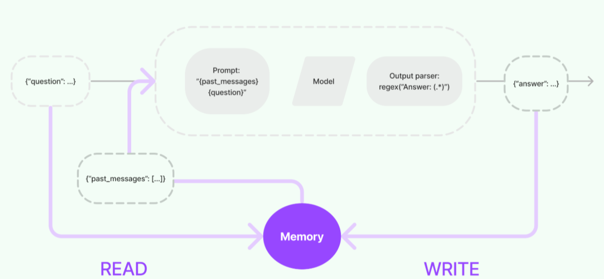

## 缓存机制

Langchain为LLMs提供了可选的缓存层。这个很有用，原因是：

- 如果经常向模型多次请求提问相同的内容，Caching缓存可以减少对LLM进行API调用次数来提升程序运行效率。

**Caching缓存**

具体实现：

- 设置一个内存缓存（InMemoryCache）来缓存大型语言模型（LLM）的调用结果，以提高后续相同请求的处理速度。

```python
from langchain.globals import set_llm_cache #用于设置全局的LLM缓存机制。
from langchain.cache import InMemoryCache #将缓存数据存储在内存中，而不是磁盘上
set_llm_cache(InMemoryCache()) #使用内存缓存来存储和检索LLM的调用结果。
```

第一次向模型进行提问：耗时较久，但是会讲提问内容加入到缓存中

```python
from langchain_openai import OpenAI
from langchain_openai import ChatOpenAI
#提示词作用到模型进行聊天记录总结
API_KEY = "sk-4b79xxxx935366ebb425b3"
chat = ChatOpenAI(
    model_name="deepseek-chat",
    api_key=API_KEY,
    base_url="https://api.deepseek.com"
)

response = chat.invoke("3只鸭子几条腿？")
response.content
```

再次提问相同内容，直接基于缓存内容进行回复，响应速度快

```python
response = chat.invoke("3只鸭子几条腿？")
response.content
```

**SQLite缓存**

具体实现：

设置一个SQLite缓存来缓存大型语言模型（LLM）的调用结果，以提高后续相同请求的处理速度。

```python
from langchain.cache import SQLiteCache
set_llm_cache(SQLiteCache(database_path="./langchain.db"))

#加入问答到缓存中
response = chat.invoke("讲一个10个字的故事？")
response.content
```

基于缓存进行快速响应

```python
response = chat.invoke("讲一个10个字的故事？")
response.content
```

## 输出解析器

输出解析器（Output Parser）在提示词工程中扮演着重要角色。让我们更详细地探讨它的两大功能以及为什么它与提示词模板有关系。

**输出解析器的功能：**

输出解析器的一个关键功能是向现有的提示词模板中添加输出指令。这些指令告诉语言模型应该如何格式化和结构化生成的输出内容。例如：

- **JSON格式**：`"请以JSON格式输出以下信息：{ "name": "用户姓名", "age": "用户年龄" }"`
- **HTML格式**：`"请以HTML格式输出以下信息：<div>用户姓名: 用户名</div><div>用户年龄: 用户年龄</div>"`
- **纯文本格式**：`"请以纯文本格式输出以下信息：姓名: 用户名, 年龄: 用户年龄"`

通过添加这些输出指令，输出解析器确保模型按照指定的格式生成输出，而不是仅仅返回原始数据。

**预设的 LangChain 输出解析器**

LangChain 提供了一堆预设的输出解析器，这些解析器真的超实用，包括：

1. **BooleanOutputParser**：这个解析器专门用于解析布尔值（即对错、真假）的输出。例如，当模型输出是 True 或 False 时，该解析器可以准确识别和处理。
2. **CommaSeparatedListOutputParser**：此解析器用于解析以逗号分隔的列表输出。比如，当模型返回一个由逗号分隔的字符串时，这个解析器可以将其转换为一个列表。
3. **DatetimeOutputParser**：该解析器用于处理日期和时间的输出。它能够将模型生成的日期时间字符串解析为标准的日期时间格式，方便后续处理。
4. **EnumOutputParser**：枚举类型的输出可以通过这个解析器来处理。枚举类型通常是指有限个选项的类型，比如星期几、颜色等，这个解析器能够准确识别并转换这些输出。
5. **ListOutputParser**：当输出是一个列表时，无论是什么类型的列表，都可以使用这个解析器进行解析。它能将模型生成的列表字符串转换为实际的列表对象。
6. **PydanticOutputParser**：如果你的输出需要符合 Pydantic 的要求（Pydantic 是一个用于数据验证和转换的库），那么这个解析器就能派上用场。它可以确保输出数据符合预定义的数据模型和验证规则。
7. **StructuredOutputParser**：对于具有特定结构的输出，这个解析器可以大显身手。它能够处理复杂的结构，并将模型生成的结构化数据解析为易于使用的格式。

**CommaSeparatedListOutputParser列表输出解析器示例**

```python
from langchain_openai import ChatOpenAI
from langchain.output_parsers import CommaSeparatedListOutputParser
from langchain.prompts import PromptTemplate
#构造列表解析器
output_parser = CommaSeparatedListOutputParser()
#返回解析器的解析格式
output_parser.get_format_instructions()
```

注意：所有解析器的解析格式都是英文的，上述列表解析器解析格式的英文翻译是：`您的响应应该是逗号分隔的值列表，例如：`foo，bar，baz`或`foo，bar，baz`。也就是通过解析器的该种解析格式作为提示词的部分内容，约束模型按照指定格式进行内容的输出。

- 解析器作用在PromptTemplate模版中

  ```python
  #构造输入模版，这里的区别是：在输入的Prompt Template中，加入了OutPut Parse的内容
  template = """用户发起的提问:
  
  {question}
  
  {format_instructions}"""
  
  #实例化输出解析器（用于解析以逗号分隔的列表类型的输出）
  output_parser = CommaSeparatedListOutputParser()
  
  #创建提示词模版，将输出解析器的解析格式作为提示词模版的部分内容
  prompt = PromptTemplate.from_template(
      template,
      partial_variables={"format_instructions":
                         output_parser.get_format_instructions()},
  )
  
  
  #最后，使用LangChain中的`chain`的抽象，合并最终的提示、大模型实例及OutPut Parse共同执行。
  API_KEY = "sk-4b79f3a3xxxa1935366ebb425b3"
  
  model = ChatOpenAI(model="deepseek-chat",
                     openai_api_key=API_KEY,
                     openai_api_base="https://api.deepseek.com")
  
  chain = prompt | model | output_parser
  output = chain.invoke({"question": "列出北京的三个景点"})
  output
  ```

  - LCEL： LangChain Execution Language（LangChain 表达语⾔）是⼀种声明性的⽅式来链接 LangChain 组件（工作流）。 

- 解析器作用在ChatPromptTemplate模版中

  ```python
  from langchain_openai import ChatOpenAI
  from langchain.output_parsers import CommaSeparatedListOutputParser
  from langchain.prompts import ChatPromptTemplate
  
  #构建提示词模版
  prompt = ChatPromptTemplate.from_messages([
      ("system", "{parser_instructions}"),
      ("human", "列出{cityName}的{viewPointNum}个著名景点。")
  ])
  
  #构建输出解析器并获取解析格式
  output_parser = CommaSeparatedListOutputParser()
  parser_instructions = output_parser.get_format_instructions()
  
  #动态补充提示词内容
  final_prompt = prompt.invoke({"cityName": "南京", "viewPointNum": 3, 
                                "parser_instructions": parser_instructions})
  
  #最后，使用LangChain中的`chain`的抽象，合并最终的提示、大模型实例及OutPut Parse共同执行。
  API_KEY = "sk-4b79f3axxx1935366ebb425b3"
  model = ChatOpenAI(model="deepseek-chat",
                     openai_api_key=API_KEY,
                     openai_api_base="https://api.deepseek.com")
  
  
  response = model.invoke(final_prompt)
  ret = output_parser.invoke(response)
  print(ret)
  ```

**DatetimeOutputParser时间输出解析器示例**

```python
from langchain.output_parsers import DatetimeOutputParser#日期输出解析器
from langchain.prompts import PromptTemplate

#制定输出解析器
output_parser = DatetimeOutputParser()

#制定提示词模版
template = """回答用户的问题：
{question}

{format_instructions}"""

#时间解析器的解析格式
format_instructions = output_parser.get_format_instructions()

#补充提示词模版
prompt = PromptTemplate.from_template(
    template,
    partial_variables={"format_instructions":format_instructions}
)

API_KEY = "sk-4b79f3axxx1935366ebb425b3"
model = ChatOpenAI(model="deepseek-chat",
                   openai_api_key=API_KEY,
                   openai_api_base="https://api.deepseek.com")

chain = prompt | model | output_parser
output = chain.invoke("周杰伦是什么时候出道的？")
output
```

**EnumOutputParser枚举输出解析器示例**

```python
from langchain.output_parsers.enum import EnumOutputParser
from enum import Enum

#定义枚举类型
class Colors(Enum):
    RED = "红色"
    BROWN = "棕色"
    BLACK = "黑色"
    WHITE = "白色"
    YELLOW = "黄色"
    
#制定输出解析器
parse = EnumOutputParser(enum=Colors)

#制定提示词模版
promptTemplate = PromptTemplate.from_template(
    """{person}的皮肤主要是什么颜色？
    
    {instructions}"""
)
#解析器的解析格式:原本解析器的英文解析格式会报错
# instructions = parse.get_format_instructions() 
instructions = "响应结果请选择以下选项之一：红色、棕色、黑色、白色和黄色。"
#提示词部分补充
prompt = promptTemplate.partial(instructions=instructions)

chain = prompt | model | parse
chain.invoke({"person":"亚洲人"})
```

**注意：**直接使用输出解析器原始的英文的解析格式作用到提示词中可能由于中英文掺杂和中英文语义的区别导致模型报错，因此，可以适当将输出解析器的解析格式手动翻译成英文后再用！

**Pydantic JSON 输出解析器**

JSON输出解析器允许用户指定任意JSON架构并查询LLMs以获取符合该框架的输出。

```python
from langchain_openai import ChatOpenAI
from langchain_core.output_parsers import JsonOutputParser
from langchain_core.pydantic_v1 import BaseModel,Field
from langchain.prompts import PromptTemplate
from typing import List

#定义JSON结构
class Book(BaseModel):
    title:str = Field(description="书名")
    author:str = Field(description="作者")
    description:str = Field(description="书的简介")
    beLike:List[str] = Field(description="相关书籍的名称")
    
query = "请给我介绍下中国历史的经典书籍"

parser = JsonOutputParser(pydantic_object=Book)

format_instructions = parser.get_format_instructions()
# format_instructions = '''输出应格式化为符合以下JSON模式的JSON实例。JSON结构如下：{"title":"标题","author":"作者","description":"书的简介"}'''
prompt = PromptTemplate(
    template="{format_instructions}\n{query}\n",
    input_variables=["query"],
    partial_variables={"format_instructions":format_instructions}
)

chain = prompt | model | parser
chain.invoke({"query":query})
```

**xml输出解析器**

```python
from langchain_openai import ChatOpenAI
from langchain_core.prompts import PromptTemplate
from langchain_core.output_parsers import XMLOutputParser

API_KEY = "sk-4b79f3axxx935366ebb425b3"
model = ChatOpenAI(
    model_name="deepseek-chat",
    api_key=API_KEY,
    base_url="https://api.deepseek.com"
)

# 还有⼀个⽤于提示语⾔模型填充数据结构的查询意图。
actor_query = "⽣成周星驰的简化电影作品列表，按照最新的时间降序"

# 设置解析器 + 将指令注⼊提示模板。
parser = XMLOutputParser()
prompt = PromptTemplate(
    template="回答⽤户的查询。\n{format_instructions}\n{query}\n",
    input_variables=["query"],
    partial_variables={"format_instructions": parser.get_format_instructions()},
)
# print(parser.get_format_instructions())

chain = prompt | model
response = chain.invoke({"query": actor_query})
xml_output = parser.parse(response.content)
print(response.content)
```

**自定义输出解析器**

在某些情况下，我们可以实现自定义解析器以将模型输出内容构造成自定义的格式。

```python
from typing import Iterator
from langchain_core.messages import AIMessage,AIMessageChunk

#自定义输出解析器
def parse(ai_message:AIMessage)->str:
    #函数参数就是模型的输出。
    #swapcase表示将模型输出内容大小写进行相互转换后进行返回
    return ai_message.content.swapcase()

chain = model | parse
response = chain.invoke("are you ok?")
response
```

## 记忆模块Memory

在最开始我们就通过实验知道LLM 本身是没有记忆的，每一次LLM的API调用都是一个全新的会话。但在某些应用程序中，如：聊天机器人，让LLM记住以前的历史交互是非常重要，无论是在短期的还是长期的。langchain中的“Memory”即对话历史（message history）就是为了实现这一点。



在与大模型进行对话和交互的过程中，一个关键步骤是能够引用交互过程中先前的信息，至少需要能够直接回溯到过去某些对话的内容。对于复杂应用而言，所需的是一个能够不断自我更新的模型，以便执行如维护相关信息、实体及其关系等任务。这种存储并回溯过去交互信息的能力，就叫做“记忆（Memory）”。

Memory作为存储记忆数据的一个是抽象模块，其作为一个独立模块使用是没有任何意义的，因为本质上它的定位就是一个存储对话数据的空间。

**LangChain Memory 的作用**

- 上下文管理：通过保存历史对话，模型可以基于之前的对话内容来生成更相关的响应。
- 状态跟踪：对于需要持续跟踪用户状态的应用程序来说，Memory 可以帮助维护会话的状态信息。
- 个性化体验：通过记录用户的偏好或历史选择，可以提供更加个性化的用户体验。

**ChatMessageHistory-对话消息历史管理**

在LangChain中，ChatMessageHistory通常是一个数据结构，用于存储和检索对话消息。这些消息可以按照时间顺序排列，以便在对话过程中引用和更新。

```python
# 初始化大模型
from langchain_openai import ChatOpenAI
from langchain.prompts import ChatPromptTemplate, MessagesPlaceholder

# 本地ollama拉取过什么模型就使用什么模型
API_KEY = "sk-4b79f3axxx35366ebb425b3"
llm = ChatOpenAI(model="deepseek-chat",
                   openai_api_key=API_KEY,
                   openai_api_base="https://api.deepseek.com")

# 聊天模型提示词
template = [
    MessagesPlaceholder(variable_name="history"),
]
prompt = ChatPromptTemplate.from_messages(messages=template)
chain = prompt | llm

# 记录会话历史
from langchain_community.chat_message_histories import ChatMessageHistory
from langchain_core.messages import SystemMessage

history = ChatMessageHistory()
history.messages = [SystemMessage("你是由John开发的智能助手机器人，叫多啦A梦，你每次都会精简而快速的告诉用户你是一个专业的机器人以及用户问题的答案。")]
history.add_user_message("我叫John，请你记住。")
history.add_user_message("我叫什么名字，以及你叫什么名字？")
res = chain.invoke({"history": history.messages})
history.add_ai_message(res)
print(res.content)

history.add_user_message("我现在改名了，叫Johnny，请问我是谁？")
res = chain.invoke({"history": history.messages})
history.add_ai_message(res)
print(res.content)
for message in history.messages:
    print("会话记录",message.content)
```

**多个用户多轮对话**

有了对话消息历史管理对象，不仅可以管理和存储单个用户和LLM的历史对话信息以此来维持会话状态，还可以实现管理多用户与LLM的独立历史对话信息。

```python
# 初始化大模型
from langchain_openai import ChatOpenAI
from langchain.prompts import ChatPromptTemplate, MessagesPlaceholder

# 本地ollama拉取过什么模型就使用什么模型
API_KEY = "sk-4b79fxxx935366ebb425b3"
llm = ChatOpenAI(model="deepseek-chat",
                   openai_api_key=API_KEY,
                   openai_api_base="https://api.deepseek.com")

# 聊天模型提示词
from langchain.prompts import ChatPromptTemplate, MessagesPlaceholder
template = [
    ("system",
     "你叫多啦A梦,今年1岁了，是John开发的智能机器人，能精准回复用户的问题"),
    MessagesPlaceholder(variable_name="history"),
]
prompt = ChatPromptTemplate.from_messages(messages=template)
chain = prompt | llm

# 记录会话历史
from langchain_community.chat_message_histories import ChatMessageHistory

#session_id设置不同的消息集
john_history = ChatMessageHistory(session_id="John")
john_history.add_user_message('我叫John，今年100岁,很高兴和你聊天')
john_res = chain.invoke({"history": john_history.messages})
john_history.add_ai_message(john_res)
print(john_res.content)
print('=======================================')

Yuki_history = ChatMessageHistory(session_id="Yuki")
Yuki_history.add_user_message('你好呀，我的名字叫Yuki，我今年200岁。你叫什么？')
Yuki_res = chain.invoke({"history": Yuki_history.messages})
Yuki_history.add_ai_message(Yuki_res)
print(Yuki_res.content)
print('=======================================')

john_history.add_user_message("你还记得我的名字和年龄吗？")
john_res = chain.invoke({"history": john_history.messages})
john_history.add_ai_message(john_res)
print(john_res.content)
print('=======================================')

Yuki_history.add_user_message("你还记得我的名字和年龄吗？")
Yuki_res = chain.invoke({"history": Yuki_history.messages})
Yuki_history.add_ai_message(Yuki_res)
print(Yuki_res.content)
print('=======================================')
```

**RunnableWithMessageHistory-可运行的消息历史记录对象**

上面虽然使用了ChatMessageHistory保存对话历史数据，但是与Chains的操作是独立的，并且每次产生新的对话消息都要手动add添加记录，所以为了方便使用，langchain还提供了RunnableWithMessageHistory可以自动为Chains添加对话历史记录。

```python
# 初始化大模型
from langchain_openai import ChatOpenAI
from langchain.prompts import ChatPromptTemplate, MessagesPlaceholder
from langchain_core.output_parsers import StrOutputParser

# 本地ollama拉取过什么模型就使用什么模型
API_KEY = "sk-4b79f3xxx1935366ebb425b3"
llm = ChatOpenAI(model="deepseek-chat",
                   openai_api_key=API_KEY,
                   openai_api_base="https://api.deepseek.com")

# 聊天模型提示词
template = [
    ("system",
     "你叫多啦A梦,今年1岁了，是John开发的智能机器人，能精准回复用户的问题"),
    MessagesPlaceholder(variable_name="history"),
    ("human", "{input}"),
]
prompt = ChatPromptTemplate.from_messages(messages=template)
chain = prompt | llm | StrOutputParser()

# 记录会话历史
from langchain_core.runnables.history import RunnableWithMessageHistory
from langchain_community.chat_message_histories import ChatMessageHistory
# 用于记录不同的用户(session_id)对话历史
store = {}
def get_session_history(session_id):
    if session_id not in store:
        store[session_id] = ChatMessageHistory()
    return store[session_id]


chains = RunnableWithMessageHistory(
    chain,
    get_session_history,
    input_messages_key="input",
    history_messages_key="history",
)

res1 = chains.invoke({"input": "什么是余弦相似度?"}, config={'configurable': {'session_id': 'john'}})
print(res1)
print('====================================================')
res2 = chains.invoke({"input": "再回答一次刚才的问题"}, config={'configurable': {'session_id': 'john'}})
print(res2)
```

**ConversationChain中的记忆**

ConversationChain提供了包含AI角色和人类角色的对话摘要格式，这个对话格式和记忆机制结合得非常紧密。ConversationChain实际上是对Memory和LLMChain进行了封装，简化了初始化Memory的步骤。

``该方法已经在langchain1.0版本废除，使用RunnableWithMessageHistory对其进行替代！``

```python
# 初始化大模型
from langchain_openai import ChatOpenAI

# 本地ollama拉取过什么模型就使用什么模型
API_KEY = "sk-4b79f3a3xxx935366ebb425b3"
llm = ChatOpenAI(model="deepseek-chat",
                   openai_api_key=API_KEY,
                   openai_api_base="https://api.deepseek.com")

# 导入所需的库
from langchain.chains.conversation.base import ConversationChain
# 初始化对话链
conv_chain = ConversationChain(llm=llm)

# 打印对话的模板
print(conv_chain.prompt.template)
```

ConversationChain中的内置提示模板中的两个参数：

- {history}：存储会话记忆的地方，也就是人类和人工智能之间对话历史的信息。

- {input} ：新输入的地方，可以把它看成是和ChatGPT对话时，文本框中的输入。

**缓冲记忆：ConversationBufferMemory**

在LangChain中，ConversationBufferMemory是一种非常简单的缓冲记忆，可以实现最简单的记忆机制，它只在缓冲区中保存聊天消息列表并将其传递到提示模板中。

通过记忆机制，LLM能够理解之前的对话内容。直接将存储的所有内容给LLM，因为大量信息意味着新输入中包含更多的Token，导致响应时间变慢和成本增加。此外，当达到LLM的Token数限制时，太长的对话无法被记住。

```python
#用于创建对话链
from langchain.chains import ConversationChain
#用于存储对话历史，以便在后续对话中参考
from langchain.memory import ConversationBufferMemory

from langchain_openai import ChatOpenAI
import warnings
warnings.filterwarnings("ignore")

# 初始化大模型（需配置OPENAI_API_KEY）
API_KEY = "sk-4b79f3axxx935366ebb425b3"
llm = ChatOpenAI(model="deepseek-chat",
                   openai_api_key=API_KEY,
                   openai_api_base="https://api.deepseek.com")

#实例化一个对话缓冲区，用于存储对话历史
memory = ConversationBufferMemory()
#创建一个对话链，将大语言模型和对话缓冲区关联起来。
conversation = ConversationChain(
    llm=llm,
    memory=memory,
)

conversation.invoke("今天早上猪八戒吃了2个人参果。")
print("记忆1: ", conversation.memory.buffer)
print()

conversation.invoke("下午猪八戒吃了1个人参果。")
print("记忆2: ", conversation.memory.buffer)
print()

conversation.invoke("晚上猪八戒吃了3个人参果。")
print("记忆3: ", conversation.memory.buffer)
print()

conversation.invoke("猪八戒今天一共吃了几个人参果？")
print("记忆4: ", conversation.memory.buffer)
```

**功能设计：多轮对话**

```python
from langchain.chains import ConversationChain
from langchain.memory import ConversationBufferMemory
from langchain_openai import ChatOpenAI
import warnings
warnings.filterwarnings("ignore")

# 实例化一个对话缓冲区，用于存储对话历史
memory = ConversationBufferMemory()
# 创建一个对话链，将大语言模型和对话缓冲区关联起来。
conversation = ConversationChain(
    llm=llm,
    memory=memory,
)

print("欢迎使用对话系统！输入 '退出' 结束对话。")

while True:
    user_input = input("你: ")
    if user_input.lower() in ['退出', 'exit', 'quit']:
        print("再见！")
        break
    response = conversation.predict(input=user_input)
    print(f"AI: {response}")

# 打印出对话历史，即 memory.buffer 的内容
print("对话历史:", memory.buffer)
```

**携带提示词模版的对轮对话(LLMChain对话链)**

```python
from langchain.prompts import PromptTemplate
from langchain.chains import LLMChain
from langchain.memory import ConversationBufferMemory
from langchain_openai import ChatOpenAI
import os
import warnings
warnings.filterwarnings("ignore")

# 初始化大模型
API_KEY = "sk-4b79f3a3fxxx1935366ebb425b3"
llm = ChatOpenAI(
    model="deepseek-chat",
    openai_api_key=API_KEY,
    openai_api_base="https://api.deepseek.com"
)

# 实例化一个对话缓冲区，用于存储对话历史
memory = ConversationBufferMemory()

# 定义提示词模板
template = """{history}
用户: {input}
AI:"""

prompt_template = PromptTemplate(
    input_variables=["history", "input"],
    template=template
)

# 创建一个包含提示词模板的对话链
conversation = LLMChain(
    llm=llm,
    prompt=prompt_template,
    verbose=True,  # 如果需要调试，可以设置为 True
    memory=memory
)

print("欢迎使用对话系统！输入 '退出' 结束对话。")

while True:
    user_input = input("你: ")
    if user_input.lower() in ['退出', 'exit', 'quit']:
        print("再见！")
        break
    try:
        # 调用对话链获取响应
        response = conversation.run(input=user_input)
        print(f"AI: {response}")
    except Exception as e:
        print(f"发生错误: {e}")

# 打印出对话历史，即 memory.buffer 的内容
print("对话历史:", memory.buffer)
```

如果使用聊天模型，使用结构化的聊天消息可能会有更好的性能:

```python
from langchain_openai import ChatOpenAI
from langchain.memory import ConversationBufferMemory
from langchain.chains.llm import LLMChain
from langchain_core.messages import SystemMessage
from langchain_core.prompts import MessagesPlaceholder, HumanMessagePromptTemplate, ChatPromptTemplate
import warnings
warnings.filterwarnings("ignore")

# 初始化大模型
API_KEY = "sk-4b79f3a3xxxa1935366ebb425b3"
llm = ChatOpenAI(
    model="deepseek-chat",
    openai_api_key=API_KEY,
    openai_api_base="https://api.deepseek.com"
)

# 使用ChatPromptTemplate设置聊天提示
prompt = ChatPromptTemplate.from_messages(
    [
        SystemMessage(content="你是一个与人类对话的机器人。"),
        MessagesPlaceholder(variable_name="chat_history"),
        HumanMessagePromptTemplate.from_template("{question}"),
    ]
)

# 创建ConversationBufferMemory
memory = ConversationBufferMemory(memory_key="chat_history", return_messages=True)

# 初始化链
chain = LLMChain(llm=llm,  prompt=prompt, memory=memory)

# 提问
res = chain.invoke({"question": "你是LangChain专家"})
print(str(res) + "\n")    

res = chain.invoke({"question": "你是谁?"})
print(res)
```

**多轮对话Token限制解决**

在了解了`ConversationBufferMemory`记忆类后，我们知道了它能够无限的将历史对话信息填充到History中，从而给大模型提供上下文的背景。但问题是：每个大模型都存在最大输入的Token限制，且过久远的对话数据往往并不能够对当前轮次的问答提供有效的信息，这种我们大家都能非常容易想到的问题，LangChain的开发人员自然也能想到，那么他们给出的解决方式是：`ConversationBufferWindowMemory`模块。该记忆类会保存一段时间内对话交互的列表，仅使用最后 K 个交互。所以它可以保存最近交互的滑动窗口，避免缓存区不会变得太大。

```python
from langchain.memory import ConversationBufferWindowMemory
import warnings
warnings.filterwarnings("ignore")

#实例化一个对话缓冲区，用于存储对话历史
    #k=1，所以在读取时仅能提取到最近一轮的记忆信息
    #return_messages=True参数，将对话转化为消息列表形式
memory = ConversationBufferWindowMemory(k=1, return_messages=True)

conversation = ConversationChain(
    llm=llm,
    memory=memory,
)

# 示例对话
response1 = conversation.predict(input="你好")
response2 = conversation.predict(input="你在哪里？")
print("对话历史:", memory.buffer)
```

**实体记忆：ConversationEntityMemory**

在LangChain 中,ConversationEntityMemory是实体记忆,它可以跟踪对话中提到的实体，在对话中记住关于特定实体的给定事实。它提取关于实体的信息（使用LLM），并随着时间的推移建立对该实体的知识（使用LLM）。

使用它来存储和查询对话中引用的各种信息,比如人物、地点、事件等。

```python
from langchain.chains.conversation.base import ConversationChain
from langchain.memory import ConversationEntityMemory
from langchain.memory.prompt import ENTITY_MEMORY_CONVERSATION_TEMPLATE
from langchain_openai import OpenAI
import warnings
warnings.filterwarnings("ignore")

# 初始化大模型
API_KEY = "sk-4b79f3a3xxx1935366ebb425b3"
llm = ChatOpenAI(
    model="deepseek-chat",
    openai_api_key=API_KEY,
    openai_api_base="https://api.deepseek.com"
)


conversation = ConversationChain(
    llm=llm,
    prompt=ENTITY_MEMORY_CONVERSATION_TEMPLATE,
    memory=ConversationEntityMemory(llm=llm)
)

# 开始对话
conversation.predict(input="你好,我是小明。我最近在学习 LangChain。")
conversation.predict(input="我最喜欢的编程语言是 Python。")
conversation.predict(input="我住在北京。")

# 查询对话中提到的实体
res = conversation.memory.entity_store.store
print(res)
```

## Agent开发

### 1 AI Agent 概念与架构

- Agent定义

咱们先来说说什么是Agent哈。简单来说，Agent就是一种能够自己做出决定、采取行动去达到某个目标的东西。它可以是一个软件程序，也可以是一个实体机器人啥的。反正就是能自己主动去干事儿的那种。

那AI Agent又是什么呢？它呀，是基于人工智能技术，特别是大模型技术造出来的智能实体。这个智能实体可不简单，它能感知周围的环境，理解各种信息，然后根据这些信息做出行动，目的就是为了完成某个特定的目标。比如说，它可以帮你自动回复邮件，或者从一堆数据里找出你想要的信息。

- Agents 利用 LLM 作为推理引擎

接下来咱们聊聊Agents是怎么工作的。它们有个很厉害的本事，就是利用那种叫LLM（大语言模型）的东西作为推理引擎。这玩意儿可聪明了，能把你输入的自然语言，就像咱们平时说话那样的句子，转化成一系列的工具调用指令。然后呢，它还能协调这些工具一起工作，把任务给完成了。比如说，你想查点东西，你就告诉它，它就知道你要用哪个搜索引擎，怎么搜，最后把结果给你找出来。

这里面的核心思想就是让LLM自己来决定该先做哪个动作，该选哪个工具，而不是像以前那样，什么都得事先写好代码，让它按部就班地执行。这样多灵活啊，对吧？

- Agent模块在Langchain框架中的角色

再讲讲Agent模块在Langchain框架里是干啥的。Langchain是个很有名的框架，专门用来构建基于语言的应用。在这个框架里，Agent模块可是个重要角色。它负责实现那些智能代理的功能，就是让计算机能像人一样思考和行动。它怎么做到的呢？通过预设一些规则和算法，然后自动去执行特定的任务。比如说，你可以设定一些规则，让它在收到邮件时自动回复，或者在特定时间提醒你做某件事。

- Agent 模块的特点

最后说说Agent模块的特点吧。它有两个特别突出的地方：智能化和自动化。它能根据预设的规则和算法自己做出决策，然后去执行任务。这样一来，工作效率就高多了，而且准确性也更好。比如说，在处理大量数据时，它能快速准确地找出你需要的信息，比你自己去一个个看快多了。

- langchain.agents模块

`langchain.agents`模块是LangChain框架中的核心组件之一，主要用于构建能够自主决策和执行复杂任务的智能代理（Agent）。通常情况下，我们会基于agents模块下的``create_xml_agent``、``create_react_agent``和``tool``进行不同智能体的构建。

### 2 create_xml_agent构建智能体

在LangChain框架中,`create_xml_agent`函数主要用于创建一个能够处理XML格式数据交互的代理。它结合了语言模型（LLM）和其他工具，使得代理可以根据输入的指令和上下文信息，以XML格式进行思考、规划和与工具的交互，最终生成符合要求的输出

```create_xml_agent`的核心目标是创建一个能够处理XML格式数据的代理。这意味着代理的输入、输出以及中间的数据交互都基于XML格式，适合与返回XML响应的工具或服务进行交互(但是并不绝对！)``

LangChain框架本身具有高度的灵活性和可扩展性，`create_xml_agent`也不例外。它可以与其他工具和组件进行集成，根据具体的应用场景和需求，进一步扩展智能体的功能。例如，可以结合搜索引擎工具获取外部信息，再通过XML代理对获取的信息进行整理和分析，最终生成符合要求的输出。

**示例操作：让智能体自动调用工具查找数据**

为了更好的理解Agent框架，让我们构建一个具有两个工具的Agent：一个用于在线查找内容，另一个用于查找指定城市的气象数据。

``SerpAPI是一个搜索引擎结果页面API，它允许开发者和研究人员通过编程方式获取Google、Bing、Yahoo和其他搜索引擎的搜素结果。使用SerpAPI，用户可以避免直接与搜索引擎进行交互（无需科学上网），从而避免了可能遇到的各种问题，例如：用户代理、请求限制等问题。``

环境安装：pip install google-search-results

官网进行API KEY的申请：https://serpapi.com/

上面注册不了，用这个网站注册：

https://serper.dev/signup

key:2694386d405bc7b92d36d41897accf7d27c3e2c1

[Serper - Playground](https://serper.dev/playground)

- 测试搜索效果

  ```python
  from langchain_community.utilities import SerpAPIWrapper
  serpapi_api_key = "60f286e601f4xxxc65e7a9b3ceb06a3f0dc8e0fe7ce56ec93d6274ccd"
  search = SerpAPIWrapper(serpapi_api_key=serpapi_api_key)
  search.run("周杰伦演唱会最新信息")
  ```

- 2个外部函数构建

  - 天气查询接口网站：https://www.seniverse.com/

  ```python
  def get_search_result(question):
      """
      互联网搜索函数
      :param question: 必要参数，字符串类型，用于表示在互联网上进行搜素的关键词或者搜索内容的简短描述，\
      :return：SerpAPI API根据参数question进行互联网搜索后的结果，其中包含了全部重要的搜索结果内容。
      """
      from langchain_community.utilities import SerpAPIWrapper
      serpapi_api_key = "60f286e601f44a26600e42cxxxa3f0dc8e0fe7ce56ec93d6274ccd"
      search = SerpAPIWrapper(serpapi_api_key=serpapi_api_key)
      result = search.run(question)
      return result
  
  import requests
  import json
  def get_weather(loc):
      """
      查询即时天气函数
      :param loc: 必要参数，字符串类型，用于表示查询天气的具体城市名称，\
      :return：查询即时天气的结果\
      返回结果对象类型为解析之后的JSON格式对象，并用字符串形式进行表示，其中包含了全部重要的天气信息
      """
      api_key = "SGkvDR94bWqZfdosf"
      url = f"https://api.seniverse.com/v3/weather/now.json?key={api_key}&location={loc}&language=zh-Hans&unit=c"
      response = requests.get(url)
      data = response.json()
      return json.dumps(data)
  
  get_weather("上海")
  ```

- 将外部函数封装成Agent可调用的工具对象

  ```python
  from langchain.agents import Tool
  searchTool = Tool(
      name = "get_search_result",
      description = "互联网搜索函数",
      func = get_search_result, 
  )
  
  from langchain.agents import Tool
  weatherTool = Tool(
      name = "get_weather",
      description = "查询指定城市的即时天气信息",
      func = get_weather, 
  )
  ```

- 定义Agent的工具列表

  ```python
  tools = [weatherTool,searchTool]
  ```

- 定义提示词模版

  ```python
  from langchain import hub
  prompt = hub.pull("hwchase17/xml-agent-convo")
  prompt.messages
  ```

- 创建大模型

  ```python
  from langchain_openai import ChatOpenAI
  API_KEY = "sk-4b79f3a3fxxx35366ebb425b3"
  llm = ChatOpenAI(model_name="deepseek-reasoner",
                    api_key=API_KEY,base_url="https://api.deepseek.com")
  ```

- 创建智能体

  ```python
  from langchain.agents import create_xml_agent
  agent = create_xml_agent(llm,tools,prompt)
  ```

- 执行智能体

  ```python
  from langchain.agents import AgentExecutor
  agent_executor = AgentExecutor(
      agent = agent,
      tools = tools,
      verbose = True
  )
  agent_executor.invoke({'input':"张杰演唱会"})
  agent_executor.invoke({'input':"请帮我查询ShangHai天气"})
  ```

### 3 create_sql_agent构建智能体

在LangChain中，`create_sql_agent`是一个用于创建能够与SQL数据库进行交互的代理（Agent）的函数。

`create_sql_agent`的主要作用是创建一个基于语言模型（LLM）的代理，该代理能够：

- **解析自然语言问题**：将用户输入的自然语言问题转换为可执行的SQL查询。
- **执行SQL查询**：与SQL数据库交互，执行生成的SQL语句。
- **返回查询结果**：将查询结果以用户友好的方式返回。

``通过`create_sql_agent`，用户可以使用自然语言与数据库进行交互，而无需编写复杂的SQL语句。``

**`create_sql_agent`的特点**

- **自然语言处理**：利用语言模型（如OpenAI的GPT）理解用户的自然语言输入，并将其转换为SQL查询。
- **动态SQL生成**：根据用户的问题动态生成SQL语句，支持复杂的查询逻辑。
- **错误处理**：如果生成的SQL语句有误，代理会尝试修正或重新生成查询。
- **灵活性**：可以与任何SQLAlchemy支持的SQL数据库（如MySQL、PostgreSQL、SQLite等）进行交互。
- **模块化**：通过工具集扩展功能，例如添加自定义工具或集成其他API。

`create_sql_agent`适用于以下场景：

- **数据分析和报告**：用户可以通过自然语言查询数据库，生成分析报告或提取数据。
- **业务决策支持**：企业可以利用代理快速从数据库中提取关键信息，辅助决策。
- **自动化任务**：将自然语言查询与数据库操作结合，实现自动化流程。
- **聊天机器人**：构建能够回答数据库相关问题的智能聊天机器人。
- **个人数据管理**：个人用户可以通过自然语言查询自己的数据库（如财务数据、健康数据等）。

```python
# 安装必要的依赖包
# pip install sqlalchemy 
# pip install pymysql
from langchain.agents import create_sql_agent, AgentExecutor, AgentType
from langchain.agents.agent_toolkits import SQLDatabaseToolkit
from langchain.llms import OpenAI
from langchain.sql_database import SQLDatabase
import os


# 配置数据库连接
db_user = "root"
db_password = "boboadmin"
db_host = "localhost"
db_name = "db001"
db = SQLDatabase.from_uri(f"mysql+pymysql://{db_user}:{db_password}@{db_host}/{db_name}")

# 初始化语言模型（LLM）
API_KEY = "sk-4b79f3a3ffxxx5366ebb425b3"
llm = ChatOpenAI(
    model="deepseek-chat",
    openai_api_key=API_KEY,
    openai_api_base="https://api.deepseek.com"
)

# 初始化工具集（Toolkit）
toolkit = SQLDatabaseToolkit(db=db, llm=llm)

# 创建 SQL 代理
agent_executor = create_sql_agent(
    llm=llm,
    toolkit=toolkit,
    agent_type=AgentType.ZERO_SHOT_REACT_DESCRIPTION,
)

# 定义自然语言问题
# question = "当前数据库中有几张表？这些表之间有什么关联或者联系吗？"
# question = "查询LC表中男女用户数量分别是多少"
question = "不同薪资等级对应的员工数量分别是多少？"

# 运行代理并获取结果
result = agent_executor.run(question)
print("查询结果:", result)
```

- 问题：create_sql_agent是如何理解mysql数据库库表的详细信息的？

  - `create_sql_agent` 依赖于工具集（Toolkit）来与数据库交互。工具集中包含了用于查询数据库元数据的工具，例如：
    - **获取表信息**：通过 SQL 语句 `SHOW TABLES;` 获取数据库中的所有表名。
    - **获取列信息**：通过 SQL 语句 `DESCRIBE table_name;` 或 `SHOW COLUMNS FROM table_name;` 获取表的列名、数据类型等信息。

- create_sql_agent 内部封装的提示词是什么内容？

  - `create_sql_agent` 是 LangChain 中用于创建 SQL 代理的函数，其内部封装的提示词（Prompt）通常是预定义的，用于指导语言模型（LLM）如何生成 SQL 查询。这些提示词是 LangChain 库的一部分，通常不会直接暴露给用户，但可以通过查看源码或文档来了解其内容。以下是 `create_sql_agent` 内部可能使用的提示词的示例，以及对其的翻译和解释：

    ```
    You are a helpful assistant that translates natural language questions into SQL queries. Here is the schema of the database:
    {schema}
    
    Given the question: "{question}", generate a valid SQL query to answer it. Make sure the query is correct and efficient.
    ```

  - **第一句**：

    - **原文**：`You are a helpful assistant that translates natural language questions into SQL queries.`
    - **翻译**：你是一个将自然语言问题翻译成 SQL 查询的助手。
    - **解释**：这句话明确了角色——语言模型的任务是将用户的自然语言问题转换为 SQL 查询。

  - **第二句**：

    - **原文**：`Here is the schema of the database: {schema}`
    - **翻译**：这是数据库的架构：{schema}。
    - **解释**：`{schema}` 是数据库的表结构信息（如表名、列名、数据类型等），语言模型需要根据这些信息生成有效的 SQL 查询。

  - **第三句**：

    - **原文**：`Given the question: "{question}", generate a valid SQL query to answer it.`
    - **翻译**：给定问题：“{question}”，生成一个有效的 SQL 查询来回答它。
    - **解释**：`{question}` 是用户输入的自然语言问题，语言模型需要根据这个问题和数据库架构生成 SQL 查询。

  - **第四句**：

    - **原文**：`Make sure the query is correct and efficient.`
    - **翻译**：确保查询是正确的且高效的。
    - **解释**：语言模型需要生成语法正确且性能良好的 SQL 查询。

### 4 create_react_agent构建智能体

对于一些复杂的任务，在langchain的agents模块下提供了``create_react_agent``可以构建用于处理复杂任务的智能体对象。大家思考下，复杂任务如何定义？

``所谓的复杂任务就是需要进行多步推理和多种工具协作才可以解决的问题。``

**例如：**

1.旅行规划与预订

- 任务描述：用户希望规划一次旅行，包括目的地天气查询、机票/酒店比价、行程安排等。
- 多步推理与工具协作：
  1. 天气查询工具：调用天气API获取目的地未来几天的天气数据。
  2. 航班/酒店比价工具：根据用户预算和时间，搜索并比较不同平台的机票和酒店价格。
  3. 行程生成工具：结合天气、交通、用户偏好（如景点、餐饮）生成合理行程。
  4. 预订工具：自动完成机票、酒店的预订操作。

2.电商购物决策支持

- 任务描述：用户输入商品需求下单最合适的商品。
- 多步推理与工具协作：
  1. 商品搜索工具：调用电商平台API，按关键词筛选商品。
  2. 评测分析工具：抓取社交媒体和专业网站的用户评测，分析优缺点。
  3. 价格对比工具：跨平台比较历史价格和促销活动。
  4. 下单工具：自动选择最优商品并完成支付流程。

**核心功能与工作流程**

`create_react_agent`生成的代理遵循**“思考→行动→观察”**的循环流程，具体如下：

1. **思考（Reason）**：LLM基于用户输入和上下文生成推理步骤，决定是否需要调用工具、选择哪个工具，并生成工具调用的参数。
2. **行动（Action）**：执行工具调用（如调用搜索引擎、数据库查询），或直接生成自然语言回复。
3. **观察（Observe）**：获取工具执行结果或用户反馈，更新上下文并传递给LLM进行下一步推理。

**示例操作**

- 2个外部函数构建

  ```python
  def get_search_result(question):
      """
      互联网搜索函数
      :param question: 必要参数，字符串类型，用于表示在互联网上进行搜素的关键词或者搜索内容的简短描述，\
      :return：SerpAPI API根据参数question进行互联网搜索后的结果，其中包含了全部重要的搜索结果内容。
      """
      from langchain_community.utilities import SerpAPIWrapper
      serpapi_api_key = "60f286e601f44a26600e4xxxb06a3f0dc8e0fe7ce56ec93d6274ccd"
      search = SerpAPIWrapper(serpapi_api_key=serpapi_api_key)
      result = search.run(question)
      return result
  
  import requests
  import json
  def get_weather(loc):
      """
      查询即时天气函数
      :param loc: 必要参数，字符串类型，用于表示查询天气的具体城市名称，\
      :return：查询即时天气的结果\
      返回结果对象类型为解析之后的JSON格式对象，并用字符串形式进行表示，其中包含了全部重要的天气信息
      """
      api_key = "SGkvDRxxxfdosf"
      url = f"https://api.seniverse.com/v3/weather/now.json?key={api_key}&location={loc}&language=zh-Hans&unit=c"
      response = requests.get(url)
      data = response.json()
      return json.dumps(data)
  
  get_weather("上海")
  ```

- 将外部函数封装成Agent可调用的工具对象

  ```python
  from langchain.agents import Tool
  searchTool = Tool(
      name = "get_search_result",
      description = "互联网搜索函数",
      func = get_search_result, 
  )
  
  from langchain.agents import Tool
  weatherTool = Tool(
      name = "get_weather",
      description = "查询指定城市的即时天气信息",
      func = get_weather, 
  )
  ```

- 定义Agent的工具列表

  ```python
  tools = [weatherTool,searchTool]
  ```

- 定义提示词模版

  ```python
  from langchain import hub
  prompt_react = hub.pull("hwchase17/react")
  prompt_react
  ```

- 创建大模型

  ```python
  from langchain_openai import ChatOpenAI
  API_KEY = "sk-4b79f3a3fxxx1935366ebb425b3"
  llm = ChatOpenAI(model_name="deepseek-reasoner",
                    api_key=API_KEY,base_url="https://api.deepseek.com")
  ```

- 创建智能体

  ```python
  from langchain.agents import create_react_agent
  agent = create_react_agent(llm,tools,prompt_react)
  ```

- 执行智能体

  ```python
  from langchain.agents import AgentExecutor
  agent_executor = AgentExecutor(
      agent = agent,
      tools = tools,
      verbose = True
  )
  agent_executor.invoke({"input":"上海今天有雪吗？如果不下雪的话我想查询下近期上海是否有周杰伦演唱会举办？"})
  ```


## langgraph

LangGraph 是**LangChain生态系统中的一个框架**，用于构建基于大型语言模型（LLM）的复杂工作流和智能体系统。它通过有向图结构定义工作流程，使开发者能够创建动态、可控且可扩展的AI应用程序。使用langchain需要``pip install langgraph``。

- **核心概念**：

  - **状态（State）**：是LangGraph应用的基础，包含了应用运行时的所有信息，如消息列表、当前输入、工具输出等。
  - **节点（Node）**：通常是Python函数，代表不同的操作或步骤，如调用LLM、处理用户输入等，用于处理状态并返回更新后的状态。
  - **边（Edge）**：定义了节点之间的连接关系和路由逻辑，包括标准边和条件边，标准边定义固定的执行路径，条件边可根据状态决定下一步走向。

  

- **主要特性**：

  - **结构化工作流**：能创建具有分支、循环和条件逻辑的复杂工作流，相比单一的链式调用更具灵活性。
  - **状态管理**：提供强大的状态管理机制，自动保存和管理状态，支持暂停和恢复执行，便于处理长时间运行的对话。
  - **与LangChain无缝集成**：可复用现有的LangChain组件，还有丰富的工具和模型支持。
  - **实现复杂逻辑**：传统的智能体开发方式在处理复杂任务时存在局限，如缺乏对外部环境的感知能力、对话历史记忆有限等。LangGraph允许创建具有循环、条件分支等复杂逻辑的工作流，能更好地应对各种复杂场景和需求，例如根据不同的输入和状态动态调整执行路径，实现多步骤的推理和决策。

### 1 langgraph实现Agent基础操作

```python
from typing import Literal
from langchain_core.messages import HumanMessage
from langchain_core.tools import tool
from langchain_openai import ChatOpenAI

from langgraph.checkpoint.memory import MemorySaver
from langgraph.graph import END,StateGraph,MessagesState
from langgraph.prebuilt import ToolNode


#定义工具函数，用于Agent调用外部工具
@tool
def search(query:str):
    """模拟一个气象查询搜索工具"""
    if "北京" in query.lower() or "Beijing" in query.lower():
        return "阴天有雾，气温25度"
    return "天气晴朗温度较高39度"

#将工具函数存放在工具列表中
tools = [search]
```

创建工具集节点：ToolNode是LangGraph中的一个预构建节点，用于封装一组工具函数。这些工具函数可以通过模型调用来执行特定的任务。

```python
tool_node = ToolNode(tools)
```

定义模型对象

```python
#定义模型对象
API_KEY = "sk-4b79f3a3xxxx1935366ebb425b3"
model = ChatOpenAI(model_name="deepseek-chat",
                  api_key=API_KEY,base_url="https://api.deepseek.com")
#将工具列表绑定到模型对象上
model = model.bind_tools(tools)
```

定义路由函数/状态转换函数：should_continue函数用于决定当前状态之后应该转移到哪个节点。它接收一个MessagesState对象作为输入，并返回一个字符串，表示下一个节点的名称。

消息状态：MessagesState是LangGraph中的一个状态类，用于存储对话过程中的消息列表。每个状态对象都包含一个messages字段，该字段是一个消息对象的列表。

``from typing import Literal 是 Python 3.8 及以上版本中引入的一种类型注解工具，用于表示某个变量或函数参数只能是特定的几个值之一。Literal 是 typing 模块中的一个特殊类型，它允许你精确地指定一个或多个字面量作为类型约束。``

```python
def should_continue(state:MessagesState)->Literal["tools",END]:
    messages = state['messages']
    #获取用户提问消息
    last_message = messages[-1] 
    
    #如果llm调用工具，则转到tools节点
    if last_message.tool_calls:
        return "tools"
    return END
```

定义模型调用函数

```python
def call_model(state:MessagesState):
    #获取消息列表
    messages = state['messages']
    #调用模型返回结果
    response = model.invoke(messages)
    return {"messages":[response]}
```

定义一个新的状态图,使用MessagesState作为状态类型

```python
workflow = StateGraph(MessagesState)
```

在状态图上添加节点

```python
workflow.add_node("agent",call_model)
workflow.add_node("tools",tool_node)
```

设置入口节点为agent(入口节点指向agent节点)，这意味着agent是第一个被调用的节点

```python
workflow.set_entry_point("agent")
```

添加条件边：agent节点根据should_continue进行边的连接（虚线边）

```python
workflow.add_conditional_edges('agent',should_continue)
```

定义普通边:tools工具节点连接agent节点的边（实线边）

```python
workflow.add_edge("tools","agent")
```

初始化内存以在图运行之间持久化状态：MemorySaver是LangGraph中的一个检查点保存器，用于在内存中保存状态图的中间状态。这对于调试和监控非常有用，因为它允许你在运行时查看和恢复状态。

```python
checkpointer = MemorySaver()
```

编译图：将其编译成一个langchain可运行的一个对象,在编译时传递内存

```python
app = workflow.compile(checkpointer=checkpointer) 
```

执行图

```python
final_state = app.invoke(
    {"messages":[HumanMessage(content="北京天气如何？")]},
    config={"configurable":{"thread_id":42}}
)
result = final_state['messages'][-1].content
result
```

配置选项（config）实现上下文共享：如果两个任务在同一个线程上执行，它们可以共享同一个上下文（例如全局变量、线程本地存储等）。这对于需要维护状态或会话信息的应用非常重要。

```python
final_state = app.invoke(
    {"messages":[HumanMessage(content="我刚才问的是哪个城市？")]},
    config={"configurable":{"thread_id":42}}
)
result = final_state['messages'][-1].content
result
```

保存图文件

```python
graph_png = app.get_graph().draw_mermaid_png()
with open('graph.png','wb') as fp:
    fp.write(graph_png)
```

### 2 langgraph实现Multi-Agent Systems


```python
from langchain_core.messages import (
    BaseMessage,
    HumanMessage,
    ToolMessage,
)
from langchain_core.tools import tool
from langchain_openai import ChatOpenAI

# 导⼊聊天提示模板和消息占位符
from langchain_core.prompts import ChatPromptTemplate, MessagesPlaceholder
# 导⼊状态图相关的常量和类
from langgraph.graph import END, StateGraph, START

API_KEY = "sk-4b79f3a3xxx935366ebb425b3"
llm = ChatOpenAI(model_name="deepseek-chat",
                 api_key=API_KEY,base_url="https://api.deepseek.com")

# 定义⼀个函数，⽤于创建代理
def create_agent(llm, tools, system_message: str):
     """创建⼀个代理。"""
     # 创建⼀个聊天提示模板
     prompt = ChatPromptTemplate.from_messages(
         [
             (
             "system",
             "你是⼀个有帮助的AI助⼿，与其他助⼿合作。"
             " 使⽤提供的⼯具来推进问题的回答。"
             " 如果你不能完全回答，没关系，另⼀个拥有不同⼯具的助⼿"
             " 会接着你的位置继续帮助。执⾏你能做的以取得进展。"
             " 如果你或其他助⼿有最终答案或交付物，"
             " 在你的回答前加上FINAL ANSWER，以便团队知道停⽌。"
             " 你可以使⽤以下⼯具: {tool_names}。\n{system_message}",
             ),
             # 消息占位符
             MessagesPlaceholder(variable_name="messages"),
         ]
     )
     # 传递系统消息参数
     prompt = prompt.partial(system_message=system_message)
     # 传递⼯具名称参数
     prompt = prompt.partial(tool_names=", ".join([tool.name for tool in tools]))
     # 绑定⼯具并返回提示模板
     return prompt | llm.bind_tools(tools)
    
#定义工具函数
@tool
def get_search_result(question):
    """
    互联网搜索函数
    :param question: 必要参数，字符串类型，用于表示在互联网上进行搜素的关键词或者搜索内容的简短描述，\
    :return：SerpAPI API根据参数question进行互联网搜索后的结果，其中包含了全部重要的搜索结果内容。
    """
    from langchain_community.utilities import SerpAPIWrapper
    serpapi_api_key = "60f286exxx42c65e7a9b3ceb06a3f0dc8e0fe7ce56ec93d6274ccd"
    search = SerpAPIWrapper(serpapi_api_key=serpapi_api_key)
    result = search.run(question)
    return result

#定义工具函数，用于Agent调用外部工具
@tool
def send_email(query:str):
    """邮件发送工具，可以接受query内容，然后进行邮件发送"""
    return "邮件已成功发送。"

#定义工具节点
# 导⼊预构建的⼯具节点
from langgraph.prebuilt import ToolNode
# 定义⼯具列表
tools = [get_search_result, send_email]
# 创建⼯具节点
tool_node = ToolNode(tools)

#定义状态：我们⾸先定义图的状态。这只是⼀个消息列表，以及⼀个⽤于跟踪最新发送者的键
# 导⼊操作符和类型注解
import operator
from typing import Annotated, Sequence, TypedDict
# 导⼊OpenAI聊天模型
from langchain_openai import ChatOpenAI
# 定义⼀个对象，⽤于在图的每个节点之间传递
# 我们将为每个代理和⼯具创建不同的节点
class AgentState(TypedDict):
    messages: Annotated[Sequence[BaseMessage], operator.add]
    sender: str
    
#定义代理节点
import functools
from langchain_core.messages import AIMessage
# 辅助函数，⽤于为给定的Agent创建节点
def agent_node(state, agent, name):
    # 调⽤代理
    result = agent.invoke(state)
    # 将代理输出转换为适合附加到全局状态的格式
    if isinstance(result, ToolMessage):
        pass
    else:
        result = AIMessage(**result.model_dump(exclude={"type", "name"}), name=name)
        return {
            "messages": [result],
            # 由于我们有⼀个严格的⼯作流程，我们可以跟踪发送者，以便知道下⼀个传递给谁。
            "sender": name,
        }
        
#创建搜索Agent代理对象和节点对象
research_agent = create_agent(
    llm,
    [get_search_result],
    system_message="你应该提供准确的数据供MailOpt使⽤。",
)
# 创建Agent节点对象
research_node = functools.partial(agent_node, agent=research_agent, name="Researcher")


#创建发邮件Agent代理对象和节点对象
mail_agent = create_agent(
    llm,
    [send_email],
    system_message="你用于进行邮件发送业务实现",
)
# 创建Agent节点对象
mail_node = functools.partial(agent_node, agent=mail_agent, name="MailOpt")


#定义路由函数，决定是否继续执行
from typing import Literal
# 定义路由器函数,continue 表示代理应该继续处理消息队列中的下一条消息。
def router(state) -> Literal["call_tool", "__end__", "continue"]:
    # 这是路由器
    messages = state["messages"]
    last_message = messages[-1]
    if last_message.tool_calls:
        # 上⼀个代理正在调⽤⼯具
        return "call_tool"
    if "FINAL ANSWER" in last_message.content:
        # 任何代理决定⼯作完成
        return "__end__"
    return "continue"

#图、节点和边的创建
# 创建状态图实例
workflow = StateGraph(AgentState)
# 添加搜索节点
workflow.add_node("Researcher", research_node)
# 添加邮件节点
workflow.add_node("MailOpt", mail_node)
# 添加⼯具调⽤节点
workflow.add_node("call_tool", tool_node)

# 添加条件边
workflow.add_conditional_edges(
     "Researcher",
     router,
     {"continue": "MailOpt", "call_tool": "call_tool", "__end__": END},
)
workflow.add_conditional_edges(
     "MailOpt",
     router,
     {"continue": "Researcher", "call_tool": "call_tool", "__end__": END},
)
# 添加条件边
workflow.add_conditional_edges(
     "call_tool",
     # 每个代理节点更新'sender'字段
     # ⼯具调⽤节点不更新，这意味着
     # 该边将路由回调⽤⼯具的原始代理
     lambda x: x["sender"],
     {
         "Researcher": "Researcher",
         "MailOpt": "MailOpt",
     },
)
# 添加起始边
workflow.add_edge(START, "Researcher")
# 编译⼯作流图
graph = workflow.compile()

# 将⽣成的图⽚保存到⽂件
graph_png = graph.get_graph().draw_mermaid_png()
with open("collaboration.png", "wb") as f:
    f.write(graph_png)
    
#调用
events = graph.invoke(
    {
        "messages": [
            HumanMessage(
            content="获取过去5年AI软件市场规模，归纳成100字"
            " 然后进行邮件发送。"
            " ⼀旦发送完邮件表示你完成了任务。"
            )
        ],
    }
)

#获取最终结果
result = events['messages'][-1].content
result

#查看中间结果
for message in events['messages']:
    print(message.content)
    print("-----------------------------------")
```
