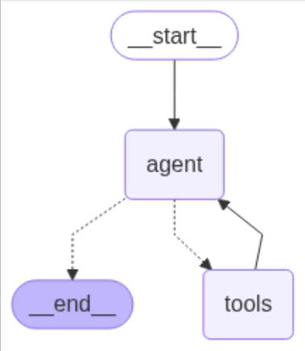
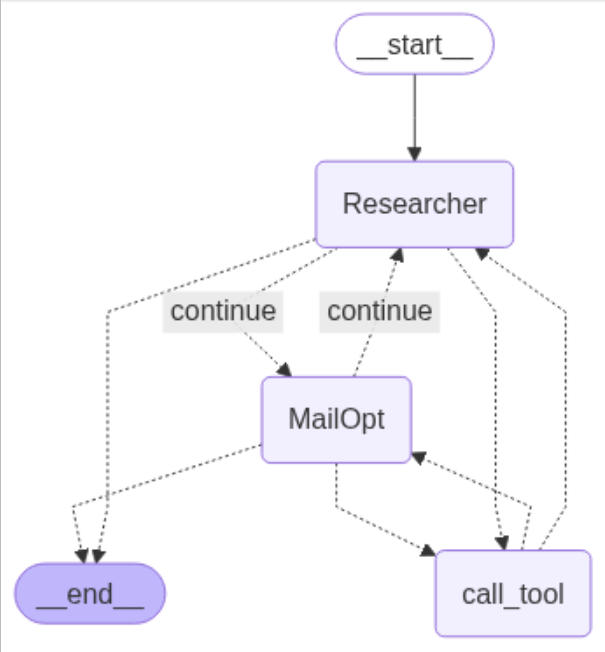
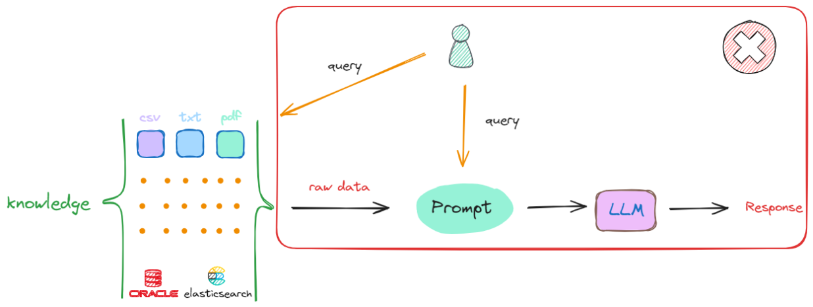
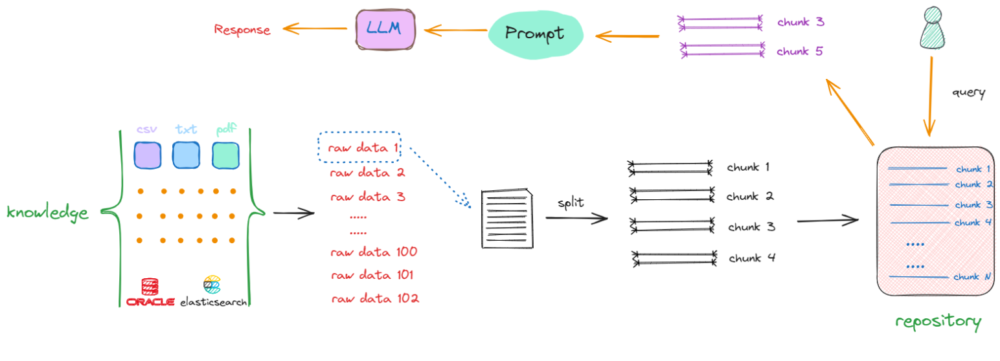
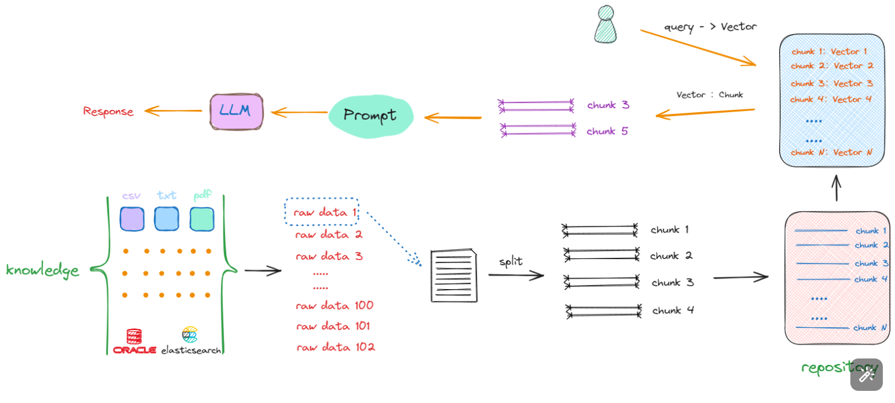
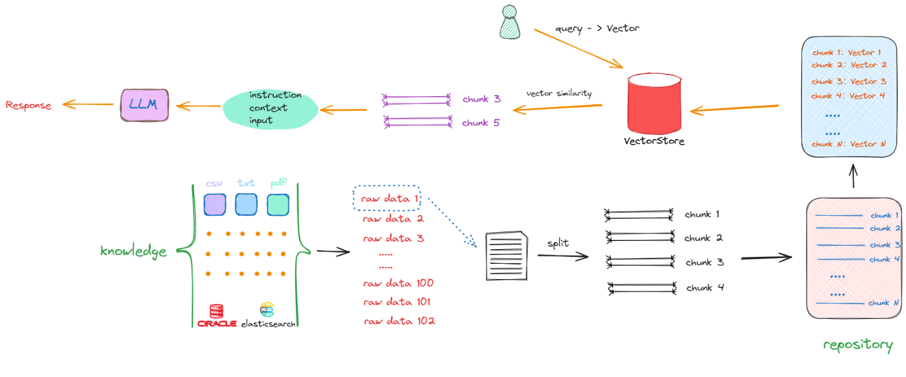
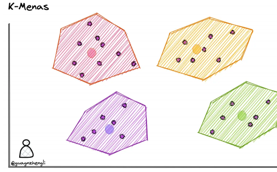
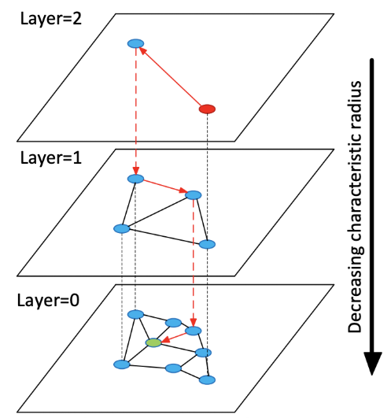

## 6. langgraph（尽量进行深度了解）

LangGraph 是**LangChain生态系统中的一个框架**，用于构建基于大型语言模型（LLM）的复杂工作流和智能体系统。它通过有向图结构定义工作流程，使开发者能够创建动态、可控且可扩展的AI应用程序。使用LangGraph 需要``pip install langgraph``。

- **核心概念**：

  - **状态（State）**：是LangGraph应用的基础，包含了应用运行时的所有信息，如消息列表、当前输入、工具输出等。
  - **节点（Node）**：通常是Python函数，代表不同的操作或步骤，如调用LLM、处理用户输入等，用于处理状态并返回更新后的状态。 
  - **边（Edge）**：定义了节点之间的连接关系和路由逻辑，包括标准边和条件边，标准边定义固定的执行路径，条件边可根据状态决定下一步走向。

  

- **主要特性**：

  - **结构化工作流**：能创建具有分支、循环和条件逻辑的复杂工作流，相比单一的链式调用更具灵活性。
  - **状态管理**：提供强大的状态管理机制，自动保存和管理状态，支持暂停和恢复执行，便于处理长时间运行的对话。
  - **与LangChain无缝集成**：可复用现有的LangChain组件，还有丰富的工具和模型支持。
  - **实现复杂逻辑**：传统的智能体开发方式在处理复杂任务时存在局限，如缺乏对外部环境的感知能力、对话历史记忆有限等。LangGraph允许创建具有循环、条件分支等复杂逻辑的工作流，能更好地应对各种复杂场景和需求，例如根据不同的输入和状态动态调整执行路径，实现多步骤的推理和决策。

### 6.1 langgraph实现Agent基础操作     公里标

```python
from typing import Literal 单位米
from langchain_core.messages import HumanMessage
from langchain_core.tools import tool
from langchain_openai import ChatOpenAI

from langgraph.checkpoint.memory import MemorySaver
from langgraph.graph import END,StateGraph,MessagesState
from langgraph.prebuilt import ToolNode


#定义工具函数，用于Agent调用外部工具
@tool
def search(query:str):
    """模拟一个气象查询搜索工具"""
    if "北京" in query.lower() or "Beijing" in query.lower():
        return "阴天有雾，气温25度"
    return "天气晴朗温度较高39度"

#将工具函数存放在工具列表中
tools = [search]
```

创建工具集节点：ToolNode是LangGraph中的一个预构建节点，用于封装一组工具函数。这些工具函数可以通过模型调用来执行特定的任务。

```python
tool_node = ToolNode(tools)
```

定义模型对象

```python
#定义模型对象
API_KEY = "sk-4b79f3a3ff334a15a1935366ebb425b3"
model = ChatOpenAI(model_name="deepseek-chat",
                  api_key=API_KEY,base_url="https://api.deepseek.com")
#将工具列表绑定到模型对象上
model = model.bind_tools(tools)
```

定义路由函数/状态转换函数：should_continue函数用于决定当前状态之后应该转移到哪个节点。它接收一个MessagesState对象作为输入，并返回一个字符串，表示下一个节点的名称。

消息状态：MessagesState是LangGraph中的一个状态类，用于存储对话过程中的消息列表。每个状态对象都包含一个messages字段，该字段是一个消息对象的列表。

``from typing import Literal 是 Python 3.8 及以上版本中引入的一种类型注解工具，用于表示某个变量或函数参数只能是特定的几个值之一。Literal 是 typing 模块中的一个特殊类型，它允许你精确地指定一个或多个字面量作为类型约束。``

```python
def should_continue(state:MessagesState)->Literal["tools",END]:
    messages = state['messages']
    #获取用户提问消息
    last_message = messages[-1] 
    
    #如果llm调用工具，则转到tools节点
    if last_message.tool_calls:
        return "tools"
    return END
```

定义模型调用函数

```python
def call_model(state:MessagesState):
    #获取消息列表
    messages = state['messages']
    #调用模型返回结果
    response = model.invoke(messages)
    return {"messages":[response]}
```

定义一个新的状态图,使用MessagesState作为状态类型

```python
workflow = StateGraph(MessagesState)
```

在状态图上添加节点

```python
workflow.add_node("agent",call_model)
workflow.add_node("tools",tool_node)
```

设置入口节点为agent(入口节点指向agent节点)，这意味着agent是第一个被调用的节点

```python
workflow.set_entry_point("agent")
```

添加条件边：agent节点根据should_continue进行边的连接（虚线边）

```python
workflow.add_conditional_edges('agent',should_continue)
```

定义普通边:tools工具节点连接agent节点的边（实线边）

```python
workflow.add_edge("tools","agent")
```

初始化内存以在图运行之间持久化状态：MemorySaver是LangGraph中的一个检查点保存器，用于在内存中保存状态图的中间状态。这对于调试和监控非常有用，因为它允许你在运行时查看和恢复状态。

```python
checkpointer = MemorySaver()
```

编译图：将其编译成一个langchain可运行的一个对象,在编译时传递内存

```python
app = workflow.compile(checkpointer=checkpointer) 
```

执行图

```python
final_state = app.invoke(
    {"messages":[HumanMessage(content="北京天气如何？")]},
    config={"configurable":{"thread_id":42}}
)
result = final_state['messages'][-1].content
result
```

配置选项（config）实现上下文共享：如果两个任务在同一个线程上执行，它们可以共享同一个上下文（例如全局变量、线程本地存储等）。这对于需要维护状态或会话信息的应用非常重要。

```python
final_state = app.invoke(
    {"messages":[HumanMessage(content="我刚才问的是哪个城市？")]},
    config={"configurable":{"thread_id":42}}
)
result = final_state['messages'][-1].content
result
```

保存图文件

```python
graph_png = app.get_graph().draw_mermaid_png()
with open('graph.png','wb') as fp:
    fp.write(graph_png)
```

### 6.2 langgraph实现Multi-Agent Systems



```python
from langchain_core.messages import (
BaseMessage,
HumanMessage,
ToolMessage,
)
from langchain_openai import ChatOpenAI
from langchain_core.tools import tool
from typing import Literal
from langgraph.checkpoint.memory import MemorySaver
from langgraph.graph import END,StateGraph,MessagesState
from langgraph.prebuilt import ToolNode

# 导⼊聊天提示模板和消息占位符
from langchain_core.prompts import ChatPromptTemplate, MessagesPlaceholder
# 导⼊状态图相关的常量和类
from langgraph.graph import END, StateGraph, START

API_KEY = "sk-4b79f3a3ff334a15a1935366ebb425b3"
llm = ChatOpenAI(model_name="deepseek-chat",
                 api_key=API_KEY,base_url="https://api.deepseek.com")

# 定义⼀个函数，⽤于创建代理
def create_agent(llm, tools, system_message: str):
     """创建⼀个代理。"""
     # 创建⼀个聊天提示模板
     prompt = ChatPromptTemplate.from_messages(
         [
             (
             "system",
             "你是⼀个有帮助的AI助⼿，与其他助⼿合作。"
             " 使⽤提供的⼯具来推进问题的回答。"
             " 如果你不能完全回答，没关系，另⼀个拥有不同⼯具的助⼿"
             " 会接着你的位置继续帮助。执⾏你能做的以取得进展。"
             " 如果你或其他助⼿有最终答案或交付物，"
             " 在你的回答前加上FINAL ANSWER，以便团队知道停⽌。"
             " 你可以使⽤以下⼯具: {tool_names}。\n{system_message}",
             ),
             # 消息占位符
             MessagesPlaceholder(variable_name="messages"),
         ]
     )
     # 传递系统消息参数
     prompt = prompt.partial(system_message=system_message)
     # 传递⼯具名称参数
     prompt = prompt.partial(tool_names=", ".join([tool.name for tool in tools]))
     # 绑定⼯具并返回提示模板
     return prompt | llm.bind_tools(tools)
    
#定义工具函数
@tool
def get_search_result(question):
    """
    互联网搜索函数
    :param question: 必要参数，字符串类型，用于表示在互联网上进行搜素的关键词或者搜索内容的简短描述，\
    :return：SerpAPI API根据参数question进行互联网搜索后的结果，其中包含了全部重要的搜索结果内容。
    """
    from langchain_community.utilities import SerpAPIWrapper
    serpapi_api_key = "60f286e601f44a26600e42c65e7a9b3ceb06a3f0dc8e0fe7ce56ec93d6274ccd"
    search = SerpAPIWrapper(serpapi_api_key=serpapi_api_key)
    result = search.run(question)
    return result

#定义工具函数，用于Agent调用外部工具
@tool
def send_email(query:str):
    """邮件发送工具，可以接受query内容，然后进行邮件发送"""
    return "邮件已成功发送。"

#定义工具节点
# 导⼊预构建的⼯具节点
from langgraph.prebuilt import ToolNode
# 定义⼯具列表
tools = [get_search_result, send_email]
# 创建⼯具节点
tool_node = ToolNode(tools)

#定义状态：我们⾸先定义图的状态。这只是⼀个消息列表，以及⼀个⽤于跟踪最新发送者的键
# 导⼊操作符和类型注解
import operator
from typing import Annotated, Sequence, TypedDict
# 导⼊OpenAI聊天模型
from langchain_openai import ChatOpenAI
# 定义⼀个对象，⽤于在图的每个节点之间传递
# 我们将为每个代理和⼯具创建不同的节点

class AgentState(TypedDict):
    messages: Annotated[Sequence[BaseMessage], operator.add]
    sender: str
    
#定义代理节点
import functools
from langchain_core.messages import AIMessage

# ⽤于为给定的Agent创建节点
def agent_node(state, agent, name):#name:agent代理的名字
    # 调⽤代理
    result = agent.invoke(state)
    #将 result 转换为 AIMessage 类型，并进行进一步处理
    #使用模型的 model_dump 方法将 result 转换为字典格式，同时排除 "type" 和 "name" 字段。这通常用于序列化对象以便传输或存储。
    result = AIMessage(**result.model_dump(exclude={"type", "name"}), name=name)
    return {
        "messages": [result],
        # 由于我们有⼀个严格的⼯作流程，我们可以跟踪发送者，以便知道下⼀个传递给谁。
        "sender": name,
    }
        
#创建搜索Agent代理对象和节点对象
research_agent = create_agent(
    llm,
    [get_search_result],
    system_message="你应该提供准确的数据供MailOpt使⽤。",
)
# 创建Agent节点对象：使用agent和name的值填充到agent_node函数中对应的两个参数
research_node = functools.partial(agent_node, agent=research_agent, name="Researcher")


#创建发邮件Agent代理对象和节点对象
mail_agent = create_agent(
    llm,
    [send_email],
    system_message="你用于进行邮件发送业务实现",
)
# 创建Agent节点对象
mail_node = functools.partial(agent_node, agent=mail_agent, name="MailOpt")


#定义路由函数，决定是否继续执行
from typing import Literal
# 定义路由器函数,continue 表示代理应该继续处理消息队列中的下一条消息。
def router(state) -> Literal["call_tool", "__end__", "continue"]:
    # 这是路由器
    messages = state["messages"]
    last_message = messages[-1]
    if last_message.tool_calls:
        # 上⼀个代理正在调⽤⼯具
        return "call_tool"
    if "FINAL ANSWER" in last_message.content:
        # 任何代理决定⼯作完成
        return "__end__"
    return "continue"

#图、节点和边的创建
# 创建状态图实例
workflow = StateGraph(AgentState)
# 添加搜索节点
workflow.add_node("Researcher", research_node)
# 添加邮件节点
workflow.add_node("MailOpt", mail_node)
# 添加⼯具调⽤节点
workflow.add_node("call_tool", tool_node)

# 添加条件边
workflow.add_conditional_edges(
     "Researcher",
     router,
     {"continue": "MailOpt", "call_tool": "call_tool", "__end__": END},
)
workflow.add_conditional_edges(
     "MailOpt",
     router,
     {"continue": "Researcher", "call_tool": "call_tool", "__end__": END},
)
# 添加条件边
workflow.add_conditional_edges(
     "call_tool",
     #如果 x["sender"] 的值是 "Researcher"，那么边会连接到 "Researcher" 节点。
	 #如果 x["sender"] 的值是 "MailOpt"，那么边会连接到 "MailOpt" 节点。
     lambda x: x["sender"],
     {
         "Researcher": "Researcher",
         "MailOpt": "MailOpt",
     },
)
# 添加起始边
workflow.add_edge(START, "Researcher")
# 编译⼯作流图
graph = workflow.compile()

# 将⽣成的图⽚保存到⽂件
graph_png = graph.get_graph().draw_mermaid_png()
with open("collaboration.png", "wb") as f:
    f.write(graph_png)
    
    
#调用
events = graph.invoke(
    {
        "messages": [
            HumanMessage(
            content="获取过去5年AI软件市场规模，归纳成100字"
            " 然后进行邮件发送。"
            " ⼀旦发送完邮件表示你完成了任务。"
            )
        ],
    }
)

#获取最终结果
result = events['messages'][-1].content
result

#查看中间结果
for message in events['messages']:
    print(message.content)
    print("-----------------------------------")

```

## 7. RAG与langchain应用

检索增强⽣成（RAG）是指对⼤型语⾔模型输出进⾏优化，使其能够在⽣成响应之前引⽤训练数据来源之外的权威知识库。⼤型语⾔模型（LLM）⽤海量数据进⾏训练，使⽤数⼗亿个参数为回答问题、翻译语⾔和完成句⼦等任务⽣成原始输出。在 LLM 本就强⼤的功能基础上，RAG 将其扩展为能访问特定领域或组织的内部知识库，所有这些都⽆需重新训练模型。这是⼀种经济⾼效地改进 LLM 输出的⽅法，让它在各种情境下都能保持相关性、准确性和实⽤性。

### 7.1 RAG构建流程

假设现在我们有一个偌大的知识库，当想从该知识库中去检索最相关的内容时，最简单的方法是：接收到一个查询（Query），就直接在知识库中进行搜索。这种做法其实是可行的，但存在两个关键的问题：

1. 假设提问的Query的答案出现在一篇文章中，去知识库中找到一篇与用户输入相关的文章是很容易的，但是我们将检索到的这整篇文章直接放入`Prompt`中并不是最优的选择，因为其中一定会包含非常多无关的信息，而无效信息越多，对大模型后续的推理影响越大。
2. 任何一个大模型都存在最大输入的Token限制，一个流程中可能涉及多次检索，每次检索都会产生相应的上下文，无法容纳如此多的信息。



解决上述两个问题的方式是：把存放着原始数据的知识库（Knowledge）中的每一个raw data，切分成一个一个的小块，这些小块可以是一个段落，也可以是数据库中某个索引对应的值。这个切分过程被称为“分块”（chunking），如下述流程所示：



以第一个原始数据为例（raw data 1），通过一些特定的方法进行切分，一个完整的内容会被分割成 chunk1 ~ chunk4。采取相同的方法，继续对`raw data 2`、`raw data 3`直至`raw data n`进行切分。完成这一过程后，我们最终得到的是一个充满分块数据（chunks）的新的知识库（repository），其中每一项都是一个单独的chunk。例如，如果原始文档共有10个，那么经过切分，可能会产生出100个chunks。

完成这一转化后，当再次接收到一个查询（Query）时，就会在更新后的知识库（repository）中进行搜索，这时检索的范围就不再是某个完整的文档，而是其中的某一个部分，返回的是一个或多个特定的chunk，这样返回的信息量就会更小且更精确。随后，这些被检索到的chunk会被加入到Prompt中，作为上下文信息与用户原始的Query共同输入到大模型进行处理，以生成最终的回答。

在上述将原始数据（raw data）转化为chunk的过程中，就会包含构建RAG的第一部分开发工作：这包括如果做数据清洗，如去除停用词、标点符号等。此外，还涉及如何选择合适的`split`方法来进行数据切分的一系列技术。

接下来面临的问题是，尽管所有数据已经被切割成一个个`chunk`，其存储形式还是以字符串形式存在，如果想从`repository`中匹配到与输入的query相关的chunks，比较两句话是否相似，看一句话中相同字有几个，这显然是行不通的。我们需要获取的是句子所蕴含的深层含义，而非仅仅是表面的字面相似度。因此，大家也能想到，在NLP中去计算文本相似度的有效的方法就是Embedding，即将这些chunks转换成向量（vector）形式。所以流程会丰富如下：



``Embedding 是由向量模型⽣成的，它会根据不同的算法⽣成⾼维度的向量数据，代表着数据的不同特征，这些特征代表了数据的不同维度。例如，对于⽂本，这些特征可能包括词汇、语法、语义、情感、情绪、主题、上下⽂等。对于⾳频，这些特征可能包括⾳调、节奏、⾳⾼、⾳⾊、⾳量、语⾳、⾳乐等。``

在这个流程中，会先将用户输入的 Query 转化成 Vector，然后再去与知识库中的向量进行相似度比较，检索出相似的Vector，最终返回其对应的Chunk（字符串形式的文本），再执行后续的流程。所以在这个过程中，就会产生构建RAG的第二部分的开发工作：如果将chunk转化成Vector及以何种形式进行存储。同时，我们要考虑的是：如何去计算向量之间的相似度？如果去和知识库中的向量一个一个比较，这个时间复杂度是非常高的，那么其解决办法又是什么呢？我们继续看下述流程：



如上所示，解决搜索效率和计算相似度优化算法的答案就是：向量数据库。同时也产生了构建RAG的第三部分工作：我们要去了解和学习如何选择、使用向量数据库。

  最终整体流程就如上图所示，一个基础的RAG架构会只要包含以下几方面的开发工作：

1. 如何将原始数据转化成chunks；
2. 如何将chunks转化成Vector；
3. 如何选择计算向量相似度的算法；
4. 如何利用向量数据库提升搜索效率；
5. 如何把找到的chunks与原始query拼接在一起，产生最终的Prompt；

在以上5点开发任务中，我们确实是可以利用已经训练好的Embedding模型，开源的向量数据库等去直接解决某一类问题，所以我们前面才说一个基础架构的RAG系统搭建起来其实很简单，但搭建并不意味着直接就能用，毕竟RAG的核心是检索，检索出来的内容的准确率是衡量一个RAG系统的最基础的标准。目前没有任何一套理论、任何一套解决方案能够百分之百的指导着我们构建出一个最优的RAG系统。不同的需求，不同的数据，其构建方法也会大相径庭，需要我们在实践的过程中不断地去尝试，不断地去积累相关的经验，才能够将其真正落地。

### 7.2 相关核心概念和操作

#### **7.2.1 向量数据库**

向量数据库（Vector Database），也叫矢量数据库，主要用来存储和处理向量数据。

在数学中，向量是有大小和方向的量，可以使用带箭头的线段表示，箭头指向即为向量的方向，线段的长度表示向量的大小。两个向量的距离或者相似性可以通过欧式距离或者余弦距离得到。

图像、文本和音视频这种非结构化数据都可以通过某种变换或者嵌入学习转化为向量数据存储到向量数据库中，从而实现对图像、文本和音视频的相似性搜索和检索。这意味着您可以使用向量数据库根据语义或上下文含义查找最相似或相关的数据。

向量数据库的主要特点是高效存储与检索。利用索引技术和向量检索算法能实现高维大数据下的快速响应。

#### **7.2.2 向量嵌入Vector Embeddings**

对于传统数据库，搜索功能都是基于不同的索引方式加上精确匹配和排序算法等实现的。本质还是基于文本的精确匹配，这种索引和搜索算法对于关键字的搜索功能非常合适，但对于语义搜索功能就非常弱。

``例如，如果你搜索 “小狗”，那么你只能得到带有“小狗” 关键字相关的结果，而无法得到 “柯基”、“金毛” 等结果，因为 “小狗” 和“金毛”是不同的词，传统数据库无法识别它们的语义关系，所以传统的应用需要人为的将 “小狗” 和“金毛”等词之间打上小狗特征标签进行关联，这样才能实现语义搜索。``

``同样，当你在处理非结构化数据时，你会发现非结构化数据的特征数量会迅速增加，处理过程会变得十分困难。比如我们处理图像、音频、视频等类型的数据时，这种情况尤为明显。就拿图像来说，可以标注的特征包括颜色、形状、纹理、边缘、对象、场景等多个方面。然而，这些特征数量众多，而且依靠人工进行标注的难度很大。因此，我们需要一种自动化的方式来提取这些特征，而Vector Embedding技术就能够实现这一目标。``

Vector Embedding 是由专门的向量模型生成的，它会根据不同的算法生成高维度的向量数据，代表着数据的不同特征，这些特征代表了数据的不同维度。例如，对于文本，这些特征可能包括词汇、语法、语义、情感、情绪、主题、上下文等。对于音频，这些特征可能包括音调、节奏、音高、音色、音量、语音、音乐等。

#### **7.2.3 相似性测量**

如何衡量向量之间的相似性呢？有三种常见的向量相似度算法：欧几里德距离、余弦相似度和点积。

- 点积（内积）: 两个向量的点积是一种衡量它们在同一方向上投影的大小的方法。如果两个向量是单位向量（长度为1），它们的点积等于它们之间夹角的余弦值。因此，点积经常被用来计算两个向量的相似度。
- 余弦相似度: 这是一种通过测量两个向量之间的角度来确定它们相似度的方法。余弦相似度是两个向量点积和它们各自长度乘积的商。这个值的范围从-1到1，其中1表示完全相同的方向，-1表示完全相反，0表示正交。
- 欧氏距离: 这种方法测量的是两个向量在n维空间中的实际距离。虽然它通常用于计算不相似度（即距离越大，不相似度越高），但可以通过某些转换（如取反数或用最大距离归一化）将其用于相似度计算。

像我们最常用的余弦相似度，其代码实现也非常简单，如下所示：

```python
import numpy as np

def cosine_similarity(A, B):
    # 使用numpy的dot函数计算两个数组的点积
    # 点积是向量A和向量B在相同维度上对应元素乘积的和
    dot_product = np.dot(A, B)
    
    # 计算向量A的欧几里得范数（长度）
    # linalg.norm默认计算2-范数，即向量的长度
    norm_A = np.linalg.norm(A)
    
    # 计算向量B的欧几里得范数（长度）
    norm_B = np.linalg.norm(B)
    
    # 计算余弦相似度
    # 余弦相似度定义为向量点积与向量范数乘积的比值
    # 这个比值表示了两个向量在n维空间中的夹角的余弦值
    return dot_product / (norm_A * norm_B)
```

#### 7.2.4 **相似性搜素**

既然我们知道了可以通过比较向量之间的距离来判断它们的相似度，那么如何将它应用到真实的场景中呢？如果想要在一个海量的数据中找到和某个向量最相似的向量，我们需要对数据库中的每个向量进行一次比较计算，但这样的计算量是非常巨大的，所以我们需要一种高效的算法来解决这个问题。

高效的搜索算法有很多，其主要思想是通过两种方式提高搜索效率：

1）减少向量大小——通过降维或减少表示向量值的长度。

2）缩小搜索范围——可以通过聚类或将向量组织成基于树形、图形结构来实现，并限制搜索范围仅在最接近的簇中进行。

我们首先来介绍⼀下大部分算法共有的核心概念，也就是kmeans聚类。

**K-Means聚类**

我们可以在保存向量数据后，先对向量数据先进行聚类。例如下图在二维坐标系中，划定了 4 个聚类中心，然后将每个向量分配到最近的聚类中心，经过聚类算法不断调整聚类中心位置，这样就可以将向量数据分成 4 个簇。每次搜索时，只需要先判断搜索向量属于哪个簇，然后再在这一个簇中进行搜索，这样就从 4 个簇的搜索范围减少到了 1 个簇，大大减少了搜索的范围。




**HNSW**

除了聚类以外，也可以通过构建树或者构建图的方式来实现近似最近邻搜索。这种方法的基本思想是每次将向量加到数据库中的时候，就先找到与它最相邻的向量，然后将它们连接起来，这样就构成了一个图。当需要搜索的时候，就可以从图中的某个节点开始，不断的进行最相邻搜索和最短路径计算，直到找到最相似的向量。



#### 
