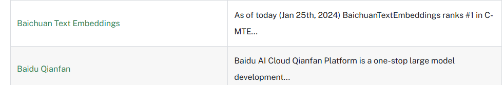
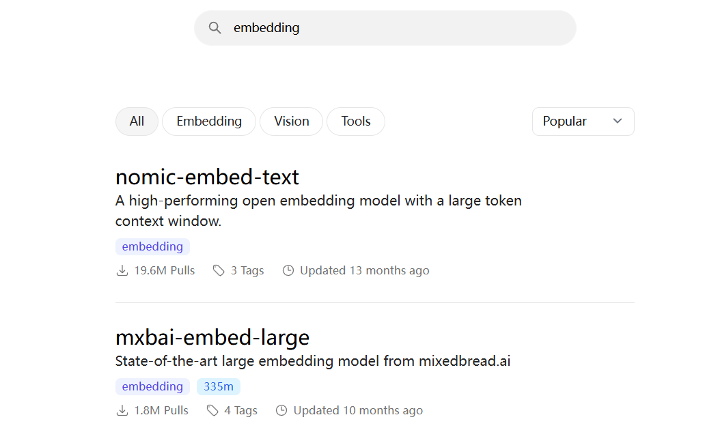
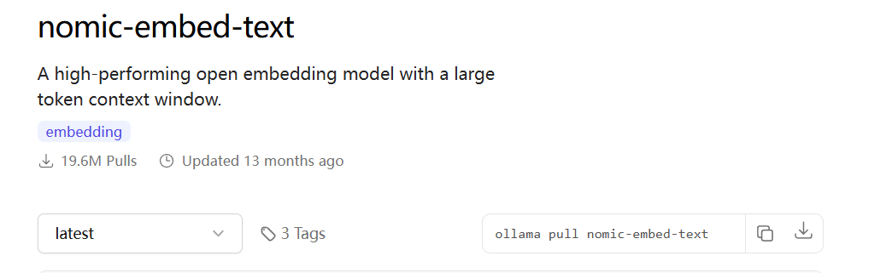
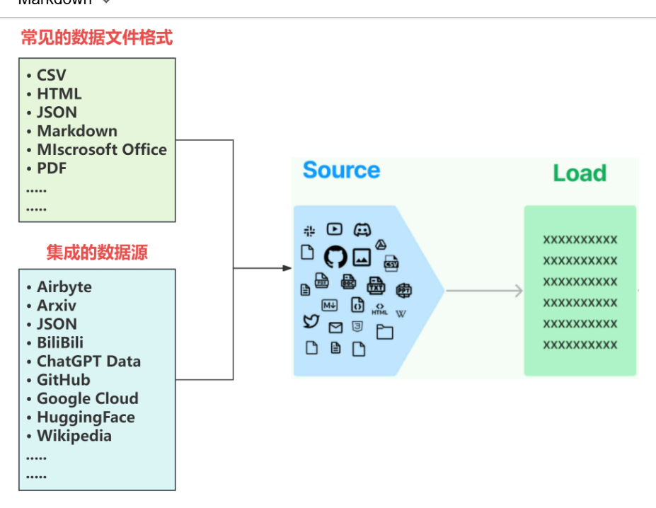
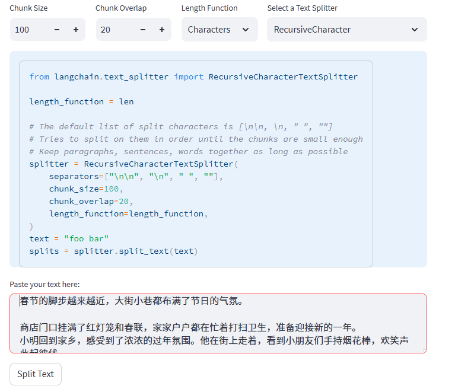
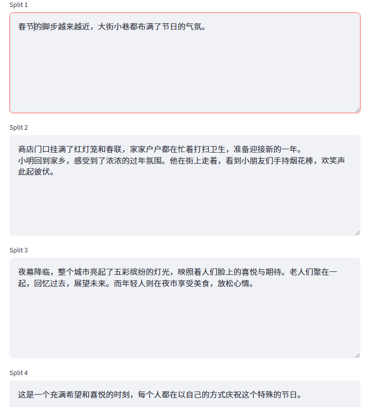
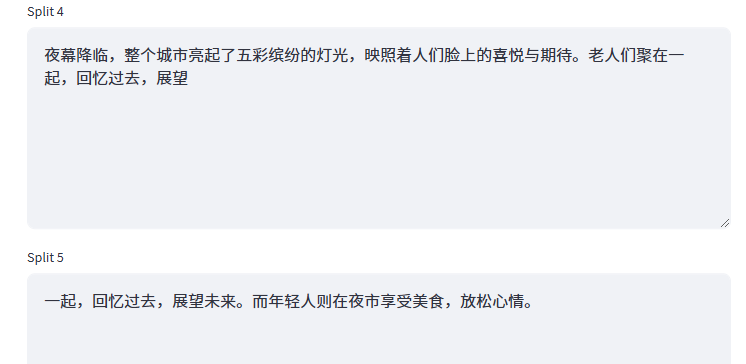
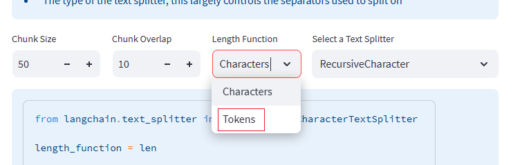

#### 7.2.5 Embedding models

LangChain 设计了一个 Embeddings 类。该类是一个专为与文本嵌入模型进行交互而设计的类。有许多嵌入模型提供商（如OpenAI、BaiChuan、QianFan、Hugging Face等）这个类旨在为它们提供一个标准接口。

``Embeddings类会为文本创建一个向量表示。这很有用，因为这意味着我们可以在向量空间中思考文本，并做一些类似语义搜索的事情，比如在向量空间中寻找最相似的文本片段。``

对于Embedding Models我们只需要学会如何去使用就可以，是因为有非常多的模型供应商，如OpenAI、Hugging Face国内的有百川、千帆都提供了标准接口并集成在LangChian框架中，这意味着：Embedding Models已经有人帮我们训练好了，我们只要按照其提供的接口规范，将自然语言文本传入进去，就能得到其对应的向量表示。这显然是非常简单的。

那么在如此多的Embedding Models都可以使用的情况下，应该如何选择呢？ 首先，我们在使用形式上把 Embedding Models分为两类：

1. 在线Embedding Models，仅提供API服务，需要按照Token付费；
2. 开源Embedding Models可以下载到本地免费使用，但在运行过程中会消耗GPU资源。

**在线Embedding Models**

LangChain接入了国内的Baidu Qianfan，Baichuan Text Embeddings等向量模型，具体支持的平台可以在如下位置进行查看：https://python.langchain.com/docs/integrations/text_embedding/



接下来我们以Baichuan Text Embeddings为例展开讲解。注意：Baichuan Text Embeddings目前仅支持中文文本嵌入。

- 如何使用Baichuan Text Embeddings

  - 获取API Key

    - 要使用Baichuan Text Embeddings，首先需要获取API密钥。您可以通过以下步骤获取：
      - 访问[百川智能官方网站](https://platform.baichuan-ai.com/docs/text-Embedding)
      - 注册并创建一个账户
      - 在控制台中申请并获取API密钥
  - 安装必要的库``pip install langchain_community``

- 代码示例

  ```python
  from langchain_community.embeddings import BaichuanTextEmbeddings
  import os
  
  # 设置API密钥
  key = open('./key_files/baichuan_API-Key.md').read().strip()
  embeddings = BaichuanTextEmbeddings(api_key=key)
  
  # 示例文本
  text_1 = "今天天气不错"
  text_2 = "今天阳光很好"
  
  # 获取单个文本的嵌入
  query_result = embeddings.embed_query(text_1)
  print("单个文本嵌入结果:", query_result[:5])  # 只打印前5个元素
  
  # 获取多个文本的嵌入
  doc_result = embeddings.embed_documents([text_1, text_2])
  print("多个文本嵌入结果:", [vec[:5] for vec in doc_result])  # 每个向量只打印前5个元素
  ```

- BaichuanTextEmbeddings主要参数介绍

  - api_key：这是调用Baichuan Text Embeddings服务的身份验证凭证。只有拥有有效API Key的用户才能访问和使用该模型进行文本嵌入操作。

- BaichuanTextEmbeddings对象主要操作介绍

  - 单向量查询**（**embed_query）：法用于将单个文本嵌入为向量表示。它接受一个字符串类型		的文本作为输入，并返回该文本对应的向量表示。这个向量是一个高维向量（1024维），包含了文本的语义信息，可以用于后续的各种自然语言处理任务。
  - 多向量查询**（**embed_documents）：法用于将多个文本同时嵌入为向量表示。

这里模拟一个QA场景，我们定义一个问题，然后定义10条文本作为回答。然后分别对问题和回答各自进行词向量转换：

```python
query = "早睡早起到底是不是保持身体健康的标准？"

sentences = ["早睡早起确实是保持身体健康的重要因素之一。它有助于同步我们的生物钟，并提高睡眠质量。", 
             "早睡早起可以帮助人们更好地适应自然光周期，从而优化褪黑激素的产生，这种激素是调节睡眠和觉醒的关键。",
             "关于提高工作效率，确保在日常饮食中包含充足的蛋白质、复合碳水化合物和健康脂肪非常关键。",
             "投资可再生能源项目和推广电动汽车可以显著减少温室气体排放，从而缓解气候变化带来的负面影响。",
             "多发性硬化症是一种影响中枢神经系统的自身免疫疾病，导致神经传导受损。虽然与阿尔茨海默症类似，多发性硬化症的主要症状包括疲劳、视觉障碍和肌肉控制问题。",
             "今天的天气太好了，可以早点起床去爬山",
             "如果下班特别晚的话，我建议你还是打车回家吧",
             "提升学术研究质量需侧重于多学科融合和国际合作。研究机构应该鼓励学者之间的交流，通过共享数据和研究方法，来推动科学发现和技术创新。",
             "如果你认为我说的没用，那你大可以不必理会。",
             "衡量一个人是否成功的标准在于他到底能不能让身边的人都变的优秀"

]
```

使用`embed_documents`方法，传入`sentences`列表，得到每条文本的向量表示

```python
sentence_embeddings = embeddings_model.embed_documents(sentences)
```

通过`embed_query`方法生成问题的向量表示

```python
embedded_query = embeddings_model.embed_query(query)
```

**开源EMbedding Models**

ollama官网进行开源模型下载：https://ollama.com/search?q=embedding



我们以nomic-embed-text向量模型为例：



```python
def ollama_embedding_by_api(text):
    res = requests.post(
        url = 'http://127.0.0.1:11434/api/embeddings',
        json = {
            "model":'nomic-embed-text:latest',
            'prompt':text
        }
    )
    embedding_list = res.json()['embedding']
    return embedding_list
```

**代码构建简易RAG**

pip install chromadb

pip install requests

```python
import uuid
import chromadb
import requests
import os
from openai import OpenAI

#创建数据库，类似创建一个文件夹
client = chromadb.PersistentClient(path="./db/chroma_demo")
#创建数据集合（库表）
collection = client.get_or_create_collection(name="collection_v2")


#数据集切分-分块处理
def file_chunk_list():
    #1.读取文件内容
    with open('中医问诊.txt','r',encoding='utf-8') as fp:
        data = fp.read()
    #2.根据换行切割:将一个病症作为一个列表元素数据
    chunk_list = data.split('\n\n')
    chunk_list = [chunk for chunk in chunk_list if chunk]
    return chunk_list
#数据集向量化封装
def ollama_embedding_by_api(text):
    #使用nomic向量模型
    # res = requests.post(
    #     url = 'http://127.0.0.1:11434/api/embeddings',
    #     json = {
    #         "model":'nomic-embed-text:latest',
    #         'prompt':text
    #     }
    # )
    # embedding_list = res.json()['embedding']
    # return embedding_list
    
    #使用阿里百炼向量模型（效果超级好）
    client = OpenAI(
        api_key="sk-52xxxd1e203c6712",  # 如果您没有配置环境变量，请在此处用您的API Key进行替换
        base_url="https://dashscope.aliyuncs.com/compatible-mode/v1"  # 百炼服务的base_url
    )

    completion = client.embeddings.create(
        model="text-embedding-v3",
        input=text,
        dimensions=1024,
        encoding_format="float"
    )
    return completion.data[0].embedding

#deepseek模型调用
def ollama_generate_by_api(prompt):
    res = requests.post(
    url = 'http://127.0.0.1:11434/api/generate',
    json = {
            "model":'deepseek-r1:7b',
            'prompt':prompt,
            'stream':False
        }
    )
    res = res.json()['response']
    return res

#整体集成
def initial():
    #构造数据
    documents = file_chunk_list()
    #给每一个数据创建唯一的id标识
    ids = [str(uuid.uuid4()) for _ in documents]
    embeddings = [ollama_embedding_by_api(text) for text in documents]

    #插入数据
    collection.add(
        ids = ids,
        documents=documents,
        embeddings=embeddings
    )
    
def run():
    qs = '我好像是感冒了，症状是头痛、轻微发烧、肢节酸痛、打喷嚏和流鼻涕。'
    qs_embedding = ollama_embedding_by_api(qs)
    #n_results表示匹配几个最高相似度的结果
    res = collection.query(query_embeddings=[qs_embedding,],query_texts=qs,n_results=2)
    result = res['documents'][0]
    context = '\n'.join(result)
    prompt = f'''你是一个中医问答机器人，任务是根据参考信息回答用户问题，如果你参考信息不足以回答用户问题，请回复不知道，切记不要去杜撰和自由发挥任何内容和信息，请用中文回答，参考信息：{context},来回答问题:{qs},'''
    result = ollama_generate_by_api(prompt)
    print(result)
```

调用测试：

```python
initial() #执行一次即可
```

```python
run() #可多次测试
```

### 7.3 Source 与 data loaders

`Source`概念指的是RAG架构中所外挂的知识库。正如我们之前所讨论的，因为大模型的原生能力很强，所以它可以识别多种不同的类型的原始数据而不用做额外的处理，而且在实际场景中，私有数据通常也并不是单一的，可以来自多种不同的形式，可以是上百个.csv文件，可以是上千个.json文件，也可以是上万个.pdf文件，同时如果对接到具体的业务，可以是某一个业务流程外放的API，可以是某个网站的实时数据等多种情况。

所以LangChain首先做的就是：将常见的数据格式和数据来源使用LangChain的规范，抽象出一个一个的单独的集成模块，称为文档加载器（Document loaders），用于快速加载某种形式下的文本数据。如下图所示：



这意味着，我们可以通过调用LangChain抽象好的方法直接处理私有数据，无需手动编写中间的处理流程，并且每一种文档的加载器，在LangChain官方文档中都有基本的调用示例供我们快速上手使用，具体位置如下：https://python.langchain.com/docs/integrations/document_loaders/

**我们以加载txt文件为示例：**

将文件作为文本读入，并将其全部放入一个文档中，这是最简单的一个文档加载程序，使用方式如下：

```python
from langchain.document_loaders import TextLoader

docs = TextLoader('./data/reason.txt', encoding="utf-8").load()
```

对于`TextLoader`，使用`.page_content`和`.metadata`去访问数据。

**加载csv文件为示例：**

逗号分隔值（CSV）文件是⼀种使用逗号分隔值的定界文本文件。文件的每一行是⼀个数据记录。每个记录由⼀个或多个字段组成，字段之间用逗号分隔。LangChain 实现了⼀个 CSV 加载器，可以将 CSV 文件加载为⼀系列 Document 对象。CSV 文件的每⼀行都会被翻译为⼀个文档。

```python
from langchain_community.document_loaders.csv_loader import CSVLoader

file_path = (
		"csv_loader.py"
)

loader = CSVLoader(file_path=file_path,encoding="UTF-8")
data = loader.load()

for record in data[:2]:
		print(record)
```

**加载pdf文件为示例：**

这⾥我们使用pypdf 将PDF加载为文档数组，其中每个文档包含页面内容和带有 page 编号的元数据。

``pip install pypdf``

```python
from langchain_community.document_loaders import PyPDFLoader
file_path = ("pytorch.pdf")
loader = PyPDFLoader(file_path)
#加载并分割 PDF 文件。将其按页分割成多个部分。返回的结果是一个包含每一页内容的列表 pages。
pages = loader.load_and_split()
print(pages[0])
```

### 7.4 Text Splitters 详解

#### 7.4.1 如何将文本切分成Chunks

分块（Chunking），其实现形式上是将长文档拆分为较小的块的过程，目的是在检索时能够准确地找到最直接和最相关的段落。由于文章通常包含大量不相关信息，在进行分块之前，也常常需要进行一些预处理工作，如文本清洗、停用词处理等。

转回到核心内容来看，一个有效的分块策略，可以确保搜索结果精确地反映用户查询的实际需求。如果分块过小或过大，都可能导致搜索结果不准确或提取不到最相关的内容。理想的文本块应尽可能语义独立，即不过度依赖上下文，这样的文本是语言模型最易于理解的。因此，为文档确定最佳的块大小是确保搜索结果准确性和相关性的关键。这涉及多个决策因素，如块的大小；如果句子太短，模型可能难以理解其意义，且句子越短，包含的有效信息就越少。比较常用的有如下4种不同的方法来优化分块策略：

1. **根据句子切分**：这种方法按照自然句子边界进行切分，以保持语义完整性。
2. **按照固定字符数来切分**：这种策略根据特定的字符数量来划分文本，但可能会在不适当的位置切断句子。
3. **按固定字符数来切分，结合重叠窗口（overlapping windows）**：此方法与按字符数切分相似，但通过重叠窗口技术避免切分关键内容，确保信息连贯性。
4. **递归方法**：通过递归方式动态确定切分点，这种方法可以根据文档的复杂性和内容密度来调整块的大小。

第二种方法（按照字符数切分）和第三种方法（按固定字符数切分结合重叠窗口）主要基于字符进行文本的切分，而不考虑文章的实际内容和语义。这种方式虽简单，但可能会导致主题或语义上的断裂。相对而言，递归方法更加灵活和高效，它结合了固定长度切分和语义分析。通常是首选策略，因为它能够更好地确保每个段落包含一个完整的主题。

这些方法各有优势和局限，选择适当的分块策略取决于具体的应用需求和预期的检索效果。接下来我们依次尝试用常规手段应该如何实现上述几种方法的文本切分。

接下来就具体来上上述4中切分方式的具体实现~

#### 7.4.2 按照句子切分

按照句子切分，其实就是通过标点符号来进行文本切分（分割），这可以直接使用Python的标准库来完成这个任务。一种简单的方法是使用re模块，它提供了正则表达式的支持，可以方便地根据标点符号来分割文本。如下示例中，展示了如何使用re.split()函数来根据中文和英文的标点符号进行文本切分。代码如下：

```python
import re

def split_text_by_punctuation(text):
    # 定义一个正则表达式，包括常见的中英文标点
    # pattern = r"[。！？｡＂＃＄％＆＇（）＊＋，－／：；＜＝＞＠［＼］＾＿｀｛｜｝～\s、]+"
    pattern = r"[。！？｡]+"
    # 使用正则表达式进行分割
    segments = re.split(pattern, text)
    # 过滤掉空字符串
    return [segment for segment in segments if segment]
```

这个函数会根据中文和英文的标点符号来分割文本，并移除空字符串。定义好分割函数后，我们可以尝试进行功能测试：

```python
# 文本
text = "春节的脚步越来越近，大街小巷都布满了节日的气氛。商店门口挂满了红灯笼和春联，家家户户都在忙着打扫卫生，准备迎接新的一年。\
小明回到家乡，感受到了浓浓的过年氛围。他在街上走着，看到小朋友们手持烟花棒，欢笑声此起彼伏。\
夜幕降临，整个城市亮起了五彩缤纷的灯光，映照着人们脸上的喜悦与期待。老人们聚在一起，回忆过去，展望未来。\
而年轻人则在夜市享受美食，放松心情。这是一个充满希望和喜悦的时刻，每个人都在以自己的方式庆祝这个特殊的节日。"

# 调用函数进行分割
segments = split_text_by_punctuation(text)

# 使用循环来打印每个chunk
for i, segment in enumerate(segments):
    print("Chunk {}: {}".format(i + 1, segment))
```

#### 7.4.3 按照固定字符数切分

如果想按照固定字符数来切分文本，这种方法就不再依赖于标点符号，而是简单地按照给定的字符数来切分文本。我们可以编写一个函数，用来将文本分割成指定长度的片段。代码如下：

```python
def split_text_by_fixed_length(text, length):
    # 使用列表推导式按固定长度切分文本
    return [text[i:i + length] for i in range(0, len(text), length)]
```

这个函数的作用是根据指定的长度（在这个例子中为100个字符）来切分文本。我们可以根据具体需要调整这个长度。

```python
# 文本
text = "春节的脚步越来越近，大街小巷都布满了节日的气氛。商店门口挂满了红灯笼和春联，家家户户都在忙着打扫卫生，准备迎接新的一年。\
小明回到家乡，感受到了浓浓的过年氛围。他在街上走着，看到小朋友们手持烟花棒，欢笑声此起彼伏。\
夜幕降临，整个城市亮起了五彩缤纷的灯光，映照着人们脸上的喜悦与期待。老人们聚在一起，回忆过去，展望未来。\
而年轻人则在夜市享受美食，放松心情。这是一个充满希望和喜悦的时刻，每个人都在以自己的方式庆祝这个特殊的节日。"

# 定义每个片段的长度
chunk_length = 100

# 调用函数进行分割
result = split_text_by_fixed_length(text, chunk_length)

# 打印结果
for i, segment in enumerate(result):
    print(f"Chunk {i+1}: {segment}")
```

然而，这种方法的一个明显缺点是由于仅依据长度进行切分，切分后的片段可能无法保持完整的语义。但并不意味着它不适用于文本切分任务。例如，这种方法非常适合于处理日志文件或代码块，其中文本通常以固定长度或格式出现，或者在处理来自传感器或其他实时数据源的流数据时，固定长度切分可以确保数据被均匀地处理和分析。这些应用场景中，数据的结构和形式通常是预定和规范的，因此即便是按固定长度进行切分，反而会更有利于对数据的理解和使用。

#### 7.4.4 结合重叠窗口的固定字符数切分

重复窗口的意义是：块之间保持一些重叠，以确保语义上下文不会在块之间丢失。在文本处理和其他数据分析领域，"重叠"（overlap）指的是连续数据块之间共享的部分。这种方法特别常见于信号处理、语音分析、自然语言处理等领域，其中数据的连续性和上下文信息非常重要。比如下述代码所示：

```python
def split_text_by_fixed_length_with_overlap(text, length, overlap):
    # 使用列表推导式按固定长度及重叠长度切分文本
    return [text[i:i + length] for i in range(0, len(text) - overlap, length - overlap)]

# 文本
text = "春节的脚步越来越近，大街小巷都布满了节日的气氛。商店门口挂满了红灯笼和春联，家家户户都在忙着打扫卫生，准备迎接新的一年。\
小明回到家乡，感受到了浓浓的过年氛围。他在街上走着，看到小朋友们手持烟花棒，欢笑声此起彼伏。\
夜幕降临，整个城市亮起了五彩缤纷的灯光，映照着人们脸上的喜悦与期待。老人们聚在一起，回忆过去，展望未来。\
而年轻人则在夜市享受美食，放松心情。这是一个充满希望和喜悦的时刻，每个人都在以自己的方式庆祝这个特殊的节日。"

# 定义每个片段的长度和重叠长度
chunk_length = 100
overlap_length = 30

# 调用函数进行分割
result = split_text_by_fixed_length_with_overlap(text, chunk_length, overlap_length)

# 打印结果
for i, segment in enumerate(result):
    print(f"Chunk {i+1}: {segment}")
```

如上所示，每个文本片段长度为100个字符，并且每个片段与下一个片段有30个字符的重叠。这样，每个窗口实际上是在上一个窗口向前移动30个字符的基础上开始的。这种方法特别适用于需要数据重叠以保持上下文连续性的情况，能够较好的在某一个chunk中保存某个完整的语义信息，比如在第一个Chunk中的：'他在街上走着，看到小朋友们手持烟花棒，欢笑'被截断，但是完整的语义能够在Chunk2中被存储：'他在街上走着，看到小朋友们手持烟花棒，欢笑声此起彼伏。' 那么当这条语义信息是有关于Query的上下文，就可以在chunk2中被检索出来。

#### 7.4.5 递归字符文本切分

在前面讲的三种切分方法，虽然简单且更容易理解，但其存在的核心问题是：完全忽视了文档的结构，只是单纯按固定字符数量进行切分。所以难免要更进一步地去做优化，那么一个更进阶的文本分割器应该具备的是：

- 能够将文本分成小的、具有语义意义的块（通常是句子）。
- 可以通过某些测量方法，将这些小块组合成一个更大的块，直到达到一定的大小。
- 一旦达到该大小，请将该块设为自己的文本片段，然后创建具有一些重叠的新文本块，以保持块之间的上下文。

根据上述需求，衍生出来的就是递归字符文本切分器，在langChain中的抽象类为：`RecursiveCharacterTextSplitter`，同时它也是Langchain的默认文本分割器。

**文档切分的可视化工具**

我们可以用LangChain提供的文本切分可视化小工具进行直观的理解：https://langchain-text-splitter.streamlit.app/

如上代码所展示的就是`RecursiveCharacterTextSplitter`类的核心逻辑。所谓的按字符递归分割，就是使用一组分隔符以分层和迭代的方式将输入文本分成更小的块。默认使用[“\n\n” ,"\n" ," ",""] 这四个特殊符号作为分割文本的标记，如果分割文本开始的时候没有产生所需大小或结构的块，那么这个方法会使用不同的分隔符或标准对生成的块递归调用，直到获得所需的块大小或结构。这意味着虽然这些块的大小并不完全相同，但它们仍然会逼近差不多的大小。其中的关键参数：

- separators：指定分割文本的分隔符
- chunk_size：被切割字符的最大长度
- chunk_overlap：如果仅仅使用chunk_size来切割时，前后两段字符串重叠的字符数量。
- length_function:如何计算块的长度。默认情况下，只计算字符数，也可以选择按照Token。

这里我们可以使用同样的文本进行文本切分测试。示例文本如下所示：

```text
春节的脚步越来越近，大街小巷都布满了节日的气氛。

商店门口挂满了红灯笼和春联，家家户户都在忙着打扫卫生，准备迎接新的一年。
小明回到家乡，感受到了浓浓的过年氛围。他在街上走着，看到小朋友们手持烟花棒，欢笑声此起彼伏。
夜幕降临，整个城市亮起了五彩缤纷的灯光，映照着人们脸上的喜悦与期待。老人们聚在一起，回忆过去，展望未来。而年轻人则在夜市享受美食，放松心情。
这是一个充满希望和喜悦的时刻，每个人都在以自己的方式庆祝这个特殊的节日。
```

同时调整Chunk Size，因为默认的是1000，很明显我们的测试文本长度低于1000，这里我们降低为100，同时将overlap设置为20：



切分结果如下所示，会正常的切分为四个较为完整的chunks。



这里我们需要强调的两个关键点是：

- 切分的结果是由 `length_function = len`决定的，按照设置的切分规则，依次对文本进行分割；
- 能不能进行分割，并不是由Chunk Size决定，超出Chunk Size只是触发条件，而真正会不会实际执行分割操作，取决于separator设置的切分符。

比如我们调低Chunk Size为50，再次执行。它会由原来的4个Chunk增加到8个Chunk，这里我们以chunk 4 和 chunk 5 举例说明：



当`Chunk Size`设置为50时，``夜幕降临，整个城市亮起了五彩缤纷的灯光，映照着人们脸上的喜悦与期待。老人们聚在一起，回忆过去，展望展望未来。``是超出50个字符，此时就会触发Chunk Overlap。也就说：当某一个片段溢出了Chunk Size设定的值，才会在下一个分片段中触发 Chunk Overlap，没有触发时，就不需要补充上下文，但当触发了以后，补充的上下文不能超过设定的Chunk Overlap，这是一个非常重要的点，一定要理解。

在这种情况下虽然超出了 Chunk Size，但是按照`separators=["\n\n", "\n", " ", ""]`的规则，没有任何一条命中，所以不能分割。因此我们才说：超出Chunk Size只是触发条件，而能不能分割，取决于`separator`设置的关键词。

当然，除了按照 `length_function = len`（即字符长度）来进行切分，也可以按照Token切分，Token和字符大概是1 ：4 这样一个比例，原理是一致的，大家可以自行尝试。



### 7.5 langchain中的Text Splitters设计

我们首先需要明确的是：在RAG流程中，我们不仅仅处理原始字符串，更常见的是处理文档。文档不仅包含我们关注的文本，还包括额外的元数据（文档标题、发布日期、摘要或者作者信息等），而这两点，均在LangChain的Document Loader的设计中通过 Document对象的Page_content和metadata设定中进行了定义。所以`TextSplitter`的核心不仅仅是为了划分数据块，而是要以一种便于日后检索和提取价值的格式来整理我们的数据。那么这里我们首先要进行探索的就是：如何去接收不同的数据形式，并能够按照预定的切分方式进行切分。

下面我们就具体来看在langchain中对于Text Splitters是如何进行设计和实现的。

**CharacterTextSplitter**

这是最简单的方法。其基于字符（默认为“”）进行分割，并通过字符数来测量块长度。要使用该方法，需要先进行导入：

```python
# 如果未安装过该模块，需要先进行安装
pip install -qU langchain-text-splitters
```

这里先导入一个测试文本：

```python
from langchain.text_splitter import CharacterTextSplitter
# This is a long document we can split up.
with open("./data/reason.txt", encoding="utf-8") as f:
    reason_desc = f.read()
```

**split_text进行文本切分：**

1. **chunk_size**: 每个块的最大字符数为 100。
2. **chunk_overlap**: 相邻两个块之间会有 20 个字符的重叠部分。这是为了确保在处理或分析时，相邻块之间有足够的上下文信息。

```python
#定义的文本分割器实例
text_splitter = CharacterTextSplitter(separator='',
                                     chunk_size = 100, 
                                      chunk_overlap=20,)
text_res = text_splitter.split_text(reason_desc)
len(text_res) #查看切分块的个数
text_res[0],text_res[1],text_res[2] #查看每一块的内容

```

**split_documents进行切分**

要使用`split_documents`方法，需要的是我们使用文档加载器，将`str`形式的文本数据先转换为`Document`对象，如下代码所示：

```python
from langchain.document_loaders import TextLoader

docs = TextLoader('./data/reason.txt', encoding="utf-8").load()
#定义的文本分割器实例
text_splitter = CharacterTextSplitter(separator='',
                                     chunk_size = 100, 
                                      chunk_overlap=20,)
text_res = text_splitter.split_documents(docs)

len(text_res) #查看切分块的个数
text_res[0],text_res[1],text_res[2] #查看每一块的内容
```

`split_documents`与`split_text`定义的文本分割器实例`text_splitter`参数是一致的。但不同的是，split_documents其接收的是`Document`对象，返回的chunks也是`Docement`对象。

**通过上述操作过程不难发现**，LangChain通过巧妙的设计通过`CharacterTextSplitter`这一文档分割器就可以通过`separator`、`chunk_size`、`chunk_overlap`参数的灵活组合，实现了我们在前面。

### 7.6 综合应用

把向量化流程、数据加载和分块策略应用在LangChain的数据处理流中。

首先，我们通过`Document Loaders`读取到一个外部的.txt文件。

```python
from langchain.document_loaders import TextLoader

docs = TextLoader('./data/Chinese.txt', encoding="utf-8").load()
```

这份文档中的文本内容覆盖了多个主题，用来增强测试的复杂性。接下来，使用`Text Splitters`中的`RecursiveCharacterTextSplitter`进行文本分块：

```python
from langchain.text_splitter import RecursiveCharacterTextSplitter

text_splitter = RecursiveCharacterTextSplitter.from_tiktoken_encoder(chunk_size=300, chunk_overlap=0)

docs = text_splitter.split_documents(docs)

#查看每一个chunk的内容
for index, doc in enumerate(docs):
    print(f"Chunk {index + 1}: {doc.page_content}\n")
```

接下来，通过BaiChuan获取每个Chunk的向量表示：

```python
def baichuan_embedding_by_api(text):
    # 设置API密钥
    key = open('./key_files/baichuan_API-Key.md').read().strip()
    embeddings = BaichuanTextEmbeddings(api_key=key)
    text = text.replace("\n", " ").strip()
    return embeddings.embed_query(text)

embeddings = [baichuan_embedding_by_api(doc.page_content) for doc in docs]
```

然后，通过如下代码获取到query的向量表示：

```python
query_embedding = baichuan_embedding_by_api("现在科技创新方面有什么进展？")
```

在有了原始文档和query的向量表示后，我们通过余弦相似度去匹配哪一个Chunk中的内容，与输入的query是最相近的。

```python
import numpy as np

def cosine_similarity(A, B):
    # 使用numpy的dot函数计算两个数组的点积
    # 点积是向量A和向量B在相同维度上对应元素乘积的和
    dot_product = np.dot(A, B)
    
    # 计算向量A的欧几里得范数（长度）
    # linalg.norm默认计算2-范数，即向量的长度
    norm_A = np.linalg.norm(A)
    
    # 计算向量B的欧几里得范数（长度）
    norm_B = np.linalg.norm(B)
    
    # 计算余弦相似度
    # 余弦相似度定义为向量点积与向量范数乘积的比值
    # 这个比值表示了两个向量在n维空间中的夹角的余弦值
    return dot_product / (norm_A * norm_B)
```

```python
# 计算与查询最相近的文档块
similarities = [cosine_similarity(query_embedding, emb) for emb in embeddings]
max_index = np.argmax(similarities)  # 找到最高相似性的索引

# 打印最相似的文档块
print(f"The most similar chunk is Chunk {max_index + 1} with similarity {similarities[max_index]}:")
print(docs[max_index].page_content)
```

从输出上看，当query为`现在科技创新方面有什么进展？`,涉及到原始文档科技创新这一主题时，检索出来的最匹配内容就是存储着科技创新内容的这一个chunk。同样，我们可以继续进行测试，此次提问的query涉及经济问题：

```python
query_embedding = baichuan_embedding_by_api("现在的经济趋势怎么样？")

# 计算与查询最相近的文档块
similarities = [cosine_similarity(query_embedding, emb) for emb in embeddings]
max_index = np.argmax(similarities)  # 找到最高相似性的索引

# 打印最相似的文档块
print(f"The most similar chunk is Chunk {max_index + 1} with similarity {similarities[max_index]}:")
print(docs[max_index].page_content)
```

对于经济问题，也能够很好的检索出原始文档中存储经济相关内容的chunk，这样的流程从本质上就是RAG检索的过程，只不过，一个应用级的RAG系统仅通过这样的简单设计肯定是不行的，首先，知识库存储的内容不可能这么少，chunks也不可能只有我们示例中的6个，那么当一个用户的query进入到这个RAG系统，query作为一个向量，要去偌大的知识库中（可能有几万、上千万个chunks）中找到与其最接近、内容最相关的问题，这就变成了一个搜索问题。

如果每个都去一一进行比较，这肯定是不现实的，它的时间复杂度会非常高，那有效的解决办法就是向量数据库，所以向量数据库，解决的核心问题是：如何以一种高效的搜索策略快速的返回检索结果。

接下来，我们就详细探讨一下向量数据库的应用方法和使用技巧。

### 7.7 Vector stores

向量数据库，其解决的就是一个问题：更高效的实现搜索（Search）过程。传统数据库是先存储数据表，然后用查询语句（SQL）进行数据搜索，本质还是基于文本的精确匹配，这种方法对于关键字的搜索非常合适，但对于语义的搜索就非常弱。那么把传统数据库的索引思想引用到向量数据库中，同样是做搜索，在向量数据库的应用场景中就变成了：给定一个查询向量，然后在众多向量中找到最为相似的一些向量返回。

目前市面上充斥着非常多的向量数据库，从整体上可以分为开源和闭源，当然闭源意味着我们需要付费使用，而对于开源的向量数据库来说，可以下载免费使用。通过官方的数据来看，最常用的向量数据库如下：


其中Chroma为LangChain官方主推的向量数据库，因此我们就以Chroma 为示例，尝试一下在LangChain中如何使用集成的向量数据库。Faiss与Chrom的使用方式基本保持一致，所以我们就不再重复的说明，大家可以根据官方文档，结合我们接下来对Chroma的实操自行尝试。

#### 7.7.1 Chroma的使用方法

Chroma 是一家构建开源项目（也称为 Chroma）的公司，其官网：https://www.trychroma.com/

它支持用于搜索、过滤等的丰富功能，并能与多种平台和工具（如LangChain,, OpenAI等）集成。Chroma的核心API包括四个命令，分别用于创建集合、添加文档、更新和删除，以及执行查询。Chroma向量数据库官方原生支持Python和JavaScript，也有其他语言的社区版本支持。所以可以直接通过Python或JS操作，具体的操作文档可查阅其官方：https://docs.trychroma.com/

在使用时，因为Chroma是作为第三方集成，所以需要安装依赖包，执行如下代码：

`` pip install langchain-chroma``

如果安装langchain-chroma报错：

```
error: Microsoft Visual C++ 14.0 or greater is required. Get it with "Micro
soft C++ Build Tools": https://visualstudio.microsoft.com/visual-cpp-build-
tools/
[end of output]
```

解决⽅案：需要点击【下载生成工具】进行下载，再执⾏pip install langchain-chroma
下载地址：https://visualstudio.microsoft.com/zh-hans/visual-cpp-build-tools/


**具体操作：**

加载一个本地的.txt文档

```python
from langchain.document_loaders import TextLoader

raw_documents = TextLoader('./data/sora.txt', encoding="utf-8").load()
```

接下来，通过文档切割器`RecursiveCharacterTextSplitter`,将上面完整的Docement对象切分为多个chunks。

```python
from langchain.text_splitter import RecursiveCharacterTextSplitter
text_splitter = RecursiveCharacterTextSplitter(
    separators=["\n\n", "\n", " ", ""], # 默认
    chunk_size=500, #块长度
    chunk_overlap=20, #重叠字符串长度
    add_start_index=True
)
documents = text_splitter.split_documents(raw_documents)
```

准备向量模型，这里我们依然使用BaiChuan。

```python
from langchain_community.embeddings import BaichuanTextEmbeddings
import os

# 设置API密钥
key = open('./key_files/baichuan_API-Key.md').read().strip()
embeddings_model = BaichuanTextEmbeddings(api_key=key)
```

创建 Chroma 数据库实例

```python
from langchain_community.vectorstores import Chroma
#documents:文档将被转换为向量并存储在数据库中
#embeddings_model:向量的嵌入模型
#persist_directory:如果指定路径，向量存储将被持久化到此目录。如果未指定，数据将只在内存中临时存在。
db = Chroma.from_documents(documents, embeddings_model)
```

使用向量数据库（`db`）来查找与查询语句 `query` 相似的文档

```python
query = "什么是Sora"
#在数据库中进行相似性搜索
#通过关键词k，可以设置返回多少个在查询过程中与Query最接近的Chunks
docs = db.similarity_search(query,k=2)
print(docs[0].page_content)

query = "Sora在训练时消耗了多少算力？"
docs = db.similarity_search(query)
print(docs[0].page_content)
```

在上⼀个示例的基础上，如果您想要保存到磁盘，只需初始化 Chroma 客户端并传递要保存数据的目录。

```python
# 保存到磁盘
db2 = Chroma.from_documents(documents,embeddings_model,persist_directory="./chroma_db")
docs = db2.similarity_search(query)
                            
# 从磁盘加载
db3 = Chroma(persist_directory="./chroma_db", embeddings_model)
docs = db3.similarity_search(query)
print(docs[0].page_content)
```

在构建实际应用程序时，除了添加和检索，非常多的情况下还需要更新和删除数据，这就需要借助到Chroma类定义的` ids` 参数，它可以传入文件名或任意的标识。我们需要先根据分成Chunks构建起唯一的对应id。

```python
import uuid
ids = [str(uuid.uuid4()) for _ in documents]
new_db = Chroma.from_documents(documents, embeddings_model,ids=ids)
```

接着，执行`update_document`方法进行更新，如下所示：

```python
new_db.update_document(ids[0], docs[0])
```

与任何其他数据库一样，在向量数据库中，也可以使用`.add`、`.get` 、`.update` `.delete`等方法，但如果想直接访问，需要执行`._collection.method()`。所以我们可以通过如下的代码形式，查看更新后的内容：

```python
print(new_db._collection.get(ids=[ids[0]]))
```

当然，也可以直接进行删除操作，在删除之前，先看一下有多少个Chunks，代码如下所示：

```python
print(new_db._collection.count())
```

删除最后一个chunk

```python
new_db._collection.delete(ids=[ids[-1]])
```

再次查看存储的总Chunks数

```python
print(new_db._collection.count())
```

**拓展：MMR**

MMR（Maximal Marginal Relevance，最大边际相关性）是一种信息检索和文本摘要技术，用于在选择文档或文本片段时平衡相关性和多样性。其主要目的是在检索结果中既包含与查询高度相关的内容，又避免结果之间的高度冗余。因此MMR的作用就是：

- 提高结果的多样性：通过引入多样性，MMR可以避免检索结果中出现重复信息，从而提供更全面的答案。
- 平衡相关性和新颖性：MMR在选择结果时，既考虑与查询的相关性，也考虑新信息的引入，以确保结果的多样性和覆盖面。
- 减少冗余：通过避免选择与已选结果高度相似的文档，MMR可以减少冗余，提高信息的利用效率。

MMR使用流程：

- 计算相关性：首先，计算每个候选文档与查询的相似性得分。
- 计算多样性：然后，计算每个候选文档与已选文档集合的相似性得分。
- 选择文档：在每一步选择一个文档，使得该文档在相关性和多样性之间达到最佳平衡。

```python
retriever = db.as_retriever(search_type="mmr")
retriever.invoke(query)[0]
```

#### 7.7.2 Faiss的使用（拓展）

Faiss 是由 Facebook 团队开源的向量检索工具，专为高维空间的海量数据提供高效、可靠的相似性检索方案。Faiss 支持 Linux、macOS 和 Windows 操作系统，在处理百万级向量的相似性检索时，Faiss 可以在牺牲一定搜索准确度的情况下，实现小于 10ms 的响应时间。

集成位于 langchain-community 包中。我们还需要安装 faiss 包本身。

``pip install -U faiss-cpu tiktoken ``

如果您想使用启用了 GPU 的版本，也可以安装 faiss-gpu 。

```python
from langchain_community.vectorstores import FAISS
db = FAISS.from_documents(docs, embeddings_model)
query = "Pixar公司是做什么的?"
docs = db.similarity_search(query)
print(docs[0].page_content)
```

MMR使用：

```python
retriever = db.as_retriever()
docs = retriever.invoke(query)
print(docs[0].page_content)
```

您还可以保存和加载 FAISS 索引。这样做很有用，因为您不必每次使用时都重新创建它。

```python
#保存索引
db.save_local("faiss_index")
#读取索引
new_db = FAISS.load_local("faiss_index", embeddings_model,allow_dangerous_deseria
lization=True)
#进行检索
docs = new_db.similarity_search(query)
```

**Faiss与Chroma使用场景的区别**

1. 数据规模和性能需求：

   - Faiss：更适合处理大规模数据，尤其是在需要利用GPU加速来提高搜索性能的场景下表现出色。例如在处理海量的图像特征向量、大规模的文本嵌入向量等场景中，Faiss能够快速地进行相似性搜索，满足对实时性和高性能的要求。
   - Chroma：适用于中小规模数据或对性能要求不是特别极致的场景。虽然Chroma也具有一定的性能优化，但在处理超大规模数据时，其性能可能受限于硬件资源，不过对于一般的小型项目或原型开发来说已经足够。

2. 开发和集成难度：

   - Faiss：需要开发者对向量检索算法和索引结构有一定的了解，手动管理索引的创建、训练和持久化等操作，开发和集成难度相对较大。但它的灵活性也使得在一些特定场景下可以根据需求进行深度定制。
   - Chroma：提供了更简单的API和更便捷的使用方式，开箱即用，类似于一个完整的数据库，对于开发者来说更容易上手和使用，能够快速集成到各种应用中，特别适合快速原型开发和那些对数据库内部细节不太关注的应用场景。
