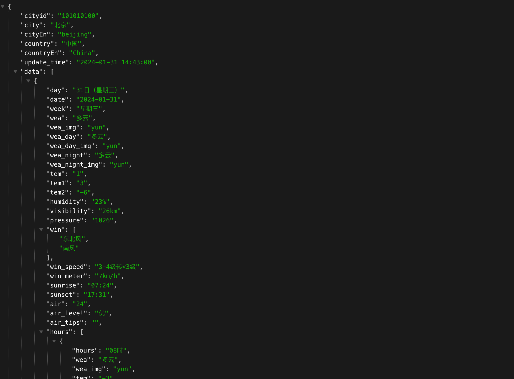

​			

# 模块1：Python基础

## 模块概述

欢迎来到本书的第一模块——Python基础！在这个模块中，我们将为您介绍Python编程语言最基础、最重要的概念和技术。

我们将从变量开始，通过学习运算符操作基本数据类型完成对于语句的学习，这是构建任何程序的基础。随后，我们将深入研究高级数据类型，包括列表和字典。列表是序列类型中的代表，而字典则是一种键值对的数据结构，用于存储和检索具有唯一标识符的值。通过列表和字典地学习，我们能够更加高级有效地组织管理数据。

除了基本和高级数据类型，我们还将介绍Python的流程控制语句。这些语句允许您根据条件执行不同的代码块、进行循环迭代和创建函数。通过学习流程控制语句，您将能够编写更加灵活和逻辑清晰的程序，实现不同的控制流程和决策。

在本模块中，我们将提供丰富的示例代码和练习，通过实践来巩固您的学习成果。我们将逐步引导您掌握Python的基础概念，培养解决问题的思维方式，并为您打下坚实的编程基础。


## Day01：Python初识&环境安装


### 1. 计算机组成原理

计算机组成原理是研究计算机硬件和软件组成及其相互关系的学科领域。它涵盖了计算机系统的各个方面，包括计算机的功能、组件、数据表示、指令集体系结构、处理器设计、存储器层次结构、输入输出系统、总线结构、操作系统以及计算机网络等。

冯·诺依曼体系结构：计算机通常采用冯·诺依曼体系结构，包括中央处理器（CPU）、存储器（内存）、输入设备和输出设备。它们通过总线进行数据和指令的传输。


> 1. 中央处理器（CPU）：CPU是计算机的核心部件，负责执行指令和处理数据。它包括控制单元和算术逻辑单元（ALU），控制单元负责指令的解码和控制，ALU负责执行算术和逻辑操作。
> 2. 存储器：存储器用于存储数据和指令。计算机中的存储器层次结构包括寄存器、、主存（内存）和辅助存储器。寄存器是最快速但容量最小的存储器，用于存储处理器中的数据和指令。主存是计算机的主要存储器，用于存储程序和数据。辅助存储器（如硬盘、固态硬盘）用于长期存储大量的数据。
> 3. 输入输出设备：输入输出设备用于与计算机进行交互和数据的输入输出。常见的输入设备包括键盘、鼠标、扫描仪等，输出设备包括显示器、打印机、音频设备等。输入输出设备通过接口和控制器与计算机连接。
> 4. 总线：总线是计算机中各个组件之间进行数据传输的通道。它包括数据总线、地址总线和控制总线。数据总线用于传输数据，地址总线用于指定数据的存储位置，控制总线用于传输控制信号。

### 2. 编程语言

#### 【1】什么是编程语言

编程语言是一种用于编写计算机程序的形式化语言。它是一种人与计算机之间进行交流的工具，用于描述和指示计算机执行特定任务或完成特定操作的步骤和逻辑。

编程语言可以分为多种类型，包括低级语言和高级语言。低级语言如汇编语言直接与计算机硬件交互，更接近机器语言。高级语言如Python、Java、C++等提供了更高级别的抽象和功能，使开发人员能够更快速、易读、易维护地编写程序。

##### 机器指令（1930-1960s）

机器语言阶段：计算机本质上就是是一台只懂得执行简单指令的机器。而执行的指令也就是我们说的机器指令，其实背后对应的就是一个个电路运算，例如算术运算、逻辑运算、存储等等。指令的执行本质就是由CPU来触发这些对应的电路执行从而完成特定的功能。

> 二进制的数字指令映射电路运算


##### 汇编语言（1947 ）

汇编语言阶段：机器语言对人类来说非常晦涩和难以理解。这使得编写和理解机器语言程序非常困难和容易出错。为了让人类能够更方便地编写和理解计算机程序，汇编语言应运而生。汇编语言本质就是数字符号化。


> 1. 汇编核心就是指令符号化
> 2. 什么是汇编器

##### 高级语言（1972 ）

尽管汇编语言比机器语言更容易理解，但仍然需要编写大量的指令来完成复杂的任务，包括各种底层硬件的直接操作。这对于开发人员来说是一项繁琐和容易出错的工作。为了进一步提高编程效率和可读性，高级语言应运而生。

高级语言是一种更加抽象和易用的编程语言，如C，Java、Python等。它们提供了更高级别的抽象，包括更丰富的数据类型、复杂的数据结构、函数、类、库等。使用高级语言，开发人员可以用更简洁、易读的方式表达程序的逻辑和算法，而不需要关注底层的机器细节。

随着计算机硬件的发展，高级语言的应用越来越广泛，例如 C、C++、Java、Python、JavaScript 等。


> 1. 高级语言的核心就是语句封装了指令
> 2. 什么是编译器或解释器

总之，高级语言的出现使得编程变得更加高效、易读和易维护。它们提供了更强大、更友好的工具和库，使开发人员能够更快速地构建复杂的应用程序，并推动了软件开发的快速发展。

#### 【2】编译型语言与解释型语言

编译型语言的代码在执行之前需要经过编译器的处理。编译器将源代码作为输入，通过多个阶段的处理生成机器码（目标代码），然后将目标代码链接为可执行文件。这个可执行文件可以直接在计算机上执行。编译型语言的典型代表是C、C++和Pascal等。


编译型语言的特点包括：

> 1. 编译过程在代码执行之前进行，只需要进行一次编译。
> 2. 编译后的代码执行效率高，因为它是直接由计算机硬件执行的机器码。
> 3. 可执行文件独立于源代码，可以在不同的计算机上执行，前提是目标机器上有相应的编译器和运行时支持。
> 4. 编译型语言对代码的静态类型检查较为严格，需要在编译时确定变量的类型和错误检查。

解释型语言的代码在执行时逐行被解释器解释执行，不需要显式的编译过程。解释器将源代码逐行解释翻译成机器码或虚拟机指令，并实时执行。解释型语言的典型代表是Python、JavaScript和Ruby等。

解释型语言的特点包括：

> 1. 不需要显式的编译过程，代码可以直接执行。
> 2. 每次执行都需要解释器逐行解释代码，因此执行效率相对较低。
> 3. 源代码可以跨平台执行，只需要针对不同平台提供相应的解释器。
> 4. 解释型语言通常具有动态类型检查的特性，变量的类型在运行时确定。

#### 【3】主流编程语言


### 3. Python介绍


Python 是1989 年荷兰人 Guido van Rossum （简称 Guido）在圣诞节期间为了打发时间，发明的一门面向对象的解释性编程语言。Python来自Guido所挚爱的电视剧Monty Python’s Flying Circus。


Guido对于Python的设计理念就是一门介于shell和C之间的语言。可以像shell那样，轻松高效编程，也可以像C语言那样，能够全面调用计算机的功能接口。

比如实现一个文件单词频率统计，分别通过C语言和Python实现：


python的设计哲学：优雅、明确、简洁。

> * 简洁优雅：Python的语法非常简洁，使用空格缩进来表示代码块，而不是使用大括号。这使得代码更加易读、易维护和易于理解。
>
> * 易学易用：Python具有较低的学习曲线，语法简单直观，对初学者非常友好。它提供了丰富的标准库和第三方库，用于处理各种任务，如数据处理、网络编程、图形界面开发等。
>
> * 大量的库和生态系统：Python拥有强大的库生态系统，如NumPy、Pandas、Matplotlib、SciPy、TensorFlow、Django等。这些库提供了丰富的功能和工具，加速了开发过程，使得开发者能够快速构建复杂的应用程序。
> * 跨平台性：Python可以在多个操作系统上运行，包括Windows、Linux、macOS等。这使得开发者能够轻松地在不同平台上部署和运行他们的应用程序。
> * 社区支持：Python拥有庞大的开发者社区，提供了丰富的文档、教程和资源。开发者可以从社区中获取帮助、分享经验和学习最佳实践。

Python在各个领域得到广泛应用，包括科学计算、数据分析、人工智能、机器学习、Web开发、网络爬虫、自动化脚本、游戏开发等。


总之，Python是一种强大而灵活的编程语言，适用于从小型脚本到大型应用程序的开发。其简洁的语法、丰富的库和友好的社区使得Python成为许多开发者的首选语言。

### 4. 终端环境

终端环境是计算机操作系统提供的一种命令行界面，也称为命令行终端或控制台。它允许用户通过键盘输入命令并接收计算机的输出结果。终端环境提供了一种直接而强大的方式来与计算机交互和管理系统。


#### 【1】win系统

```shell
# (1) cd 路径切换
cd：切换当前工作目录。例如：
    cd /path/to/directory：切换到指定路径的目录。
    cd ~：切换到当前用户的主目录。
    cd ..：切换到上级目录。
D: # 切换另外一个盘符，再继续cd
    
# (2) 创建文件夹
mkdir 文件夹名 

# (3) 创建文件：echo命令将空内容输出到一个新文件中
echo. > filename.txt

# (4) 显示文件内容
type file_name

# (4) 清空终端显示
cls

# (5) 删除
del file_name # 删除文件
rmdir /s yuan # 删除文件夹
```

#### 【2】Mac系统

```bash
cd /  # 进入根路径 
touch 文件名   # 创建文件
open 文件名    # 打开文件
cat file_name # 显示文件的内容
clear # 清空终端显示
rm file_name  # 删除文件 
rm -r directory_name # 递归删除文件夹
```

### 5. Python环境安装

进入Python官网：

```python
https://www.python.org/
```


#### 【1】window版本


安装包：

安装过程：


打开终端【win+R】


我们的第一个Python程序：


> * 内置函数print()，可以打印文本字符串到控制台
> * 顶格位置

#### 【2】MAC版本


进入页面，拉到最后：


此时正在下载mac系统的Python安装包【注意不是解释器】


> open /Library/Frameworks/Python.framework/Versions/3.12/


环境变量：


> 1. Python的环境变量可以放在`zprofile`和`bash_profile`中的任意一个文件中，具体取决于你使用的是哪个Shell。
>
> - 如果你使用的是Zsh Shell，你可以将Python的环境变量设置放在`~/.zprofile`文件中。
> - 如果你使用的是Bash Shell，你可以将Python的环境变量设置放在`~/.bash_profile`文件中。

如果全局变量没有配置，手动配置：

```python
1. vim ~/.zprofile

2. PATH="/Library/Frameworks/Python.framework/Versions/3.12/bin:${PATH}"
   export PATH
```


> 内置函数print()，可以打印文本字符串到控制台

### 6. Pycharm安装与使用

#### 【1】Pycharm下载与安装

官网：

```text
https://www.jetbrains.com/zh-cn/pycharm/
```


安装包：

安装流程：


启动Pycharm：


#### 【2】Pycharm的基本使用


强烈建议初学者按图中所示选用**本地**的 Python 解释器。默认情况下，PyCharm会选用第一种配置方式，它会自动为项目配置**虚拟环境**，即向项目中添加运行 Python 程序所必备的文件（例如 Python 解释器和标准库文件），但这些文件对于初学者来说，是晦涩难懂的，我们会在后面给大家详细介绍，但对 Python 入门没有任何帮助。


> 1. 文件和文件夹管理
> 2. 代码编辑
> 3. 程序执行
> 4. 结果显示
>
> 再加上各种提示功能和快捷操作，Pycharm大大提高了我们代码开发的效率

#### 【3】Pycharm的常用配置

1. 主题配置

2. 字体大小

   （1）直接设置

   

   （2）滚轮配置

   

3. 解释器配置

   

4. Pycharm常用的快捷键：


### 7. 今日作业

1. 计算机系统中都扮演着存储数据的角色有哪些，读写速度如何排序？
2. 一个程序打开，即被执行后，生成的数据存储在哪里？
3. Python是编译型语言还是解释型语言？
4. 简述Python的语言的优缺点和广泛应用在哪些领域
5. 简述下你对Python解释器的理解，目前市场广泛使用的解释器版本？
7. 简述环境变量的作用
8. Python脚本的执行命令？
9. 简述下Python的交互式模式（Interactive Mode ）和脚本模式（Script Mode），两者的使用场景和方式
10. 简述下Pycharm的作用以及和Python解释器的关系
11. 在Pycharm中创建一个Python代码项目目录，文件夹Day01，以及第一个Python程序，实现在控制台打印`【你的姓名】你好，欢迎来到Python的编程世界！`的文本输出。


## Day02：Python基本语法


### 1. Python 代码结构与规范

#### 【1】注释语句


注释语句（Comment Statement）是在程序代码中添加的一种特殊类型的语句，用于提供对代码的解释、说明或备注。注释语句通常不会被编译器或解释器执行，而是被忽略或跳过。

注释语句的主要作用是为了增强代码的可读性和可维护性，以便程序员和其他人能够更好地理解代码的意图、功能和实现细节。注释可以包含对代码的解释、算法说明、特殊用途的标记、作者信息、相关链接等内容。

不同的编程语言使用不同的注释语法，但大多数编程语言都提供了以下两种常见的注释类型：

1. **单行注释**：在单行注释中，注释内容从注释符号开始（通常是一个特定的符号或字符序列），一直延伸到该行的结尾。单行注释用于注释单个代码行或在代码行末尾添加注释。例如：

   ```python
   # 这是一个单行注释
   print("hello world")  # 在控制台打印hello world字符串
   ```

2. **多行注释**：多行注释允许在多个行上添加注释内容。它通常用于注释多行代码块或提供更详细的代码解释。多行注释的语法和符号因编程语言而异。例如，在Python中，多行注释使用三个引号（'''）或三个双引号（"""）括起来，如：

```python
"""
这是一个多行注释的示例。
它可以跨越多个行，并提供对代码的详细解释。
"""
print("hello world") # 在控制台打印hello world字符串
```

需要注意的是，注释语句不会对程序的执行产生任何影响，它们只是用于辅助代码的理解和维护。在编写代码时，良好的注释实践可以提高代码的可读性和可维护性，有助于团队合作和代码重用。

> Pycharm的注释快捷键：Ctrl+/

#### 【2】语句&语句分隔符

语句分隔符（Statement Separator）是用于在编程语言中分隔不同语句的符号或字符。它指示编译器或解释器在代码中的哪个位置结束一条语句，并开始解析下一条语句。

在Python中，语句之间的分隔符有两个：`换行符`和`分号`，推荐`换行符`

```python
print("hello yuan");print("hello world") # 分号作为分隔符
print(100) # 换行符作为分隔符,
print(200)
```

#### 【3】pep8规范

PEP 8是Python编程语言的官方编码风格指南（Python Enhancement Proposal 8），它提供了一套规范和建议，用于编写清晰、易读和一致的Python代码。PEP 8旨在促进Python代码的可读性，并为Python开发者提供一致的编码样式。

以下是PEP 8的一些主要规范和建议：

1. **缩进和空格：** 使用4个空格进行缩进，不要使用制表符（Tab）。在二元运算符周围和逗号后面使用空格，但在括号、方括号和花括号内部不要有空格。
2. **行的长度：** 每行代码尽量不超过79个字符，对于长表达式或注释，可以适度延长到不超过72个字符。
3. **命名规范：** 使用全小写字母和下划线来命名变量、函数和模块。类名应该使用驼峰命名法，首字母大写。
4. **空行：** 使用空行来组织代码，例如在函数和类定义之间、函数内部的逻辑块之间使用空行。
5. **导入规范：** 在不同的行上导入不同的模块。避免使用通配符导入（`from module import *`），而是明确导入需要使用的函数、类或变量。
6. **注释：** 使用注释来解释代码的意图和功能。注释应该清晰、简洁，并遵循特定的注释规范。
7. **函数和类定义：** 在函数和类定义之间使用两个空行。函数定义应该包含文档字符串（docstring），用于描述函数的功能和参数。
8. **代码布局：** 使用合适的空格和空行来组织代码，使其易于阅读和理解。

PEP 8并非强制性规范，但它是Python社区广泛接受的编码风格指南。遵循PEP 8可以提高代码的可读性，使不同开发者之间的代码更加一致，并促进Python项目的可维护性。

```python
# 规范
#不规范


print(100) # 空两行，规范

x=10  # 不规范
x = 10  # 规范 =左右留一个空格

updateuserprofile = ""  # 变量命名不规范
updateUserProfile = ""  # 变量命名规范
```

> Pycharm的格式化快捷键：**Ctrl + Alt + L**

### 2. 变量


#### 【1】变量初识

在Python中，变量是一个标识符，用于引用存储在计算机内存中的数据。每个变量都有一个名称和一个关联的值，可以将值存储在变量中并在程序中多次使用。以下是有关Python变量的一些基本概念：

```python
# 用等号(=)将一个值赋给一个变量
# 游戏场景
role = "刺客"
name = "李白"
attack = 500
healthy = 100
level = 3
experience = 1000
is_movable = False # 是否可以移动（冰冻效果）
```

> 1. 在Python中，变量名（即标识符）是存储在命名空间中的。命名空间是一个变量名和对象之间的映射关系（一个字典结构），它将变量名与对象的引用关联起来。
>
> 2. 全局命名空间是在程序运行时创建的，并在整个程序执行期间一直存在。
>
> 3. 局部命名空间是在函数调用时创建的，并在函数执行期间存在。

#### 【2】变量的用法

##### （1） 基本用法

变量简单的使用就是直接赋值

```python
# （1）变量的多次使用
x = 10
y = 20 # 可以简写：x,y = 10,20

print(x + y)
print(x - y)
print(x * y)
print(x / y)

# （2）变量的重新赋值（修改变量值）
x = 1
x = 2 # 重新赋值

healthy = 100
healthy = 90

level = 1
level = 2
```

> id(数据)，是Python的一个内置函数，返回某个数据对象的内存地址

##### （2）变量传递

```python
x = 1
print(id(x))
y = x # 编程中十分重要的操作：变量传递，对于它的理解至关重要！
x = 2
print(id(x))
print(y)
```

案例：`交换两个变量值`

```python
x = 1
y = 2
# 方式1
t = x
x = y
y = t
# 方式2
x , y = y , x
```

##### （3）表达式赋值

```python
x = 1 + 1
y = x + 1
y = y + 1 
```

案例1：

```python
# 案例
print("游戏开始...")
player_exp = 500
player_level = 3

print("闯关成功")
player_exp = player_exp + 50
player_level = player_level + 1

print("当前级别：",player_level)
print("当前经验值：",player_exp)
# 生命值减少10怎么写？
```

#### 【3】变量的命名规范

Python的变量命名规范通常遵循以下规则：

> 1. 变量名应该具有描述性，以便代码的可读性更高，例如在代码中使用的名称应该清晰、简洁、有意义，避免使用缩写或单个字符。
>2. 变量名应该遵循一定的命名约定，采用驼峰命名法或下划线命名法：驼峰命名法指的是将每个单词的首字母大写，单词之间不使用下划线，例如`myVariableName`；下划线命名法指的是使用小写字母和下划线来分隔单词，例如`my_variable_name`。在Python中，推荐使用下划线命名法（也称为蛇形命名法）
> 3. 变量名只能包含字母、数字和下划线_,不能以数字开头。
>4. 变量名不能使用保留字(例如f、else、while等等)。

附：**Python的关键字**


### 3. 基本数据类型

在编程中，基本数据类型指的是编程语言中提供的最基本、最原始的数据类型，通常是原生支持的数据类型，而不是通过其他数据类型组合而来的。

在Python中，常见的基本数据类型包括：


#### 【1】整型和浮点型

整型（integer）和浮点型（float）是Python中常用的数字数据类型。它们用于表示不同种类的数值，并在数值计算和数据处理中发挥重要作用。

整型（integer）：

- 整型用于表示整数（正整数、负整数和零）。
- 在Python中，整型是一种不可变（immutable）的数据类型，表示为整数字面值，例如 `5`、`-10`、`0` 等。

```python
x = 1
y = -10
blood = 100
```

浮点型（float）：

- 浮点型用于表示带有小数部分的数值，也称为浮点数。
- 在Python中，浮点型是一种不可变的数据类型，表示为浮点数字面值，例如 `3.14`、`-2.5` 等。

```python
pi = 3.14
temperature = -2.5
pi_type = type(pi)
print(pi_type)
print(type(pi_type))
```

> 内置函数type(对象)可以获取某个数据对象的类型名称

整型对象和浮点型对象可以用于科学运算：

```python
print(1+1)
# 比如游戏的等级，血值，攻击力
```

#### 【2】字符串类型

字符串是一种在计算机程序中常用的数据类型，用于操作文本数据。字符串可以看作是由一系列字符组成的序列，每个字符可以是字母、数字、符号或其他字符。

在计算机程序中，字符串通常使用一对单引号(')或双引号(")括起来，例如：`"hello world"`或`'Python is fun!'`。同时Python还支持使用三重引号(`'''`或`"""`)来表示多行字符串。

以下是Python字符串的代码示例，输出"hello路飞学城":

```python
s1 = "hello 路飞学城"
print(s)

s2 = "hello yuan!"
s3 = "10"
```

这个例子中，我们使用了字符串类型，并将其赋值给一个变量，然后使用print函数输出该变量的值。注意，在字符串中可以使用中文字符，Python默认使用UTF-8编码，可以支持多种语言的字符。

#### 【3】布尔类型

布尔类型（boolean）是Python中的一种基本数据类型，用于表示逻辑值。布尔类型只有两个可能的取值：`True`（真）和 `False`（假）。


```python
print(2 > 1) # True
print(3 != 2) # False
```

布尔类型通常用于条件判断和逻辑运算，用于控制程序的流程和决策。

以下是一些常见的用法和特点：

> 1. 布尔值：`True` 和 `False` 是布尔类型的两个取值。它们是Python中的关键字，不是字符串。
> 2. 条件判断：布尔类型常用于条件语句的判断条件，例如 `if` 语句中的条件表达式。根据条件表达式的真假，决定是否执行相应的代码块。
> 3. 关系运算符：关系运算符（如 `==`、`!=`、`<`、`>`、`<=`、`>=`）用于比较两个值，并返回布尔结果。例如 `x > y` 将返回布尔值表示 x 是否大于 y。
> 4. 逻辑运算：布尔类型可以通过逻辑运算符（如 `and`、`or`、`not`）进行组合和操作。逻辑运算可以用于组合多个布尔值，产生新的布尔结果。
> 5. `bool()`是一个内置函数，用于将给定的值转换为对应的布尔值。
> 6. 零值：每一个数据类型都有一个布尔值为False的值，我们称之为零值
>    * 整型的零值是0，浮点型是0.0
>    * 字符串的零值是""
>    * 布尔类型的零值是False
>    * NoneType的零值是None
>    * 列表的零值是[]
>    * 元组的零值是()
>    * 字典的零值是{}

#### 【4】输入输出函数

在Python中，输入和输出函数用于与用户进行交互，并在程序的执行过程中获取输入值和显示输出结果。

##### （1）input函数

`input(prompt)`：用于从用户获取输入值。它会在控制台中显示一个提示信息（prompt），等待用户输入，并返回用户输入的内容作为字符串。

```python
name = input("请输入您的姓名")
age = input("请输入您的年龄")

print(name, type(name))
print(age, type(age))
```

##### （2）print函数

`print(value1, value2, ...)`：用于将值打印到控制台。它可以接受一个或多个参数，并将它们打印为字符串。


```py
name = "yuan"
age = 19
print("用户信息:", name, age, sep="｜", end="")
print("程序结束！")
```

#### 【5】常见类型转换

```python
# （1）字符串到整数（int）转换
num_str = "123"
num_int = int(num_str)
print(num_int)  # 输出：123
# （2）整数（int）到字符串转换
num_int = 123
num_str = str(num_int)
print(num_str)  # 输出："123"
# （3）字符串到浮点数（float）转换
float_str = "3.14"
float_num = float(float_str)
print(float_num)  # 输出：3.14
# （4）浮点数（float）到字符串转换
float_num = 3.14
float_str = str(float_num)
print(float_str)  # 输出："3.14"
```

案例：

```python
num01 = input("请输入一个数字:")
num02 = input("请再输入一个数字:")
print(float(num01) + float(num02))
```

#### 【6】NoneType类型


在 Python 中，`None` 是一个特殊的常量，表示缺少值或空值。它常用于表示函数没有返回值或变量尚未被赋值的情况。None 是 NoneType 数据类型的唯一值（其他编程语言可能称这个值为 null、nil 或 undefined）

应用1：函数返回值

```python
# 函数返回值
ret = print("hello world")
print("ret:", ret)
```

我们一直使用 print() 函数的返回值就是 None。因为它的功能是在屏幕上显示文本，根本不需要返回任何值，所以 print() 就返回 None。

应用2：初始化赋值

```python
# 模拟计算过程
num1 = int(input("请输入num1："))
num2 = int(input("请输入num2:"))
operator = input("请输入运算符：")
# result = None
if operator == '+':
    result = num1 + num2
elif operator == '-':
    result = num1 - num2
elif operator == '*':
    result = num1 * num2
elif operator == '/':
    result = num1 / num2

print(result)
```

### 4. 运算符

* 语句是一条完整的执行指令，语句通常会改变程序的状态、执行特定的操作或控制程序的流程。语句可以是赋值语句、函数调用，条件语句、循环语句等。**语句没有返回值**。

* 表达式是由值、变量、运算符和函数调用组成的代码片段，它可以**计算出一个值**。表达式可以包含字面值（如数字、字符串）、变量、运算符（如加法、乘法）、函数调用等。表达式的执行会返回一个非空的结果值。**表达式具有返回值**，可以作为其他表达式的一部分使用。

举例来说：

> - `x = 5` 是一个赋值语句，将值 5 赋给变量 x，它没有返回值。
> - `y = x + 3 >4 ` 是一个赋值语句，将变量 x 的值加上 3，并将结果赋给变量 y，它也没有返回值。
> - `print(y)` 是一个打印语句，用于将变量 y 的值输出到控制台，它仅用于执行操作，没有返回值。
> - `type("hello")`函数调用，但是一个表达式，因为计算出结果了。

Python提供了多种类型的运算符，用于数学运算、逻辑判断、赋值操作等。下面是一些常见的运算符。

#### 【1】计算运算符


#### 【2】比较运算符


#### 【3】赋值运算符

赋值运算符是用于将一个值或表达式赋给一个变量的运算符。它们用于在程序中给变量赋值，以便存储和操作数据。


```python
print("游戏开始...")
player_exp = 100
player_level = 1
player_blood = 1000

print("闯关成功")

player_exp += 50  # player_exp = player_exp + 50
player_level += 1  # player_level = player_level + 1

print("当前级别：", player_level)
print("当前经验值：", player_exp)

print("受到攻击")
player_blood -= 20  # player_blood = player_blood - 20
print("当前生命值：", player_blood)
```

#### 【4】逻辑运算符

逻辑运算符是用于在逻辑表达式中进行组合和操作的运算符。它们用于组合和操作布尔值（True 或 False）来生成新的布尔值结果。在Python中，逻辑运算符包括三个：`and`、`or`和`not`。


逻辑运算符通常与条件语句（如 `if` 语句）一起使用，用于控制程序的流程和进行逻辑判断。它们可以用于组合多个条件，并根据这些条件的结果生成新的布尔值。

#### 【5】成员运算符

成员运算符是用于检查一个值是否存在于某个序列（例如列表、元组、字符串等）中的运算符。Python 提供了两个成员运算符：`in` 和 `not in`。

```python
print("yuan" in "hello yuan")
print(100 in [1, 10, 100, 1000])
print("yuan" not in ["rain","eric","alvin","hello yuan"])
```

#### 【6】运算符优先级

在Python中，运算符优先级指定了在表达式中运算符的执行顺序。以下是Python中常见运算符的优先级从高到低的顺序（同一优先级的运算符从左到右结合）：

1. 括号：`()`，最高优先级，用于控制表达式的执行顺序。
2. 幂运算：`**`，次高优先级，用于进行指数运算。
3. 正负号：`+`（正号）和 `-`（负号），用于表示正负数。
4. 乘法、除法和取模运算：`*`、`/`、`//`（整除）和 `%`（取模）。
5. 加法和减法运算：`+`和 `-`。
6. 比较运算符：`<`、`>`、`<=`、`>=`、`==`（等于）、`!=`（不等于）等。
7. 逻辑运算符：`and`、`or`、`not`，用于逻辑运算。
8. 赋值运算符：`=`, `+=`, `-=`, `*=`, `/=`, `//=`, `%=`, `**=` 等。

```python
# 案例1
a = 1 + 1  # 先计算1+1，再将得到的2赋值给a
# 案例2
x = 10
y = 5
z = 2
result = x + y * z ** 2 / (x - y) 
```

### 5. 今日作业

1. **以下哪个变量名是符合语法**

```python
A $a   B. id  C. 2a  D. _name
```

2. **解析`x=1;x=x+1`执行过程**

3. **`1+"1"`的结果是?**

4. **`bool("2<1")`的结果是？**

1. **浅述目前学过的Python的内置函数以及功能**
2. **分析下面程序的执行过程以及结果**

```python
a = 1
b = a
c = b
a, d = c + 1, b + 2
a += 1
print(a,d)
```

7. **获取用户输入圆的半径。使用圆的周长和面积公式计算并打印出输入半径的圆的周长和面积。**
7. **假设有一个变量count的初始值为0，将count增加5次，每次增加值分别为1，2，3，4，5，然后打印count的值。**

8. **判断一个学生的考试成绩score是否在80到100之间（包括80和100）**

9. **输入一个数字，判断是否是三位数且能被13整除**

10. **判断用户名密码是否正确**

11. **判断一个年份year是否是闰年，如果是，则打印"year是闰年"，否则打印"year不是闰年"。闰年满足以下条件：能被4整除但不能被100整除，或者能被400整除。**

## Day03：字符串深入使用


字符串是计算机编程中表示文本数据的一种数据类型。它是由字符组成的序列，可以包含字母、数字、标点符号和其他特殊字符。

### 1. 字符串的转义符

转义有两层含义：

1. 将一些普通符号赋予特殊功能，比如`\n`,`\t`等
2. 将一些特殊符号变为普通符号，比如`\"`,`\\`等

以下是一些常见的转义字符及其含义：

> `\n`：换行符，表示在字符串中创建一个新行。
>
> `\t`：制表符，表示在字符串中插入一个水平制表符（Tab）。
>
> `\b`：退格字符，b代表backspace，可以把一个退格符看成一个backspace键
>
> `\"`：双引号，用于在字符串中包含双引号字符。
>
> `\'`：单引号，用于在字符串中包含单引号字符。
>
> `\\`：反斜杠，用于在字符串中包含反斜杠字符本身。

```python
s1 = 'D:\Program Files\nancy\table\back\Python 3.8\python.exe'
print(s1)

s2 = 'D:\Program Files\\nancy\\table\\back\Python 3.8\python.exe'
print(s2)

s3 = r'D:\Program Files\nancy\table\back\Python 3.8\python.exe'
print(s3)

s4 = "i'm \"yuan!\""
s5 = 'i\'m "yuan!"'
print(s4)
print(s5)
```

### 2. 格式化输出

格式化输出是一种将变量值和其他文本组合成特定格式的字符串的技术。它允许我们以可读性更好的方式将数据插入到字符串中，并指定其显示的样式和布局。

在Python中，有多种方法可以进行格式化输出，其中最常用的方式是使用字符串的 f-strings（格式化字符串字面值）。

#### 【1】%占位符

```python
name = "Yuan"
age = 19
message = "My name is %s, and I am %s years old." % (name, age)
print(message)
```

在这个示例中，我们使用 `%s` 占位符将变量 `name` 的值插入到字符串 `"Hello, %s!"` 中，然后通过 `%` 运算符进行格式化。在执行格式化时，`%` 运算符的左侧是字符串模板，右侧是要按顺序插入的值。

#### 【2】f-string格式

格式化字符串字面值（Formatted String Literal，或称为 f-string）来进行格式化输出。适用于 Python 3.6 及以上版本

```python
name = "yuan"
age = 18
height = 185.123456

s = f"姓名：{name: ^15}，年龄：{age}，身高：{height:^15.5}cm"
print(s)
name = "alex123456"
age = 18
height = 185

print(s)
```

##### 宽度与精度

格式描述符形式为：`width[.precision]`。

- `width`正整数，设置字符串的宽度。
- `precision`非负整数，可选项，设置字符串的精度，即显示字符串前多少个字符。

##### 填充与对齐

格式描述符形式为：`[pad]alignWidth[.precision]`。

- `pad`填充字符，可选，默认空格。
- `align`对齐方式，可选`<`(左对齐)，`>`(右对齐)，`^`(居中对齐)。

虽然 `%s` 是一种用于字符串格式化的方式，但自从 Python 3.6 版本起，推荐使用格式化字符串字面值（f-string）或 `.format()` 方法来进行字符串格式化，因为它们提供了更简洁和直观的语法。

### 3. 字符串序列操作


#### 【1】索引和切片

在编程中，索引（Index）和切片（Slice）是用于访问和操作序列（如字符串、列表、元组等）中元素的常用操作。

字符串属于序列类型，所谓序列，指的是一块可存放多个值的连续内存空间，这些值按一定顺序排列，可通过每个值所在位置的编号(称为索引)访问它们。

* 索引用于通过指定位置来访问序列中的单个元素。在大多数编程语言中，索引通常从0开始，表示序列中的第一个元素，然后依次递增。而负索引从 -1 开始，表示序列中的最后一个元素。使用方括号 `[]` 来访问特定索引位置的元素。
* 切片用于从序列中获取一定范围的子序列。它通过指定起始索引和结束索引来选择需要的子序列。切片操作使用方括号 `[]`，并在方括号内使用 `start:stop:step` 的形式。注意，`start`的元素可以获取到，`stop`的元素获取不到，最后一个元素是`[stop-1]`对应的元素。

```python
s = "hello yuan"
# (1) 索引:获取某个字符
print(s[0])  # "h"
print(s[-1])  # "n"
# (2) 切片:获取某段子字符串
print(s[2:5])  # 输出"1lo"
print(s[:5])  # 输出"hello"
print(s[6:-1])  # 输出"yua"
print(s[6:])  # 输出"yuan"
print(s[:])  # 输出"hello yuan"
print(s[-1:-3:-1])
print(s[::-1])  # 输出“hello yuan”
```

#### 【2】其它操作

```python
# 不支持修改，添加元素
# 这是因为字符串在Python中被视为不可更改的序列。一旦创建了一个字符串，就无法直接修改其字符。
# s[0] = "a"
# s[10] = "!"
# 支持的操作
# (1) 获取长度，即元素个数
print(len(s))  # 10
# (2) +、*拼接
s1 = "hello"
s2 = "yuan"
print(s1 + " " + s2)
print("*" * 100)
# 字符串累加
s = ""
s += s1
s += s2
# (3) in判断
print("yuan" in s)  # True
```

### 4. 字符串内置方法


```python
# (1) 字符串转大写：upper(),字符串转小写：lower()
s = "YuanHao"
print(s.upper())  # YUANHAO
print(s.lower())  # yuanhao
# (2) 判断是否以xxx开头
name = "张三"
# 判断是不是姓张
print(name.startswith("张"))
# (3) 判断是否以xxx结尾
url = "/xxx/yyy/zzz/a.png"
print(url.endswith("png"))
# (4) find和index都是查找某子字符串的索引，find找不到返回-1,index找不到报错
print(name.find("三"))
print(name.index("三"))

# (5) 去除两端空格或换行符\n
name = input("请输入姓名:")
print(name, len(name))
name = name.strip()
print(name, len(name))

# (6) 判断某字符串是否全是数字
print("123".isdigit())


# (7) split()和join()
cities = "天津 北京 上海 哈尔滨"
cities_list = cities.split(" ")
print("cities_list", cities_list)
print(len(cities_list))
ret = ",".join(cities_list)
print(ret)  # "天津,北京,上海,哈尔滨

info = "yuan 19 180"
info_list = info.split(" ")
print(info_list[0])
print(info_list[1])
print(info_list[2])

# (8) replace(): 子字符串替换
sentence = "PHP is the best language.PHP...PHP...PHP..."
new_sentence = sentence.replace("PHP", "Python")
print(new_sentence)

comments = "这个产品真棒！我非常喜欢。服务很差，不推荐购买。这个餐厅的食物质量太差了，味道不好。我对这次旅行的体验非常满意。这个电影真糟糕，剧情一团糟。这个景点真糟糕，再也不来了！"
comments = comments.replace("差", "***").replace("不推荐", "***").replace("糟糕", "***")
print(comments)

# (9) count:计算字符串中某个子字符串出现的次数
print(sentence.count("PHP"))
```

### 5. 今日作业

1. **字符串索引切片练习**

```python
s= "hello world"

# 操作1：通过正反索引切片world

# 操作2: 获取world的翻转,即"dlrow"
```

2. **有些程序经常需要引导用户输入"Y"或"N"，其中"Y"代表肯定，"N"代表否定。无论用户输入大写的"Y"还是小写的"y"，结果都被视为肯定。肯定打印True。**
3. **下面是一个email邮件格式的字符串，将其中的任务ID,任务名称,执行时间,执行耗时,执行状态等值由用户引导输入嵌入到该模板中**

```html
"""<html>
<head>
   <meta charset="utf-8">
</head>
<body>
Hello，定时任务出错了：
<p style="font-size:16px;">任务执行详情：</p>
<p style="display:block; padding:10px; background:#efefef;border:1px solid #e4e4e4">
    任务 ID：1001<br/>
    任务名称：定时检测订单<br/>
    执行时间：2012-12-12<br/>
    执行耗时：15秒<br/>
    执行状态：开启
</p>
<br/>
<p>-----------------------------------------------------------------<br/>
    本邮件由CronJob定时系统自动发出，请勿回复<br/>
    如果要取消邮件通知，请登录到系统进行设置<br/>
</p>
</body>
</html>"""
```

   4. `names='yuan rain eric alvin'`,**引导用户输入一个名字，判断是否在这个名字字符串中，是打印True，不是打印False**

   5. **引导用户输入一个双值加法字符串，例如`3+5`或`3 + 5`，计算出两个数字的和，打印出来**

6. **用户输入一个11位手机号，将第5位至第8位替换成`*`**

7. **编写一个Python程序，输入一个三位数。将其拆分为百位数，十位数和个位数，井输出它们的和**

8. **将`Unix/Linux`系统下的路径字符串`"/Users/yuan/npm/index.js"`转换为`Windows`系统下的路径字符串`"\Users\yuan\npm\index.js"`。请使用两种方式来实现路径转换**

9. **引导用户输入一个字符串，判断是否是回文字符串**

10. 引导用户输入一个字符串，保证长度一定是4的倍数，不足位补`=`

    ```python
    # 加入用户输入
    data = "hello"
    # 处理完
    data = "helloworld=="
    ```

11. **引导用户输入一个手机号,通过一个逻辑表达式判断该字符串是否符合电信手机号格式，格式要求如下，是打印True，不是打印False**

    ```python
    # 要求1: 输入的长度必须是11位
    # 要求2: 输入内容必须全部是数字
    # 要求3: 前三位是133或153（电信号段）
    ```

12. **引导用户输入一个邮箱格式字符串，比如`916852314@163.com`或`1052065088@qq.com`等，然后将邮箱号和邮箱类型名打印出来，比如邮箱号`916852314`和`163邮箱`**

13. HTTP协议格式数据组装，引导用户分别输入请求方式，请求URL以及若干个请求头

    ```
    请输入 HTTP 请求方法：GET
    请输入 URL：https://www.example.com/api/data
    请输入 HTTP 协议：HTTP/1.1
    请输入请求头信息（键值对用冒号分隔，多个键值对用逗号分隔）：User-Agent: MyClient/1.0,Authorization: Token abcdef123456
    ```

    HTTP请求协议组装格式：请求方法，请求URL的路径以及请求协议名放在第一行，每一个请求头的键值对占一行，提示：换行用`\n`，打印格式如下

    ```http
    GET /api/data HTTP/1.1  
    User-Agent: MyClient/1.0
    Authorization: Token abcdef123456
    ```

## Day04：流程控制语句


流程控制语句是计算机编程中用于控制程序执行流程的语句。它们允许根据条件来控制代码的执行顺序和逻辑，从而使程序能够根据不同的情况做出不同的决策。流程控制实现了更复杂和灵活的编程逻辑。

* 顺序语句

  顺序语句是按照编写的顺序依次执行程序中的代码。代码会按照从上到下的顺序有且仅执行一次。

* 分支语句

  根据条件的真假来选择性地执行不同的代码块。这使得程序能够根据不同的情况做出不同的响应。

* 循环语句

  允许重复执行一段代码，以便处理大量的数据或重复的任务。循环语句可以用于多次执行相同或类似的代码块，从而实现重复操作的需求。

流程控制是编程中的基本概念之一，对于编写高效、可靠的程序至关重要。


### 1. 分支语句

#### 【1】双分支语句


双分支语句是一种编程结构，用于根据条件的真假选择不同的执行路径。它基于条件的结果，决定程序执行的部分。在许多编程语言中，双分支语句通常使用 if-else 语句来实现。

```python
if 条件表达式:
  # 条件表达式为True执行的语句块
  # pass 语句可以占位
else:
  # 条件表达式为False执行的语句块
```

其中，条件是一个表达式或逻辑判断，它的结果可以是 True（真）或 False（假）。

当条件为真时，执行代码块A，也称为 if 代码块；当条件为假时，执行代码块B，也称为 else 代码块。

双分支语句允许根据不同的条件结果执行不同的代码逻辑，从而实现程序的分支选择和条件判断。它是一种基本的控制流程结构，常用于处理二选一的情况。


```python
# 案例1：获取用户年龄
age = int(input("请输入您的年龄:"))

# 判断是否进入成年电影
if age >= 18:
    print("进入成人电影院！")
    print("欧美区")
    print("日韩区")
    print("国产区")
else:
    print("进入青少年模式！")
    print("科幻冒险类")
    print("益智早教类")
    print("科普记录类")
    
# 案例2:根据用户输入的成绩判断其等级。如果成绩大于等于60分，则输出"及格"，否则输出"不及格"。   

# 案例3: 编写一个程序，判断一个年份是否为闰年。如果是闰年，则输出"是闰年"，否则输出"不是闰年"。闰年的判断条件是能够被4整除但不能被100整除，或者能够被400整除。

# 案例4:编写一个程序，根据用户输入的三个数字，判断这三个数字是否能够构成一个等边三角形。如果能够构成等边三角形，则输出"能构成等边三角形"，否则输出"不能构成等边三角形"。等边三角形的判断条件是三条边的长度相等。
    
# 案例5: 用户输入一个年龄，判断是否符合20-35
    
# 案例6: 输入一个数字，判断是否为偶数    
```

**重点：**

和其它程序设计语言（如 [Java](https://c.biancheng.net/java/)、C 语言）采用大括号“{}”分隔代码块不同，[Python](https://c.biancheng.net/python/) 采用代码缩进和冒号（ : ）来区分代码块之间的层次。

在 Python 中，对于类定义、函数定义、流程控制语句、异常处理语句等，行尾的冒号和下一行的缩进，表示下一个代码块的开始，而缩进的结束则表示此代码块的结束。

注意，Python 中实现对代码的缩进，可以使用空格或者 Tab 键实现。但无论是手动敲空格，还是使用 Tab 键，通常情况下都是采用 4 个空格长度作为一个缩进量（默认情况下，一个 Tab 键就表示 4 个空格）。

#### 【2】单分支语句


单分支语句只包含一个条件判断和一个对应的代码块。如果条件为真，执行代码块中的语句；如果条件为假，则直接跳过代码块。

```python
# 示例：获取两个值中的较小值

# 获取两个输入值
value1 = float(input("请输入第一个值："))
value2 = float(input("请输入第二个值："))

# 使用单分支语句获取较小值
if value1 < value2:
    min_value = value1
else:
    min_value = value2

# 输出较小值
print("较小值为：", min_value)
```

这个案例可以使用单分支来实现

```python
# 示例：获取两个值中的较小值

# 获取两个输入值
value1 = float(input("请输入第一个值："))
value2 = float(input("请输入第二个值："))

# 使用单分支语句获取较小值
if value1 > value2:
    value1, value2 = value2, value1
print("较小值：", value1)
```

#### 【3】多分支语句

多分支语句（if-elif-else语句）可用于在多个条件之间进行选择。

```python
if condition1:
    # 当条件1为真时执行的代码块
elif condition2:
    # 当条件2为真时执行的代码块
elif condition3:
    # 当条件3为真时执行的代码块
...
else:
    # 当所有条件都为假时执行的代码块
```

##### **案例1:成绩等级**

```python
# 案例1:根据用户输入的成绩判断其等级。
# 如果成绩[90，100]，则输出"优秀"
# 如果成绩[80，90]，则输出"良好"
# 如果成绩[60，80]，则输出"及格"
# 如果成绩小于60，则输出"不及格"
# 如果成绩小于0或大于100，则输出"成绩有误"
```

```python
score = int(input("请输入您的成绩:"))

if 90 < score <= 100:
    print("成绩优秀！")
elif 80 < score <= 90:
    print("成绩良好！")
elif 60 <= score <= 80:
    print("成绩及格！")
elif 0 <= score < 60:
    print("成绩不及格！")
else:
    print("成绩有误")


if score < 0 or score > 100:
    print("非法输入")
elif score > 90:
    print("成绩优秀！")
elif score > 80:
    print("成绩良好！")
elif score > 60:
    print("成绩及格！")
else:
    print("成绩成绩不及格")
```

##### 案例2:BMI测试


```python
# 示例：计算BMI并给出健康建议

# 获取用户输入的身高和体重
height = float(input("请输入您的身高（单位：米）："))
weight = float(input("请输入您的体重（单位：千克）："))

# 计算BMI
bmi = weight / (height ** 2)

# 根据BMI给出健康建议
if bmi < 18.5:
    advice = f"您的BMI为 {bmi:.3}，体重过轻，建议增加营养摄入。"
elif 18.5 <= bmi < 24:
    advice = f"您的BMI为 {bmi:.3}，体重正常，继续保持健康的生活方式。"
elif 24 <= bmi < 28:
    advice = f"您的BMI为 {bmi:.3}，体重过重，建议适当控制饮食并增加运动。"
else:
    advice = f"您的BMI为 {bmi:.3}，体重肥胖，建议减少高热量食物摄入并增加运动量。"

# 输出健康建议
print(advice)

```

##### 案例3：游戏场景选择


```python
#  场景：
# （1）怪物房： 遇到了史莱姆，并打败了它，金币加5，经验加10！
#  (2) 宝箱房: 你打开了宝箱，获得了钥匙
#  (3) 陷阱房: 你触发了陷阱，受到了毒箭的伤害,血值减10
#  (4) 商店:   你来到了商店，购买了药水,金币减5，血值加20
```

```python

import random

name = "勇士"
health = 100
coins = 0
exp = 0

print("欢迎来到地下城！")

print(f"""
    当前生命值：{health}
    当前经验值：{exp}
    当前金币：{coins}
    """)

input("按下 Enter 进入下一个房间...")
room = random.choice(["怪物房", "宝箱房", "陷阱房", "商店"])

if room == "怪物房":
    print("你遇到了史莱姆，并打败了它")
    exp += 10
    coins += 5
    print("金币加5，经验加10！")

elif room == "宝箱房":
    print("你打开了宝箱，获得了钥匙")

elif room == "陷阱房":
    print("你触发了陷阱，受到了毒箭的伤害")
    health -= 10
elif room == "商店":

    print("你来到了商店，购买了药水")
    coins -= 5
    health += 20

print(f"""
    当前生命值：{health}
    当前经验值：{exp}
    当前金币：{coins}
    """)
```

#### 【4】分支嵌套

分支嵌套是指在一个分支语句内部嵌套另一个分支语句。

案例1:

```python
age = int(input("年龄:"))

if age >= 18:
    print("成人电影!")
    choice = input("""
        1. 日韩区
        2. 欧美区
        3. 国产区
    """)
    if choice == "1":
        print("《熔炉》")
        print("《千与千寻》")
        print("《龙猫》")
        print("《天空之城》")
    elif choice == "2":
        print("《肖申克的救赎》")
        print("《当幸福来敲门》")
        print("《阿甘正传》")
        print("《星际穿越》")
    elif choice == "3":
        print("《霸王别姬》")
        print("《大话西游》")
        print("《让子弹飞》")
        print("《无间道》")
else:
    print("少儿电影")
    print("科幻冒险类")
    print("益智早教类")
    print("科普记录类")

print("程序结束")
```

案例2:

```python
"""
 勇士与地下城的场景续写：
（1）怪物房： 遇到了史莱姆
                1. 选择攻击，战胜史莱姆，则经验加20，金币加20，失败则经验减20，金币减20，血值减20，成功的概率为50%。
                2. 选择逃跑，则金币减20
 (2) 宝箱房: 你打开了宝箱，获得了钥匙
 (3) 陷阱房: 你触发了陷阱，受到了毒箭的伤害,血值减10
 (4) 商店:   你来到了商店，打印当前血值和金币，一个金币买一个药水对应10个血值，引导是否购买药水
                1. 购买，引导购买几个金币的药水，并完成减金币和增血值
                2. 不购买，打印退出商店
           
"""
```

```python
import random

name = "勇士"
health = 100
coins = 0
exp = 0

print("欢迎来到地下城！")

print(f"""
    当前生命值：{health}
    当前经验值：{exp}
    当前金币：{coins}
    """)

input("按下 Enter 进入下一个房间...")
room = random.choice(["怪物房", "宝箱房", "陷阱房", "商店"])

if room == "怪物房":
    action = input("请选择行动：(1)攻击  (2)逃跑")
    if action == "1":
        attack = random.randint(1, 20)
        if attack >= 10:
            print("你击败了史莱姆")
            coins += 10
        else:
            print("你的攻击没有命中！")
            health -= 20
    elif action == "2":
        print("你逃跑了，但失去了一些生命值")
        health -= 10
    else:
        print("无效的选择！请重新选择。")

elif room == "宝箱房":
    print("你打开了宝箱，获得了钥匙")

elif room == "陷阱房":
    print("你触发了陷阱，受到了毒箭的伤害")
    health -= 10
elif room == "商店":

    choice = input("你来到了商店，购买了药水，是否购买？【Y/N】")
    if choice == "Y" and coins >= 5:
        print("购买药水成功")
        coins -= 5
        health += 20
    else:
        print("退出商店")

print(f"""
    当前生命值：{health}
    当前经验值：{exp}
    当前金币：{coins}
    """)

```

### 2. 循环语句

**预备知识：**

PyCharm提供了丰富的功能来帮助开发者编写、调试和运行 Python 代码。其中，PyCharm 的 Debug 模式是一种强大的调试工具，可以帮助开发者在代码执行过程中逐行跟踪和分析程序的行为。以下是关于 PyCharm Debug 模式的介绍：

> 1. **设置断点**：在需要调试的代码行上设置断点，断点是程序的一个暂停点，当程序执行到断点时会暂停执行，允许开发者逐行检查代码。
> 2. **启动 Debug 模式**：在 PyCharm 中，可以通过点击工具栏上的 "Debug" 按钮来启动 Debug 模式，或者使用快捷键（通常是 F9）。
> 3. **逐行执行**：在 Debug 模式下，可以使用调试工具栏上的按钮（如「Step Over」、「Step Into」和「Step Out」）逐行执行代码。Step Over 会执行当前行并跳转到下一行，Step Into 会进入函数调用并逐行执行函数内部代码，Step Out 会执行完当前函数并跳出到调用该函数的位置。
> 4. **变量监视**：在 Debug 模式下，可以查看变量的值和状态。在调试工具栏的「Variables」窗口中，可以看到当前作在 PyCharm 中，Debug 模式是一种强大的调试工具，可以帮助开发者在代码执行过程中逐行跟踪和分析程序的行为。

**循环语句**

> 循环语句是编程中的一种控制结构，用于重复执行特定的代码块，直到满足特定的条件为止。它允许程序根据需要多次执行相同或类似的操作，从而简化重复的任务。


#### 【1】while循环

while循环用于在条件为真的情况下重复执行一段代码，直到条件变为假为止。以下是while循环的语法：

```python
while条件：
   循环体
```

在执行while循环时，程序会先检查条件是否为真。如果条件为真，就执行循环体中的代码，然后再次检查条件。如果条件仍为真，就再次执行循环体中的代码，以此类推，直到条件变为假为止。

```python
# 无限循环
while 1:
    print("hello yuan!")

# 有限循环方式1
count = 0  # 初始语句
while count < 10:  # 判断条件
    # print("hello yuan")
    print("count:::", count)
    count += 1  # 步进语句

#有限循环方式2
count = 100  # 初始语句
while count > 0:  # 判断条件
    print("count:::", count)
    count -= 1  # 步进语句
   
```

#### 【2】循环案例

##### 案例1：计算1-100的和

```python
"""
# 准备：
# 假设有一个变量s的初始值为0，将s增加5次，每次增加值分别为1，2，3，4，5，然后打印s的值。
"""

# 实现代码
count = 1  # 初始语句
s = 0
while count <= 100:  # 判断条件
    # s = 0  # 会怎么？
    print("count:::", count)
    s += count
    count += 1  # 步进语句

print(s)
```

##### 案例2：验证码案例


```python
"""

# 假设有一个变量s的初始值为""，将s拼接5次，每次增加值分别为"A"，"B"，"C"，然后打印s的值。
s = ""
s += "A"
s += "B"
s += "C"
print(s)

"""
import random
import string

char = string.ascii_letters + string.digits

count = 0
randomCodes = ""
while count < 10:
    code = random.choice(char)
    randomCodes += code
    count += 1

print(randomCodes)
```

#### 【3】for循环

for循环用于对一个容器对象(如字符串、列表、元组等)中的元素进行遍历和操作，直到所有元素都被遍历为止。以下是for循环的语法：

````python
for 变量 in 容器对象(字符串，列表，字典等)：
   循环体
  
for i in "hello world":
    # print("yuan")
    print(i)  
````

在执行for循环时，程序会依次将序列中的每个元素赋值给变量，并执行循环体中的代码，直到序列中的所有元素都被遍历完为止。

在 Python 中，`range()` 函数用于生成一个整数序列，它常用于循环和迭代操作。

```python
range(stop)
range(start, stop, step)
```

参数解释：

- `start`（可选）：序列的起始值，默认为 0。
- `stop`：序列的结束值（不包含在序列中）。
- `step`（可选）：序列中相邻两个值之间的步长，默认为 1。

```python

for i in range(100):  # 循环次数
    print("yuan")

    
# 基于for循环实现1+100的和的计算    
s = 0
for i in range(1, 101):  # 循环次数
    s += i
print(s)
```

#### 【4】嵌套语句

**案例1：打印出从 0 到 99 中能被 13 整除的所有数字。**

```python
for i in range(100):
    if i % 13 == 0:
        print(i)
```

**案例2：打印出从 1 到 100 的所有整数，但将整除 3 的数字打印为 "Fizz"，整除  5 的数字打印为 "Buzz"，同时整除  3 和 5 的数字打印为 "FizzBuzz"。**

```python
for i in range(1, 101):
    if i % 3 == 0 and i % 5 == 0:
        print("FizzBuzz")
    elif i % 3 == 0:
        print("Fizz")
    elif i % 5 == 0:
        print("Buzz")
    else:
        print(i)
```

**案例3：循环嵌套分支**

```python
import random

name = "勇士"
health = 100
coins = 0
exp = 0

print("欢迎来到地下城！")

while 1:
    print(f"""
        当前生命值：{health}
        当前经验值：{exp}
        当前金币：{coins}
        """)

    input("按下 Enter 进入下一个房间")
    room = random.choice(["怪物房", "宝箱房", "陷阱房", "商店"])
    # ......
```

**案例4：打印扑克牌**


```python
poke_types = ['♥️', '♦️', '♠️', '♣️']
poke_nums = [2, 3, 4, 5, 6, 7, 8, 9, 10, 'J', 'Q', 'K', 'A']

for p_type in poke_types:
    for p_num in poke_nums:
        print(f"{p_type}{p_num}")
   
```

#### 【5】退出循环

while是条件循环，条件为False时退出循环，for循环是遍历循环，遍历完成则退出，这都属于正常退出循环，如果想非正常退出循环，分为强制退出当次循环和退出整个循环，分别使用关键字`continue`和`break`来实现

* `break`退出整个循环

```python
# 退出while循环
while True:
    userInput = input("请输入一个数字（输入q退出）：")
    
    if userInput == 'q':
        print("退出循环")
        break
    
    number = int(userInput)
    square = number ** 2
    print(f"{number} 的平方是 {square}")
    
# 退出for循环
# 查找1-100中第一个能整除13的非零偶数
for i in range(100):
    if i % 13 == 0 and i != 0 and i % 2 == 0:
        print("获取i值：", i)
        break     
   
```

* `continue `退出当次循环

```python
for i in range(100):
    if i % 13 != 0:
        continue
    print("获取i值：", i)

for i in range(100):
    if i % 13 == 0:
        print("获取i值：", i) 
```

### 3. 今日作业

1. 编写一个程序，判断一个字符是否为元音字母（a、e、i、o、u，包括小写和大写）。如果是元音字母，则输出"是元音字母"，否则输出"不是元音字母"。

2. 统计元音字母：编写一个程序，接受用户输入的一段文本，统计其中元音字母（a、e、i、o、u）的个数，并输出结果。

3. 计算1-2+3-4+......-1000最终的结果,能整除13的数不参与计算

4. 身份证号码的倒数第二位数字是奇数，表示性别为男性，否则为女性，引导用户输入身份证号，先判断是否为18位，再判断性别。

5. 计算初始本金为1万，年利率为0.0325的情况下，需要多少年才能将本金和利息翻倍，即本金和利息的总和达到原来的两倍。

6. 编写一个程序，生成斐波那契数列的第20个数字（斐波那契数列是指从0和1开始，后面的每一项都是前两项的和）

   ```text
   0 1 1 2 3 5 8 ....
   ```

7. 编写一个程序，接受用户输入的一个整数，判断该数是否是素数（只能被1和自身整除的数）。注意，素数的定义是大于1的自然数，只能被1和自身整除，没有其他的正因数。

8. 猜数字游戏

   ```python
   1.首先，程序使用random.randint函数产生一个1~10之间的随机数。
   2.然后，程序通过for循环提示玩家输入一个猜测的数字，玩家可以输入一个1~10之间的整数。
   3.如果玩家猜对了数字，程序输出恭喜玩家的信息并结束游戏；如果玩家猜错了，程序会根据玩家输入的数字与随机数之间的大小关系来提示玩家是否猜对，并在每次猜错后告诉玩家还剩下几次机会。
   4.如果玩家在三次机会内猜对了数字，程序输出恭喜玩家的信息并结束游戏；否则程序输出很遗憾的信息并结束游戏。
   ```

9. 分支嵌套

   在选座购票中扩写，引导用户输入【普通票/学生票/老年票】，然后分支判断。

   ```python
   print("欢迎来到电影订票系统！")
   print("请选择您要进行的操作：")
   print("1. 查询电影场次")
   print("2. 选座购票")
   print("3. 查看订单信息")
   
   choice = int(input("请输入您的选择（1-3）："))
   
   if choice == 1:
       print("正在查询电影场次...")
       # 执行查询电影场次的代码
   elif choice == 2:
       print("正在选座购票...")
   
   elif choice == 3:
       print("正在查看订单信息...")
       # 执行查看订单信息的代码
   else:
       print("无效的选择！请重新运行程序并输入有效的选项。")
   
   ```

10. 打印一个nxn的矩阵，每个元素的值等于其所在行数和列数之和。

    ```
    // 比如4*4矩阵
    
    2	3	4	5	
    3	4	5	6	
    4	5	6	7	
    5	6	7	8
    ```

11. 打印一个如下的九九乘法表   

## Day05：列表&元组


高级数据类型是一种编程语言中提供的用于表示复杂数据结构的数据类型。相比于基础数据类型（如整数、浮点数、布尔值等），高级数据类型可以存储和操作更多的数据，并且具备更丰富的功能和操作方法。

Python的高级数据类型主要包括`列表`、`元组`，`字典`，`集合`。

### 1. 列表的概念

在Python中，列表（List）是一种有序、可变、可重复的数据结构，用于存储一组元素。列表是Python中最常用的数据类型之一，它可以包含任意类型的元素，例如整数、浮点数、字符串等。

```python
gf_name_list = ["高圆圆", "范冰冰", "李嘉欣", "陈红"]
info = ["yuan", 18, False]
print(type(info))  # <class 'list'>
```

> 列表的特点：
>
> 1. 列表中的元素按照顺序进行存储和管理
> 2. 元素可以是任意类型且可以不一致
> 3. 元素的长度理论上没有限制
> 4. 列表允许包含重复的元素
> 5. 列表是可变数据类型

### 2. 列表的基本操作


> 索引是管理列表的核心！

* **索引操作**

```python 
# 查询
l = ['高圆圆', '刘亦菲', '赵丽颖', '范冰冰', '李嘉欣']
print(l[2])  # 12
print(l[-1]) # 14
# 修改
l[3] = "佟丽娅"
```

* **切片操作**

```python 
# 查询操作
l = [10,11,12,13,14]
print(l[2:5])
print(l[-3:-1])
print(l[:3])
print(l[1:])
print(l[:])
print(l[2:4])
print(l[-3:-1])
print(l[-1:-3])
print(l[-1:-3:-1])
print(l[::2])
# 修改操作
l[1:4] = [1,2,3]
```

> 1、取出的元素数量为：结束位置 - 开始位置；
>
> 2、取出元素不包含结束位置对应的索引，列表最后一个元素使用 `list[len(slice)] `获取；
>
> 3、当缺省开始位置时，表示从连续区域开头到结束位置；
>
> 4、当缺省结束位置时，表示从开始位置到整个连续区域末尾；
>
> 5、两者同时缺省时，与列表本身等效；
>
> 6、step为正，从左向右切，为负从右向左切。

* **判断成员是否存在**

 in 关键字检查某元素是否为序列的成员

```python 
l = [10,11,12,13,14]
print(20 in l) # False
print(12 in l) # True
```

* **相加**

```python 
l1 = [1,2,3]
l2 = [4,5,6]
print(l1 + l2) # [1, 2, 3, 4, 5, 6]
```

* **循环列表**

```python 
for name in ["张三",'李四',"王五"]:
    print(name)
    
for i in range(10): # range函数： range(start,end,step)
    print(i)
    
# 基于for循环从100打印到1  
for i in range(100,0,-1):
    print(i)
```

* **计算元素个数**

  ```python
  # len函数可以计算任意容器对象的元素个数!!!
  print(len("hello yuan!"))
  print(len([1, 2, 3, 4, 5, 6]))
  print(len(["rain", "eric", "alvin", "yuan", "Alex"]))
  print(len({"k1":"v1","k2":"v2"}))
  ```

### 3. 列表的内置方法

#### 【1】内置方法


```python
gf_name_list = ['高圆圆', '刘亦菲', '赵丽颖', '范冰冰', '李嘉欣']

# 一、增
# (1) 列表最后位置追加一个值
gf_name_list.append("橘梨纱")
# (2) 向列表任意位置插入一个值
gf_name_list.insert(1, "橘梨纱")
# (3) 扩展列表
gf_name_list.extend(["橘梨纱", "波多野结衣"])
# 二、删
# (1) 按索引删除
gf_name_list.pop(3)
print(gf_name_list)
# (2) 按元素值删除
gf_name_list.remove("范冰冰")
print(gf_name_list)
# (3) 清空列表
gf_name_list.clear()
print(gf_name_list)

# 三、其他操作

l = [10, 2, 34, 4, 5, 2]
# 排序
l.sort()
print(l)
# 翻转
l.reverse()
print(l)
# 计算某元素出现个数
print(l.count(2))
# 查看某元素的索引
print(l.index(34))
```

#### 【2】案例练习

**案例1: 构建一个列表，存储1-10的平方值**

```python
l = []
for i in range(1, 11):
    # print(i ** 2)
    # l.append(i ** 2)
    if i % 2 == 0:
        l.append(i ** 2)

print(l)
```

**案例2：扑克牌发牌**

```python
import random

poke_types = ['♥️', '♦️', '♠️', '♣️']
poke_nums = [2, 3, 4, 5, 6, 7, 8, 9, 10, 'J', 'Q', 'K', 'A']
poke_list = []
for p_type in poke_types:
    for p_num in poke_nums:
        # print(f"{p_type}{p_num}")
        poke_list.append(f"{p_type}{p_num}")

print(poke_list)

# (1) 抽王八
# random.choice()：多选一
# ret1 = random.choice(poke_list)
# print(ret1)
# ret2 = random.choice(poke_list)
# print(ret2)
# ret3 = random.choice(poke_list)
# print(ret3)

# (2) 炸金花
# random.sample :多选多
ret1 = random.sample(poke_list, 3)

print(ret1)

for i in ret1:
    poke_list.remove(i)

print(len(poke_list))

ret2 = random.sample(poke_list, 3)
for i in ret2:
    poke_list.remove(i)

print(len(poke_list))
ret3 = random.sample(poke_list, 3)
print(ret1)
print(ret2)
print(ret3)
```

**案例3：实现一个购物车清单，可以引导用户添加商品和删除商品**

```python
shopping_cart = []

while True:
    print("--- 购物车清单 ---")
    print("1. 添加商品")
    print("2. 删除商品")
    print("3. 查看购物车")
    print("4. 结束程序")

    choice = input("请输入选项：")

    if choice == "1":
        item = input("请输入要添加的商品：")
        shopping_cart.append(item)
        print("已添加商品:", item)
        print()

    elif choice == "2":
        if len(shopping_cart) == 0:
            print("购物车为空，无法删除商品。")
        else:
            item = input("请输入要删除的商品：")
            if item in shopping_cart:
                shopping_cart.remove(item)
                print("已删除商品:", item)
            else:
                print("购物车中没有该商品。")
        print()

    elif choice == "3":
        if len(shopping_cart) == 0:
            print("购物车为空。")
        else:
            print("*" * 15)
            print("购物车内容:")
            for item in shopping_cart:

                print(item)
            print("*" * 15)
        print()

    elif choice == "4":
        print("程序已结束。")
        break

    else:
        print("无效选项，请重新输入。")
        print()
```

### 4. 列表的深浅拷贝

#### 【1】可变类型与不可变类型

在Python中，数据类型可以分为可变类型（Mutable）和不可变类型（Immutable）。这指的是对象在创建后是否可以更改其值或状态。

**不可变类型**是指创建后不能更改其值或状态的对象。如果对不可变类型的对象进行修改，将会创建一个新的对象，原始对象的值保持不变。在修改后，对象的身份标识（即内存地址）会发生变化。

以下是Python中常见的不可变类型：`整数（Integer） 和浮点数（Float）`,`布尔值（Boolean）`,`字符串（String）`,`元组（Tuple）`

**可变类型**是指可以在原地修改的对象，即可以改变其值或状态。当对可变类型的对象进行修改时，不会创建新的对象，而是直接修改原始对象。在修改后，对象的身份标识（即内存地址）保持不变。

Python中常见的可变类型：`列表（List）`,`字典（Dictionary）`

对于可变类型，可以通过方法调用或索引赋值进行修改，而不会改变对象的身份标识。而对于不可变类型，任何修改操作都会创建一个新的对象。

#### 【2】可变类型的存储方式

```python
l = [1，2，3] # 存储
```


#### 【3】可变类型的变量传递

变量实际上是对对象的引用。变量传递的核心是两个变量引用同一地址空间

```python
# 案例1:
x = 1
y = x
x = 2
# print(y)
print(id(x))
print(id(y))

# 案例2:
l1 = [1, 2, 3]
l2 = l1  # 变量传递
l1[0] = 100
print(l1, l2)
l2[1] = 200
print(l1, l2)

# 案例3:
l1 = [1, 2, 3]
l2 = [l1, 4, 5]  # 也属于变量传递
l1[0] = 100
print(l1, l2)
l2[0][1] = 200
print(l1, l2)
```


#### 【4】列表的深浅拷贝

在Python中，列表的拷贝可以分为深拷贝和浅拷贝两种方式。

浅拷贝（Shallow Copy）是创建一个新的列表对象，该对象与原始列表共享相同的元素对象。当你对其中一个列表进行修改时，另一个列表也会受到影响。

你可以使用以下方法进行浅拷贝：

```python
# （1）使用切片操作符[:]进行拷贝：
l1 = [1, 2, 3, 4, 5]
l = l1[:]

# （2）使用list()函数进行拷贝
l2 = [1, 2, 3, 4, 5]
l = list(l2)

# （3）使用copy()方法进行拷贝（需要导入copy模块）
l3 = [1, 2, 3, 4, 5]
l = l3.copy()
```

场景应用：


 ```python
 # 案例1
 l1 = [1, 2, 3]
 l2 = l1[:]  # 浅拷贝
 
 print(l2)
 print(id(l1[0]))
 print(id(l2[0]))
 l1[1] = 300
 print(l1)
 print(l2)
 
 # 案例2
 l = [4, 5]
 l1 = [1, 2, 3, l]
 l2 = l1[:]
 
 l1[0] = 100
 print(l2)
 l1[3][0] = 400
 print(l2)
 l1[3] = 400
 print(l2)
 ```

深拷贝（Deep Copy）是创建一个新的列表对象，并且递归地复制原始列表中的所有元素对象。这意味着原始列表和深拷贝的列表是完全独立的，对其中一个列表的修改不会影响另一个列表。

你可以使用`copy()`模块中的`deepcopy()`函数进行深拷贝：

```python
import copy

original_list = [1, 2, 3, 4, 5]
deep_copy = copy.deepcopy(original_list)
```

需要注意的是，深拷贝可能会更耗费内存和时间，特别是当拷贝的列表中包含大量嵌套的对象时。

### 5. 列表的嵌套

如果你要使用列表的嵌套来实现客户信息管理系统，可以将每个客户的信息存储在一个子列表中，然后将所有学生的子列表存储在主列表中。每个学生的信息可以按照一定的顺序存储，例如姓名、年龄、邮箱等。


```python
# 初始化客户信息列表
customers = [
    ["Alice", 25, "alice@example.com"],
    ["Bob", 30, "bob@example.com"],
    ["Charlie", 35, "charlie@example.com"]
]

# 增加客户信息
new_customer = ["David", 28, "david@example.com"]
customers.append(new_customer)

# 删除客户信息
delete_customer = "Bob"
for customer in customers:
    if customer[0] == delete_customer:
        customers.remove(customer)
        break

# 修改客户信息
update_customer = "Alice"
for customer in customers:
    if customer[0] == update_customer:
        customer[1] = 26
        break

# 查询客户信息
search_customer = "Charlie"
for customer in customers:
    if customer[0] == search_customer:
        name = customer[0]
        age = customer[1]
        email = customer[2]
        print(f"姓名: {name}, 年龄: {age}, 邮箱: {email}")
        break

# 功能整合        
print("""
       1. 添加客户
       2. 删除客户
       3. 修改客户
       4. 查询一个客户
       5. 查询所有客户
       6. 退出
    
    """)        
```

在这个案例代码中，每个客户的信息被存储在一个子列表中，然后将该客户的子列表添加到客户列表中。在展示学生信息时，可以通过索引访问每个客户的具体信息。该代码使用了列表的嵌套来存储客户信息。仍然实现了添加客户信息、查看客户信息和退出程序的功能。

### 6. 列表推导式

列表推导式（List comprehensions）是一种简洁的语法，用于创建新的列表，并可以在创建过程中对元素进行转换、筛选或组合操作。

列表推导式的一般形式为：

````python
new_list = [expression for item in iterable if condition]
````

其中：

- `expression` 是要应用于每个元素的表达式或操作。
- `item` 是来自可迭代对象（如列表、元组或字符串）的每个元素。
- `iterable` 是可迭代对象，提供要遍历的元素。
- `condition` 是一个可选的条件，用于筛选出满足条件的元素。

```python
# 创建一个包含1到5的平方的列表
squares = [x**2 for x in range(1, 6)]
print(squares)  # 输出: [1, 4, 9, 16, 25]

# 筛选出长度大于等于5的字符串
words = ["apple", "banana", "cherry", "date", "elderberry"]
filtered_words = [word for word in words if len(word) >= 5]
print(filtered_words)  # 输出: ["apple", "banana", "cherry"]

# 将两个列表中的元素进行组合
numbers = [1, 2, 3]
letters = ['A', 'B', 'C']
combined = [(number, letter) for number in numbers for letter in letters]
print(combined)  # 输出: [(1, 'A'), (1, 'B'), (1, 'C'), (2, 'A'), (2, 'B'), (2, 'C'), (3, 'A'), (3, 'B'), (3, 'C')]
```

### 7. 元组

元组（Tuple）是Python中的一种数据类型，它是一个有序的、不可变的序列。元组使用圆括号 () 来表示，其中的元素可以是任意类型，并且可以包含重复的元素。

与列表（List）不同，元组是不可变的，这意味着一旦创建，它的元素就不能被修改、删除或添加。元组适合用于存储一组不可变的数据。例如，你可以使用元组来表示一个坐标点的 x 和 y 坐标值，或者表示日期的年、月、日等。**元组也被称为只读列表**

```python
info = ("yuan", 20, 90)
# 获取长度
print(len(info))
# 索引和切片
print(info[2])
print(info[:2])
# 成员判断
print("yuan" in info)
# 拼接
print((1, 2) + (3, 4))
# 循环
for i in info:
    print(i)
# 内置方法
print(t.index(5))
print(t.count(2))
```

### 8. 今日作业

1. 反转列表中的元素顺序，`numbers = [5, 2, 9, 1, 7, 6]`

2. 给定一个列表，筛选出列表中大于等于 5 的元素，并存储在一个新的列表中。

3. `l=[23,4,5,66,76,12,88,23,65]`,l保留所有的偶数

4. 列表元素求和：编写一个程序，计算给定列表中所有元素的和，但要跳过列表中的负数，`numbers = [1, 2, -3, 4, -5, 6, 7, -8, 9]`

5. 编写一个程序，将列表中的所有字符串元素反转。

6. 从一个列表中移除重复的元素，`numbers = [1, 2, 3, 2, 4, 3, 5, 6, 5]`

7. 编写一个程序，找到给定列表中的最大值和最小值。

8. 将二维列表中所有元素放在一个新列表中，`numbers = [[1, 2, 3], [4, 5, 6], [7, 8, 9]]`

9. 编写一个程序，计算给定列表中所有正数元素的平均值。

10. 编写一个程序，找到给定列表中的所有大于平均值的元素并计算它们的总和

11. 给定一个嵌套列表，表示学生的成绩数据，数据结构如下：

    ```python
    scores = [[85, 90, 78], [76, 82, 88], [90, 92, 86], [68, 72, 80], [92, 88, 90]]
    ```

    请编写程序完成以下操作：

    * 计算每个学生的平均分。

    * 计算每科的平均分。

12. 引导用户输入页数（每页获取3条数据），实现对作品列表的切片获取,并进行格式化打印

    ```python
    # 假设您有一个作品列表
    works = ["作品1", "作品2", "作品3", "作品4", "作品5", "作品6", "作品7", "作品8", "作品9", "作品10","作品11","作品12","作品13"]
    
    # 用户输入1则获取：["作品1", "作品2", "作品3"]    page=1  [0:3]
    # 用户输入2则获取：["作品4", "作品5", "作品6"]    page=2  [3:6]
    # 用户输入3则获取：["作品7", "作品8", "作品9"]    page=3  [6:9]
    # 用户输入4则获取：["作品10", "作品11", "作品12"] page=4  [9:12]
    ```

13. 实现一个简单的 ToDo List（待办事项列表）功能，实现添加，删除，置顶和完成的代办事项。

    ```python
    todo_list = []
    while True:
      	print("========== ToDo List ==========")
        print("1. 添加代办事项")
        print("2. 删除代办事项")
        print("3. 置顶代办事项")
        print("4. 完成代办事项")
        print("5. 退出")
    ```

    

## Day06：字典&集合


### 1. 字典的初识

#### 【1】字典的创建与价值

字典（Dictionary）是一种在Python中用于存储和组织数据的数据结构。元素由键和对应的值组成。其中，键（Key）必须是唯一的，而值（Value）则可以是任意类型的数据。在 Python 中，字典使用大括号{}来表示，键和值之间使用冒号:进行分隔，多个键值对之间使用逗号,分隔。

```python
# 列表
info_list = ["yuan", 18, 185, 70]
# 字典
info_dict = {"name": "yuan", "age": 18, "height": 185, "weight": 70} 
print(type(info_dict))  # <class 'dict'>
```

字典类型很像学生时代常用的新华字典。我们知道，通过新华字典中的音节表，可以快速找到想要查找的汉字。其中，字典里的音节表就相当于字典类型中的键，而键对应的汉字则相当于值。


字典的灵魂：

> 字典是由一个一个的 key-value 构成的，字典通过键而不是通过索引来管理元素。字典的操作都是通过 key 来完成的。

#### 【2】字典的存储与特点

> hash：百度百科
>
> Hash，一般翻译做散列、杂凑，或音译为哈希，是把任意长度的输入（又叫做预映射pre-image）通过散列算法变换成固定长度的输出，该输出就是散列值。这种转换是一种压缩映射，也就是，散列值的空间通常远小于输入的空间，不同的输入可能会散列成相同的输出，所以不可能从散列值来确定唯一的输入值。简单的说就是一种将任意长度的消息压缩到某一固定长度的消息摘要的函数。

字典对象的核心其实是个散列表，而散列表是一个稀疏数组(不是每个位置都有值),每个单元叫做bucket,每个bucket有两部分:一个是键对象的引用,一个是值对象的引用，由于,所有bucket结构和大小一致,我们可以通过偏移量来指定bucket的位置


将一对键值放入字典的过程：

先定义一个字典，再写入值

```python
d = {} 
d["name"] = "yuan"
```

在执行第二行时，第一步就是计算"name"的散列值，python中可以用hash函数得到hash值，再将得到的值放入bin函数，返回int类型的二进制

```python
print(bin(hash("name")))
```

结果为：

```bin
-0b100000111110010100000010010010010101100010000011001000011010
```

假设数组长度为10，我们取出计算出的散列值,最右边3位数作为偏移量,即010,十进制是数字2,我们查看偏移量为2对应的bucket的位置是否为空,如果为空,则将键值放进去,如果不为空,依次取右边3位作为偏移量011,十进制是数字3,再查看偏移量3的bucket是否为空,直到单元为空的bucket将键值放进去。以上就是字典的存储原理

当进行字典的查询时：

```python
d["name"]
d.get("name") 
```

第一步与存储一样，先计算键的散列值，取出后三位010，十进制为2的偏移量，找到对应的bucket的位置，查看是否为空，如果为空就返回None，不为空就获取键并计算键的散列值，计算后将刚计算的散列值与要查询的键的散列值比较，相同就返回对应bucket位置的value，不同就往前再取三位重新计算偏移量，依次取完后还是没有结果就返回None。

> `print(bin(hash("name")))`每次执行结果不同：
>
> 这是因为 Python 在每次启动时，使用的哈希种子（hash seed）是随机选择的。哈希种子的随机选择是为了增加哈希函数的安全性和防止潜在的哈希碰撞攻击。

字典的特点：

> 1. **无序性**：字典中的元素没有特定的顺序，不像列表和元组那样按照索引访问。通过键来访问和操作字典中的值。
> 2. **键是唯一的且不可变类型对象**，用于标识值。值可以是任意类型的对象，如整数、字符串、列表、元组等。
> 3. **可变性**：可以向字典中添加、修改和删除键值对。这使得字典成为存储和操作动态数据的理想选择。

### 2. 字典的基本操作

```python
#  使用 { } 创建字典
gf = {"name":"高圆圆","age":32}
print(len(gf))

# (1) 查键值
print(gf["name"])  # 高圆圆
print(gf["age"])  # 32

# (2) 添加或修改键值对，注意：如果键存在，则是修改，否则是添加
gf["age"] = 29  # 修改键的值
gf["gender"] = "female"  # 添加键值对

# (3) 删除键值对 del 删除命令
print(gf)
del gf["age"]
print(gf)
del gf
print(gf)

# (4) 判断键是否存在某字典中
print("weight" in gf)

# (5) 循环
for key in gf:
    print(key,d[key])
```

> Python 字典中键（key）的名字不能被修改，我们只能根据键（key）修改值（value）。

### 3. 字典的内置方法


```python
gf = {"name": "高圆圆", "age": 32}

# (1) 创建字典
knowledge = ['语文', '数学', '英语']
scores = dict.fromkeys(knowledge, 60)
print(scores)

# (2) 获取某键的值
print(gf.get("name"))  # "高圆圆
# (3) 更新键值：添加或更改
gf.update({"age": 18, "weight": "50kg"})
print(gf)  # {'name': '高圆圆', 'age': 18, 'weight': '50kg'}

# (4) 删除weight键值对
ret = gf.pop("weight") # 返回删除的值  
print(gf)
# (5) 遍历字典键值对
for k, v in gf.items():
    print(k, v)
    
```

### 4. 可变数据类型之字典

```python
# 列表字典存储方式
l =[1,2,3]
d = {"a": 1, "b": 2}

# 案例1:
l1 = [3, 4, 5]
d1 = {"a": 1, "b": 2, "c": l1}
l1.append(6)
print(d1)
d1["c"][0] = 300
print(l1)

# 案例2:
d2 = {"x": 10, "y": 20}
d3 = {"a": 1, "b": 2, "c": d2}
d2["z"] = 30
# d3["c"].update({"z": 30})
print(d3)
# d3["c"]["x"] = 100
d3["c"].update({"x": 100})
print(d2)
d3["c"] = 3

# 案例3: 
d4 = {"x": 10, "y": 20}
l2 = [1, 2, d4]
# d4["z"] = 30
# print(l2)
l2[2].pop("y")
print(d4)
```

### 5. 列表字典嵌套实战案例

#### 【1】基于字典的客户信息管理系统

1. **列表嵌套字典版本**

   ```python
   # 初始化客户信息列表
   customers = [
       {
           "name": "Alice",
           "age": 25,
           "email": "alice@example.com"
       },
       {
           "name": "Bob",
           "age": 28,
           "email": "bob@example.com"
       },
   ]
   
   while 1:
   
       print("""
              1. 添加客户
              2. 删除客户
              3. 修改客户
              4. 查询一个客户
              5. 查询所有客户
              6. 退出
   
           """)
       choice = input("请输入您的选择:")
   
       if choice == "1":
           # (1) 添加客户 append
   
           name = input("请输入添加客户的姓名:")
           age = input("请输入添加客户的年龄:")
           email = input("请输入添加客户的邮箱:")
   
           new_customer = {
               "name": name,
               "age": age,
               "email": email
           }
   
           customers.append(new_customer)
           print(f"添加客户{name}成功！")
           # print("当前客户:", customers)
       elif choice == "2":
           # (2) 删除客户
           del_customer_name = input("请输入删除客户的姓名:")
   
           flag = False
           for customerD in customers:
               # print(customerL)
               if customerD["name"] == del_customer_name:
                   customers.remove(customerD)
                   print(f"客户{del_customer_name}删除成功！")
                   flag = True
                   break
   
           if flag:
               print("当前客户列表:", customers)
           else:
               print(f"客户{del_customer_name}不存在！")
   
       elif choice == "3":
           # (3) 修改客户
   
           update_customer_name = input("请输入修改客户的姓名:")
   
           name = input("请输入修改客户新的姓名:")
           age = input("请输入修改客户新的年龄:")
           email = input("请输入修改客户新的邮箱:")
   
           for customerD in customers:
               if customerD["name"] == update_customer_name:
                   # customerD["name"] = name
                   # customerD["age"] = age
                   # customerD["email"] = email
   
                   customerD.update({"name": name, "age": age, "email": email})
   
                   break
   
           print("当前客户列表:", customers)
       elif choice == "4":
           # (4) 查看某一个客户
           query_customer_name = input("请输入查看客户的姓名:")
           for customerD in customers:
               # print("customerL",customerL)
               if customerD["name"] == query_customer_name:
                   print(f"姓名:{customerD.get('name')},年龄：{customerD.get('age')},邮箱:{customerD.get('email')}")
                   break
       elif choice == "5":
           # (5) 遍历每一个一个客户信息
           # if len(customers) == 0:
           if customers:
               for customerD in customers:
                   print(f"姓名:{customerD.get('name'):10},年龄：{customerD.get('age')},邮箱:{customerD.get('email')}")
           else:
               print("当前没有任何客户信息！")
       elif choice == "6":
           print("退出程序！")
           break
       else:
           print("输入内容格式不对！")
   
   ```

2. **字典嵌套字典版本**

   ```python
   # 初始化客户信息列表
   customers = {
       1001: {
           "name": "Alice",
           "age": 25,
           "email": "alice@example.com"
       },
       1002: {
           "name": "Bob",
           "age": 28,
           "email": "bob@example.com"
       },
   }
   
   while 1:
   
       print("""
              1. 添加客户
              2. 删除客户
              3. 修改客户
              4. 查询一个客户
              5. 查询所有客户
              6. 退出
   
           """)
       choice = input("请输入您的选择:")
   
       if choice == "1":
           # (1) 添加客户 append
   
           id = int(input("请输入添加客户的ID:"))
   
           if id in customers:  # "1001" in {1001:...}
               print("该ID已经存在！")
           else:
   
               name = input("请输入添加客户的姓名:")
               age = input("请输入添加客户的年龄:")
               email = input("请输入添加客户的邮箱:")
   
               new_customer = {
                   "name": name,
                   "age": age,
                   "email": email
               }
               # customers[id] = new_customer
               customers.update({id: new_customer})
   
               print(f"添加客户{name}成功！")
               print("当前客户:", customers)
       elif choice == "2":
           # (2) 删除客户
           del_customer_id = int(input("请输入删除客户的ID:"))
           if del_customer_id in customers:
   
               customers.pop(del_customer_id)
               print(f"删除{del_customer_id}客户成功!")
               print("当前客户:", customers)
           else:
               print("该ID不存在！")
       elif choice == "3":
           # (3) 修改客户
   
           update_customer_id = int(input("请输入修改客户的ID:"))
   
           if update_customer_id in customers:
   
               name = input("请输入修改客户新的姓名:")
               age = input("请输入修改客户新的年龄:")
               email = input("请输入修改客户新的邮箱:")
   
               # 方式1:
               # customers[update_customer_id]["name"] = name
               # customers[update_customer_id]["age"] = age
               # customers[update_customer_id]["email"] = email
               # 方式2:
               customers[update_customer_id].update({"name": name, "age": age, "email": email})
   
               # 方式3:
   
               # customers[update_customer_id] = {
               #     "name": name,
               #     "age": age,
               #     "email": email,
               # }
   
               print(f"{update_customer_id}客户修改成功！")
               print("当前客户:", customers)
           else:
               print("该ID不存在！")
       elif choice == "4":
           # (4) 查看某一个客户
           query_customer_id = int(input("请输入查看客户的ID:"))
           if query_customer_id in customers:
               customerD = customers[query_customer_id]
               print(f"姓名:{customerD.get('name')},年龄：{customerD.get('age')},邮箱:{customerD.get('email')}")
           else:
               print("该客户ID不存在！")
       elif choice == "5":
           # (5) 遍历每一个一个客户信息
           # if len(customers) == 0:
           if customers:
               for key,customerDict in customers.items():
                   print(f"客户ID：{key},姓名:{customerDict.get('name'):10},年龄：{customerDict.get('age')},邮箱:{customerDict.get('email')}")
           else:
               print("当前没有任何客户信息！")
       elif choice == "6":
           print("退出程序！")
           break
       else:
           print("输入内容格式不对！")
   
   ```

#### 【2】天气预报数据解析

```python
# https://yiketianqi.com/
# https://v1.yiketianqi.com/api?unescape=1&version=v91&appid=47284135&appsecret=jlmX3A6s&ext=&cityid=&city=
```



```python
print(data["aqi"])
print(data.get("aqi").get("waichu"))
data.get("data")[2]["tem"] = 100
print(data.get("data")[2].get("tem"))
print(data.get("data")[2].get("humidity"))


data_list = data.get("data")

for i in data_list:
    print(f"{i.get('day')} 天气状况：{i.get('wea')},平均温{i.get('tem')}")
    print(len(i.get("hours")))
    
```

**练习题：**

```python
# 练习：打印每天大于0度的小时以及对应度数
data_list = data.get("data")

for dayDict in data_list:
    print(dayDict.get("day"))
    isEmpty = True
    for hourDict in dayDict.get("hours"):
        tem = int(hourDict.get("tem"))
        if tem > 1:
            isEmpty = False
            # print(hourDict.get("hours"), hourDict.get("tem"), sep=":", end="\t")
            print(f'{hourDict.get("hours")}({tem}度)', end="\t")
    if isEmpty:
        print("该天没有任何一个时刻大于1！", end="")
    print()
```

#### 【3】解析豆瓣电影数据

```python
# https://movie.douban.com/explore
```

#### 【4】解析抖音短视频

```python
# https://www.douyin.com/user/MS4wLjABAAAA0HwZJN6-JDCSTjxiMk-czhyZWxes8XIDEjppFXExauK8-kQTLMEH9ZdfIXxnl9tS
```

### 6. 集合

集合（Set）是Python中的一种无序、不重复的数据结构。集合是由一组元素组成的，这些元素必须是不可变数据类型，但在集合中每个元素都是**唯一**的，即集合中不存在重复的元素。

**集合的基本语法和特性：**

```python
s1 = {1,2,3}
print(len(s1))
print(type(s1))
# 元素值必须是不可变数据类型
# s1 = {1, 2, 3,[4,5]} # 报错


# (1) 无序:没有索引
# print(s1[0])
# (2) 唯一: 集合可以去重
s2 = {1, 2, 3, 3, 2, 2}
print(s2)
# 面试题:
l = [1, 2, 3, 3, 2, 2]
# 类型转换：将列表转为set
print(set(l))  # {1, 2, 3}
print(list(set(l)))  # [1, 2, 3]
```

> 1. 无序性：集合中的元素是无序的，即元素没有固定的顺序。因此，不能使用索引来访问集合中的元素。
> 2. 唯一性：集合中的元素是唯一的，不允许存在重复的元素。如果尝试向集合中添加已经存在的元素，集合不会发生变化。
> 3. 可变性：集合是可变的，可以通过添加或删除元素来改变集合的内容。

**集合的内置方法：**


```python
s3 = {1, 2, 3}
# 增删改查
# 增
s3.add(4)
s3.add(3)
print(s3)
s3.update({3, 4, 5})
print(s3)
# l = [1, 2, 3]
# l.extend([3, 4, 5])
# print(l)
# 删
s3.remove(2)
s3.remove(222)
s3.discard(2)
s3.discard(222)
s3.pop()
s3.clear()
print(s3)  # set()

# 方式1: 操作符 交集(&) 差集(-) 并集(|)
s1 = {1, 2, 3, 4}
s2 = {3, 4, 5, 6}
print(s1 & s2)  # {3, 4}
print(s2 & s1)  # {3, 4}
print(s1 - s2)  # {1, 2}
print(s2 - s1)  # {5, 6}
print(s1 | s2)  # {1, 2, 3, 4, 5, 6}
print(s2 | s1)  # {1, 2, 3, 4, 5, 6}
print(s1, s2)

# 方式2：集合的内置方法

s1 = {1, 2, 3, 4}
s2 = {3, 4, 5, 6}
# 交集
print(s1.intersection(s2))  # {3, 4}
print(s2.intersection(s1))  # {3, 4}

# 差集
print(s1.difference(s2))  # {1, 2}
print(s2.difference(s1))  # {5, 6}
print(s1.symmetric_difference(s2))  # {1, 2, 5, 6}
print(s2.symmetric_difference(s1))  # {1, 2, 5, 6}

# 并集
print(s1.union(s2))  # {1, 2, 3, 4, 5, 6}
print(s2.union(s1))  # {1, 2, 3, 4, 5, 6}

```

**商品推荐系统案例：**


```python
peiQi_hobby = {"螺狮粉", "臭豆腐", "榴莲", "apple"}

alex_hobby = {"螺狮粉", "臭豆腐", "榴莲", "💩", 'pizza'}

yuan_hobby = {"pizza", "salad", "ice cream", "臭豆腐", "榴莲", }

hobbies = [peiQi_hobby, yuan_hobby, alex_hobby]

# 给peiQi推荐商品:

# 版本1:
hobbies.remove(peiQi_hobby)

peiQi_list = []
for hobby in hobbies:
    if len(peiQi_hobby.intersection(hobby)) >= 2:
        # print(list(hobby - peiQi_hobby))
        peiQi_list.extend(list(hobby - peiQi_hobby))

print(list(set(peiQi_list)))

# 版本2：
hobbies.remove(peiQi_hobby)

# peiQi_set = {}
# print(type(peiQi_set))

peiQi_set = set()
for hobby in hobbies:
    if len(peiQi_hobby.intersection(hobby)) >= 2:
        # print(hobby - peiQi_hobby)
        peiQi_set.update(hobby - peiQi_hobby)

print(list(peiQi_set))
```

### 7. 今日作业

1. 给定两个字典，找到它们共有的键存放到一个列表中

```python
dict1 = {'A': 1, 'B': 2, 'C': 3, 'D': 4}
dict2 = {'B': 20, 'D': 40, 'E': 50}
```

2. 给定一个字典，找到字典中值最大的键：`my_dict = {'A': 10, 'B': 5, 'C': 15, 'D': 20}`
3. 字典值的乘积：编写一个程序，计算给定字典中所有值的乘积：`my_dict = {'A': 2, 'B': 3, 'C': 4, 'D': 5}`
4. 编写一个程序，统计给定列表中每个元素出现的次数，并将结果存储在一个字典中。

```python
my_list = [1, 2, 3, 2, 1, 3, 4, 5, 2, 1]

# 元素出现次数： {1: 3, 2: 3, 3: 2, 4: 1, 5: 1}
```

5. 编写一个程序，将两个字典合并，并将相同键对应的值进行加法运算。

```python
dict1 = {'A': 1, 'B': 2, 'C': 3}
dict2 = {'B': 10, 'D': 20, 'C': 30}
```

6. 对列表元素先去重再排序：`l = [1, 12, 1, 2, 2, 3, 5]`

7. 假设有一个班级的学生成绩数据，数据结构如下：

```python
students = [
    {"name": "Alice", "score": 85},
    {"name": "Bob", "score": 76},
    {"name": "Charlie", "score": 90},
    {"name": "David", "score": 68},
    {"name": "Eva", "score": 92}
]
```

请编写程序完成以下操作：

* 计算学生人数。
* 计算班级总分和平均分。
* 找出成绩最高和最低的学生。

8. 假设有一个嵌套字典，表示学生的成绩数据，数据结构如下：

```python
students = {
    "Alice": {"math": 85, "english": 90, "history": 78},
    "Bob": {"math": 76, "english": 82, "history": 88},
    "Charlie": {"math": 90, "english": 92, "history": 86},
    "David": {"math": 68, "english": 72, "history": 80},
    "Eva": {"math": 92, "english": 88, "history": 90}
}
```

请编写程序完成以下操作：

* 打印每个学生的姓名和总分。

* 打印每个学生的平均分。

9. 配置字典中的查询操作：更新config中服务器的端口为`8090`，日志级别更新为`DEBUG`

```python
config = {
    "数据库": {
        "主机": "localhost",
        "端口": 3306,
        "用户名": "admin",
        "密码": "password"
    },
    "服务器": {
        "IP地址": "192.168.0.1",
        "端口": 8080,
        "日志级别": "INFO"
    },
    # ...
}
```

10. 解析课上的抖音数据中每一个作品的音乐信息，将所有的作品的music的作者，title以及播放的url，三个信息放在一个元组中，所有作品对应元组放在大列表中。

11. 基于以下数据结构实现一个购物车系统，可以添加商品到购物车，删除商品，打印当前购物车所有商品以及总价

```python
shopping_cart = [
    {
        "name": "mac电脑",
        "price": 14999,
        "quantity": 1
    },
    {
        "name": "iphone15",
        "price": 9980,
        "quantity": 1
    }
]
```


## 模块总结&作业

### 总结

本模块的学习目标：

1. 理解变量的概念并能够声明和使用变量。
2. 熟悉Python的基本数据类型，包括整数、浮点数、字符串、布尔值等，并能够进行基本的操作和转换。
3. 理解列表的概念，能够创建和操作列表，包括索引、切片、添加、删除等操作。
4. 理解字典的概念，能够创建和使用字典，包括添加、删除、修改键值对等操作。
5. 熟悉流程控制语句，包括条件语句（if-else语句）、循环语句（for循环、while循环）和控制流程（break、continue语句）。
6. 能够熟练使用各种运算符对数据对象进行计算、处理和输出。
7. 能够运用列表和字典来组织和处理数据，解决相关的问题。
8. 能够运用条件语句和循环语句来控制程序的执行流程，实现特定的功能。

### 模块作业

#### 1. 学生选课系统


1. `学生信息管理：实现学生的注册和登录功能，包括学生姓名、学号等信息的管理。可以使用字典来存储学生信息。`
2. `课程信息管理：实现课程的添加和查看功能，包括课程名称、课程代码等信息的管理。可以使用列表或字典来存储课程信息。`
3. `选课功能：学生可以从可选的课程中选择感兴趣的课程，并将其加入已选课程列表。可以使用列表或字典来存储学生的已选课程。`
4. `退课功能：学生可以从已选课程中退选某门课程，并从已选课程列表中删除。`
5. `查看已选课程：学生可以查看自己已选修的课程列表。`
7. `用户界面：设计一个用户友好的文字界面，使用户能够方便地进行选课和管理操作。`

```python
# 选课系统代码提示

# 学生信息字典
students = {}

# 课程信息字典
courses = {
    "CS101": "计算机科学导论",
    "ENG201": "高级英语写作",
    "MATH301": "线性代数",
    "PHYS401": "物理学原理",
    "HIST501": "世界历史概论"
}

# 学生选课字典
student_courses = {}

is_login = False  
while True:
    print("欢迎使用选课系统！")
    print("1. 注册学生")
    print("2. 登录")
    print("3. 选课")
    print("4. 退课")
    print("5. 查看已选课程")
    print("6. 退出系统")
```

