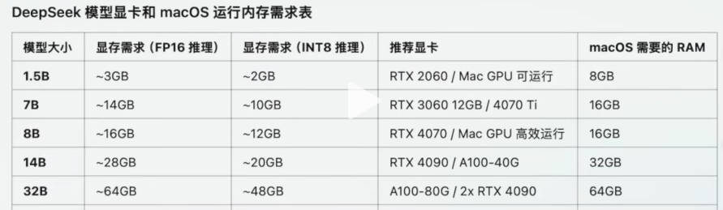
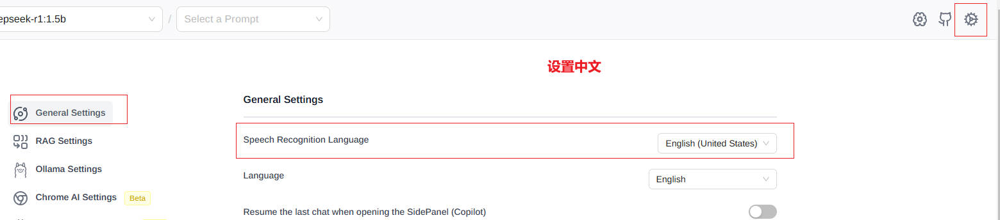
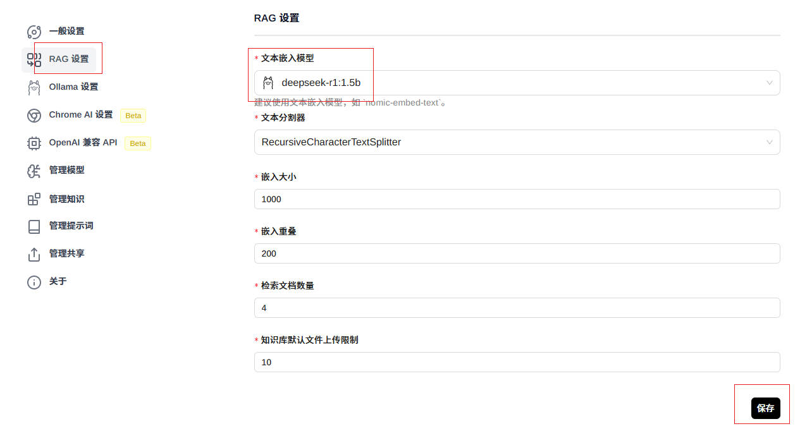
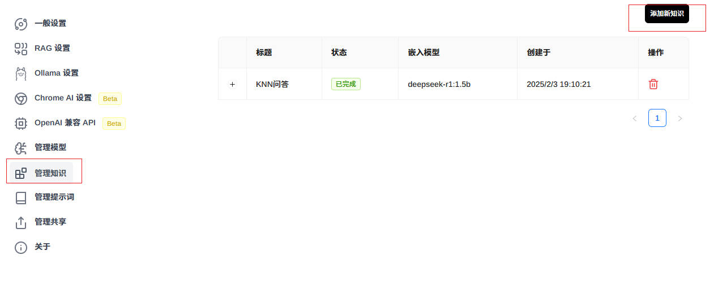
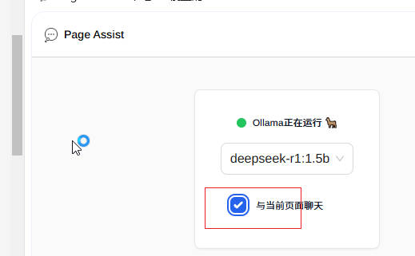
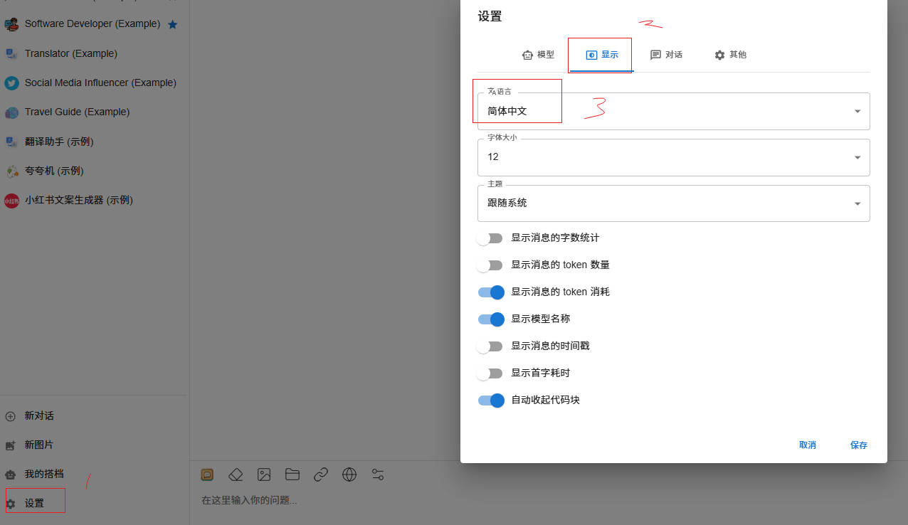
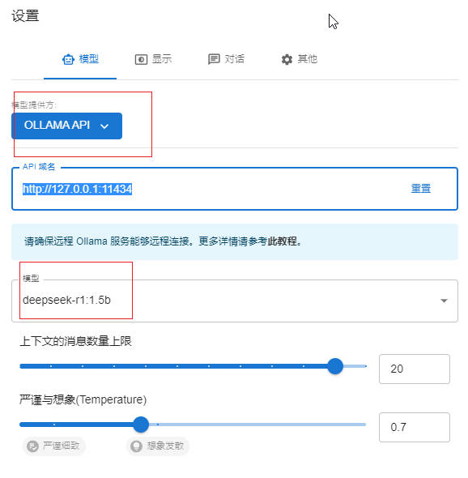

# 一、deepseek本地部署

哈喽，兄弟们！大家可以想象一下，如果有一个超级聪明的人机大脑，能帮你解答任何问题，从复杂的数学难题到编程代码，再到那些让你头疼的写作任务，它都能轻松搞定。这不是科幻电影里的场景，而是DeepSeek带来的现实奇迹！DeepSeek，这个名字听起来就充满了探索和求知的意味。它不仅仅是一款大语言模型，更是你学习路上的得力助手。无论你是学生、程序员还是任何需要知识帮助的人，DeepSeek都能为你提供精准、高效的解决方案。

目前deepseek在学术研究、自媒体运营、技术研发等多领域已经再次刷新了人类对于大模型的认知？因此，希望各位可以再次为咱们的“国产之光”的大模型——deepseek点个赞！再次强调下，不管你身处哪个行业，deepseek都能成为你最得力的助手，助你一臂之力💪！

很多小伙伴可能会觉得，这么厉害的工具，用起来肯定不容易吧😟？其实啊，只要你搞懂几个关键的技术名词，再跟着我的步骤一步步操作，你会发现，使用deepseek简直so easy！🎉这几个神奇的技术名词就是：ollama、Page Assist、ChatBox AI、docker和maxkb。它们就像是打开deepseek神秘大门的钥匙🔑，掌握了它们，你就能轻松驾驭这个强大的工具啦！

### 1、版本区分

DeepSeek的R系列和V系列是该模型体系中的两个不同分支，它们各自具有独特的特点和应用场景。以下是对这两个系列的详细对比：

##### R系列

1. **核心定位**：
   - 专注于高级推理任务。模型的推理能力是指：模型根据已有的知识和信息，通过逻辑分析和思考来得出合理结论的能力。模型的推理能力如要体现在如下几点：
     - 基于知识储备进行推断：
       - 大模型在大量的文本数据上进行预训练，学习到了丰富的语言知识、常识、专业知识等。当面对新的问题时，它会依据所学的知识储备来进行推理。例如，如果问“太阳从哪边升起”，模型会基于地理知识回答“东边”，因为它在学习过程中已经了解了地球自转和太阳东升西落的自然规律
       - 举例：就像一位知识渊博的学者，在面对各种问题时，能够凭借自己积累的丰富知识，快速地给出合理的答案或解释。比如询问历史上某个事件的原因，学者可以根据自己的历史知识储备，分析当时的政治、经济、文化等多方面因素，从而给出有说服力的解释。
     - 按照逻辑规则进行推导：
       - 大模型会根据一定的逻辑规则来处理信息和得出结论。在数学推理中，它要遵循数学的运算规则和逻辑关系；在符号推理中，要按照给定的符号逻辑进行推导等。例如，在数学应用题中，模型需要理解题目中的数量关系，然后按照加、减、乘、除等运算规则进行计算。
       - 举例：假如有一个逻辑谜题，给出了一些条件，如“所有的猫都有四条腿，小花是猫”，要求判断小花有几条腿。大模型会按照逻辑规则，从“所有的猫都有四条腿”这个一般性的前提，推导出小花作为猫也有四条腿的结论。
     - 处理多步骤复杂问题：
       - 对于复杂的问题，大模型能够将其分解为多个简单的步骤，逐步进行推理和解决。它可以像人类一样，先分析问题的整体情况，然后确定每一步的目标和操作方法，最终得出完整的答案。
       - 举例：比如在解决一个行程规划问题时，模型首先要明确出发地、目的地、交通工具等信息，然后根据这些信息计算出每段路程所需的时间、换乘地点等，最后整合这些信息，给出一个完整的行程安排。这就好比一个人在制定旅行计划时，会先考虑各个因素，再一步一步地安排好具体的行程。
     - 生成合理的预测和结论
       - 大模型通过对输入信息的分析和推理，能够对未来的情况或未知的结果做出预测，并给出相应的结论。它的预测是基于对大量类似情况的学习和归纳，以及对当前信息的理解和分析。
       - 举例：在天气预报中，大模型可以根据过去的气象数据、当前的天气状况以及地理环境等因素，预测未来几天的天气变化。或者在股票市场中，根据历史股价走势、公司业绩等信息，预测股票价格的未来走势。
     - 总结：
       - 综上所述，大模型的推理能力是一种基于其庞大知识库和复杂算法的能力，使其能够模拟人类的逻辑思维过程，从已知信息中推导出新的结论或解决方案。无论是在学术研究、日常生活决策还是专业领域应用中，大模型的推理能力都展现出了巨大的潜力和应用价值。
2. **应用场景**：
   - 针对科研、算法交易、代码生成等需要复杂逻辑推理的任务设计。
3. **性能表现**：
   - 在综合测试中超越OpenAI的o1系列。
   - 提供了基于Qwen和Llama的蒸馏版本，显著提升小模型性能。
     - 蒸馏是什么？
       - 模型蒸馏是一种模型压缩和知识迁移的技术，旨在将一个大型、复杂且性能优异的教师模型（Teacher Model）中的知识传递给一个较小、计算效率更高的学生模型（Student Model）。在DeepSeek系列中，就是将R1系列大模型作为教师模型，通过特定的蒸馏方法，把知识传递给基于Qwen和Llama系列构建的学生模型。
       - 具体来说，DeepSeek的蒸馏过程是通过使用R1生成的80w个推理数据样本，对较小的基础模型（例如Qwen和Llama系列）进行微调而创建的。
       - 尽管规模变小，但这些蒸馏版本仍保留了较强的推理能力。因为它们继承了R1大模型的知识和推理模式，所以在一些推理任务上能够取得不错的成绩。

##### V系列

1. **核心定位**：
   - 面向多功能NLP任务的自然语言处理模型。
2. **设计目标**：
   - 提供高效、可扩展的解决方案，适用于多模态处理和高效处理。
   - 注重综合场景的适用性，强调模型的通用性和高效性。
3. **应用场景**：
   - 适用于内容创作（文案、小说）、知识问答、编程等大规模自然语言处理任务。
   - 支持智能客服、内容创作（文案、小说）、知识问答等应用。
4. **性能表现**：
   - 在多个基准测试中接近GPT-4和Claude 3.5-Sonnet等国际顶尖模型。
   - 生成速度快，从上一代的20TPS提升到60TPS。

综上所述，DeepSeek的R系列和V系列各有侧重，前者专注于复杂推理任务，后者则提供高效的自然语言处理解决方案。两者共同构成了DeepSeek强大的模型体系，满足不同领域的需求。

### 2、ollama

#### 简介

Ollama是一个开源的**大型语言模型（LLM）本地部署和运行工具**。ollama简化了大型语言模型的本地部署过程，还促进了这些先进技术在各个领域的应用和发展，为开发者提供了更多可能性。

简单来说，OllAMA是一个让你能下载和使用特定大模型的工具或平台。通过它，你可以把那些原本复杂、遥远的大模型下载部署到本地，方便你随时使用。

#### ollama环境安装

下载ollama：需要科学上网访问github

- https://ollama.com/download
- 下载完毕后直接傻瓜式安装该软件，默认直接安装在C盘
- 安装完成后，在cmd终端里输入：allama list 测试是否可以使用

#### ollama模型下载

基于ollama下载DeepSeek大模型：可以在ollama官网https://ollama.com/search搜索DeepSeek查看对应版本进行指令下载：

- ollama run deepseek-r1:1.5b
- ollama run deepseek-r1:7b
- ollama run deepseek-r1:8b
- ollama run deepseek-r1:14b
- ollama run deepseek-r1:32b
- ollama run deepseek-r1:70b



下载模型默认保存路径：C:\Users\Administrator\.ollama\models

### 3、模型本地应用-Page Assist

- 打开谷歌插件市场
  - https://chromewebstore.google.com/
  - 搜索Page Assist进行安装：
  - 打开该插件进行配置：
    - 选择下载好的模型：
    - 设置中文字体：
    - RAG设置：
  - 添加知识文件：最好添加txt后缀效果会比较好
  - 在问答中应用知识文件：
- 与网页嵌入问答：
  - 
  - 
  - 可以实现针对当前网页内容的问答，或者翻译等工作


### 4、模型本地应用-Chatbox AI

- 访问官网：https://chatboxai.app/zh，然后选择“启动网页版”或者下载桌面版，下面以桌面版为例

- 设置语言为中文：

- 设置模型：

  

- 问答操作：

​		

- 创建专属搭档：添加自定义或者软件提供的热门搭档。


# 二、RPA（影刀）+AI Agent

## 1. Boss直聘招聘采集

### 【1】监听接口


### 【2】批量采集


### 【3】Excel保存

#### 步骤（1）excel初始化

构建excel和标题：


第一行，打开或者创建excel：


#### 步骤（2）写入一页数据


接着构建数据，先把`response_body_list `进行json转换


```python
[[job["jobName"],job["businessDistrict"],job["jobDegree"],job["jobExperience"],job["brandName"]] for job in body["zpData"]["jobList"]]
```


#### 步骤（3）写入多页数据


## 2. Boss直聘岗位采集

### 【1】基于Xpath提取岗位要求


### 【2】写入excel

第一行打开excel文件，接着在循环中直接将岗位要求按单字段存储


## 3. Boss+deepSeek简历筛选+飞书同步


