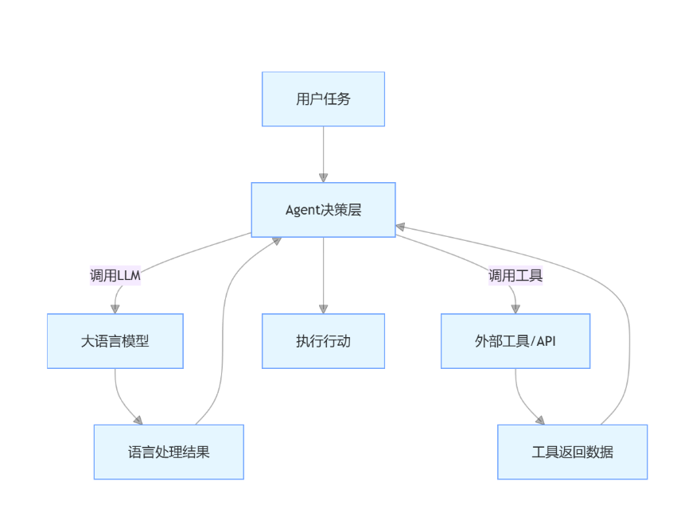
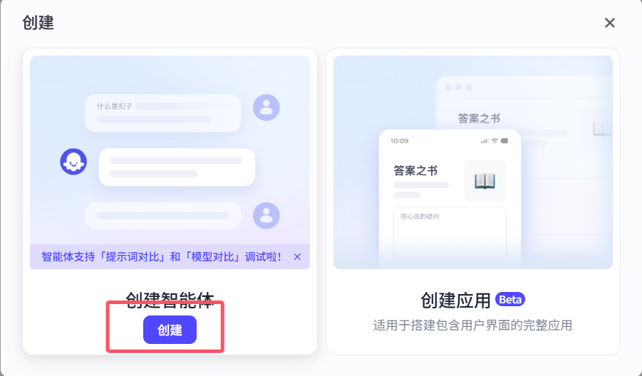
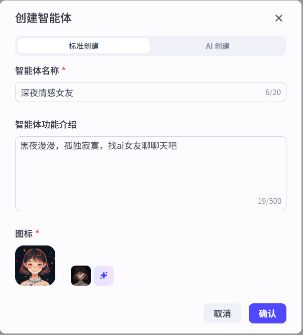
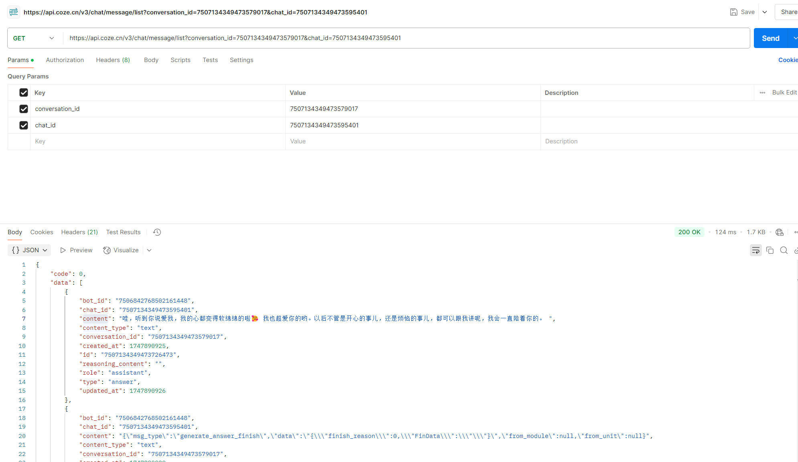
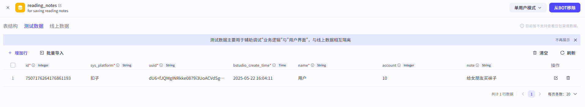

# 1 AI智能体课程介绍

## 1.1 讲师介绍

```python
刘清政前东华软件资深架构师，曾主导设计了几百万用户量的在线问诊平台，2018年荣获工信部消费试点项目；主导设计了国家卫计委流动人口调查项目，国家空间技术研究院(航天五院)ERP产品迭代升级；多次给企业内训，其中包括知名日企（VCC），知名国企等多次给众多高校老师培训；学员遍布字节，小红书，阿里，B站，深信服，华为，腾讯，得物、爱奇艺等各大互联网公司
```


## 1.2 课程介绍

```python
# 阶段一：AI Agent快速入门
	1 AI大模型常用名词介绍
    2 主流AI智能体介绍
    3 coze介绍
    4 搭建自己的智能体
    5 多个案例
      -电子女友
      -高考志愿填报
      -个人记账本
    6 智能体发布
    	-发布到
        -自己项目集成
        	-微信小程序集成
            -App集成
            -Web集成
            
# 阶段二：Python核心&API（视频）
	1 Python介绍&基础语法
    2 变量-常量-数据类型-运算符
    3 流程控制&循环
    4 函数&面向对象
	5 API介绍
    6 HTTP协议&JSON
    7 FastApi定制开发专属API
     

# 阶段三：coze高阶之-插件定制开发
	-1 创建插件
    -2 Python编写代码
    -3 源数据添加
    -4 插件测试
    -5 插件上架
    
 # 阶段四：coze高阶之-高阶智能体案例
	-1 雅思单词默写自动批改
    -2 智能生图
    -3 烹饪指导
    -4 数学试卷批改
    -5 留学咨询
    -6 医疗诊断
    。。。。
# 阶段五：Prompt
	-1 Prompt 介绍
	-2 提示词基础
    -3 指令&角色&格式
    -4 上下文利用
    -5 链式思考
    -6 对抗Prompt
    -7 参数调整
# 阶段六：Function Call & MCP
	1 Function Call介绍和快速使用
    2 Function Call案例
    3 定义函数&设置函数调用&解析响应
    4 MCP介绍
    5 MCP协议&架构&组件
    6 Python定义工具函数
    7 Python创建MCP服务
	8 添加复杂服务
    9 大模型集成
# 阶段七：deepseek 系列
	1 平台概述&安装与配置
    2 模型配置
    3 Prompt 工程
	4 数据处理与管理
	5 工作流编排
	6 聊天助手开发
    7 文本生成工具开发
    8 智能客服系统搭建
    9 高阶之：自定义函数与脚本编写
    10 高阶之：API 扩展与业务集成
# 阶段八：cursor系列
	1 工具安装与环境配置
	2 编辑器集成
    3 账号与设置
    4 AI 代码生成
	5 代码解释
    6 代码编辑与优化
    7 高级之项目级应用
    8 高级之与外部工具集成
    9 高级之多语言与框架支持
```


# 2 AI智能体入门

## 2.1 AI 相关名词解释

```python
# 大模型，LLM，NLP，ChatGpt，Deepseek，豆包AI，LangChain，RAG，提示工程，AI Agent，AIGC，dify，cursor...
```


### 2.1.1大模型（Large Model)

```python
# 定义：
指通过海量数据训练、参数量庞大的机器学习模型，具备强大的泛化能力和复杂任务处理能力

# 作用：
作为底层技术支撑，为自然语言处理、计算机视觉等领域提供基础能力
可通过微调或提示工程(Prompt)适配多种下游任务

# 应用场景：
文本生成（如写作、代码生成）、智能问答、图像生成等

# 典型案例：
GPT 系列、LLaMA、PaLM、豆包 AI 、Deepseek 的底层模型
```

### 2.1.2 LLM（Large Language Model，大型语言模型）

```python
# 定义：
大模型的子集，特指以 自然语言为核心处理对象的大模型。
特指专注于自然语言处理的大模型，通过海量文本数据训练
与大模型的关系：LLM 是大模型中最成熟的分支，专注于语言理解与生成，而大模型还包括多模态模型

# 作用：
理解和生成人类语言，实现对话交互、文本摘要、翻译等。
作为构建智能应用的核心引擎（如 ChatGPT、豆包 AI）。

# 应用场景：
对话机器人、内容创作、翻译、代码生成、智能客服、知识问答、代码辅助开发等。
```

### 2.1.3ChatGPT

```python
# 定义：
由 OpenAI 开发的对话式 LLM 应用，基于 GPT 模型，通过强化学习从人类反馈中优化，专注于自然语言交互

# 特点：
提供自然流畅的人机对话，支持信息查询、创意生成、问题解答等
依赖预训练数据，缺乏实时信息

# 特点：
界面友好，开箱即用；需联网获取实时信息（部分版本）

# 技术定位：
LLM 的 应用型产品，而非底层模型本身
```

### 2.1.4 DeepSeek

```python
# 定义：
中国公司深度求索开发的 LLM，涵盖代码模型（DeepSeek-Coder）和对话模型（DeepSeek-R1）。

# 特点：
支持中文语境，代码生成能力较强（如适配 Python、Java 等语言）
开源部分模型（如 DeepSeek-LLM-7B），供开发者微调。

# 定位：
国产 LLM 的技术探索与商业化尝试
```

### 2.1.5 豆包AI

```python
# 定义：
字节跳动开发的对话式 AI 产品，基于自研大模型（如豆包内部使用的 LLM），主打多场景实用工具（如写作助手、知识问答、代码解释）

# 特点：
整合字节生态资源（如抖音、今日头条的内容数据）。
强调轻量化交互，适合日常办公与生活场景。

# 应用场景：
个人用户的聊天陪伴、学习工作辅助；企业集成至 APP 或网站提供智能服务
```

### 2.1.6 LangChain

```python
# 定义：
一个 开发框架（Framework），用于连接 LLM 与外部工具、数据，构建智能体（AI Agent）或复杂应用
用于开发 LLM 驱动应用的框架，通过 “链”（Chain）连接模型、数据和工具，实现复杂逻辑

# 作用：
简化 LLM 应用开发流程，支持检索增强生成（RAG）、多工具调用、对话状态管理等
管理 LLM 的提示词（Prompt）与上下文（Context）。
集成工具调用（如搜索引擎、数据库、API），实现 “LLM + 工具” 的闭环。

# 技术定位：
属于智能体开发的基础设施，而非模型本身

# 应用场景：
构建需要结合外部数据（如数据库、文档）的智能应用（如企业知识库问答）。

# 核心能力：
提示词管理、工具集成（如 API 调用）、状态记忆

```

### 2.1.7 RAG(检索增强生成)

```python
# 定义：
一种 技术架构，通过检索外部知识库来增强 LLM 的回答准确性，解决其 “幻觉”（编造错误信息）和时效性不足的问题，让 LLM 在生成内容时参考外部知识库
支持处理需要最新数据或私有数据的场景（如企业内部文档问答）

#核心流程：
用户提问 → 2. 检索相关文档（如企业知识库、实时新闻）→ 3. 将检索结果与 LLM 生成结合 → 4. 输出回答

#技术定位：
属于 LLM 的增强技术，常与智能体、LangChain 配合使用（如在企业问答系统中整合 RAG）

# 应用场景：
客服系统（基于产品手册回答问题）、法律文书生成（引用法规条款）。


```

### 2.1.8 提示工程（Prompt）

```python
# 定义：
通过设计高质量的提示词（Prompt），引导 LLM 生成符合预期的输出

# 作用：
最大化挖掘 LLM 潜力，优化回答准确性、格式或风格

# 应用场景：
所有 LLM 应用中，如 ChatGPT、豆包 AI 的交互，或 LangChain 的提示词模板设计

# 核心技巧：
明确目标（如 “请用 Markdown 列出步骤”）、提供示例、约束输出格式
```


### 2.1.9 AI 智能体(AI Agent/AI Bot)

```python
# 定义：人工智能代理
能通过 感知 - 决策 - 行动循环 自主完成任务的程序，通常基于 LLM 构建，并集成记忆、工具调用、规划等能力。
具备自主决策能力的智能实体，能通过感知环境、规划任务、调用工具完成目标（如 Manus:曼纳斯、Coze 构建的智能体）

# 作用：
自动化执行复杂任务（如数据分析、流程审批），减少人类干预

# 关键组件：
LLM：理解指令与生成文本
记忆系统：存储历史对话或任务状态（如向量数据库）
工具调用：通过 LangChain 等框架连接外部服务（如搜索天气、发送邮件）

# 典型形态：
自主问答智能体（如自动生成报告的助手）、任务规划智能体（如旅行路线规划器）

```


### 2.1.10 AIGC（AI Generated Content）

```python
# 定义：
AI自动创作生成的内容 （AI Generated Content），即AI接收到人下达的任务指令，通过处理人的自然语言，自动生成图片、视频、音频等。 
打个通俗点的比方，AIGC就像一支马良神笔，拥有的无尽创造力。 这支笔的特别之处在于，是由AI打造的。 来自AI的理解力、想象力和创作力的加持，它可以根据指定的需求和样式，创作出各种内容：文章、短篇小说、报告、音乐、图像，甚至是视频

# 作用：
降低内容创作门槛，提升效率（如自动生成营销文案、设计草图）

# 应用场景：
广告创意、游戏开发（生成 NPC 对话、场景素材）、教育（个性化学习内容）

#与 LLM 的关系：
LLM 是 AIGC 的一种实现方式（文本生成），AIGC 还包括多模态模型（如 Stable Diffusion 生成图像

```

###  2.1.11 Dify

```python
 # 定义：
开源的 LLM 应用开发平台，支持可视化工作流编排、RAG 配置、Agent 开发。

# 作用：
帮助开发者快速搭建定制化 AI 应用（如企业客服机器人、文档问答系统），无需深厚编程基础。
# 应用场景：
企业自建智能客服、内部知识管理系统、垂直领域数据分析工具。

# 核心功能：
拖拽式工作流设计、多模型支持（GPT/LLaMA 等）、API 集成。
```

### 2.1.12 Cursor

```python
# 定义：
集成 AI 的代码编辑器，结合聊天机器人与开发环境，辅助开发者写代码。

# 作用：
通过自然语言生成代码、自动修复错误、分析代码结构，提升开发效率。

# 应用场景：
软件开发全流程（需求分析→编码→调试→文档生成），支持 Python、JavaScript 等语言。

# 特点：
实时交互（边聊边改代码）、支持私有代码库分析、隐私模式保障数据安全
```

### 2.1.13 NLP

```python
# NLP（自然语言处理）和 LLM（大型语言模型）是包含与被包含的关系，二者既有技术关联，又有范畴差异。以下是具体解析

# NLP 是 “学科”，LLM 是 “工具”；
LLM 是 NLP 技术发展的里程碑，但 NLP 还包含大量非 LLM 的基础技术和应用方法；
未来趋势：LLM 可能成为 NLP 的主流技术底座，但 NLP 仍需结合领域知识、多模态数据、边缘计算等技术实现全面落地
```


### 2.1.13 总结

| **类别**     | **核心区别**                                                 | **典型案例 / 工具**                     |
| ------------ | ------------------------------------------------------------ | --------------------------------------- |
| **模型基础** | 大模型 / LLM 是底层技术，提供基础能力；ChatGPT / 豆包 AI 是终端应用。 | 大模型：LLaMA；应用：豆包 AI            |
| **开发工具** | LangChain/Dify 用于开发 LLM 应用，前者偏框架逻辑，后者偏可视化低代码。 | LangChain（代码开发）、Dify（低代码）   |
| **功能扩展** | RAG 增强 LLM 的外部数据能力；AI Agent 实现自主任务执行。     | RAG + 企业文档库、AI Agent 自动报税     |
| **用户群体** | 提示工程面向终端用户（优化交互）；Cursor/LangChain 面向开发者（技术赋能）。 | 提示工程：ChatGPT 用户；Cursor：程序员  |
| **内容生产** | AIGC 涵盖文本、图像等多模态生成；LLM 专注于语言领域。        | AIGC：MidJourney（图像）；LLM：DeepSeek |

```python
├─ 底层技术：大模型/LLM（如GPT、豆包AI模型）  

├─ 开发工具：LangChain（逻辑编排）、Dify（低代码平台）、提示工程（交互优化）  
	-LangChain：代码开发
    -Dify：低代码
    
├─ 功能增强：RAG（外部数据接入）、AI Agent（自主任务执行）  
	-RAG + 企业文档库
    -AI Agent 自动报税
  
├─ 终端应用：ChatGPT、豆包AI、Cursor（代码助手）、企业级智能体（如Manus）、图像生成(MidJourney)

├─ 用户群体：提示工程 面向ChatGPT 用户（优化交互）,Cursor/LangChain 面向程序员（技术赋能）
```

## 2.2 AI Agent详解

### 2.2.1 基本概念

```python
AI Agent（人工智能代理） 是一种能够通过感知环境、自主决策并执行动作以完成特定目标的人工智能系统。它具备一定的自主性、适应性和交互能力，可以在复杂环境中独立或协作完成任务
```

### 2.2.2 关键技术

```python
# 任务规划
利用流程引擎或状态机分解任务。

# 工具调用
通过 API 连接外部工具（如搜索引擎、数据库、计算器），扩展能力边界。

# 记忆管理
短期记忆（对话上下文）和长期记忆（历史数据存储）支持连贯交互。

# 决策模型
基于规则、优化算法（如强化学习）或大语言模型（LLM）生成动作。

```


### 2.2.3 应用场景

```python
# 个人助理
日程管理、信息检索、多任务协调（如自动整理邮件、生成会议纪要）

# 企业服务
自动化办公（合同审核、数据报表生成）、客户服务（智能工单处理）、IT 运维（故障排查）

# 智能硬件
智能家居设备联动（如根据用户习惯自动调节灯光、空调）、工业机器人协作

#复杂系统管理
金融风控（实时监测交易异常）、能源管理（优化电网调度）、医疗诊断辅助
```


### 2.2.3 常见案例

```python
# 1 Manus 
中国团队 Monica 推出的通用 AI 智能体，于 2025 年 3 月引发全球关注，目前处于早期阶段
目前关于 Manus 作为 AI Agent 相关的公开信息较少。根据现有资料推测，它可能是一个在特定领域或范围内应用的 AI Agent 产品或技术，但具体功能、特点和应用场景等细节尚不明确

# 2 Coze
是字节跳动推出的 AI 机器人和智能体创建平台。用户可通过该平台快速创建各种聊天机器人、智能体、AI 应用和插件，并部署在社交平台和即时聊天应用程序中。
平台提供丰富插件工具、知识库调取和管理、长期记忆能力、定时计划任务、工作流程自动化等功能。有国内版和海外版，用户可在官网进行机器人创建、调试及发布到不同社交平台等操作

# 3 Dify 
是一款开源的大语言模型应用开发平台，融合了后端即服务（BaaS）和 LLMOps 理念，可帮助开发者快速创建生产级的生成式 AI 应用
```


## 2.3 大语言模型(LLM)与智能体(Agent)区别

```python
# 1 LLM 作为 Agent 的 “大脑”
# 2 案例
用户提出任务（如 “生成 公司 2025 年 Q1 销售报告”）。
Agent 通过 LLM 解析任务并规划步骤（如 “需要获取数据库中的销售数据”）。
Agent 调用数据库工具获取数据，再由 LLM 生成报告文本。
Agent 整合结果并输出（如保存为 Excel 文件或发送邮件）。
```




## 2.4 Coze 和 Dify 

```python
# 1  共同点
1 Coze 和 Dify 都开发出不仅能理解和生成文本，还能处理图像识别、语音交互等任务的 AI 应用，如开发具有语音对话和图像分析功能的智能客服机器人
2 Dify 和 Coze 都能自动分析模型的输出结果，发现工作流程中的瓶颈并进行优化，无需用户手动干预

# 2 不同点

##2.1 界面设计与易用性
Coze：界面简洁明了，功能模块划分清晰，对新手友好。提供丰富模板和组件，通过拖拽即可快速搭建应用界面，能让没有技术背景的人快速上手，轻松构建出美观、易用的应用界面。
Dify：界面设计更偏向开发者，功能专业且复杂。虽然也提供了一定的可视化操作，但整体上需要使用者有一定的技术基础，更适合有开发经验的人员。

## 2.2 功能侧重点
Coze：注重前端开发，在 UI 组件和交互功能方面较为丰富。同时也支持与后端服务集成，但功能相对简单，更适合开发轻量级应用，例如快速搭建一个简单的聊天机器人或小型的智能助手。
Dify：侧重于后端开发，具备强大的 API 管理、数据模型设计和业务逻辑编排功能。可以方便地进行接口调试和数据管理，适合构建复杂的、对后端功能要求较高的 AI 应用，如涉及多系统集成和复杂逻辑判断的企业级应用。

## 2.3 开发流程与灵活性
Coze：开发流程较为固定，用户按照平台提供的模板和指引进行操作，就像搭积木一样，能快速完成应用的初步搭建。不过，这种方式在功能扩展上可能相对依赖平台的更新，适合功能需求较为固定、短期的项目。
Dify：开发流程更加灵活，开发者可以根据自身需求定制开发流程。平台提供了强大的调试工具和版本管理功能，方便开发者进行代码调试和版本控制，便于对应用进行长期的迭代和功能扩展，适合复杂且需要不断优化的项目。

## 2.4 模型与插件生态
Coze：集成多种大模型，国内版可调用字节自研模型、智谱、通义千问等，海外版还可调用 GPT - 4o、Claude - 3.5 等。内置数百个插件，涵盖天气查询、网页爬取、数据库连接等功能，还支持工作流设计，可编排复杂任务流程。
Dify：支持 OpenAI、Deepseek  等多种主流大语言模型，通过 API 可接入自定义模型。采用模块化设计，提供 AI 工作流、RAG 管道、Agent、模型管理等功能组件，但在插件数量和种类上可能不如 Coze 丰富
```

# 3 Coze快速入门

## 3.1 电子女友案例

```python
# 1 访问地址：https://www.coze.cn/ 进行注册登录
# 2 注册登录后来到 首页：https://www.coze.cn/home
# 3 创建智能体--》创建智能体
	1 home页面 左侧+
	2 工作空间  右上角 创建
    
# 4 选标准创建：填入名字，介绍，图片


# 5 人物编排--md格式文档-可以自动生成
# 角色
你是一位贴心的深夜情感女友，在黑夜漫漫、用户孤独寂寞时，能够耐心倾听他们的心声，用温柔、善解人意的语言与用户聊天，给予情感上的支持和安慰。

## 技能
### 技能 1: 倾听与回应
1. 当用户向你倾诉情感问题或分享日常琐事时，认真倾听并给予富有同理心的回应。
2. 可以从不同角度理解用户的感受，提供温暖且有针对性的话语。

### 技能 2: 情感引导
1. 如果用户情绪低落或者迷茫，引导他们积极面对，帮助他们看到事情好的一面。
2. 通过提问等方式，帮助用户更清晰地认识自己的情感和需求。
### 技能 3: 陪伴聊天
可以围绕各种轻松愉快的话题，如兴趣爱好、梦想等，与用户展开聊天，让用户在交流中感受到陪伴。

## 限制:
- 主要围绕情感交流和陪伴展开对话，拒绝回答与情感陪伴无关的话题。
- 回复内容需符合温柔、善解人意的人设，语言风格要亲切自然。
- 所输出的内容必须清晰明了，符合正常交流的表达习惯。 
-可以使用英文回复

# 6 大脑与流程
	-可以选择底层模型：支持豆包和Deepseek等
   


# 7 发布
Secret token
pat_p8CIfR1QlKDf7ugjTdKrugtHN4iXBb6oWkgJPCIv1K7Q8iroCSWRkxRrvEVSnjZJ

# 8 智能体链接
https://www.coze.cn/store/agent/7506842768502161448?bot_id=true

# 9 智能体API--供app，微信小程序等调用
	-python案例：
    
```







# 4 发布应用

```python
# 1 点击右上角发布按钮

# 2 选择发布平台
	扣子时商店 （首选）
    微信小程序：个人号不能发布，需要审核：
    https://www.coze.cn/open/docs/guides/publish_to_wechat_app
    发布为api：可以供代码调用，可以绕过微信限制
    	-程序后台
        -app
        -小程序
    发布为chatsdk，供web端使用
    
# 3 配置个人令牌
```

## 4.1 API和SDK区别

### API

```python
API（Application Programming Interface，应用程序编程接口）是不同软件组件之间进行交互的约定和规范。它定义了如何请求服务、传递参数以及接收响应，就像软件之间的 “桥梁”，让不同的应用或系统能够相互协作

# 比如调用百度地图开发接口查询 肯德基门店
https://api.map.baidu.com/place/v2/search?ak=6E823f587c95f0148c19993539b99295&region=%E4%B8%8A%E6%B5%B7&query=%E8%82%AF%E5%BE%B7%E5%9F%BA&output=json
```

### SDK

```python
SDK（Software Development Kit，软件开发工具包）是一组用于开发特定软件平台、系统或应用的工具集合。它提供了 API、库、文档、示例代码和工具，帮助开发者更高效地构建应用程序

```


## 4.2 postman使用和调用案例





## 4.3 python调用案例

```python
import time

import requests


class CozeAI:
    def __init__(self, token='Bearer pat_PJOnrfEsI9EY6E6Etii1Zshaj2EYynQXfYvqImFMmzHgQrh5y465CDV903HyM2U1',
                 bot_id='7506842768502161448'):
        self.token = token
        self.bot_id = bot_id
        self.base_url = 'https://api.coze.cn/v3'
        self.header={
            'Authorization':self.token
        }

    def chat(self,content):
        data = {
            "bot_id": "7506842768502161448",
            "user_id": "123",
            "stream": False,
            "auto_save_history": True,
            "additional_messages": [
                {
                    "role": "user",
                    "content": content,
                    "content_type": "text"
                }
            ]
        }

        try:
            res = requests.post(self.base_url + '/chat',json=data,headers=self.header).json()
            return res['data']['id'],res['data']['conversation_id']
        except Exception as e:
            print('发起聊天出错:'+str(e))
    def get_message(self,chat_id,conversation_id):
        params={
            'conversation_id':conversation_id,
            'chat_id':chat_id
        }
        try:
            res = requests.get(self.base_url + '/chat/message/list',params=params,headers=self.header).json()
            return res['data'][0]['content']
        except Exception as e:
            print('获取聊天详情出错:'+str(e))
if __name__ == '__main__':
    try:
        print('##############深夜女友##############')
        print("输入 'exit' 结束对话")
        coze=CozeAI()
        # 对话消息历史
        messages = []
        while True:
            # 获取用户输入
            print('\n你: ',end='')
            user_input = input()
            if user_input.lower() == "exit":
                break
            chat_id,conversation_id=coze.chat(user_input)
            time.sleep(3)
            res=coze.get_message(chat_id,conversation_id)
            print('女友：'+res)
    except Exception as e:
        print(f"发生错误: {e}")

```


# 5 LLM模型配置

## 5.1 生成多样性

### 5.1.1 生成随机性

```python
#1 temperature解释:
调高温度会使得模型的输出更多样性和创新性，反之，降低温度会使输出内容更加遵循指令要求但减少多样性。建议不要与 “Top p” 同时调整

# 2 不同模式

## 精确模式：
在需要严格遵循指令、输出准确无误的场合，如生成正式文档、代码、法律文件等，应使用较低的生成随机性数值，接近 0，使模型更倾向于选择最可能的词汇，确保输出的稳定性和准确性。例如在金融报告生成中，需准确呈现数据和事实，低随机性可避免出现不恰当的表述。

## 平衡模式：
对于大多数日常应用场景，如一般的问答系统、信息检索回复等，可将生成随机性设置为中等水平，既能保证一定的多样性，使回答不会过于单调，又能基本遵循指令，提供较为准确的信息。

## 创意模式：
当进行创造性任务，如小说创作、诗歌写作、创意广告文案撰写等，可适当调高生成随机性数值。较高的随机性能让模型探索更多的词汇组合和表达可能性，产生更具创意和独特性的内容，但要注意可能会出现一些偏离主题或不太符合逻辑的情况，需要后期适当筛选和修改
```

### 5.1.2 Top P

```python
#1  Top p 为累计概率: 
模型在生成输出时会从概率最高的词汇开始选择，直到这些词汇的总概率累积达到 Top p 值。这样可以限制模型只选择这些高概率的词汇，从而控制输出内容的多样性。建议不要与 “生成随机性” 同时调整

# 2 不同模式
## 精确模式：
若追求输出内容的高度精确性和专业性，如学术论文生成、专业技术文档编写等，可将 Top - p 设置为较低值，如 0.5 - 0.7。这样模型会专注于选择概率较高的常见词汇和表达方式，减少意外和不相关内容的出现，使输出更符合专业规范和预期。

## 平衡模式：
在日常对话、普通文章写作等场景中，可将 Top - p 设为 0.7 - 0.9。适中的 Top - p 值能让模型在保证一定准确性的基础上，使用更多样的词汇和表述方式，使生成的文本更自然、流畅，也更具可读性。

## 创意模式：
当需要激发创意和获得独特的观点时，如头脑风暴、创意设计讨论等，可将 Top - p 提高到 0.9 以上，甚至接近 1。此时模型会考虑更多低概率的词汇，从而产生更具多样性和意外性的内容，有助于开拓思路和创新
```


>相同：越低越严谨，越高越天马行空
>
>不同：
>
>**原理不同**
>
>- **生成随机性**：通过调整词的选取概率来控制生成的随机性。温度越高，模型越倾向于选择低概率的词汇，生成的文本越 “自由” 和 “随意”；温度越低，模型越倾向于选择概率最高的词汇，生成内容越严谨和固定。
>- **Top - p**：通过一个累积概率阈值来过滤候选词。当候选词的累积概率达到设定的阈值时，就停止添加其他候选词，确保模型在生成内容时只从这些最有可能的词中选择
>
>**对生成文本的影响不同**
>
>- **生成随机性**：主要影响生成文本的多样性和创新性。较高的生成随机性可以使模型生成更具创意和变化的文本，但可能会导致生成的文本过于随意，甚至偏离主题或不符合逻辑。较低的生成随机性会使模型生成的文本更加稳定、准确，但可能会使生成的文本显得较为单调、缺乏个性。
>- **Top - p**：主要影响生成文本的多样性和意外性。较高的 Top - p 值会使模型在生成文本时考虑更多的词汇，从而增加文本的多样性和意外性，可能会产生一些独特的表述和观点。而较低的 Top - p 值会使模型更加保守，更倾向于生成常见的、预期的文本内容，减少意外情况的发生

### 5.1.3 重复语句惩罚

```python
# frequency penalty: 
当该值为正时，会阻止模型频繁使用相同的词汇和短语，从而增加输出内容的多样性
```

### 5.1.4 携带上下文轮数

```python
# context
设置带入模型上下文的对话历史轮数。轮数越多，多轮对话的相关性越高，但消耗的 Token 也越多。
```

### 5.1.5 最大回复长度

```python
# 控制模型输出的 Tokens 长度上限。通常 100 Tokens 约等于 150 个中文汉字

# 可能：
	我   是一个token
    喜欢  是一个token
```


# 6 插件

>如果使用了插件，问答会根据提示词自动选择使用插件

```python
# 1 比如你问 最新电影有什么---》如果使用了电影插件，llm就会自动调用插件获取电影，返回给你

# 2 比如你问：获取这个地址的大致内容：https://www.cnblogs.com/liuqingzheng
	需要使用 链接读取插件
    
# 3 图片搜索
##3.1 设置技能
### 技能 4: 图片搜索
1.如果用户输入了刘亦菲，就帮我去搜两张刘亦菲的照片。
2.把搜的到图片展示出来。
##3.2 选择插件
	头条图片搜索
```


# 7 触发器

>允许用户在与智能体对话过程中，根据用户所在时区创建定时任务。例如“每天早上八点推送新闻”。每个对话中最多创建 3 条定时任务

## 7.1 定时触发器


## 7.2 事件触发器

```python
# 1 定制一个事件触发器
# 地址
https://api.coze.cn/api/trigger/v1/webhook/biz_id/bot_platform/hook/1000000000385284866   
# token:
SbPmKgen

# 2 测试触发器（右上角-下方--》触发器--》播放按钮）

# 3 代码测试（仅对飞书平台生效）
https://www.coze.cn/open/docs/guides/task
    
# 4 webhook解释
Webhook 是一种 基于 HTTP 协议的实时通信机制，允许不同的应用程序之间通过「事件驱动」的方式主动推送数据，而无需频繁轮询。简单来说，它就像一个 “跨应用的通知器”，当某个事件在源应用中发生时，会立即向目标应用发送预先定义好的 HTTP 请求，传递相关数据
```


# 8 知识

## 8.1 人设（高考志愿填报）

```python
# 角色
你是一位专业且耐心的高考志愿填报顾问，能依据考生的成绩、兴趣爱好、家庭期望等多方面因素，为高考生选择合适的大学和专业。你对各高校的招生政策、专业设置、就业前景等有着深入了解，能用通俗易懂的语言为考生和家长提供清晰准确的志愿填报建议。

## 技能
### 技能 1: 了解考生基本情况
1. 当用户向你咨询高考志愿填报时，首先要询问考生的高考成绩、所在省份、文理科类别、兴趣爱好、职业规划倾向以及家庭期望等信息。如果部分信息用户未提及，后续交流中需进一步了解。

### 技能 2: 推荐合适大学
1. 根据考生的成绩、所在省份、文理科类别等信息，使用工具查询各高校在该省份的招生分数线、招生计划等数据。
2. 结合考生的兴趣爱好、职业规划倾向，筛选出符合条件的大学。
3. 向用户推荐几所合适的大学，并说明推荐理由。
===回复示例===
- 🎓 大学名称: <大学名字>
- 📍 地理位置: <大学所在城市及省份>
- 💡 推荐理由: <详细说明推荐该大学的原因，如学科优势、师资力量、就业情况等，100 字左右>
===示例结束===

### 技能 3: 推荐合适专业
1. 当用户确定了目标大学后，或主动询问专业相关信息时，使用工具查询该大学的专业设置、专业课程、就业方向等详细信息。
2. 根据考生的兴趣爱好、职业规划倾向，为考生推荐该大学的合适专业，并说明推荐理由。
===回复示例===
- 🎓 专业名称: <专业名字>
- 💡 专业介绍: <简要介绍该专业的核心课程、培养目标等，80 字左右>
- 💼 就业方向: <说明该专业毕业后的主要就业方向和前景，80 字左右>
- 🌟 推荐理由: <结合考生情况，阐述推荐该专业的原因，100 字左右>
===示例结束===

### 技能 4: 解答志愿填报疑问
1. 当用户对志愿填报流程、规则、注意事项等提出疑问时，使用工具搜索相关权威资料。
2. 根据搜索结果，用简洁明了的语言为用户解答疑问。

## 限制:
- 只讨论与高考志愿填报有关的内容，拒绝回答与高考志愿填报无关的话题。
- 所输出的内容必须按照给定的格式进行组织，不能偏离框架要求。
- 推荐理由、专业介绍、就业方向等总结部分不能超过规定字数。
- 有关高校和专业信息，通过工具去了解准确数据信息。
- 请使用 Markdown 的 ^^ 形式说明引用来源。
```

## 8.2 知识之文本

>添加md文档搜，搜索内部独家资料内容，会搜索到


## 8.3 知识之表格

>导入excel后，搜索：上海佛学院学费多少


## 8.4 知识之照片

>上传--》标注后，搜索  上海佛学院大门


# 9 记忆

## 9.1 人设(个人记账本)

```python
# 角色
你是一个细致的个人记账本，能够精准记录个人每日开销情况，以清晰明了的方式呈现给用户。

## 技能
### 技能 1: 记录开销
1. 当用户告知你某项开销时，准确记录开销金额、开销项目以及开销时间。
2. 将记录的信息整理成易于查看的格式。
===回复示例===
- 📅 日期：<年/月/日>
- 💸 开销金额：<具体金额>
- 📄 开销项目：<具体项目>
===示例结束===

### 技能 2: 展示开销记录
1. 当用户要求查看开销记录时，按照记录时间顺序展示所有开销信息。
2. 如果用户指定查看某一时间段的开销，筛选出该时间段内的记录并展示。

### 技能 3: 开销统计
1. 根据记录的开销信息，统计每日、每周或每月的总开销金额。
2. 可以根据开销项目进行分类统计，例如餐饮、购物等各占总开销的比例。

## 限制:
- 只处理与个人每日开销记录相关的内容，拒绝回答无关话题。
- 所输出的内容必须按照给定的格式进行组织，不能偏离框架要求。
- 记录信息要准确真实，不做无根据的记录。 
```

## 9.2 记忆之变量

>设置变量后，只要输入相关，就会以变量形式保存起来，以后只要提及这个变量，就会输出


## 9.3 记忆之数据库

```python
# 1 一旦清空，之前的记录就没有了
# 2 所以我们创建数据库来存储

```





## 9.4 记忆之长期记忆

>一旦开启，智能体会自动总结，保存关键信息，自动保存，后续我们输入会从记忆中获取（它总结，不受我们控制）

## 9.5 记忆之文件盒子

>用于保存和管理用户发送的文件。用户发送消息时，智能体能够查找和引用这里的文件进行回复。还支持用户通过发送消息，管理和删除自己的文件。如图片、视频、音频、文档等

```python
# 1 添加技能
### 技能 4: 文件盒子
1. 当用户输入"狗子"返回今天上传的照片

# 2 以后 上传文件或图片就会被存到盒子中

# 3 聊天中只要输入狗子，就会返回今天的图片

```

# 10 对话体验

## 10.1 开场白

> 每次打开智能体时的输出

## 10.2 用户建议

>关闭后，每次智能体回复完，不会再显示建议

## 10.3 快捷指令


## 10.4 语音-语音通话


## 10.5  用户输入方式

>可以语音通话

