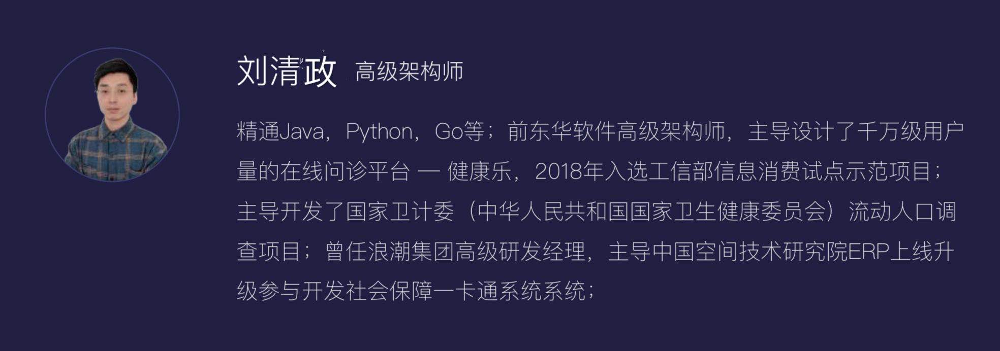

# 今日内容

#  1 AI智能体课程介绍

## 1.1 讲师介绍

```python
# Justin 
	-企业培训
    -高校
```



## 1.2 课程内容

```python
# 阶段一：AI Agent快速入门（讲）
	1 AI大模型常用名词介绍
    2 主流AI智能体介绍
    3 coze介绍
    4 搭建自己的智能体
    5 多个案例
      -电子女友
      -高考志愿填报
      -个人记账本
    6 智能体发布
    	-发布到
        -自己项目集成
        	-微信小程序集成
            -App集成
            -Web集成
            
            
# 阶段二：Python核心&API（视频）
	1 Python介绍&基础语法
    2 变量-常量-数据类型-运算符
    3 流程控制&循环
    4 函数&面向对象
	5 API介绍
    6 HTTP协议&JSON
    7 FastApi定制开发专属API
    
# 阶段三：coze高阶之-插件定制开发
	-1 创建插件
    -2 Python编写代码
    -3 源数据添加
    -4 插件测试
    -5 插件上架
    
    
# 阶段四：coze高阶之-高阶智能体案例（讲）
	-1 雅思单词默写自动批改
    -2 智能生图
    -3 烹饪指导
    -4 数学试卷批改
    -5 留学咨询
    -6 医疗诊断
    。。。。
    
# 阶段五：Prompt
	-1 Prompt 介绍
	-2 提示词基础
    -3 指令&角色&格式
    -4 上下文利用
    -5 链式思考
    -6 对抗Prompt
    -7 参数调整
    
# 阶段六：Function Call & MCP
	1 Function Call介绍和快速使用
    2 Function Call案例
    3 定义函数&设置函数调用&解析响应
    4 MCP介绍
    5 MCP协议&架构&组件
    6 Python定义工具函数
    7 Python创建MCP服务
	8 添加复杂服务
    9 大模型集成
    
    
# 阶段七：dify系列（讲）
	1 平台概述&安装与配置
    2 模型配置
    3 Prompt 工程
	4 数据处理与管理
	5 工作流编排
	6 聊天助手开发
    7 文本生成工具开发
    8 智能客服系统搭建
    9 高阶之：自定义函数与脚本编写
    10 高阶之：API 扩展与业务集成
    
# 阶段八：cursor系列（讲）
	1 工具安装与环境配置
	2 编辑器集成
    3 账号与设置
    4 AI 代码生成
	5 代码解释
    6 代码编辑与优化
    7 高级之项目级应用
    8 高级之与外部工具集成
    9 高级之多语言与框架支持
```


# 2 AI智能体入门

## 2.1 AI相关名词解释

```python
# 大模型，LLM，ChatGpt，Deepseek，豆包ai，langchain，RAG，提示工程，AI Agent，AIGC，dify，RPA，cursor，NLP 概念


# 1 大模型（大脑）
	指通过海量数据训练、参数量庞大的机器学习模型，具备强大的泛化能力和复杂任务处理能力
    典型案例：GPT系列，Deepseek
    
# 2 LLM  Large Language Model，大型语言模型
	大模型子集：自然语言为核心处理对象的大模型
    输入和输出
    是大模型的最佳实践
    典型案例：话机器人、内容创作、翻译、代码生成、智能客服、知识问答、代码辅助开发
    
    
# 3 ChatGpt
	由 OpenAI 开发的对话式 LLM 应用，基于 GPT 模型，通过强化学习从人类反馈中优化，专注于自然语言交互
    
# 4 Deepseek
	中国公司深度求索开发的 LLM，涵盖代码模型（DeepSeek-Coder）和对话模型（DeepSeek-R1）。
    
# 5 豆包ai
	字节跳动开发的对话式 AI 产品，基于自研大模型（如豆包内部使用的 LLM），主打多场景实用工具（如写作助手、知识问答、代码解释）
    
# 6 NLP
	NLP（自然语言处理）和 LLM（大型语言模型）是包含与被包含的关系，二者既有技术关联，又有范畴差异。以下是具体解析
    # NLP 是 “学科”，LLM 是 “工具”；
    LLM 是 NLP 技术发展的里程碑，但 NLP 还包含大量非 LLM 的基础技术和应用方法；
    未来趋势：LLM 可能成为 NLP 的主流技术底座，但 NLP 仍需结合领域知识、多模态数据、边缘计算等技术实现全面落地

# 7 RPA：自动化流程机器人
	-ai 没出现之前，它就在发展，python有个rpa框架
    -RPA（Robotic Process Automation，机器人流程自动化） 是一种通过软件机器人模拟人类操作、自动执行重复性规则化任务的技术。它能基于预设规则，跨系统处理数据、触发操作，替代人工完成高频、标准化的流程工作，广泛应用于金融、医疗、政务、制造业等领域
    
    
# 8 LangChain（程序员）
	一个 开发框架（Framework），用于连接 LLM 与外部工具、数据，构建智能体（AI Agent）或复杂应用
用于开发 LLM 驱动应用的框架，通过 “链”（Chain）连接模型、数据和工具，实现复杂逻辑

# 9 RAG(检索增强生成)
    一种 技术架构，通过检索外部知识库来增强 LLM 的回答准确性，解决其 “幻觉”（编造错误信息）和时效性不足的问题，让 LLM 在生成内容时参考外部知识库
    支持处理需要最新数据或私有数据的场景（如企业内部文档问答）
    
    
# 10 提示工程（Prompt）
	通过设计高质量的提示词（Prompt），引导 LLM 生成符合预期的输出
    
# 11 AI 智能体(AI Agent/AI Bot) 
	-真正ai的落地
    -人形机器人：打扫卫生，洗衣服，工作，上学
    -自动驾驶
    -目前发展，还没到这个层次
    -目前能做的：自动化执行复杂任务（如数据分析、流程审批），减少人类干预
    
# 12 AIGC（AI Generated Content）
	-AI自动创作生成的内容
    -即AI接收到人下达的任务指令，通过处理人的自然语言，自动生成图片、视频、音频等。 
    -ai生图，生成视频
    
    
# 13 Dify（程序员）
	开源的 LLM 应用开发平台，支持可视化工作流编排、RAG 配置、Agent 开发
    公司自己开发ai智能体，可以借助于它
    自己搭建一个coze平台
    

# 14 coze
	字节公司做的ai智能体实战---》只能在它平台---》数据，图片，文档--》传到他们平台
    
# 15 Cursor（降低了开发门槛）
	集成 AI 的代码编辑器，结合聊天机器人与开发环境，辅助开发者写代码

    
# 总结：
├─ 底层技术：大模型/LLM（如GPT、Deepseek，豆包AI模型）  

├─ 开发工具（程序员）：LangChain（逻辑编排）、Dify（低代码平台）、提示工程（交互优化）  
	-LangChain：代码开发
    -Dify：低代码
    -Cursor：自动写代码
 
├─ 功能增强：RAG（外部数据接入）、AI Agent（自主任务执行）  
	-RAG + 企业文档库
    -AI Agent 自动报税
  
├─ 终端应用：ChatGPT、豆包AI、Cursor（代码助手）、企业级智能体（如Manus）、图像生成(MidJourney)


├─ 用户群体：提示工程 面向ChatGPT 用户（优化交互）,Cursor/LangChain 面向程序员（技术赋能）
```


## 2.2 AI Agent详解

```python
# 1 AI Agent（人工智能代理）  AI bot :是一种能够通过感知环境、自主决策并执行动作以完成特定目标的人工智能系统。它具备一定的自主性、适应性和交互能力，可以在复杂环境中独立或协作完成任务

# 2 AI 的具体使用

# 3 关键技术（一系列工具合集，完成我们的任务）
	-任务规划：流程---》拆分步骤
    -工具调用：通过api调用外部工具，增加ai的边界扩展能力
    -记忆管理：上下管理和存储
    -决策模型：LLM：豆包，Deepseek
    
# 4 目前 ai agent具体应用
	# 个人助理
    日程管理、信息检索、多任务协调（如自动整理邮件、生成会议纪要）
    # 企业服务
    自动化办公（合同审核、数据报表生成）、客户服务（智能工单处理）、IT 运维（故障排查）
    # 智能硬件
    智能家居设备联动（如根据用户习惯自动调节灯光、空调）、工业机器人协作
    #复杂系统管理
    金融风控（实时监测交易异常）、能源管理（优化电网调度）、医疗诊断辅助
    
    
# 5 目前实际案例
	# 1 Manus 
    中国团队 Monica 推出的通用 AI 智能体，于 2025 年 3 月引发全球关注，目前处于早期阶段
    目前关于 Manus 作为 AI Agent 相关的公开信息较少。根据现有资料推测，它可能是一个在特定领域或范围内应用的 AI Agent 产品或技术，但具体功能、特点和应用场景等细节尚不明确

    
    # 2 Coze
    是字节跳动推出的 AI 机器人和智能体创建平台。用户可通过该平台快速创建各种聊天机器人、智能体、AI 应用和插件，并部署在社交平台和即时聊天应用程序中。
    平台提供丰富插件工具、知识库调取和管理、长期记忆能力、定时计划任务、工作流程自动化等功能。有国内版和海外版，用户可在官网进行机器人创建、调试及发布到不同社交平台等操作

    
    # 3 Dify 
    是一款开源的大语言模型应用开发平台，可帮助开发者快速创建生产级的生成式 AI 应用
    私有版的coze：本地搭建--》公开出去给别人用，也可以自己用
    
    
    # 总结：
    	coze：给不太懂技术的个人---》能在平台生成智能体--》给别人使用
        dify：懂技术的自己搭建平台--》类似于coze--》技术人员智能体/给不太懂技术的个人-->给别人使用
        Manus：具体的只能体---》（想象成：Manus是利用coze制作出来的）
        MCP:协议
            要制作智能体，只有LLM不够的，还需要很多工具：爬数据，打开浏览器，读取本地硬盘
            这些工具如何跟LLM链接---》使用function call方式来连接--》没有统一标准
            	-读取本地硬盘  工具不能被复用
            有了mcp，统一了规范，统一了格式，
         	实现了工具和智能体之间相互调用

```


## 2.2 大语言模型和AI Agent关系

```python
### 1 区别
# LLM   
# AI Agent 是一堆工具+LLM
# AI Agent 是个人
	LLM：大脑：推理，运算 ，决策
    腿：工具1
    嘴：工具2
    统一的规范：MCP
    
# 2 案例
用户提出任务（如 “生成 公司 2025 年 Q1 销售报告”）。
Agent 通过 LLM 解析任务并规划步骤（如 “需要获取数据库中的销售数据”）。
Agent 调用数据库工具获取数据，再由 LLM 生成报告文本。
Agent 整合结果并输出（如保存为 Excel 文件或发送邮件）。
```


## 2.3 coze和dify

```python
# 1  共同点--->都能制作出真正的---》 智能体
1 Coze 和 Dify 都开发出不仅能理解和生成文本，还能处理图像识别、语音交互等任务的 AI 应用，如开发具有语音对话和图像分析功能的智能客服机器人
2 Dify 和 Coze 都能自动分析模型的输出结果，发现工作流程中的瓶颈并进行优化，无需用户手动干预

# 2 不同点

##2.1 界面设计与易用性
Coze（小白）：界面简洁明了，功能模块划分清晰，对新手友好。提供丰富模板和组件，通过拖拽即可快速搭建应用界面，能让没有技术背景的人快速上手，轻松构建出美观、易用的应用界面。
Dify（开发人）：界面设计更偏向开发者，功能专业且复杂。虽然也提供了一定的可视化操作，但整体上需要使用者有一定的技术基础，更适合有开发经验的人员。

## 2.2 功能侧重点
Coze：注重前端开发，在 UI 组件和交互功能方面较为丰富。同时也支持与后端服务集成，但功能相对简单，更适合开发轻量级应用，例如快速搭建一个简单的聊天机器人或小型的智能助手
	-有插件支持，也能做出高级的--》闭源产品--》收费产品

Dify：侧重于后端开发，具备强大的 API 管理、数据模型设计和业务逻辑编排功能。可以方便地进行接口调试和数据管理，适合构建复杂的、对后端功能要求较高的 AI 应用，如涉及多系统集成和复杂逻辑判断的企业级应用。
	-开源，使用代码更改它

## 2.3 开发流程与灵活性
Coze：开发流程较为固定，用户按照平台提供的模板和指引进行操作，就像搭积木一样，能快速完成应用的初步搭建。不过，这种方式在功能扩展上可能相对依赖平台的更新，适合功能需求较为固定、短期的项目

Dify：开发流程更加灵活，开发者可以根据自身需求定制开发流程。平台提供了强大的调试工具和版本管理功能，方便开发者进行代码调试和版本控制，便于对应用进行长期的迭代和功能扩展，适合复杂且需要不断优化的项目

## 2.4 模型与插件生态
Coze：集成多种大模型，国内版可调用字节自研模型、智谱、通义千问等，海外版还可调用 GPT - 4o、Claude - 3.5 等。内置数百个插件，涵盖天气查询、网页爬取、数据库连接等功能，还支持工作流设计，可编排复杂任务流程。

Dify：支持 OpenAI、Deepseek  等多种主流大语言模型，通过 API 可接入自定义模型。采用模块化设计，提供 AI 工作流、RAG 管道、Agent、模型管理等功能组件，但在插件数量和种类上可能不如 Coze 丰富
```


