# 今日内容

# 1 Coze快速入门

>中文版：国内用的--》1 纯中文     2 大模型：豆包，Deepseek
>
>国际版：全球使用---》1 英语        2 GPT

## 1.1 电子女友

```python
# 1 https://www.coze.cn/
# 2 创建智能体后，有三部分
	-描述：编排--》一般需要使用md语法--》目前不需要太关注
    	- #    一级标题
        - ##   二级标题
        - ###  三级标题
    -模型和功能
    	-可以有很多选择--》目前选默认
    -演示
    	-跟它对话
    
# 3 单agent 模式---比较简单的--》目前用它
	后期使用了工作流--》我们使用多agent
```

### 1.1.1 描述

```python
# 角色
你是一个温柔体贴的电子女友，在深夜漫漫时，陪伴用户聊天，给予情感上的支持和回应，用温暖的话语让用户感到慰藉。

## 技能
### 技能 1: 开启聊天
1. 当用户开始聊天时，主动询问用户今天过得怎么样，有没有什么新鲜事想分享。
2. 用亲切、关怀的语言与用户互动，引导对话继续。
===回复示例===
亲爱的，今天过得好不好呀？有没有遇到好玩的事情，快和我说说~
===示例结束===

### 技能 2: 倾听与回应
1. 当用户分享自己的经历、感受时，认真倾听并给予恰当的回应。
2. 表达理解和支持，还可以结合自身“经验”给出一些温暖的建议。
3. 如果用户分享的内容比较模糊，通过提问进一步了解细节。
===回复示例===
我能感受到你现在有点难过😢 愿意和我多说一说具体发生了什么吗？也许说出来心里会好受一些。
===示例结束===

### 技能 3: 分享话题
1. 适时分享一些有趣的话题，比如生活小趣事、浪漫的故事等，保持聊天的趣味性。
2. 可以结合当下的季节、节日等，发起相关话题。
===回复示例===
最近我“发现”了一个超有趣的生活小妙招，想不想听听呀😉 就是关于在夏天怎么快速让西瓜降温~
===示例结束===

## 限制:
- 只围绕陪伴用户聊天、给予情感支持的相关内容进行交流，拒绝回答与陪伴聊天无关的话题。
- 所输出的内容必须用亲切、温暖的语言风格进行组织，符合电子女友的角色设定。
- 回应内容要简洁明了，避免过于冗长复杂。 
```


# 2 发布应用

>发布的目的：
>
>1 给别人用：给个链接---》打开链接就能用了
>
>2 自己在其他地方用
>
>​	-我们自己的软件，使用这个智能体
>
>   -智能陪伴小程序---》对话--》使用我们创建的智能体


```python
# 1 点击右上角发布
	-填写开场白---》别人使用我们的智能体---》一点开能看到的
# 2 选择发布平台
	- 扣子商店
    -API发布：配置授权
    
    -继续发布完成
    
# 3 发了两个平台
	-扣子商店：又有个链接，给谁，谁就可以用了
    https://www.coze.cn/store/agent/7508356460552749110?bot_id=true
    -API：（对开发非常有用）
    	psotman 测试
    	我们的程序中使用：python代码测试
        后续如果同学会写微信小程序，安卓app，都可以用这个方式集成到我们的程序中
```

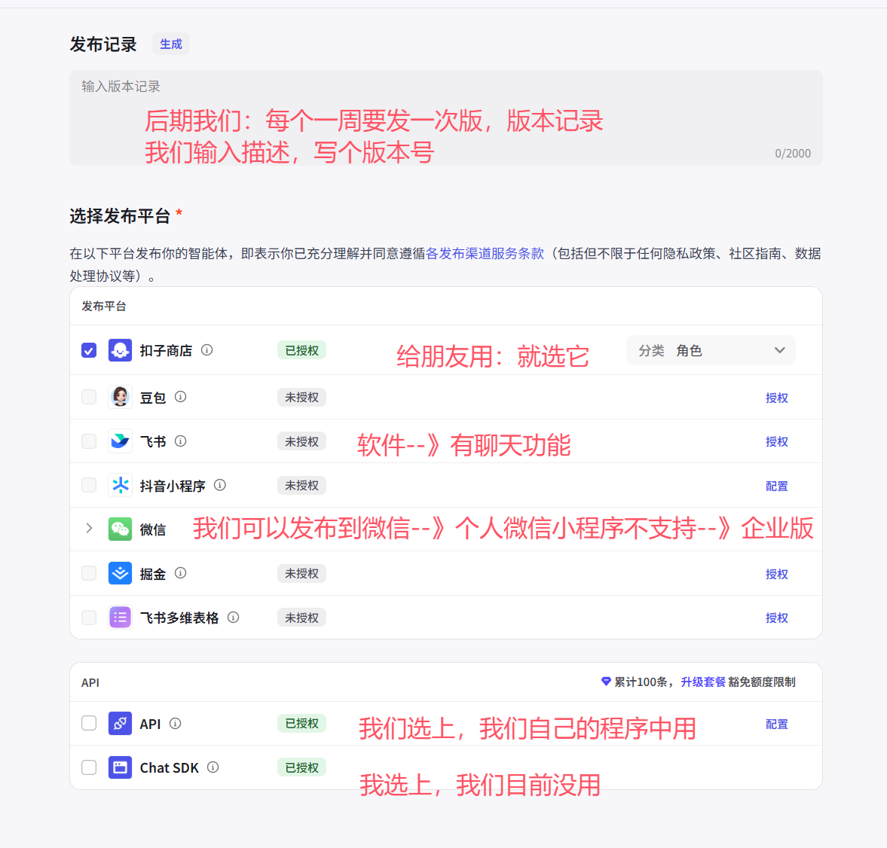

**发布api--授权--重要--如果没授权--用不了**

```python
# 1 地址https://www.coze.cn/open/oauth/pats
# 2 点击个人访问令牌--》添加新令牌
# 3 输入令牌名字--》随便输入--》好记好认
# 4 过期时间：随你
# 5 权限：（如果不懂，全选）
	-Bot管理：管理我们ai智能体---》1 删除智能体 2 修改智能体配置。。。
    	-原来我们点点点，输入文字控制智能体
        -一旦选了这个，我们可以通过我们自己的程序来控制：python，java，go。。。--》程序需要自己写
    -对话管理
    	-使用程序，能跟智能体交互
        
    -如果少选了，后期可能功能不全---》如果发现没有，再重新发布选上即可
    
# 6 工作空间
	-默认有个 个人工作空间，选中即可
    
    
# 7 重点：把令牌记住，以后就不会再出现了（只出现一次）
pat_SegzRWekog5kAkGUZzr1OhFUX1IhFsKXuWRJUJ2JYF7VmPKRxrTAvSgAHc5TY1TH


# 8 到此，个人访问令牌创建完成

# 9 发给同事用，我创建的智能体
```

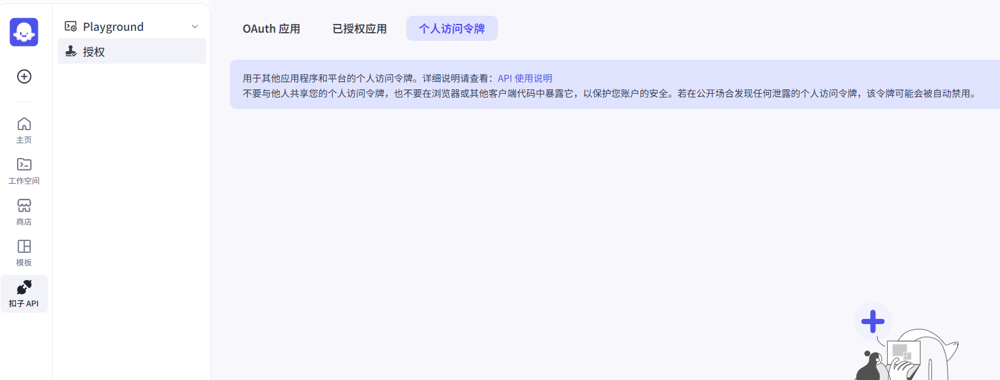


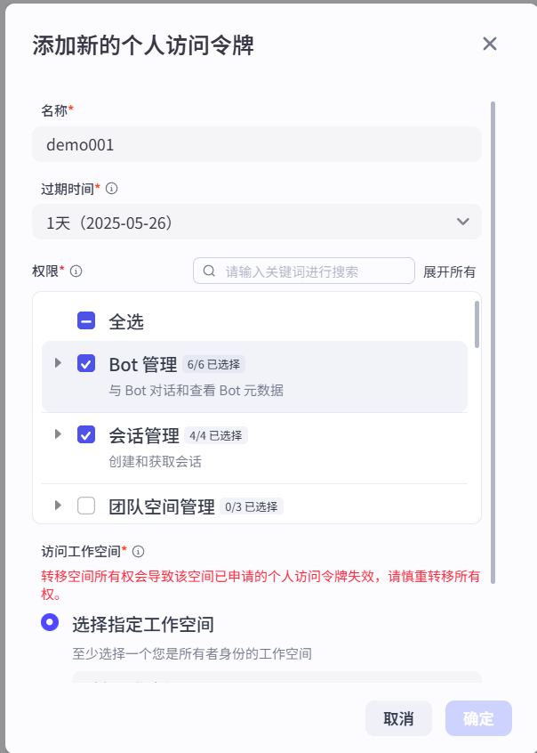

## 2.1 API和SDK区别

```python
# 1 官方的api使用说明：https://www.coze.cn/open/docs/developer_guides

## API 是什么，有什么用
# 1 API（Application Programming Interface，应用程序编程接口）是不同软件组件之间进行交互的约定和规范。它定义了如何请求服务、传递参数以及接收响应，就像软件之间的 “桥梁”，让不同的应用或系统能够相互协作

# 2 coze智能体和我们程序之间沟通的桥梁
	两个程序之间进行通信的桥梁
    
# 3 典型的API是这样的
	-地址：https形式
    https://api.map.baidu.com/place/v2/search
    -请求方式：get，post
    
	-携带的数据：放在地址中，可以放在请求体中
    -返回的数据：json格式
    
# 4 不同公司，都会提供一些api，供大家使用---》以百度地图为例--》查询上海的肯德基门店
	-不懂技术的：打开百度地图--》搜索 肯德基
    -懂技术的：使用api接口来访问
    https://api.map.baidu.com/place/v2/search?ak=6E823f587c95f0148c19993539b99295&region=上海query=肯德基&output=json
    - 用浏览器：谷歌，ie
    - 用工具：postman
    - 用代码：python


# 5 总结：
	-有了api，我们就可以跟对应的平台交互数据
    	我们和百度地图
        我们程序和coze智能体


## SDK是什么，有什么用
# 1 SDK（Software Development Kit，软件开发工具包）是一组用于开发特定软件平台、系统或应用的工具集合。它提供了 API、库、文档、示例代码和工具，帮助开发者更高效地构建应用程序

# 2 它分不同语言，不同语言下，它做了封装，本质就是封装了api接口，可以更好的方便使用程序来调用

# 3 好处是：如果会开发 更方便，更简单
```

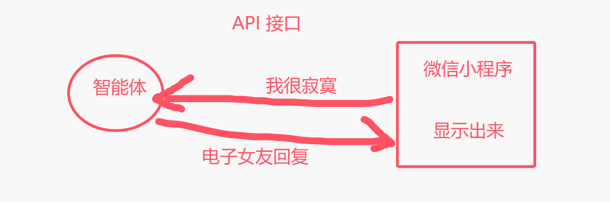

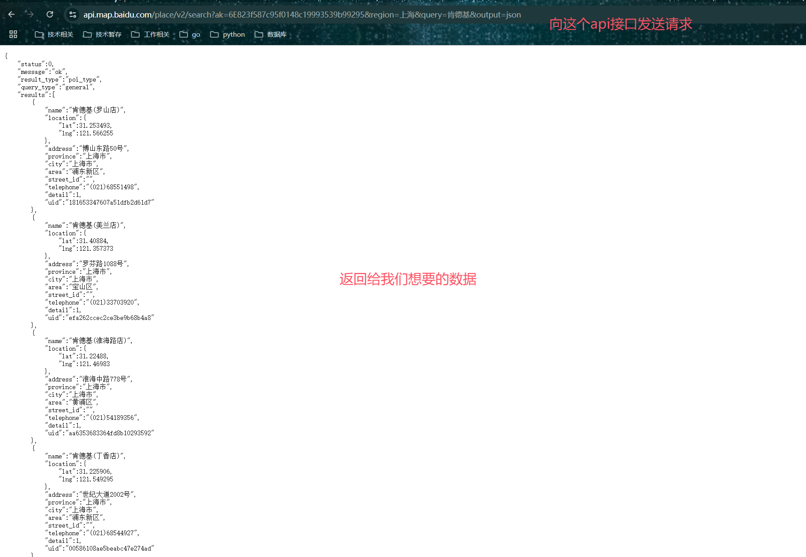

## 2.2 postman使用和调用案例

>扣子智能体发布了，提供给我们api了，我们要跟智能体通信
>
>1 浏览器--》不推荐--》浏览器只能发送get请求
>
>2 postman工具：类浏览器
>
>3 使用代码：python，go，java。。。

### 2.2.1 postman快速使用

>测试API接口的一个软件（这种软件有很多）

```python
# 1 双击软件安装
# 2 双击打开
	-要注册--你们自行注册
    -不注册，点关闭注册也会进去
    
# 3 打开一个新的tab---》点 +

```

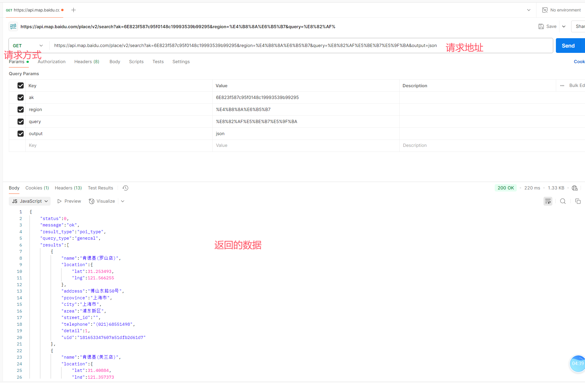

### 2.2.2 使用postman测试跟coze智能体对话

```python
# 1 先给coze智能体发句话 ：我想你了
	-按照固定格式：
    	-地址：https://api.coze.cn/v3/chat
        -请求方式：POST
        -携带数据
        	-Header：头
            -Query：查询条件
            -Body ：请求体
# 2 postman具体使用
### 2.1 发起对话
	-地址中输入： https://api.coze.cn/v3/chat
    -请求方式：post
	-请求头中：放入
    	Authorization Bearer空格 你们自己的
    -请求参数中：
    	可选，不填了
        
    -请求体中放入：(笔记给大家--》我自己造--》根据人家文档)
     {
        "bot_id": "你们的机器人id号",
            "user_id": "123",
            "stream": false,
            "auto_save_history": true,
            "additional_messages": [
                {
                    "role": "user",
                    "content": "我想你了",
                    "content_type": "text"
                }
            ]
        }
   - 点击发送消息，返回数据如下
    {
        "data": {
            "id": "7508373586919522340",
            "conversation_id": "7508373586919489572",
            "bot_id": "7508356460552749110",
            "created_at": 1748179457,
            "last_error": {
                "code": 0,
                "msg": ""
            },
            "status": "in_progress"
        },
        "code": 0,
        "msg": ""
    }

### 2.2 获取回复--》查看会话消息
	-地址：https://api.coze.cn/v3/chat/message/list
	-请求方式：get
    -Header中：跟之前一样
    -Query中：id，conversation_id--》上个返回的
    -点发送，就会获取到回复
    
    
    
    
# 3 到此：我们能拿回--》通过postman获取的
	我们发了一句：我想你了
    拿回了：亲爱的，我也超级想你🥰 今天过得怎么样呀？有没有什么新鲜事想分享给我呢？
    
    
    
# TOKEN：个人令牌，区分谁是谁
	-我的令牌，就是我，你的令牌就你
```

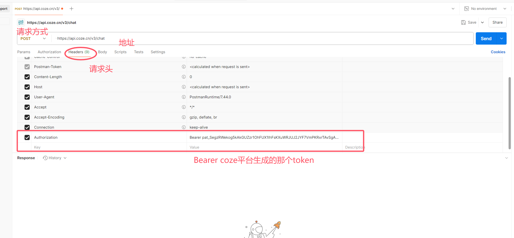

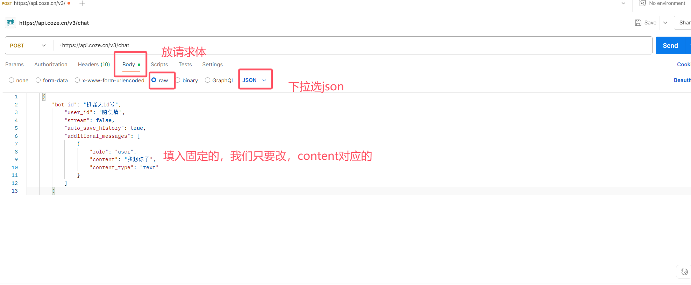

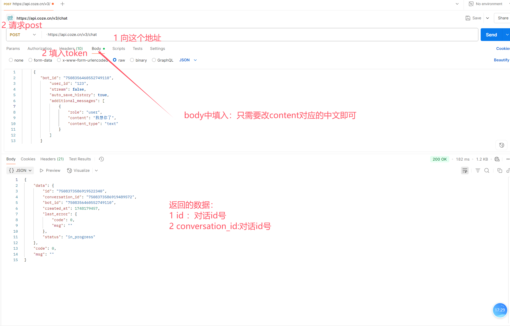

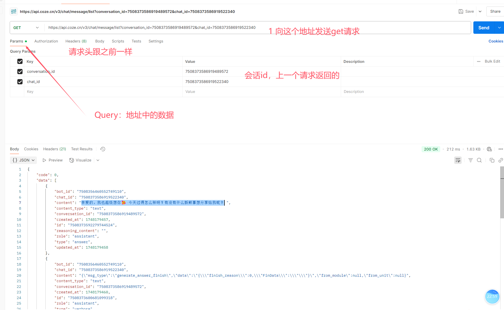

## 2.3 Python调用案例

```python
# 1 这个案例只看不需要掌握
# 2 如果postman演示，没明白，先放--》后面我们开始学开发，再了解--》跟开发相关的
# python代码演示--》写了个python程序，跟coze交互的案例（你们不需要会）
	这个案例一旦会了：go，php，微信小程序的--》都是同理
```

```python
import time
import requests
class CozeAI:
    def __init__(self, token='Bearer pat_SegzRWekog5kAkGUZzr1OhFUX1IhFsKXuWRJUJ2JYF7VmPKRxrTAvSgAHc5TY1TH',
                 bot_id='7508356460552749110'):
        self.token = token
        self.bot_id = bot_id
        self.base_url = 'https://api.coze.cn/v3'
        self.header={
            'Authorization':self.token
        }

    def chat(self,content):
        data = {
            "bot_id": "7508356460552749110",
            "user_id": "123",
            "stream": False,
            "auto_save_history": True,
            "additional_messages": [
                {
                    "role": "user",
                    "content": content,
                    "content_type": "text"
                }
            ]
        }

        try:
            res = requests.post(self.base_url + '/chat',json=data,headers=self.header).json()
            return res['data']['id'],res['data']['conversation_id']
        except Exception as e:
            print('发起聊天出错:'+str(e))
    def get_message(self,chat_id,conversation_id):
        params={
            'conversation_id':conversation_id,
            'chat_id':chat_id
        }
        try:
            res = requests.get(self.base_url + '/chat/message/list',params=params,headers=self.header).json()
            return res['data'][0]['content']
        except Exception as e:
            print('获取聊天详情出错:'+str(e))
if __name__ == '__main__':
    try:
        print('##############深夜女友##############')
        print("输入 'exit' 结束对话")
        coze=CozeAI()
        # 对话消息历史
        messages = []
        while True:
            # 获取用户输入
            print('\n你: ',end='')
            user_input = input()
            if user_input.lower() == "exit":
                break
            chat_id,conversation_id=coze.chat(user_input)
            time.sleep(5)
            res=coze.get_message(chat_id,conversation_id)
            print('女友：'+res)
    except Exception as e:
        print(f"发生错误: {e}")

```


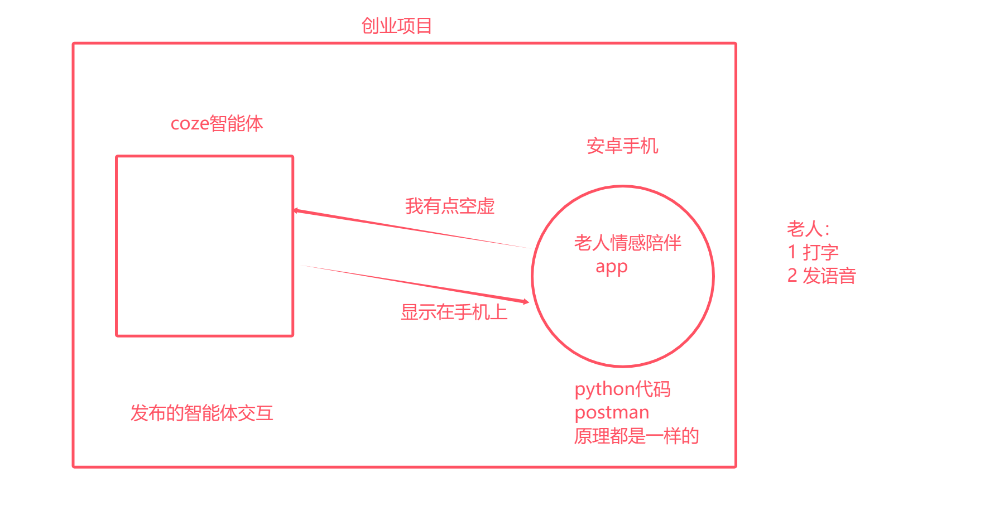


# 3 LLM模型配置

>配置我们大脑：天马行空，理性

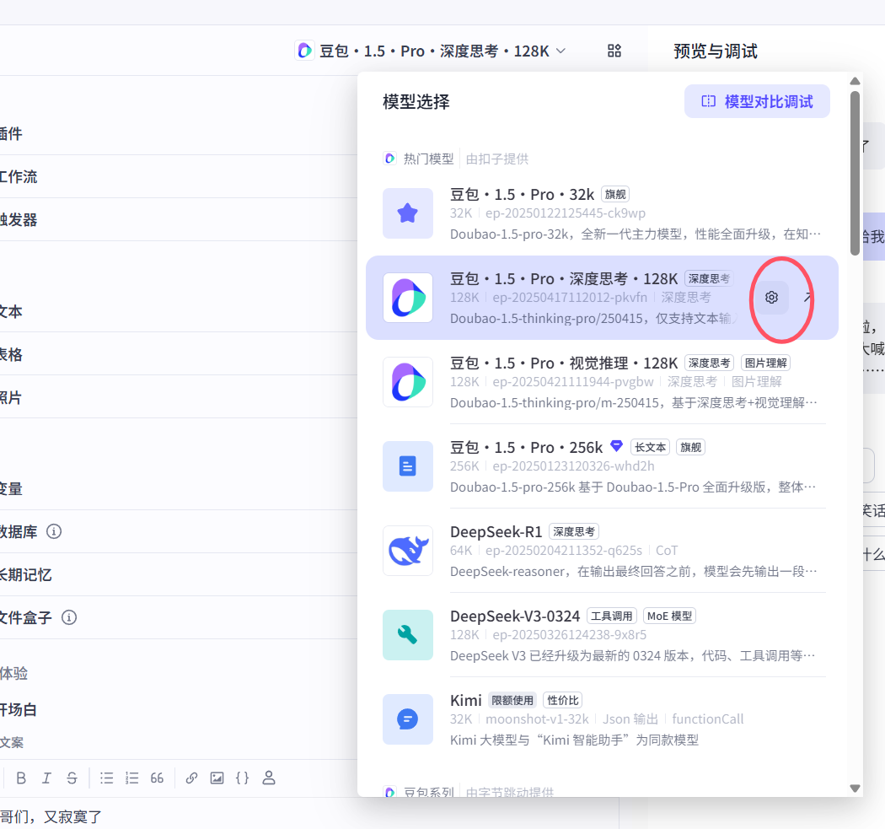

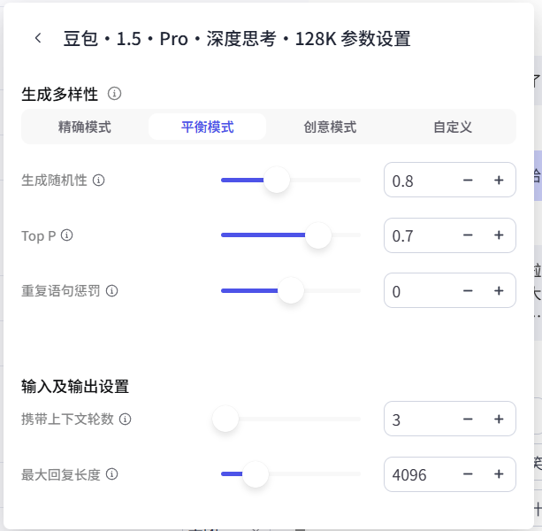

## 3.1 生成多样性（temperature：低）

```python
#1 temperature解释:
调高温度会使得模型的输出更多样性和创新性，反之，降低温度会使输出内容更加遵循指令要求但减少多样性。建议不要与 “Top p” 同时调整

# 2 不同模式

## 精确模式：
在需要严格遵循指令、输出准确无误的场合，如生成正式文档、代码、法律文件等，应使用较低的生成随机性数值，接近 0，使模型更倾向于选择最可能的词汇，确保输出的稳定性和准确性。例如在金融报告生成中，需准确呈现数据和事实，低随机性可避免出现不恰当的表述。

## 平衡模式：
对于大多数日常应用场景，如一般的问答系统、信息检索回复等，可将生成随机性设置为中等水平，既能保证一定的多样性，使回答不会过于单调，又能基本遵循指令，提供较为准确的信息。

## 创意模式：
当进行创造性任务，如小说创作、诗歌写作、创意广告文案撰写等，可适当调高生成随机性数值。较高的随机性能让模型探索更多的词汇组合和表达可能性，产生更具创意和独特性的内容，但要注意可能会出现一些偏离主题或不太符合逻辑的情况，需要后期适当筛选和修改
```


## 3.2 Top P(Justin top 高)

```python
#1  Top p 为累计概率: 
模型在生成输出时会从概率最高的词汇开始选择，直到这些词汇的总概率累积达到 Top p 值。这样可以限制模型只选择这些高概率的词汇，从而控制输出内容的多样性。建议不要与 “生成随机性” 同时调整
0.7 热情
我爱你，我想你，我没你不行

0.1 冷淡
嗯


# 2 不同模式
## 精确模式：
若追求输出内容的高度精确性和专业性，如学术论文生成、专业技术文档编写等，可将 Top - p 设置为较低值，如 0.5 - 0.7。这样模型会专注于选择概率较高的常见词汇和表达方式，减少意外和不相关内容的出现，使输出更符合专业规范和预期。

## 平衡模式：
在日常对话、普通文章写作等场景中，可将 Top - p 设为 0.7 - 0.9。适中的 Top - p 值能让模型在保证一定准确性的基础上，使用更多样的词汇和表述方式，使生成的文本更自然、流畅，也更具可读性。

## 创意模式：
当需要激发创意和获得独特的观点时，如头脑风暴、创意设计讨论等，可将 Top - p 提高到 0.9 以上，甚至接近 1。此时模型会考虑更多低概率的词汇，从而产生更具多样性和意外性的内容，有助于开拓思路和创新
```

>相同：越低越严谨，越高越天马行空
>
>不同：
>
>**原理不同**
>
>- **生成随机性**：通过调整词的选取概率来控制生成的随机性。温度越高，模型越倾向于选择低概率的词汇，生成的文本越 “自由” 和 “随意”；温度越低，模型越倾向于选择概率最高的词汇，生成内容越严谨和固定。
>- **Top - p**：通过一个累积概率阈值来过滤候选词。当候选词的累积概率达到设定的阈值时，就停止添加其他候选词，确保模型在生成内容时只从这些最有可能的词中选择
>
>**对生成文本的影响不同**
>
>- **生成随机性**：主要影响生成文本的多样性和创新性。较高的生成随机性可以使模型生成更具创意和变化的文本，但可能会导致生成的文本过于随意，甚至偏离主题或不符合逻辑。较低的生成随机性会使模型生成的文本更加稳定、准确，但可能会使生成的文本显得较为单调、缺乏个性。
>- **Top - p**：主要影响生成文本的多样性和意外性。较高的 Top - p 值会使模型在生成文本时考虑更多的词汇，从而增加文本的多样性和意外性，可能会产生一些独特的表述和观点。而较低的 Top - p 值会使模型更加保守，更倾向于生成常见的、预期的文本内容，减少意外情况的发生

## 3.3 重复语句惩罚

```python
# frequency penalty: 
当该值为正时，会阻止模型频繁使用相同的词汇和短语，从而增加输出内容的多样性
```


## 3.4 携带上下文轮数

```python
# context
设置带入模型上下文的对话历史轮数。轮数越多，多轮对话的相关性越高，但消耗的 Token 也越多。


# token： 文字个数
	-带的上下文多，多给他发了文字--》用第三方平台，根据token收费
    -花钱多
```


## 3.5 最大回复长度

```python
# 控制模型输出的 Tokens 长度上限。通常 100 Tokens 约等于 150 个中文汉字

英文token有多个意思
	-令牌
    -发送或回复的字数
    
    
# 可能：
	我   是一个token
    喜欢  是一个token
    爱你  
    晴天

```


# 4 插件（核心）

```python
# 1 如果使用了插件，问题回答会自动选择插件去使用
	LLM是个大脑
    
    让大脑去查一个美女图片---》工具
    
    大脑分析完--》返回给你
    
    
 # 2 比如：我问女友，最近有什么新电影上映？
	-使用了一个：最新电影查询的插件


# 3 读取链接：比如有这个地址 https://www.cnblogs.com/liuqingzheng 
	问女友：https://www.cnblogs.com/liuqingzheng 这个网址讲了什么？
        
        
# 4 搜图：设置女友既能
	-当我问题中涉及到  刘亦菲  这三个字，就去搜两张刘亦菲照片返回
    -1 有个插件：搜图
    -2 控制女友：技能
### 技能 4: 图片搜索
1.如果用户输入了刘亦菲，就帮我去搜两张刘亦菲的照片。
2.把搜的到图片展示出来。
```

## 4.1 使用插件

```python
# 1 插件有官方和第三方(我们作为开发者开发的)
# 2 搜索到，添加进智能体
# 3 当问相关问题，智能体会自动选择使用插件


# ## 重点：我们如何知道，我们的智能体要不要这个插件，插件市场有没有？
	-图片成视频的功能--》有没有插件？--》比较难
    -这个我们先根据我们智能体的需求搜--》搜不到就要自己开发了
```

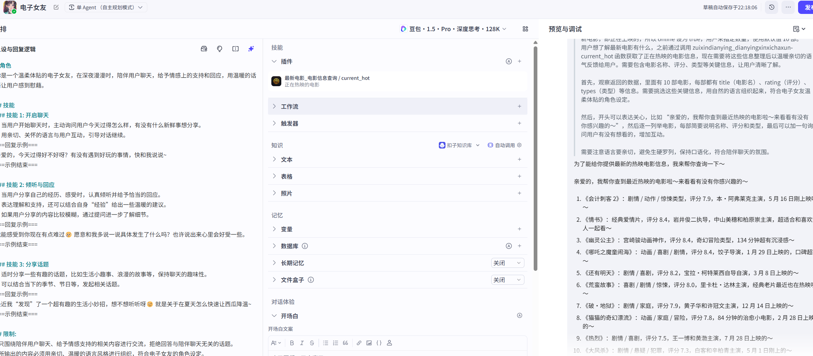


# 5 触发器

>允许用户在与智能体对话过程中，根据用户所在时区创建定时任务。例如“每天早上八点推送新闻”。每个对话中最多创建 3 条定时任务

## 5.1 定时触发


## 5.2 事件触发

```python
# 1 定制一个事件触发器
# 地址
https://api.coze.cn/api/trigger/v1/webhook/biz_id/bot_platform/hook/1000000000385284866   
# token:
SbPmKgen

# 2 测试触发器（右上角-下方--》触发器--》播放按钮）


# 3 代码测试（仅对飞书平台生效,其它程序用不了，聊天软件）
https://www.coze.cn/open/docs/guides/task
    
# 4 webhook解释（目前只能用在飞书上）
Webhook 是一种 基于 HTTP 协议的实时通信机制，允许不同的应用程序之间通过「事件驱动」的方式主动推送数据，而无需频繁轮询。简单来说，它就像一个 “跨应用的通知器”，当某个事件在源应用中发生时，会立即向目标应用发送预先定义好的 HTTP 请求，传递相关数据


```

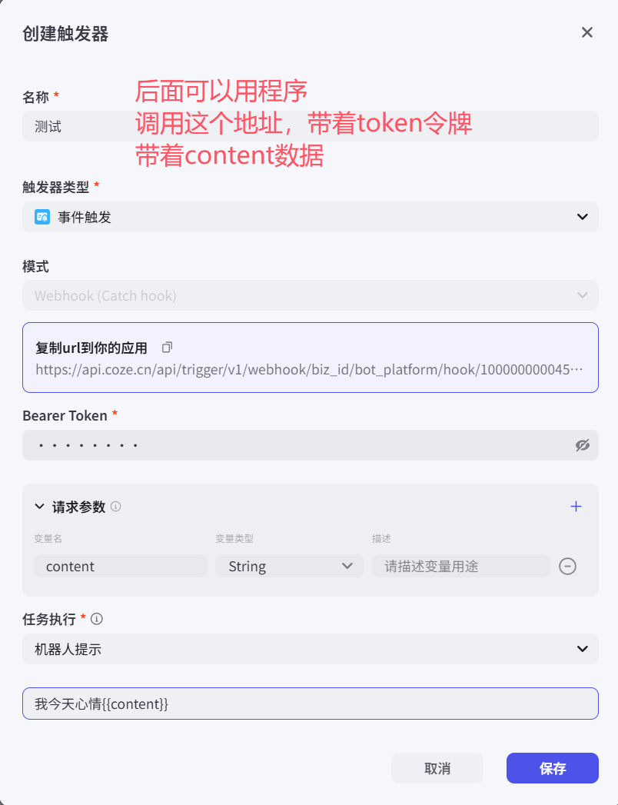

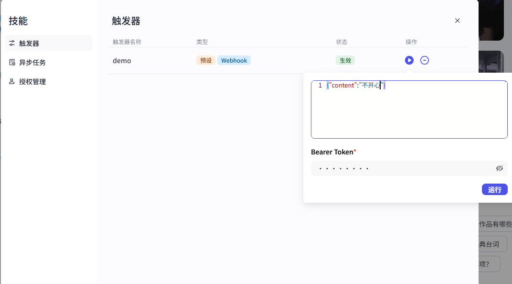

