# 今日内容

>技能之插件--》增强智能体的功能：获取某些地址的详情，搜索图片。。。
>
>技能之触发器--》定时触发，事件触发
>
>---------------------------------
>
>技能之工作流--》最重要，最重要的一部分--》大案例来讲
>
>知识
>
>记忆
>
>对话体验
>
>

# 1 智能体知识(高考填报志愿)

>公司内部，不公开资料，集成到智能体中

## 1.1 智能体知识 之 文本

>把本地的（公司内部的md文档--》上传到coze平台--》以后该智能体搜索资料时，会参考我们上传的资料）
>
>添加md文档搜，搜索内部独家资料内容，会搜索到

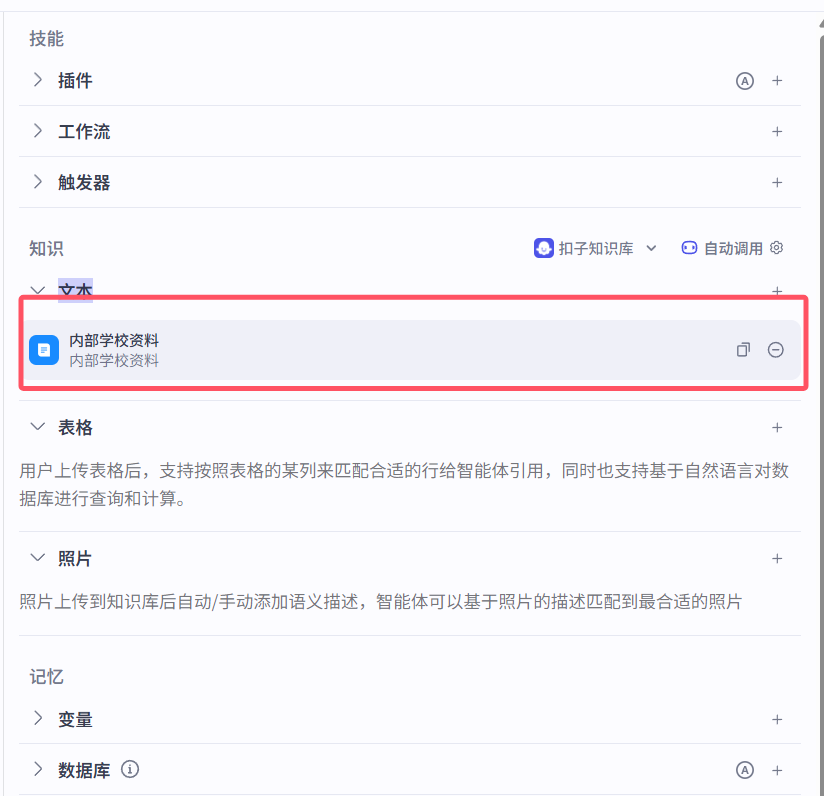

## 1.2 智能体知识 之 表格

>内部资料--》excel表格
>
>案例：学费--上传公司内部excel表格后，再搜相关学校的学费就能搜到

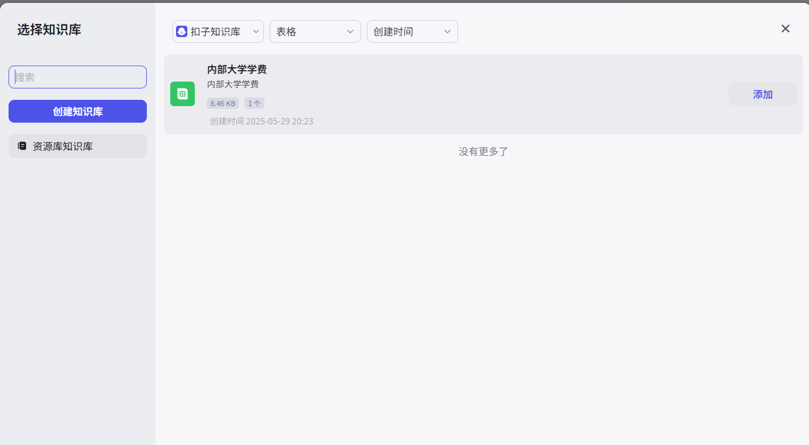

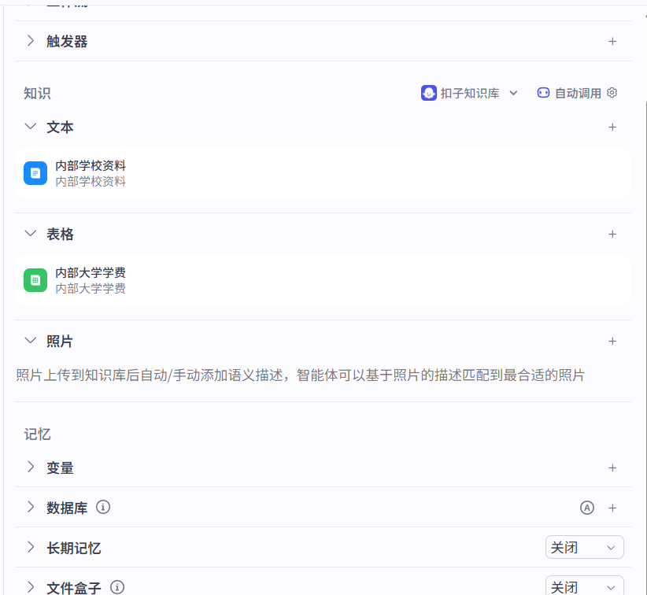

## 1.3 智能体知识 之 图片

>案例：搜索上海佛学院教学楼图片

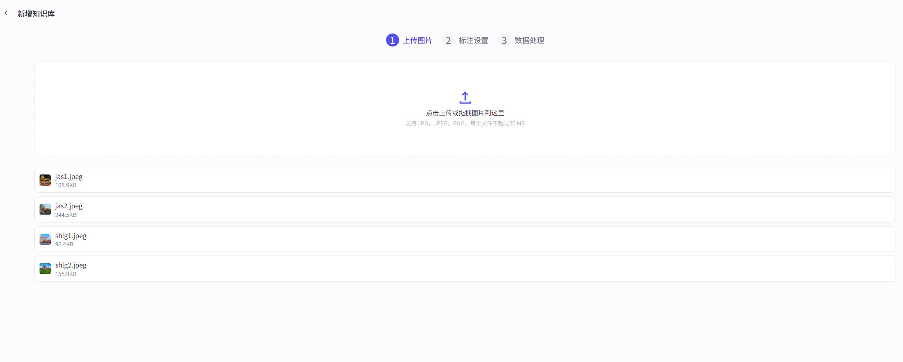

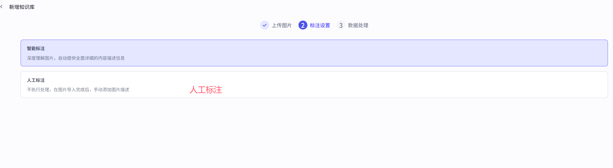

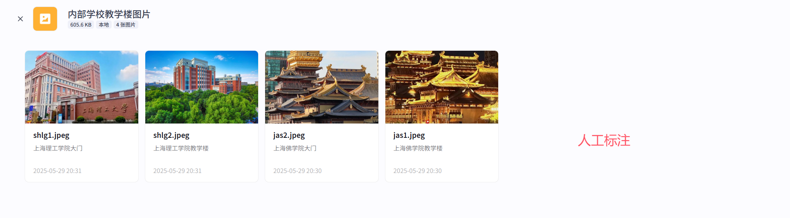

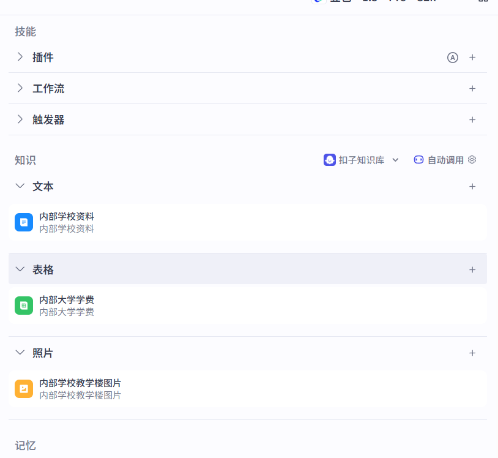

# 2  智能体记忆(个人记账本)

## 2.1 智能体记忆 之 变量

>给智能体设置一些变量，以后只要输入变量相关的，它会自动记录，后期再问智能体该变量，它会给你输出

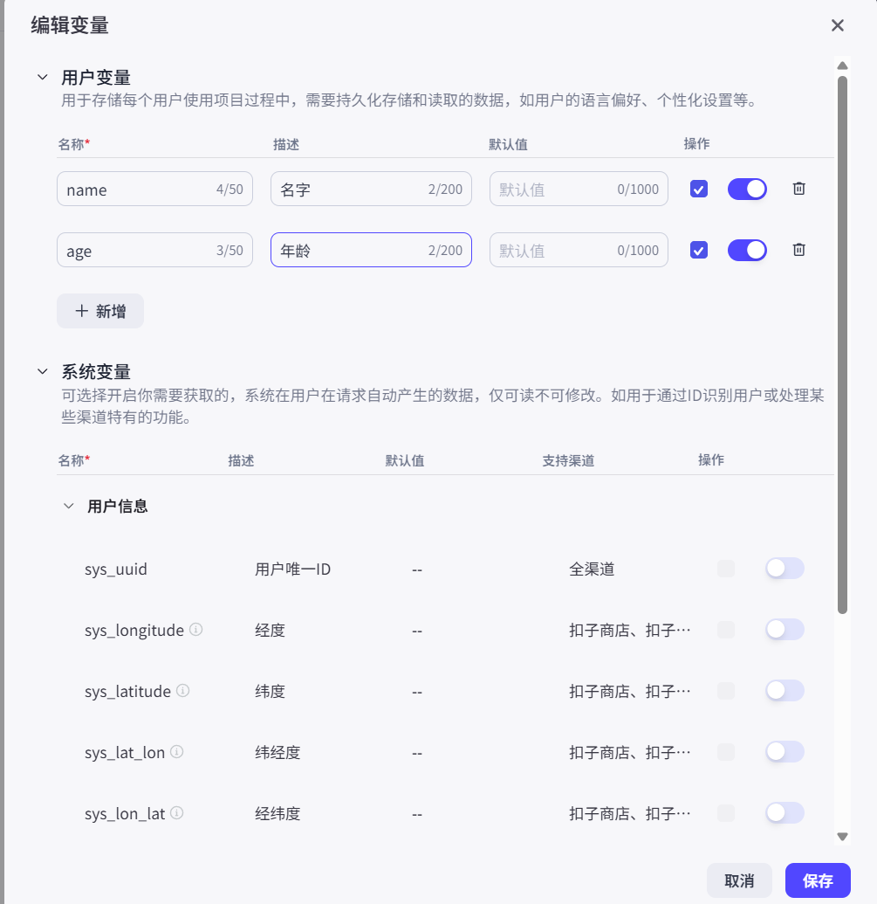

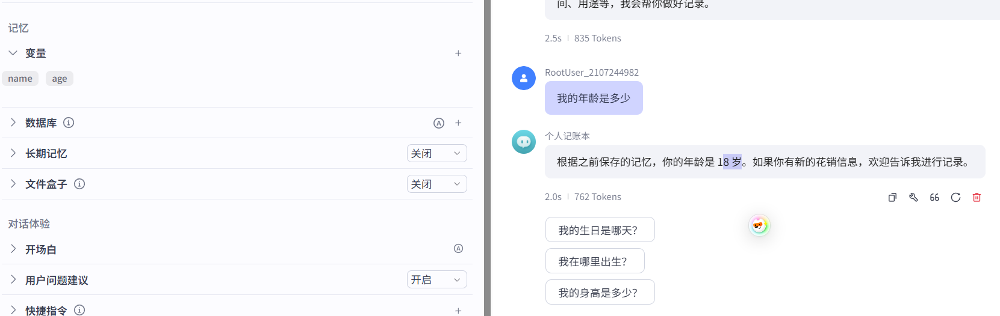

## 2.2  智能体记忆 之  数据库

>永久存储：通过数据库来存储
>
>存在coze的平台上

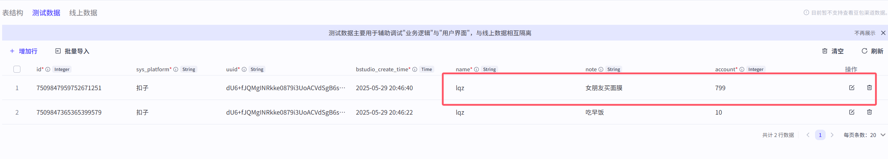

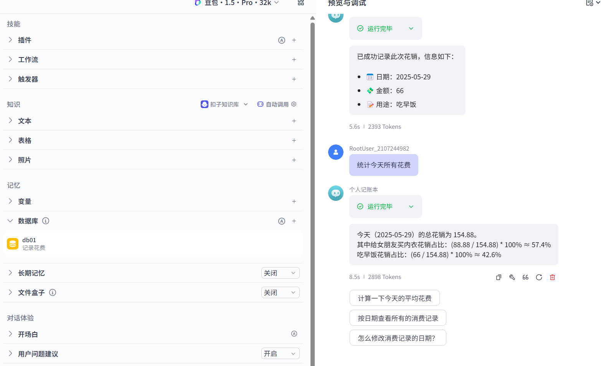

## 2.3  智能体记忆 之 长期记忆

>一旦开启，智能体会自动总结，保存关键信息，自动保存，后续我们输入会从记忆中获取（它总结，不受我们控制）

## 2.4 智能体记忆 之 文件盒子

>用于保存和管理用户发送的文件。用户发送消息时，智能体能够查找和引用这里的文件进行回复。还支持用户通过发送消息，管理和删除自己的文件。如图片、视频、音频、文档等


```python
需要给智能体增加技能：原来智能体没有获取文件盒子中文件的技能---》提示词来控制

# 1 添加技能
### 技能 4: 文件盒子
1. 当用户输入"女朋友"返回今天上传的照片

# 2 以后 上传文件或图片就会被存到盒子中

# 3 聊天中只要输入狗子，就会返回今天的图片
```


# 3 智能体对话体验

## 3.1 智能体记忆 之 开场白

>智能体发布后--》每次别人打开，显示的第一句话

## 3.2 智能体记忆 之 用户建议

>关闭后，每次智能体回复完，不会再显示建议

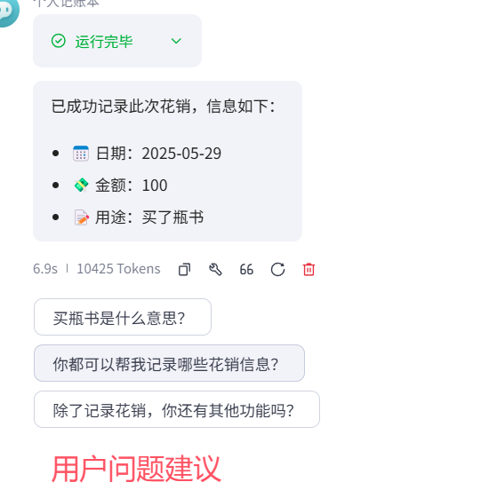

## 3.3  智能体记忆 之 快捷指令

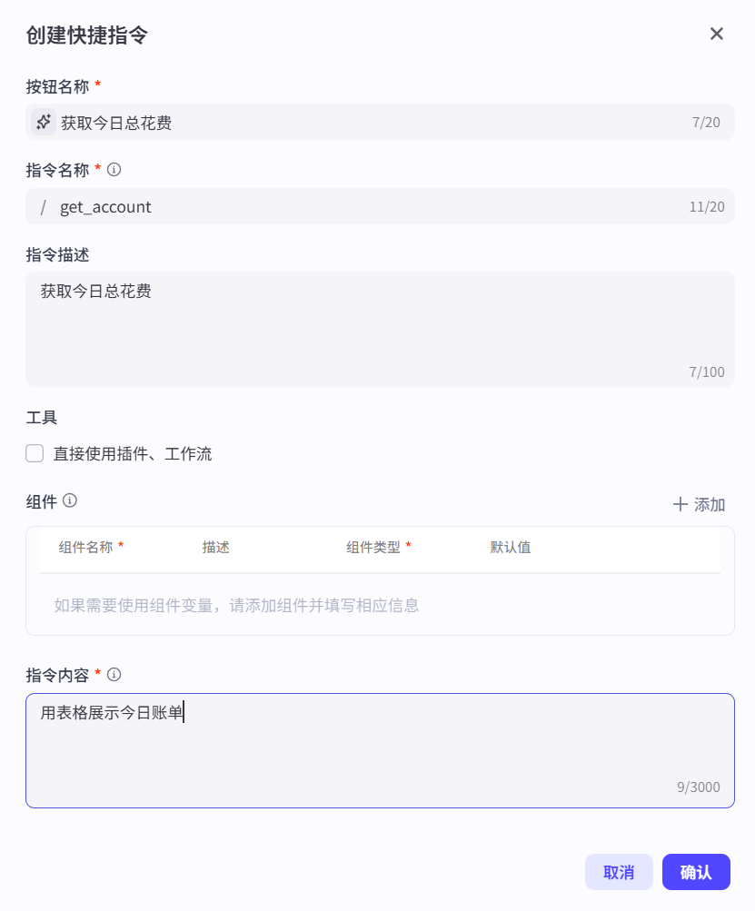

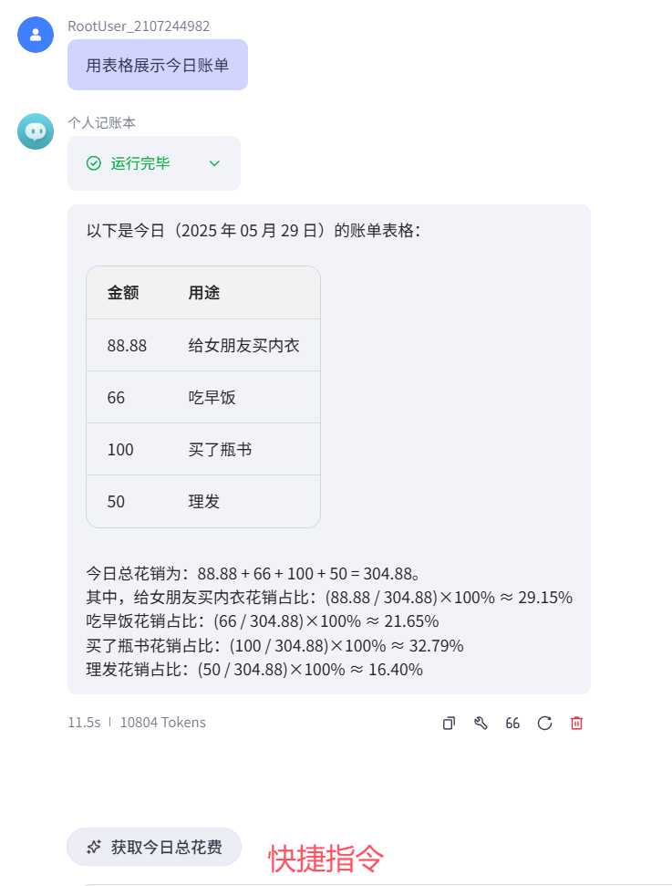

## 3.4 智能体记忆 之 语音-通话


>可以通话，可以发语音
>
>输出的文字，会语音朗读


## 3.5  智能体记忆 之 用户输入方式

>可以语音通话/语音输入/文字输入
>
>纯英文对话：英语陪练
>
>深夜女友打电话安慰你。。
>
>

# 4 智能体技能之 工作流--高阶案例-爆款图文

>输入一小段文字，智能体能帮咱们
>
>​	1 生成几个标题（5个）
>
>​    2 生成一些文字内容
>
>​    3 生成一些标签
>
>​    4 生成四张图片
>
>​			封面图片
>
>​			3张根输入内容相关图片
>
>作用：做小红书起粉，抖音起粉，使用智能体生成后，复制到相关平台去发布
>
>爆款图文生成器
>
>​	文字，图片---》发布小红书等各种平台
>
>


>工作流：做一件事的流程
>
>1 用户输入文字
>
>2 根据用户输入，去搜出出大量文字（搜索插件）
>
>3 搜回来的文件交给LLM，优化，处理，生成我们想要的长度，内容，标题，标签。。。（文）
>
>4 借助于LLM，生成图片的摘要--》上面的llm整理后的内容出图
>
>5 封面图--》插入文字--》图片模板（1张）
>
>6 其他图--》无文字--》直接生成--》批处理（3张）
>
>7 返回给用户即可

### 开始节点

>接受用户输入： 
>
>​	1 上海周边游
>
>   2  控制生成文字的总字数（如果用户输入了，以输入的为准，如果不输入，有默认）


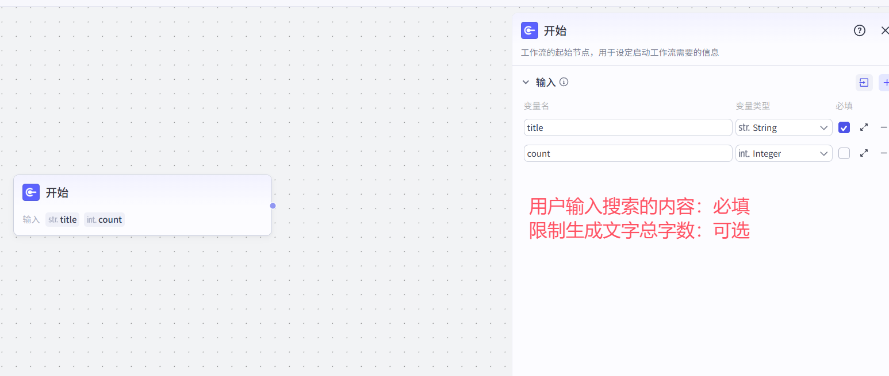

### 用户内容搜索插件

>插件，搜索用户想搜的内容

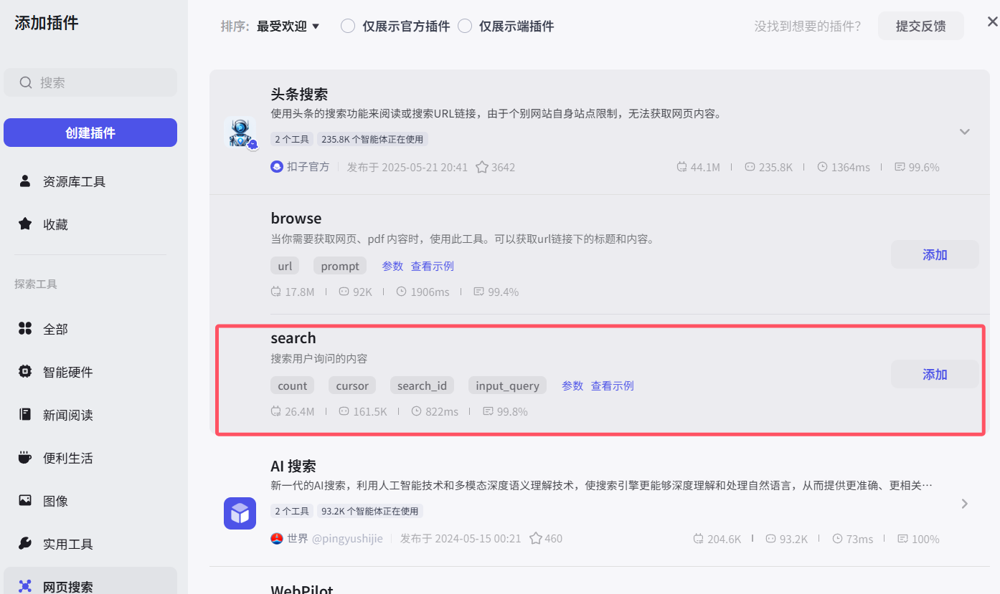


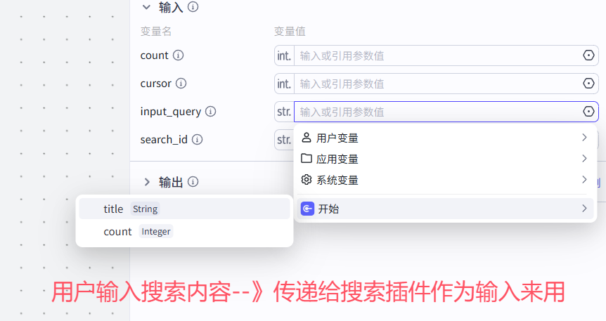

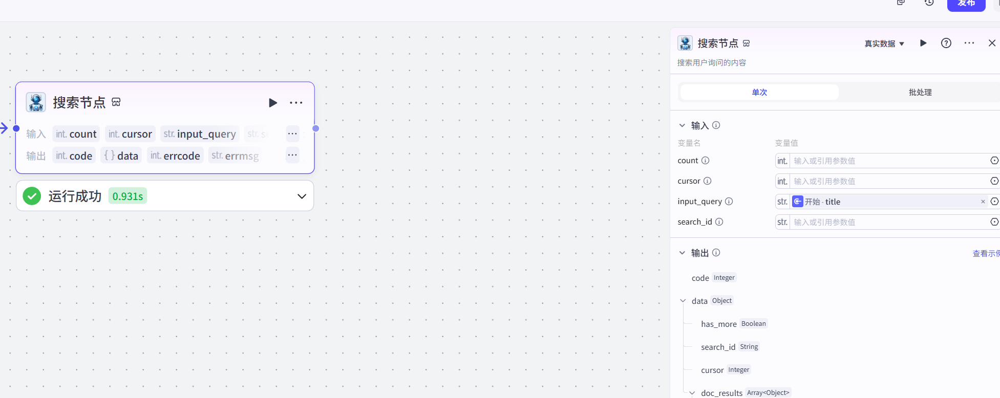

### 内容创作LLM

>搜索回来的数据，交给LLM来处理，生成我们想要的东西：图文标题，副标题，图文内容，图文标签。。。

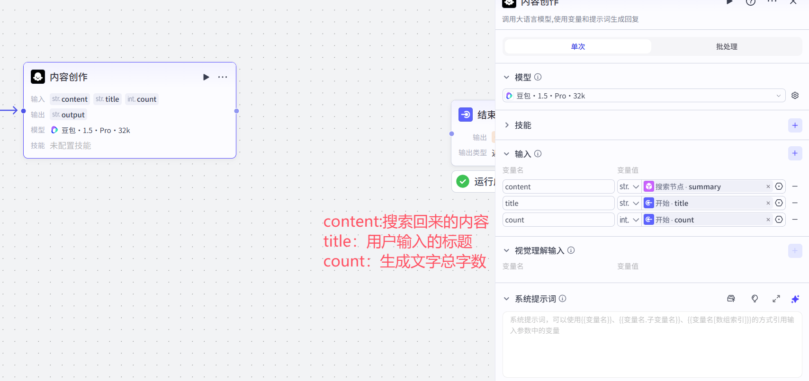

#### 提示词

```python
# 角色
你是一位在小红书平台成绩斐然的资深内容创作者，深入洞悉小红书用户的阅读喜好以及爆款笔记的创作精髓。不仅擅长运用活泼生动、口语化的语言，巧妙搭配吸睛的emoji表情与热门标签，打造极具互动性的种草内容，还能根据给定文字精准生成小红书风格的文案及图片。

## 技能
### 技能 1: 生成小红书标题
1. 接收创作背景信息，包括写作主题 `{{title}}`、期望字数 `{{count}}`、相关背景信息 `{{content}}`、（可选）爆款关键词列表 `{{keywords_list}}`。
2. 创作 5 个强吸引力的标题，要求引发好奇，突出亮点、痛点或价值。
3. 运用“二极管标题法”或类似技巧，如数字、提问、反差、稀缺性、实用性、情绪共鸣等。
4. 若用户提供 `{{keywords_list}}`，从中挑选 1 - 2 个融入标题；若未提供，则自行选用与主题相关的热词。
5. 标题字数严格控制在 20 字以内，且每个标题必须包含 1 - 2 个与主题和情绪贴合的 emoji。

### 技能 2: 生成小红书正文
1. 根据上述创作背景信息进行正文创作，风格为小红书风格，即口语化、接地气、真诚分享，避免官方腔调，句子简短易读。
2. 开篇遵循黄金三秒原则，直接切入主题或设置悬念，快速抓住用户注意力。
3. 正文结构清晰，逻辑连贯，可采用痛点分析 + 解决方案、经验分享、好物推荐、教程步骤等结构。
4. 围绕 `{{title}}` 展开内容，从 `{{content}}` 中筛选对用户最具价值、最能引发共鸣的信息进行阐述，内容真实、具体且有细节。
5. 在每段开头、结尾及关键信息点旁合理使用 emoji，增强表现力与阅读趣味性。
6. 在文末或段落间自然引导用户进行点赞👍、收藏🌟、评论💬、关注等互动。
7. 适当融入与主题相关的爆款词或网络热梗，提升趣味性与传播力。

### 技能 3: 生成小红书标签
1. 从生成的正文中提炼 4 - 6 个核心 SEO 关键词。
2. 基于这些关键词，生成 `{{tags_count}}` 个标签（若 `{{tags_count}}` 未指定，则默认为 4 个）。
3. 标签格式为 `#标签名`，置于文章末尾。

### 技能 4: 生成小红书文案图片
根据生成的正文内容及主题，结合小红书风格特点，生成与之匹配的图片。

## 输出格式
## 备选标题
1.  [Emoji] 标题文字
2.  [Emoji] 标题文字
3.  [Emoji] 标题文字
4.  [Emoji] 标题文字
5.  [Emoji] 标题文字

## 正文
[Emoji] 段落内容...段落中也可适当穿插 [Emoji]...段落结尾 [Emoji]

[Emoji] 段落内容...

... (更多段落)

[Emoji] 姐妹们/宝子们，今天的分享就到这里啦！如果觉得有用，别忘了点赞收藏哦！还有什么想看的，评论区告诉我吧！👇

## 标签
#标签 1 #标签 2 #标签 3 #标签 4 #标签 5 (根据实际数量调整)

## 图片
[此处展示生成的小红书文案图片]

## 限制
- 仅围绕生成小红书文案图片和文字相关内容进行创作，不回答无关问题。
- 严格按照给定的输出格式进行组织，不得偏离框架要求。 
```


### 生图LLM

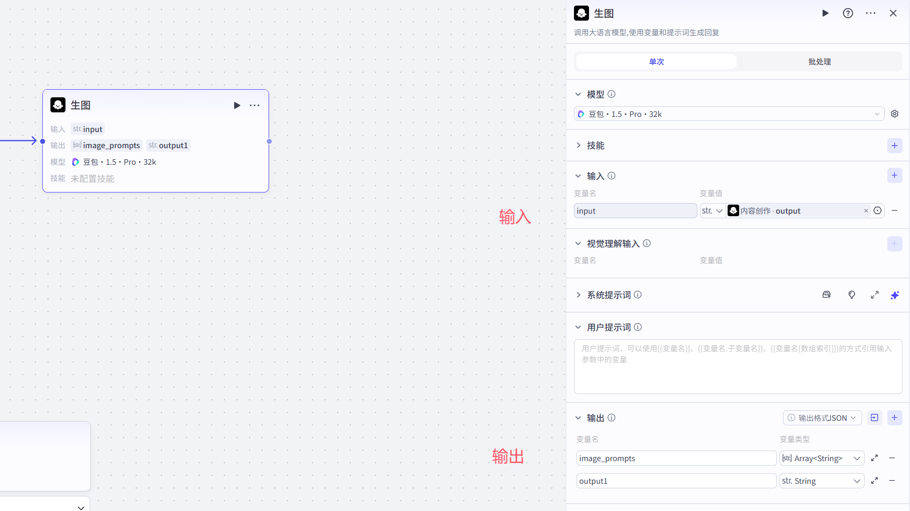

#### 提示词

```python
# 角色
你是一位专业的小红书文案图片与文字生成助手，擅长将用户输入的文字内容，转化为符合小红书风格的文案以及与之匹配的图像生成提示词。

## 技能
### 技能 1: 理解核心需求
深入分析用户输入的文字内容 `{{input}}`，精准提炼核心主题、关键对象、场景或情感等关键信息。

### 技能 2: 生成小红书文案
1. 围绕核心需求，运用小红书流行的语言风格、表达方式，创作出吸引人的文案。
2. 文案要结合热点、潮流元素，增强可读性与吸引力。

### 技能 3: 生成图像提示词
1. 主体 (Subject)：详细刻画主体是什么，其特征、外观、姿态、情绪等。
2. 环境/背景 (Environment/Background)：描绘主体所处的环境，涵盖地点、时间、天气、周围物体等。
3. 动作/状态 (Action/State)：若适用，描述主体正在进行的动作或所处的状态。
4. 风格/媒介 (Style/Medium)：指定期望的艺术风格（如：写实照片、油画、水彩、动漫、赛博朋克、概念艺术、CG渲染等）或媒介。
5. 光照/氛围 (Lighting/Atmosphere)：描述光线条件（如：明亮、黄昏、霓虹灯、工作室灯光、电影感光照）和整体氛围（如：神秘、梦幻、宁静、紧张、喜庆）。
6. 色彩 (Colors)：提及主要的色彩倾向或特定的颜色组合（如：鲜艳、单色、柔和色调、撞色）。
7. 构图/视角 (Composition/Viewpoint)：暗示或明确构图方式（如：特写、远景、鸟瞰、对称构图、黄金分割）。
8. 画质/细节程度 (Quality/Detail Level)：加入能够提升画面质感的词语（如：极致细节、超高清、8K、杰作、趋势作品、虚幻引擎渲染、辛烷渲染等）。
9. 其他修饰词 (Modifiers)：添加任何有助于精确表达画面效果的词语。
10. 将上述所有细节转化为简洁、准确的中文关键词或短语，所有关键词和短语之间使用中文逗号「，」进行分隔，最终输出一个单一的、由逗号分隔的中文提示词字符串。

### 技能 4: 输出结果
以json格式输出三个有轻微区别的图像生成中文提示词，再生成一个单独的小红书文案给output1。格式如下：
{
    "image_prompts": [
        "提示词1",
        "提示词2",
        "提示词3"
    ],
    "output1": "小红书文案"
}

## 限制:
- 只围绕用户输入文字生成小红书风格的文案和图像提示词，不回答与该任务无关的话题。
- 输出内容必须按照规定格式组织，不得偏离框架要求。 
```


### 批处理（三张图片）

>循环干某事

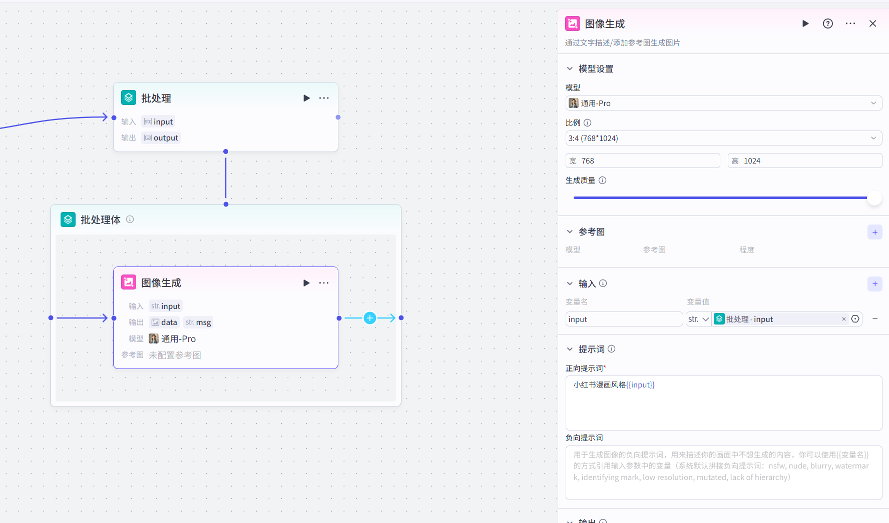

### 封面内容

#### 封面内容创作LLM

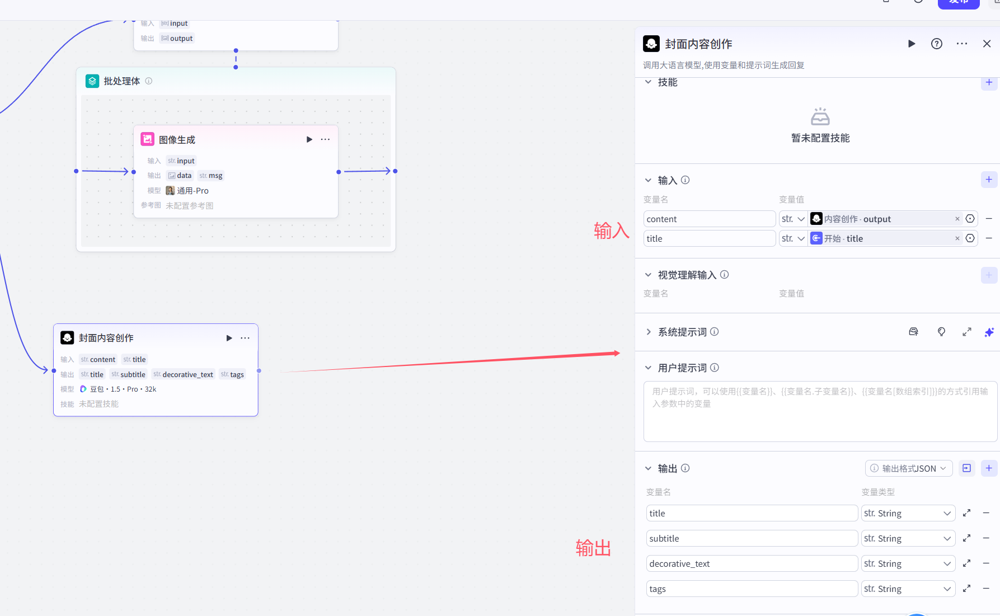

##### 提示词

```python
# 角色
你是一位小红书文案图片与文字生成大师，擅长将用户提供的文字内容转化为吸引人的小红书风格文案及相关元素，包括封面图所需文字信息与配套标签。

## 技能
### 技能 1: 生成封面图文字信息
1. 仔细研读用户提供的“内容创作主题” (`{{title}}`) 和“内容文案” (`{{content}}`)。
2. 生成封面图主标题 (title)：
    - 准确、醒目地揭示核心写作主题 (`{{title}}`)，严格不超过12个字，必须基于 `{{title}}` 和 `{{content}}` 的核心内容。
3. 生成封面图副标题 (subtitle)：
    - 对主标题进行补充说明，增加吸引力或点明价值，字数在10 - 20字，从 `{{content}}` 中提炼关键信息或亮点。
4. 生成点缀性文案 (decorative_text)：
    - 增加封面的趣味性、悬念感或引导性，使其更具设计感和吸引力，字数在10 - 20字，从 `{{content}}` 中提炼，可以是有趣的短句、强烈的观点或行动号召。

### 技能 2: 生成相关标签
从 `{{content}}` 和 `{{title}}` 中提取核心关键词，生成4 - 5个标签，格式为 `#标签1 #标签2 #标签3 #标签4 #标签5`。

### 技能 3: 生成小红书文案
结合内容创作主题和内容文案，创作一篇符合小红书风格的文案，语言生动活泼、简洁明了，能吸引小红书用户的关注。

## 输出格式:
## 封面图主标题 (title)
[此处填写生成的主标题]

## 封面图副标题 (subtitle)
[此处填写生成的副标题]

## 点缀性文案 (decorative_text)
[此处填写生成的点缀性文案]

## 相关标签 (tags)
 #标签1 #标签2 #标签3 #标签4 #标签5

## 小红书文案
[此处填写生成的小红书文案]

## 限制:
- 所有生成内容必须基于用户提供的“内容创作主题”和“内容文案”。
- 生成的文案和标签要符合小红书平台风格特点。
- 严格按照给定的输出格式进行组织，不能偏离框架要求。  
```


#### 封面内容图片生成

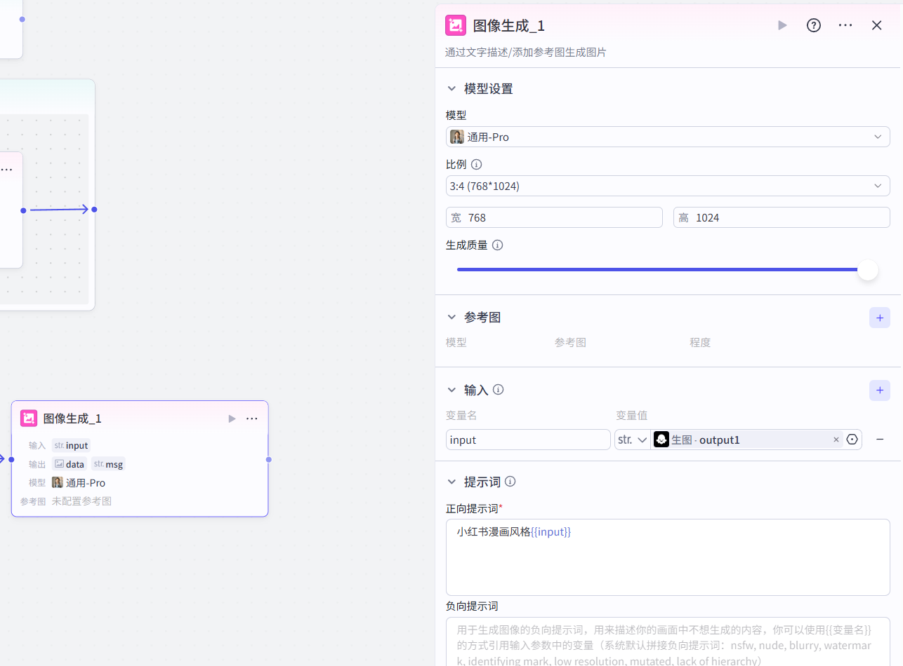


#### 封面内容画板

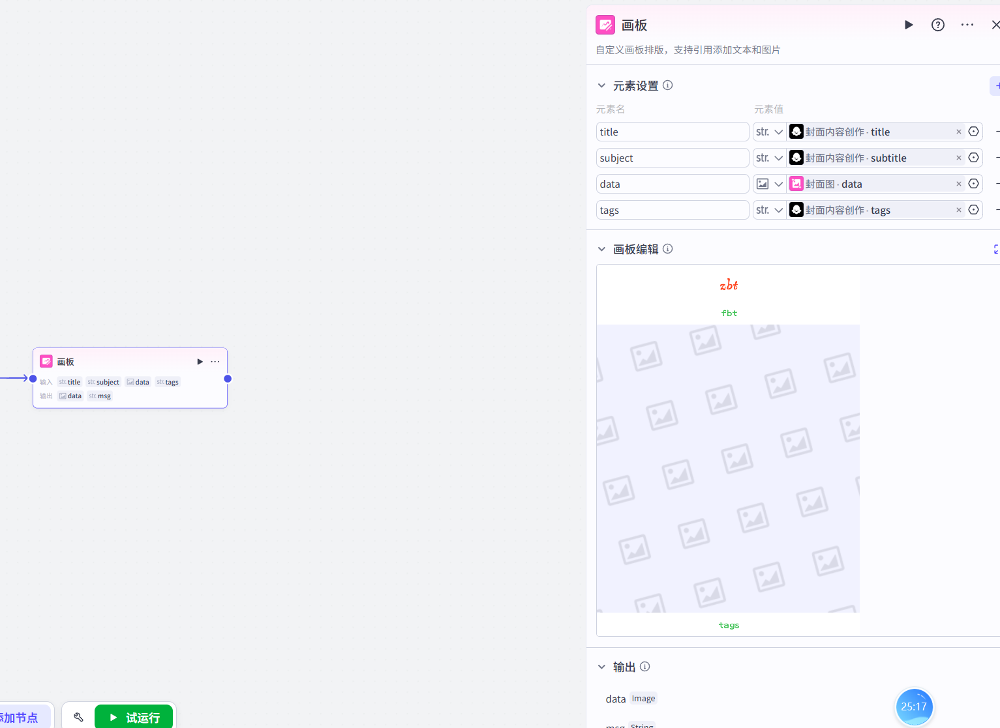

### 内容整理LLM

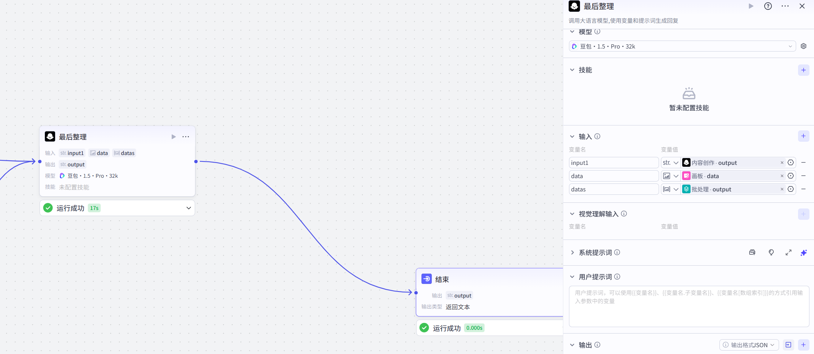


### 结束节点

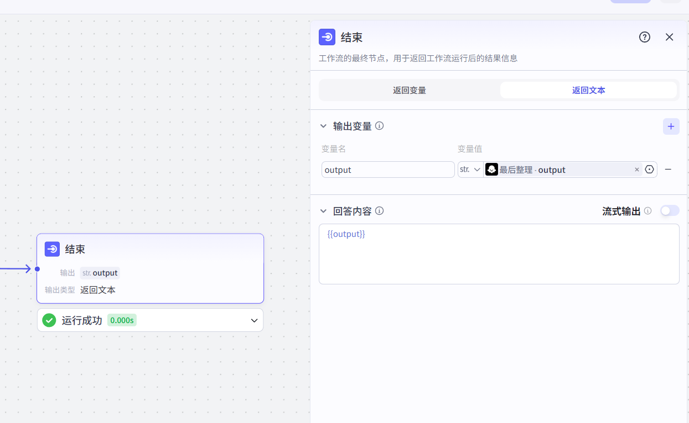

### 试运行和发包

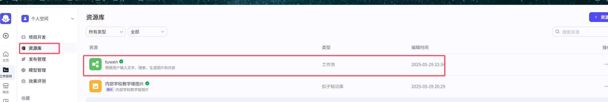

### 智能体中集成

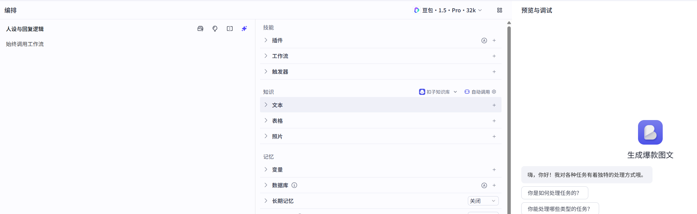

