# 0 今日内容


```python
# 1 Dify介绍

## 1.1 Dify是什么
## 1.2 官网-文档
## 1.3 Dify社区版-专业版-教育版
## 1.4 Dify 云服务使用

# 2 Dify开发环境介绍

## 2.1 最低机器要求
## 2.2 Docker,Docker-compose 介绍
## 2.3 官方提供的安装方式

# 3 本地搭建dify介绍-个人测试（mac,win）

# 4 企业级-服务搭建-centos,ubuntu,云服务器 

## 4.1 虚拟机安装

### 4.1.1 处理器架构
### 4.1.2 VMware Workstation Pro安装
### 4.1.3 创建虚拟机
### 4.1.4 安装centos9系统

## 4.2 远程链接工具使用

## 4.3 Docker安装和常用命令
## 4.4 docker-compose安装和常用命令
## 4.5 Dify 1.4.0 下载安装
# 5 Dify接入火山方舟

# 6 Dify接入本地deepseek
```


# 1 Dify介绍

## 1.1 Dify是什么

```python
Dify 是一款开源的大语言模型(LLM) 应用开发平台。它融合了后端即服务（Backend as Service）和 LLMOps 的理念，使开发者可以快速搭建生产级的生成式 AI 应用。即使你是非技术人员，也能参与到 AI 应用的定义和数据运营过程中。

# 后端既服务Backend as Service：云计算服务模式，旨在帮助开发者快速构建应用程序的后端功能

# LLMOps 是 “大语言模型运维”（Large Language Model Operations）的缩写，指的是在 AI 模型的整个生命周期中加快其开发、部署和运营的专门工作流程和实践

由于 Dify 内置了构建 LLM 应用所需的关键技术栈，包括对数百个模型的支持、直观的 Prompt 编排界面、高质量的 RAG 引擎、稳健的 Agent 框架、灵活的流程编排，并同时提供了一套易用的界面和 API。这为开发者节省了许多重复造轮子的时间，使其可以专注在创新和业务需求上
```

## 1.2 官网-文档

```python
# 1 官网：
https://dify.ai/zh
    
# 2 云服务：在线体验（速度较慢，有时需要翻墙）
https://cloud.dify.ai/signin
## 云服务相关介绍：https://docs.dify.ai/zh-hans/getting-started/cloud
    
# 3 文档
https://docs.dify.ai/zh-hans/introduction
```

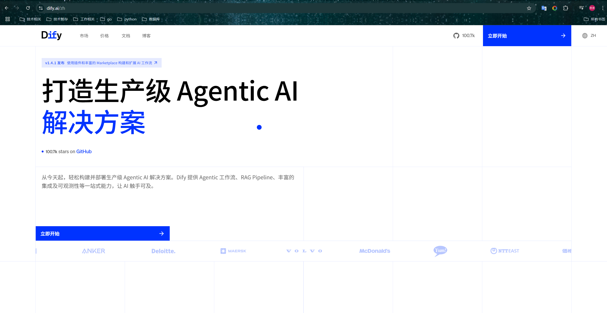

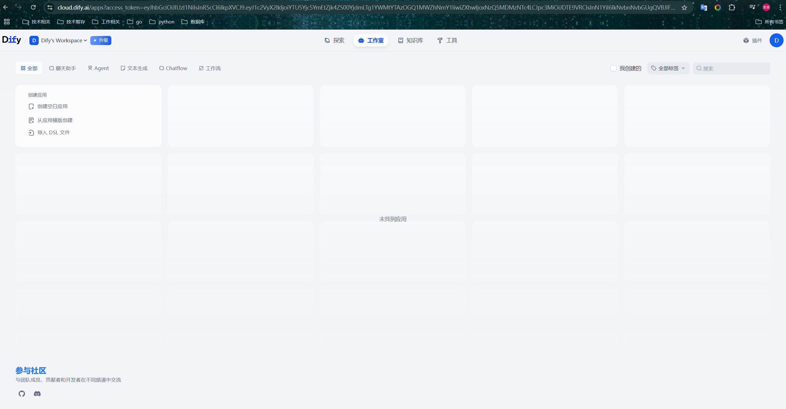

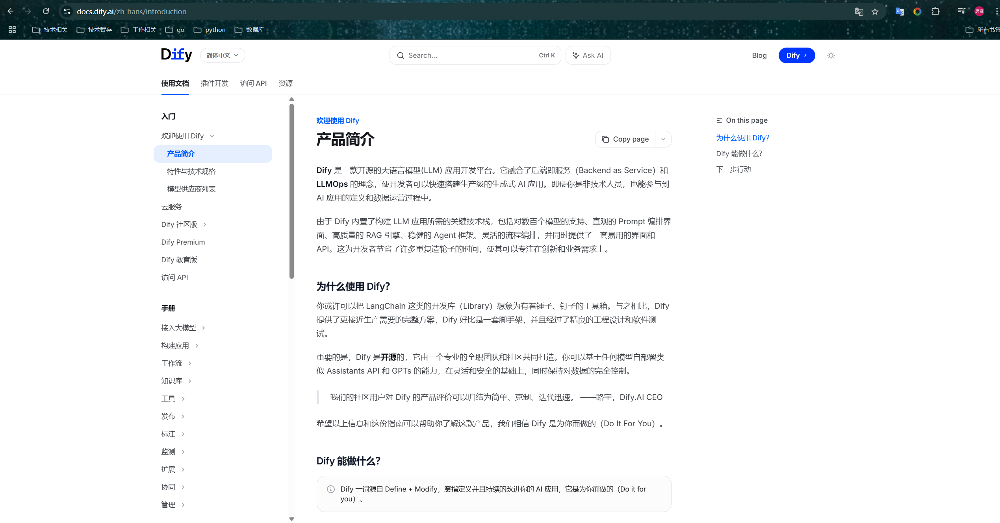

## 1.3 Dify 社区版、专业版和教育版区别

```python
#1. 社区版（免费开源）
## 1.1 目标用户：个人开发者、学生、小型项目或开源社区。
## 1.2 核心特点
  - 开源免费：基于 Apache 2.0 协议开源，可自由使用、修改和分发。
  - 基础功能：支持基本的 AI 应用开发，如创建简单的聊天机器人、知识问答系统。
  - 有限资源：通常有模型调用次数、并发请求数等限制（如每月 10,000 次 API 调用）。
  - 社区支持：通过 GitHub 社区获取帮助，无官方专属技术支持。
## 1.3 适合场景：学习和探索 Dify 功能、个人项目开发、简单原型验证。


#2. 专业版（付费订阅）
## 2.1 目标用户：企业开发者、商业项目团队、需要高可用性和高级功能的组织。
## 2.2 核心特点
## 2.3 高级功能
    - 企业级 RAG 引擎：支持大规模知识库管理、文档语义化处理（如 PDF/PPT 解析）。
    - 多模态能力：支持图文混合生成、视频分析等复杂任务。
    - LLMOps 监控：提供模型调用成本分析、性能监控和持续优化工具。
    - 工作流编排：可视化设计复杂业务流程，支持多模型协同。
  - 性能提升：更高的并发处理能力、更低的响应延迟、更长的对话上下文支持。
  - 安全与合规：企业级数据安全（如数据加密、审计日志）、单点登录（SSO）。
  - 官方支持：专属技术支持、优先更新和功能定制服务。
## 2.4 适合场景：商业产品开发、企业内部工具集成、需要高性能和稳定性的应用。


# 3. 教育版（免费 / 优惠）
## 3.1 目标用户：高校、科研机构、教师和学生。
## 3.2 核心特点
  - 教育资源
    - 免费或低价使用：通常提供一定额度的免费资源或学生优惠价格。
    - 教学支持：配套教学文档、课程案例和实验环境。
  -功能限制：介于社区版和专业版之间，可能包含部分专业版功能（如简化的 RAG 引擎），但资源配额较低（如模型调用次数）。
  - 学术用途：仅限非商业的教学、研究和学术项目使用。
## 3.3 适合场景：高校教学、学术研究、学生竞赛和毕业设计。


### 如何选择
- 选社区版：如果是个人学习、开源项目或简单原型开发，且对功能和性能要求不高。
- 选专业版：如果是企业级应用开发、需要高可用性和高级功能（如 RAG、多模态），且愿意付费获取支持。
- 选教育版：如果是高校或科研机构，用于教学或学术研究，可申请教育版获取免费或低成本资源
```

| **功能维度**     | **社区版**                 | **专业版**               | **教育版**              |
| ---------------- | -------------------------- | ------------------------ | ----------------------- |
| **授权模式**     | 开源免费                   | 付费订阅                 | 免费 / 优惠（需认证）   |
| **模型调用限制** | 有限制（如每月 10,000 次） | 无 / 高配额              | 中等配额（适合教学）    |
| **RAG 知识库**   | 基础功能                   | 高级检索、多文档处理     | 简化版，支持教学案例    |
| **工作流设计**   | 基础拖拽                   | 复杂逻辑编排、多模型协作 | 基础到中等复杂度        |
| **LLMOps 监控**  | 无                         | 成本分析、性能优化       | 简化版监控              |
| **安全与合规**   | 基础安全                   | 企业级加密、审计日志     | 基础安全 + 教育合规     |
| **技术支持**     | 社区支持                   | 官方专属支持             | 教育社区 + 部分官方支持 |
| **商业使用**     | 受限（需符合开源协议）     | 允许                     | 仅限学术用途            |

## 1.4 云服务使用

```python
# 1 云服务：在线体验（速度较慢，有时需要翻墙）
https://cloud.dify.ai/signin
## 云服务相关介绍：https://docs.dify.ai/zh-hans/getting-started/cloud
```


# 2 Dify环境搭建介绍

## 2.1 最低机器性能要求

>在安装 Dify 之前，请确保您的设备符合以下最低系统要求：
>
>- CPU >= 2 核
>- RAM >= 4 GiB


## 2.2 Docker,Docker-compose介绍

**Docker介绍-简单了解**

```python
#### 1  Docker 是什么？
Docker 是一款开源的 容器化平台，用于快速开发、部署和运行应用程序。它将应用程序及其依赖（如代码、运行环境、库、配置文件等）打包成一个轻量级、可移植的 容器（Container），使应用程序能够在不同的环境（如开发、测试、生产环境）中 无缝运行，解决了 “环境不一致” 的问题。

#### 2 Docker核心概念
# 镜像（Image）
镜像相当于容器的 “模板”，包含了运行应用所需的一切资源（代码、依赖、系统工具、环境变量等）。
镜像可以通过 Dockerfile（一种文本文件，定义镜像构建步骤）自定义构建，也可以从公共仓库（如 Docker Hub）拉取现成的镜像。
# 容器（Container）
容器是镜像的 “运行实例”，可理解为轻量级的沙盒环境。
多个容器共享宿主机的内核，但彼此隔离，互不影响，保证了应用的安全性和稳定性。
# 仓库（Repository）
用于存储和分发镜像的服务器，分为 公共仓库（如 Docker Hub）和 私有仓库（企业自建，用于内部镜像管理）。

#### 3 为什么需要 Docker？
# 3.1 环境一致性
传统部署问题：开发环境是 macOS，测试环境是 Linux，生产环境是云服务器，依赖版本不一致导致 “在我电脑上能跑，上线就报错”。
Docker 解决方案：将应用和依赖打包成镜像，无论部署到哪里，环境都完全一致。
# 3.2 轻量级与资源高效
传统虚拟机（VM）：需要模拟完整的操作系统，占用大量内存和磁盘空间（通常几十 GB）。
Docker 容器：共享宿主机内核，仅包含应用和依赖，体积可小至几十 MB，启动速度毫秒级。
# 3.3 开发、测试、部署流程标准化
开发人员用 Docker 构建镜像，测试人员直接在容器中验证，运维人员一键部署到生产环境，流程统一且可复用。
#3.4 弹性扩展与微服务架构
容器可快速复制（如启动 100 个相同容器），配合 Kubernetes 等工具实现自动化扩缩容，非常适合微服务架构。

#### 4 Docker 的典型使用场景
# 4.1 应用部署
例：将一个 Python 后端服务和 MySQL 数据库分别打包成容器，通过 Docker Compose 一键启动，无需手动配置环境。
# 4.2 微服务架构
将复杂应用拆分为多个独立容器（如用户服务、订单服务、支付服务），每个容器运行一个微服务，便于独立升级和扩展。
# 4.3 持续集成 / 持续部署（CI/CD）
在代码提交后，自动触发 Docker 镜像构建和测试，通过后直接部署到生产环境，加速交付流程。
# 4.4 开发环境隔离
为不同项目创建独立的容器环境，避免依赖冲突（如项目 A 需要 Python 3.8，项目 B 需要 Python 3.10）。
# 4.5 桌面应用开发
开发者可在本地通过 Docker 运行数据库、缓存服务等依赖，无需手动安装和配置。

#### 5 Docker 常用命令示例
docker run 	xx           # 运行一个测试容器，验证 Docker 是否安装成功。
docker pull redis	     # 从 Docker Hub 拉取 redis 镜像。
docker images	         # 查看本地已有的镜像。
docker ps	             # 查看正在运行的容器。
docker stop [容器ID]      # 停止容器。
docker rm [容器ID]        # 删除容器（需先停止容器）。
docker build -t myapp .	 # 根据当前目录的 Dockerfile 构建名为 myapp 的镜像。


#### 6 总结
Docker 通过容器化技术，让应用程序的部署和运行变得像 “搭积木” 一样简单，极大提升了开发和运维效率。无论是个人开发者、中小型企业还是大型互联网公司（如 字节、京东、亚马逊），都在广泛使用 Docker 构建高效的技术架构
```

**Docker-compose介绍-简单了解**

```python
#### 1 Docker Compose介绍
Docker Compose 是 Docker 官方推出的一个工具，用于定义和运行 多容器 Docker 应用。通过一个配置文件（docker-compose.yml），你可以一次性定义多个容器及其依赖关系、网络配置和环境变量，然后使用一条命令（docker-compose up）启动所有服务，大大简化了分布式应用的部署流程

### 2 核心概念
# 服务（Service）
一个服务对应一个容器定义，例如一个 Web 应用、一个数据库或一个缓存服务。每个服务可以定义镜像、端口映射、环境变量等。
# 项目（Project）
由多个服务组成的一个完整应用，通过 docker-compose.yml 文件统一管理。

#### 3 为什么需要 Docker Compose？
# 想象一个典型的 Web 应用：

前端服务（如 Nginx）
后端 API（如 Python Flask）
数据库（如 MySQL）
缓存（如 Redis）

如果用原生 Docker 命令部署，需要手动启动每个容器，并配置它们之间的网络连接，非常繁琐。而 Docker Compose 可以通过一个配置文件一键启动所有服务，自动处理网络和依赖关系

#### 4 Docker Compose 工作流程
1 编写 docker-compose.yml 文件
 定义所有服务的配置（镜像、端口、挂载卷等）。
2 执行 docker-compose up 命令
 Compose 会根据配置文件创建并启动所有容器。
3 执行 docker-compose down 命令
 一键停止并删除所有容器、网络和卷
    
### 5 常用命令
docker-compose up	                 # 创建并启动所有服务（加 -d 后台运行）
docker-compose down	                 # 停止并删除容器、网络和卷
docker-compose ps	                 # 查看服务状态
docker-compose logs	                 # 查看服务日志
docker-compose build	             # 构建或重新构建服务镜像
docker-compose exec [服务名] [命令]	# 在运行的容器中执行命令（如 exec web bash）

### 6 适用场景
# 本地开发环境：快速搭建包含多个服务的开发环境。
# 测试环境：自动化部署测试所需的所有服务。
# 小型生产环境：在单台服务器上部署简单的微服务应用。
# CI/CD 流水线：在持续集成 / 部署流程中自动化测试和部署。

#### 7 与 Kubernetes 的对比
# 特性	           # Docker Compose	          # Kubernetes
复杂度	               简单（单主机）	             复杂（分布式集群）
扩展性	               有限	                    强大（支持自动扩缩容）
适用场景	          开发、测试、小型应用	      大规模生产环境
编排能力	          基本编排	                  高级编排（服务发现、负载均衡、自愈）


### 8 总结
Docker Compose 是 Docker 生态中不可或缺的工具，特别适合快速搭建和管理多容器应用。它通过配置文件将复杂的部署流程标准化，大大提高了开发和运维效率。如果你经常需要同时运行多个相关服务（如前后端分离应用、微服务架构），Docker Compose 会是你的得力助手
```


## 2.3 官方提供的安装方式

```python
# 1 地址：
https://docs.dify.ai/zh-hans/getting-started/install-self-hosted/readme

# 2 Docker Compose 部署

# 3 使用源代码本地启动

# 4 宝塔面板部署

# 5 单独启动前端 Docker 容器
当单独开发后端时，可能只需要源码启动后端服务，而不需要本地构建前端代码并启动，因此可以直接通过拉取 docker 镜像并启动容器的方式来启动前端服务


# 6 环境变量说明
# 6.1 公共变量
# 6.2 服务端
# 6.3 前端

# 7 多模态解释
Dify 的多模态模型配置 是平台支持同时处理 多种类型数据（如图像、文本、音频等） 的能力，通过整合不同模态的信息，让 AI 应用具备更丰富的感知和交互能力，使其具备图像识别，语音理解，图文问答等能力
```


# 3 个人-本地搭建介绍(win,mac)

```python
# 0 WSL
Windows Subsystem for Linux（简称WSL）是一个在Windows 10\11上能够运行原生Linux二进制可执行文件（ELF格式）的兼容层。它是由微软与Canonical公司合作开发，开发人员可以在 Windows 计算机上同时访问 Windows 和 Linux 的强大功能。 通过适用于 Linux 的 Windows 子系统 (WSL)，开发人员可以安装 Linux 发行版（例如 Ubuntu、OpenSUSE、Kali、Debian、Arch Linux 等），并直接在 Windows 上使用 Linux 应用程序、实用程序和 Bash 命令行工具，不用进行任何修改，也无需承担传统虚拟机或双启动设置的费用

#1  win或mac 机器-直接docker官方下载docker-destop
	-安装docker-destop：它已经将 Docker Compose 集成在内，还有图形化界面
		-https://docs.docker.com/get-started/get-docker/
# 2 双击安装

# 3 重启机器后，进入，不注册登录也可以使用

# 4 进入到dify目录，使用命令启动dify即可
docker compose up

# 5 访问浏览器
http://localhost


# 拉取不了镜像，配置国内镜像站
"https://docker.1ms.run",
"https://hub.rat.dev",
"https://docker.1panel.live",
"https://hub.rat.dev",
"https://proxy.1panel.live",
"https://ghcr.nju.edu.cn",
"https://docker.registry.cyou",
"https://dockercf.jsdelivr.fyi",
"https://docker.rainbond.cc",
"https://registry.cn-shenzhen.aliyuncs.com",
"https://dockertest.jsdelivr.fyi",
"https://mirror.aliyuncs.com",
"https://mirror.baidubce.com",
"https://docker.mirrors.ustc.edu.cn",
"https://docker.mirrors.sjtug.sjtu.edu.cn",
"https://mirror.iscas.ac.cn",
"https://docker.nju.edu.cn",
"https://docker.m.daocloud.io",
"https://dockerproxy.com",
"https://docker.jsdelivr.fyi",
"https://docker-cf.registry.cyou"
```


# 4 企业级-服务器搭建（centos,ubuntu,云服务器）

## 4.1 虚拟机安装

### 4.1.1 处理器架构

```python
# 1 x86_64（代表：Intel/AMD）
## 指令集扩展：支持 SSE、AVX、AVX-512 等向量指令集，擅长单线程高性能计算（如 AI 训练、视频渲染）。
## 多核设计：主流服务器芯片核数通常为 8-64 核（如 AMD EPYC 96 核），依赖超线程（HT）提升并行效率。
## 生态系统：垄断桌面（Windows）和 90% 以上服务器市场，软件兼容性极强（如 Docker、Kubernetes 原生支持）。
##典型场景：个人电脑、数据中心服务器、游戏主机（如 PS5/Xbox 使用定制 AMD APU）。

# 2 AArch64（代表：ARM、华为鲲鹏、Apple M 系列）
## 指令集扩展：支持 NEON（向量运算）、Cryptography Extensions（加密加速），适合移动和边缘计算。
## 多核设计：天生支持大规模多核（如 AWS Graviton3 达 64 核），片上集成 ISP、NPU 等专用单元（如手机 SoC）。
## 生态系统：移动领域绝对主导（安卓 /iOS 应用原生支持），服务器端通过 Rosetta/QEMU 兼容 x86 软件（可能损失性能）。
##典型场景：智能手机（如骁龙 8 Gen3）、云服务器（如阿里云神龙 ARM 实例）、物联网设备（如树莓派 5）。

# 3 PPC64LE（代表：IBM Power、飞腾）
## 指令集扩展：支持 Altivec（向量处理）、Decimal Floating Point（十进制浮点，适合金融计算）。
## 多核设计：对称多处理（SMP）架构，单芯片核数通常 4-16 核（如 IBM Power10 10 核），注重可靠性（如内存纠错 ECC）。
## 生态系统：依赖特定企业级软件（如 IBM AIX、IBM i 操作系统），Linux 支持有限（需单独适配）。
## 典型场景：传统企业服务器（如银行核心系统）、超级计算机（如日本富岳使用富士通 A64FX，基于 ARM 而非 PPC）。

# 4 s390x（代表：IBM Z 系列大型机）
## 指令集扩展：支持 CPACF（压缩 / 解压缩）、 cryptographic instructions（硬件加密），专为交易处理优化。
## 多核设计：大型机架构，单系统可支持数千个逻辑处理器（LPAR），通过逻辑分区实现资源隔离。
## 生态系统：高度封闭，依赖 IBM Z/OS、Z/Linux 等专用操作系统，软件需深度定制（如银行核心交易系统）。
## 典型场景：金融行业核心系统（如信用卡清算）、电信运营商计费平台、高可用性事务处理。
```


### 4.1.2 VMware Workstation Pro安装

```python
# 1 介绍
VMware Workstation 是一款由 VMware 公司开发的功能强大的桌面虚拟计算机软件

支持win和linux，不支持mac

VMware 公司为 Mac 用户开发了专门的虚拟化软件 ——VMware Fusion
Parallels Deskto(个人建议)

# 2  特性
## 多系统运行：
用户可以在单一的桌面上同时运行不同的操作系统，如 Windows、DOS、Linux 等，无需重新启动计算机，就能在不同操作系统之间进行切换，便于开发、测试和部署新的应用程序。
## 模拟网络环境：
可在物理机器上模拟完整的网络环境，通过虚拟网卡能将几台虚拟机组成一个局域网，方便进行网络相关的测试和实验。
## 资源隔离与保护：
完全隔离并且保护不同操作系统的操作环境以及所有安装在操作系统上面的应用软件和资料，不同操作系统之间还能进行互动操作，如网络连接、周边设备共享、文件分享以及复制粘贴等。
## 灵活配置：
能够设定并且随时修改操作系统的操作环境，如内存、磁盘空间、周边设备等，还具有复原（Undo）功能，方便用户进行各种测试和实验，不用担心对系统造成不可逆的影响


# 3 安装包在课程软件中提供，如官网下载，需要注册，17.6 之前版本需要收费，需破解

```


### 4.1.3 创建虚拟机

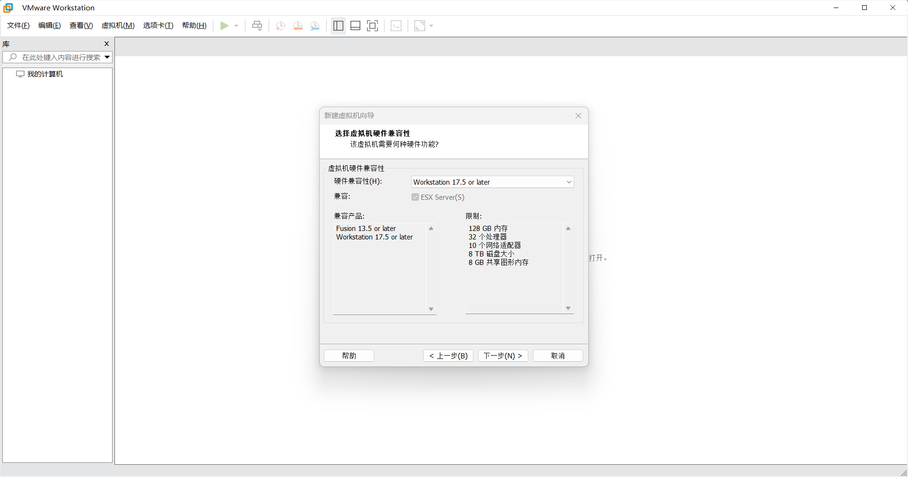


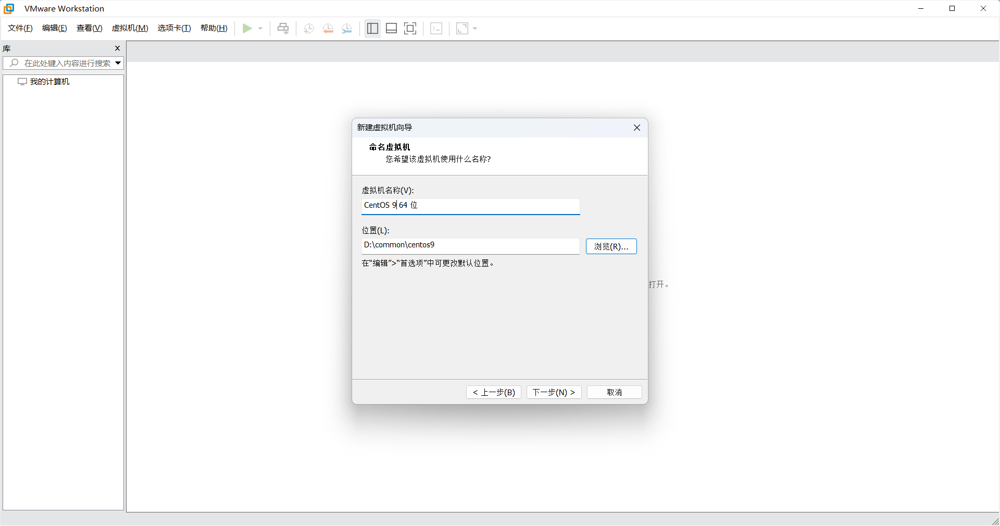


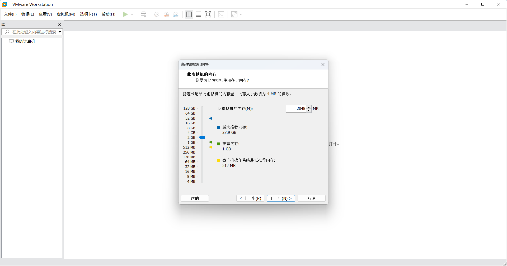

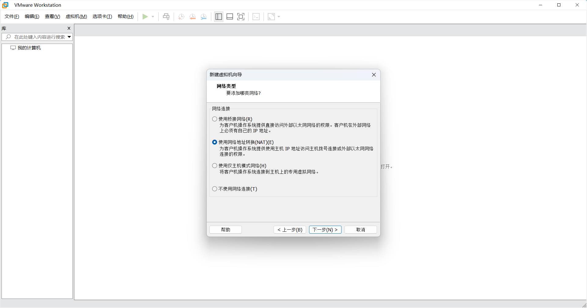

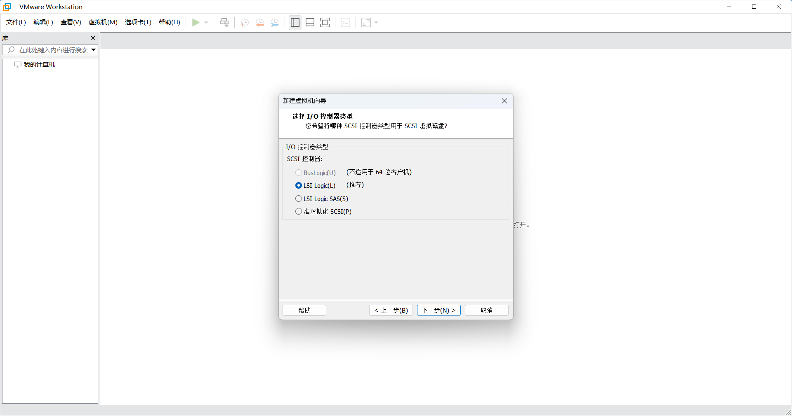

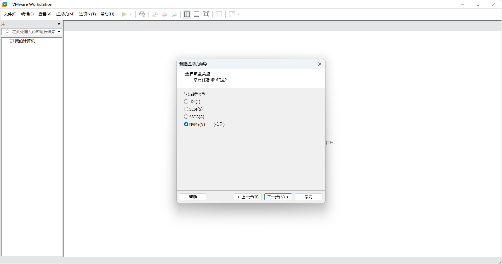

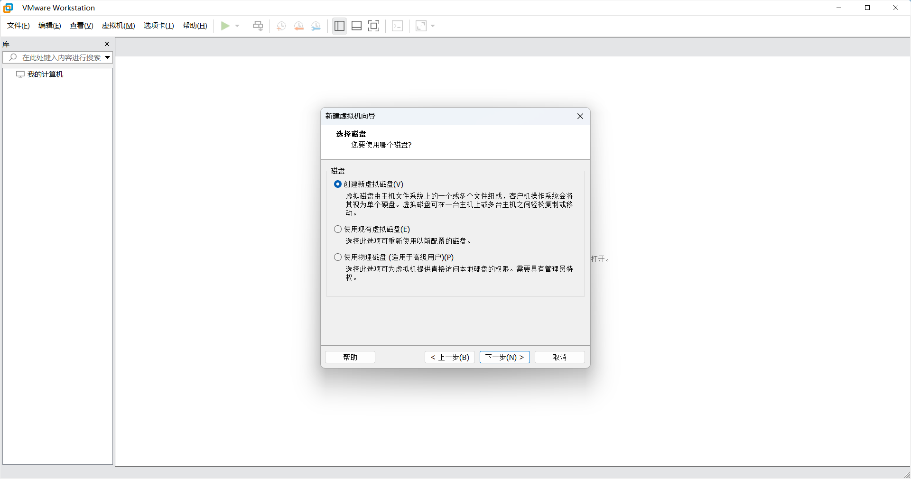


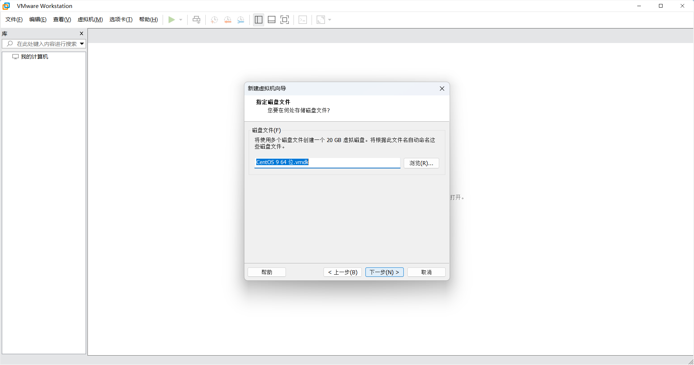


### 4.1.4 安装Centos 9系统

```python
# 1 centos 介绍
CentOS（Community Enterprise Operating System） 是基于 Red Hat Enterprise Linux（RHEL）源代码构建的免费开源操作系统，旨在提供稳定、安全、高性能的企业级计算环境。

CentOS 9 是该系列的最新长期支持（LTS）版本之一（当前最新为 CentOS Stream 9），主要面向服务器、数据中心和云计算场景，适合作为 Web 服务器、数据库服务器、虚拟化平台或容器化部署环境


# 2 CentOS 9 的发布与生命周期
CentOS 9 于 2022 年 5 月随 RHEL 9 发布，但传统的 CentOS Linux 项目已于 2021 年终止，转为 CentOS Stream（RHEL 的上游测试版本）。因此，CentOS 9 通常指 CentOS Stream 9，其定位是为 RHEL 提供预发布的测试功能，更接近滚动更新模式，但仍提供 10 年生命周期支持 至 2032 年 5 月

# 3  适用场景
## 企业服务器：
作为 Web 服务器（如 Nginx/Apache）、数据库服务器（MySQL/PostgreSQL）或邮件服务器，提供高稳定性和长期支持。
##  云计算与虚拟化：
适配 OpenStack、VMware 等云平台，或作为 KVM 宿主机部署虚拟机。
## 容器化与微服务：
结合 Podman、Docker、Kubernetes 构建容器化应用，适合 DevOps 流水线和持续集成 / 部署（CI/CD）。
## 开发与测试环境：
CentOS Stream 9 适合开发人员测试新功能，而 AlmaLinux/Rocky Linux 9 更适合生产环境的稳定需求
```

**iso文件下载**

```python
# 1 官网：https://mirror.stream.centos.org/

# 2 阿里云镜像(速度快)：
https://mirrors.aliyun.com/centos-stream/9-stream/BaseOS/?spm=a2c6h.25603864.0.0.5d6aa361uOWwXy
    
# 3 根据自己电脑架构下载
	-win：一般选x86_64
    -mac: m1,m2芯片选 AArch64
```


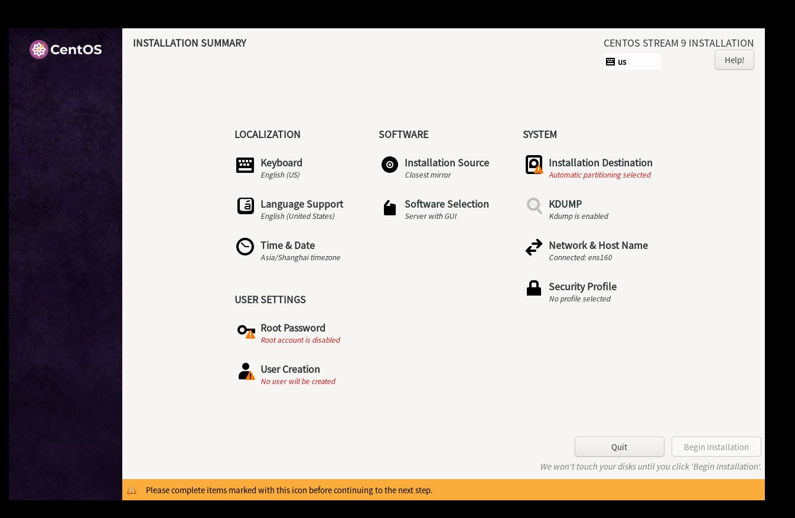


## 4.2 远程链接工具-FinalShell

```python
# 0 介绍
FinalShell 是一款免费的国产一体化服务器、网络管理软件，支持 Windows、macOS、Linux 等多个操作系统。它集成了多种功能，是开发者和运维人员常用的工具之一

# 1 官网下载，根据自己电脑平台
https://www.hostbuf.com/t/988.html
    
# 2 安装

# 3 双击打开


# 4 配置远程链接(链接服务器)

# 5 修改主机名
vi /etc/hostname
reboot


# 7 永久关闭防火墙
systemctl stop firewalld
systemctl disable firewalld


#8  开启root用户远程登录
vi /etc/ssh/sshd_config

PasswordAuthentication yes  # 启用密码认证
PermitRootLogin yes         # 允许 root 用户通过密码登录

# 9 安装必要软件
yum install wget lrzsz unzip git -y

# 10 清除缓存
sudo dnf clean all  # 清除缓存
sudo dnf makecache  # 生成新缓存
```

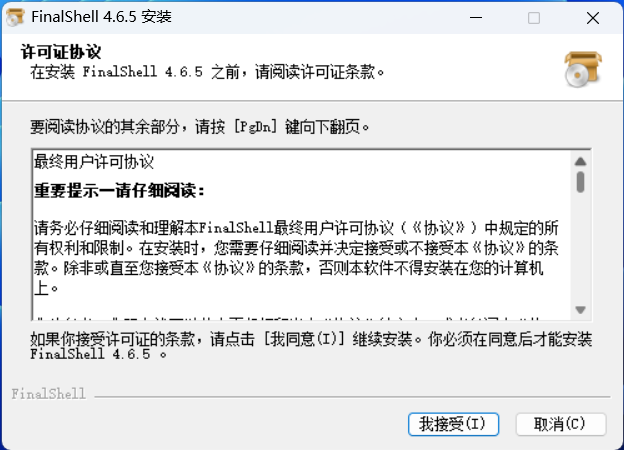

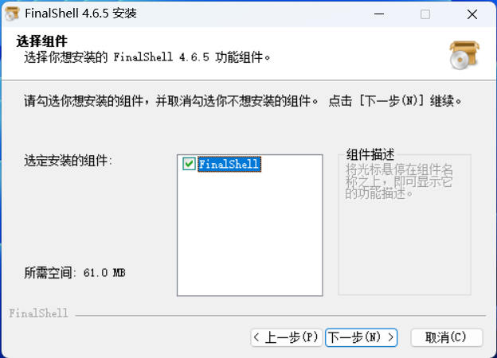


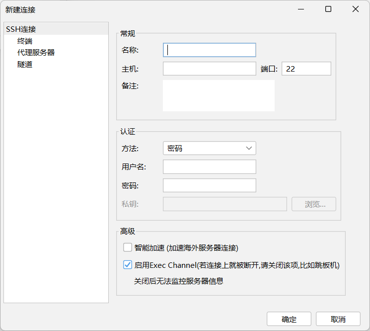


## 4.3 Docker安装和常用命令

```python
# 1 下载阿里云镜像仓库
curl -o /etc/yum.repos.d/docker-ce.repo http://mirrors.aliyun.com/docker-ce/linux/centos/docker-ce.repo
    
#2 更新缓存   
yum makecache 

# 3 安装
yum -y install docker-ce

# 4 查看版本
docker --version

# 5 启动docker
systemctl status docker
systemctl start docker


# 6 配置国内镜像
镜像--》从远程下载下来的---》hub.docker.com -->仓库下的
	-有非常多镜：可以搜索，搜到以后，镜像有不同版本
    -目前：访问不到了，拉去不下来
    -配置：国内镜像站：阿里云(不能用了)
    -https://cr.console.aliyun.com/cn-shanghai/instances/mirrors
    sudo mkdir -p /etc/docker # 如果有，就不需要创建了
    vi /etc/docker/daemon.json 
    # 加入
{
  "registry-mirrors" : ["https://docker.registry.cyou",
"https://docker-cf.registry.cyou",
"https://dockercf.jsdelivr.fyi",
"https://docker.jsdelivr.fyi",
"https://dockertest.jsdelivr.fyi",
"https://mirror.aliyuncs.com",
"https://dockerproxy.com",
"https://mirror.baidubce.com",
"https://docker.m.daocloud.io",
"https://docker.nju.edu.cn",
"https://docker.mirrors.sjtug.sjtu.edu.cn",
"https://docker.mirrors.ustc.edu.cn",
"https://mirror.iscas.ac.cn",
"https://docker.rainbond.cc",
"https://do.nark.eu.org",
"https://dc.j8.work",
"https://dockerproxy.com",
"https://gst6rzl9.mirror.aliyuncs.com",
"https://registry.docker-cn.com",
"http://hub-mirror.c.163.com",
"http://mirrors.ustc.edu.cn/",
"https://mirrors.tuna.tsinghua.edu.cn/",
"http://mirrors.sohu.com/" 
],
 "insecure-registries" : [
    "registry.docker-cn.com",
    "docker.mirrors.ustc.edu.cn"
    ],
"debug": true,
"experimental": false
}
    
    # 按 esc
    # 输入  :wq  敲回车


    # 保存退出重启
    systemctl daemon-reload   # 重新加载docker配置
    systemctl restart docker  # 重启docker
    
# 7 常用命令
docker run 	xx           # 运行一个测试容器，验证 Docker 是否安装成功。
docker pull redis	     # 从 Docker Hub 拉取 redis 镜像。
docker images	         # 查看本地已有的镜像。
docker ps	             # 查看正在运行的容器。
docker stop [容器ID]      # 停止容器。
docker rm [容器ID]        # 删除容器（需先停止容器）。
docker build -t myapp .	 # 根据当前目录的 Dockerfile 构建名为 myapp 的镜像。
```


## 4.4 Docker-compose安装和常用命令

```python
# 1 安装方式一（因为是从github下载，如不能翻墙，速度非常慢）：
## 1.1 下载
sudo curl -SL "https://github.com/docker/compose/releases/download/v2.36.1/docker-compose-$(uname -s)-$(uname -m)" -o /usr/local/bin/docker-compose
## 1.2 授予执行权限
chmod +x /usr/local/bin/docker-compose


# 3 安装方式二，本地下载完后，上传到服务器
## 3.1 下载地址（选择自己机器架构的版本）

## 3.2 上传到服务器

## 3.3 移动到位置，授权
mv docker-compose-linux-x86_64 /usr/local/bin/docker-compose
chmod +x /usr/local/bin/docker-compose 
    
    
    
    wget https://github.com/langgenius/dify/archive/refs/tags/1.4.0.zip
        
        
    git clone https://github.com/langgenius/dify.git --branch 1.4.1
```


## 4.5 Dify1.4.0下载安装

```python
#1 版本介绍：
	- 最新1.4.1 我们用1.4.0
    - 市面绝大部分资料都是基于 0.x讲
# 2 下载1.4.0版本源码包（三种方式）：
##### 方式一： 在centos服务器上直接下载源码（因为从github下载，不翻墙，速度慢，会失败）
git clone https://github.com/langgenius/dify.git --branch 1.4.1 
    
##### 方式二：直接下载压缩包：因为从github下载，不翻墙，速度慢，会失败）
wget https://github.com/langgenius/dify/archive/refs/tags/1.4.0.zip
    
##### 方式三：本地下载上传
1 地址：https://github.com/langgenius/dify/releases
2 选择我们需要的版本：我下载的zip（下zip或tar.gz 都可以，只是解压方式不同）
	-同学们可以不用下，课程软件资料中有
3 上传到服务器
4 解压
unzip dify-1.4.0.zip

# 3 启动Dify(一定进入到docker目录)
cd dify/docker
cp .env.example .env
docker-compose up -d （需要等好久，因为需要下载镜像）
docker-compose ps

# 4 浏览器访问：
http://192.168.23.128/
    
    
# 5 输入管理员账号登录即可
```


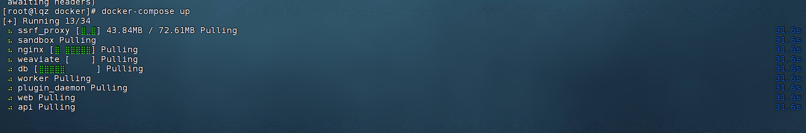


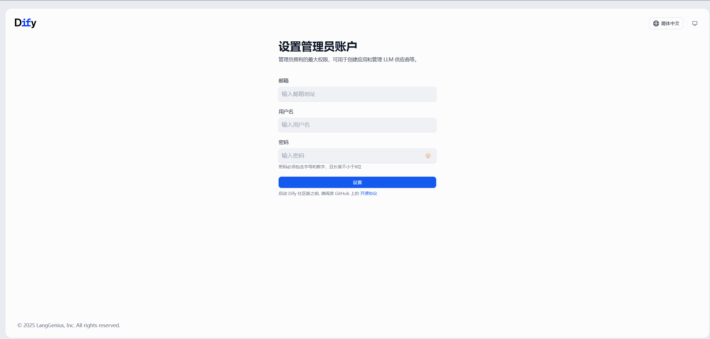

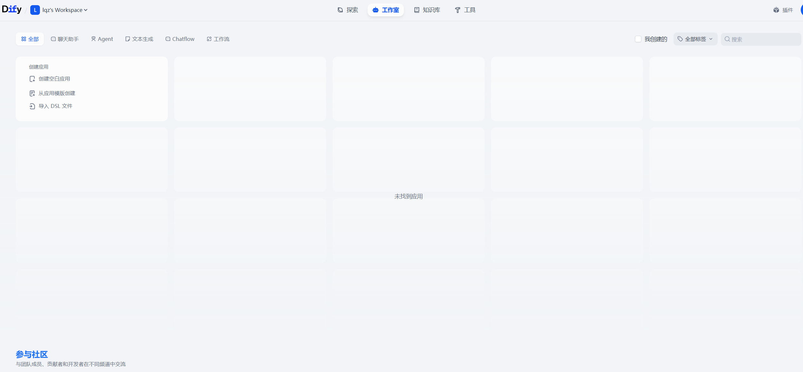


# 5 Dify接入火山方舟

```python
# 1 dify 支持多个LLM提供商，我们以字节的火山方舟为例，同学们可以自行测试 通义千问，deepseek等等

# 2 注册火山方舟账号，来到控制台
https://console.volcengine.com/ark/region:ark+cn-beijing/overview?briefPage=0&briefType=introduce&type=new
        
# 3 开通模型（收费）
https://console.volcengine.com/ark/region:ark+cn-beijing/openManagement?LLM=%7B%7D&OpenTokenDrawer=false
        
# 4 创建aipkey

# 5 选择在线推理--自定义推理接入

# 6 在dify中 接入（先安装-再接入）

# 7 测试编排
```


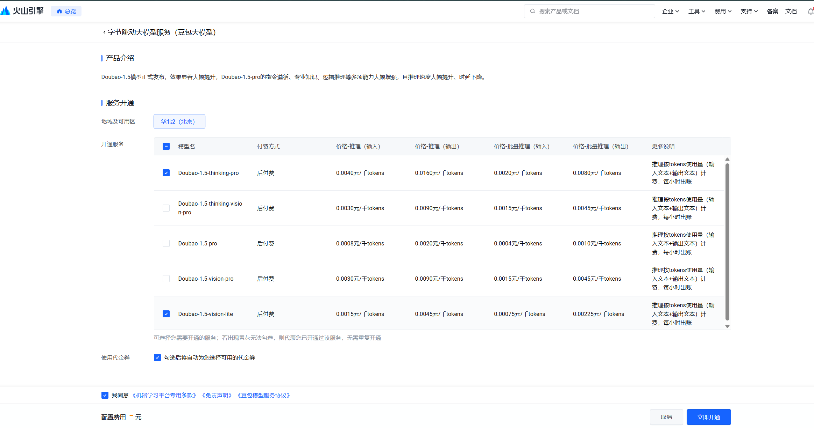


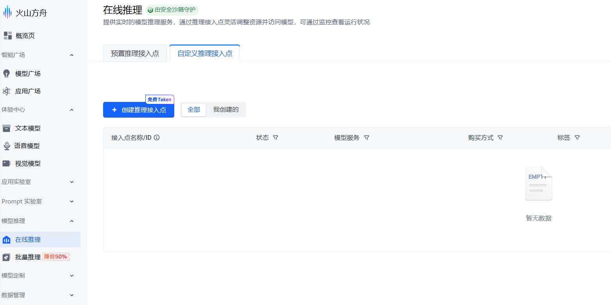


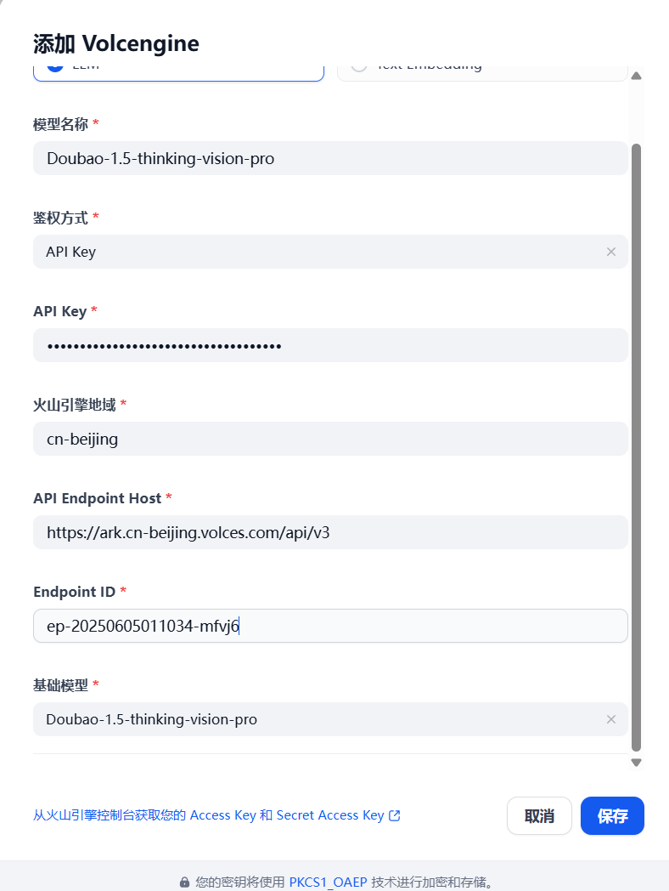


# 6 接入本地deepseek

```python
# 1 使用第三方模型提供商，需要花钱，后续会越来越贵，如果自己有服务器，能跑模型，可以本地部署，接入自己模型，更可控，可二开

# 2 我们使用ollama来本地的部署deepseek，使用Dify接入我们本地模型
	-ollama 官方地址：https://ollama.com
        
# 3 Ollama 是一个开源的大型语言模型服务工具，旨在让用户能够在本地轻松地运行和管理大型语言模型
'''
3.1 开源免费：Ollama 及其支持的模型完全开源且免费，用户可以随时访问和使用这些资源，无需支付任何费用。

3.1 简单易用：无需复杂的配置和安装过程，只需几条简单的命令即可启动和运行，为用户节省了大量时间和精力。

3.1 支持多平台：提供了多种安装方式，支持 Mac、Linux 和 Windows 平台，并提供 Docker 镜像，满足不同用户的需求。

3.4 模型丰富：支持包括 Llama3.1、Gemma2、Qwen2 在内的众多热门开源 LLM，用户可以轻松一键下载和切换模型，享受丰富的选择。

3.5 功能齐全：将模型权重、配置和数据捆绑成一个包，定义为 Modelfile，使得模型管理更加简便和高效。

3.6  支持工具调用：支持使用 Llama 3.1 等模型进行工具调用，使模型能够使用它所知道的工具来响应给定的提示，从而执行更复杂的任务。
3.7 资源占用低：优化了设置和配置细节，包括 GPU 使用情况，从而提高了模型运行的效率，确保在资源有限的环境下也能顺畅运行。

3.8  隐私保护：所有数据处理都在本地机器上完成，能保护用户的隐私。

3.9 社区活跃：拥有一个庞大且活跃的社区，用户可以轻松获取帮助、分享经验，并积极参与到模型的开发和改进中，共同推动项目的发展

'''

# 4 下载安装 ollama（三两种方式） https://github.com/ollama/ollama/releases
## 方式一：官方脚本安装（如不能翻墙，速度慢）
curl -fsSL https://ollama.com/install.sh | sh
    
## 方式二：自己服务器下载-找到自己机器平台下载（如不能翻墙，速度慢）
1 下载：
wget https://github.com/ollama/ollama/releases/download/v0.9.0/ollama-linux-arm64.tgz
    
## 方式三：下载到本地-上传到服务器
1 下载：软件中已经提供
2 上传到服务器
3 移动到位置
mv ollama-linux-amd64.tgz /usr/local/bin/ollama1
4 解压
tar -xzvf ollama-linux-amd64.tgz
5 创建软连接
ln -s /usr/local/bin/ollama1/bin/ollama  /usr/local/bin/ollama

6 测试
ollama --version


# 5 制作成linux 服务
vi /etc/systemd/system/ollama.service

[Unit]
Description=Ollama Service
After=network-online.target

[Service]
ExecStart=/usr/local/bin/ollama serve
User=root
Group=root
Restart=always
RestartSec=3
Environment="PATH=$PATH"
Environment="OLLAMA_MODELS=/home/ollama/models"
Environment="OLLAMA_HOST=0.0.0.0:11434"

[Install]
WantedBy=default.target

# 6 启动ollama
# 重新加载服务配置
sudo systemctl daemon-reload
# 开机自启动
sudo systemctl enable ollama
# 立刻启动
sudo systemctl start ollama
# 重启服务
sudo systemctl restart ollama
# 关闭防火墙
systemctl stop firewalld
systemctl disable firewalld

# 7 浏览器访问
http://192.168.23.128:11434/
        
# 8 安装deepseek-r1 【机器性能原因-我们选择最小的蒸馏版】
ollama run deepseek-r1:1.5b
    
# 9 dify中接入本地deepseek
```

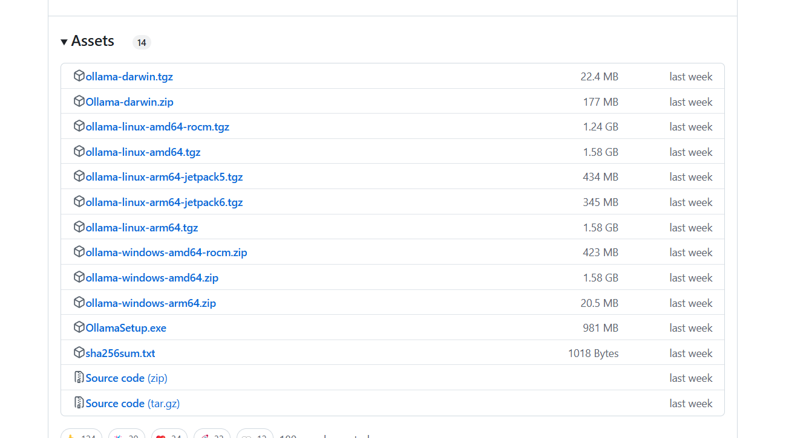


