# 今日内容

# 1 Dify介绍

## 1.1 Dify是什么

```python
Dify 是一款开源的大语言模型(LLM) 应用开发平台。它融合了后端即服务（Backend as Service）和 LLMOps 的理念，使开发者可以快速搭建生产级的生成式 AI 应用。即使你是非技术人员，也能参与到 AI 应用的定义和数据运营过程中。

# 后端既服务Backend as Service：云计算服务模式，旨在帮助开发者快速构建应用程序的后端功能

# LLMOps 是 “大语言模型运维”（Large Language Model Operations）的缩写，指的是在 AI 模型的整个生命周期中加快其开发、部署和运营的专门工作流程和实践

由于 Dify 内置了构建 LLM 应用所需的关键技术栈，包括对数百个模型的支持、直观的 Prompt 编排界面、高质量的 RAG 引擎、稳健的 Agent 框架、灵活的流程编排，并同时提供了一套易用的界面和 API。这为开发者节省了许多重复造轮子的时间，使其可以专注在创新和业务需求上
```


## 1.2 官网-文档

```python
# 1 官网：
https://dify.ai/zh

Dify 一词源自 Define + Modify，意指定义并且持续的改进你的 AI 应用，它是为你而做的（Do it for you）

# 2 云服务：在线体验（速度较慢，有时需要翻墙）--类coze
https://cloud.dify.ai/signin
## 云服务相关介绍：https://docs.dify.ai/zh-hans/getting-started/cloud
    
# 3 文档(好好看)
https://docs.dify.ai/zh-hans/introduction
```


## 1.3 Dify社区版-专业版-教育版

```python
#1. 社区版（免费开源）--在github上免费提供给大家了，源代码提供了
## 1.1 目标用户：个人开发者、学生、小型项目或开源社区。
## 1.2 核心特点
  - 开源免费：基于 Apache 2.0 协议开源，可自由使用、修改和分发。
  - 基础功能：支持基本的 AI 应用开发，如创建简单的聊天机器人、知识问答系统。
  - 有限资源：通常有模型调用次数、并发请求数等限制（如每月 10,000 次 API 调用）。
  - 社区支持：通过 GitHub 社区获取帮助，无官方专属技术支持。
## 1.3 适合场景：学习和探索 Dify 功能、个人项目开发、简单原型验证，公司二次开发


#2. 专业版（付费订阅）
## 2.1 目标用户：企业开发者、商业项目团队、需要高可用性和高级功能的组织。
## 2.2 核心特点
## 2.3 高级功能
    - 企业级 RAG 引擎：支持大规模知识库管理、文档语义化处理（如 PDF/PPT 解析）。
    - 多模态能力：支持图文混合生成、视频分析等复杂任务。
    - LLMOps 监控：提供模型调用成本分析、性能监控和持续优化工具。
    - 工作流编排：可视化设计复杂业务流程，支持多模型协同。
  - 性能提升：更高的并发处理能力、更低的响应延迟、更长的对话上下文支持。
  - 安全与合规：企业级数据安全（如数据加密、审计日志）、单点登录（SSO）。
  - 官方支持：专属技术支持、优先更新和功能定制服务。
## 2.4 适合场景：商业产品开发、企业内部工具集成、需要高性能和稳定性的应用。


# 3. 教育版（免费 / 优惠）
## 3.1 目标用户：高校、科研机构、教师和学生。
## 3.2 核心特点
  - 教育资源
    - 免费或低价使用：通常提供一定额度的免费资源或学生优惠价格。
    - 教学支持：配套教学文档、课程案例和实验环境。
  -功能限制：介于社区版和专业版之间，可能包含部分专业版功能（如简化的 RAG 引擎），但资源配额较低（如模型调用次数）。
  - 学术用途：仅限非商业的教学、研究和学术项目使用。
## 3.3 适合场景：高校教学、学术研究、学生竞赛和毕业设计。


### 如何选择
- 选社区版：如果是个人学习、开源项目或简单原型开发，且对功能和性能要求不高，公司做二次开发
- 选专业版：如果是企业级应用开发、需要高可用性和高级功能（如 RAG、多模态），且愿意付费获取支持。
- 选教育版：如果是高校或科研机构，用于教学或学术研究，可申请教育版获取免费或低成本资源
```

## 1.4 Dify 云服务使用

```python
# 1 云服务：在线体验（速度较慢，有时需要翻墙）
https://cloud.dify.ai/signin
## 云服务相关介绍：https://docs.dify.ai/zh-hans/getting-started/cloud
```

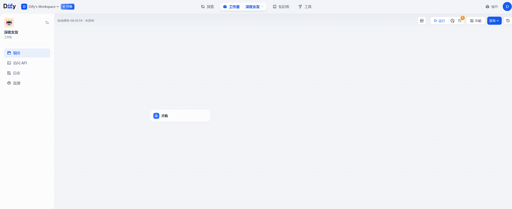

# 2 Dify开发环境介绍

## 2.1 最低机器要求

```python
# 1 在安装 Dify 之前，请确保您的设备符合以下最低系统要求：
CPU >= 2 Core
RAM >= 4 GiB


# 2 操作系统平台：可以是win，mac，linux：centos，乌班图。。。
```


## 2.2 Docker,Docker-compose 介绍

>Docker----Docker-compose --->dify官方要求---》部署dify要使用的软件
>
>如果使用这俩软件，部署dify，难度极大：
>
>​	各种服务：web，数据库服务，redis服务，向量数据库，代理服务，dify内核，dify扩展
>
>使用他俩，可以极大的简化dify的搭建成本，做到一键搭建

### 2.2.1 Docker 介绍

```python
#### 1  Docker 是什么？   用户 部署 应用的软件
Docker 是一款开源的 容器化平台，用于快速开发、部署和运行应用程序。它将应用程序及其依赖（如代码、运行环境、库、配置文件等）打包成一个轻量级、可移植的 容器（Container），使应用程序能够在不同的环境（如开发、测试、生产环境）中 无缝运行，解决了 “环境不一致” 的问题。


假设你公司开发了一个软件(淘宝)---》部署在服务器--》给用户使用
服务器种类：win服务器，centos，乌班图。。。
借助于docker---》把我们开发的软件做成docker容器--》容器可以无缝运行在  win服务器，centos，乌班图  平台上

类虚拟机---》比虚拟机轻量级特别多
	-做到了虚拟机的隔离性
    -并且有很好的性能
虚拟机是操作系统级别隔离---》docker是进程间隔离


#### 2 Docker核心概念
# 镜像（Image）
镜像相当于容器的 “模板”，包含了运行应用所需的一切资源（代码、依赖、系统工具、环境变量等）。
镜像可以通过 Dockerfile（一种文本文件，定义镜像构建步骤）自定义构建，也可以从公共仓库（如 Docker Hub）拉取现成的镜像。
虚拟机要装操作系统---》一个操作系统 xx.iso 文件---》可以装在多个虚拟机上成了多个操作系统
镜像 类似于xx.iso---》一堆文件---》可以运行成多个容器

# 容器（Container）
容器是镜像的 “运行实例”，可理解为轻量级的沙盒环境----》认为它是一个虚拟机中的操作系统

多个容器共享宿主机的内核，但彼此隔离，互不影响，保证了应用的安全性和稳定性。

# 仓库（Repository）
用于存储和分发镜像的服务器，分为 公共仓库（如 Docker Hub）和 私有仓库（企业自建，用于内部镜像管理）。


# 听不懂的：建议：大家去学下docker---》下一期会加
只需要知道docker中有三个东西：镜像，容器，仓库


#### 3 为什么需要 Docker？
# 3.1 环境一致性
传统部署问题：开发环境是 macOS，测试环境是 Linux，生产环境是云服务器，依赖版本不一致导致 “在我电脑上能跑，上线就报错”。
Docker 解决方案：将应用和依赖打包成镜像，无论部署到哪里，环境都完全一致。
# 3.2 轻量级与资源高效
传统虚拟机（VM）：需要模拟完整的操作系统，占用大量内存和磁盘空间（通常几十 GB）。
Docker 容器：共享宿主机内核，仅包含应用和依赖，体积可小至几十 MB，启动速度毫秒级。
# 3.3 开发、测试、部署流程标准化
开发人员用 Docker 构建镜像，测试人员直接在容器中验证，运维人员一键部署到生产环境，流程统一且可复用。
#3.4 弹性扩展与微服务架构
容器可快速复制（如启动 100 个相同容器），配合 Kubernetes 等工具实现自动化扩缩容，非常适合微服务架构。


#### 4 Docker 常用命令示例（部署dify会用到这些命令）
docker run 	xx           # 运行一个测试容器，验证 Docker 是否安装成功。
docker pull redis	     # 从 Docker Hub 拉取 redis 镜像。
docker images	         # 查看本地已有的镜像。
docker ps	             # 查看正在运行的容器。
docker stop [容器ID]      # 停止容器。
docker rm [容器ID]        # 删除容器（需先停止容器）。
docker build -t myapp .	 # 根据当前目录的 Dockerfile 构建名为 myapp 的镜像。


#### 5 总结
Docker 通过容器化技术，让应用程序的部署和运行变得像 “搭积木” 一样简单，极大提升了开发和运维效率。无论是个人开发者、中小型企业还是大型互联网公司（如 字节、京东、亚马逊），都在广泛使用 Docker 构建高效的技术架构

# 总结：
	dify：是使用编程语言开发出来的一个软件，它有执行代码代码，有存数据，有放文件  有前端 各种功能
    每个功能做成了一个服务，如果我们之间部署dify，需要每个服务都要部署，而且他们有关联，非常麻烦
    使用docker，docker-compose后，我们这么多服务，可以使用一条命令部署完成，他们自动就关联在一起了
    
    我们就可以执行使用户dify了
    
    
    
# dify使用什么语言开发的
	-api服务：通过 postman 调用--》接口---》用go写的
    -模型的调用服务：使用python写的
    -前端：nodejs
```

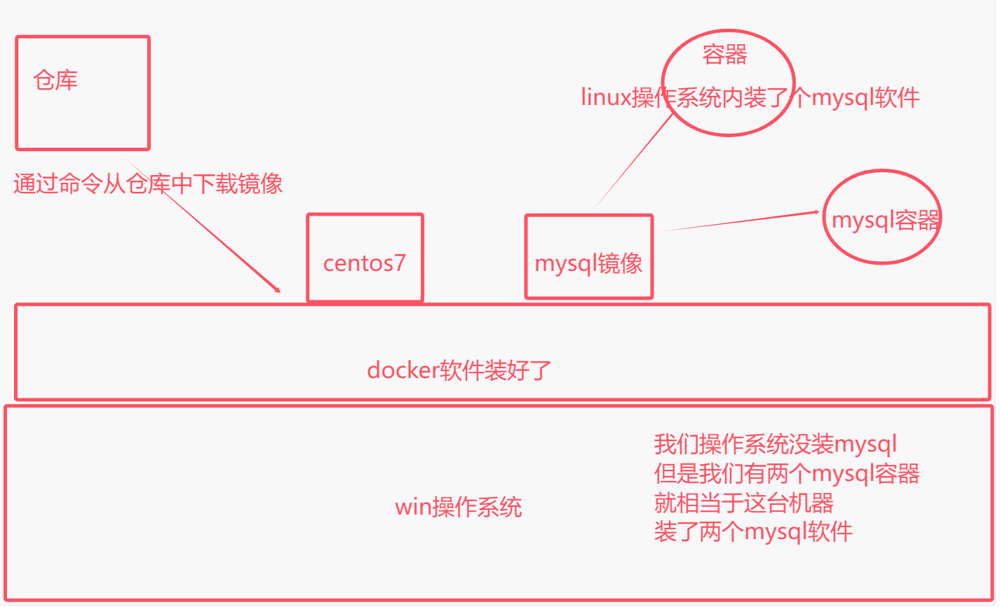


### 2.2.2 Docker-compose介绍-简单了解

```python
#1  docker 是一个个容器
	dify 为例：数据库容器，web服务容器，api接口容器，正常来讲需要一个个的管理，容器多了就比较麻烦
    
#2  docker-compose 官方出的
	用来在单机上管理多个容器
    
    
#3 发展：
	-原来
    	部署dify--》需要部署   web服务    api接口服务  数据库服务  
    -有了docker后
    	部署dify--》需要部署   web服务容器    api接口服务容器   数据库服务容器
	-有了docker-compose后
    	批量的来管理上面的多个容器，一键启动，一键停止
        
    -所有服务都正常运行，dify 就正常运行了，有一个服务不能正常运行，dify就跑不起来
    

 
# 4 总结：
	docker 做容器化--》把一个个服务 包到一个包裹中--》这个包裹拿到任意平台都能运行
    	-环境统一，资源隔离
    docker-compose 如果容器多了，不好管理，一个个启动，一个个停止太麻烦---》统一管理多个容器的软件
    	-两条命令记住（不是dify的命令）
    
# docker compose重启后，数据会丢失吗？之前操作的东西还在吗？
	取决于我们
```

```python
#### 1 Docker Compose介绍
Docker Compose 是 Docker 官方推出的一个工具，用于定义和运行 多容器 Docker 应用。通过一个配置文件（docker-compose.yml），你可以一次性定义多个容器及其依赖关系、网络配置和环境变量，然后使用一条命令（docker-compose up）启动所有服务，大大简化了分布式应用的部署流程

### 2 核心概念
# 服务（Service）
一个服务对应一个容器定义，例如一个 Web 应用、一个数据库或一个缓存服务。每个服务可以定义镜像、端口映射、环境变量等。
# 项目（Project）
由多个服务组成的一个完整应用，通过 docker-compose.yml 文件统一管理。

#### 3 为什么需要 Docker Compose？
# 想象一个典型的 Web 应用：

前端服务（如 Nginx）
后端 API（如 Python Flask）
数据库（如 MySQL）
缓存（如 Redis）

如果用原生 Docker 命令部署，需要手动启动每个容器，并配置它们之间的网络连接，非常繁琐。而 Docker Compose 可以通过一个配置文件一键启动所有服务，自动处理网络和依赖关系

#### 4 Docker Compose 工作流程
1 编写 docker-compose.yml 文件
 定义所有服务的配置（镜像、端口、挂载卷等）。
2 执行 docker-compose up 命令
 Compose 会根据配置文件创建并启动所有容器。
3 执行 docker-compose down 命令
 一键停止并删除所有容器、网络和卷
    
### 5 常用命令
docker-compose up	                 # 创建并启动所有服务（加 -d 后台运行）
docker-compose down	                 # 停止并删除容器、网络和卷
docker-compose ps	                 # 查看服务状态
docker-compose logs	                 # 查看服务日志
docker-compose build	             # 构建或重新构建服务镜像
docker-compose exec [服务名] [命令]	# 在运行的容器中执行命令（如 exec web bash）

### 6 适用场景
# 本地开发环境：快速搭建包含多个服务的开发环境。
# 测试环境：自动化部署测试所需的所有服务。
# 小型生产环境：在单台服务器上部署简单的微服务应用。
# CI/CD 流水线：在持续集成 / 部署流程中自动化测试和部署。

#### 7 与 Kubernetes 的对比
# 特性	           # Docker Compose	          # Kubernetes
复杂度	               简单（单主机）	             复杂（分布式集群）
扩展性	               有限	                    强大（支持自动扩缩容）
适用场景	          开发、测试、小型应用	      大规模生产环境
编排能力	          基本编排	                  高级编排（服务发现、负载均衡、自愈）


### 8 总结
Docker Compose 是 Docker 生态中不可或缺的工具，特别适合快速搭建和管理多容器应用。它通过配置文件将复杂的部署流程标准化，大大提高了开发和运维效率。如果你经常需要同时运行多个相关服务（如前后端分离应用、微服务架构），Docker Compose 会是你的得力助手
```


>在各种系统里装好docer 就可以跨系统运行

## 2.3 官方提供的安装方式

```python
# 1 地址：
https://docs.dify.ai/zh-hans/getting-started/install-self-hosted/readme

# 2 Docker Compose 部署（最简单）---》企业中也是这样用
	-极为简单：一条命令就跑起来
    	-但是它需要你会点docker和docker-compose
        -如果你完全不会，出了问题，解决不了

# 3 使用源代码本地启动
	-教我们一个个的服务去部署：api服务，数据库服务，大模型服务。。。
	-服务也要容器化，需要用docker
    
# 4 宝塔面板部署（运维的人）--》不需要掌握
	-宝塔软件就是使用python开发的一个自动化运维工具

# 5 单独启动前端 Docker 容器
	我们做二次开发--》一般是改后端的功能--》后端你改完自己部署

	当单独开发后端时，可能只需要源码启动后端服务，而不需要本地构建前端代码并启动，因此可以直接通过拉取 docker 镜像并启动容器的方式来启动前端服务
```


# 3 本地搭建dify介绍-个人测试（mac,win）

```python
# 1 dify 可以搭建在 mac，win，linux上
	-个人测着玩：mac，win
    -企业中，专业人员：部署在linux上，服务器上--》公司自己服务器或购买的云服务器
    
    
###### win 或 mac 上搭建 dify ######
# 0 WSL
Windows Subsystem for Linux（简称WSL）是一个在Windows 10\11上能够运行原生Linux二进制可执行文件（ELF格式）的兼容层。它是由微软与Canonical公司合作开发，开发人员可以在 Windows 计算机上同时访问 Windows 和 Linux 的强大功能。 通过适用于 Linux 的 Windows 子系统 (WSL)，开发人员可以安装 Linux 发行版（例如 Ubuntu、OpenSUSE、Kali、Debian、Arch Linux 等），并直接在 Windows 上使用 Linux 应用程序、实用程序和 Bash 命令行工具，不用进行任何修改，也无需承担传统虚拟机或双启动设置的费用
	-win10、win11自带
    -操作系统不是专业版，是家庭版----》WSL 不完整
    
# 0 执行这个软件： 双击运行即可 wsl_update_x64.msi


###  docker官方出了个 docker-destop 这个软件
	-包含了：docker，docker-compose，桌面的图形化。。。
	-有了它，我们可以图形化的操作 docker的容器，镜像，仓库，配置文件。。。
    -一般用在win或mac上
    -一般不用再服务器上，因为服务器不会有图形化界面
    
#1  win或mac 机器-直接docker官方下载docker-destop
	-安装docker-destop：它已经将 Docker Compose 集成在内，还有图形化界面
		-https://docs.docker.com/get-started/get-docker/ （如果打不开，需要翻墙）-钞能力
            
# 2 双击安装

# 3 重启机器后，进入，不注册登录也可以使用


# 5 下载dify源码---》我下好了-->解压到不带中文的目录下

# 4 进入到dify目录，使用命令启动dify即可
1 来到目录下：D:\DockerProject\dify-1.4.0\dify-1.4.0\docker
2 把.env.example 复制---》改名成   .env 


docker compose up # 卡住了，动不了了


# 5 改国内镜像站
	-下载的容器---》去hub 仓库下的--》国内访问不了
    -之前阿里云就会搭建镜像站---》把hub仓库中所有文件复制一份，放到阿里云的机器上了--》国内访问就非常快
    	-清华源
        -阿里云
        -网易
    -但是国家政策原因--》也用不了了
    
    -小的---》网上搜的--》不一定全能用--》用了非常多
	-settings---》engine--》配置放上
    
    
{
  "builder": {
    "gc": {
      "defaultKeepStorage": "20GB",
      "enabled": true
    }
  },
  "debug": true,
  "experimental": false,
  "insecure-registries": [
    "registry.docker-cn.com",
    "docker.mirrors.ustc.edu.cn"
  ],
  "registry-mirrors": [
    "https://docker.registry.cyou",
    "https://docker-cf.registry.cyou",
    "https://dockercf.jsdelivr.fyi",
    "https://docker.jsdelivr.fyi",
    "https://dockertest.jsdelivr.fyi",
    "https://mirror.aliyuncs.com",
    "https://dockerproxy.com",
    "https://mirror.baidubce.com",
    "https://docker.m.daocloud.io",
    "https://docker.nju.edu.cn",
    "https://docker.mirrors.sjtug.sjtu.edu.cn",
    "https://docker.mirrors.ustc.edu.cn",
    "https://mirror.iscas.ac.cn",
    "https://docker.rainbond.cc",
    "https://do.nark.eu.org",
    "https://dc.j8.work",
    "https://dockerproxy.com",
    "https://gst6rzl9.mirror.aliyuncs.com",
    "https://registry.docker-cn.com",
    "http://hub-mirror.c.163.com",
    "http://mirrors.ustc.edu.cn/",
    "https://mirrors.tuna.tsinghua.edu.cn/",
    "http://mirrors.sohu.com/"
  ]
}
    
    
    
# 5 访问浏览器
http://localhost
    
    
    
  

    

    

    
    
########## 补充：什么是linux ######
 win系统：个人
 mac系统：个人，程序员
 linux系统：一般是公司部署项目用，服务器，稳定
    -非常多分支
    	-国产：麒麟，深度：桌面版linux。。。
		-国外的：红帽，debian，乌班图，centos
    -Linux遵循gpl协议--》基于开源的的继续加入我们的功能--》但是也必须开源出来
    	红帽--》基于linux改---》给企业用--》卖给企业，提供服务---》收费
        它必须开源--》开源社区基于红帽开源的--》做成了centos--》免费的--》没有技术支持--》使用率非常高
        debian---》乌班图是debian的开源版本
        
 unix系统：
 安卓：基于unix
 鸿蒙：基于unix
 黑莓系统
 winphone系统
```

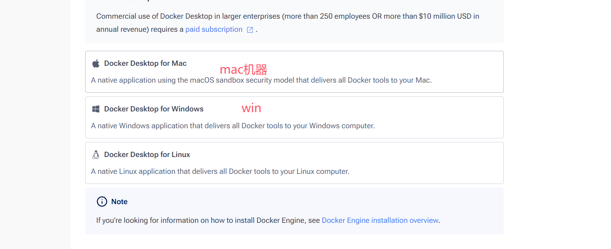


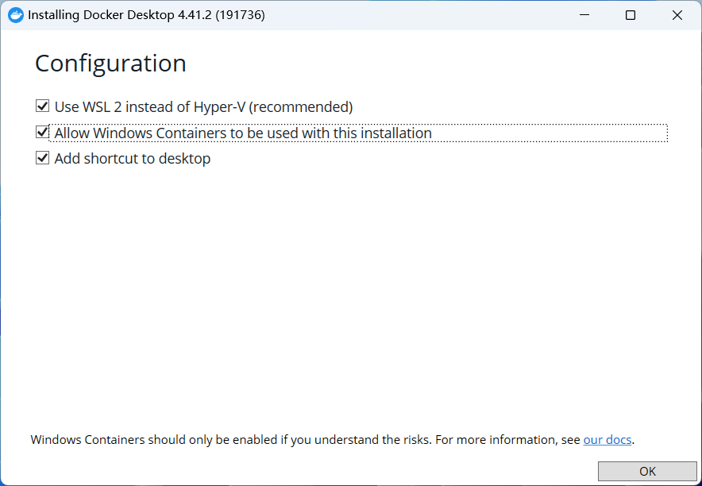

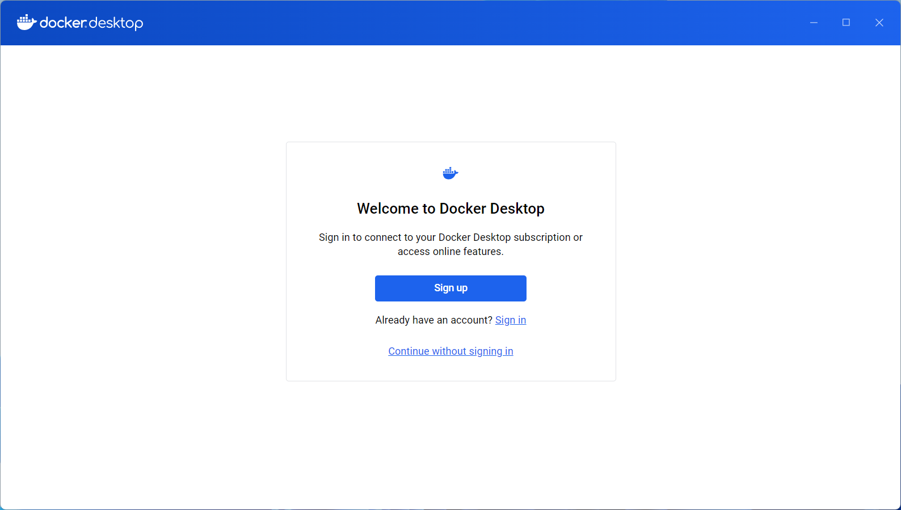

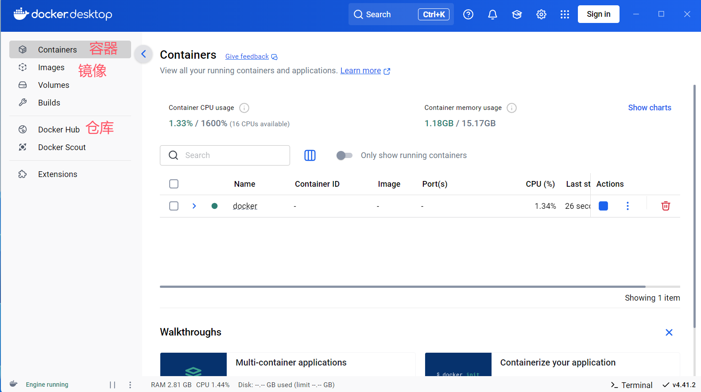

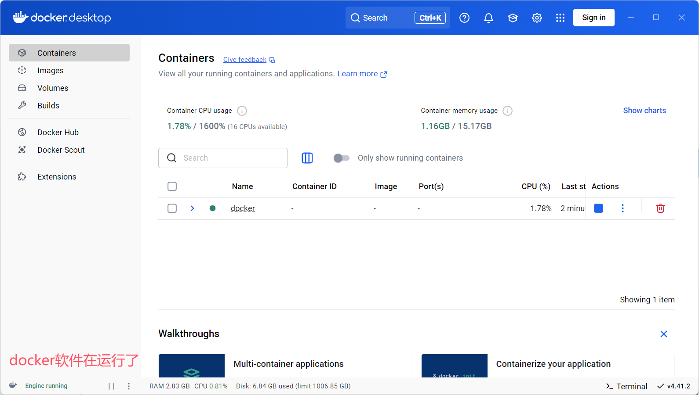

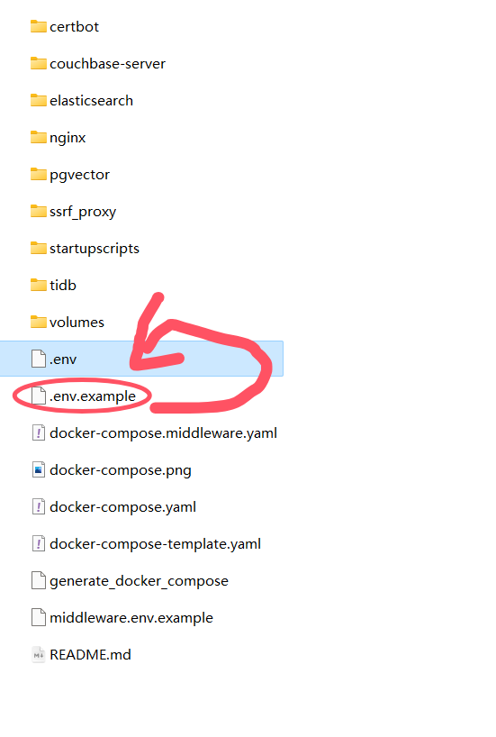

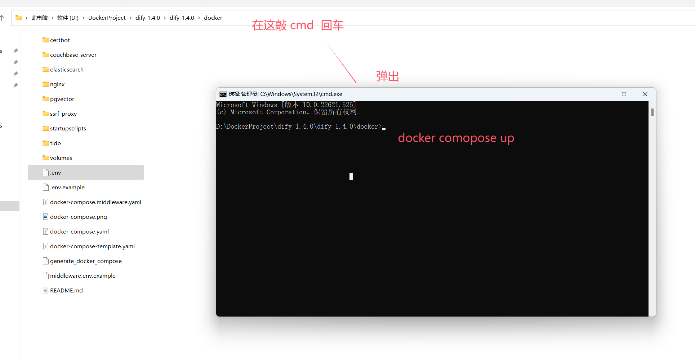


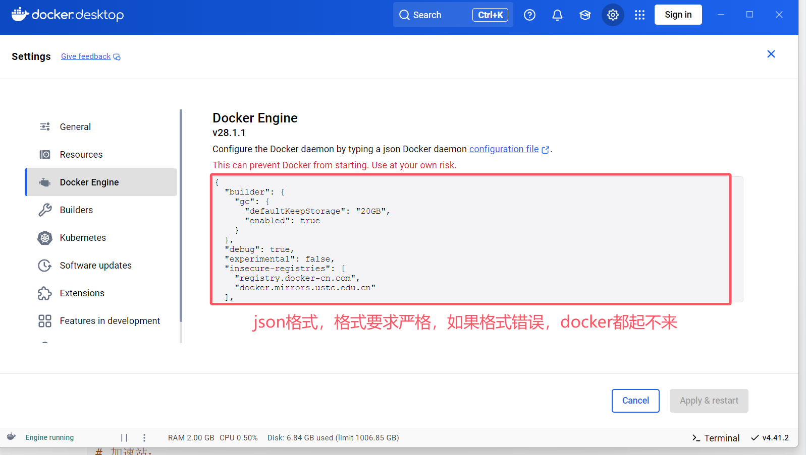


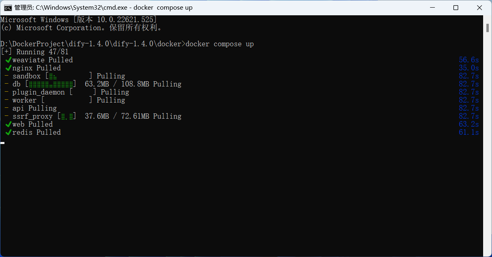


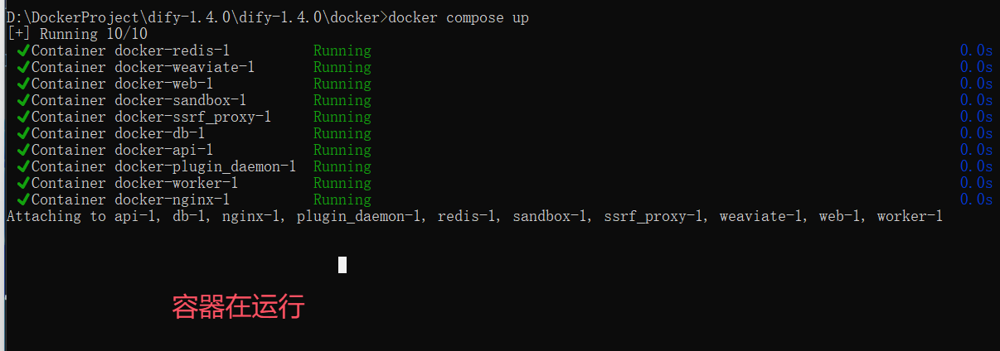


# 补充

```python
#1 llm:大语言模型，deepseek，火山方舟，通义千问，GPT
#2 dify：ai开发工具
	-创建我们自己的智能体，后端既服务-不需要写代码就能创建出智能体软件 ---》coze
    -工作流：需要使用llm帮咱写文章，生成。。。
    -如果是coze：可以使用豆包，deepseek llm大脑
    
    -dify没有这个大脑
    	-外接大脑：使用豆包的api，deepseek。。。。。   花钱买token
        -自己做大脑：本地搭建：deepseek
        
    -dify 接入这个大脑：deepseek
    
    -dify：本地版的coze---》字节xx  dify开发出coze
        
    -本地的大脑就是大模型  LLM，把deepseek部署在本地---》使用GPU运算--》机器性能很好
    	-自己本地训练的，自己可控
        -大模型开发：不讲 开发出一个跟deepseek 同类型的产品，微调
        	阿里，腾讯，字节，deepseek
```


# 作业

```python
1 在自己机器上，按照笔记
	-装好：VMware
    -创建一个操作系统
    -把centos 9安装进操作系统
    
    
```


# 4 企业级-服务搭建-centos,ubuntu,云服务器 

## 4.1 虚拟机安装

### 4.1.1 处理器架构
### 4.1.2 VMware Workstation Pro安装
### 4.1.3 创建虚拟机
### 4.1.4 安装centos9系统

## 4.2 远程链接工具使用

## 4.3 Docker安装和常用命令
## 4.4 docker-compose安装和常用命令
## 4.5 Dify 1.4.0 下载安装

# 5 Dify接入火山方舟

# 6 Dify接入本地deepseek

