```python
# 今日内容

# 1 企业级-Dify服务器搭建
## 1.1 虚拟机安装
### 1.1.1 处理器架构
### 1.1.2 VMware Workstation Pro安装
### 1.1.3  创建虚拟机
### 1.1.4 安装Centos Stream 9
## 1.2 远程链接工具FinalShell使用
## 1.3 Docker安装和常用命令
## 1.4 docker-compose 安装和常用命令
## 1.5 Dify 1.4.0下载和安装
# 2 Dify 接入火山方舟
# 4 Dify接入本地deepseek
## 4.1 win,mac 机器本地安装deepseek
## 4.2 服务器部署deepseek
## 4.3 Dify接入本地部署deepseek大模型

# 5 补充

## 5.1 Hyper-V和WSL2
## 5.2 windows上DockerDestop和vmware冲突
## 5.3 DockerDestop安装在其他盘符
## 5.4 Mac安装虚拟机
```


# 1 企业级-服务器搭建（centos,ubuntu,云服务器）

## 1.1 虚拟机安装

### 1.1.1 处理器架构

```python
# 1 x86_64（代表：Intel/AMD）
## 指令集扩展：支持 SSE、AVX、AVX-512 等向量指令集，擅长单线程高性能计算（如 AI 训练、视频渲染）。
## 多核设计：主流服务器芯片核数通常为 8-64 核（如 AMD EPYC 96 核），依赖超线程（HT）提升并行效率。
## 生态系统：垄断桌面（Windows）和 90% 以上服务器市场，软件兼容性极强（如 Docker、Kubernetes 原生支持）。
##典型场景：个人电脑、数据中心服务器、游戏主机（如 PS5/Xbox 使用定制 AMD APU）。

# 2 AArch64（代表：ARM、华为鲲鹏、Apple M 系列）
## 指令集扩展：支持 NEON（向量运算）、Cryptography Extensions（加密加速），适合移动和边缘计算。
## 多核设计：天生支持大规模多核（如 AWS Graviton3 达 64 核），片上集成 ISP、NPU 等专用单元（如手机 SoC）。
## 生态系统：移动领域绝对主导（安卓 /iOS 应用原生支持），服务器端通过 Rosetta/QEMU 兼容 x86 软件（可能损失性能）。
##典型场景：智能手机（如骁龙 8 Gen3）、云服务器（如阿里云神龙 ARM 实例）、物联网设备（如树莓派 5）。

# 3 PPC64LE（代表：IBM Power、飞腾）
## 指令集扩展：支持 Altivec（向量处理）、Decimal Floating Point（十进制浮点，适合金融计算）。
## 多核设计：对称多处理（SMP）架构，单芯片核数通常 4-16 核（如 IBM Power10 10 核），注重可靠性（如内存纠错 ECC）。
## 生态系统：依赖特定企业级软件（如 IBM AIX、IBM i 操作系统），Linux 支持有限（需单独适配）。
## 典型场景：传统企业服务器（如银行核心系统）、超级计算机（如日本富岳使用富士通 A64FX，基于 ARM 而非 PPC）。

# 4 s390x（代表：IBM Z 系列大型机）
## 指令集扩展：支持 CPACF（压缩 / 解压缩）、 cryptographic instructions（硬件加密），专为交易处理优化。
## 多核设计：大型机架构，单系统可支持数千个逻辑处理器（LPAR），通过逻辑分区实现资源隔离。
## 生态系统：高度封闭，依赖 IBM Z/OS、Z/Linux 等专用操作系统，软件需深度定制（如银行核心交易系统）。
## 典型场景：金融行业核心系统（如信用卡清算）、电信运营商计费平台、高可用性事务处理。
```


### 1.1.2 VMware Workstation Pro安装

```python
# 1 介绍
VMware Workstation 是一款由 VMware 公司开发的功能强大的桌面虚拟计算机软件

支持win和linux，不支持mac

VMware 公司为 Mac 用户开发了专门的虚拟化软件 ——VMware Fusion
Parallels desktop(个人建议)
# mac 破解软件下载：
https://macwk.cn/
https://xclient.info/
https://appstorrent.ru/programs/ # 需要翻墙
    

# 2  特性
## 多系统运行：
用户可以在单一的桌面上同时运行不同的操作系统，如 Windows、DOS、Linux 等，无需重新启动计算机，就能在不同操作系统之间进行切换，便于开发、测试和部署新的应用程序。
## 模拟网络环境：
可在物理机器上模拟完整的网络环境，通过虚拟网卡能将几台虚拟机组成一个局域网，方便进行网络相关的测试和实验。
## 资源隔离与保护：
完全隔离并且保护不同操作系统的操作环境以及所有安装在操作系统上面的应用软件和资料，不同操作系统之间还能进行互动操作，如网络连接、周边设备共享、文件分享以及复制粘贴等。
## 灵活配置：
能够设定并且随时修改操作系统的操作环境，如内存、磁盘空间、周边设备等，还具有复原（Undo）功能，方便用户进行各种测试和实验，不用担心对系统造成不可逆的影响


# 3 安装包在课程软件中提供，如官网下载，需要注册，17.6 之前版本需要收费，需破解

```

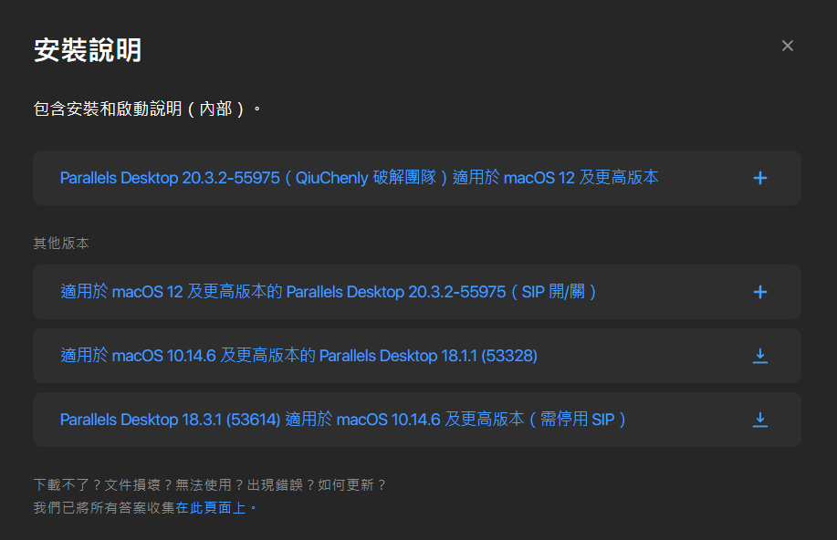

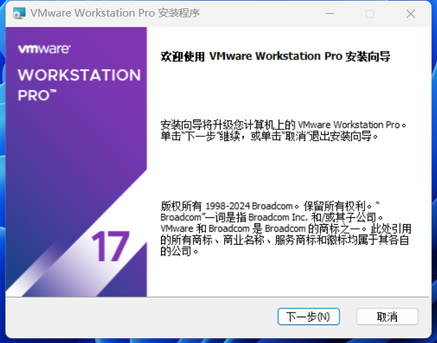

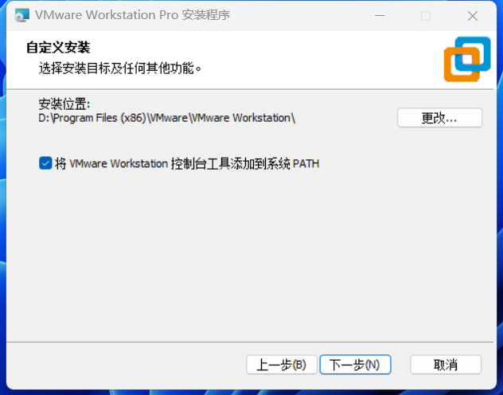


### 1.1.3 创建虚拟机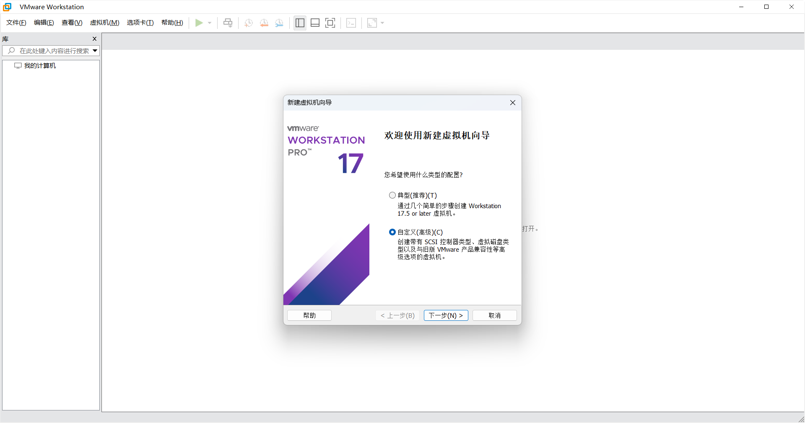


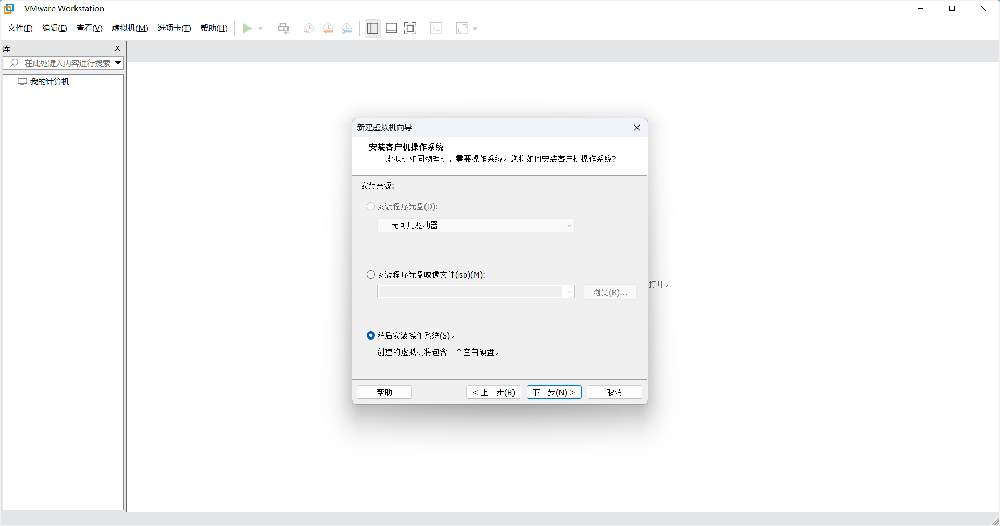

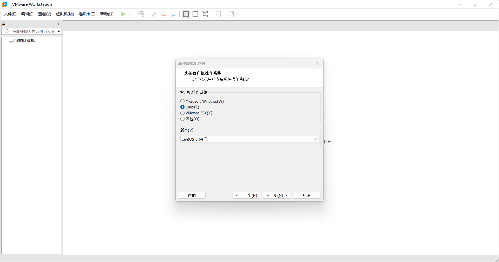


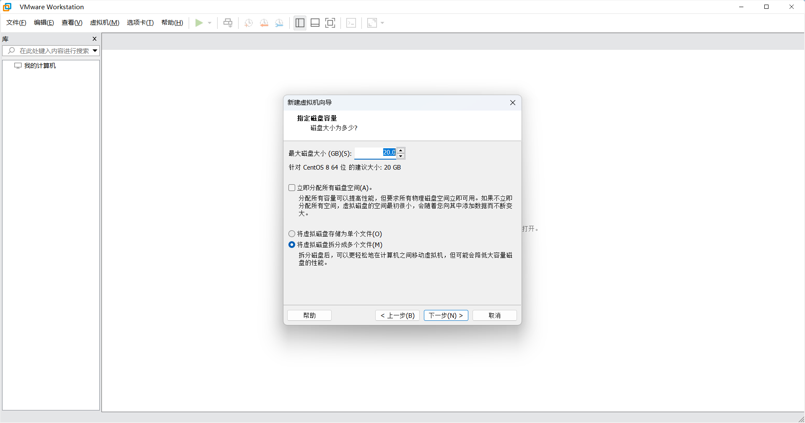


### 1.1.4 安装Centos 9系统

```python
# 1 centos 介绍
CentOS（Community Enterprise Operating System） 是基于 Red Hat Enterprise Linux（RHEL）源代码构建的免费开源操作系统，旨在提供稳定、安全、高性能的企业级计算环境。

CentOS 9 是该系列的最新长期支持（LTS）版本之一（当前最新为 CentOS Stream 9），主要面向服务器、数据中心和云计算场景，适合作为 Web 服务器、数据库服务器、虚拟化平台或容器化部署环境


# 2 CentOS 9 的发布与生命周期
CentOS 9 于 2022 年 5 月随 RHEL 9 发布，但传统的 CentOS Linux 项目已于 2021 年终止，转为 CentOS Stream（RHEL 的上游测试版本）。因此，CentOS 9 通常指 CentOS Stream 9，其定位是为 RHEL 提供预发布的测试功能，更接近滚动更新模式，但仍提供 10 年生命周期支持 至 2032 年 5 月

# 3  适用场景
## 企业服务器：
作为 Web 服务器（如 Nginx/Apache）、数据库服务器（MySQL/PostgreSQL）或邮件服务器，提供高稳定性和长期支持。
##  云计算与虚拟化：
适配 OpenStack、VMware 等云平台，或作为 KVM 宿主机部署虚拟机。
## 容器化与微服务：
结合 Podman、Docker、Kubernetes 构建容器化应用，适合 DevOps 流水线和持续集成 / 部署（CI/CD）。
## 开发与测试环境：
CentOS Stream 9 适合开发人员测试新功能，而 AlmaLinux/Rocky Linux 9 更适合生产环境的稳定需求
```

**iso文件下载**

```python
# 1 官网：https://mirror.stream.centos.org/

# 2 阿里云镜像(速度快)：
https://mirrors.aliyun.com/centos-stream/9-stream/BaseOS/?spm=a2c6h.25603864.0.0.5d6aa361uOWwXy
    
# 3 根据自己电脑架构下载
	-win：一般选x86_64
    -mac: m1,m2芯片选 AArch64
```


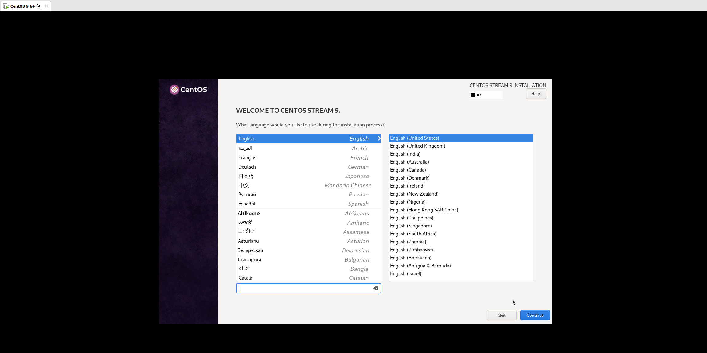


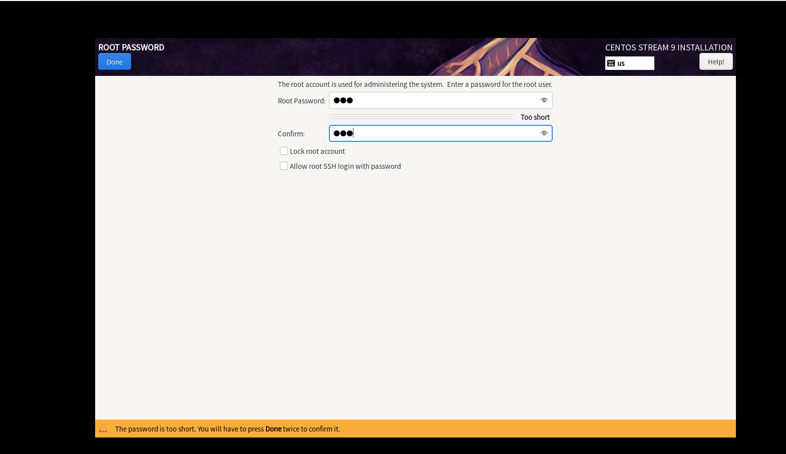


## 1.2 远程链接工具-FinalShell

```python
# 0 介绍
FinalShell 是一款免费的国产一体化服务器、网络管理软件，支持 Windows、macOS、Linux 等多个操作系统。它集成了多种功能，是开发者和运维人员常用的工具之一

# 1 官网下载，根据自己电脑平台
https://www.hostbuf.com/t/988.html
    
# 2 安装

# 3 双击打开


# 4 配置远程链接(链接服务器)

# 5 修改主机名
vi /etc/hostname
reboot


# 7 永久关闭防火墙
systemctl stop firewalld
systemctl disable firewalld


#8  开启root用户远程登录
vi /etc/ssh/sshd_config

PasswordAuthentication yes  # 启用密码认证
PermitRootLogin yes         # 允许 root 用户通过密码登录

systemctl restart sshd

# 9 安装必要软件
yum install wget lrzsz unzip git -y

# 10 清除缓存
sudo dnf clean all  # 清除缓存
sudo dnf makecache  # 生成新缓存
```


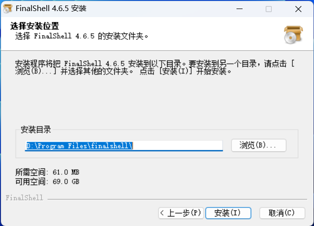


## 1.3 Docker安装和常用命令

```python
# 0  配置阿里云yum 源
sudo curl -o /etc/yum.repos.d/CentOS-Stream-BaseOS.repo https://mirrors.aliyun.com/repo/Centos-Stream-BaseOS-9.repo
sudo curl -o /etc/yum.repos.d/CentOS-Stream-AppStream.repo https://mirrors.aliyun.com/repo/Centos-Stream-AppStream-9.repo
sudo curl -o /etc/yum.repos.d/CentOS-Stream-Extras.repo https://mirrors.aliyun.com/repo/Centos-Stream-Extras-9.repo

###0.1 删除缓存并重建
sudo yum clean all
sudo rm -rf /var/cache/yum
sudo yum makecache


# 1 下载阿里云镜像仓库
##1.1 先卸载：
sudo yum remove docker \
                  docker-client \
                  docker-client-latest \
                  docker-common \
                  docker-latest \
                  docker-latest-logrotate \
                  docker-logrotate \
                  docker-engine
## 1.2 或者
sudo dnf remove docker-ce docker-ce-cli containerd.io 
## 1.2 #### 多种方式###############
###方式一：官方源###
## 配置docker源
sudo yum install -y yum-utils
sudo yum-config-manager --add-repo https://download.docker.com/linux/centos/docker-ce.repo
###安装
sudo yum install docker-ce docker-ce-cli containerd.io docker-buildx-plugin docker-compose-plugin
      
    
###方式二：阿里云仓库###  
curl -o /etc/yum.repos.d/docker-ce.repo http://mirrors.aliyun.com/docker-ce/linux/centos/docker-ce.repo
yum install docker-ce -y

###方式三：阿里云镜像# ## 
yum install -y yum-utils device-mapper-persistent-data lvm2 container-selinux

yum-config-manager --add-repo http://mirrors.aliyun.com/docker-ce/linux/centos/docker-ce.repo
    
yum list docker-ce --showduplicates | sort -r

yum install docker-ce docker-ce-cli containerd.io -y

###方式四：官方源，dnf下载 # ## 
sudo dnf config-manager --add-repo=https://download.docker.com/linux/centos/docker-ce.repo
sudo dnf install docker-ce docker-ce-cli containerd.io docker-compose-plugin -y 

###方式五：官方源，脚本安装 # ## 
curl -sSL https://get.docker.com/ | sh    
#或者
curl -fsSL https://get.docker.com -o get-docker.sh
sh get-docker.sh
#等待安装完成


# 4 查看版本
docker --version

# 5 启动docker
systemctl status docker
systemctl start docker


# 6 配置国内镜像
镜像--》从远程下载下来的---》hub.docker.com -->仓库下的
	-有非常多镜：可以搜索，搜到以后，镜像有不同版本
    -目前：访问不到了，拉去不下来
    -配置：国内镜像站：阿里云(不能用了)
    -https://cr.console.aliyun.com/cn-shanghai/instances/mirrors
    sudo mkdir -p /etc/docker # 如果有，就不需要创建了
    vi /etc/docker/daemon.json 
    # 加入
{
  "registry-mirrors" : ["https://docker.registry.cyou",
"https://docker-cf.registry.cyou",
"https://dockercf.jsdelivr.fyi",
"https://docker.jsdelivr.fyi",
"https://dockertest.jsdelivr.fyi",
"https://mirror.aliyuncs.com",
"https://dockerproxy.com",
"https://mirror.baidubce.com",
"https://docker.m.daocloud.io",
"https://docker.nju.edu.cn",
"https://docker.mirrors.sjtug.sjtu.edu.cn",
"https://docker.mirrors.ustc.edu.cn",
"https://mirror.iscas.ac.cn",
"https://docker.rainbond.cc",
"https://do.nark.eu.org",
"https://dc.j8.work",
"https://dockerproxy.com",
"https://gst6rzl9.mirror.aliyuncs.com",
"https://registry.docker-cn.com",
"http://hub-mirror.c.163.com",
"http://mirrors.ustc.edu.cn/",
"https://mirrors.tuna.tsinghua.edu.cn/",
"http://mirrors.sohu.com/" 
],
 "insecure-registries" : [
    "registry.docker-cn.com",
    "docker.mirrors.ustc.edu.cn"
    ],
"debug": true,
"experimental": false
}
    
    # 按 esc
    # 输入  :wq  敲回车


    # 保存退出重启
    systemctl daemon-reload   # 重新加载docker配置
    systemctl restart docker  # 重启docker
    
# 7 常用命令
docker run 	xx           # 运行一个测试容器，验证 Docker 是否安装成功。
docker pull redis	     # 从 Docker Hub 拉取 redis 镜像。
docker images	         # 查看本地已有的镜像。
docker ps	             # 查看正在运行的容器。
docker stop [容器ID]      # 停止容器。
docker rm [容器ID]        # 删除容器（需先停止容器）。
docker build -t myapp .	 # 根据当前目录的 Dockerfile 构建名为 myapp 的镜像。
```


## 1.4 Docker-compose安装和常用命令

```python
# 1 安装方式一（因为是从github下载，如不能翻墙，速度非常慢）：
## 1.1 下载
sudo curl -SL "https://github.com/docker/compose/releases/download/v2.36.1/docker-compose-$(uname -s)-$(uname -m)" -o /usr/local/bin/docker-compose
## 1.2 授予执行权限
chmod +x /usr/local/bin/docker-compose


# 3 安装方式二，本地下载完后，上传到服务器
## 3.1 下载地址（选择自己机器架构的版本）

## 3.2 上传到服务器

## 3.3 移动到位置，授权
mv docker-compose-linux-x86_64 /usr/local/bin/docker-compose
chmod +x /usr/local/bin/docker-compose 
    
```


## 1.5 Dify1.4.0下载安装

```python
#1 版本介绍：
	- 最新1.4.1 我们用1.4.0
    - 市面绝大部分资料都是基于 0.x讲
# 2 下载1.4.0版本源码包（三种方式）：
##### 方式一： 在centos服务器上直接下载源码（因为从github下载，不翻墙，速度慢，会失败）
git clone https://github.com/langgenius/dify.git --branch 1.4.1 
    
##### 方式二：直接下载压缩包：因为从github下载，不翻墙，速度慢，会失败）
wget https://github.com/langgenius/dify/archive/refs/tags/1.4.0.zip
    
##### 方式三：本地下载上传
1 地址：https://github.com/langgenius/dify/releases
2 选择我们需要的版本：我下载的zip（下zip或tar.gz 都可以，只是解压方式不同）
	-同学们可以不用下，课程软件资料中有
3 上传到服务器
4 解压
unzip dify-1.4.0.zip

# 3 启动Dify(一定进入到docker目录)
cd dify/docker
cp .env.example .env
docker-compose up -d （需要等好久，因为需要下载镜像）
docker-compose ps

# 4 浏览器访问：
http://192.168.23.128/
    
    
# 5 输入管理员账号登录即可
```

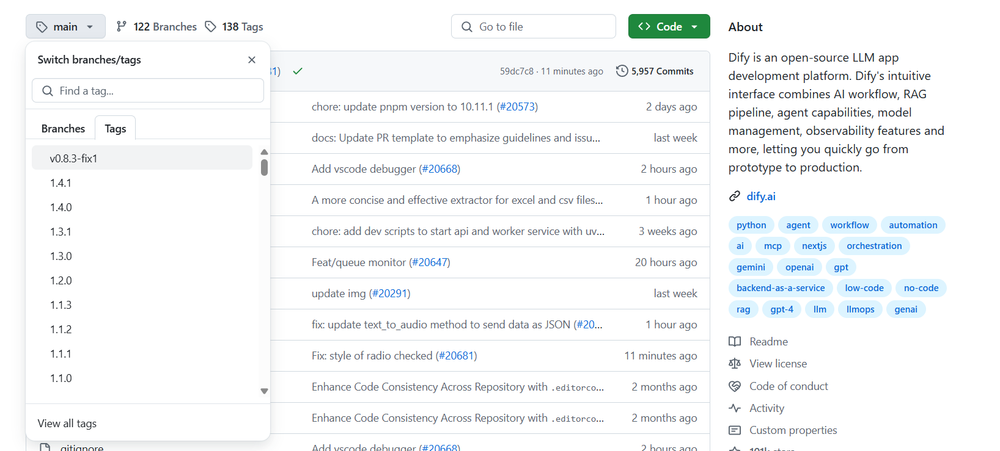

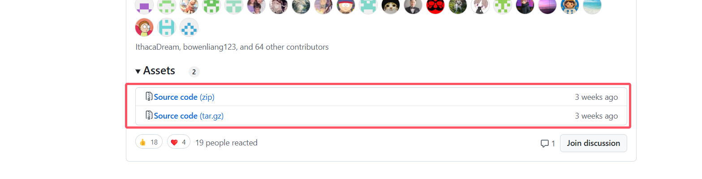


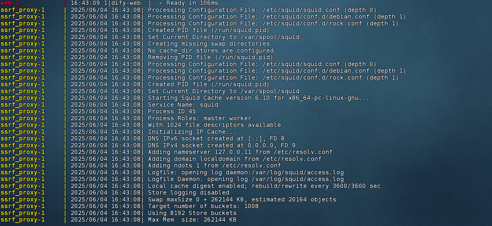


# 3 Dify接入火山方舟

```python
# 1 dify 支持多个LLM提供商，我们以字节的火山方舟为例，同学们可以自行测试 通义千问，deepseek等等

# 2 注册火山方舟账号，来到控制台
https://console.volcengine.com/ark/region:ark+cn-beijing/overview?briefPage=0&briefType=introduce&type=new
        
# 3 开通模型（收费）
https://console.volcengine.com/ark/region:ark+cn-beijing/openManagement?LLM=%7B%7D&OpenTokenDrawer=false
        
# 4 创建aipkey

# 5 选择在线推理--自定义推理接入

# 6 在dify中 接入（先安装-再接入）

# 7 测试编排
```

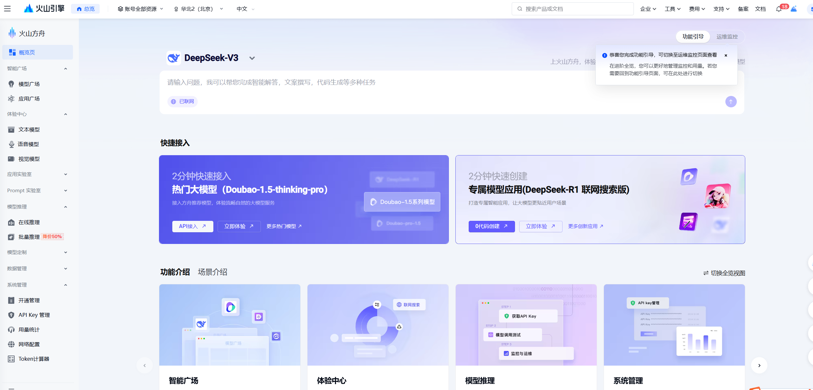

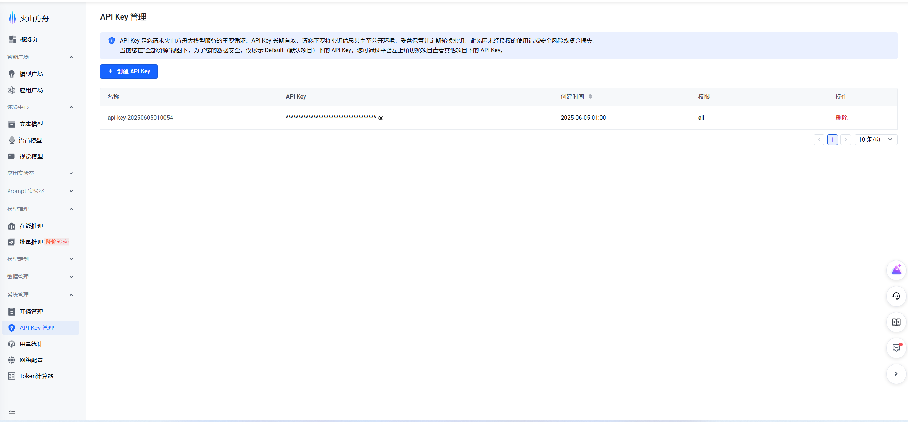


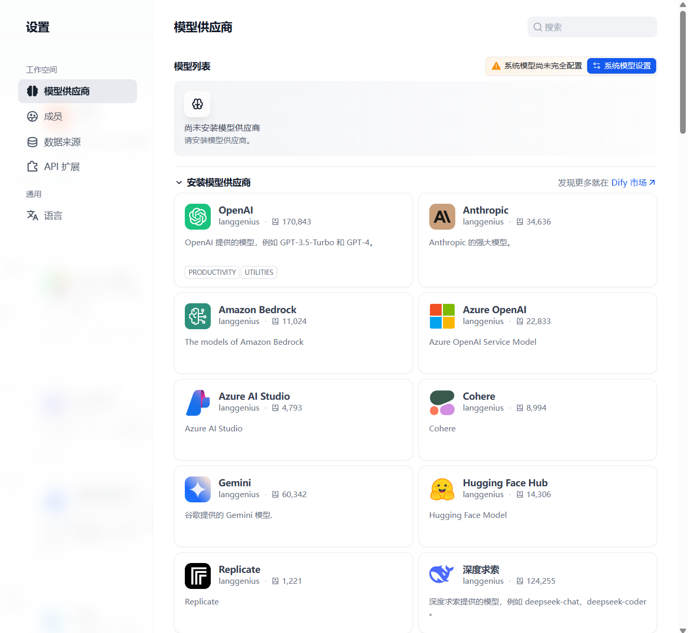


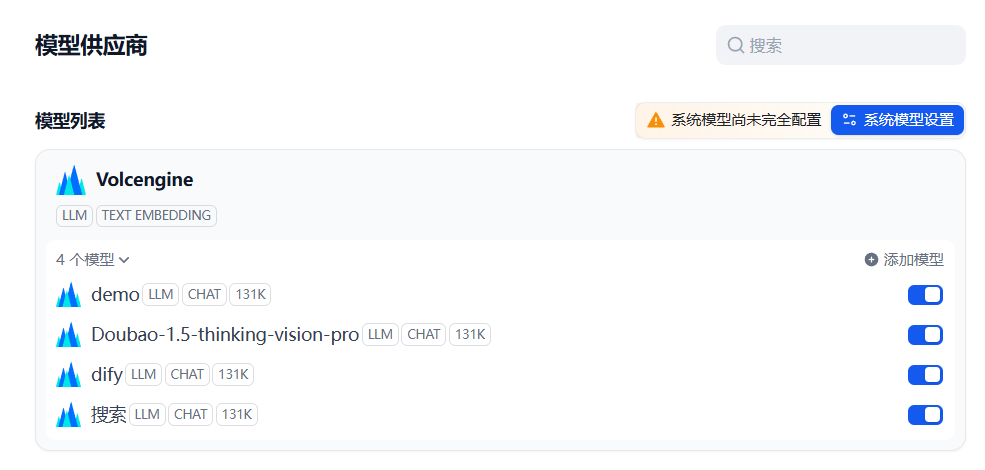


# 4 接入本地deepseek

```python
# 1 使用第三方模型提供商，需要花钱，后续会越来越贵，如果自己有服务器，能跑模型，可以本地部署，接入自己模型，更可控，可二开

# 2 我们使用ollama来本地的部署deepseek，使用Dify接入我们本地模型
	-ollama 官方地址：https://ollama.com
        
# 3 Ollama 是一个开源的大型语言模型服务工具，旨在让用户能够在本地轻松地运行和管理大型语言模型
'''
3.1 开源免费：Ollama 及其支持的模型完全开源且免费，用户可以随时访问和使用这些资源，无需支付任何费用。

3.1 简单易用：无需复杂的配置和安装过程，只需几条简单的命令即可启动和运行，为用户节省了大量时间和精力。

3.1 支持多平台：提供了多种安装方式，支持 Mac、Linux 和 Windows 平台，并提供 Docker 镜像，满足不同用户的需求。

3.4 模型丰富：支持包括 Llama3.1、Gemma2、Qwen2 在内的众多热门开源 LLM，用户可以轻松一键下载和切换模型，享受丰富的选择。

3.5 功能齐全：将模型权重、配置和数据捆绑成一个包，定义为 Modelfile，使得模型管理更加简便和高效。

3.6  支持工具调用：支持使用 Llama 3.1 等模型进行工具调用，使模型能够使用它所知道的工具来响应给定的提示，从而执行更复杂的任务。
3.7 资源占用低：优化了设置和配置细节，包括 GPU 使用情况，从而提高了模型运行的效率，确保在资源有限的环境下也能顺畅运行。

3.8  隐私保护：所有数据处理都在本地机器上完成，能保护用户的隐私。

3.9 社区活跃：拥有一个庞大且活跃的社区，用户可以轻松获取帮助、分享经验，并积极参与到模型的开发和改进中，共同推动项目的发展

'''

# 4 下载安装 ollama（三两种方式） https://github.com/ollama/ollama/releases
## 方式一：官方脚本安装（如不能翻墙，速度慢）
curl -fsSL https://ollama.com/install.sh | sh
    
## 方式二：自己服务器下载-找到自己机器平台下载（如不能翻墙，速度慢）
1 下载：
wget https://github.com/ollama/ollama/releases/download/v0.9.0/ollama-linux-arm64.tgz
    
## 方式三：下载到本地-上传到服务器
1 下载：软件中已经提供
2 上传到服务器
3 移动到位置
mv ollama-linux-amd64.tgz /usr/local/bin/ollama1
4 解压
tar -xzvf ollama-linux-amd64.tgz
5 创建软连接
ln -s /usr/local/bin/ollama1/bin/ollama  /usr/local/bin/ollama

6 测试
ollama --version


# 5 制作成linux 服务
vi /etc/systemd/system/ollama.service

[Unit]
Description=Ollama Service
After=network-online.target

[Service]
ExecStart=/usr/local/bin/ollama serve
User=root
Group=root
Restart=always
RestartSec=3
Environment="PATH=$PATH"
Environment="OLLAMA_MODELS=/home/ollama/models"
Environment="OLLAMA_HOST=0.0.0.0:11434"

[Install]
WantedBy=default.target

# 6 启动ollama
# 重新加载服务配置
sudo systemctl daemon-reload
# 开机自启动
sudo systemctl enable ollama
# 立刻启动
sudo systemctl start ollama
# 重启服务
sudo systemctl restart ollama
# 关闭防火墙
systemctl stop firewalld
systemctl disable firewalld

# 7 浏览器访问
http://192.168.23.128:11434/
        
# 8 安装deepseek-r1 【机器性能原因-我们选择最小的蒸馏版】
ollama run deepseek-r1:1.5b
    
# 9 dify中接入本地deepseek
```


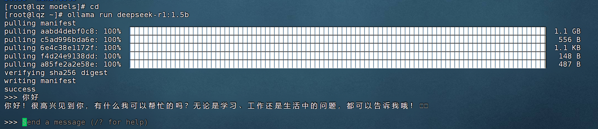

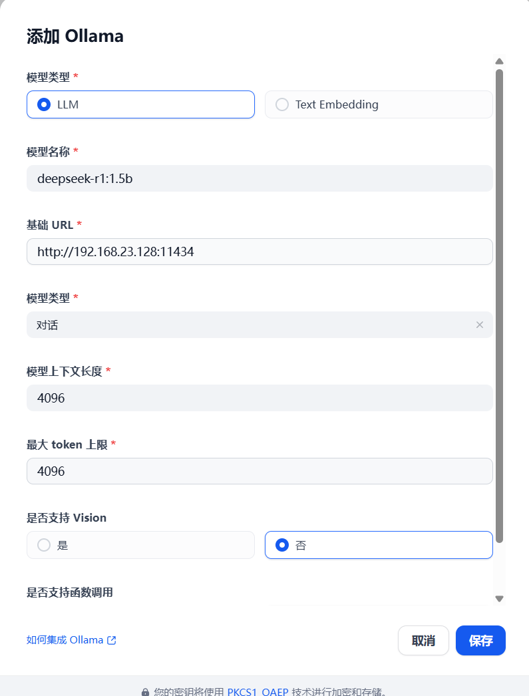


## 4.1 ollama 本地安装

```python
# 1 双击提供的软件
# 2 安装完成就在运行
# 3 访问：http://localhost:11434/ 能看到在运行
# 4 安装 deepseek-r1
ollama run deepseek-r1:1.5b
```


# 补充

## 1 Hyper-V和 WSL 2介绍

### 1.1  Hyper-V 是什么？

```python
1 Hyper-V 是微软开发的 虚拟化平台（Hypervisor），内置于 Windows 专业版 / 企业版系统中（如 Windows 10/11 Pro,家庭版可能没有）

2 它允许在一台物理计算机上创建和运行多个 虚拟机（VM），每个虚拟机可独立运行操作系统（如 Windows、Linux、macOS 等），并与宿主系统隔离

3 集成于 Windows：无需额外安装（需在 “启用或关闭 Windows 功能” 中手动开启）
	-打开“控制面板” -> “程序” -> “启用或关闭Windows功能”
```


###  1.2 WSL 2 是什么？

```python
WSL（Windows Subsystem for Linux） 是微软推出的 Windows 子系统，允许用户在 Windows 系统中直接运行 Linux 环境（包括命令行工具、桌面应用和服务），无需传统虚拟机或双系统。

WSL 1（基于翻译层）：通过兼容层将 Linux 系统调用转换为 Windows API，性能有限。
WSL 2（2019 年推出）：基于 Hyper-V 虚拟化技术，使用轻量级虚拟机运行真实的 Linux 内核，性能接近原生 Linux，且支持完整的系统功能（如 systemd、Docker 等）


##### 启用WSL 2：####
Docker Desktop在Windows上依赖于WSL 2（Windows Subsystem for Linux 2）
# 1.0 双击安装提供的wsl_update_x64.msi
	在软件包下
# 1.1 打开“控制面板” -> “程序” -> “启用或关闭Windows功能”。
# 1.2 勾选“适用于Linux的Windows子系统”和“虚拟机平台”。
# 1.3 重启计算机。
```

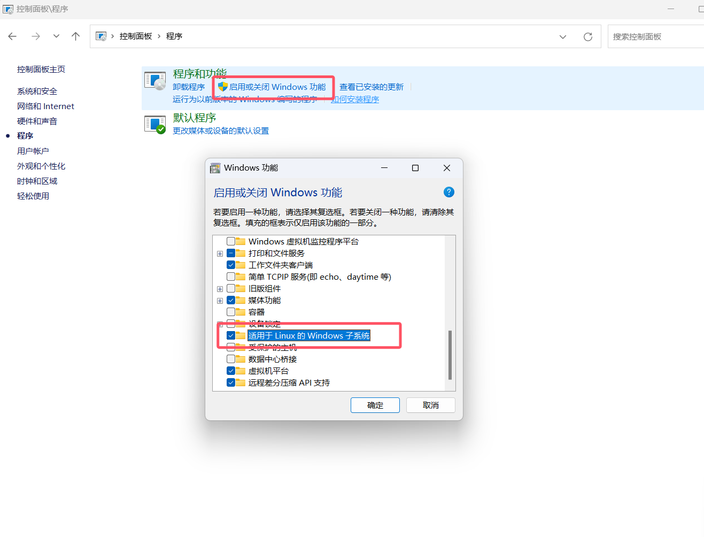


### 1.3 Hyper-V 与 WSL 2 的联系

```python
# 1 技术依赖关系
WSL 2 基于 Hyper-V 实现：WSL 2 的底层使用 Hyper-V 的轻量级虚拟机（LWVM）运行 Linux 内核，因此启用 WSL 2 时会自动启用 Hyper-V 组件。
注意：若手动关闭 Hyper-V，WSL 2 将无法运行（WSL 1 不受影响）。

# 2 共享虚拟化资源
两者共用 Hyper-V 的虚拟化功能，如虚拟交换机、内存管理等。例如，WSL 2 中的 Linux 系统可通过 Hyper-V 虚拟网络与其他虚拟机或宿主系统通信。

# 3 目标场景互补
Hyper-V 适合需要完整虚拟机隔离的场景（如运行完整操作系统、多系统测试）。
WSL 2 专注于 Linux 开发环境的无缝集成，强调与 Windows 的交互性（如文件共享、剪贴板互通）
```

## 2 Windows 上 DockerDestop和VMware冲突

### 2.1 冲突原因

```python
Docker Desktop 在 Windows 系统上运行通常依赖 Hyper-V 或 WSL 2，而 WSL 2 又基于 Hyper-V 的轻量级虚拟机技术。Hyper-V 是微软的虚拟化平台，它与 VMware 的虚拟化技术存在冲突。当 Hyper-V 启用时，会占用一些底层硬件资源和系统功能，导致 VMware Workstation 等软件无法正常使用，VMware 会提示 “VMware Workstation 与 Device/Credential Guard 不兼容” 等错误信息
```

### 2.2 几种解决方法

#### 【方式一】禁用Hyper-V

```python
# 禁用Hyper-V
在系统中禁用Hyper-V，这将允许VMware正常运行而不会与Docker冲突。

## 通过以下步骤来禁用Hyper-V：
1 打开“控制面板” > “程序” > “启用或关闭Windows功能”。
2 找到并取消勾选“Hyper-V”选项。
3 点击“确定”并重启计算机。
```

#### 【方式二】启用WSL 2

```python
如果主要使用Docker，可以考虑使用WSL 2来运行Linux容器，而不是依赖于Hyper-V。WSL 2在Windows 10和Windows 11上提供了轻量级的Linux环境，可以直接与Docker结合使用。
## 方式一：命令
启用WSL 2：打开PowerShell作为管理员。
运行命令 wsl --set-default-version 2 来设置WSL版本为2。
安装Linux发行版（如Ubuntu） wsl.exe --set-version Ubuntu 2
#方式二：软件
双击安装软件：wsl_update_x64.msi
	-软件包中提供

安装Docker Desktop并确保其配置为使用WSL 2。
```

#### 【方式三】使用Docker Desktop for Windows的WSL 2后端

```python
Docker Desktop for Windows也可以配置为使用WSL 2作为后端，这样可以绕过Hyper-V的限制。

在Docker Desktop的设置中，启用“Use the WSL 2 based engine”。

重启Docker Desktop。
```

#### 【方式四】同时使用VMware和Docker

```python
如果需要同时使用VMware和Docker，可以考虑以下方案：

使用嵌套虚拟化：在某些情况下，你可以在支持嵌套虚拟化的硬件上启用嵌套虚拟化功能，但这通常需要BIOS/UEFI设置中的特定配置。

使用桥接网络：确保你的虚拟机网络设置为桥接模式，这样可以避免与Docker容器网络冲突。
```

#### 【方式五】使用虚拟机软件的其他版本

```python
考虑使用其他虚拟机软件，如VirtualBox，它通常与Docker和Windows Hyper-V兼容性更好。
```

#### 【方式六】更新最新版本

```python
确保VMware Workstation、Docker Desktop和Windows系统都是最新版本，软件更新会解决兼容性问题。
```


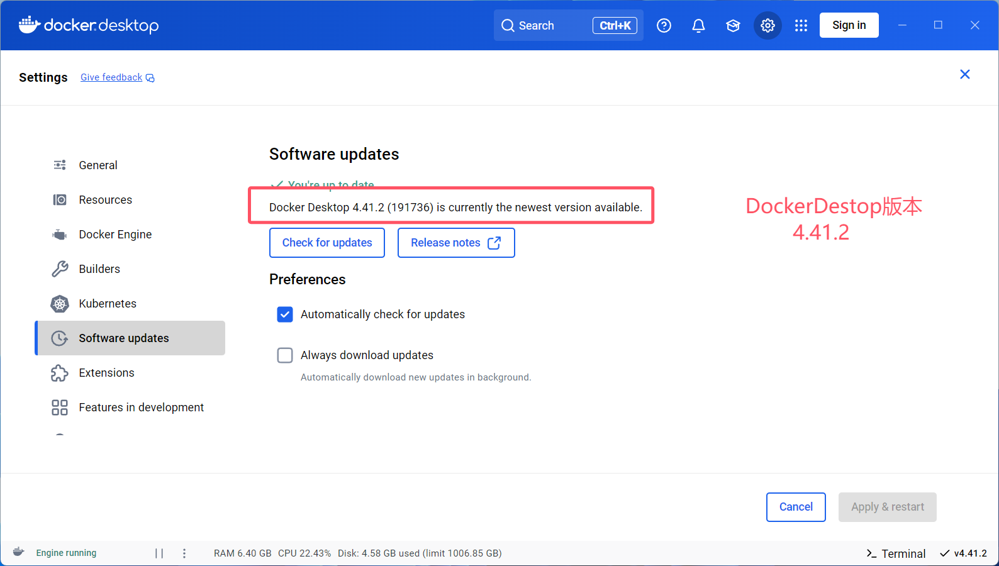


## 3 Docker Desktop 安装在其他盘符

```python
# 0 开启WSL2
	打开“控制面板” -> 程序 -> 启用或关闭Windows功能->勾选“适用于Linux的Windows子系统”和“虚拟机平台”。
# 1 在D盘新建文件夹   D:\Docker      D:\Docker\data
# 2 把下载的Docker Desktop Installer.exe 放在该目录下
########### 一定使用管理员身份运行 安装####################
# 3 执行命令(使用软连接-这种不可控，因为不同用户路径不一样：存放容器的路径)
mklink /j "C:\Program Files\Docker" "D:\Docker"
mklink /j "C:\Users\Administrator\AppData\Local\Docker" "D:\Docker\data" 
# C:\Users\Administrator\AppData\Local 这个路径可能不同人不尽相同

# 4 方式二：命令方式
start /w "" "D:\Docker\Docker Desktop Installer.exe" install -accept-license --wsl-default-data-root="D:\Docker\data" --installation-dir="D:\Docker\"

########### 一定使用管理员身份运行 安装####################


# 5 开启后，看到装在了D盘 

```

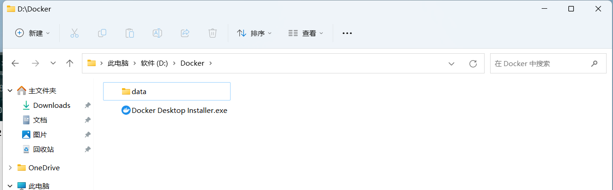


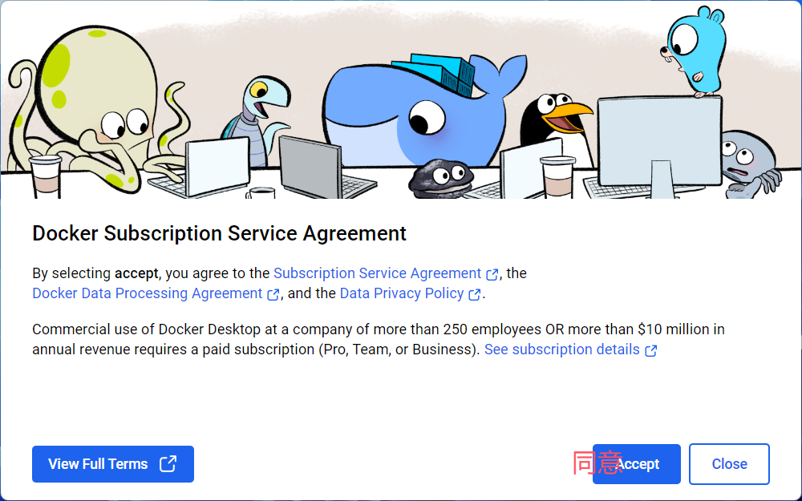


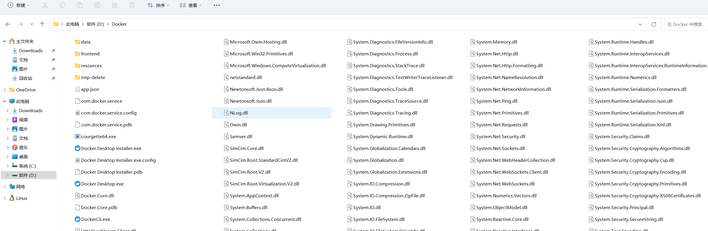

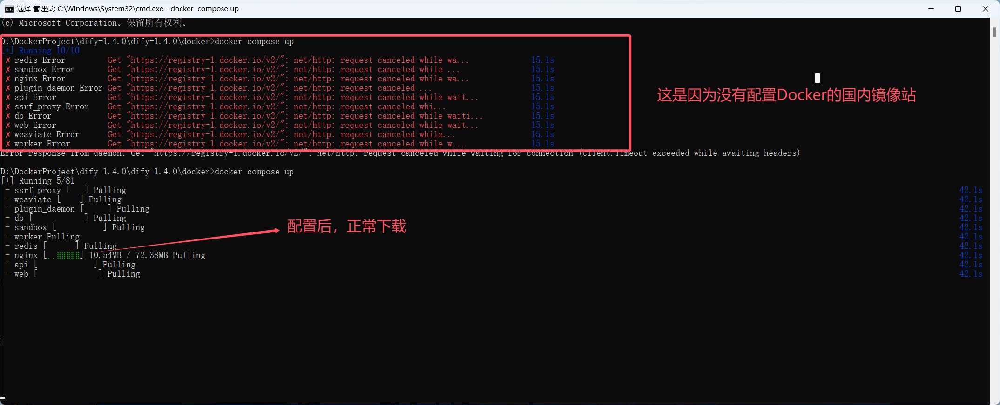


## 4 Mac安装虚拟机

```python
# 1 mac上虚拟机软件选择
VMware 公司为 Mac 用户开发了专门的虚拟化软件 ——VMware Fusion   免费
Parallels desktop(个人建议)                                收费

# 3 mac 破解软件下载：
https://macwk.cn/
https://www.macat.vip/
https://xclient.info/
https://appstorrent.ru/programs/ # 需要翻墙
    
    
# 4 下载后，正常安装软件，破解看相关下载网站


# 5 创建系统，并安装centos9如下图

# 使用可以参照：https://www.macat.vip/25088.html
```


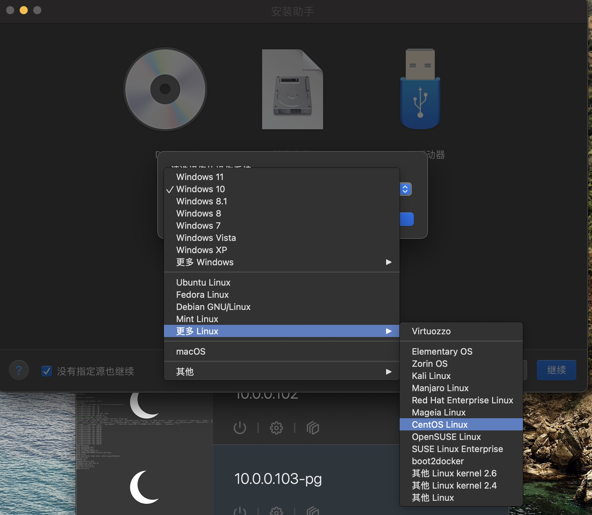

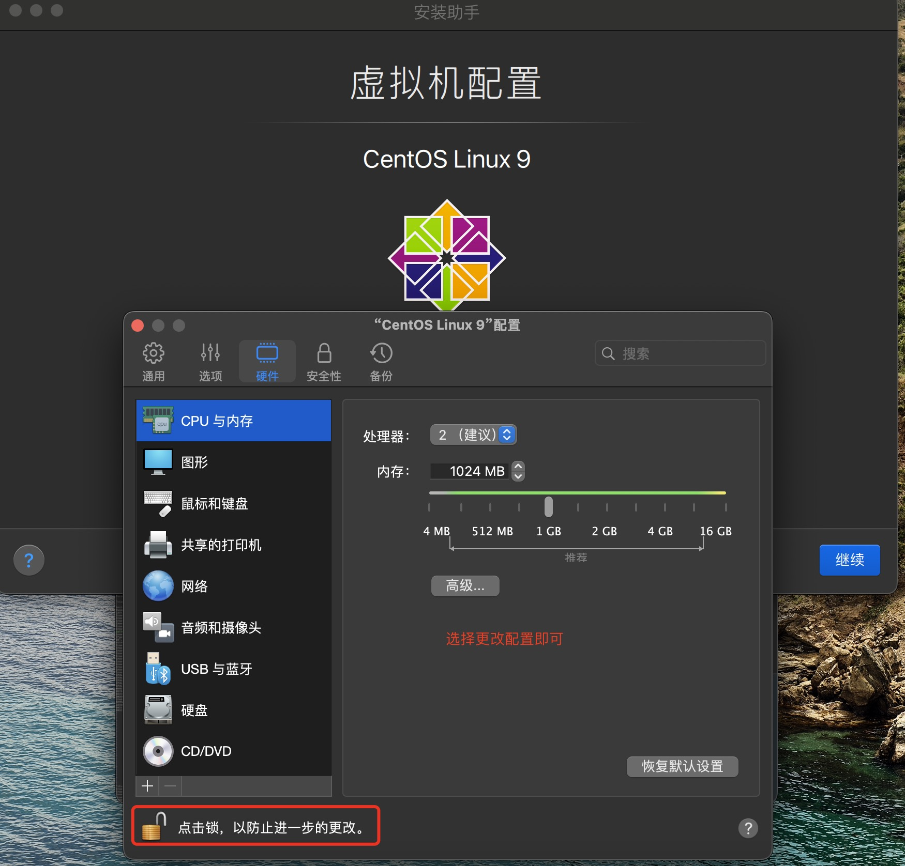

