# 今日内容

# 1 企业级-Dify服务器搭建
## 1.1 虚拟机安装
### 1.1.1 处理器架构-比较重要-很简单-记住

```python
# 1 当时下载 DockerDestop时，mac：提供了两款软件：这两款有什么区别？
	https://docs.docker.com/desktop/setup/install/mac-install/
    苹果芯片
    Intel芯片
    2019款的mac后，苹果不再使用Intel芯片，而使用自研芯片：苹果芯片：M1，M2
# 2 win：提供了三款软件：这三款有什么区别？
	x86：x86_32:没有了        x86_64
    arm：
# 3 不同厂商芯片导致处理器架构不一样

# 1 x86_64（代表：Intel/AMD）
## 指令集扩展：支持 SSE、AVX、AVX-512 等向量指令集，擅长单线程高性能计算（如 AI 训练、视频渲染）。
## 多核设计：主流服务器芯片核数通常为 8-64 核（如 AMD EPYC 96 核），依赖超线程（HT）提升并行效率。
## 生态系统：垄断桌面（Windows）和 90% 以上服务器市场，软件兼容性极强（如 Docker、Kubernetes 原生支持）。
## 典型场景：个人电脑、数据中心服务器、游戏主机（如 PS5/Xbox 使用定制 AMD APU）。

# 2 AArch64（代表：ARM、华为鲲鹏、Apple M 系列）
## 指令集扩展：支持 NEON（向量运算）、Cryptography Extensions（加密加速），适合移动和边缘计算。
## 多核设计：天生支持大规模多核（如 AWS Graviton3 达 64 核），片上集成 ISP、NPU 等专用单元（如手机 SoC）。
## 生态系统：移动领域绝对主导（安卓 /iOS 应用原生支持），服务器端通过 Rosetta/QEMU 兼容 x86 软件（可能损失性能）。
##典型场景：智能手机（如骁龙 8 Gen3）、云服务器（如阿里云神龙 ARM 实例）、物联网设备（如树莓派 5），苹果电脑

-------------------------------------------------------------

# 3 PPC64LE（代表：IBM Power、飞腾）
## 指令集扩展：支持 Altivec（向量处理）、Decimal Floating Point（十进制浮点，适合金融计算）。
## 多核设计：对称多处理（SMP）架构，单芯片核数通常 4-16 核（如 IBM Power10 10 核），注重可靠性（如内存纠错 ECC）。
## 生态系统：依赖特定企业级软件（如 IBM AIX、IBM i 操作系统），Linux 支持有限（需单独适配）。
## 典型场景：传统企业服务器（如银行核心系统）、超级计算机（如日本富岳使用富士通 A64FX，基于 ARM 而非 PPC）。

# 4 s390x（代表：IBM Z 系列大型机）
## 指令集扩展：支持 CPACF（压缩 / 解压缩）、 cryptographic instructions（硬件加密），专为交易处理优化。
## 多核设计：大型机架构，单系统可支持数千个逻辑处理器（LPAR），通过逻辑分区实现资源隔离。
## 生态系统：高度封闭，依赖 IBM Z/OS、Z/Linux 等专用操作系统，软件需深度定制（如银行核心交易系统）。
## 典型场景：金融行业核心系统（如信用卡清算）、电信运营商计费平台、高可用性事务处理。


# 4 以后大家下软件  或者下  操作系统 ---》软件或操作系统都是运行在机器上的
	下载跟你处理器架构对应的软件
    x86_64：Intel、AMD---》台式机，笔记本装了win操作系统，大部分都是 x86_64--》
    AArch64：ARM、Apple M 系列--》苹果电脑：AArch64
    
# 5 如果同学下了软件，双击运行，运行不了，多半是平台不对
```

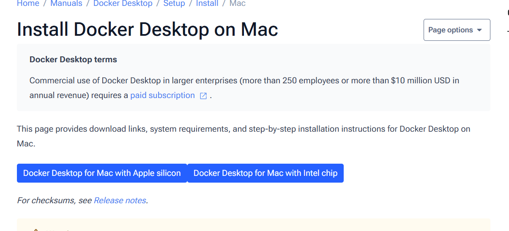

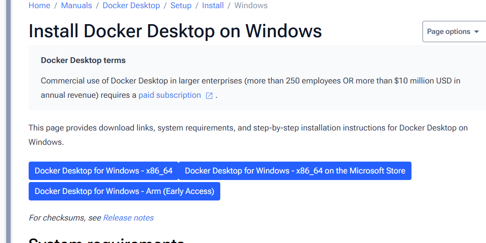

### 1.1.2 VMware Workstation Pro安装

```python
# 1 正常在公司中，做开发，开发完的软件，部署在【服务器】上---》用户才可以使用
# 2 服务器会有这么几种情况
	- 公司自己买服务器：浪潮国内No1，曙光，IBMg国外---》自己弄个屋---》开着空调--》把服务器放在这里屋里
    	-7*24 不断电 恒温恒湿
        -大楼的1楼，或顶楼，地下室。。。 西湖水底
        -接入网络，公司部署软件用
        -成本很高--》小公司承担不起
   - 小公司，买云服务：阿里云，腾讯云。。。
		-阿里云创建机房--》放在西湖水底--》购买它的使用权限
    		-买一个月：888元 --》1核 2G内存 20G磁盘
    	-得物：买了阿里云
   - 私有云：政府，银行
		不自建机房，又不能买公共云服务器
    	让阿里协助他们建机房--》服务器政府，银行买--》维护是阿里来干
        
        
        
# 3 我们公司，要搭建dify服务，给用户来提供服务(给用户用)---》使用虚拟机 模拟出服务器的效果--》跟真实服务器没有区别：操作系统没有区别，咱们性能低一点

# 4 我们需要虚拟化的软件：有很多：vmware，virtual box。。。。
	vmware：使用很广泛，win机器很好用VMware Workstation ，但是 mac机器不支持。他们有为mac做了一个虚拟化的软件VMware Fusion
    mac：Parallels desktop：推荐 ，VMware Fusion
# 5 在虚拟化的软件上，虚拟出一个虚拟机【相当于你买了台电脑，服务器】，然后装上 企业里用的 操作系统：乌班图，centos，麒麟。。。 
	-本质个人pc个人电脑，跟公司服务器没有区别
    	cpu，磁盘，内存。。
        
        
# 6 虚拟机特性
## 多系统运行：
用户可以在单一的桌面上同时运行不同的操作系统，如 Windows、DOS、Linux 等，无需重新启动计算机，就能在不同操作系统之间进行切换，便于开发、测试和部署新的应用程序。
## 模拟网络环境：
可在物理机器上模拟完整的网络环境，通过虚拟网卡能将几台虚拟机组成一个局域网，方便进行网络相关的测试和实验。
## 资源隔离与保护：
完全隔离并且保护不同操作系统的操作环境以及所有安装在操作系统上面的应用软件和资料，不同操作系统之间还能进行互动操作，如网络连接、周边设备共享、文件分享以及复制粘贴等。
## 灵活配置：
能够设定并且随时修改操作系统的操作环境，如内存、磁盘空间、周边设备等，还具有复原（Undo）功能，方便用户进行各种测试和实验，不用担心对系统造成不可逆的影响

# 7 安装  VMware Workstation   版本：17.6 
	-不要使用低版本
    -低版本坏处：1 收费：需要破解     2 会跟DockerDestop冲突，他俩不能同时运行
    -已经放在软件中：自取
    -如果同学想自己下，去官网自行下载：注册账号，位置不好找
```

### 1.1.3 安装 vmware

>只是装了个虚拟化的软件，在你win系统上：装到哪个盘，不重要
>
>mac系统不用它：Parallels desktop：推荐 ，VMware Fusion  安装不太一样


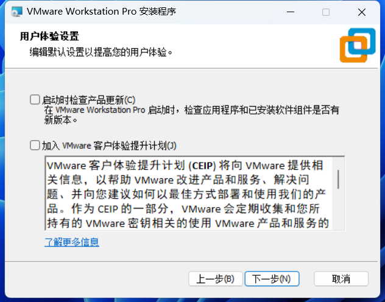

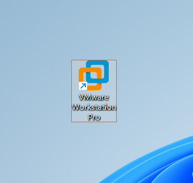

### 1.1.3  创建虚拟机

>创建虚拟机，相当于买了台服务器/新电脑---》我们会指定这个新电脑的 cpu，内存，磁盘，dvd。。。


>
>
>red het：红帽公司，基于开源的linux自己加了很多开发，软件--》做出来的linux操作系统，企业及，收费给企业用
>
>linux 遵循GPL开源协议---》可以用开源的，你在开源基础上开发的新东西，可以收费，但你的东西必须开源出来
>
>社区就基于开源的red het--》centos  

### 


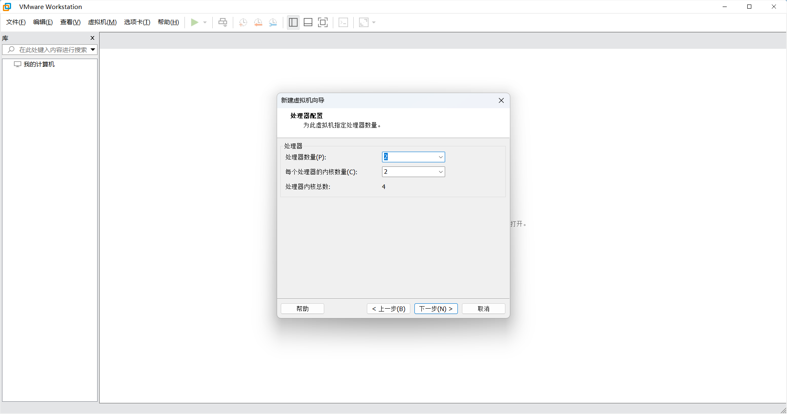


### 1.1.4 安装Centos Stream 9

>win,linux:乌班图，centos8，。。。。我们装最新的centos Stream 9
>
>只有机器，没有操作系统，运行不了软件的

```python
# 1 centos 介绍
CentOS（Community Enterprise Operating System） 是基于 Red Hat Enterprise Linux（RHEL）源代码构建的免费开源操作系统，旨在提供稳定、安全、高性能的企业级计算环境。

CentOS 9 是该系列的最新长期支持（LTS）版本之一（当前最新为 CentOS Stream 9），主要面向服务器、数据中心和云计算场景，适合作为 Web 服务器、数据库服务器、虚拟化平台或容器化部署环境


# 2 CentOS 9 的发布与生命周期
CentOS 9 于 2022 年 5 月随 RHEL 9 发布，但传统的 CentOS Linux 项目已于 2021 年终止，转为 CentOS Stream（RHEL 的上游测试版本）。因此，CentOS 9 通常指 CentOS Stream 9，其定位是为 RHEL 提供预发布的测试功能，更接近滚动更新模式，但仍提供 10 年生命周期支持 至 2032 年 5 月

# 3  适用场景
## 企业服务器：
作为 Web 服务器（如 Nginx/Apache）、数据库服务器（MySQL/PostgreSQL）或邮件服务器，提供高稳定性和长期支持。
##  云计算与虚拟化：
适配 OpenStack、VMware 等云平台，或作为 KVM 宿主机部署虚拟机。
## 容器化与微服务：
结合 Podman、Docker、Kubernetes 构建容器化应用，适合 DevOps 流水线和持续集成 / 部署（CI/CD）。
## 开发与测试环境：
CentOS Stream 9 适合开发人员测试新功能，而 AlmaLinux/Rocky Linux 9 更适合生产环境的稳定需求
```

```python
# 1 下载操作系统文件
	-正常去官网下载：https://mirror.stream.centos.org/
    -阿里云镜像站（快）：https://mirrors.aliyun.com/centos-stream/9-stream/BaseOS/?spm=a2c6h.25603864.0.0.5d6aa361uOWwXy
        
# 2 根据自己电脑架构下载
	-win：一般选 x86_64
    -mac: m1,m2芯片选 AArch64 2020款以后得mac，下载
        
        
    -iso文件：
    	win:CentOS-Stream-9-20250526.1-x86_64-boot.iso
        mac:下载arrch64那款
            
            
 # 3 在机器上安装系统
	
	
    
```

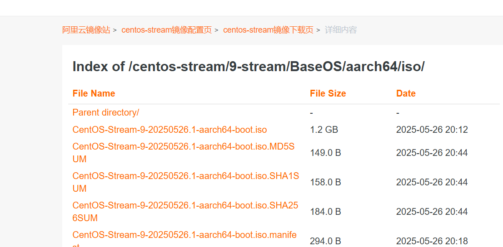


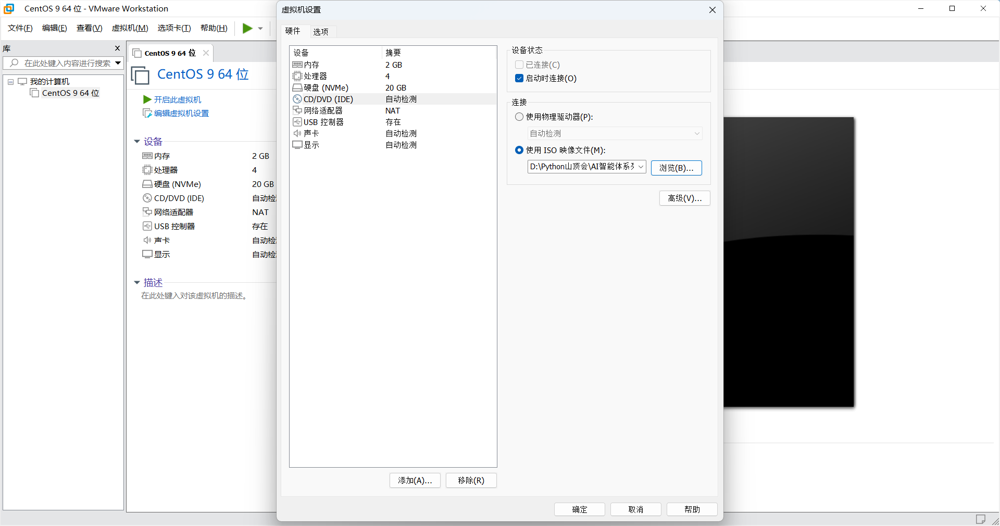


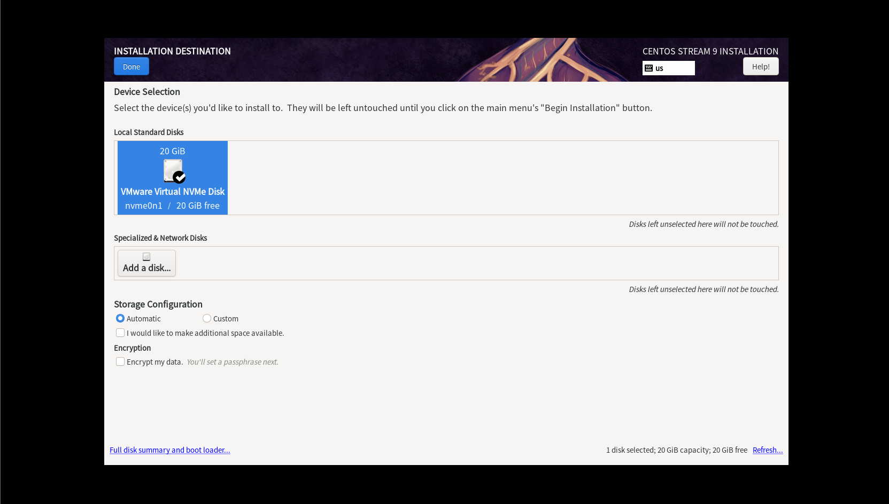


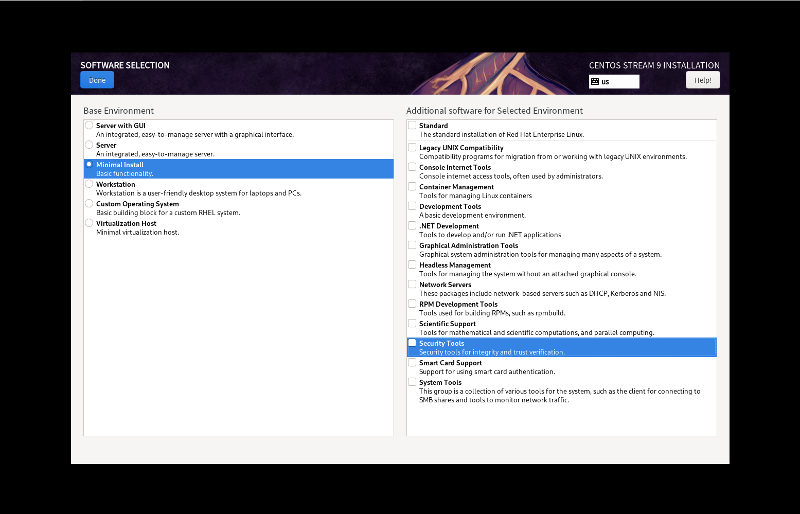

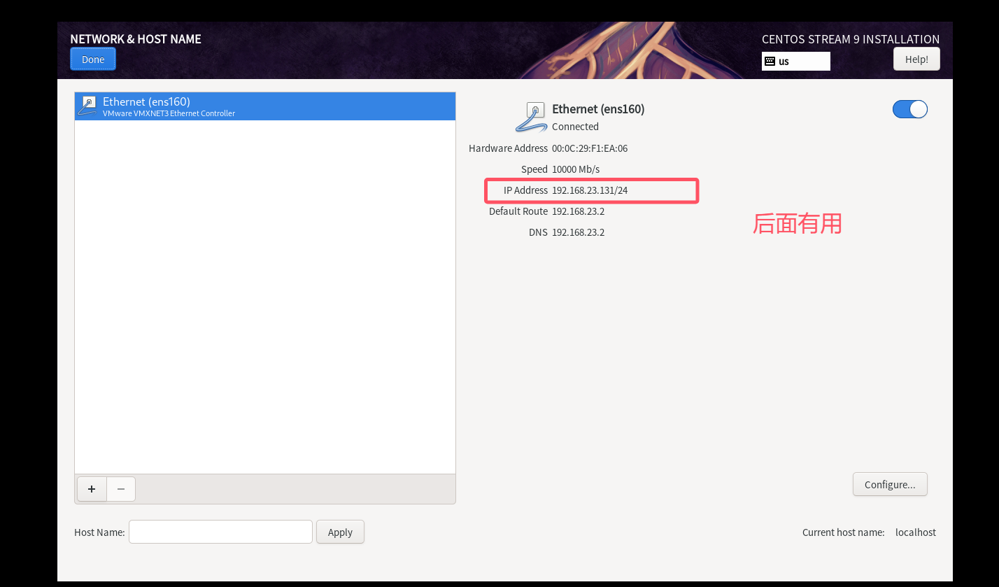

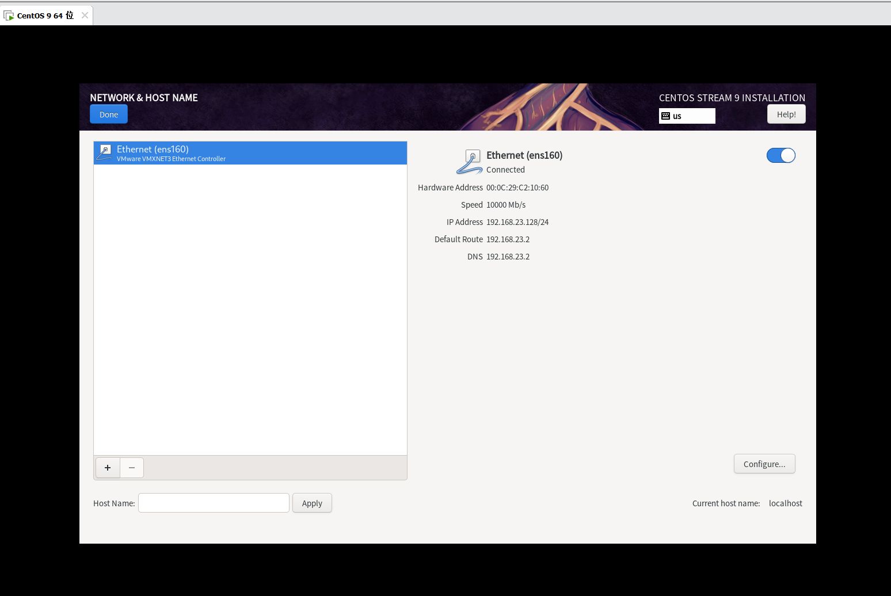

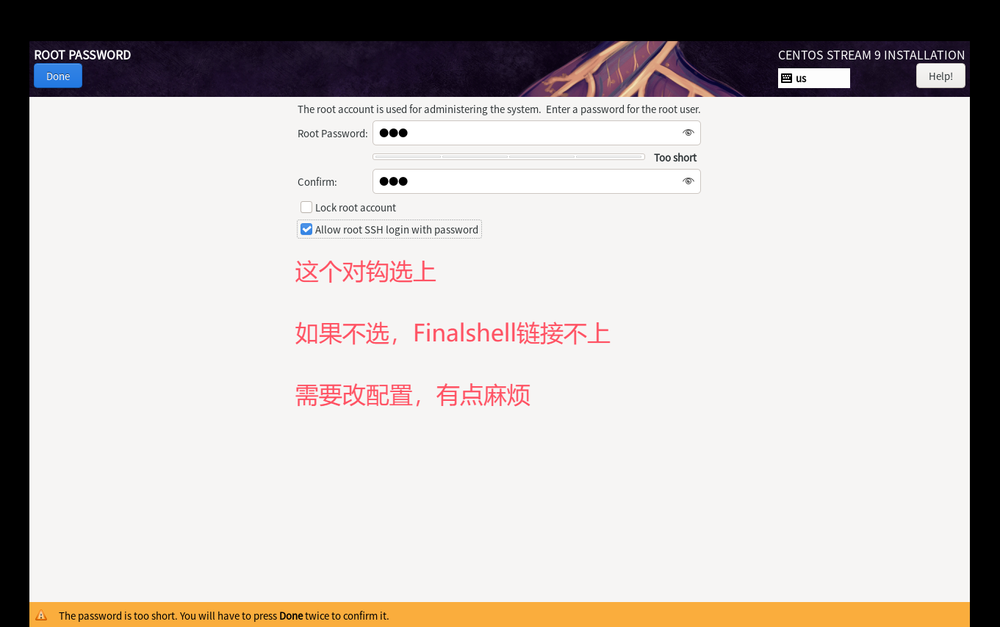

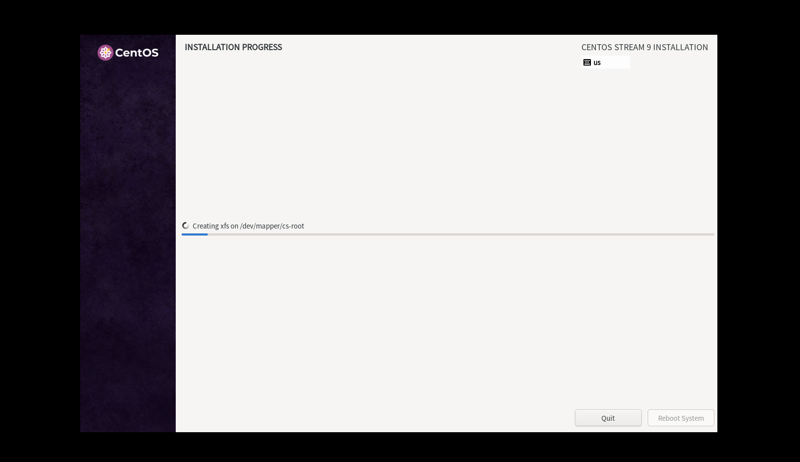


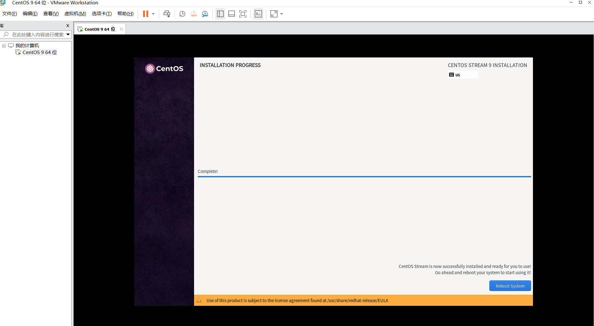


## 1.2 远程链接工具FinalShell使用

>因为公司中的服务器，都是在机房，我们不可能天天在机房呆着，所有我们需要使用远程链接工具，在办公室，就能连到机房中的机器，进行操作
>
>云服务器，在阿里公司的机房中，只能使用远程链接工具，远程链接--》本地输入命令--》发送给远程机器---》远程机器执行
>
>远程链接工具很多：
>
>FinalShell 支持多平台win，mac，linux
>
>xshell只执行win

```python
# 0 介绍
FinalShell 是一款免费的国产一体化服务器、网络管理软件，支持 Windows、macOS、Linux 等多个操作系统。它集成了多种功能，是开发者和运维人员常用的工具之一

# 1 官网下载，根据自己电脑平台
https://www.hostbuf.com/t/988.html
    
# 2 安装

# 3 双击打开

# 4 配置链接
	
```


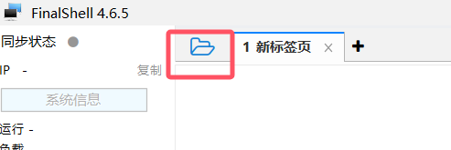


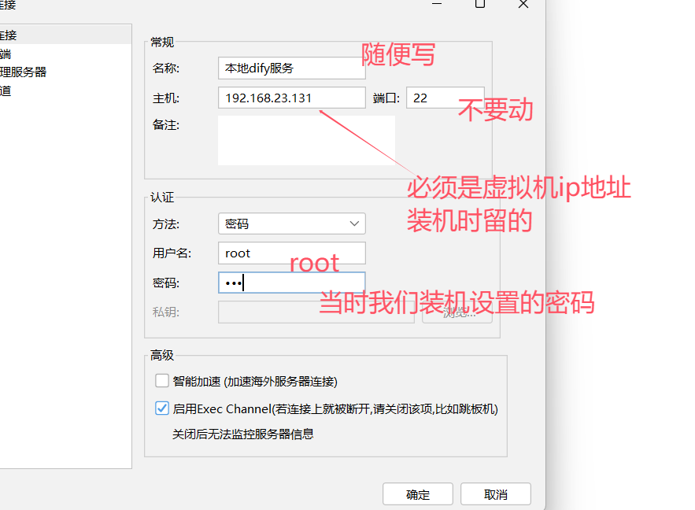

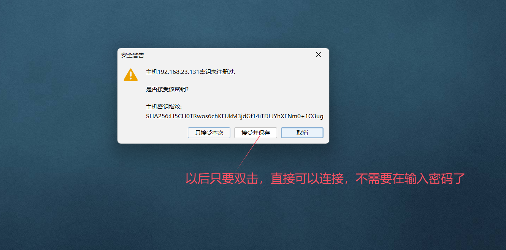

**如果当时没记住ip**

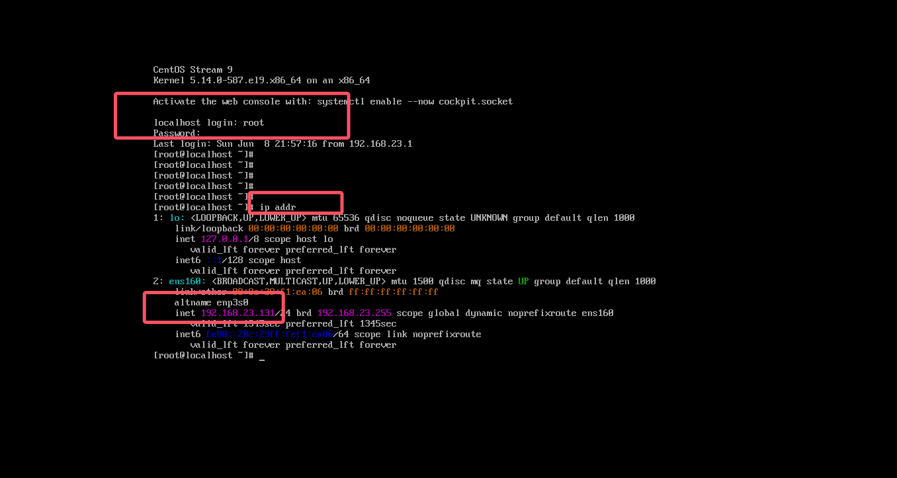

## 1.3 Docker安装和常用命令

```python
# 1 之前咱们学过在mac，win上装docker
	-dockerdestop：包含docker，docker-compose，图形化界面
    -公司里的服务器都是没有图形化界面的，所有就用不了dockerdestop
    
    
# 2 使用命令装docker

# 3 万一之前装过docker（我们没有），先卸载再装
sudo yum remove docker \
                  docker-client \
                  docker-client-latest \
                  docker-common \
                  docker-latest \
                  docker-latest-logrotate \
                  docker-logrotate \
                  docker-engine -y
                    
                    
# 4 开始真正装（五中方式）--》无论哪种，能装上就行
	-5种种，有的可能装不上：原因是：1 使用阿里云源，源失效了  2 使用docker官方源，在国外，链接超时了
    
# 5 安装方式一：大家按这个来即可
# 把docker官方提供的仓库，加入到我们仓库中
sudo dnf config-manager --add-repo=https://download.docker.com/linux/centos/docker-ce.repo
# 下载：docker和docker-compose都装好了
sudo dnf install docker-ce docker-ce-cli containerd.io docker-compose-plugin -y

# 6 或者按这个：
6.1 命令行中敲
bash <(curl -sSL https://gitee.com/SuperManito/LinuxMirrors/raw/main/ChangeMirrors.sh)
把你的仓库源换成：阿里云
6.2 执行安装
sudo dnf install docker-ce docker-ce-cli containerd.io docker-compose-plugin -y


# 7 验证是否安装成功
docker --version  # 如果顺利打印出docker版本，表示装好了


# 8 启动docker
systemctl start docker

# 9 查看docker 运行状态
systemctl status docker
```

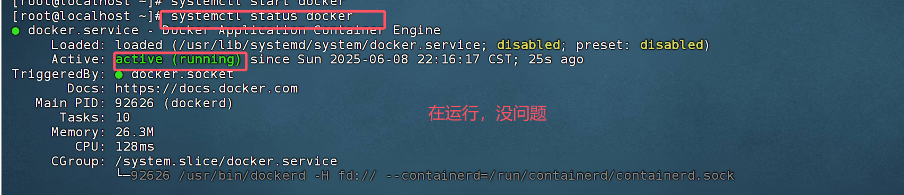


### 1.3.1 配置国内镜像站

```python
# 1 敲 如下命令，进入到文本编辑模型
vi /etc/docker/daemon.json 

# 2 按  i   看到  insert

# 3 复制，粘贴
{
  "registry-mirrors" : ["https://docker.registry.cyou",
"https://docker-cf.registry.cyou",
"https://dockercf.jsdelivr.fyi",
"https://docker.jsdelivr.fyi",
"https://dockertest.jsdelivr.fyi",
"https://mirror.aliyuncs.com",
"https://dockerproxy.com",
"https://mirror.baidubce.com",
"https://docker.m.daocloud.io",
"https://docker.nju.edu.cn",
"https://docker.mirrors.sjtug.sjtu.edu.cn",
"https://docker.mirrors.ustc.edu.cn",
"https://mirror.iscas.ac.cn",
"https://docker.rainbond.cc",
"https://do.nark.eu.org",
"https://dc.j8.work",
"https://dockerproxy.com",
"https://gst6rzl9.mirror.aliyuncs.com",
"https://registry.docker-cn.com",
"http://hub-mirror.c.163.com",
"http://mirrors.ustc.edu.cn/",
"https://mirrors.tuna.tsinghua.edu.cn/",
"http://mirrors.sohu.com/" 
],
 "insecure-registries" : [
    "registry.docker-cn.com",
    "docker.mirrors.ustc.edu.cn"
    ],
"debug": true,
"experimental": false
}


# 4 按 esc 
# 5 输入   :wq  敲回车 # 保存并退出

# 6 重启，让配置生效
systemctl daemon-reload   # 重新加载docker配置
systemctl restart docker  # 重启docker
```


## 1.4 docker-compose 安装和常用命令

>上面安装命令其实装了docker compose
>
>sudo dnf install   docker-compose-plugin
>
>敲 docker compose  有输出表示装好了

```python
# 自行安装docker compose--好处是可以指定docker compose的版本

# 1 安装方式一（因为是从github下载，如不能翻墙，速度非常慢）：
https://github.com/docker/compose/releases


## 1.1 下载（很慢）
sudo curl -SL "https://github.com/docker/compose/releases/download/v2.36.1/docker-compose-$(uname -s)-$(uname -m)" -o /usr/local/bin/docker-compose
## 1.2 授予执行权限
chmod +x /usr/local/bin/docker-compose


# 3 安装方式二，本地下载完后，上传到服务器
## 3.1 下载地址（选择自己机器架构的版本）

## 3.2 上传到服务器

## 3.3 移动到位置，授权
mv docker-compose-linux-x86_64 /usr/local/bin/docker-compose
chmod +x /usr/local/bin/docker-compose  #加执行权限


######  本地有俩docker compose，这两个都可以用，用那个都行
docker compose # 使用dnf装的
docker-compose # 咱们自己装的  假设名字改成 dc

```

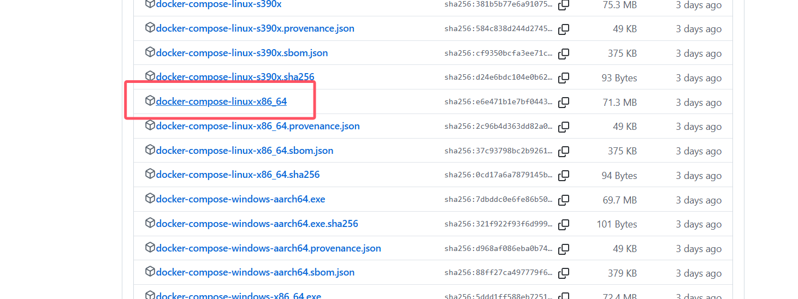

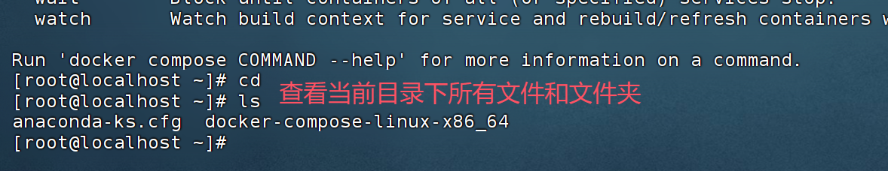


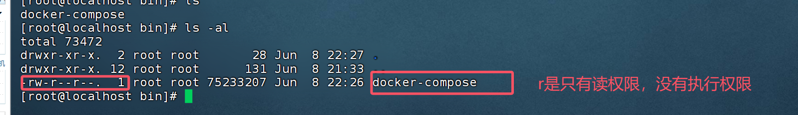

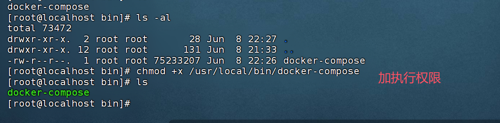

## 1.5 Dify 1.4.0下载和安装

```python
#1 版本介绍：
	- 最新1.4.1 我们用 1.4.0
    - 市面绝大部分资料都是基于 0.x讲
# 2 下载1.4.0版本源码包（三种方式）：

##### 方式一： 在centos服务器上直接下载源码（因为从github下载，不翻墙，速度慢，会失败）
yum install git -y  # 安装git软件
git clone https://github.com/langgenius/dify.git --branch 1.4.1  # 下载1.4.1版本的dify源码
    
    
##### 方式二：直接下载压缩包：因为从github下载，不翻墙，速度慢，会失败）
wget https://github.com/langgenius/dify/archive/refs/tags/1.4.0.zip
    
##### 方式三：本地下载上传
1 地址：https://github.com/langgenius/dify/releases
2 选择我们需要的版本：我下载的zip（下zip或tar.gz 都可以，只是解压方式不同）
	-同学们可以不用下，课程软件资料中有
3 上传到服务器
4 解压
yum install unzip -y
unzip dify-1.4.0.zip

# 3 启动Dify(一定进入到docker目录)
cd dify-1.4.0/docker/
cp .env.example .env
docker compose up  （需要等好久，因为需要下载镜像）
docker-compose up


# 4 浏览器访问：
http://192.168.23.131/
    
# 5 输入管理员账号登录即可
```


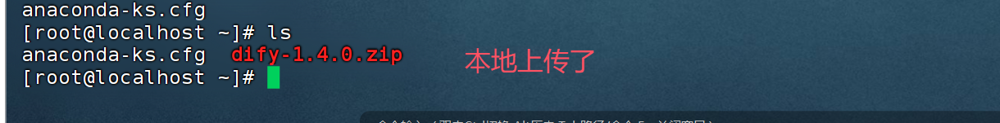

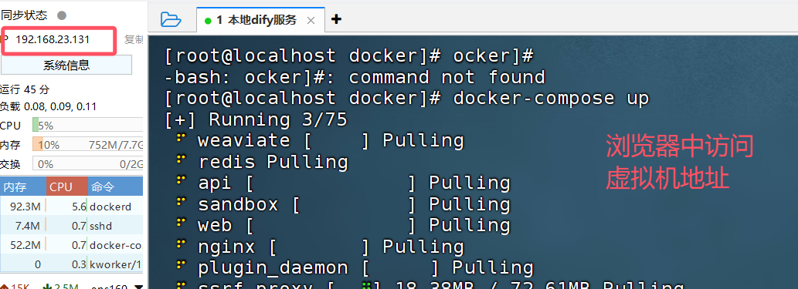


## 补充

>win上使用 DockerDestop部署dify---》如果成了--》就用win上的就可以了
>
>服务器版，如果成了，就用服务器版
>
>
>
>这两个，保证一个能用就可以


>如果虚拟机ip地址变了
>
>进入到虚拟机：不是使用Finalshell连，执行  ip addr  --》显示ip了

# 2 补充

## 4.1 Hyper-V和WSL2

### 1.1  Hyper-V 是什么？

```python
1 Hyper-V 是微软开发的 虚拟化平台（Hypervisor），内置于 Windows 专业版 / 企业版系统中（如 Windows 10/11 Pro,家庭版可能没有）

2 它允许在一台物理计算机上创建和运行多个 虚拟机（VM），每个虚拟机可独立运行操作系统（如 Windows、Linux、macOS 等），并与宿主系统隔离

3 集成于 Windows：无需额外安装（需在 “启用或关闭 Windows 功能” 中手动开启）
	-打开“控制面板” -> “程序” -> “启用或关闭Windows功能”
    
    
    
4 我没打开，最新版的vmware不用，老的版本需要
```

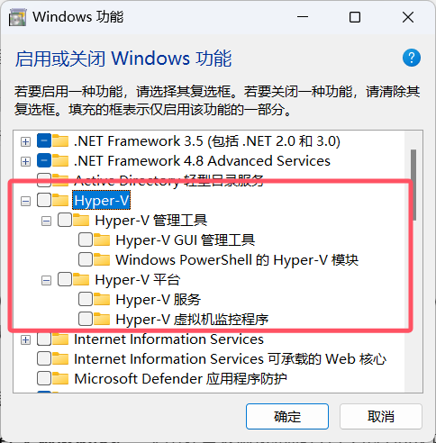

###  1.2 WSL 2 是什么？

```python
WSL（Windows Subsystem for Linux） 是微软推出的 Windows 子系统，允许用户在 Windows 系统中直接运行 Linux 环境（包括命令行工具、桌面应用和服务），无需传统虚拟机或双系统。

WSL 1（基于翻译层）：通过兼容层将 Linux 系统调用转换为 Windows API，性能有限。
WSL 2（2019 年推出）：基于 Hyper-V 虚拟化技术，使用轻量级虚拟机运行真实的 Linux 内核，性能接近原生 Linux，且支持完整的系统功能（如 systemd、Docker 等）


##### 启用WSL 2：####
Docker Desktop在Windows上依赖于WSL 2（Windows Subsystem for Linux 2）
# 1.0 双击安装提供的wsl_update_x64.msi
	在软件包下
# 1.1 打开“控制面板” -> “程序” -> “启用或关闭Windows功能”。
# 1.2 勾选“适用于Linux的Windows子系统”和“虚拟机平台”。
# 1.3 重启计算机。


# 如果机器系统是家庭版---》抽时间，统一换系统 换成专业版，否则就换机器，我们讲的东西，不支持家庭版
	-
```


### 1.3 Hyper-V 与 WSL 2 的联系

```python
# 1 技术依赖关系
WSL 2 基于 Hyper-V 实现：WSL 2 的底层使用 Hyper-V 的轻量级虚拟机（LWVM）运行 Linux 内核，因此启用 WSL 2 时会自动启用 Hyper-V 组件。
注意：若手动关闭 Hyper-V，WSL 2 将无法运行（WSL 1 不受影响）。

# 2 共享虚拟化资源
两者共用 Hyper-V 的虚拟化功能，如虚拟交换机、内存管理等。例如，WSL 2 中的 Linux 系统可通过 Hyper-V 虚拟网络与其他虚拟机或宿主系统通信。

# 3 目标场景互补
Hyper-V 适合需要完整虚拟机隔离的场景（如运行完整操作系统、多系统测试）。
WSL 2 专注于 Linux 开发环境的无缝集成，强调与 Windows 的交互性（如文件共享、剪贴板互通）
```


