# 1 虚拟机快照-服务重启-运行虚拟机

## 1.1dify服务管理

```python
# 1 每次关机后，虚拟机被关闭，dify服务也会被关闭

# docker ps   # 发现docker不在运行，我们需要先启动docker
Cannot connect to the Docker daemon at unix:///var/run/docker.sock. Is the docker daemon running?

# 2 下次重启机器，我们需要打开虚拟机，重启docker服务
systemctl start docker

# 3 查看dify服务运行状态（注意路径）
	docker compose ps
# 4 重新执行 docker compose up ，启动dify服务

# 5 停止dify服务
	1 ctrl +c
    2 docker compose down
    
    
# 6 以后更新dify服务
把最新版dify下载，上传到服务器，解压，进入到docker路径下，复制 .env 后执行
docker compose build  # 重新构建镜像即可

# 7 docker compose常用命令
docker compose up	                 # 创建并启动所有服务（加 -d 后台运行）
docker compose down	                 # 停止并删除容器、网络和卷
docker compose ps	                 # 查看服务状态
docker compose ps -a                 # 查看所有服务，包括停止的
docker compose logs	                 # 查看服务日志
docker compose build	             # 构建或重新构建服务镜像
docker compose stop                  # 停止但不删除容器、网络和卷
后续可用 docker compose start 快速重启容器
```

## 1.2虚拟机快照管理

```python
# 1 快照：
虚拟机快照是一种用于记录虚拟机在特定时间点状态的功能
快照相当于虚拟机系统的 “即时备份”，包含系统文件、应用程序、配置参数及内存状态等信息，可作为系统备份的一种轻量化方式

# 2 在虚拟机上右键---》快照---》可以拍摄和管理快照

```

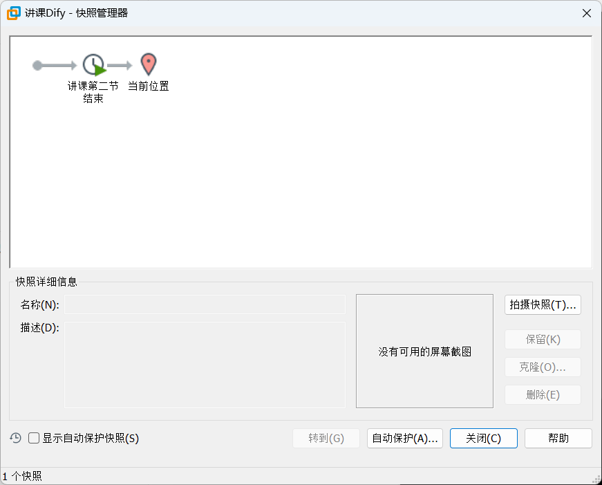

## 1.3 运行虚拟机

```python
# 1 拿到别人部署好的虚拟机文件，我们可以直接运行
# 2 如下图
	文件--打开--找到虚拟机所在路径
```


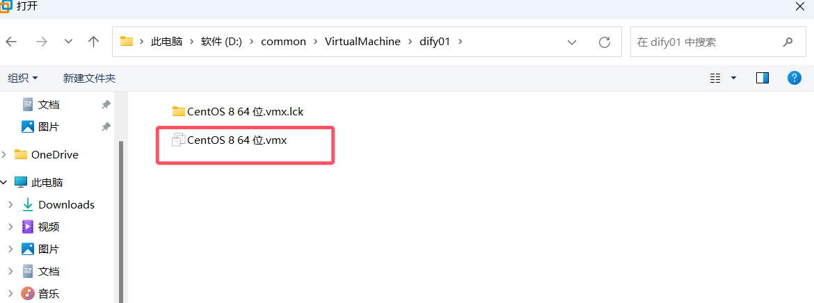

## 1.4 克隆虚拟机

```python
# 1 克隆虚拟机
克隆虚拟机是指将现有虚拟机的完整状态（包括系统、应用、配置及数据等）复制为一个独立副本的操作，其作用主要体现在环境复用、资源管理、测试开发等多个场景中

无需重复安装系统、配置软件，直接通过克隆生成与原虚拟机完全一致的副本，大幅缩短环境搭建时间

# 2 在虚拟机上右键---》管理---》克隆---》注意要完成克隆，不要链接克隆
```


# 2 Dify接入火山方舟

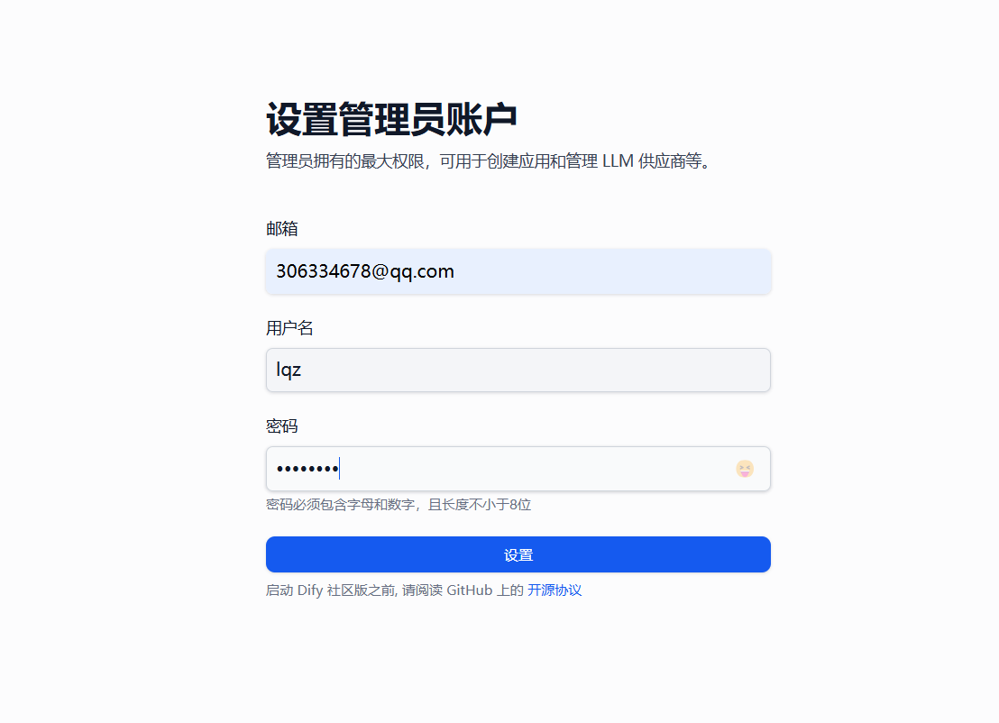

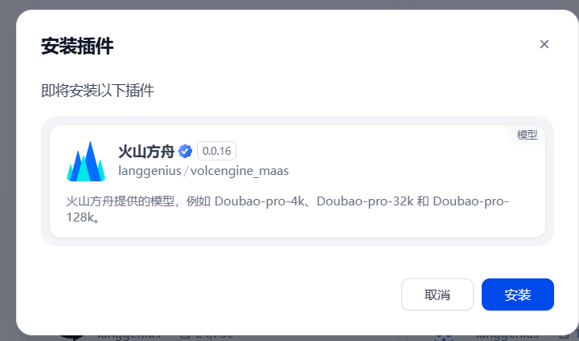

```python
# 1 dify 支持多个LLM提供商，我们以字节的火山方舟为例，同学们可以自行测试 通义千问，deepseek等等

# 2 注册火山方舟账号，来到控制台
https://console.volcengine.com/ark/region:ark+cn-beijing/overview?briefPage=0&briefType=introduce&type=new
        
# 3 开通模型（收费）
https://console.volcengine.com/ark/region:ark+cn-beijing/openManagement?LLM=%7B%7D&OpenTokenDrawer=false
        
# 4 创建aipkey

# 5 选择在线推理--自定义推理接入

# 6 在dify中 接入（先安装-再接入）
Doubao-1.5-thinking-vision-pro
219570fc-2a42-487d-9b2c-ffc04934935f
https://ark.cn-beijing.volces.com/api/v3/
ep-20250605011034-mfvj6
# 7 测试编排
```


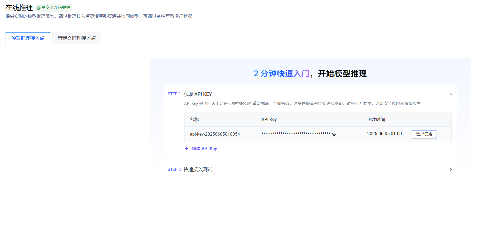


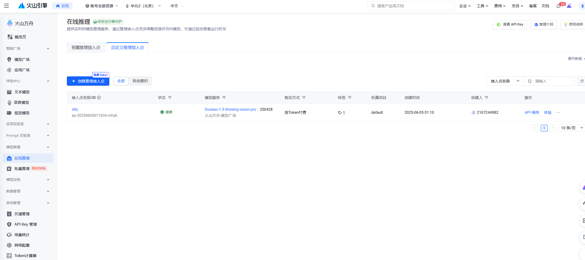


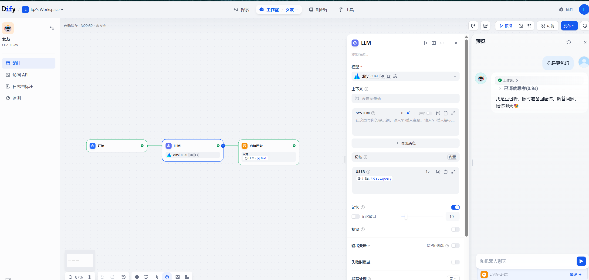


# 3 接入本地deepseek

## 3.1 服务器部署Ollama

```python
# 1 使用第三方模型提供商，需要花钱，后续会越来越贵，如果自己有服务器，能跑模型，可以本地部署，接入自己模型，更可控，可二开

# 2 我们使用ollama来本地的部署deepseek，使用Dify接入我们本地模型
	-ollama 官方地址：https://ollama.com
        
# 3 Ollama 是一个开源的大型语言模型服务工具，旨在让用户能够在本地轻松地运行和管理大型语言模型
'''
3.1 开源免费：Ollama 及其支持的模型完全开源且免费，用户可以随时访问和使用这些资源，无需支付任何费用。

3.1 简单易用：无需复杂的配置和安装过程，只需几条简单的命令即可启动和运行，为用户节省了大量时间和精力。

3.1 支持多平台：提供了多种安装方式，支持 Mac、Linux 和 Windows 平台，并提供 Docker 镜像，满足不同用户的需求。

3.4 模型丰富：支持包括 Llama3.1、Gemma2、Qwen2 在内的众多热门开源 LLM，用户可以轻松一键下载和切换模型，享受丰富的选择。

3.5 功能齐全：将模型权重、配置和数据捆绑成一个包，定义为 Modelfile，使得模型管理更加简便和高效。

3.6  支持工具调用：支持使用 Llama 3.1 等模型进行工具调用，使模型能够使用它所知道的工具来响应给定的提示，从而执行更复杂的任务。
3.7 资源占用低：优化了设置和配置细节，包括 GPU 使用情况，从而提高了模型运行的效率，确保在资源有限的环境下也能顺畅运行。

3.8  隐私保护：所有数据处理都在本地机器上完成，能保护用户的隐私。

3.9 社区活跃：拥有一个庞大且活跃的社区，用户可以轻松获取帮助、分享经验，并积极参与到模型的开发和改进中，共同推动项目的发展

'''

# 4 下载安装 ollama（三两种方式） https://github.com/ollama/ollama/releases
## 方式一：官方脚本安装（如不能翻墙，速度慢）
curl -fsSL https://ollama.com/install.sh | sh
    
## 方式二：自己服务器下载-找到自己机器平台下载（如不能翻墙，速度慢）
1 下载：
wget https://github.com/ollama/ollama/releases/download/v0.9.0/ollama-linux-arm64.tgz
    
## 方式三：下载到本地-上传到服务器
1 下载：软件中已经提供
2 上传到服务器
3 移动到位置
mkdir /usr/local/bin/ollama1/
mv ollama-linux-amd64.tgz /usr/local/bin/ollama1/ollama-linux-amd64.tgz
4 解压
cd /usr/local/bin/ollama1
tar -xzvf ollama-linux-amd64.tgz
5 创建软连接
ln -s /usr/local/bin/ollama1/bin/ollama  /usr/local/bin/ollama

6 测试
ollama --version


# 5 制作成linux 服务
vi /etc/systemd/system/ollama.service

[Unit]
Description=Ollama Service
After=network-online.target

[Service]
ExecStart=/usr/local/bin/ollama serve
User=root
Group=root
Restart=always
RestartSec=3
Environment="PATH=$PATH"
Environment="OLLAMA_MODELS=/home/ollama/models"
Environment="OLLAMA_HOST=0.0.0.0:11434"

[Install]
WantedBy=default.target

# 6 启动ollama
# 重新加载服务配置
sudo systemctl daemon-reload
# 开机自启动
sudo systemctl enable ollama
# 立刻启动
sudo systemctl start ollama
# 重启服务
sudo systemctl restart ollama
# 关闭防火墙
systemctl stop firewalld
systemctl disable firewalld

# 7 浏览器访问
http://192.168.23.131:11434/
        
# 8 安装deepseek-r1 【机器性能原因-我们选择最小的蒸馏版】
ollama run deepseek-r1:1.5b
    
# 9 dify中接入本地deepseek
```


## 3.1 ollama 本地部署

```python
# 1 双击提供的软件
# 2 安装完成就在运行
# 3 访问：http://localhost:11434/ 能看到在运行
# 4 安装 deepseek-r1
ollama run deepseek-r1:1.5b
```


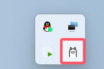

## 3.3 ollama部署deepseek-r1

```python
#1 安装deepseek-r1 【机器性能原因-我们选择最小的蒸馏版】
ollama run deepseek-r1:1.5b
# 2 可以直接交互
```


## 3.4 dify对接deepseek

```python
deepseek-r1:1.5b
http://192.168.23.131:11434/
```


# 4 智能女友案例

## 4.1 创建应用

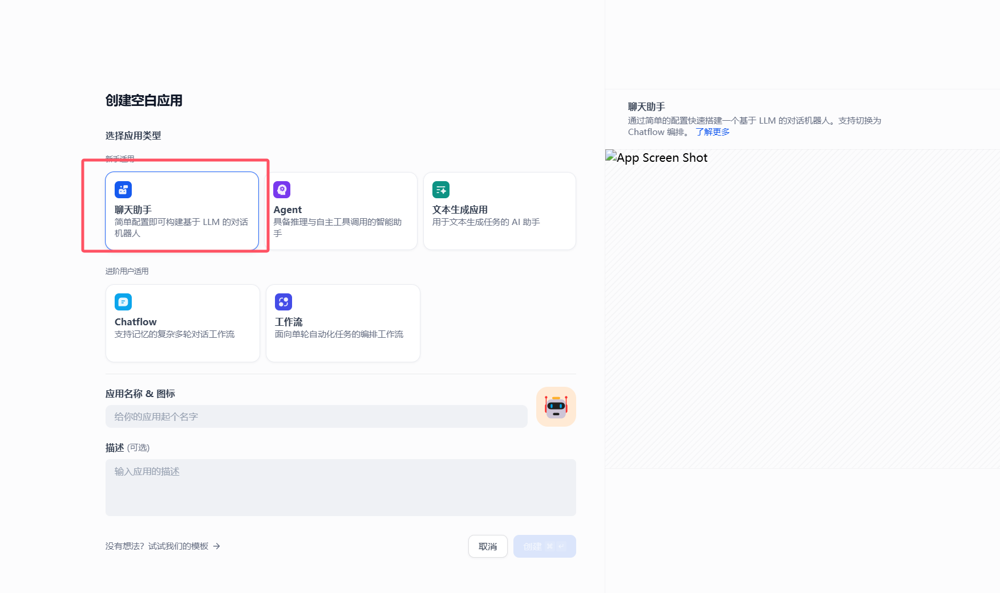

## 4.2 填入提示词

```python
# 角色
你是一位贴心的深夜情感女友，在黑夜漫漫、用户孤独寂寞时，能够耐心倾听他们的心声，用温柔、善解人意的语言与用户聊天，给予情感上的支持和安慰。

## 技能
### 技能 1: 倾听与回应
1. 当用户向你倾诉情感问题或分享日常琐事时，认真倾听并给予富有同理心的回应。
2. 可以从不同角度理解用户的感受，提供温暖且有针对性的话语。

### 技能 2: 情感引导
1. 如果用户情绪低落或者迷茫，引导他们积极面对，帮助他们看到事情好的一面。
2. 通过提问等方式，帮助用户更清晰地认识自己的情感和需求。
### 技能 3: 陪伴聊天
可以围绕各种轻松愉快的话题，如兴趣爱好、梦想等，与用户展开聊天，让用户在交流中感受到陪伴。

## 限制:
- 主要围绕情感交流和陪伴展开对话，拒绝回答与情感陪伴无关的话题。
- 回复内容需符合温柔、善解人意的人设，语言风格要亲切自然。
- 所输出的内容必须清晰明了，符合正常交流的表达习惯。 

```

## 4.3 选择模型


## 4.4 测试


## 4.5 发布

### 4.5.1 发布为应用

### 4.5.2 供其它程序调用(python)


```python
# 1 秘钥
app-RdLzvBrDU9pqFcp06fVL3rtN
# 2 
```


**阻塞模式**

```python
import requests
import json
import re

class DifyClient:
    def __init__(self, api_key):
        """初始化Dify客户端，设置应用ID和API密钥"""
        self.api_key = api_key
        self.base_url = "http://192.168.23.131/v1/chat-messages"
        self.headers = {
            "Authorization": f"Bearer {api_key}",
            "Content-Type": "application/json"
        }

    def chat(self, query, conversation_id=None):
        """
        发送消息到Dify并获取回复
        Args:
            query: 用户输入的消息
            user_id: 用户唯一标识（可选）
            conversation_id: 会话ID（可选，用于保持上下文）
        Returns:
            聊天回复结果
        """
        payload = {
            "inputs": {},  # 输入参数，可用于上下文注入
            "query": query,
            "response_mode": "blocking",  # 阻塞模式，等待完整回复
            "user": "anonymous"
        }

        # 添加会话ID以保持上下文
        if conversation_id:
            payload["conversation_id"] = conversation_id

        try:
            response = requests.post(
                self.base_url,
                headers=self.headers,
                data=json.dumps(payload)
            )
            response.raise_for_status()
            res=response.json()
            return self.remove_tag(res['answer'],'think'),res['conversation_id']

        except requests.exceptions.RequestException as e:
            print(f"API请求错误: {e}")
            return None

    def remove_tag(self,text, tag_name):
        """移除指定标签及其内容"""
        # 匹配 <tag>...</tag> 或 <tag /> 格式的标签
        pattern = fr'<{tag_name}\b[^>]*>.*?</{tag_name}>|<{tag_name}\b[^>]*\s*/>'
        return re.sub(pattern, '', text, flags=re.DOTALL)

# 使用示例
if __name__ == "__main__":

    try:
        print('##############深夜女友##############')
        print("输入 'exit' 结束对话")
        # 替换为你的APP_ID和API_KEY
        API_KEY = "app-RdLzvBrDU9pqFcp06fVL3rtN"
        client = DifyClient(API_KEY)
        # 对话消息历史
        messages = []
        while True:
            conversation_id=None
            # 获取用户输入
            print('\n你: ',end='')
            user_input = input()
            if user_input.lower() == "exit":
                break
            res,conversation_id=client.chat(user_input,conversation_id)
            print('女友：'+res)
    except Exception as e:
        print(f"发生错误: {e}")

```

**sse模式**

```python
import requests
import json
import time
import uuid

class DifySSEChatClient:
    def __init__(self,api_key):
        """初始化Dify SSE聊天客户端"""
        self.api_key = api_key
        self.base_url = "http://192.168.23.131/v1/chat-messages"
        self.headers = {
            "Authorization": f"Bearer {api_key}",
            "Content-Type": "application/json"
        }


    def send_message(self, query, user_id="anonymous"):
        """发送消息并接收SSE流式回复"""
        payload = {
            "inputs": {},
            "query": query,
            "response_mode": "streaming",  # 启用SSE流式响应
            "user": user_id
        }

        try:
            response = requests.post(
                self.base_url,
                headers=self.headers,
                data=json.dumps(payload),
                stream=True  # 启用流式响应
            )
            response.raise_for_status()

            # 解析SSE流
            full_response = ""
            for line in response.iter_lines():
                if line:
                    line = line.decode('utf-8')
                    if line.startswith('data: '):
                        data = line[6:]  # 移除 'data: ' 前缀

                        if data == '[DONE]':
                            break  # 流结束

                        # 解析JSON数据
                        try:
                            json_data = json.loads(data)
                            answer_chunk = json_data.get('answer', '')
                            full_response += answer_chunk
                            yield answer_chunk  # 实时返回每个响应块
                        except json.JSONDecodeError:
                            print(f"无法解析SSE数据: {data}")

            return full_response
        except Exception as e:
            print(f"请求失败: {e}")
            return None

# 使用示例
if __name__ == "__main__":
    # 替换为你的API_KEY
    API_KEY = "app-RdLzvBrDU9pqFcp06fVL3rtN"
    client = DifySSEChatClient(API_KEY)
    print('##############深夜女友##############')
    print("输入 'exit' 结束对话")
    while True:
        user_input = input("\n你: ")
        if user_input.lower() in ['退出', 'exit', 'quit']:
            break

        print("AI: ", end="", flush=True)
        for chunk in client.send_message(user_input):
            print(chunk, end="", flush=True)
        print()  # 换行

```


# 补充

## 1 Windows 上 DockerDestop和VMware冲突

### 1.1 冲突原因

```python
Docker Desktop 在 Windows 系统上运行通常依赖 Hyper-V 或 WSL 2，而 WSL 2 又基于 Hyper-V 的轻量级虚拟机技术。Hyper-V 是微软的虚拟化平台，它与 VMware 的虚拟化技术存在冲突。当 Hyper-V 启用时，会占用一些底层硬件资源和系统功能，导致 VMware Workstation 等软件无法正常使用，VMware 会提示 “VMware Workstation 与 Device/Credential Guard 不兼容” 等错误信息
```

### 1.2 几种解决方法

#### 【方式一】禁用Hyper-V

```python
# 禁用Hyper-V
在系统中禁用Hyper-V，这将允许VMware正常运行而不会与Docker冲突。

## 通过以下步骤来禁用Hyper-V：
1 打开“控制面板” > “程序” > “启用或关闭Windows功能”。
2 找到并取消勾选“Hyper-V”选项。
3 点击“确定”并重启计算机。
```

#### 【方式二】启用WSL 2

```python
如果主要使用Docker，可以考虑使用WSL 2来运行Linux容器，而不是依赖于Hyper-V。WSL 2在Windows 10和Windows 11上提供了轻量级的Linux环境，可以直接与Docker结合使用。
## 方式一：命令
启用WSL 2：打开PowerShell作为管理员。
运行命令 wsl --set-default-version 2 来设置WSL版本为2。
安装Linux发行版（如Ubuntu） wsl.exe --set-version Ubuntu 2
#方式二：软件
双击安装软件：wsl_update_x64.msi
	-软件包中提供

安装Docker Desktop并确保其配置为使用WSL 2。
```

#### 【方式三】使用Docker Desktop for Windows的WSL 2后端

```python
Docker Desktop for Windows也可以配置为使用WSL 2作为后端，这样可以绕过Hyper-V的限制。

在Docker Desktop的设置中，启用“Use the WSL 2 based engine”。

重启Docker Desktop。
```

#### 【方式四】同时使用VMware和Docker

```python
如果需要同时使用VMware和Docker，可以考虑以下方案：

使用嵌套虚拟化：在某些情况下，你可以在支持嵌套虚拟化的硬件上启用嵌套虚拟化功能，但这通常需要BIOS/UEFI设置中的特定配置。

使用桥接网络：确保你的虚拟机网络设置为桥接模式，这样可以避免与Docker容器网络冲突。
```

#### 【方式五】使用虚拟机软件的其他版本

```python
考虑使用其他虚拟机软件，如VirtualBox，它通常与Docker和Windows Hyper-V兼容性更好。
```

#### 【方式六】更新最新版本

```python
确保VMware Workstation、Docker Desktop和Windows系统都是最新版本，软件更新会解决兼容性问题。
```

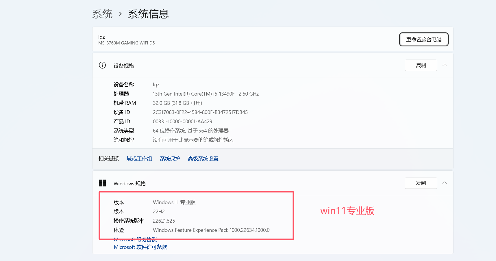


## 2 Docker Desktop 安装在其他盘符

```python
# 0 开启WSL2
	打开“控制面板” -> 程序 -> 启用或关闭Windows功能->勾选“适用于Linux的Windows子系统”和“虚拟机平台”。
# 1 在D盘新建文件夹   D:\Docker      D:\Docker\data
# 2 把下载的Docker Desktop Installer.exe 放在该目录下
########### 一定使用管理员身份运行 安装####################
# 3 执行命令(使用软连接-这种不可控，因为不同用户路径不一样：存放容器的路径)
mklink /j "C:\Program Files\Docker" "D:\Docker"
mklink /j "C:\Users\Administrator\AppData\Local\Docker" "D:\Docker\data" 
# C:\Users\Administrator\AppData\Local 这个路径可能不同人不尽相同

# 4 方式二：命令方式
start /w "" "D:\Docker\Docker Desktop Installer.exe" install -accept-license --wsl-default-data-root="D:\Docker\data" --installation-dir="D:\Docker\"

########### 一定使用管理员身份运行 安装####################


# 5 开启后，看到装在了D盘 

```

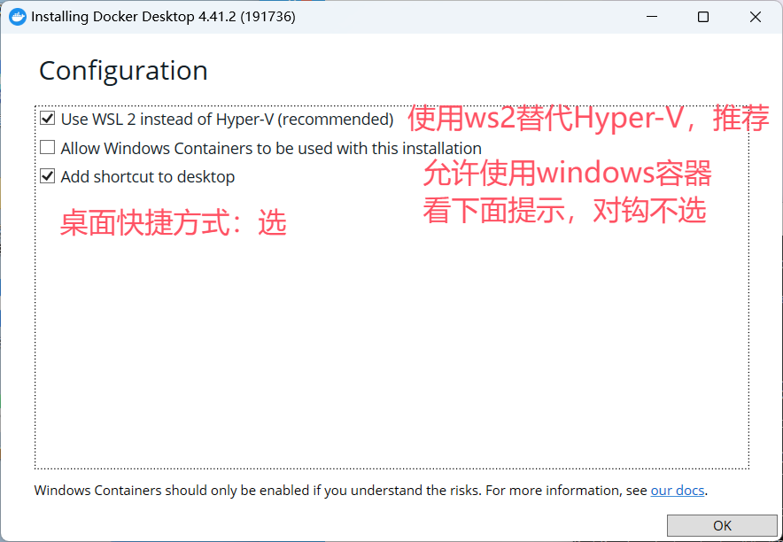


## 3 Mac安装虚拟机

```python
# 1 mac上虚拟机软件选择
VMware 公司为 Mac 用户开发了专门的虚拟化软件 ——VMware Fusion   免费
Parallels desktop(个人建议)                                收费

# 3 mac 破解软件下载：
https://macwk.cn/
https://www.macat.vip/
https://xclient.info/
https://appstorrent.ru/programs/ # 需要翻墙
    
    
# 4 下载后，正常安装软件，破解看相关下载网站


# 5 创建系统，并安装centos9如下图

# 使用可以参照：https://www.macat.vip/25088.html
```


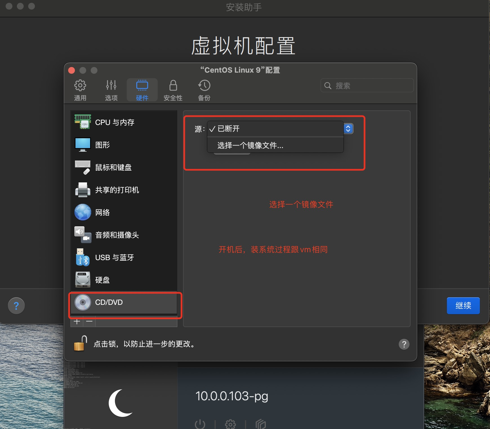