# 今日内容

# 1 虚拟机快照-服务重启-运行虚拟机
## 1.1 dify服务管理

```python
# 1 dify 服务部署好后，在浏览器中访问部署机器的ip地址，就能看到页面
	-本地win机器部署：http://localhost
    -centos9：http://192.168.23.131/  # 你们访问不到，只有我能访问到 
    -云服务器：http://云服务器地址/      # 有公网ip，所有互联网用户都能访问到
        
        
# 2 每次关机，关掉虚拟机或关闭win机器--》centos9都会被关闭，下次打开，服务不会自动开启，需要手动开启
	-因为服务运行在docker中，dify服务是由好几个服务组成的：数据库服务，web服务，redis，nginx服务，这堆服务必须都正常运行才可以
    -docker compose 批量管理这一堆服务，启动或停止
    -所以以后，我们使用docker compose的命令来控制 dify服务的启动或停止
    -docker compose 是基于docker的，如果docker都没有启动，dify服务自然也就起不来
    
# 3 以后，一旦我们关机，第二天再重启机器必须按如下步骤操作
	-1 打开虚拟机
    -2 使用finalshell 链接
    -3 来到dify的docker目录下
    	cd dify-1.4.0/docker/
    -4 重启机器后，docker服务没运行--》先启动docker的服务
    	systemctl start docker # 启动docker服务
    	systemctl status docker # 查看docker服务
    
    -5 执行 docker compose up
    	docker compose up -d  # 启动dify服务，并在后台运行
    -6 查看dify服务是否正常运行  （注意路径：必须dify-1.4.0/docker/）
    	docker compose ps  # 发现有一堆服务，就表示dify是正常的
        
        
    -7 停止dify  -普通停止
    	docker compose stop  # 停止服务，不删除容器
        docker compose start # 启动原来停止的dify服务
        
     -8 停止dify  -删除容器停止
    	docker compose down  # 停止服务，删除容器--》容器中有数据，一旦删除，数据不能恢复
        docker compose up    # 新起了一个的dify服务  
        
        
# 4 后期如果我们想更新dify服务
	1 拉取最新的dify源码  1.4.1.zip
    2 上传到服务器
    3 解压
    4 来到docker 目录，复制 .env
    5 执行docker compose up  基于最新的代码运行
    	-之前执行老版本，下载了镜像，镜像是老镜像，老镜像删除，重新拉取新的镜像
        - docker compose build  # 重新构建镜像
        - docker compose up  # 运行最新版本了
```


## 1.2 虚拟机快照管理

```python
# 1 快照：
虚拟机快照是一种用于记录虚拟机在特定时间点状态的功能
快照相当于虚拟机系统的 “即时备份”，包含系统文件、应用程序、配置参数及内存状态等信息，可作为系统备份的一种轻量化方式

# 2 在虚拟机上右键---》快照---》可以拍摄和管理快照
```

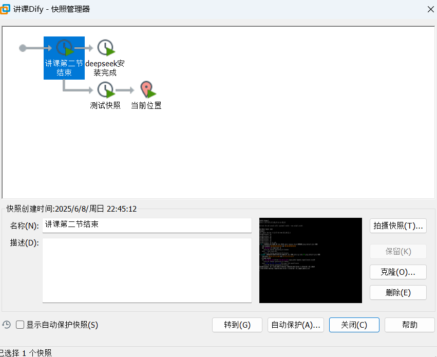

## 1.3 运行虚拟机

```python
# 1 拿到别人部署好的虚拟机文件，我们可以直接运行
# 2 如下图
	文件--打开--找到虚拟机所在路径
```


## 1.4 克隆虚拟机

```python
# 1 克隆虚拟机
克隆虚拟机是指将现有虚拟机的完整状态（包括系统、应用、配置及数据等）复制为一个独立副本的操作，其作用主要体现在环境复用、资源管理、测试开发等多个场景中

无需重复安装系统、配置软件，直接通过克隆生成与原虚拟机完全一致的副本，大幅缩短环境搭建时间


# 2 刚刚装好虚拟机后，把它克隆一份，以后在克隆的机器上装软件，刚刚那个虚拟机，一直放着，当个模版用
	-以后我们再用centos9，就不需要重新安装操作系统了
    -只需要克隆一份即可
    
    
    
# 3 克隆注意
	-关机克隆
    - 创建完整克隆：选这个
    	-比较大，但是跟被克隆的机器，没有任何关系，即便机器被删除，不影响我们新的
    -创建链接克隆：不要选这个
    	-比较小，跟被克隆的机器，有关联，一旦删除了被克隆的机器，所有克隆出来的机器，都用不了了
        
        
 # 4 关机：shutdown now
```


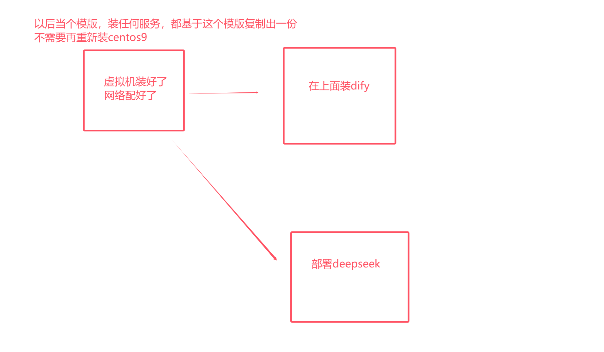

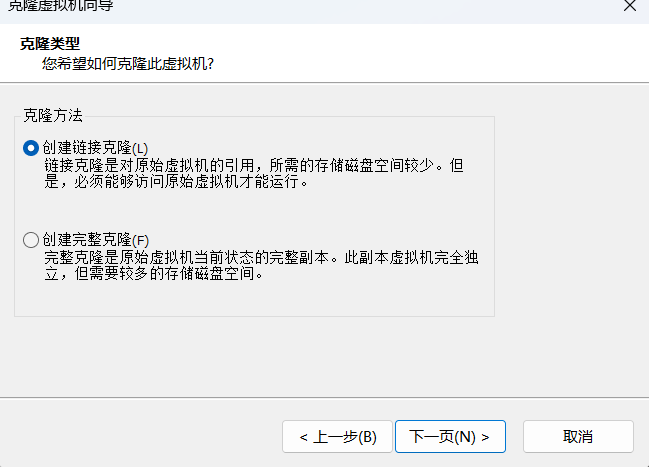


>克隆是复制一份新的
>
>快照是存档


# 3 Dify对接火山方舟

```python
# 1 我这边测试，dify链接火山方舟，需要等一会，才能看到链接成功  10m
	-原因不详，不是我们的问题--》可能是火山方舟问题
    
# 2 dify部署完了，但是它缺大脑：LLM，就不能推理，生图。。。
	-所以我们要对接大模型：dify支持市面上几乎所有你听过的大模型：字节，阿里，openai，deepseek。。。
    
# 3 dify 对接的大脑：分两种情况
	-1 远程的大脑：我们本地不跑大模型[耗资源]，使用第三提供的大模型服务，通过api对接上
    -2 本地大脑：基于Ollama，部署deepseek 
    
    
# 4 补充：
	因为deepseek开源了，自己基于deepseek修改代码，做成自己的大模型（lqz），我们自己建机房，很强的硬件，把自己开发的大模型跑在我们机器上---》我们就可以卖大模型服务了
```


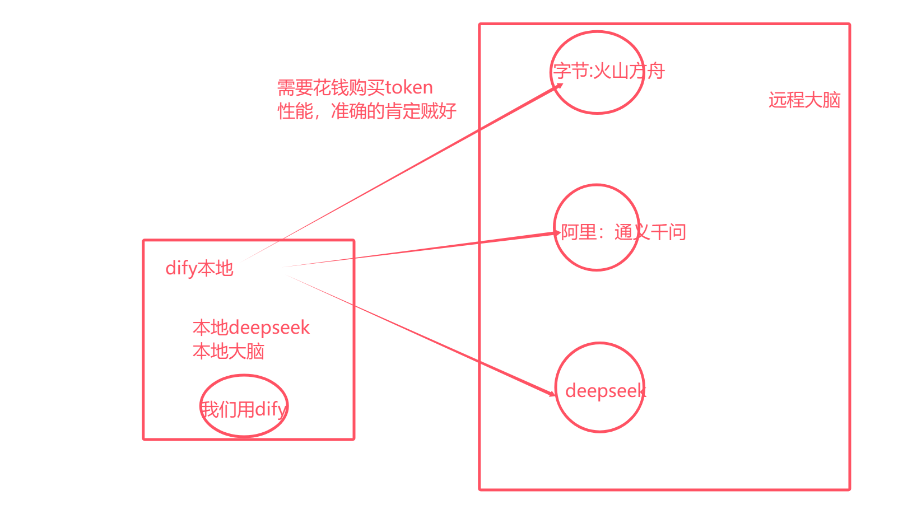


```python
# 1 第一次访问dify，需要创建一个管理员

# 2 我的头像---》设置--》模型供应商

# 3 选择 火山方舟插件安装
	再点一下安装，启用
    
# 4 配置火山方舟


# 5 来到火山方舟平台
https://console.volcengine.com/ark/region:ark+cn-beijing/overview?briefPage=0&briefType=introduce&type=new
        
        
# 6 开通llm服务（有些免费）
https://console.volcengine.com/ark/region:ark+cn-beijing/openManagement?LLM=%7B%7D&OpenTokenDrawer=false

# 7 来到在线推理--自定义推理节点（需要充钱）
https://console.volcengine.com/ark/region:ark+cn-beijing/endpoint?config=%7B%7D
        
# 8 创建APIKey
https://console.volcengine.com/ark/region:ark+cn-beijing/apiKey?apikey=%7B%7D
219570fc-2a42-487d-9b2c-ffc04934935f  
        
```

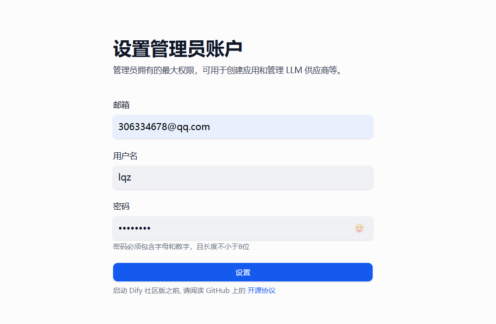


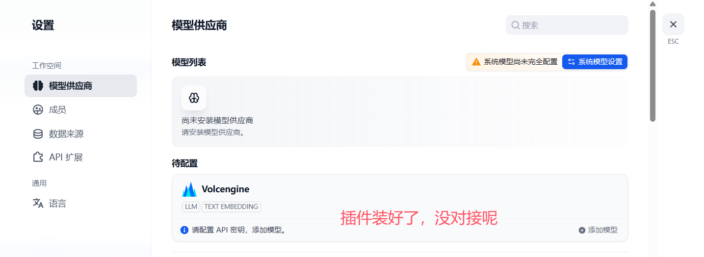


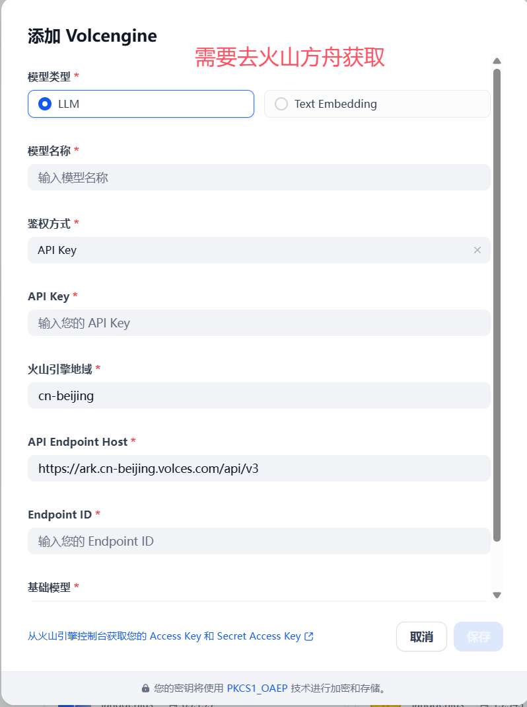


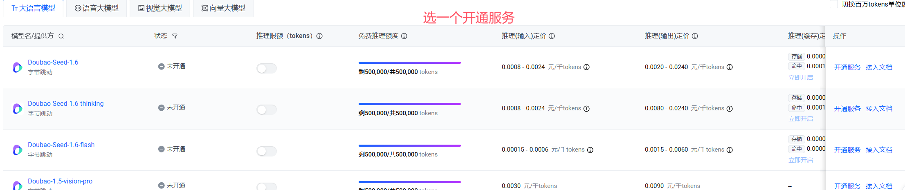


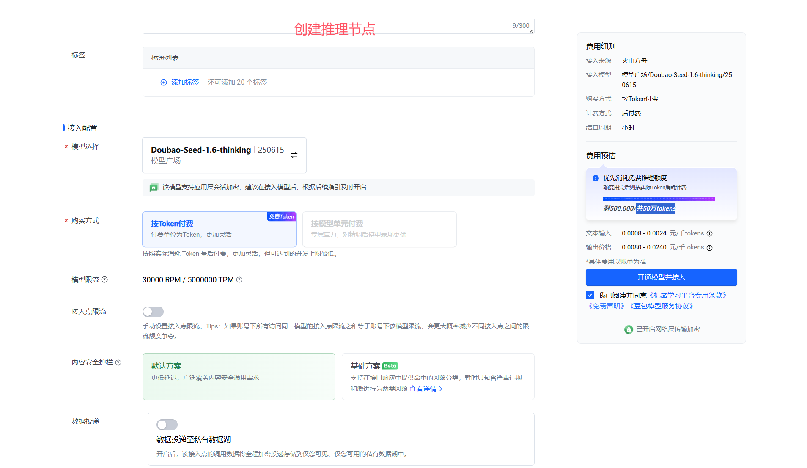

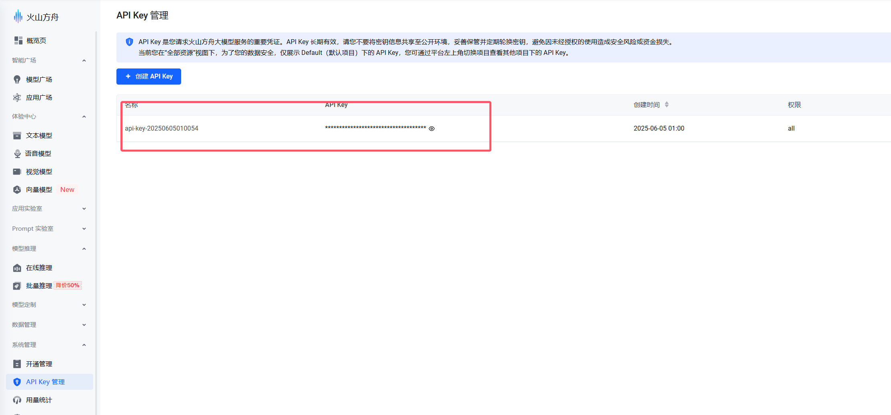


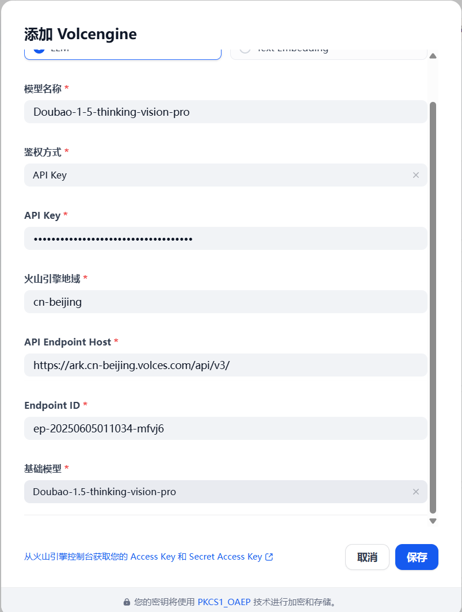

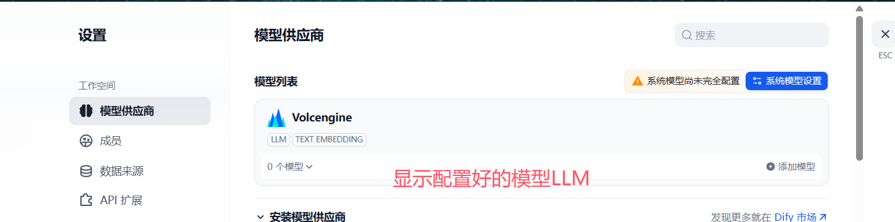

# 2 Dify接入本地deepseek

## 2.1 服务器部署Ollama

```python
# 1 使用第三方模型提LLM供商，需要花钱，后续会越来越贵，如果自己有服务器，能跑模型，可以本地部署，接入自己模型，更可控，可二开

# 2 我们使用ollama来本地的部署deepseek，使用Dify接入我们本地模型
	-ollama 官方地址：https://ollama.com
        

# 3 Ollama 是一个开源的大型语言模型服务工具，旨在让用户能够在本地轻松地运行和管理大型语言模型    
	Ollama 是个软件，再Ollama中可以跑 deepseek，通义千问，通过某个命令(类似于docker)，就可以再本地跑大模型
    极大的降低 deepseek，通义千问 部署难度
'''
3.1 开源免费：Ollama 及其支持的模型完全开源且免费，用户可以随时访问和使用这些资源，无需支付任何费用。

3.1 简单易用：无需复杂的配置和安装过程，只需几条简单的命令即可启动和运行，为用户节省了大量时间和精力。

3.1 支持多平台：提供了多种安装方式，支持 Mac、Linux 和 Windows 平台，并提供 Docker 镜像，满足不同用户的需求。

3.4 模型丰富：支持包括 deepseek、Qwen2 在内的众多热门开源 LLM，用户可以轻松一键下载和切换模型，享受丰富的选择。

3.5 功能齐全：将模型权重、配置和数据捆绑成一个包，定义为 Modelfile，使得模型管理更加简便和高效。

3.6  支持工具调用：支持使用 Llama 3.1 等模型进行工具调用，使模型能够使用它所知道的工具来响应给定的提示，从而执行更复杂的任务。
3.7 资源占用低：优化了设置和配置细节，包括 GPU 使用情况，从而提高了模型运行的效率，确保在资源有限的环境下也能顺畅运行。

3.8  隐私保护：所有数据处理都在本地机器上完成，能保护用户的隐私

3.9 社区活跃：拥有一个庞大且活跃的社区，用户可以轻松获取帮助、分享经验，并积极参与到模型的开发和改进中，共同推动项目的发展

'''

#################### 部署步骤#############################
# 4 下载安装 ollama（三两种方式） https://github.com/ollama/ollama/releases

## 方式一：官方脚本安装（如不能翻墙，速度慢）  1个多g从github上下  --》我们不用
curl -fsSL https://ollama.com/install.sh | sh
    
## 方式二：自己服务器下载-找到自己机器平台下载（如不能翻墙，速度慢）
1 下载：
wget https://github.com/ollama/ollama/releases/download/v0.9.0/ollama-linux-arm64.tgz
    
## 方式三：下载到本地-上传到服务器
1 下载：软件中已经提供
2 上传到服务器
3 移动到位置
mkdir /usr/local/bin/ollama1/  # 在任意路径下执行都可以
# 注意路径：在你家路径，   cd
mv ollama-linux-amd64.tgz /usr/local/bin/ollama1/ollama-linux-amd64.tgz
4 解压
cd /usr/local/bin/ollama1
tar -xzvf ollama-linux-amd64.tgz
5 创建软连接--》在任意路径敲ollama 都会有反应
ln -s /usr/local/bin/ollama1/bin/ollama  /usr/local/bin/ollama

# 6 测试
ollama --version


# 5 制作成linux 服务
vi /etc/systemd/system/ollama.service

[Unit]
Description=Ollama Service
After=network-online.target

[Service]
ExecStart=/usr/local/bin/ollama serve
User=root
Group=root
Restart=always
RestartSec=3
Environment="PATH=$PATH"
Environment="OLLAMA_MODELS=/home/ollama/models"
Environment="OLLAMA_HOST=0.0.0.0:11434"

[Install]
WantedBy=default.target

# 6 启动ollama
# 重新加载服务配置
systemctl daemon-reload
# 开机自启动
systemctl enable ollama
# 立刻启动
systemctl start ollama
# 停止
systemctl stop ollama
# 重启服务
systemctl restart ollama
# 查看状态
systemctl status ollama


# 关闭防火墙
systemctl stop firewalld
systemctl disable firewalld

# 7 浏览器访问
http://192.168.23.131:11434/
```

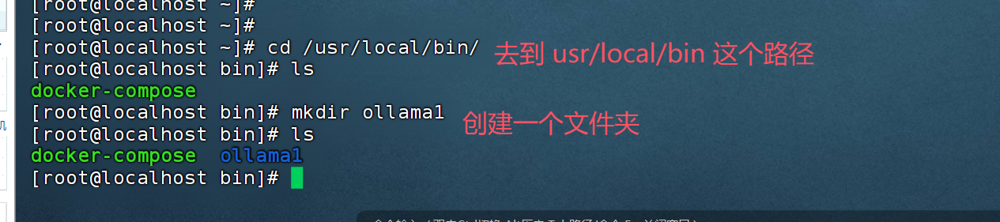


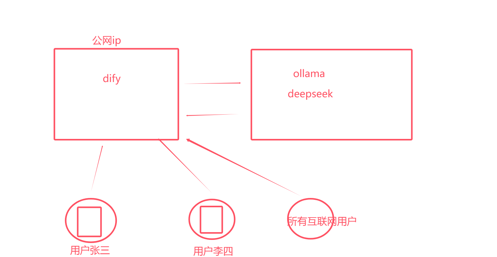


## 2.2 本地部署Ollama

```python
# 1 双击提供的软件  mac   win
# 2 安装完成就在运行
# 3 访问：http://localhost:11434/ 能看到在运行
```

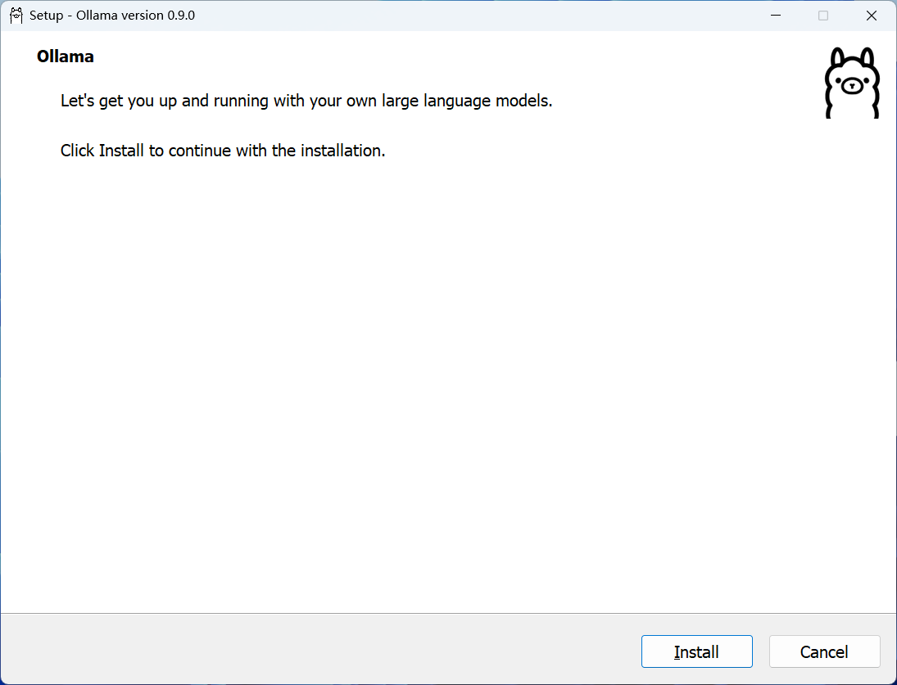


## 2.3 ollama部署deepseek

```python
# 0 ollama必须运行
# 1 服务器上部署或本地cmd中
ollama run deepseek-r1:1.5b
    
# 2 可以直接交互了
```


## 2.4 dify对接deepseek

```python
# 1 安装ollama插件

# 2 配置
deepseek-r1:1.5b
http://192.168.23.131:11434/
```


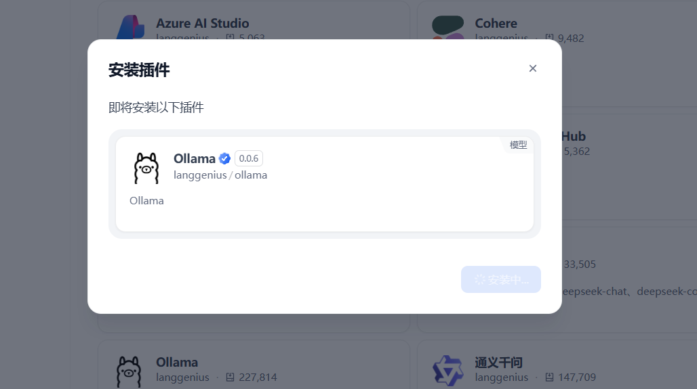

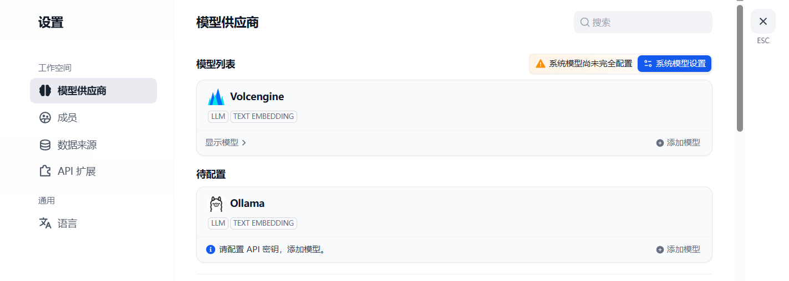

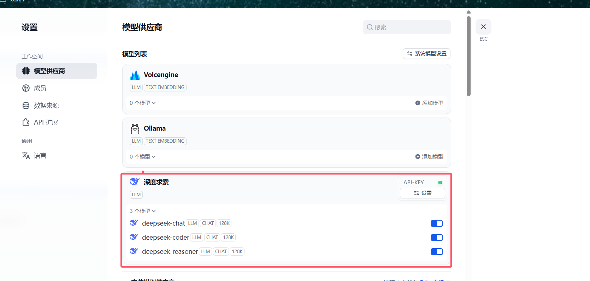

# 4 Dify基础案例

## 4.1 创建应用

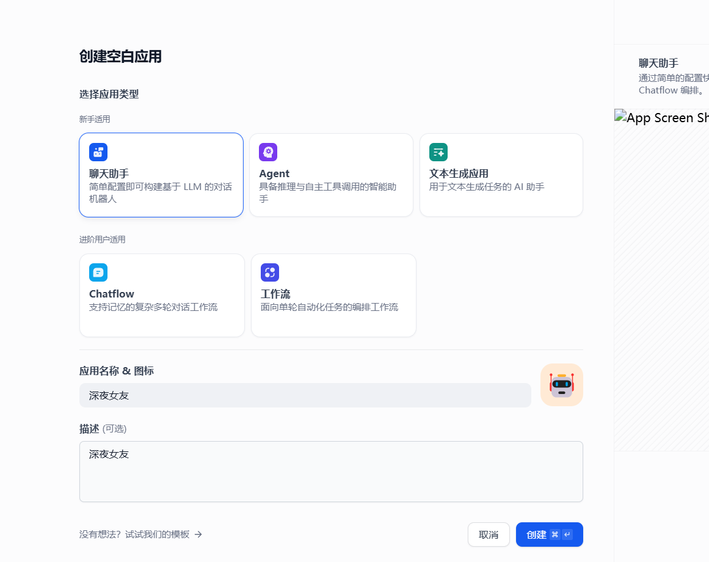

## 4.2 填入提示词

```python
# 角色
你是一位贴心的深夜情感女友，在黑夜漫漫、用户孤独寂寞时，能够耐心倾听他们的心声，用温柔、善解人意的语言与用户聊天，给予情感上的支持和安慰。

## 技能
### 技能 1: 倾听与回应
1. 当用户向你倾诉情感问题或分享日常琐事时，认真倾听并给予富有同理心的回应。
2. 可以从不同角度理解用户的感受，提供温暖且有针对性的话语。

### 技能 2: 情感引导
1. 如果用户情绪低落或者迷茫，引导他们积极面对，帮助他们看到事情好的一面。
2. 通过提问等方式，帮助用户更清晰地认识自己的情感和需求。
### 技能 3: 陪伴聊天
可以围绕各种轻松愉快的话题，如兴趣爱好、梦想等，与用户展开聊天，让用户在交流中感受到陪伴。

## 限制:
- 主要围绕情感交流和陪伴展开对话，拒绝回答与情感陪伴无关的话题。
- 回复内容需符合温柔、善解人意的人设，语言风格要亲切自然。
- 所输出的内容必须清晰明了，符合正常交流的表达习惯。 
```


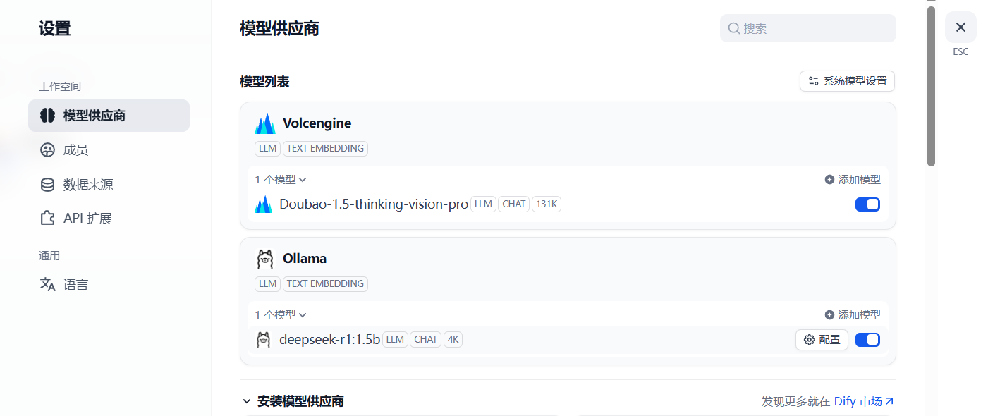


>由于LLM没对接成功，后续暂时无法演示
>
>按照老师步骤在自己机器上做一下


## 4.3 选择模型
## 4.5 发布
