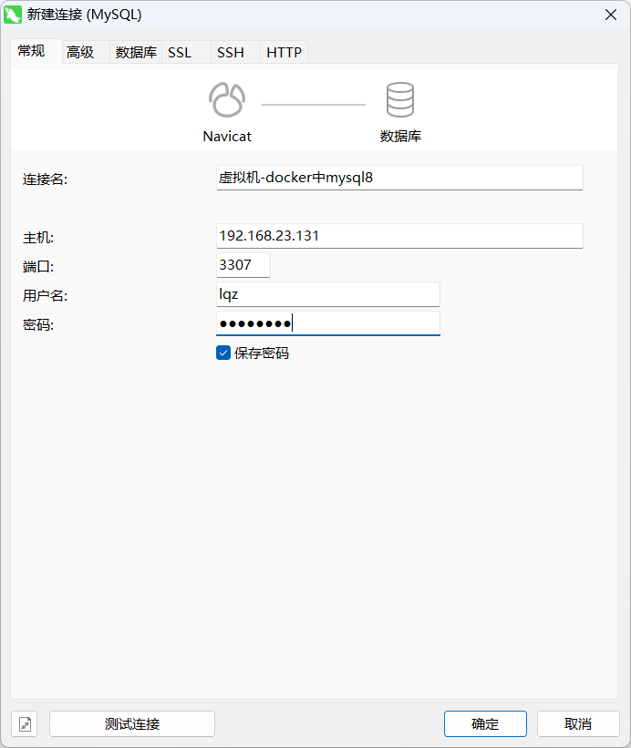
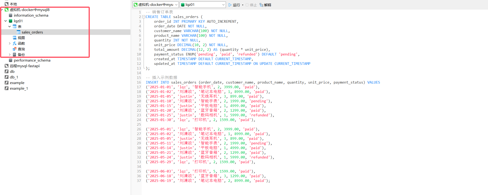
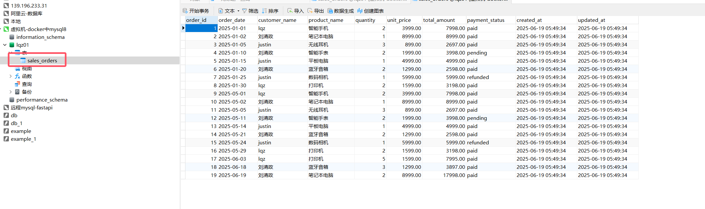
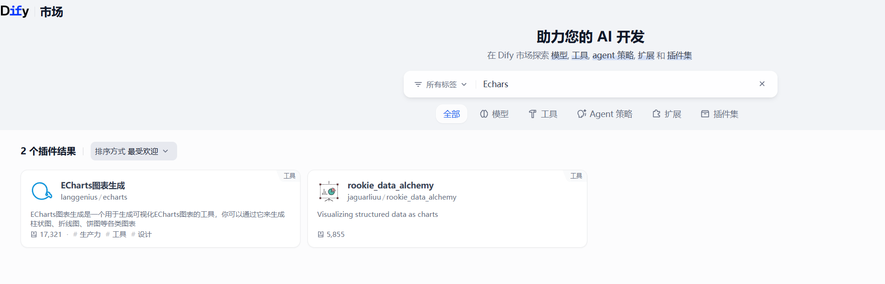
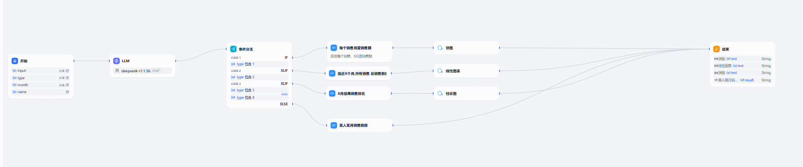
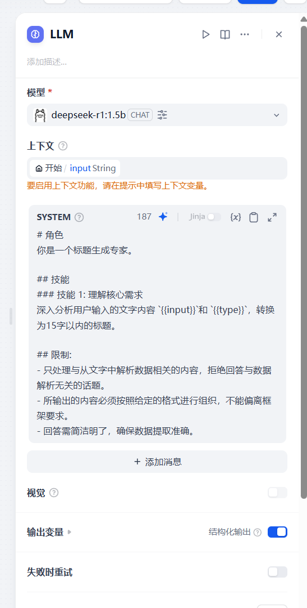
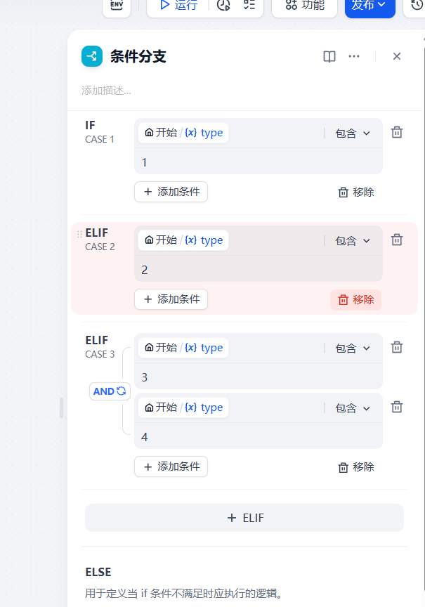
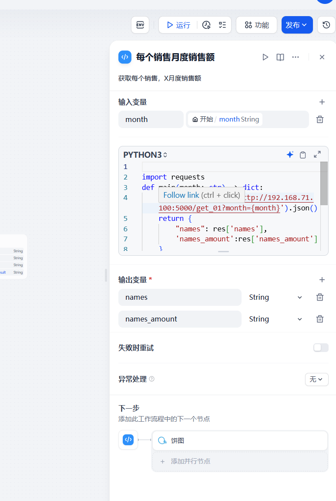
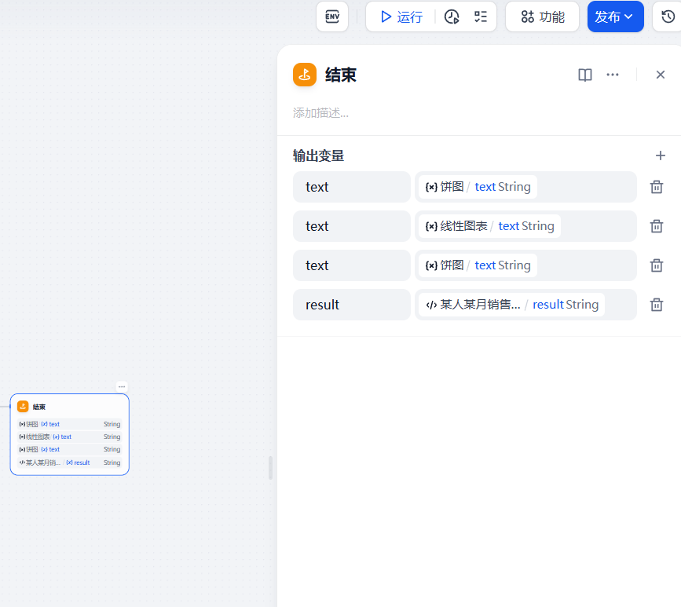

# 0 大模型对接问题

```python
### 在 .env 中添加

# 启用自定义模型
CUSTOM_MODEL_ENABLED=true
# 指定 Ollama 的 API 地址（根据部署环境调整 IP）
OLLAMA_API_BASE_URL=http://192.168.23.133:11434

# PLUGIN_WORKING_PATH=/app/cwd
PROVIDER_OLLAMA_API_BASE_URL=http://192.168.23.133:11434
PLUGIN_WORKING_PATH=/app/cwd


#修改 docker-compose.yml 中 plugin_daemon 服务的配置，避免安装超时中断
PLUGIN_PYTHON_ENV_INIT_TIMEOUT=640
PLUGIN_MAX_EXECUTION_TIMEOUT=2400
PIP_MIRROR_URL=https://mirrors.aliyun.com/pypi/simple  # 加速依赖安装

    
docker compose down
docker compose up
```


# 1  准备


## 1.1 docker中安装mysql

```python
# 1 mysql 官方镜像：https://hub.docker.com/_/mysql
# 2 拉取 mysql 8
docker pull mysql:8.4.5
    
    
# 3 创建文件夹，授权   
mkdir -p /home/lqz/mysql/data
mkdir -p /home/lqz/mysql/logs
chown -R 999:999 /home/lqz/mysql/data
chown -R 999:999 /home/lqz/mysql/logs
    
# 4 创建mysql配置文件
cd /home/lqz/mysql
vi my.cnf

[mysqld]
# MySQL 数据存储路径
datadir=/var/lib/mysql

# MySQL 错误日志路径
log-error=/var/log/mysql/error.log

# 启用远程连接
bind-address=0.0.0.0

# 设置字符集为 utf8mb4
character-set-server=utf8mb4

# 默认排序规则为 utf8mb4_0900_ai_ci，若需兼容 MySQL 5.7 可使用 utf8mb4_unicode_ci
collation-server=utf8mb4_0900_ai_ci

# 5 启动mysql 
docker run -d \
  --name mysql8 \
  -e MYSQL_ROOT_PASSWORD=lqz12345 \
  -e MYSQL_DATABASE=lqz01 \
  -e MYSQL_USER=lqz \
  -e MYSQL_PASSWORD=lqz12345 \
  -p 3307:3306 \
  -v /home/lqz/mysql/my.cnf:/etc/mysql/my.cnf \
  -v /home/lqz/mysql/data:/var/lib/mysql \
  -v /home/lqz/mysql/logs:/var/log/mysql \
  mysql:8.4.5

# 6 查看mysql8是否正常启动
docker ps |grep mysql8

# 7 本地win-远程链接

```

>假设你有一个运行 MySQL 的 Docker 容器，容器内的 MySQL 进程使用 UID 999 的用户运行。当你将主机上的 `/data/mysql` 目录挂载到容器内时，需要确保该目录及其内容归 UID 999 所有：
>
>```bash
>chown -R 999:999 /home/lqz/mysql/data
>chown -R 999:999 /home/lqz/mysql/logs
>```
>
>这样，容器内的 MySQL 进程就可以正常读写这些文件，而不需要提升为 root 权限




## 1.2 创建销售订单表，插入测试数据

```sql
-- 销售订单表
CREATE TABLE sales_orders (
    id INT PRIMARY KEY AUTO_INCREMENT,
    order_date VARCHAR(100) NOT NULL,
    customer_name VARCHAR(100) NOT NULL,
    product_name VARCHAR(100) NOT NULL,
    quantity INT NOT NULL,
    unit_price DECIMAL(10, 2) NOT NULL,
    total_amount DECIMAL(12, 2) AS (quantity * unit_price),
);

-- 插入示例数据
INSERT INTO sales_orders (order_date, customer_name, product_name, quantity, unit_price) VALUES
('2025-01', 'lqz', '智能手机', 2, 3999.00),
('2025-01', '刘清政', '笔记本电脑', 1, 8999.00),
('2025-01', 'justin', '无线耳机', 3, 899.00),
('2025-01', '张三', '智能手表', 2, 1999.00),
('2025-01', '李四', '平板电脑', 1, 4999.00),
('2025-01', '王五', '蓝牙音箱', 2, 1299.00),
('2025-01', '赵六', '数码相机', 1, 5999.00),

('2025-02', 'lqz', '智能手机', 3, 3999.00),
('2025-02', '刘清政', '笔记本电脑', 4, 8999.00),
('2025-02', 'justin', '无线耳机', 7, 899.00),
('2025-02', '张三', '智能手表', 5, 1999.00),
('2025-02', '李四', '平板电脑', 8, 4999.00),
('2025-02', '王五', '蓝牙音箱', 1, 1299.00),
('2025-02', '赵六', '数码相机', 9, 5999.00),

('2025-03', 'lqz', '智能手机', 9, 3999.00),
('2025-03', '刘清政', '笔记本电脑', 6, 8999.00),
('2025-03', 'justin', '无线耳机', 7, 899.00),
('2025-03', '张三', '智能手表', 8, 1999.00),
('2025-03', '李四', '平板电脑', 8, 4999.00),
('2025-03', '王五', '蓝牙音箱', 4, 1299.00),
('2025-03', '赵六', '数码相机', 9, 5999.00),

('2025-04', 'lqz', '智能手机', 9, 3999.00),
('2025-04', '刘清政', '笔记本电脑', 6, 8999.00),
('2025-04', 'justin', '无线耳机', 7, 899.00),
('2025-04', '张三', '智能手表', 8, 1999.00),
('2025-04', '李四', '平板电脑', 8, 4999.00),
('2025-04', '王五', '蓝牙音箱', 4, 1299.00),
('2025-04', '赵六', '数码相机', 9, 5999.00),

('2025-05', 'lqz', '智能手机', 5, 3999.00),
('2025-05', '刘清政', '笔记本电脑', 6, 8999.00),
('2025-05', 'justin', '无线耳机', 2, 899.00),
('2025-05', '张三', '智能手表', 3, 1999.00),
('2025-05', '李四', '平板电脑', 6, 4999.00),
('2025-05', '王五', '蓝牙音箱', 4, 1299.00),
('2025-05', '赵六', '数码相机', 6, 5999.00);

```





## 1.3 搭建fastapi服务

```python
# 1 安装
pip3 install fastapi
pip install uvicorn
pip install aiomysql
# 3 编写 main.py
#pip install  python-dateutil
from fastapi import FastAPI

import datetime

def get_previous_month(months: int) -> str:
    # 验证输入
    if not isinstance(months, int) or months < 0:
        raise ValueError("月份数必须是一个非负整数")
    # 获取当前日期
    current_date = datetime.datetime.now()
    current_year = current_date.year
    current_month = current_date.month
    # 计算前推指定月数后的年月
    # 先计算总月数
    total_months = current_year * 12 + current_month - months
    # 计算年份和月份
    target_year = total_months // 12
    target_month = total_months % 12
    # 处理月份为0的情况（表示12月）
    if target_month == 0:
        target_month = 12
        target_year -= 1
    # 格式化并返回年月信息
    return f"{target_year:04d}-{target_month:02d}"
import aiomysql
app = FastAPI()
@app.get('/get_data')
async def get_data():
    names=''
    names_amount=''
    async with aiomysql.connect(host='192.168.23.131', port=3307, user='lqz', password='lqz12345', db='lqz01') as conn:
        cur = await conn.cursor(aiomysql.DictCursor)
        await cur.execute("SELECT customer_name,total_amount FROM sales_orders")
        result = await cur.fetchall()
        return {'results':result}
@app.get('/get_01') # 获取每个销售，月度销售额
async def get_01(month:str='2025-02'):
    names=''
    names_amount=''
    async with aiomysql.connect(host='192.168.23.131', port=3307, user='lqz', password='lqz12345', db='lqz01') as conn:
        cur = await conn.cursor()
        await cur.execute("SELECT customer_name,total_amount FROM sales_orders where order_date=%s",month)
        result = await cur.fetchall()
        for item in result:
            names += item[0] + ';'
            names_amount += str(item[1]) + ';'
        return {'names':names[:-1],'names_amount':names_amount[:-1]}
@app.get('/get_02') # 获取最近X个月总销售数据
async def get_02(month:int=3):
    dates=''
    total_amounts=''
    # 格式化并返回年月信息
    real_month=get_previous_month(month)
    async with aiomysql.connect(host='192.168.23.131', port=3307, user='lqz', password='lqz12345', db='lqz01') as conn:
        cur = await conn.cursor()
        await cur.execute("SELECT order_date,SUM(total_amount) as total FROM sales_orders GROUP BY  order_date HAVING order_date>=%s",real_month)
        result = await cur.fetchall()
        for item in result:
            dates += item[0] + ';'
            total_amounts += str(item[1]) + ';'
        return {'dates': dates[:-1], 'total_amounts': total_amounts[:-1]}
@app.get('/get_03') # 获取  X 月份销售最高排名
async def get_03(month:str='2025-02'):
    names=''
    names_amount=''
    async with aiomysql.connect(host='192.168.23.131', port=3307, user='lqz', password='lqz12345', db='lqz01') as conn:
        cur = await conn.cursor()
        await cur.execute("SELECT customer_name,total_amount  FROM sales_orders where order_date=%s order by total_amount DESC LIMIT 3",month)
        result = await cur.fetchall()
        for item in result:
            names += item[0] + ';'
            names_amount += str(item[1]) + ';'
        return {'names':names[:-1],'names_amount':names_amount[:-1]}
@app.get('/get_04') # 获取 YY 的  X 月份销售数据
async def get_04(month:str='2025-01',name:str='justin'):
    async with aiomysql.connect(host='192.168.23.131', port=3307, user='lqz', password='lqz12345', db='lqz01') as conn:
        cur = await conn.cursor()
        await cur.execute("SELECT customer_name,total_amount FROM sales_orders where customer_name = %s and order_date=%s;",(name,month))
        result = await cur.fetchall()
        return f'{name}的第{month}个月，总销售额为：{result[0][1]}'


if __name__ == "__main__":
    import uvicorn
    uvicorn.run('1-fastapi-服务:app',host='0.0.0.0',port=5000,reload=True)
  


```

## 1.5 fastapi服务测试

```python

# pip install requests

import requests
# 1 获取每个销售，2025-02月度销售额
# res=requests.get('http://192.168.71.100:5000/get_01?month=2025-02')

# 2  获取最近3个月,所有销售 总销售数据
# res=requests.get('http://192.168.71.100:5000/get_02?month=3')

# 3  获取  2025-04 月份销售最高排名
# res=requests.get('http://192.168.71.100:5000/get_03?month=2025-04')

# 4  获取  justin 2025-04 月份销售数据
res=requests.get('http://192.168.71.100:5000/get_04?month=2025-04&name=justin')
print(res.json())


```


## 1.6 dify python安装模块

```python
# 1 dify的代码执行，是由sandbox组件来执行的。
我们可以进入到sandbox容器里面看一下
### 临时安装
docker compose  exec -it sandbox /bin/bash
pip install pymysql -i https://mirrors.aliyun.com/pypi/simple/
    重启dify服务后消失

### 永久安装
修改配置文件python-requirements.txt
进入目录/root/dify-1.4.0/docker/volumes
volumes就是所有模块的持久化目录
编辑文件vi /root/dify-1.4.0/docker/volumes/sandbox/dependencies/python-requirements.txt
默认文件内容是空的，增加一行
PyMySQL==1.1.1
requests==2.32.4
最后重启dify应用，就会生效了。
docker-compose down
docker-compose up
```

# 2  安装echars插件




# 3 搭建销售数据查询系统



```python
#  1 每个销售人员，2025年3月份销售记录占比  --饼形图
#  2 最近6个月总销售数据                 ---折线图
#  3 2025年4月份销售最高排名             ---柱状图
#  4 张三的6月份销售数据                 ---直接显示
```


## 3.1 开始

```python
# 用户输入的文字，用于大模型处理后，作为报表的标题
# 类型：目前支持四种查询：饼形图  折线图   柱状图 直接显示
# 年月：查询某年月的数据
# name：非必填，查询某个用户某月销售数据
```


## 3.2 LLM

```python
# 主要用户生成标题
```

```python
# 角色
你是一个标题生成专家。

## 技能
### 技能 1: 理解核心需求
深入分析用户输入的文字内容 `{{input}}`和 `{{type}}`，转换为15字以内的标题。

## 限制:
- 只处理与从文字中解析数据相关的内容，拒绝回答与数据解析无关的话题。
- 所输出的内容必须按照给定的格式进行组织，不能偏离框架要求。
- 回答需简洁明了，确保数据提取准确。
```




## 3.3 条件分支

```python
# 根据不同条件，执行不同代码
```




## 3.4 代码

```python
# 总共四段代码

## 1 每月每人销售额--饼形图
import requests
def main(month: str) -> dict:
    res=requests.get(f'http://192.168.71.100:5000/get_01?month={month}').json()
    return {
        "names": res['names'],
        'names_amount':res['names_amount']
    }

## 2 最近几月，总销售额，折现图
import requests
def main(month: str) -> dict:
    res=requests.get(f'http://192.168.71.100:5000/get_02?month={month}').json()
    return {
        "dates": res['dates'],
        'total_amounts':res['total_amounts']
    }

## 3 月度销售排名--柱状
import requests
def main(month: str) -> dict:
    res=requests.get(f'http://192.168.71.100:5000/get_03?month={month}').json()
    return {
        "names": res['names'],
        'names_amount':res['names_amount']
    }

## 4 某人某月销售-不成图
import requests
def main(month: str,name:str) -> dict:
    res=requests.get(f'http://192.168.71.100:5000/get_04?month={month}&name={name}').text
    return {
        "result":res,
    }
```




## 3.5 图形

```python
饼图，折现和柱状
```


## 3.6 结束



## 3.7 测试

```python
#  1 每个销售人员，2025年3月份销售记录占比  --饼形图
#  2 最近6个月总销售数据                 ---折线图
#  3 2025年4月份销售最高排名             ---柱状图
#  4 张三的6月份销售数据                 ---直接显示
```

