# 今日内容

# 1 大模型对接报错问题终极方案

```python
# 1 dify自动1.x 后改了一些代码，导致：加大模型，无论是本地还是第三方，都会报错
	-无法联通：对接成功，使用报错，可能的原因是第三方服务，没充钱
    -报成功，但是不显示
# 2 修改 .env 配置文件
ls -al
vi .env
##### 加入如下几句
# 启用自定义模型
CUSTOM_MODEL_ENABLED=true
# 指定 Ollama 的 API 地址（根据部署环境调整 IP）
OLLAMA_API_BASE_URL=http://192.168.23.133:11434

# PLUGIN_WORKING_PATH=/app/cwd
PROVIDER_OLLAMA_API_BASE_URL=http://192.168.23.133:11434
PLUGIN_WORKING_PATH=/app/cwd


#3 修改 docker-compose.yml 中 plugin_daemon 服务的配置，避免安装超时中断--可以不配
PLUGIN_PYTHON_ENV_INIT_TIMEOUT=640
PLUGIN_MAX_EXECUTION_TIMEOUT=2400
PIP_MIRROR_URL=https://mirrors.aliyun.com/pypi/simple  # 加速依赖安装

# 4 修改 middleware.env.example
cp middleware.env.example middleware.env


# 5 重启服务
docker compose down
docker compose up


# 6 原理
	-之前是异步添加--》添加成功或失败，开了另一个线程去做的，会导致的，失败了，我们看不到
    -现在同步添加---》点确定后，会一直等---》直到添加成功，窗口才消失
```

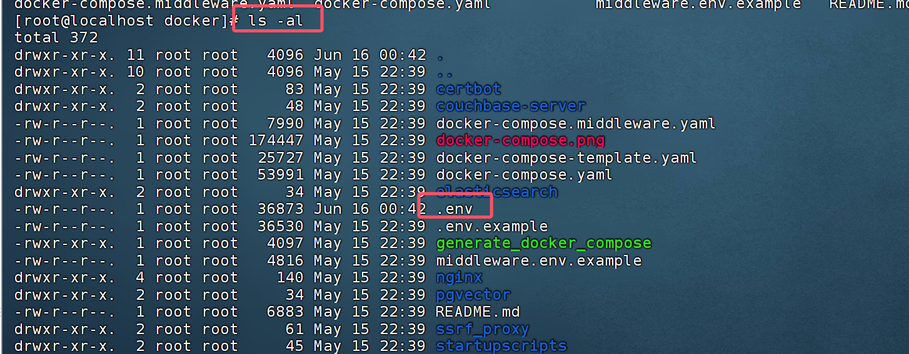

# 2 销售数据图表展示准备

```python
#1 功能
	1 用户输入 年月：统计当月所有销售的销售总金额，使用饼形图展示
    	-每个销售人员，2025年3月份销售记录占比---》饼形图
    2 用户输入：最近3个月总销售数据
    	-公司近三个月的总销售额--》以折线图形式展示
    3 用户：2025年4月份销售最高排名
    	-拿出3个销售额最高的销售名字和金额---》以柱状图展示
        
    4 张三的6月份销售数据
    	-直接文字显示
        
#2 所有数据，存在咱们本地mysql

#3 我们对外提供服务

#4 dify端写代码，调用服务获取对应数据
```


## 2.1 docker中安装mysql

```python
# 1 mysql 软件--》可以装在win，mac，linux或docker中，能存储数据，以表的形式存储
# 2 公司有很多销售，销售每月有销售额，我们把数据存到数据库中
	-1 公司有套系统，工作人员录入的数据
    -2 公司有专门人员，通过excel把销售人员的数据，同步到数据库中
    
# 3 目前假设数据库中已经有数据了（几个月的，销售人员数据）
	-这个智能体算是一个下游应用--》专门给公司统计报表的人使用
    -基于公司现有的数据，外挂个智能体，完成我们想做的功能
    -比如：京东有京东平台--》想统计 6 月份销售额--》现有的京东平台软件，不支持这个功能
    -我们利用dify，自己编写一个智能体，让它具备这个功能
    
    
# 4 需要mysql服务--》用docker安装--》因为docker安装简单

################### docker中安装mysql 步骤###########
# 1 拉取mysql的镜像：https://hub.docker.com/_/mysql
	-只是找到对应版本的mysql
# 2 在我们虚拟机中执行：必须装了docker--》我们装了
	docker pull mysql:8.4.5
        
# 3 把 mysql的镜像拉取到本地
docker images | grep mysql  # 能看到就是有

# 4 运行成容器
# 5 创建文件夹并授权（我怎么写你怎么写）--》后期即便删了mysql容器，数据还在
mkdir -p /home/lqz/mysql/data
mkdir -p /home/lqz/mysql/logs
# 如果不加这个，docker容器没有读这个文件夹的权限，就会报权限错误
chown -R 999:999 /home/lqz/mysql/data
chown -R 999:999 /home/lqz/mysql/logs
    
# 6 创建mysql配置文件 ---》给mysql使用
cd /home/lqz/mysql
vi my.cnf
# 加入下面内容
[mysqld]
# MySQL 数据存储路径
datadir=/var/lib/mysql

# MySQL 错误日志路径
log-error=/var/log/mysql/error.log

# 启用远程连接
bind-address=0.0.0.0

# 设置字符集为 utf8mb4
character-set-server=utf8mb4

# 默认排序规则为 utf8mb4_0900_ai_ci，若需兼容 MySQL 5.7 可使用 utf8mb4_unicode_ci
collation-server=utf8mb4_0900_ai_ci

# 7 创建了文件夹，授权，创建了一个文件，写入了mysql的配置

/home/lqz/mysql
	- my.cnf  # 写了配置，mysql配置
	- data    # 空文件夹，当容器运行起来后，mysql产生的数据，就会放在这里面
    - logs    # 空文件夹，当容器运行起来后，mysql产生的日志
    
    
# 8 运行容器
docker run -d \                           # 后台运行容器
  --name mysql8 \                         # 容器名叫mysql8
  -e MYSQL_ROOT_PASSWORD=lqz12345 \       # mysql root用户密码是lqz12345，后期一般不用root用户
  -e MYSQL_DATABASE=lqz01 \               # 在数据库中创建一个库，叫lqz01
  -e MYSQL_USER=lqz \                     # 在数据库中创建一用户叫lqz，我们使用这个用户操作数据库
  -e MYSQL_PASSWORD=lqz12345 \            # 用户lqz的密码是 lqz12345
  -p 3307:3306 \                          # 端口映射--》以后访问虚拟机的3307端口，就能访问到容器中的mysql了
  -v /home/lqz/mysql/my.cnf:/etc/mysql/my.cnf \  # 
  -v /home/lqz/mysql/data:/var/lib/mysql \
  -v /home/lqz/mysql/logs:/var/log/mysql \     # 文件映射，mysql运行时，数据都放在本地
  mysql:8.4.5                             # 基于mysql8.4.5     镜像版本运行
    
    
    
docker run -d \
  --name mysql8 \
  -e MYSQL_ROOT_PASSWORD=lqz12345 \
  -e MYSQL_DATABASE=lqz01 \
  -e MYSQL_USER=lqz \
  -e MYSQL_PASSWORD=lqz12345 \
  -p 3307:3306 \
  -v /home/lqz/mysql/my.cnf:/etc/mysql/my.cnf \
  -v /home/lqz/mysql/data:/var/lib/mysql \
  -v /home/lqz/mysql/logs:/var/log/mysql \
  mysql:8.4.5
    
    
# 9 如果报错：The container name "/mysql8" is already in use by container
说明之前创建过一个叫mysql8的容器了，容器不能重名
	- 方案一：mysql8  改成 mysql88
    -方案二：删除原来的mysql8 容器，再重新创建
    	docker ps -a  | grep mysql  #查看mysql8的容器
        docker stop mysql8 # 停止容器
    	docker rm mysql8  # 删除容器，如果容器在运行，删不掉
        docker rm mysql8 -f # 强行删除容器，即便运行，也能删除--一般不要运行，有风险
        
# 10 运行成功，我们查看
	docker ps -a  | grep mysql  #查看mysql8的容器
    如果没运行成功，查看日志
    docker logs mysql8
```

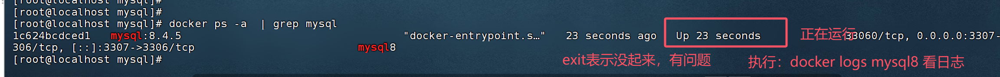


>假设你有一个运行 MySQL 的 Docker 容器，容器内的 MySQL 进程使用 UID 999 的用户运行。当你将主机上的 `/home/lqz/mysql/data` 目录挂载到容器内时，需要确保该目录及其内容归 UID 999 所有：
>
>```bash
>chown -R 999:999 /home/lqz/mysql/data
>chown -R 999:999 /home/lqz/mysql/logs
>```
>
>这样，容器内的 MySQL 进程就可以正常读写这些文件，而不需要提升为 root 权限

### 2.1.1 远程链接

```python
# 1 在本地的win机器，远程链接到 虚拟机中的docker中的mysql中

# 2 安装navicate ，破解，安装在win机器

# 3 照图配置---》如果联不通，把防火墙关掉
	-win
    -虚拟机的也关掉
    
# 4  链接成功
```


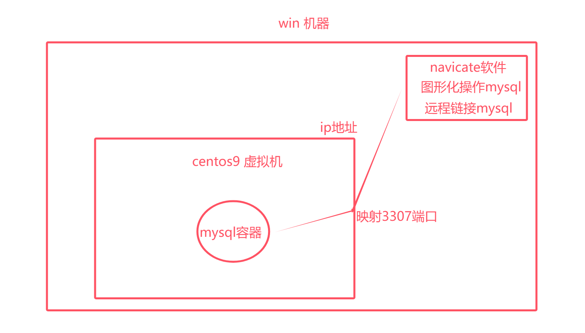

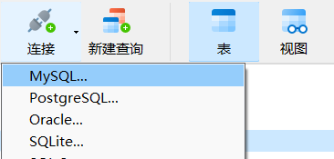


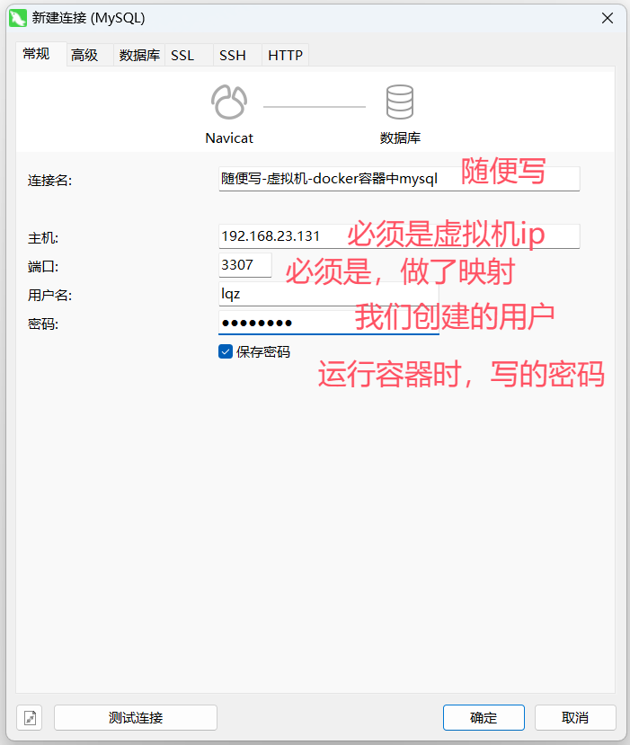

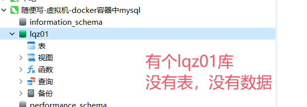


## 2.2 创建订单表，插入测试数据

```python
# 1 到目前为止
	1 装了mysql
    2 win机器能远程链接到mysql了
    3 mysql中有个数据库叫：lqz01
    
# 2 lqz01库中没有表，没有数据，接下来执行，创建表，插入数据
	-创建了一个 sales_orders ，有字段 id, order_date,customer_name,product_name,quantity,unit_price,total_amount
```

```python
-- 销售订单表
CREATE TABLE sales_orders (
    id INT PRIMARY KEY AUTO_INCREMENT,
    order_date VARCHAR(100) NOT NULL,
    customer_name VARCHAR(100) NOT NULL,
    product_name VARCHAR(100) NOT NULL,
    quantity INT NOT NULL,
    unit_price DECIMAL(10, 2) NOT NULL,
    total_amount DECIMAL(12, 2) AS (quantity * unit_price),
);

-- 插入示例数据
INSERT INTO sales_orders (order_date, customer_name, product_name, quantity, unit_price) VALUES
('2025-01', 'lqz', '智能手机', 2, 3999.00),
('2025-01', '刘清政', '笔记本电脑', 1, 8999.00),
('2025-01', 'justin', '无线耳机', 3, 899.00),
('2025-01', '张三', '智能手表', 2, 1999.00),
('2025-01', '李四', '平板电脑', 1, 4999.00),
('2025-01', '王五', '蓝牙音箱', 2, 1299.00),
('2025-01', '赵六', '数码相机', 1, 5999.00),

('2025-02', 'lqz', '智能手机', 3, 3999.00),
('2025-02', '刘清政', '笔记本电脑', 4, 8999.00),
('2025-02', 'justin', '无线耳机', 7, 899.00),
('2025-02', '张三', '智能手表', 5, 1999.00),
('2025-02', '李四', '平板电脑', 8, 4999.00),
('2025-02', '王五', '蓝牙音箱', 1, 1299.00),
('2025-02', '赵六', '数码相机', 9, 5999.00),

('2025-03', 'lqz', '智能手机', 9, 3999.00),
('2025-03', '刘清政', '笔记本电脑', 6, 8999.00),
('2025-03', 'justin', '无线耳机', 7, 899.00),
('2025-03', '张三', '智能手表', 8, 1999.00),
('2025-03', '李四', '平板电脑', 8, 4999.00),
('2025-03', '王五', '蓝牙音箱', 4, 1299.00),
('2025-03', '赵六', '数码相机', 9, 5999.00),

('2025-04', 'lqz', '智能手机', 9, 3999.00),
('2025-04', '刘清政', '笔记本电脑', 6, 8999.00),
('2025-04', 'justin', '无线耳机', 7, 899.00),
('2025-04', '张三', '智能手表', 8, 1999.00),
('2025-04', '李四', '平板电脑', 8, 4999.00),
('2025-04', '王五', '蓝牙音箱', 4, 1299.00),
('2025-04', '赵六', '数码相机', 9, 5999.00),

('2025-05', 'lqz', '智能手机', 5, 3999.00),
('2025-05', '刘清政', '笔记本电脑', 6, 8999.00),
('2025-05', 'justin', '无线耳机', 2, 899.00),
('2025-05', '张三', '智能手表', 3, 1999.00),
('2025-05', '李四', '平板电脑', 6, 4999.00),
('2025-05', '王五', '蓝牙音箱', 4, 1299.00),
('2025-05', '赵六', '数码相机', 6, 5999.00);
```

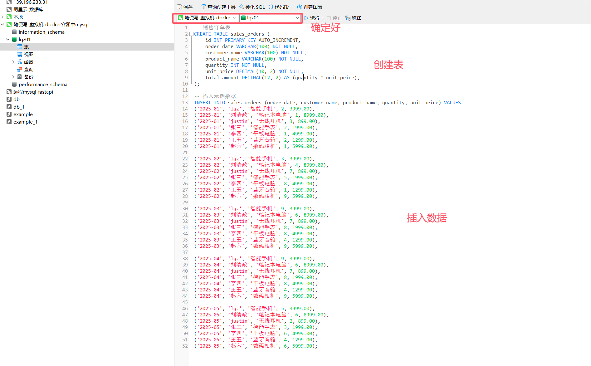


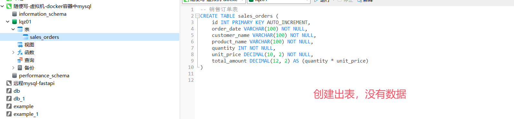

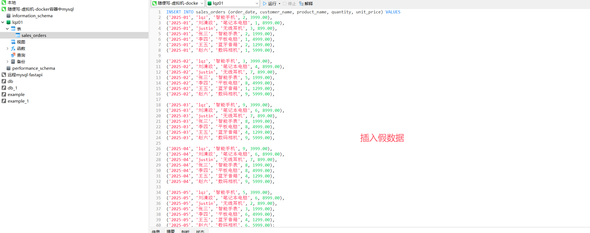

## 2.3 搭建fastapi服务

```python
# 1 使用python的 fastapi 框架，写几个接口，给dify使用
	-fastapi：到目前为止，python界最牛逼的框架，B站大量在使用这个框
    	-django，flask。。。
        
        
# 2 这个咱们不会，但是按照我的步骤，把我写好的服务，能运行起立即可，代码不要懂
	-4个接口：
    
    
    
# 3 运行步骤：
	1 win机器装好了python解释器，3.12,3.11都可以
    2 win机器装好了pycharm，专业版，收费的，网上有破解方案，python课程中老师会教
    3 在pycharm中创建项目--》把代码复制，粘贴过去即可
    	文件名必须叫：   1-fastapi-服务.py
        
    4 安装依赖
    pip3 install fastapi
	pip install uvicorn
	pip install aiomysql
```

```python
from fastapi import FastAPI

import datetime

def get_previous_month(months: int) -> str:
    # 验证输入
    if not isinstance(months, int) or months < 0:
        raise ValueError("月份数必须是一个非负整数")
    # 获取当前日期
    current_date = datetime.datetime.now()
    current_year = current_date.year
    current_month = current_date.month
    # 计算前推指定月数后的年月
    # 先计算总月数
    total_months = current_year * 12 + current_month - months
    # 计算年份和月份
    target_year = total_months // 12
    target_month = total_months % 12
    # 处理月份为0的情况（表示12月）
    if target_month == 0:
        target_month = 12
        target_year -= 1
    # 格式化并返回年月信息
    return f"{target_year:04d}-{target_month:02d}"
import aiomysql
app = FastAPI()
@app.get('/get_data')
async def get_data():
    names=''
    names_amount=''
    async with aiomysql.connect(host='192.168.23.131', port=3307, user='lqz', password='lqz12345', db='lqz01') as conn:
        cur = await conn.cursor(aiomysql.DictCursor)
        await cur.execute("SELECT customer_name,total_amount FROM sales_orders")
        result = await cur.fetchall()
        return {'results':result}
@app.get('/get_01') # 获取每个销售，月度销售额
async def get_01(month:str='2025-02'):
    names=''
    names_amount=''
    async with aiomysql.connect(host='192.168.23.131', port=3307, user='lqz', password='lqz12345', db='lqz01') as conn:
        cur = await conn.cursor()
        await cur.execute("SELECT customer_name,total_amount FROM sales_orders where order_date=%s",month)
        result = await cur.fetchall()
        for item in result:
            names += item[0] + ';'
            names_amount += str(item[1]) + ';'
        return {'names':names[:-1],'names_amount':names_amount[:-1]}
@app.get('/get_02') # 获取最近X个月总销售数据
async def get_02(month:int=3):
    dates=''
    total_amounts=''
    # 格式化并返回年月信息
    real_month=get_previous_month(month)
    async with aiomysql.connect(host='192.168.23.131', port=3307, user='lqz', password='lqz12345', db='lqz01') as conn:
        cur = await conn.cursor()
        await cur.execute("SELECT order_date,SUM(total_amount) as total FROM sales_orders GROUP BY  order_date HAVING order_date>=%s",real_month)
        result = await cur.fetchall()
        for item in result:
            dates += item[0] + ';'
            total_amounts += str(item[1]) + ';'
        return {'dates': dates[:-1], 'total_amounts': total_amounts[:-1]}
@app.get('/get_03') # 获取  X 月份销售最高排名
async def get_03(month:str='2025-02'):
    names=''
    names_amount=''
    async with aiomysql.connect(host='192.168.23.131', port=3307, user='lqz', password='lqz12345', db='lqz01') as conn:
        cur = await conn.cursor()
        await cur.execute("SELECT customer_name,total_amount  FROM sales_orders where order_date=%s order by total_amount DESC LIMIT 3",month)
        result = await cur.fetchall()
        for item in result:
            names += item[0] + ';'
            names_amount += str(item[1]) + ';'
        return {'names':names[:-1],'names_amount':names_amount[:-1]}
@app.get('/get_04') # 获取 YY 的  X 月份销售数据
async def get_04(month:str='2025-01',name:str='justin'):
    async with aiomysql.connect(host='192.168.23.131', port=3307, user='lqz', password='lqz12345', db='lqz01') as conn:
        cur = await conn.cursor()
        await cur.execute("SELECT customer_name,total_amount FROM sales_orders where customer_name = %s and order_date=%s;",(name,month))
        result = await cur.fetchall()
        return f'{name}的第{month}个月，总销售额为：{result[0][1]}'


if __name__ == "__main__":
    import uvicorn
    uvicorn.run('1-fastapi-服务:app',host='0.0.0.0',port=5000,reload=True)
  


```

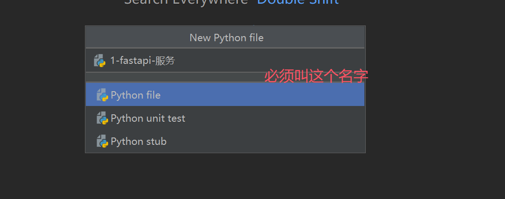

## 2.4 测试服务

```python

# pip install requests

import requests
# 1 获取每个销售，2025-02月度销售额
res=requests.get('http://192.168.71.100:5000/get_01?month=2025-02')
print(res.json())

# 2  获取最近3个月,所有销售 总销售数据
res=requests.get('http://192.168.71.100:5000/get_02?month=3')
print(res.json())

# 3  获取  2025-04 月份销售最高排名
res=requests.get('http://192.168.71.100:5000/get_03?month=2025-04')
print(res.json())
# 4  获取  justin 2025-04 月份销售数据
res=requests.get('http://192.168.71.100:5000/get_04?month=2025-04&name=justin')
print(res.json())
```


## 2.5 dify安装python模块
# 3 安装echars插件
# 4 搭建智能销售图表系统

>制作一个查询公司销售数据，展示成饼形图，折线图，抓状图的AI智能体


## 4.1 开始

```python
# 1 正常我们可以只接受一个字段 input，就是用户的输入，比如用户输入
	-每个销售人员，2025年3月份销售记录占比--》通过LLM能解析出用户的文字--》解析出：2025年3，再调用我们接口获取数据
    -使用本地ollama的deepseek弱智模型，我提示词写的很清楚，它都解析不出来
    
    -所以目前，我先做成，字段都需要用户输入的情况
    	-后期大家可以在这个基础上改造，成 用户只需要输入一段文字--》利用其他模型理解文字内容，再去生成不同的图标
        
        
# 2 接受用户输入
	# input 用户输入的文字，用于大模型处理后，作为报表的标题，使用大模型做一些预测，下月销售额等...
    # type类型：目前支持四种查询：1 饼形图  2 折线图   3 柱状图  4 直接显示
    	1 每个销售人员，2025年3月份销售记录占比  --饼形图
        2 最近4个月总销售数据                 ---折线图
        3 2025年4月份销售最高排名取三个人       ---柱状图
        4 Justin的4月份销售数据               ---直接文字显示
    # 年月：查询某年月的数据
    # name：非必填，查询某个用户某月销售数据
    
    
```

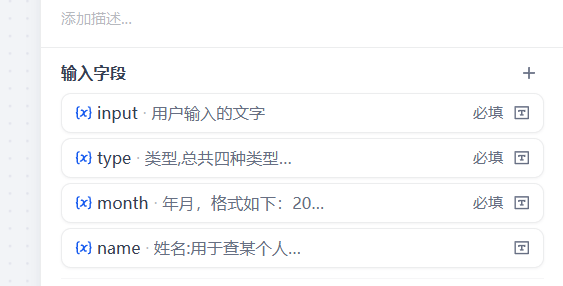

## 4.2 LLM

```python
# 1 添加llm大模型，使用deepseek
# 2 添加提示词
# 角色
你是一个标题生成专家。

## 技能
### 技能 1: 理解核心需求
深入分析用户输入的文字内容 `{{input}}`和 `{{type}}`，转换为15字以内的标题。

## 限制:
- 只处理与从文字中解析数据相关的内容，拒绝回答与数据解析无关的话题。
- 所输出的内容必须按照给定的格式进行组织，不能偏离框架要求。
- 回答需简洁明了，确保数据提取准确。
```


## 4.3 条件分支

```python
# 1 根据用户输入的不同type，调用不同的代码执行，获取数据
	添加 
    if 1             # 执行某个代码:每个销售人员，XX年Y月份销售记录占比
    else if  2       # 执行某个代码:最近X个月总销售数据
    else if  3       # 执行某个代码:XX年Y月份销售最高排名取三个人 
    else             # 执行某个代码:ZZ的Y月份销售数据 
```


## 4.4 代码

```python
#  1 创建四个代码执行
### 1 代码执行
-输入：month---》开始中的month
-代码：【改成你们win机器的地址，你的代码泡在win机器上：192.168.71.100】
import requests
def main(month: str) -> dict:
    res=requests.get(f'http://192.168.71.100:5000/get_01?month={month}').json()
    return {
        "names": res['names'],
        'names_amount':res['names_amount']
    }
-输出：names    names_amount


### 2 代码执行
-输入：month---》开始中的month
-代码：【改成你们win机器的地址，你的代码泡在win机器上：192.168.71.100】
import requests
def main(month: str) -> dict:
    res=requests.get(f'http://192.168.71.100:5000/get_02?month={month}').json()
    return {
        "dates": res['dates'],
        'total_amounts':res['total_amounts']
    }
-输出：dates    total_amounts


### 3 代码执行
-输入：month---》开始中的month
-代码：【改成你们win机器的地址，你的代码泡在win机器上：192.168.71.100】

import requests
def main(month: str) -> dict:
    res=requests.get(f'http://192.168.71.100:5000/get_03?month={month}').json()
    return {
        "names": res['names'],
        'names_amount':res['names_amount']
    }
-输出：names    names_amount


### 4 代码执行
-输入：month---》开始中的month，name--》开始中的name
-代码：【改成你们win机器的地址，你的代码泡在win机器上：192.168.71.100】
import requests
def main(month: str,name:str) -> dict:
    res=requests.get(f'http://192.168.71.100:5000/get_04?month={month}&name={name}').text
    return {
        "result":res,
    }
-输出：result  


#### 注意，代码执行不了---》因为这个python代码，是在dify中执行---》sandbox容器中执行---》容器中有python环境，所以能执行python代码---》但是，没有requests模块，上述代码执行不了
```


### 4.4.1 dify安装python模块requests 

```python
# 1 如果模块没装，会报错，说模块不存在

# 2 我们需要安装
	-临时安装，dify重启就失效了---》不教了，因为几乎不用
    -永久安装，dify重启也在--》教
    	1 虚拟机：进入目录cd /root/dify-1.4.0/docker/volumes/sandbox/dependencies/
        2 编辑文件vi python-requirements.txt
        3 默认文件内容是空的，增加一行
			requests==2.32.4   # 自动下载，去国外很慢--》可以改
        4 保存退出，重启dify
        	docker-compose down
			docker-compose up
   


# 3 看一下dify的sandbox 的python版本--》docker目录
	docker compose exec -it sandbox /bin/bash # 进入到sandbox容器中了
    pip list
```

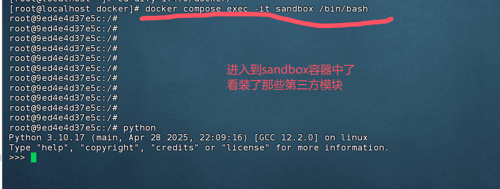

## 4.5 图表

### 4.5.1 安装echars插件

```python
# 1 接口获取到数据--》使用echars生成各种图

# 2 使用 echars插件---》或者直接使用python代码生成都可以
	http://192.168.23.131/plugins?category=discover
```

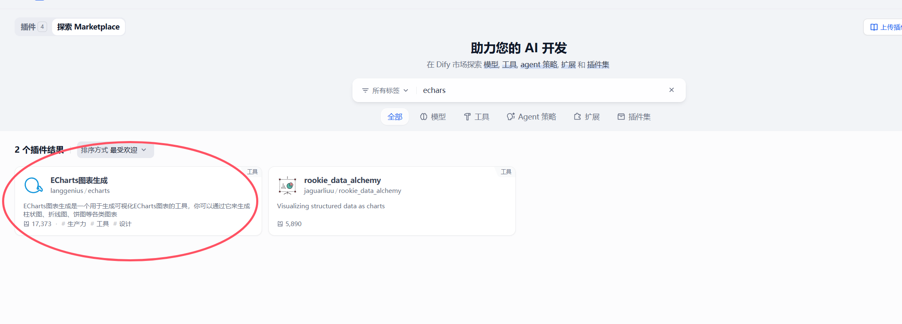

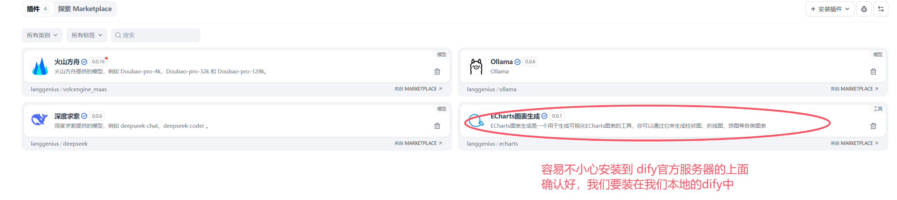

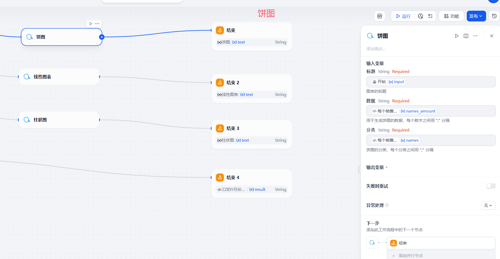


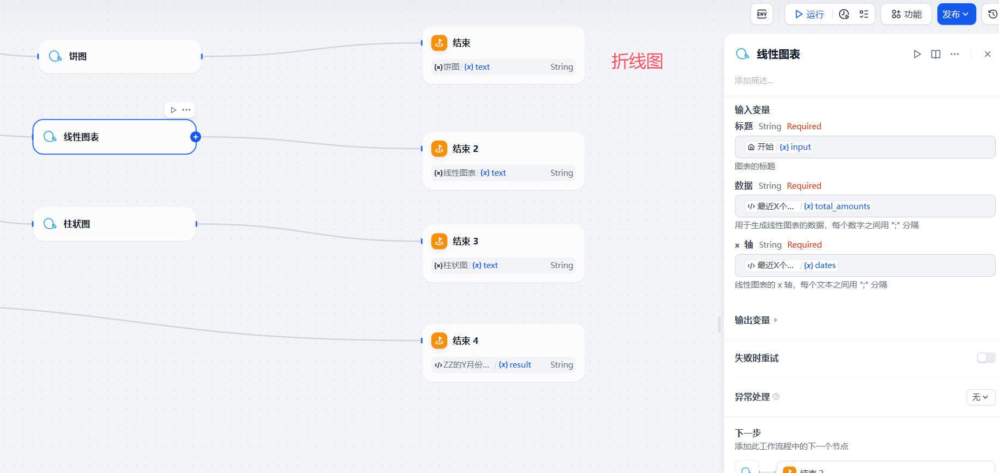


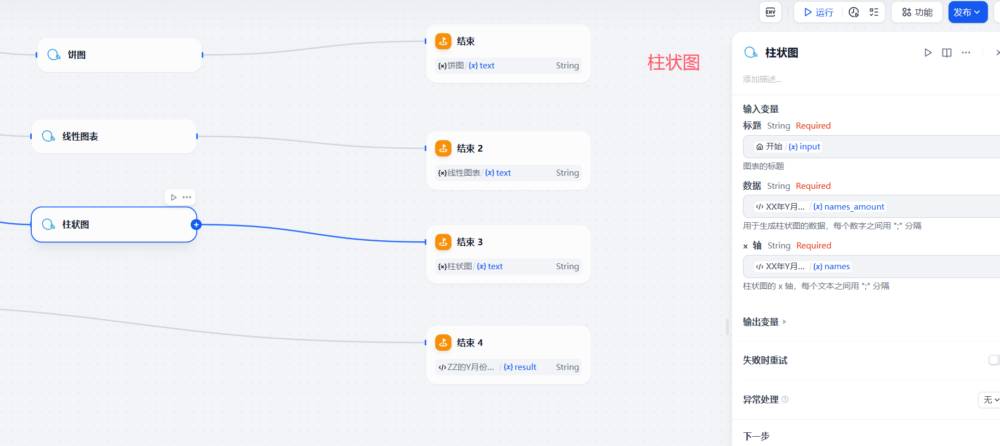


## 4.6 结束

```python
# 1 我们目前写了4个结束

# 2 正常来讲，再加个大模型，判定，输出谁，一个结束就够了
```


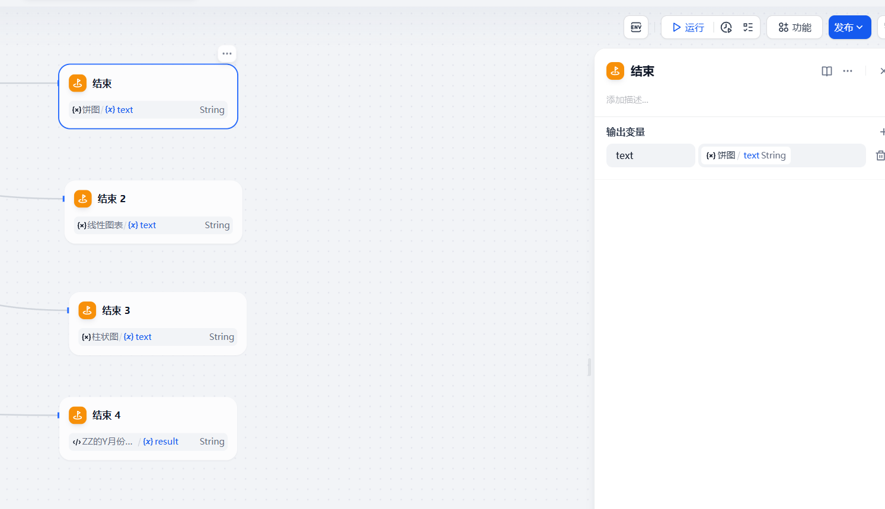

## 4.7 测试

```python
#  1 每个销售人员，2025年3月份销售记录占比  --饼形图
#  2 最近6个月总销售数据                 ---折线图
#  3 2025年4月份销售最高排名             ---柱状图
#  4 张三的6月份销售数据                 ---直接显示
```


# 拓展

```python
个人助理智能ai
	-后天，购买上海到北京商务座
    	-查询12306接口--》查询车票
        -调用支付宝付款--》车票购买网
    -后天上午12点半，虹桥火车站 B28检票口，带好身份证
    
    -我想去马尔代夫旅游，预算2000，玩5天
    	-生成每天几点，做那个车，去哪个景点。。
        -走路走几分钟。。。
    
    
帮我整理视频文件智能体
	-文件夹：1-时间.mp4...
    
    
先积累行业，代码经验--》结合ai智能体，会有更多想象力--》做出更多的东西


```

