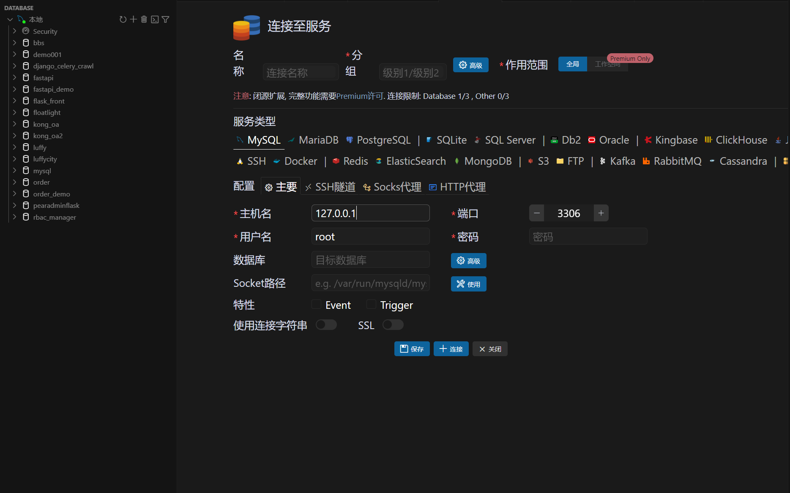
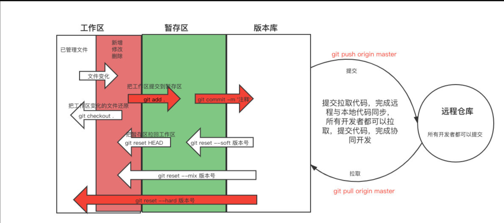

# 1 需求分析

```python
这是一个英语单词量测试微信小程序，分为微信小程序端和后端API，帮我生成需求文档，写入到 1-需求分析/项目需求.md中
```


```python
# 英语单词量测试微信小程序项目需求文档

## 一、项目简介
本项目为一款英语单词量测试微信小程序，旨在帮助用户快速评估自身的英语词汇量水平。系统分为微信小程序端和后端API两部分。

---

## 二、功能需求

### 1. 微信小程序端
#### 1.1 用户模块
- 支持微信授权登录，获取用户唯一标识（openid）。

#### 1.2 测试模块
- 提供标准化的英语单词量测试流程。
- 测试题型只有单词选择。
- 测试题目根据难度分级，自动适配用户水平。
- 测试结束后，展示用户词汇量估算结果及详细解析。
- 支持重新测试和分享测试结果到微信朋友圈/好友。


#### 1.2 其他
- 适配主流手机屏幕，界面简洁美观。
- 支持夜间模式。

---

### 2. 后端API
#### 2.1 用户管理
- 用户登录（微信openid鉴权）。
- 用户信息存储与管理。

#### 2.2 测试题库管理
- 单词题库的增删改查接口。
- 支持题目按难度、类型分类。
- 支持批量导入/导出题库。

#### 2.3 测试流程
- 提供测试题目获取接口（支持自适应难度）。
- 提交测试答案并返回评估结果。
- 记录用户每次测试的详细数据。


---

## 三、非功能性需求
- 系统高可用，支持高并发访问。
- 数据安全与隐私保护，符合相关法律法规。
- 良好的接口文档与开发文档支持。
- 便于后续功能扩展和维护。

---

## 四、技术选型建议
- 小程序端：微信小程序原生开发。
- 后端API：Python Django框架。
- 数据库：MySQL8。

---

## 五、项目里程碑
1. 需求分析与UI设计
2. 小程序端开发
3. 后端API开发
4. 联调与测试
5. 上线发布
6. 运营与维护

```

# 2 UI示意图

```python
# 1 文字描述：提示词生成设计图
# 2 手绘设计图
# 3 图片识别

```

## 2.1 提示词生成设计图

```python
你是一位资深设计师，你非常了解IOS的设计风格，拥有丰富的全栈开发经验和极高的审美，擅长设计现代风格的微信小程序端界面

## 我的小程序需求是：

我想做一个英语单词词汇量测试的小程序

##  我的要求
1.页面元素尽量高级美观，遵循移动端设计规范，注重UI设计细节。
2.所有数据使用假数据，所有页面都可以点击交互
3.图标使用CDN方式引入
4.把设计图生成在 design目录下，每个子页面都是一个但单独的html，方便在一个页面展示全，index.html里把所有子页面展示出来
5.界面尺寸模拟IPhone16 Pro，让页面圆角化，使其更像真实手机界面，顶部添加状态栏

请按以上要求生成完整的高保真原型图(html)
```

## 2.2 手绘图生成

```python
我想做一个英语单词词汇量测试的小程序，根据这张手绘图，帮我生成首页UI设计，以html形式输出
```


## 2.3 图片生成

```python
根据需求文档，参考图片内容，帮我生成UI示意图。
要求：
1.根据功能需求生成UI示意图。
2.需求文档中存在，但图片中不存在的功能，仿照图片风格生成UI示意图。
2.按照页面单独写入文件：UI示意图/(页面名称).txt。
```

# 3 项目架构设计

```python
根据需求文档和UI设计图,生成项目架构设计文档,包含后端架构文档和小程序架构文档
要求：
1.后端使用Python+Django 4 + Mysql8 + DjangoRestFramework等技术实现。
2.微信小程序端使用小程序原生框架。
3.后台管理使用django 自带admin和Simpleui美化。
4.前后端目录结构都一并生成。
5.以Markdown格式生成并输出。
6.后端文档写入到文件中：3-架构设计/1-项目后端架构文档.md。
7.小程序文档写入文件：3-架构设计/2-项目小程序架构文档.md。
```

## 3.1 后端架构

````python

# 项目后端架构设计文档

## 一、技术选型
- 语言：Python 3.10+
- Web框架：Django 4.x
- REST API：Django Rest Framework (DRF)
- 数据库：MySQL 8.x
- 后台管理：Django Admin + SimpleUI
- 依赖管理：pip + requirements.txt

---

## 二、系统架构

```
[微信小程序] ←→ [Django REST API] ←→ [MySQL数据库]
                        ↑
                [Django Admin后台]
```

- 微信小程序通过RESTful API与后端交互。
- 后端负责用户、题库、测试记录等核心业务逻辑。
- 后台管理用于题库、用户、测试数据的管理。

---

## 三、主要模块说明

1. **用户管理模块**
   - 微信openid登录鉴权
   - 用户信息存储与管理
2. **题库管理模块**
   - 单词题目增删改查
   - 难度分级、批量导入导出
3. **测试流程模块**
   - 题目自适应推送
   - 答案提交与词汇量评估
   - 测试记录存储与查询
4. **数据统计模块**
   - 用户测试历史、词汇量分布等统计
5. **后台管理模块**
   - 使用Django Admin + SimpleUI美化
   - 支持题库、用户、测试数据的可视化管理

---

## 四、数据库设计（简要ER图）

```
用户(User)
  └─ openid: str (唯一)
  └─ nickname: str
  └─ avatar: str
  └─ created_at: datetime

单词题库(Word)
  └─ id: int
  └─ word: str
  └─ level: int
  └─ options: json
  └─ answer: str
  └─ created_at: datetime

测试记录(TestRecord)
  └─ id: int
  └─ user: FK(User)
  └─ score: int
  └─ detail: json
  └─ created_at: datetime
```

---

## 五、API设计（部分示例）

- `POST   /api/login/`         用户微信登录
- `GET    /api/words/`         获取题库（支持分页、难度筛选）
- `POST   /api/test/start/`    开始测试，获取题目
- `POST   /api/test/submit/`   提交答案，返回评估结果
- `GET    /api/records/`       获取用户历史测试记录

---

## 六、后端目录结构

```
backend/
├── manage.py
├── requirements.txt
├── backend/                # Django主配置
│   ├── settings.py
│   ├── urls.py
│   └── ...
├── apps/
│   ├── users/              # 用户管理
│   ├── words/              # 单词题库
│   ├── tests/              # 测试与记录
│   └── statistics/         # 数据统计
├── media/                  # 媒体文件
└── static/                 # 静态文件
```

---

## 七、后台管理
- 采用Django Admin + SimpleUI美化
- 支持题库、用户、测试记录的可视化管理
- 支持批量导入导出、数据筛选、统计报表等功能 
````


## 3.2 前端架构


````python
# 项目小程序端架构设计文档

## 一、技术选型
- 框架：微信小程序原生开发
- 语言：WXML + WXSS + JavaScript (ES6)
- 状态管理：全局App对象 + 本地缓存
- UI设计：遵循iOS风格，圆角化、极简美观、响应式适配
- 图标：CDN方式引入（如iconfont、emoji等）

---

## 二、页面结构

1. 首页（home）
   - 欢迎界面，展示产品介绍与"开始测试"按钮
2. 测试页面（test）
   - 单词选择题，进度条，交互反馈
3. 结果页面（result）
   - 词汇量评估、详细分析、分享与再测
4. 个人中心（profile）
   - 用户信息、历史测试记录

---

## 三、主要模块说明

- **用户模块**：微信授权登录，获取openid，展示头像昵称
- **测试模块**：题目获取、选项交互、进度控制、答案提交
- **结果模块**：词汇量估算、详细报告、分享功能
- **个人中心模块**：历史成绩、数据统计、用户信息展示
- **全局配置**：主题色、圆角、状态栏适配、夜间模式

---

## 四、页面跳转与数据流

- 首页点击"开始测试" → 跳转到测试页面
- 测试完成后自动跳转到结果页面
- 结果页可选择"重新测试"或"返回首页"
- 个人中心可随时从底部Tab进入
- 所有数据均通过API获取，测试流程用本地假数据模拟

---

## 五、小程序目录结构

```
miniprogram/
├── app.js
├── app.json
├── app.wxss
├── pages/
│   ├── home/
│   │   ├── home.wxml
│   │   ├── home.wxss
│   │   └── home.js
│   ├── test/
│   │   ├── test.wxml
│   │   ├── test.wxss
│   │   └── test.js
│   ├── result/
│   │   ├── result.wxml
│   │   ├── result.wxss
│   │   └── result.js
│   ├── profile/
│   │   ├── profile.wxml
│   │   ├── profile.wxss
│   │   └── profile.js
├── utils/           # 工具函数
├── assets/          # 静态资源（图标、图片等）
└── components/      # 公共组件（如进度条、按钮等）
```

---

## 六、UI设计要点
- 适配iPhone 16 Pro尺寸，圆角化、卡片化设计
- 顶部自定义状态栏，底部Tab导航
- 交互动画与高亮反馈
- 主题色：渐变蓝紫，简洁明快
- 图标统一CDN引入，支持夜间模式
- 所有页面均可交互，数据用假数据模拟 
````


# 4 安装mysql插件

```python
# 1 本地安装mysql
https://zhuanlan.zhihu.com/p/571585588
# 2 如果不本地装，可以使用我们之前docker中的数据库

# 3 链接	
	-navicate链接
    -cursor插件链接
    
# 4 创建数据库

```





# 5 编写后端

```python
根据项目需求：@项目需求.md 和项目后端架构文档:@1-项目后端架构文档.md ，生成单词量测试小程序后台Django的项目和代码
要求：
1.项目写入到目录test_words_api中。
2.生成相关表模型，写入到每个app的models中
3.生成所有接口文档，并能正常调用
4.链接数据库地址为:
    -host:127.0.0.1
    -port:3307
    -database:fast_words
    -user:root
    -password:123
```


# 6 git 代码管理

```python
# 1 git 做版本管理，方便找回之前的代码，防止ai把代码该乱后，无法回复到原来状态
	-可选学习
    
# 2 使用教程
https://www.cnblogs.com/liuqingzheng/p/15328319.html
    
    
# 3 常用命令
git init
git config --global user.name '用户名'
git config --global user.email '用户邮箱'
git status
git add .
git commit -m ''
git reset --hard 版本号
```



# 7  开发小程序端

## 7.1 申请小程序账号

## 7.2 使用微信小程序开发工具创建项目

## 7.3 使用cursor继续开发

```python
根据项目需求：@项目需求.md 和项目小程序架构文档：@2-项目小程序架构文档.md 和UI设计图:@/2-UI图设计  生成单词量测试小程序端代码
要求：
1.我已经创建了小程序：@/test_words_front ，你在这个基础上继续编写，无效的文件和文件夹帮我删除。
2.根据需求帮编写完小程序端代码。
3.接口参考后端项目：@/test_words_api ，并正常测试通过，前后端调通。
4.后端链接地址为：http://127.0.0.1:8000。
5.小程序开发关闭skyline模式。
```

## 7.4 纠错

```python
帮我在小程序端加入，当点击开始测试时，如果后端数据库中没有当前openid，帮我创建用户
```


# 8 前后端联调


