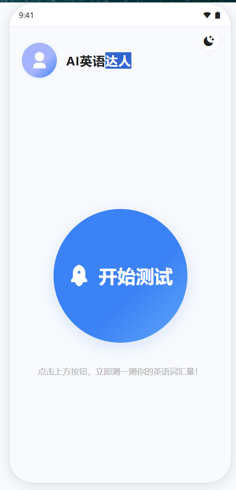
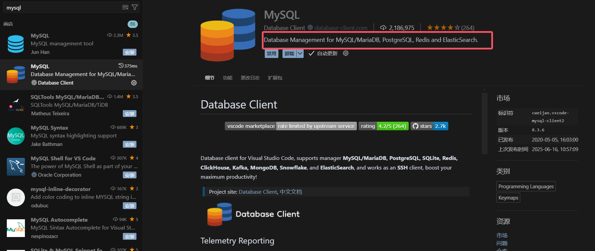
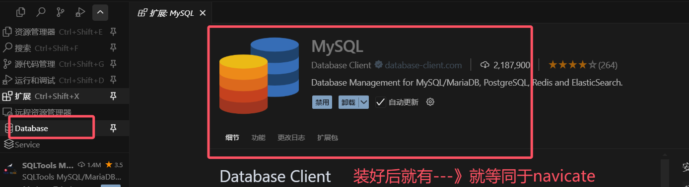
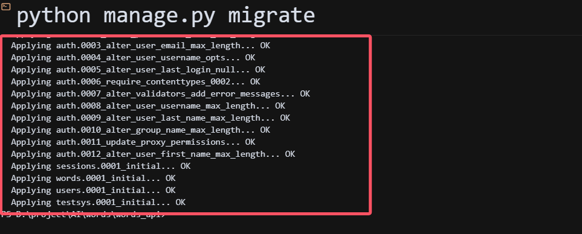
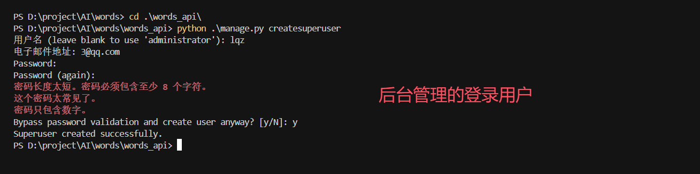

# 今日内容

```python
# 1 使用cursor开发出一款 英语单词量自测小程序
	- 后端API接口---》给微信小程序使用
    - 后台管理----》运营使用
    - 微信小程序
```


# 1 公司中项目开发流程

```python
# 1 公司立项：英语单词量自测微信小程序
	-确立项目：定好要开发的项目是什么
    -公司高管；市场跟用户交互确立项目
    
# 2 需求分析
	-这个项目有什么功能，针对人群，大致功能是什么，流程什么样
    -互联网产品经理：如果是互联网产品，产品经理需要懂用户，需要能拿捏用户
    -传统软件行业产品经理：用户 和  开发之间的  传话筒
    - 产品原型图：墨刀
# 3 UI/UD:美工负责根据原型图切图

# 4 软件架构设计
	-前端设计：技术选型，UI图的视线
    -后端设计：语言，架构，框架，数据库。。。
    
# 5 分模块开发


# 6 测试项目，前后端联调

# 7 上架项目：运维
```


# 2 需求分析

```python
# 1 使用cursor生成需求分析书，人工复合和修改，完全符合我们的项目需求

# 2 输入文字，让cursor生成

这是一个英语单词量测试微信小程序，分为微信小程序端和后端API，帮我生成需求文档，写入到 1-需求分析/项目需求.md中
```


```python
# 英语单词量测试微信小程序项目需求文档

## 一、项目简介
本项目为一款英语单词量测试微信小程序，旨在帮助用户快速评估自身的英语词汇量水平。系统分为微信小程序端和后端API两部分。

## 二、功能需求

### 1. 微信小程序端
#### 1.1 用户界面
- 支持微信授权登录，获取用户唯一标识（openid）。

#### 1.2 测试模块
- 提供标准化的英语单词量测试流程。
- 测试题型只有单词选择。
- 测试题目根据难度分级，自动适配用户水平。
- 测试结束后，展示用户词汇量估算结果及详细解析。
- 支持重新测试和分享测试结果到微信朋友圈/好友。


#### 1.3 其他
- 适配主流手机屏幕，界面简洁美观。
- 支持夜间模式。


### 2. 后端API
#### 2.1 用户管理
- 用户登录（微信OpenID绑定）。
- 用户信息管理。

#### 2.2 测试题库管理
- 单词题库增删改查。
- 题目分类（难度、词汇等级、题型等）。
- 随机抽题接口，支持按难度、数量筛选。

#### 2.3 测试流程
- 提供测试题目获取接口（支持自适应难度）。
- 提交测试答案并返回评估结果。
- 记录用户每次测试的详细数据。


## 三、非功能需求
- 支持高并发访问，保证响应速度。
- 数据加密传输，保护用户隐私。
- 良好的错误处理与提示机制。
- 兼容主流微信客户端版本。

## 四、技术选型建议
- 小程序端：微信小程序原生。
- 后端API：Python Django框架。
- 数据库：MySQL8。

## 五、项目里程碑
1. 需求分析与设计
2. 题库准备与算法设计
3. 小程序端开发
4. 后端API开发
5. 联调与测试
6. 上线发布

---
如需补充或细化需求，请随时沟通。 
```


# 3 UI示意图设计

```python
# 1 公司中美工做好了，给我们
# 2 我们是纯小白，没有切图
	-2.1 通过提示词——》让cursor生成---》我们的项目，使用这种
    -2.2 手绘设计图--》让cursor生成
    -2.3 截图别人app的图片--》让cursor生成
```

## 3.1 提示词生成UI设计图

**提示词**

```python
你是一位资深设计师，你非常了解IOS的设计风格，拥有丰富的全栈开发经验和极高的审美，擅长设计现代风格的微信小程序端界面

## 我的小程序需求是：

我想做一个英语单词词汇量测试的小程序

##  我的要求
1.页面元素尽量高级美观，遵循移动端设计规范，注重UI设计细节。
2.所有数据使用假数据，所有页面都可以点击交互
3.图标使用CDN方式引入
4.把设计图生成在 2-UI设计图 目录下，每个子页面都是一个但单独的html，方便在一个页面展示全，index.html里把所有子页面展示出来
5.界面尺寸模拟IPhone16 Pro，让页面圆角化，使其更像真实手机界面，顶部添加状态栏

请按以上要求生成完整的高保真原型图(html)
```

## 3.2 使用手绘图生成

```python
我想做一个英语单词词汇量测试的小程序，根据这张手绘图，帮我生成首页UI设计，以html形式输出,尽量美观好看一些，你可以有自己的想法加入改动
```



## 3.3 图片生成

```python
根据需求文档，参考图片内容:，帮我生成UI示意图。
要求：
1.根据功能需求生成UI示意图。
2.需求文档中存在，但图片中不存在的功能，仿照图片风格生成UI示意图。
3.按照页面单独写入文件：2-UI设计图/bb.html。
```

# 4 项目架构设计

```python
根据需求文档和UI设计图,生成项目架构设计文档,包含后端架构文档和小程序架构文档
要求：
1.后端使用Python+Django 4 + Mysql8 + DjangoRestFramework等技术实现。
2.微信小程序端使用小程序原生框架。
3.后台管理使用django 自带admin和Simpleui美化。
4.前后端目录结构都一并生成。
5.以Markdown格式生成并输出。
6.后端文档写入到文件中：3-架构设计/1-项目后端架构文档.md。
7.小程序文档写入文件：3-架构设计/2-项目小程序架构文档.md。
```

## 4.1 Django解释

```python
# 后台管理   给小程序提供的api   小程序端
	django ：python的一个web框架，可以写api接口，可以写后台管理
    django：学习资料
```


## 4.2 后端

````md
# 项目后端架构设计文档

## 一、技术选型
- Python 3.10+
- Django 4.x
- Django Rest Framework (DRF)
- MySQL 8.x
- SimpleUI（Django Admin美化）

#### 二、系统架构

```
[微信小程序] ←→ [Django REST API] ←→ [MySQL数据库]
                        ↑
                [Django Admin后台]
```
- 微信小程序通过RESTful API与后端交互。
- 后端负责用户、题库、测试记录等核心业务逻辑。
- 后台管理用于题库、用户、测试数据的管理。
- 生成接口测试脚本，以便进行接口可用性测试。

## 三、主要模块说明
1. **用户管理模块**
   - 微信openid登录鉴权
   - 用户信息存储与管理
2. **题库管理模块**
   - 单词题目增删改查
   - 难度分级、批量导入导出
3. **测试流程模块**
   - 题目自适应推送
   - 答案提交与词汇量评估
   - 测试记录存储与查询
4. **数据统计模块**
   - 用户测试历史、词汇量分布等统计
5. **后台管理模块**
   - 使用Django Admin + SimpleUI美化
   - 支持题库、用户、测试数据的可视化管理

## 四、数据库设计（简要ER图）
- User（用户表）：id, openid, nickname, avatar, created_at, ...
- Word（单词表）：id, word, meaning, level, difficulty, ...
- Question（题目表）：id, word_id, options, answer, type, ...
- TestRecord（测试记录表）：id, user_id, score, vocab_estimate, created_at, ...
- TestDetail（测试明细表）：id, record_id, question_id, user_answer, is_correct, ...

## 五、API设计（部分示例）
- POST   /api/login/           微信登录
- GET    /api/user/profile/    获取用户信息
- GET    /api/words/           获取单词题库
- GET    /api/questions/       获取测试题目
- POST   /api/test/submit/     提交测试答案
- GET    /api/test/history/    获取历史测试记录

## 六、推荐目录结构
```
backend/
├── manage.py
├── requirements.txt
├── config/                # Django配置
├── apps/
│   ├── users/             # 用户管理
│   ├── words/             # 单词与题库
│   ├── testsys/           # 测试流程
│   └── utils/             # 工具类
├── static/
├── media/
└── ...
```

## 七、后台管理
- 采用Django Admin，配合SimpleUI美化界面
- 支持题库、用户、测试记录等数据的增删改查
- 支持数据导入导出、统计报表等扩展

---
如需详细ER图、API文档或代码示例，可进一步补充。 
````


## 4.3 前端

````md
# 项目小程序端架构设计文档

## 一、技术选型
- 微信小程序原生框架
- WXML + WXSS + JavaScript
- 本地API对接

## 二、页面结构
- 首页（个人信息、开始测试按钮）
- 测试页（单词选择题、进度、交互）
- 结果页（词汇量估算、分数、统计、分享）
- 个人中心（头像、昵称、历史记录）

## 三、主要模块说明
### 1. 用户信息模块
- 微信授权登录，获取openid
- 用户信息展示

### 2. 测试流程模块
- 题目获取与展示（自适应难度）
- 选项交互、进度控制
- 答案提交与结果展示

### 3. 历史记录模块
- 展示历史测试记录
- 查看测试详情

### 4. 结果与分享模块
- 词汇量估算结果展示
- 分享到微信好友/朋友圈

### 5. 夜间模式与适配
- 支持夜间模式切换
- 适配iPhone等主流机型

## 四、页面路由结构
- /pages/home/index      首页
- /pages/test/index      测试页
- /pages/result/index    结果页
- /pages/profile/index   个人中心

## 五、数据流说明
- 首页点击"开始测试" → 跳转到测试页面
- 用户点击开始测试后获取openid，向后端发送请求，如果用户不存在，创建用户并开始测试，如果用户存在，直接开始测试
- 进入测试页拉取题目数据，答题后提交结果
- 测试完成后自动跳转到结果页面
- 结果页展示词汇量估算与统计
- 个人中心页拉取历史记录
- 所有数据均通过API获取，测试流程用本地假数据模拟

## 六、推荐目录结构
```
miniprogram/
├── app.js
├── app.json
├── app.wxss
├── pages/
│   ├── home/
│   │   ├── index.wxml
│   │   ├── index.wxss
│   │   └── index.js
│   ├── test/
│   │   ├── index.wxml
│   │   ├── index.wxss
│   │   └── index.js
│   ├── result/
│   │   ├── index.wxml
│   │   ├── index.wxss
│   │   └── index.js
│   └── profile/
│       ├── index.wxml
│       ├── index.wxss
│       └── index.js
├── utils/
├── assets/
└── ...
```

---
如需详细页面原型、组件拆分或代码示例，可进一步补充。 
````

# 5 使用mysql数据库

```python
# 1 本地win机器的数据库
	https://zhuanlan.zhihu.com/p/571585588
# 2 如果本地不想装了，使用我们之间docker中装的数据库即可

# 3 保证：
	-navicate 能正常链接上 【代码才能链接上】
	-cursor有mysql链接插件
    
    
# 4 创建一个数据库：用户放项目的数据：  如下图
	words
```






# 6 编写后端

```python
根据项目需求：@项目需求.md 和项目后端架构文档:@1-项目后端架构文档.md  ，和UI设计图:@/2-UI设计图 ,生成单词量测试小程序后台Django的项目和代码
要求：
1.项目写入到目录words_api中。
2.生成相关表模型，写入到每个app的models中
3.生成所有接口文档，并能正常调用
4.链接数据库地址为:
    -host:127.0.0.1
    -port:3307
    -database:words
    -user:root
    -password:lqz123?
5.并帮我生成接口测试脚本。
```


```python

帮我创建文件夹后，继续生成
接下来帮我生成接口（API）代码、数据库配置、接口文档和接口测试脚本
测试脚本给我使用python生成
帮我迁移数据，迁移成功后，运行项目 # 重要：执行完这一步，库中才有表
帮我迁移数据库，按步骤执行
帮我检查并修复
你帮我写入
# 一定要确认表已经在数据库中了

# 让ai帮咱们运行项目---》浏览器访问：http://127.0.0.1:8000  有反应


# 帮我运行api_test.py脚本，测试接口---》可以自己手动测
	就在py文件上 右键运行
    
# 帮我写可以向每个表中插入测试数据的py脚本，右键运行直接插入


后台管理admin，没有使用simpleui美化，帮我完成功能
```






## 6.1 结束

```python
# 不停的跟cursor交互，让它完成你想做的功能直至
	-浏览器中访问：http://127.0.0.1:8000/ 能看到界面
    -执行 测试api脚本，不报错，顺利返回
    	-或者找个get接口，使用浏览器或postman访问一下能通即可
    -http://127.0.0.1:8000/admin 进入后，能看到功能
            
```


# 7 技术架构--接开发项目的单

家政，点餐--》cursor+微信小程序+python web框架

```python
# 1 目前市面上所有软件	
	-win版本的百度网盘：桌面版应用：win，mac，linux---》PyQt
    	-QT：c，c++；PyQT--》编写跨平台的桌面应用
        
        
    -web版的百度网盘：运行在浏览器中---》Vue足够
    	-浏览器只能识别 ：html，css，JavaScript：弱语言
        -TypeScript：避免JavaScript的一些错误，强类型语言---》最终还是要编译成js
        -Vue，react：前端框架，直接以项目形式写前端
        -大前端：
        	-安卓，ios，桌面，web端----》能不能一处编码处处运行
            	-flutter：谷歌推的，使用Dart语言写
                -Vue语言写：uni-app
                -微信小程：代码可以编译到安卓，iso，微信小程序
    -安卓版百度网盘---》java
    	- Androidstudio
    	- java,Kotlin（谷歌）--》安卓原生--》大厂都用原生开发
        -小公司：要做web，安卓，ios，桌面----》性能不行
        	-选择：uni-app
    -ios版百度网盘--->Object C
    	-Object C,swift :ios原生开发
        -使用flutter，uni-app 都可以开发完成后，运行   
        -mac系统开发，上架，审核
        
    -微信小程序百度网盘--->微信原生开发
    	-只有腾讯官方--》wxml，wxss，js/ts
        -uni-app:微信小程序

	-省事路线---》html，css，js---》vue---》uniapp


	
# 2 所有项目都需要有后端，api，提供服务
	-Python:Django,flask,fastapi---->python+后端框
    -Go:Gin,Beego-->单体应用：一个大项目
       	--》微服务GRPC，字节。。。。

	-Java：SpringBoot：单体
    	   SpringCloud
			ssh：国企项目，过时了
            ssm
    -PHP: php框架
    -nodejs：前端人想写后端---》有个大神把浏览器中的js解释器V8引擎，使用c重写了，能运行在操作系统上
    	-可以在操作系统上用js的语法写后端

	-C/c++：腾讯王者荣耀后台


# 3 开发程序接单：cursor是锦上添花
	-需要会：html，css，js
    	-微信小程序
    -需要会：ptyhon + Python的一个web框架
    	-django框架

# 4 如果想接单程序开发
	-cursor+前端+后端
    
    
# 5 懂点运维：
	-linux操作系统
    -docker
    -mysql：
	推荐。。。
	


# AOSP项目改的

--------------------------


# 1 前台项目-前端项目:
## 1.1 定义：
	负责用户可见的界面展示与交互逻辑，直接影响用户体验。
## 1.2 技术栈：
	Web 前端：HTML/CSS/JavaScript、框架（React/Vue/Angular）、构建工具（Webpack/Vite）。
	移动端前端：Flutter、React Native、原生 iOS（Swift）/Android（Kotlin）。
## 1.3 应用场景：
	企业官网、电商平台（如淘宝 PC 端）、管理后台（如 OA 系统界面）。
	移动端 H5 页面（如微信公众号内嵌页面）。
## 1.4 特点：
	注重 UI 设计、响应式布局、动画效果和性能优化
    
    
# 2 后台项目（后端项目）:
## 2.1 定义：
	处理数据逻辑、业务规则和服务器交互，不直接面向用户。
## 2.2 技术栈：
	编程语言：Java/Python/Go/PHP/.NET/C# 等。
	框架：Spring Boot（Java）、Django（Python）、Express（Node.js）。
	数据库：MySQL/PostgreSQL（关系型）。
## 2.3 应用场景：
	电商平台的订单处理、用户数据管理、支付系统。
	云计算服务的 API 接口（如阿里云 API）。
## 2.4 特点：
	注重业务逻辑复杂度、数据安全性、并发处理和服务器性能。
    
# 3 小程序项目
## 3.1 定义：
	运行在第三方平台（如微信、支付宝）内的轻量化应用，无需下载安装。
## 3.2 技术栈：
	微信小程序：WXML（类似 HTML）、WXSS（类似 CSS）、JavaScript，或使用框架（Taro/uni-app 跨平台开发）。
	支付宝 / 抖音小程序：各平台专属语法或兼容 Web 技术。
## 3.3 应用场景：
	餐饮点单（如星巴克微信小程序）、共享单车扫码（如美团单车）、小游戏。
## 3.2 特点：
	依赖平台生态，开发周期短，流量入口丰富（如微信社交裂变）。
    
    
# 4 App 项目（移动端原生 / 混合应用）
## 4.1 定义：
	安装在移动端设备的独立应用，分为原生 App 和混合 App。
## 4.2 技术栈：
	原生 App：
		iOS：Swift/Objective-C + Xcode。
		Android：Kotlin/Java + Android Studio。
	混合 App：React Native/Flutter/uniapp。
## 4.3 应用场景：
    社交软件（微信、抖音）、工具类（支付宝、高德地图）、游戏（王者荣耀）。
## 4.4 特点：
	可调用设备原生功能（相机、定位），性能优于小程序，但开发成本较高。
    
    
# 5 微服务项目
## 5.1 定义：
	将复杂系统拆分为独立部署的小型服务，通过 API 通信。
## 5.2 技术栈：
    服务注册与发现：Consul/Nacos。
    网关：Spring Cloud Gateway/APISIX。
    容器化：Docker/Kubernetes。
## 5.3 应用场景：
大型互联网平台（如京东、拼多多），需处理高并发和海量数据。


# 6 大数据项目
## 6.1 定义：
	处理海量数据的采集、存储、分析与可视化。
## 6.2 技术栈：
    数据采集：Flume/Sqoop。
    存储：Hadoop/HDFS、Spark。
    分析：Hive/Presto。
## 6.3 应用场景：
	用户行为分析（如抖音推荐算法）、金融风控数据建模。
    
# 7 物联网（IoT）项目
## 7.1 定义：
	连接硬件设备与云端的系统，实现数据交互与设备控制。
## 7,2 技术栈：
    硬件开发：Arduino/Raspberry Pi。
    云端：MQTT 协议、AWS IoT/Azure IoT。
## 7.3 应用场景：
	智能家居（如小米米家）、工业设备监控。
```


