# 一 小程序概述

## 1.1 什么是微信小程序

```python
# 1 微信小程序是一种运行在微信内部的 轻量级 应用程序
# 2 小程序无需下载和安装，只需要在微信中下拉，搜一搜 或 扫一扫 搜索点击使用即可

# 3 大前端概念
```

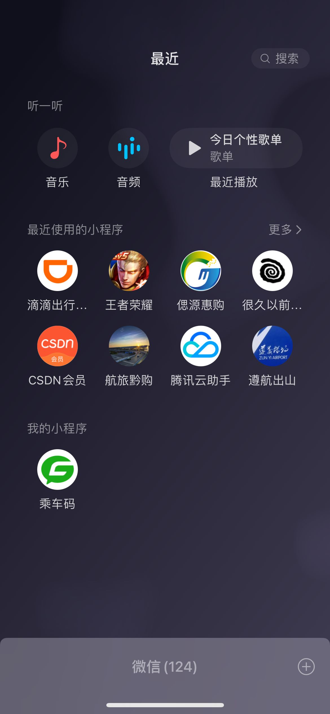

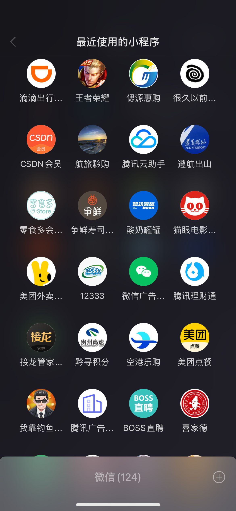


## 1.2 微信小程序账号注册

```python
# 1 访问【微信公众平台】，注册一个微信小程序账号
	-https://mp.weixin.qq.com/
# 2 申请账号需要准备一个邮箱，该邮箱要求：
    -未被微信公众平台注册
    -未被微信开放平台注册
    -未被个人微信号绑定过
    -如果被绑定了需要解绑 或 使用其他邮箱
```


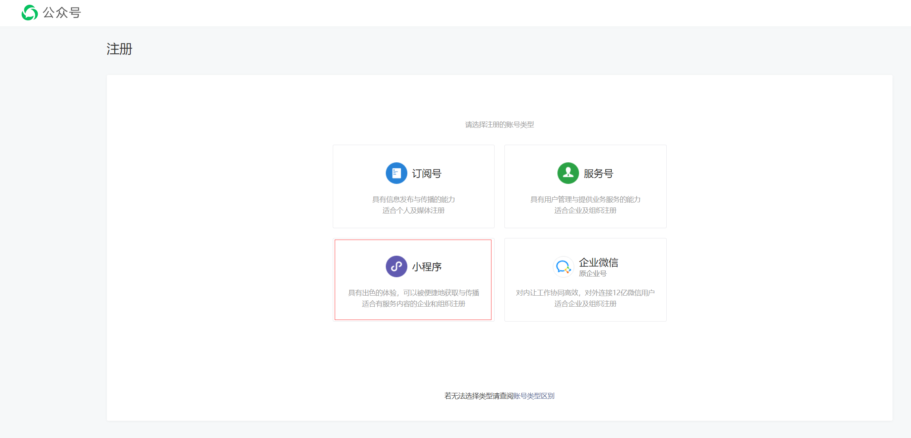


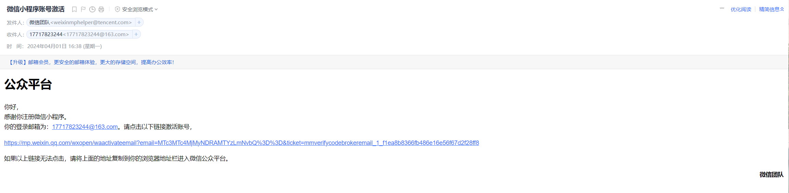


## 1.3 微信小程序信息配置

```python
# 1 注册成功后，需要打开微信公众平台对小程序账号进行一些设置
	-小程序后续需要 提交审核和上线--》提交审核时，小程序账号信息是必填项
	-名称、图标、类目等
    -小程序备案和微信认证
```


## 1.4 微信小程序开发流程


```python
# 微信小程序--》本地开发环境--》线上环境
	-本地：微信开发者工具+Pycharm开发Django
    -线上：
    	-体验版：几个人体验，API需要在公网
        -发布：备案，API需要在公网，全国各地人都可以用
```


## 1.5 微信小程序成员

```python
# 微信小程序成员分为两种
	-项目成员：表示参与小程序开发（我们）、运营的成员，包括运营者、开发者及数据分析者，项目成员可登陆微信公众后台，管理员可以在成员管理中添加、删除项目成员，并设置项目成员的角色。
	-体验成员：表示参与小程序内测体验的成员，可使用体验版小程序，但不属于项目成员。管理员及项目成员均可添加、删除体验成员。
```

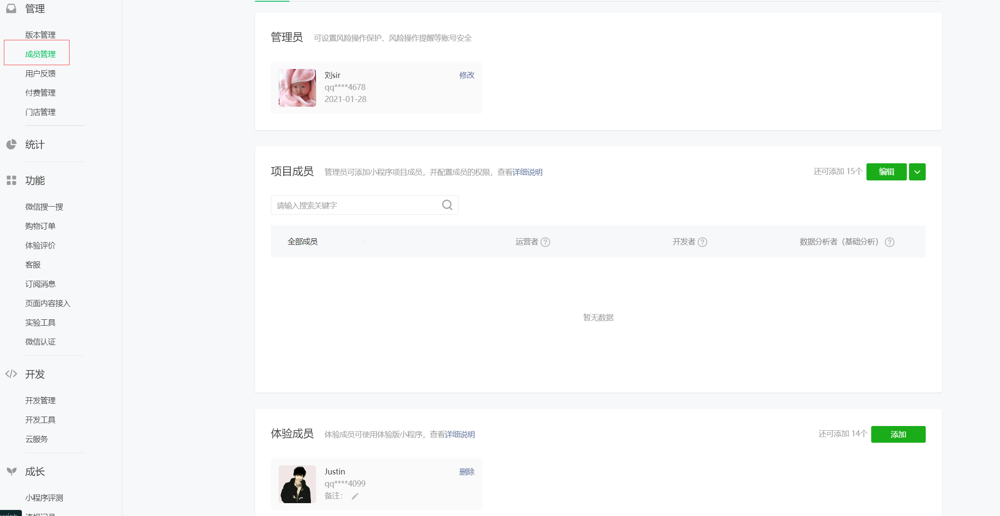

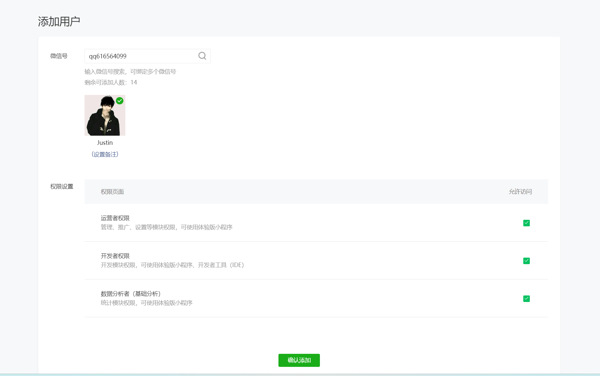


# 二 创建项目

## 2.1 创建项目流程

```python
# 1 获取 小程序id
	-小程序后台--》开发--》开发管理--》开发设置--》开发者ID
    -AppID(小程序ID)	     wx539e097341fc7588	
	-AppSecret(小程序密钥)   77cce7b07b4c987aa50f12ab3e498aa9(不要泄露)
# 2 下载【微信开发工具】--需要联网才能使用
	-下载地址
    https://developers.weixin.qq.com/miniprogram/dev/devtools/stable.html
        
# 3 一路下一步安装

# 4 创建项目

# 5 配合后端API

```


## 2.2 创建项目

```python
# 1 打开微信开发者工具--》使用微信扫描二维码
# 2 创建项目
	-填写名字
    -路径
    -APPID
    -不使用云开发【使用腾讯云的云函数，服务器等等，需要花钱】
    -不使用模版
# 3 创建完成后，界面如下

# 4 设置
	-设置--》编辑器设置--》改变字体大小
    -视图--》外观--》移动模拟器位置
    -可以勾选掉不显示：模拟器，调试器等
```


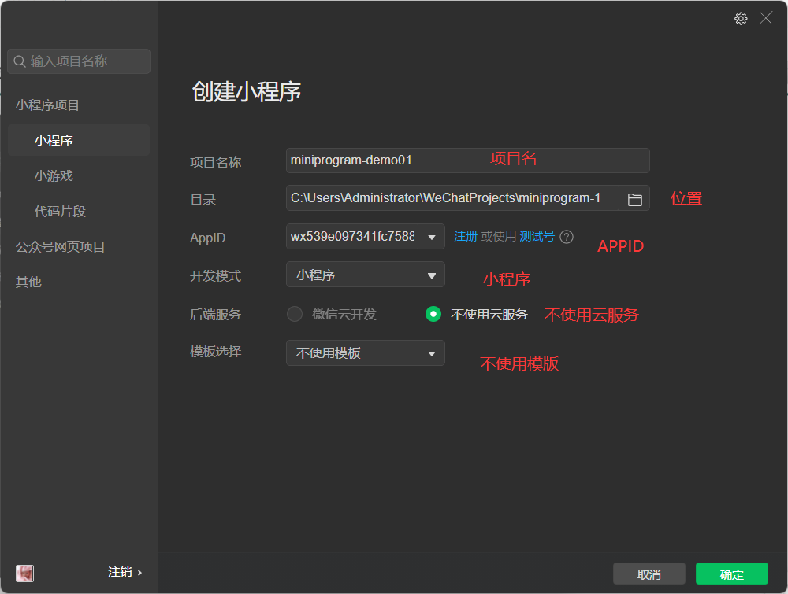

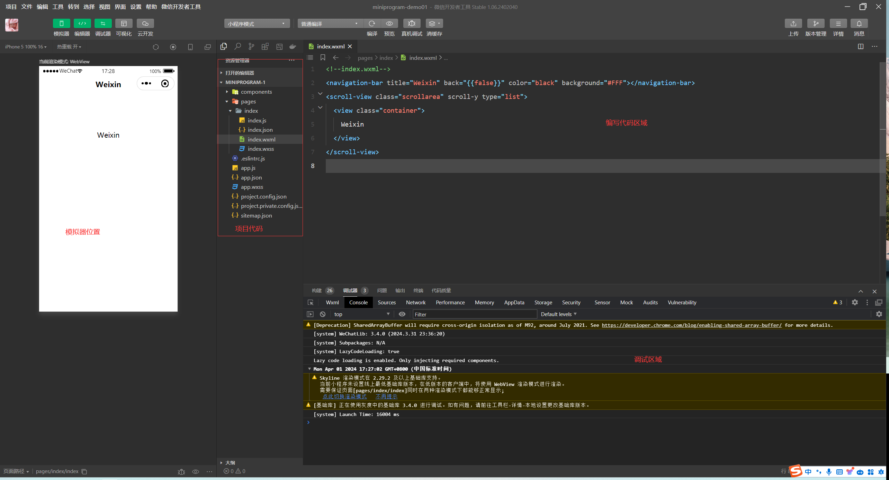

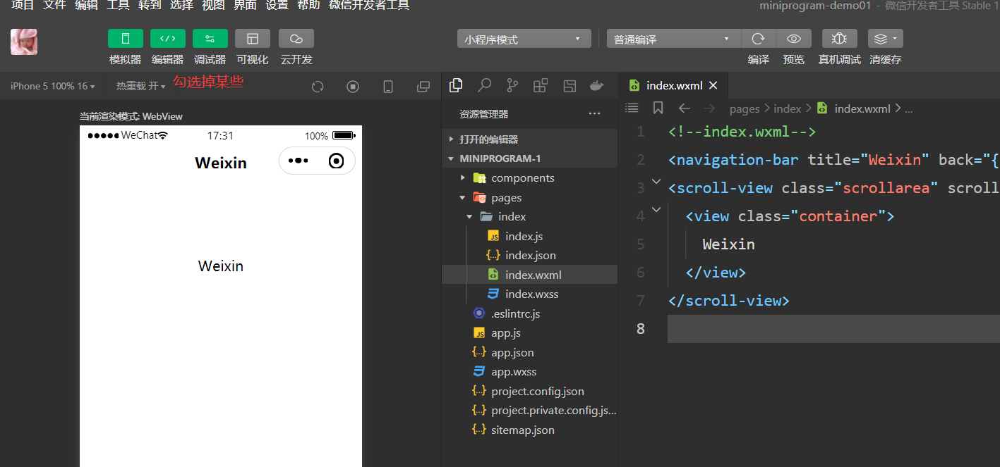

## 2.3 本地开发支持http

```python
# 1 django 运行在 0.0.0.0 的地址
# 2 小程序默认只支持https，我们需要做如下配置，让其支持http，方便我们本地开发
	-右上角--》详情--》本地设置--》不校验合法域名
```

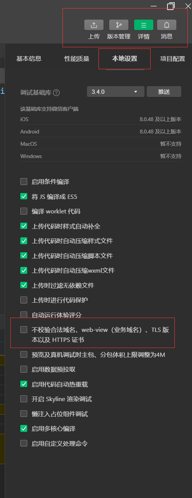

# 三 项目目录

## 3.1 项目目录结构

### 3.1.1 目录介绍

```python
# 1 项目主配置文件
	项目主配置文件必须放到项目的根目录下，控制整个项目
    	- app.js：  小程序入口文件
    	- app.json：小程序的全局配置文件
    	- app.wxss：小程序的全局样式
    	-app.js 和 app.json 文件是必须的，不能没有
        
# 2 页面文件
	小程序有一个个页面，每个页面所需的文件，都存放在 pages 目录下，一个页面一个文件夹
        -xx.js：  页面逻辑  js代码存放位置
        -xx.wxml：页面结构  类html文件存放位置
        -xx.wxss：页面样式  css存放位置
        -xx.json：小页面配置 
        -xx.js 文件和 xx.wxml 文件是必须的，不能没有

        
# 3 相关配置文档
https://developers.weixin.qq.com/miniprogram/dev/reference/configuration/app.html
```

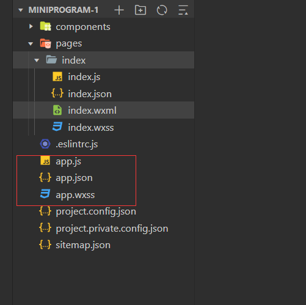

```python
├── components                  【页面中使用的组件】
├── pages   					【页面文件目录】
│   ├── index					【页面】
│   │   ├── index.js				【页面JS】
│   │   ├── index.json				【页面配置】
│   │   ├── index.wxml				【页面HTML】
│   │   └── index.wxss				【页面CSS】
│   └── logs					【页面】
│       ├── logs.js					...
│       ├── logs.json				...
│       ├── logs.wxml				...
│       └── logs.wxss				...
├── utils						【自定义工具】
│	└── utils.js					【功能的定义】
├── app.js						【全局JS】
├── app.json					【全局配置】
├── app.wxss					【全局CSS】
├── project.config.json			【开发者工具默认配置】
├── project.private.config.json	【开发者工具用户配置,在这里修改，优先用这个，可以删除】
├── .eslintrc.js				【ESlint语法检查配置】
├── sitemap.json				【微信收录页面，用于搜索，上线后，搜索关键字就可以搜到我们】
```


### 3.1.2 配置文件

#### 3.1.2.1 app.json

```python
#1 小程序全局配置文件，用于配置小程序的一些全局属性和页面路由

#2 参考地址 
https://developers.weixin.qq.com/miniprogram/dev/reference/configuration/app.html
    
# 3 app.json 配置
{
  "entryPagePath": "pages/login/login",
  "pages": [
    "pages/index/index",
    "pages/login/login"
    
  ],
    "window": {
      "navigationBarTitleText": "功能演示",   # 标题
      "navigationBarBackgroundColor": "#0000FF", #颜色
      "enablePullDownRefresh": false,  # 是否带下拉刷新
      "backgroundColor": "#00FFFF",    # 下拉刷新颜色
      "backgroundTextStyle": "dark"    # light ，下拉刷新的点点什么颜色
    },
  "style": "v2",
  "sitemapLocation": "sitemap.json"
}
```


#### 3.1.2.2 页面配置

```python
# 1 小程序页面配置文件，也称局部配置文件，用于配置当前页面的窗口样式、页面标题等
# 2 app.json 中的部分配置，也支持对单个页面进行配置，可以在页面对应的 .json 文件来对本页面的表现进行配置。

# 3 页面中配置项在当前页面会覆盖 app.json 中相同的配置项（样式相关的配置项属于 app.json 中的 window 属性，但这里不需要额外指定 window 字段），具体的取值和含义可参考全局配置文档中说明\

# 4 参考
https://developers.weixin.qq.com/miniprogram/dev/reference/configuration/page.html
    
    
    
 # 5 配置
{
  "usingComponents": {},
  "navigationBarTitleText": "登录页面",
  "navigationBarBackgroundColor": "#000080",
  "enablePullDownRefresh": true,
  "backgroundTextStyle": "light"
}
```

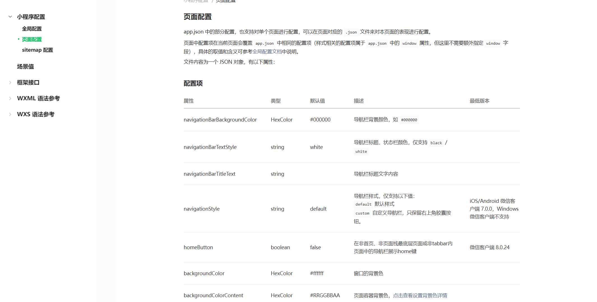


#### 3.1.2.3 整个项目配置文件

```python
#1 project.config.jsonproject.private.config.json	
#2  小程序项目的配置文件，用于保存项目的一些配置信息和开发者的个人设置
#3 参考
https://developers.weixin.qq.com/miniprogram/dev/devtools/projectconfig.html
```


#### 3.1.2.4 搜索相关配置

```python
# 微信现已开放小程序内搜索，开发者可以通过 sitemap.json 配置，或者管理后台页面收录开关来配置其小程序页面是否允许微信索引。当开发者允许微信索引时，微信会通过爬虫的形式，为小程序的页面内容建立索引。当用户的搜索词条触发该索引时，小程序的页面将可能展示在搜索结果中。 爬虫访问小程序内页面时，会携带特定的 user-agent：mpcrawler 及场景值：1129。需要注意的是，若小程序爬虫发现的页面数据和真实用户的呈现不一致，那么该页面将不会进入索引中

# 参考文档
https://developers.weixin.qq.com/miniprogram/dev/reference/configuration/sitemap.html
```


## 3.2 WebView渲染模式和纯净项目

### 3.2.1 WebView渲染模式

```python
# 1 默认使用Skyline 渲染模式，支持最新的基础库，不支持低版本客户端
	-打开app.json	，去掉 三个配置项
      "renderer": "skyline",
      "rendererOptions": {
        "skyline": {
          "defaultDisplayBlock": true,
          "disableABTest": true,
          "sdkVersionBegin": "3.0.0",
          "sdkVersionEnd": "15.255.255"
        }
      },
      "componentFramework": "glass-easel",
        
```


### 3.2.2 纯净项目

```python
# 所有都删除，只留如下图
```


## 3.3 新建页面

```python
# 1 在pages上，新建文件夹，logs
# 2 在文件夹上，右键--》新建页面，写上名字logs
	-创建出四个文件
# 3 在 app.json中的pages就会多一行
      "pages": [
        "pages/index/index",
        "pages/logs/logs"
      ],
       
    
# 4 新建页面可以直接在app.json中增加一行，pages下会自动创建出一个页面
  "pages": [
    "pages/index/index",
    "pages/logs/logs",
    "pages/login/login"
  ],
        
```

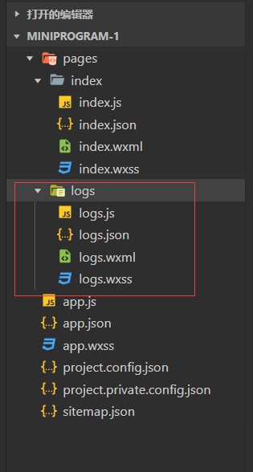

## 3.4 调整页面显示顺序

**修改顺序**

```python
# app.json，谁在第一行，一打开小程序就显示那个页面
  "pages": [
    "pages/index/index",
    "pages/logs/logs",
    "pages/login/login"
  ],
      
```

**临时添加**


**entryPagePath**

```python
"entryPagePath": "pages/index/index",
```


## 3.5 调试小程序

### 3.5.1 调试基础库

```python
#1  参考地址：
https://developers.weixin.qq.com/miniprogram/dev/framework/client-lib/version.html
    
# 2 有些低版本的基础库，可能不支持某个新功能
```


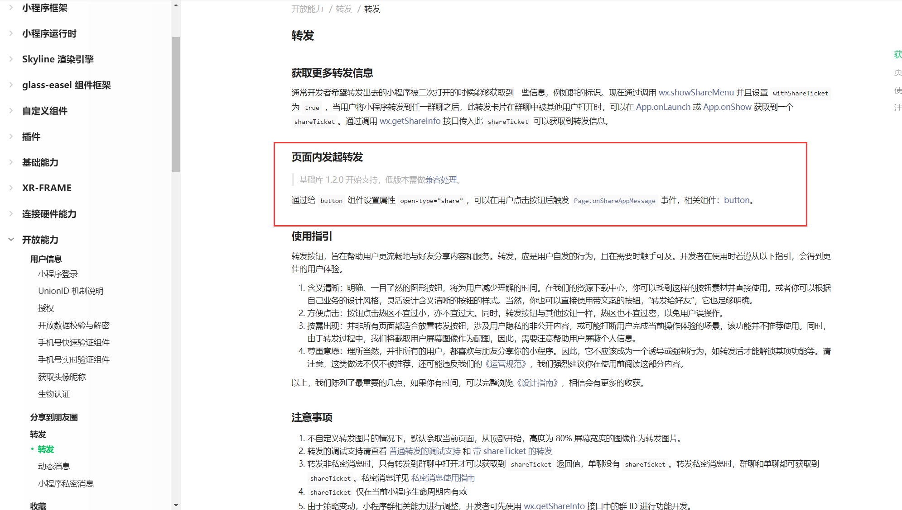

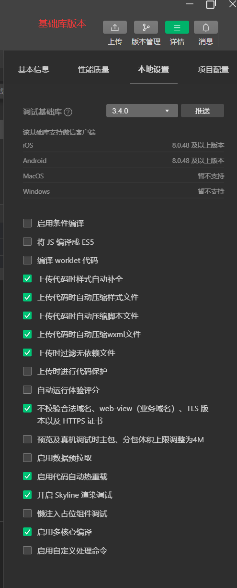


### 3.5.2 调试窗口

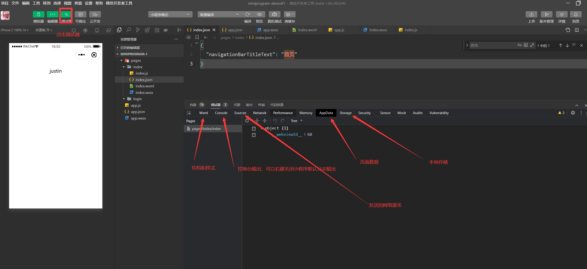

### 3.5.3 真机调试


# 四 快速上手

## 4.1 常用组件

```python
# 参考地址：
https://developers.weixin.qq.com/miniprogram/dev/component/
```

- text，类似于span

  ```xml
  <text>Justin</text>
  ```

- view，类似于div

  ```xml
  <view>
      <view>Python山顶会</view>
      <view>Justin</view>
      <view>微信：616564099</view>
  </view>
  ```

- image，类似于img标签

  ```xml
  <image src="/images/1.png" style="width: 750rpx;height: 400rpx;"></image>
  ```

- icon

  ```xml
  <icon type="success" size='198rpx' color="red"/>
  <icon type="download" size='198rpx' color="#ddd"/>
  ```

  ```
  success, success_no_circle, info, warn, waiting, cancel, download, search, clear
  ```

- 跳转，类似于a标签

  ```xml
  <navigator class="menu" url="/pages/login/login">
      <label class="fa fa-superpowers" style="color:#32CD32"></label>
    <view>登录</view>
  </navigator>
  ```

  

  绑定事件，在js中跳转：

  ```xml
  <view bindtap="clickMe" data-nid="123" >点我跳转</view>
  ```

  ```javascript
  Page({
  
    clickMe:function(e){
      var nid = e.currentTarget.dataset.nid;
      console.log(nid);
      wx.navigateTo({
        url: '/pages/login/login'
      })
    }
  })
  ```

  跳转到其他页面之后，可以在onLoad中获取参数，例如：

  ```
  wx.navigateTo({
  	url: '/pages/login/login?name=justin'
  })
  ```

  ```javascript
  Page({
    onLoad: function (options) {
      console.log(options);
    }
  })
  ```

  ****

## 4.2 尺寸单位 和样式

### 4.2.1 rpx

```python
# rpx 可以根据不同的手机屏幕进行自动调整，自适应缩放
	-无论什么手机--》屏幕宽度都是 750rpx
    
# xx.wxml
<view class="box">Justin</view>

# xx.wxss
.box {
  width: 375rpx;
  height: 500rpx;
  background-color: pink;
}
```

### 4.2.2 局部样式app.wxss

```python
.box {
  width: 400rpx;
  height: 400rpx;
  background-color: greenyellow;
}
```


### 4.2.3 全局样式 xxx.wxss

```python
# 局部覆盖全局
.box {
  width: 375rpx;
  height: 600rpx;
  background-color: pink;
}
```


# 五 tabbar配置

```python
"tabBar": {
    "selectedColor": "#b4282d",
    "position": "bottom",
    "list": [
        {
            "pagePath": "pages/index/index",
            "text": "首页",
            "iconPath": "images/home.png",
            "selectedIconPath": "images/home_select.png"
        },
        {
            "pagePath": "pages/my/my",
            "text": "我的",
            "iconPath": "images/my.png",
            "selectedIconPath": "images/my_select.png"
        }
    ]
},
```

