# 1 后端细节处理

## 1.1 SimpleUi后台显示中文

```python
#1  使用cursor的Tab补齐功能
# users-->apps.py 加入
verbose_name = '用户管理'

# words-->apps.py
verbose_name = '单词管理'

# testsys-->apps.py
verbose_name = '测试管理'


# 运行后端项目，访问：http://127.0.0.1:8000/admin/
```

## 1.2 插入更多测试记录

```python
帮我往后端mysql数据库的单词表和单词问题表，插入更多测试记录，每个题目都会有真实的错误选项
```

```python
import os
import django
import sys
import random

# 设置Django环境
BASE_DIR = os.path.dirname(os.path.abspath(__file__))
PROJECT_DIR = os.path.dirname(BASE_DIR)
sys.path.append(PROJECT_DIR)
os.environ.setdefault('DJANGO_SETTINGS_MODULE', 'config.settings')
django.setup()

from words.models import Word, Question

# 更多单词数据
words_data = [
    # 基础词汇 (CET4)
    {'word': 'apple', 'meaning': '苹果', 'level': 'CET4', 'difficulty': 1},
    {'word': 'banana', 'meaning': '香蕉', 'level': 'CET4', 'difficulty': 1},
    {'word': 'orange', 'meaning': '橙子', 'level': 'CET4', 'difficulty': 1},
    {'word': 'grape', 'meaning': '葡萄', 'level': 'CET4', 'difficulty': 1},
    {'word': 'pear', 'meaning': '梨', 'level': 'CET4', 'difficulty': 1},
    {'word': 'book', 'meaning': '书', 'level': 'CET4', 'difficulty': 1},
    {'word': 'pen', 'meaning': '钢笔', 'level': 'CET4', 'difficulty': 1},
    {'word': 'car', 'meaning': '汽车', 'level': 'CET4', 'difficulty': 1},
    {'word': 'house', 'meaning': '房子', 'level': 'CET4', 'difficulty': 1},
    {'word': 'water', 'meaning': '水', 'level': 'CET4', 'difficulty': 1},
    
    # 中级词汇 (CET6)
    {'word': 'beautiful', 'meaning': '美丽的', 'level': 'CET6', 'difficulty': 2},
    {'word': 'important', 'meaning': '重要的', 'level': 'CET6', 'difficulty': 2},
    {'word': 'difficult', 'meaning': '困难的', 'level': 'CET6', 'difficulty': 2},
    {'word': 'interesting', 'meaning': '有趣的', 'level': 'CET6', 'difficulty': 2},
    {'word': 'necessary', 'meaning': '必要的', 'level': 'CET6', 'difficulty': 2},
    {'word': 'possible', 'meaning': '可能的', 'level': 'CET6', 'difficulty': 2},
    {'word': 'different', 'meaning': '不同的', 'level': 'CET6', 'difficulty': 2},
    {'word': 'successful', 'meaning': '成功的', 'level': 'CET6', 'difficulty': 2},
    {'word': 'wonderful', 'meaning': '精彩的', 'level': 'CET6', 'difficulty': 2},
    {'word': 'dangerous', 'meaning': '危险的', 'level': 'CET6', 'difficulty': 2},
    
    # 高级词汇 (TOEFL/IELTS)
    {'word': 'accomplish', 'meaning': '完成', 'level': 'TOEFL', 'difficulty': 3},
    {'word': 'endeavor', 'meaning': '努力', 'level': 'TOEFL', 'difficulty': 3},
    {'word': 'persevere', 'meaning': '坚持', 'level': 'TOEFL', 'difficulty': 3},
    {'word': 'resilient', 'meaning': '有韧性的', 'level': 'TOEFL', 'difficulty': 3},
    {'word': 'profound', 'meaning': '深刻的', 'level': 'TOEFL', 'difficulty': 3},
    {'word': 'eloquent', 'meaning': '雄辩的', 'level': 'TOEFL', 'difficulty': 3},
    {'word': 'authentic', 'meaning': '真实的', 'level': 'TOEFL', 'difficulty': 3},
    {'word': 'innovative', 'meaning': '创新的', 'level': 'TOEFL', 'difficulty': 3},
    {'word': 'sophisticated', 'meaning': '复杂的', 'level': 'TOEFL', 'difficulty': 3},
    {'word': 'comprehensive', 'meaning': '全面的', 'level': 'TOEFL', 'difficulty': 3},
]

# 假数据选项库
fake_options = [
    '苹果', '香蕉', '橙子', '葡萄', '梨', '书', '钢笔', '汽车', '房子', '水',
    '美丽的', '重要的', '困难的', '有趣的', '必要的', '可能的', '不同的', '成功的', '精彩的', '危险的',
    '完成', '努力', '坚持', '有韧性的', '深刻的', '雄辩的', '真实的', '创新的', '复杂的', '全面的',
    '电脑', '手机', '桌子', '椅子', '窗户', '门', '树', '花', '草', '天空',
    '太阳', '月亮', '星星', '云', '雨', '雪', '风', '火', '山', '海',
    '狗', '猫', '鸟', '鱼', '马', '牛', '羊', '猪', '鸡', '鸭',
    '红色', '蓝色', '绿色', '黄色', '白色', '黑色', '紫色', '粉色', '橙色', '灰色',
    '大', '小', '高', '低', '快', '慢', '新', '旧', '好', '坏',
    '快乐', '悲伤', '愤怒', '平静', '紧张', '放松', '兴奋', '疲惫', '满足', '失望',
    '学习', '工作', '休息', '运动', '吃饭', '睡觉', '购物', '旅行', '阅读', '写作'
]

# 插入单词
for word_data in words_data:
    word, created = Word.objects.get_or_create(word=word_data['word'], defaults=word_data)
    if created:
        print(f"创建单词: {word_data['word']}")

# 为每个单词创建题目
for word in Word.objects.all():
    # 从假数据中随机选择3个错误选项，确保不包含正确答案
    available_fakes = [opt for opt in fake_options if opt != word.meaning]
    wrong_options = random.sample(available_fakes, 3)
    
    # 随机打乱选项顺序
    all_options = [word.meaning] + wrong_options
    random.shuffle(all_options)
    
    # 确定正确答案的位置
    answer = None
    for i, option in enumerate(all_options):
        if option == word.meaning:
            answer = chr(65 + i)  # A, B, C, D
            break
    
    # 创建选项字典
    options = {
        'A': all_options[0],
        'B': all_options[1], 
        'C': all_options[2],
        'D': all_options[3]
    }
    
    # 创建题目
    question, created = Question.objects.get_or_create(word=word, defaults={
        'options': options,
        'answer': answer,
        'type': 'choice'
    })
    if created:
        print(f"创建题目: {word.word} - {word.meaning} (答案: {answer})")

print('更多测试数据插入完成') 
```


# 2 小程序概述

## 2.1 什么是微信小程序

```python
# 1 微信小程序是一种运行在微信内部的 轻量级 应用程序
# 2 小程序无需下载和安装，只需要在微信中下拉，搜一搜 或 扫一扫 搜索点击使用即可

# 3 大前端概念
```


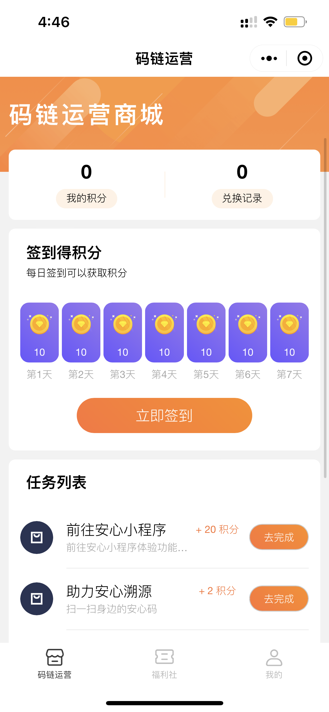

## 2.2 微信小程序账号注册

```python
# 1 访问【微信公众平台】，注册一个微信小程序账号
	-https://mp.weixin.qq.com/
# 2 申请账号需要准备一个邮箱，该邮箱要求：
    -未被微信公众平台注册
    -未被微信开放平台注册
    -未被个人微信号绑定过
    -如果被绑定了需要解绑 或 使用其他邮箱
```

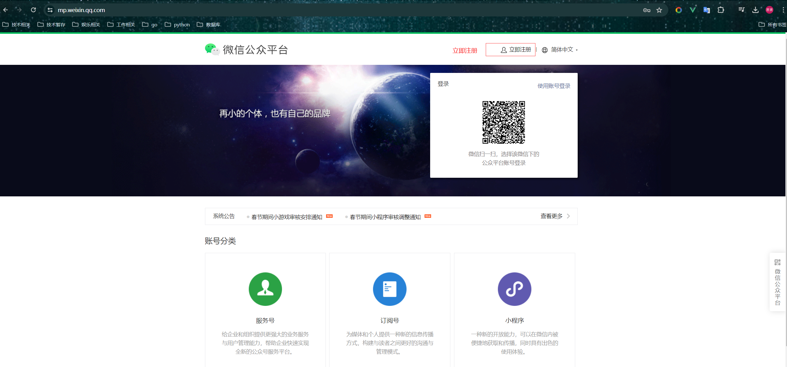


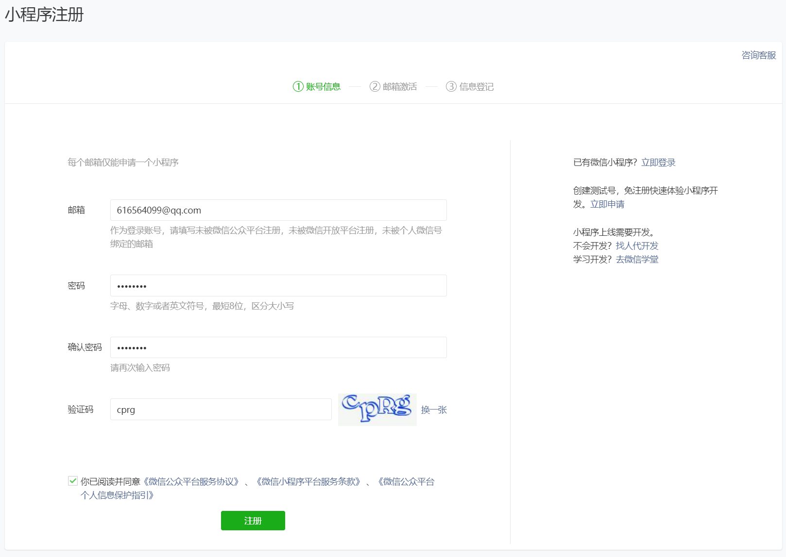


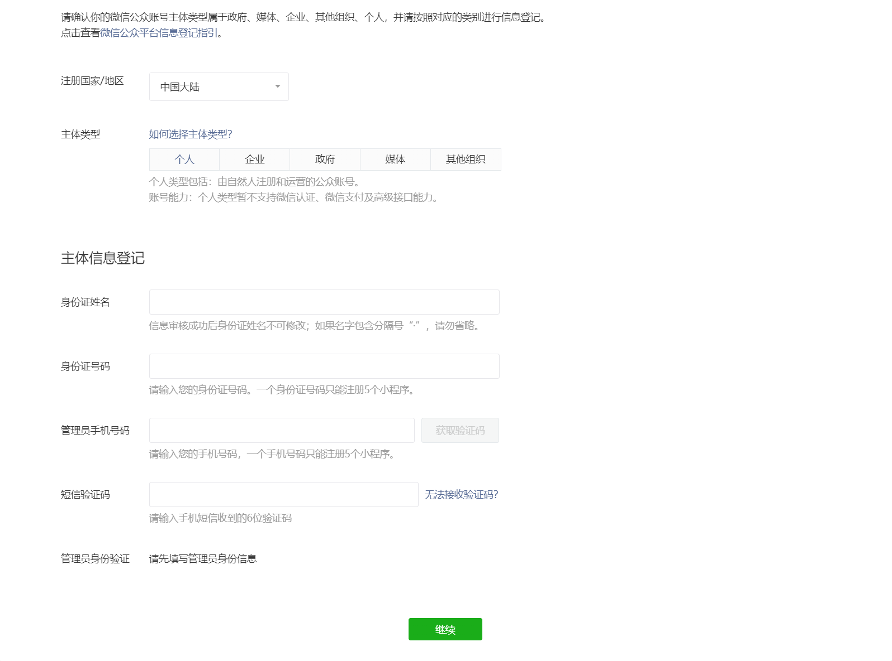

## 2.3 微信小程序信息配置

```python
# 1 注册成功后，需要打开微信公众平台对小程序账号进行一些设置
	-小程序后续需要 提交审核和上线--》提交审核时，小程序账号信息是必填项
	-名称、图标、类目等
    -小程序备案和微信认证
```

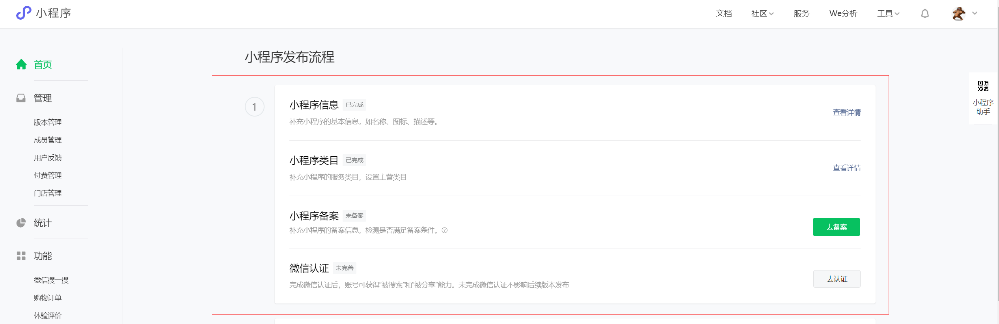


## 2.4 微信小程序开发流程

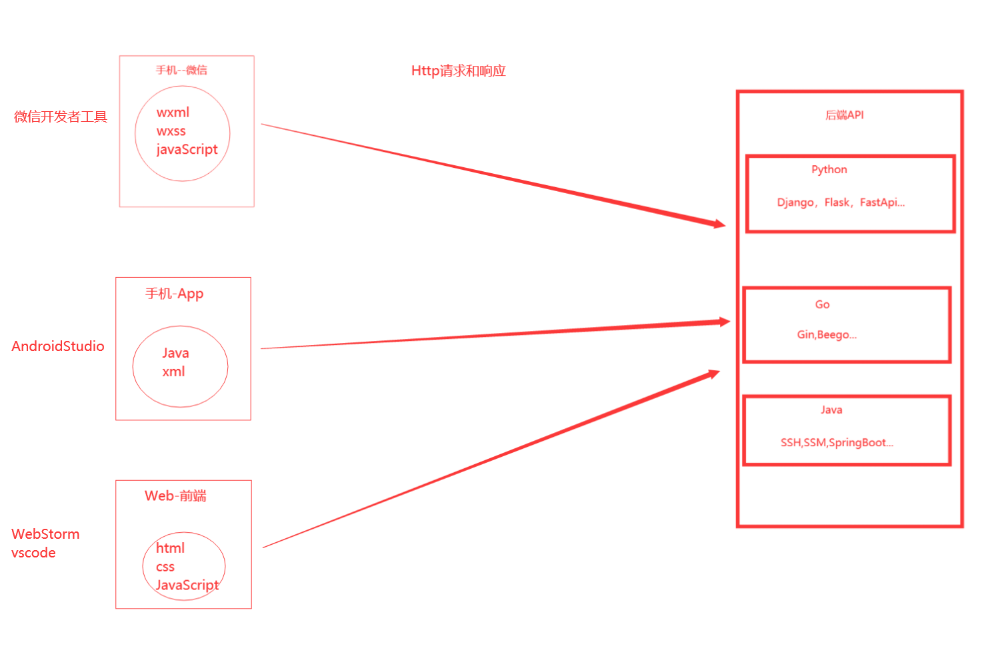

```python
# 微信小程序--》本地开发环境--》线上环境
	-本地：微信开发者工具+Pycharm开发Django
    -线上：
    	-体验版：几个人体验，API需要在公网
        -发布：备案，API需要在公网，全国各地人都可以用
```


## 2.5 微信小程序成员

```python
# 微信小程序成员分为两种
	-项目成员：表示参与小程序开发（我们）、运营的成员，包括运营者、开发者及数据分析者，项目成员可登陆微信公众后台，管理员可以在成员管理中添加、删除项目成员，并设置项目成员的角色。
	-体验成员：表示参与小程序内测体验的成员，可使用体验版小程序，但不属于项目成员。管理员及项目成员均可添加、删除体验成员。
```


# 3 创建项目

## 3.1 创建项目流程

```python
# 1 获取 小程序id
	-小程序后台--》开发--》开发管理--》开发设置--》开发者ID
    -AppID(小程序ID)	     wx539e097341fc7588	
	-AppSecret(小程序密钥)   77cce7b07b4c987aa50f12ab3e498aa9(不要泄露)
# 2 下载【微信开发工具】--需要联网才能使用
	-下载地址
    https://developers.weixin.qq.com/miniprogram/dev/devtools/stable.html
        
# 3 一路下一步安装

# 4 创建项目

# 5 配合后端API

```

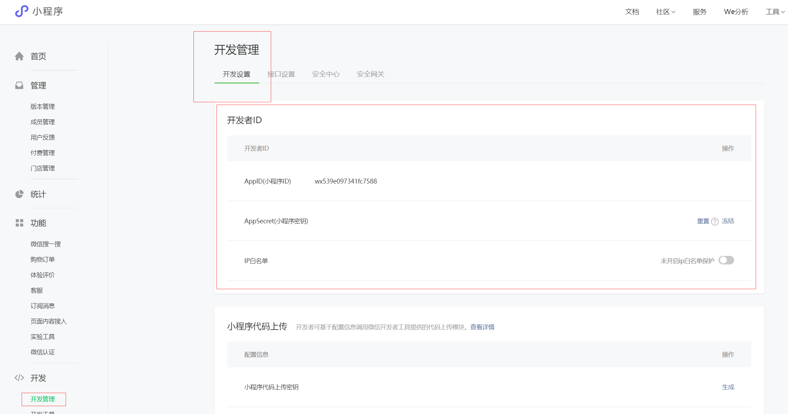

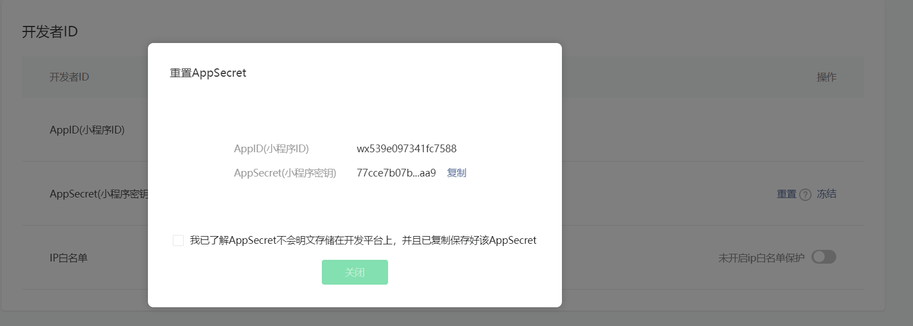


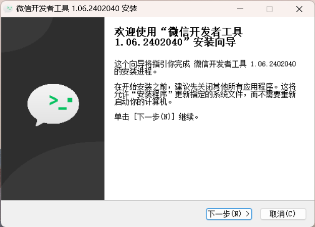


## 3.2 创建项目

```python
# 1 打开微信开发者工具--》使用微信扫描二维码
# 2 创建项目
	-填写名字
    -路径
    -APPID
    -不使用云开发【使用腾讯云的云函数，服务器等等，需要花钱】
    -不使用模版
# 3 创建完成后，界面如下

# 4 设置
	-设置--》编辑器设置--》改变字体大小
    -视图--》外观--》移动模拟器位置
    -可以勾选掉不显示：模拟器，调试器等
```


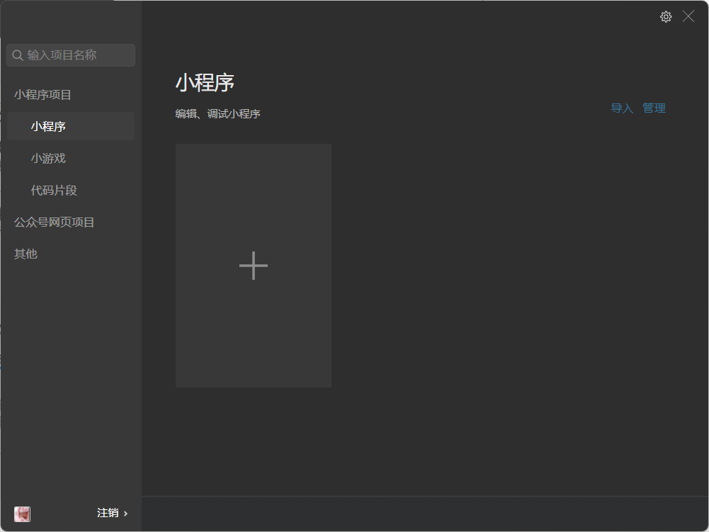


## 3.3 本地开发支持http

```python
# 1 django 运行在 0.0.0.0 的地址
# 2 小程序默认只支持https，我们需要做如下配置，让其支持http，方便我们本地开发
	-右上角--》详情--》本地设置--》不校验合法域名
```


# 4 项目目录

## 4.1 项目目录结构

### 4.1.1 目录介绍

```python
# 1 项目主配置文件
	项目主配置文件必须放到项目的根目录下，控制整个项目
    	- app.js：  小程序入口文件
    	- app.json：小程序的全局配置文件
    	- app.wxss：小程序的全局样式
    	-app.js 和 app.json 文件是必须的，不能没有
        
# 2 页面文件
	小程序有一个个页面，每个页面所需的文件，都存放在 pages 目录下，一个页面一个文件夹
        -xx.js：  页面逻辑  js代码存放位置
        -xx.wxml：页面结构  类html文件存放位置
        -xx.wxss：页面样式  css存放位置
        -xx.json：小页面配置 
        -xx.js 文件和 xx.wxml 文件是必须的，不能没有

        
# 3 相关配置文档
https://developers.weixin.qq.com/miniprogram/dev/reference/configuration/app.html
```


```python
├── components                  【页面中使用的组件】
├── pages   					【页面文件目录】
│   ├── index					【页面】
│   │   ├── index.js				【页面JS】
│   │   ├── index.json				【页面配置】
│   │   ├── index.wxml				【页面HTML】
│   │   └── index.wxss				【页面CSS】
│   └── logs					【页面】
│       ├── logs.js					...
│       ├── logs.json				...
│       ├── logs.wxml				...
│       └── logs.wxss				...
├── utils						【自定义工具】
│	└── utils.js					【功能的定义】
├── app.js						【全局JS】
├── app.json					【全局配置】
├── app.wxss					【全局CSS】
├── project.config.json			【开发者工具默认配置】
├── project.private.config.json	【开发者工具用户配置,在这里修改，优先用这个，可以删除】
├── .eslintrc.js				【ESlint语法检查配置】
├── sitemap.json				【微信收录页面，用于搜索，上线后，搜索关键字就可以搜到我们】
```


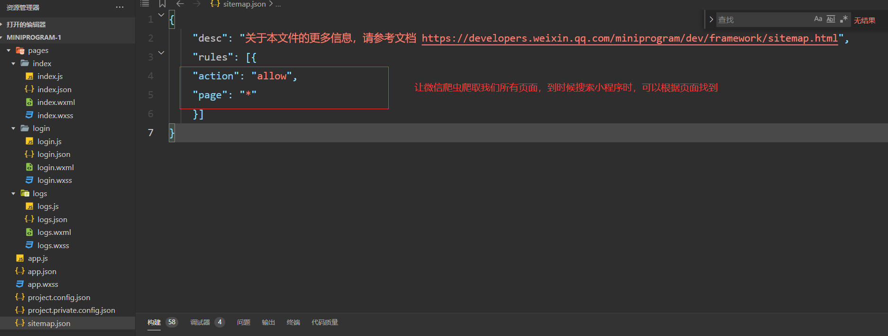

### 4.1.2 配置文件

#### 4.1.2.1 app.json

```python
#1 小程序全局配置文件，用于配置小程序的一些全局属性和页面路由

#2 参考地址 
https://developers.weixin.qq.com/miniprogram/dev/reference/configuration/app.html
    
# 3 app.json 配置
{
  "entryPagePath": "pages/login/login",
  "pages": [
    "pages/index/index",
    "pages/login/login"
    
  ],
    "window": {
      "navigationBarTitleText": "功能演示",   # 标题
      "navigationBarBackgroundColor": "#0000FF", #颜色
      "enablePullDownRefresh": false,  # 是否带下拉刷新
      "backgroundColor": "#00FFFF",    # 下拉刷新颜色
      "backgroundTextStyle": "dark"    # light ，下拉刷新的点点什么颜色
    },
  "style": "v2",
  "sitemapLocation": "sitemap.json"
}
```

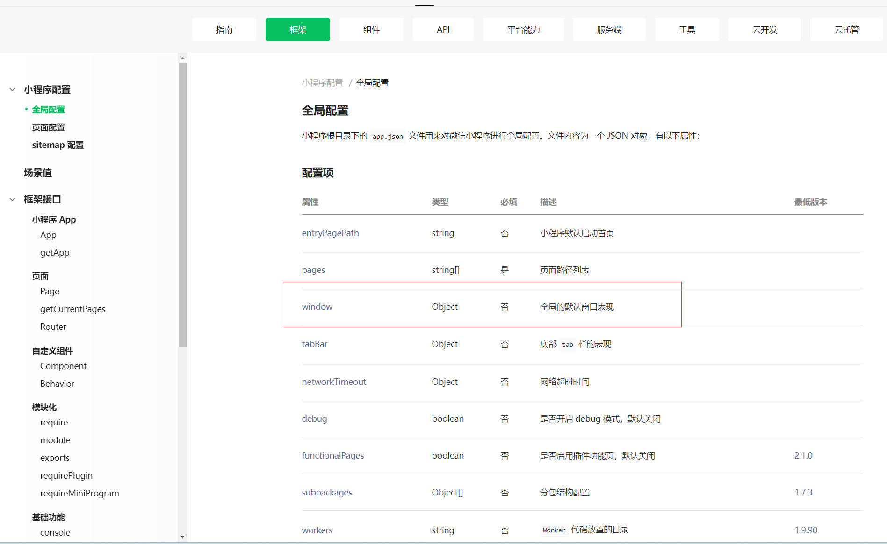

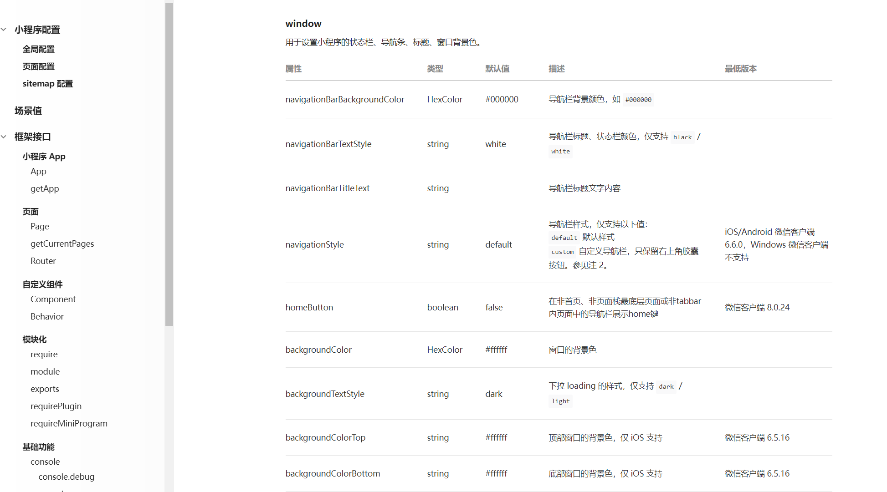

#### 4.1.2.2 页面配置

```python
# 1 小程序页面配置文件，也称局部配置文件，用于配置当前页面的窗口样式、页面标题等
# 2 app.json 中的部分配置，也支持对单个页面进行配置，可以在页面对应的 .json 文件来对本页面的表现进行配置。

# 3 页面中配置项在当前页面会覆盖 app.json 中相同的配置项（样式相关的配置项属于 app.json 中的 window 属性，但这里不需要额外指定 window 字段），具体的取值和含义可参考全局配置文档中说明\

# 4 参考
https://developers.weixin.qq.com/miniprogram/dev/reference/configuration/page.html
    
    
    
 # 5 配置
{
  "usingComponents": {},
  "navigationBarTitleText": "登录页面",
  "navigationBarBackgroundColor": "#000080",
  "enablePullDownRefresh": true,
  "backgroundTextStyle": "light"
}
```


#### 4.1.2.3 整个项目配置文件

```python
#1 project.config.jsonproject.private.config.json	
#2  小程序项目的配置文件，用于保存项目的一些配置信息和开发者的个人设置
#3 参考
https://developers.weixin.qq.com/miniprogram/dev/devtools/projectconfig.html
```

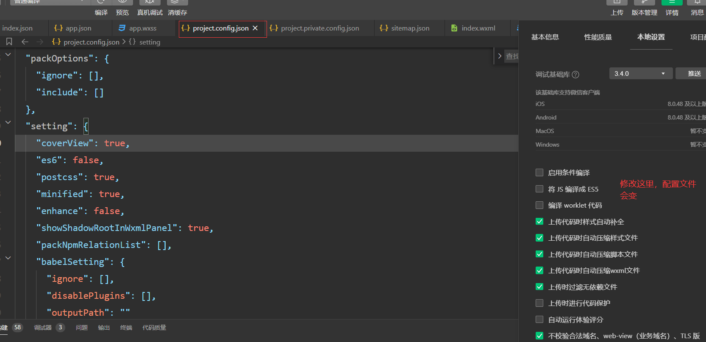

#### 4.1.2.4 搜索相关配置

```python
# 微信现已开放小程序内搜索，开发者可以通过 sitemap.json 配置，或者管理后台页面收录开关来配置其小程序页面是否允许微信索引。当开发者允许微信索引时，微信会通过爬虫的形式，为小程序的页面内容建立索引。当用户的搜索词条触发该索引时，小程序的页面将可能展示在搜索结果中。 爬虫访问小程序内页面时，会携带特定的 user-agent：mpcrawler 及场景值：1129。需要注意的是，若小程序爬虫发现的页面数据和真实用户的呈现不一致，那么该页面将不会进入索引中

# 参考文档
https://developers.weixin.qq.com/miniprogram/dev/reference/configuration/sitemap.html
```

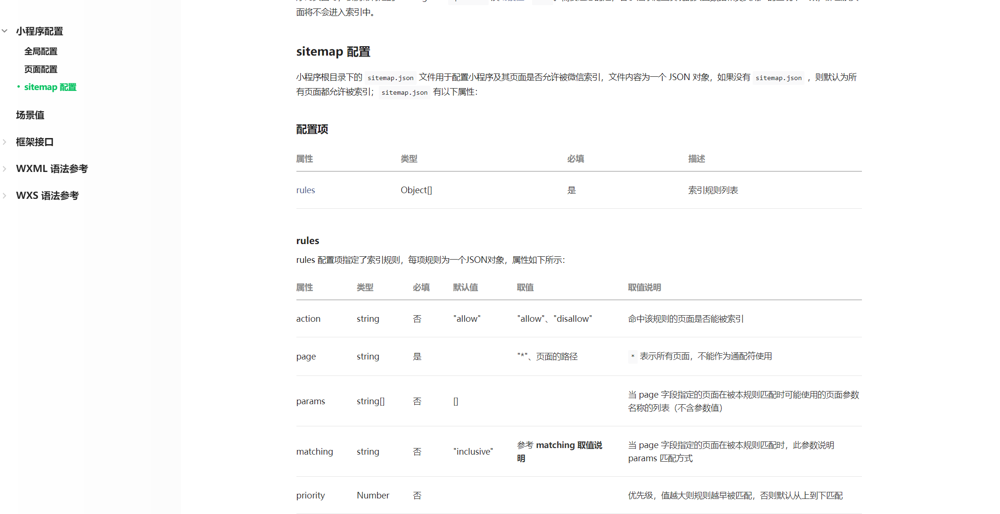


## 4.2 WebView渲染模式和纯净项目

### 4.2.1 WebView渲染模式

```python
# 1 默认使用Skyline 渲染模式，支持最新的基础库，不支持低版本客户端
	-打开app.json	，去掉 三个配置项
      "renderer": "skyline",
      "rendererOptions": {
        "skyline": {
          "defaultDisplayBlock": true,
          "disableABTest": true,
          "sdkVersionBegin": "3.0.0",
          "sdkVersionEnd": "15.255.255"
        }
      },
      "componentFramework": "glass-easel",
        
```

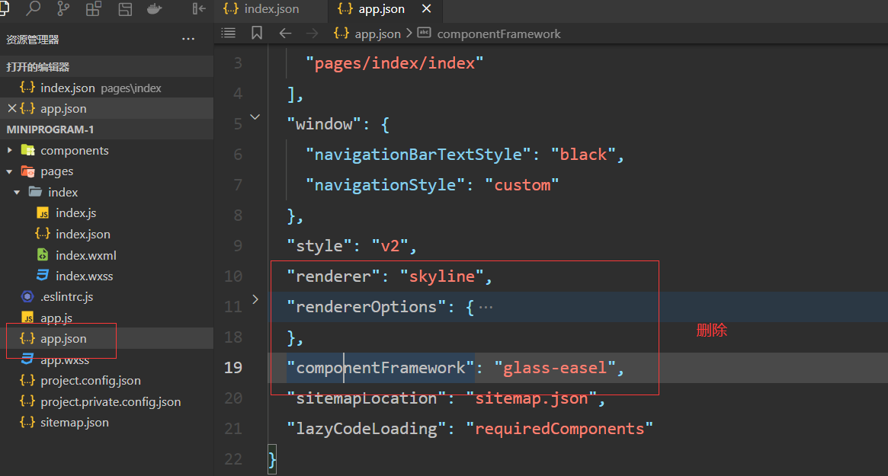

### 4.2.2 纯净项目

```python
# 所有都删除，只留如下图
```

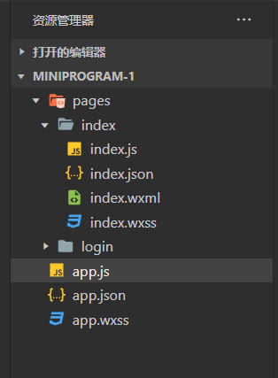

## 4.3 新建页面

```python
# 1 在pages上，新建文件夹，logs
# 2 在文件夹上，右键--》新建页面，写上名字logs
	-创建出四个文件
# 3 在 app.json中的pages就会多一行
      "pages": [
        "pages/index/index",
        "pages/logs/logs"
      ],
       
    
# 4 新建页面可以直接在app.json中增加一行，pages下会自动创建出一个页面
  "pages": [
    "pages/index/index",
    "pages/logs/logs",
    "pages/login/login"
  ],
        
```


## 4.4 调整页面显示顺序

**修改顺序**

```python
# app.json，谁在第一行，一打开小程序就显示那个页面
  "pages": [
    "pages/index/index",
    "pages/logs/logs",
    "pages/login/login"
  ],
      
```

**临时添加**

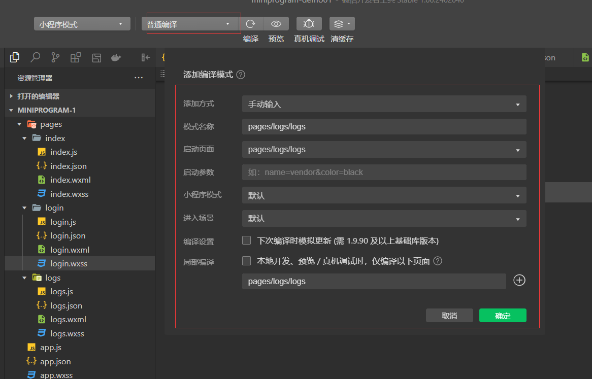

**entryPagePath**

```python
"entryPagePath": "pages/index/index",
```


## 4.5 调试小程序

### 4.5.1 调试基础库

```python
#1  参考地址：
https://developers.weixin.qq.com/miniprogram/dev/framework/client-lib/version.html
    
# 2 有些低版本的基础库，可能不支持某个新功能
```

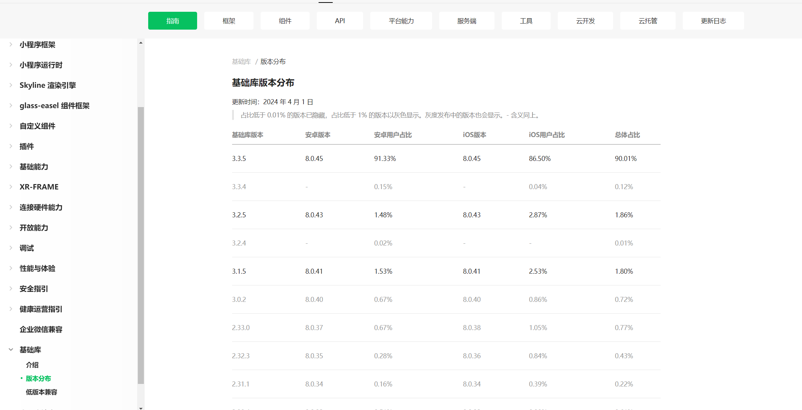


### 4.5.2 调试窗口


### 4.5.3 真机调试

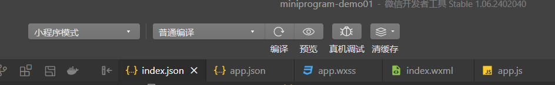

# 5 Cursor开发小程序端

## 5.1 使用cursor继续开发

```python
根据项目需求：@项目需求.md 和项目小程序架构文档：@2-项目小程序架构文档.md 和UI设计图:@/2-UI图设计  生成单词量测试小程序端代码
要求：
1.我已经创建了小程序：@/test_words_front ，你在这个基础上继续编写，无效的文件和文件夹帮我删除。
2.根据需求帮编写完小程序端代码。
3.接口参考后端项目：@/test_words_api ，并正常测试通过，前后端调通。
4.后端链接地址为：http://127.0.0.1:8000。
5.小程序不使用Skyline 渲染模式。
```

## 5.2 纠错

```python
帮我在小程序端加入，当点击开始测试时，如果后端数据库中没有当前openid，帮我创建用户
```


# 6 前后端联调


# 7 后端上线

## 7.1 购买云服务器


## 7.2 安装python3.11

```python
# 阿里云的centos上有python环境
	- python3.9.21     pip-->python/python3  pip/pip3 都被占了
  
 	-咱们项目开发，在3.11上开发的，需要使用3.11的解释器来运行


# 可以使用yum 安装，不能指定版本（yum install python   咱们不用）
# 源码安装，下载指定版本的源码，编译安装


#### 补充
# 所有linxu和mac，都自带python2：系统服务，是用python写的
# 阿里云的centos默认装了python3.6.8

# python2.7     python3.6.8     python3.9    装模块，不要乱套
   pip             pip             pip

#1  源码安装python，依赖一些第三方zlib* libffi-devel
dnf install openssl-devel bzip2-devel expat-devel readline-devel sqlite-devel psmisc libffi-devel zlib* libffi-devel  -y

# 1前往用户根目录
cd ~

#2 下载  3.11.9 源码 服务器终端
# https://registry.npmmirror.com/binary.html?path=python/
wget https://registry.npmmirror.com/-/binary/python/3.11.9/Python-3.11.9.tgz


#3  解压安装包
tar -xf Python-3.11.9.tgz

#4 进入目标文件
cd Python-3.11.9

#5  配置安装路径：/usr/local/python3
# 把3.11.9 编译安装到/usr/local/python311路径下
./configure --prefix=/usr/local/python311

#6  编译并安装,如果报错，说明缺依赖
yum install openssl-devel bzip2-devel expat-devel gdbm-devel readline-devel sqlite-devel psmisc libffi-devel zlib* libffi-devel  -y
# make只是编译----》可执行文件，没有安装
# 类似于在win上下载了安装包，但是没安装
# make install 安装---》类似于在win上下了安装包，一路下一步安装了，指定安装位置---》/usr/local/python39
make &&  make install

#7  建立软连接：/usr/local/python38路径不在环境变量，终端命令 python3，pip3
ln -s /usr/local/python311/bin/python3 /usr/bin/python3.11
ln -s /usr/local/python311/bin/pip3 /usr/bin/pip3.11

# 机器上有多个python和pip命令，对应关系如下
python       3.9      pip 
python3      3.9      pip3
python3.11   3.11      pip3.11

#8  删除安装包与文件：
rm -rf Python-3.11.9
rm -rf Python-3.11.9.tgz
```


## 7.3 安装nginx

```python
# 软件：反向代理服务器  （搜一下：什么是正向代理，什么是反向代理）  反向带代理服务器
  - 做请求转发    （前端来了个请求---》打在了80端口上---》转到本地8888端口，或者其他机器的某个端口）
  - 静态资源代理    前端项目直接放在服务器上某个位置----》请求来了，使用nginx拿到访问的内容，直接返回
  - 负载均衡       假设来了1000个请求--》打在nginx上，nginx性能很高，能顶住---》只转发到某个django项目，可能顶不住---》集群化的不是3台django---》均匀的打在3台机器上
    

    
    
# 前往用户根目录
cd ~

#下载nginx 1.28.0
wget https://nginx.org/download/nginx-1.28.0.tar.gz
#解压安装包
tar -xf nginx-1.28.0.tar.gz

#进入目标文件
cd nginx-1.28.0

# 配置安装路径：/usr/local/nginx
# 安装 PCRE 开发包的名称是 pcre-devel，支持https访问
#zlib-devel：用于 gzip 压缩模块。openssl-devel：用于 SSL/TLS 模块（如启用 HTTPS） gcc 和 make：编译工具链
dnf install -y pcre-devel gcc make zlib-devel openssl-devel
./configure --prefix=/usr/local/nginx --with-http_ssl_module
#编译并安装
 make &&  make install

# 建立软连接：终端命令 nginx
ln -s /usr/local/nginx/sbin/nginx /usr/bin/nginx 

#删除安装包与文件：
cd ~
rm -rf nginx-1.28.0
rm -rf nginx-1.28.0.tar.xz

# 测试Nginx环境，服务器运行nginx，本地访问服务器ip
nginx   # 启动nginx服务，监听80端口----》公网ip 80 端口就能看到页面了
服务器绑定的域名 或 ip:80

# 静态文件放的路径
/usr/local/nginx/html

# 查看进程
ps aux | grep nginx


# 关闭和启动
关闭：nginx -s stop 
启动： nginx


# 它有配置文件---》配置监听那些地址，配置代理那些静态文件---》还没讲
```

## 7.4 安装mysql 8

```python
### 1 官方yum源
https://dev.mysql.com/downloads/repo/yum/

### 2 下载对应版本mysql源到本地，如果系统是centos9，这里选择el9版本
# no architecture的缩写，说明这个包可以在各个不同的cpu上使用
我们选择  mysql84-community-release-el9-1.noarch.rpm

### 3 或者直接来到：https://repo.mysql.com/
找到相应版本下载，我们下载
https://dev.mysql.com/downloads/file/?id=528548
### 4 下载rpm包
wget https://dev.mysql.com/get/mysql84-community-release-el9-1.noarch.rpm

### 5 安装rpm包
dnf install -y mysql84-community-release-el9-1.noarch.rpm

### 6 开始安装
dnf install -y mysql-community-server --nogpgcheck  # 会自动把客户端装上
### 7 启动，查看状态
systemctl start mysqld
systemctl status mysqld

### 8 查看默认密码并登录
grep "password" /var/log/mysqld.log  #    S/dZiJGyL8wM

### 9 修改密码
mysql -uroot -p
SELECT user, host, plugin FROM mysql.user;
ALTER USER 'root'@'localhost' IDENTIFIED BY 'Lqz12345?';

#创建用户
CREATE USER 'lqz'@'localhost' IDENTIFIED BY 'Lqz12345?';
CREATE USER 'lqz'@'%' IDENTIFIED BY 'Lqz12345?';
GRANT ALL PRIVILEGES ON *.* TO 'lqz'@'localhost' WITH GRANT OPTION;
GRANT ALL PRIVILEGES ON *.* TO 'lqz'@'%' WITH GRANT OPTION;

### 10 查看mysql版本
mysql -V


######## 后面上线项目时应该做的## 现在直接做了

#11 创建words库
create database words default charset=utf8mb4;


#### 使用navicat 链接###
如果链接不上，就是安全组没开


# 12 安装mysqlclient
dnf install python3-devel mysql-devel --nogpgcheck -y

pip3.11 install mysqlclient

# 13 
pip3.11 install urllib3==1.26.15
pip3.11 install chardet

#14 
mkdir static
STATIC_ROOT = '/root/words_api/static/'
```

## 7.5 编写uwsig配置文件

```python
# 0 安装依赖
pip3.11 install -r requirements.txt 

#1 words_api.ini
[uwsgi]
socket = 127.0.0.1:8080
chdir = /root/test_words_api/
wsgi-file = backend.wsgi
processes = 4
threads = 2
master = true
daemonize = uwsgi.log

#2 安装uwsgi 
dnf install -y python3-devel gcc libxml2-devel
pip3.11 install uwsgi
ln -s /usr/local/python311/bin/uwsgi /usr/bin/uwsgi

# 3 启动uwsgi
uwsgi words_api.ini

# 4 查看
ps aux |grep uwsgi

# 5 停止
pkill -9 uwsgi
```


## 7.6 上传项目

```python
#1 修改配置文件配置文件
DEBUG = False
ALLOWED_HOSTS = ['*']
##数据库配置##
##后台地址 ---》同步修改之前写死的后端地址--》views中
BACKEND_URL='http://127.0.0.1:8000'

#2 生成依赖
pip install pipreqs
pipreqs ./ --encoding=utf-8

baidu_aip==4.16.13
Django==3.2.22
djangorestframework==3.14.0
djangorestframework_simplejwt==5.3.1
Faker==25.0.1
pypinyin==0.51.0
SpeechRecognition==3.10.3
tencentcloud_sdk_python==3.0.1115
mysqlclient

#3 服务器 安装上传和解压模块
yum install lrzsz unzip -y

#4 上传项目
rz

#5 服务器安装依赖
# mysqlclient
yum install python3-devel -y
yum install mysql-devel --nogpgcheck -y
pip install mysqlclient

#6 出现错误：ImportError: urllib3 v2.0 only supports OpenSSL 1.1.1+, currently the 'ssl'
pip install urllib3==1.26.15 
```


## 7.7 nginx 配置（http访问）

```python
# 6 配置nginx转发
cd /usr/local/nginx/conf
vi nginx.conf
# 新增的server
events {
    worker_connections  1024;
}
http {
    include       mime.types;
    default_type  application/octet-stream;
    sendfile        on;
	server {
        listen 8000;
        server_name  127.0.0.1;
        charset utf-8;
        location / {
            include uwsgi_params;
            uwsgi_pass 127.0.0.1:8080;
            uwsgi_param UWSGI_SCRIPT backend.wsgi; 
            uwsgi_param UWSGI_CHDIR /root/test_words_api/;
            }
        location /static {
            alias /home/static;
       		}
        }
}


# 重启nginx 
nginx -s reload
```

### 7.7.1 安全组 配置

```python
安全组-云服务器
```


## 7.8 配置admin访问

```python
# http://47.116.207.103:8000/static/rest_framework/css/bootstrap.min.css

#  1 后端项目，使用uwsgi部署完成，可以访问动态接口，但不能访问静态资源

# 2 uwsgi为了提高效 率，只处理动态请求，静态资源的获取，不管
	-静态资源就是在从服务器把文件，图片，js，css，直接返回
    -如果静态资源也走uwsgi，会影响uwsgi的性能
  
  10     2 个动态接口    8个 拿静态资源
  				usgi只负责处理这两个动态接口
    			静态资源不管---》自行处理
      
      
# 3 动静分离
	-动态请求给uwsgi---》让它处理---》uwsgi资源宝贵，尽量少用
  	动态请求地址： /api/v1....
    -静态请求，使用nginx，直接处理---》nginx来讲，最擅长处理静态资源
  		静态资源地址： /static/...
    
    
# 4 请求发送到nginx监听的 8000 端口上的时候，判断 如果是 / --->转发给uwsgi  ，如果是 /static--->直接去固定的位置，把静态资源直接返回，不走uwsgi了，节约uwsgi的性能


# 5 配置nginx，做静态文件代理---》收集静态资源
	-simpleui
  	-drf   
  	-都在自己app中，我们需要把他们单独收集到某个位置
  
  
  -后期如果部署前后端混合项目必须要做动静分离，收集静态文件
  
  
  
  
# 6 操作步骤

#6.1  收集静态资源，使用nginx代理
# settings.py中加入   把静态资源收集到这个文件夹下
STATIC_ROOT = '/home/static/'


# 6.2 进入虚拟环境
mkdir /home/static
python3.11 manage.py collectstatic


http://106.14.156.208:8000/static/admin/simpleui-x/img/logo.png


# 6.3 修改nginx配置文件
# 新增的配置静态文件

server {

        location /static {
            alias /home/static;
       }
      }
 
 # 6.4 重启nginx
	nginx -s reload
  
```


## 7.9 阿里云证书

```python
https://yundun.console.aliyun.com/?spm=5176.12818093_47.top-nav.23.57ea16d02gIoxM&p=cas#/certExtend/free/cn-hangzhou
    
#https://help.aliyun.com/zh/ssl-certificate/user-guide/install-ssl-certificates-on-nginx-servers-or-tengine-servers?spm=0.2020520163.0.0.1c20J0IlJ0IlNH
```


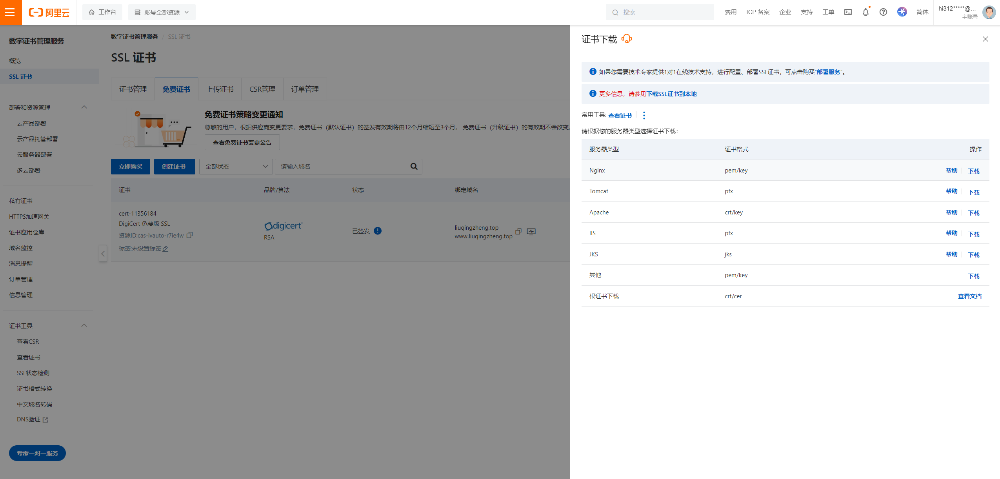


### 7.9.1 配置https访问

```python
events {
    worker_connections  1024;
}
http {
    include       mime.types;
    default_type  application/octet-stream;
    sendfile        on;
    client_max_body_size 20M;
	server {
    	listen 443 ssl;
     	ssl_certificate /usr/local/nginx/cert/liuqingzheng.top.pem;
     	ssl_certificate_key /usr/local/nginx/cert/liuqingzheng.top.key;
        server_name  liuqingzheng.top;
        location / {
            include uwsgi_params;
            uwsgi_pass 127.0.0.1:8080;
            uwsgi_param UWSGI_SCRIPT smart_backend.wsgi;
            uwsgi_param UWSGI_CHDIR /root/smart_backend/;
            }

       location /static {
            alias /home/static;
       }
    }
}
```

## 7.10 购买域名-备案-配置域名解析

```python
# 1 购买域名

# 2 备案

# 3 配置解析
https://dc.console.aliyun.com/next/index?spm=5176.12818093_47.top-nav.40.3be916d0be3QME#/overview
```


# 8 小程序上线

```python
# 1 小程序后台
https://mp.weixin.qq.com/wxamp/home/guide?lang=zh_CN&token=1879741752
 
#2  修改小程序地址
const rootUrl = 'https://www.liuqingzheng.top'

# 3 上传，设为体验版,配置体验成员--测试

# 4 备案，提交审核，等待审核通过
```


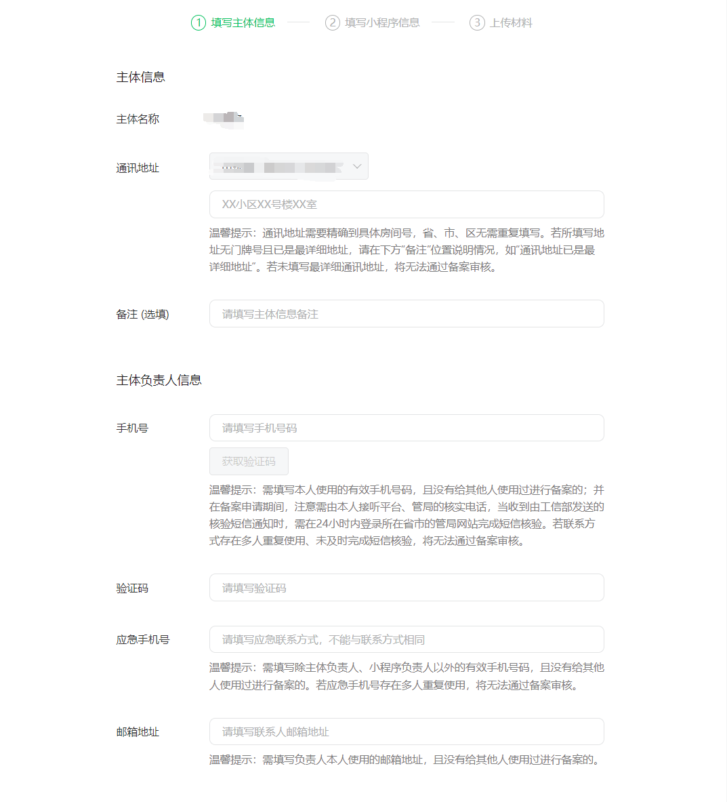


# 补充：

## 1 Cursor配置多个终端

```python

## 1 打开设置（settings.json）
 Cursor 右上角点击齿轮图标--》“设置”--》打开设置界面
 General--->Edditor Settings--》Open
 右上角点击 “打开设置（JSON）”，进入 settings.json
## 2 添加或更新配置 ###注意：路径应使用双反斜杠（\\），否则 JSON 将解析错误。
在 settings.json 中添加以下内容
{
    "terminal.integrated.profiles.windows": {
        "Command Prompt": {
            "path": "C:\\Windows\\System32\\cmd.exe"
        },
        "PowerShell": {
            "source": "PowerShell"
        },
        "Git Bash": {
            "path": "D:\\Program Files\\Git\\bin\\bash.exe",
            "args": ["--login", "-i"]
        },
        "WSL": {
            "path": "C:\\Windows\\System32\\wsl.exe"
        }
    },
    "terminal.integrated.defaultProfile.windows": "Command Prompt",
    "files.autoSave": "afterDelay"
}

# 3 完成设置后，建议执行以下操作：
关闭所有当前打开的终端窗口
重启 Cursor
再次打开终端，终端应默认使用 CMD（命令提示符）
```

## 2 Ctrl+鼠标滚轮控制字体大小

```python
## 1 打开设置（settings.json）
 Cursor 右上角点击齿轮图标--》“设置”--》打开设置界面
 General--->Edditor Settings--》Open
 右上角点击 “打开设置（JSON）”，进入 settings.json
## 2 添加或更新配置 在配置文件中加入

"editor.mouseWheelZoom": true,

###记得上面一行 后面加逗号

### 下面是编辑器字体大小和cursor的对话框字体大小
"editor.fontSize": 35,
"cursor.composer.textSizeScale": 1.8,
```


