# 今日内容

# 1  后端细节处理

## 1.0 运行后端项目

```python
# 1 在命令行中：输入 python manage.py runserver
# 2 使用cursor，让它帮我们启动
	-输入提示词即可
```


## 1.1 SimpleUi后台显示中文

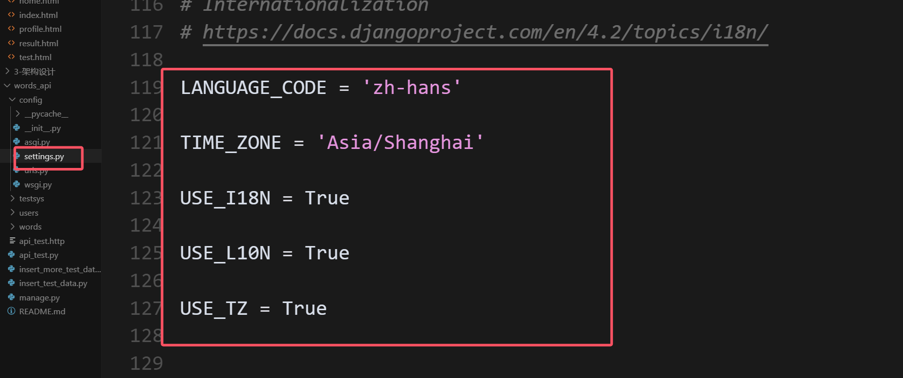

```python
#1  使用cursor的Tab补齐功能
# users-->apps.py 加入
verbose_name = '用户管理'

# words-->apps.py
verbose_name = '单词管理'

# testsys-->apps.py
verbose_name = '测试管理'


# 运行后端项目，访问：http://127.0.0.1:8000/admin/
```

## 1.2 插入更多测试记录

```python
帮我往后端mysql数据库的单词表和单词问题表，插入更多测试记录，每个题目都会有真实的错误选项
```


```python
import os
import django
import sys
import random

# 设置Django环境
BASE_DIR = os.path.dirname(os.path.abspath(__file__))
PROJECT_DIR = os.path.dirname(BASE_DIR)
sys.path.append(PROJECT_DIR)
os.environ.setdefault('DJANGO_SETTINGS_MODULE', 'config.settings')
django.setup()

from words.models import Word, Question

# 更多单词数据
words_data = [
    # 基础词汇 (CET4)
    {'word': 'apple', 'meaning': '苹果', 'level': 'CET4', 'difficulty': 1},
    {'word': 'banana', 'meaning': '香蕉', 'level': 'CET4', 'difficulty': 1},
    {'word': 'orange', 'meaning': '橙子', 'level': 'CET4', 'difficulty': 1},
    {'word': 'grape', 'meaning': '葡萄', 'level': 'CET4', 'difficulty': 1},
    {'word': 'pear', 'meaning': '梨', 'level': 'CET4', 'difficulty': 1},
    {'word': 'book', 'meaning': '书', 'level': 'CET4', 'difficulty': 1},
    {'word': 'pen', 'meaning': '钢笔', 'level': 'CET4', 'difficulty': 1},
    {'word': 'car', 'meaning': '汽车', 'level': 'CET4', 'difficulty': 1},
    {'word': 'house', 'meaning': '房子', 'level': 'CET4', 'difficulty': 1},
    {'word': 'water', 'meaning': '水', 'level': 'CET4', 'difficulty': 1},
    
    # 中级词汇 (CET6)
    {'word': 'beautiful', 'meaning': '美丽的', 'level': 'CET6', 'difficulty': 2},
    {'word': 'important', 'meaning': '重要的', 'level': 'CET6', 'difficulty': 2},
    {'word': 'difficult', 'meaning': '困难的', 'level': 'CET6', 'difficulty': 2},
    {'word': 'interesting', 'meaning': '有趣的', 'level': 'CET6', 'difficulty': 2},
    {'word': 'necessary', 'meaning': '必要的', 'level': 'CET6', 'difficulty': 2},
    {'word': 'possible', 'meaning': '可能的', 'level': 'CET6', 'difficulty': 2},
    {'word': 'different', 'meaning': '不同的', 'level': 'CET6', 'difficulty': 2},
    {'word': 'successful', 'meaning': '成功的', 'level': 'CET6', 'difficulty': 2},
    {'word': 'wonderful', 'meaning': '精彩的', 'level': 'CET6', 'difficulty': 2},
    {'word': 'dangerous', 'meaning': '危险的', 'level': 'CET6', 'difficulty': 2},
    
    # 高级词汇 (TOEFL/IELTS)
    {'word': 'accomplish', 'meaning': '完成', 'level': 'TOEFL', 'difficulty': 3},
    {'word': 'endeavor', 'meaning': '努力', 'level': 'TOEFL', 'difficulty': 3},
    {'word': 'persevere', 'meaning': '坚持', 'level': 'TOEFL', 'difficulty': 3},
    {'word': 'resilient', 'meaning': '有韧性的', 'level': 'TOEFL', 'difficulty': 3},
    {'word': 'profound', 'meaning': '深刻的', 'level': 'TOEFL', 'difficulty': 3},
    {'word': 'eloquent', 'meaning': '雄辩的', 'level': 'TOEFL', 'difficulty': 3},
    {'word': 'authentic', 'meaning': '真实的', 'level': 'TOEFL', 'difficulty': 3},
    {'word': 'innovative', 'meaning': '创新的', 'level': 'TOEFL', 'difficulty': 3},
    {'word': 'sophisticated', 'meaning': '复杂的', 'level': 'TOEFL', 'difficulty': 3},
    {'word': 'comprehensive', 'meaning': '全面的', 'level': 'TOEFL', 'difficulty': 3},
]

# 假数据选项库
fake_options = [
    '苹果', '香蕉', '橙子', '葡萄', '梨', '书', '钢笔', '汽车', '房子', '水',
    '美丽的', '重要的', '困难的', '有趣的', '必要的', '可能的', '不同的', '成功的', '精彩的', '危险的',
    '完成', '努力', '坚持', '有韧性的', '深刻的', '雄辩的', '真实的', '创新的', '复杂的', '全面的',
    '电脑', '手机', '桌子', '椅子', '窗户', '门', '树', '花', '草', '天空',
    '太阳', '月亮', '星星', '云', '雨', '雪', '风', '火', '山', '海',
    '狗', '猫', '鸟', '鱼', '马', '牛', '羊', '猪', '鸡', '鸭',
    '红色', '蓝色', '绿色', '黄色', '白色', '黑色', '紫色', '粉色', '橙色', '灰色',
    '大', '小', '高', '低', '快', '慢', '新', '旧', '好', '坏',
    '快乐', '悲伤', '愤怒', '平静', '紧张', '放松', '兴奋', '疲惫', '满足', '失望',
    '学习', '工作', '休息', '运动', '吃饭', '睡觉', '购物', '旅行', '阅读', '写作'
]

# 插入单词
for word_data in words_data:
    word, created = Word.objects.get_or_create(word=word_data['word'], defaults=word_data)
    if created:
        print(f"创建单词: {word_data['word']}")

# 为每个单词创建题目
for word in Word.objects.all():
    # 从假数据中随机选择3个错误选项，确保不包含正确答案
    available_fakes = [opt for opt in fake_options if opt != word.meaning]
    wrong_options = random.sample(available_fakes, 3)
    
    # 随机打乱选项顺序
    all_options = [word.meaning] + wrong_options
    random.shuffle(all_options)
    
    # 确定正确答案的位置
    answer = None
    for i, option in enumerate(all_options):
        if option == word.meaning:
            answer = chr(65 + i)  # A, B, C, D
            break
    
    # 创建选项字典
    options = {
        'A': all_options[0],
        'B': all_options[1], 
        'C': all_options[2],
        'D': all_options[3]
    }
    
    # 创建题目
    question, created = Question.objects.get_or_create(word=word, defaults={
        'options': options,
        'answer': answer,
        'type': 'choice'
    })
    if created:
        print(f"创建题目: {word.word} - {word.meaning} (答案: {answer})")

print('更多测试数据插入完成') 
```


# 2 小程序概述
## 2.1 小程序账号注册

```python
# 1 访问【微信公众平台】，注册一个微信小程序账号
	-https://mp.weixin.qq.com/
# 2 申请账号需要准备一个邮箱，该邮箱要求：
    -未被微信公众平台注册
    -未被微信开放平台注册
    -未被个人微信号绑定过
    -如果被绑定了需要解绑 或 使用其他邮箱
```


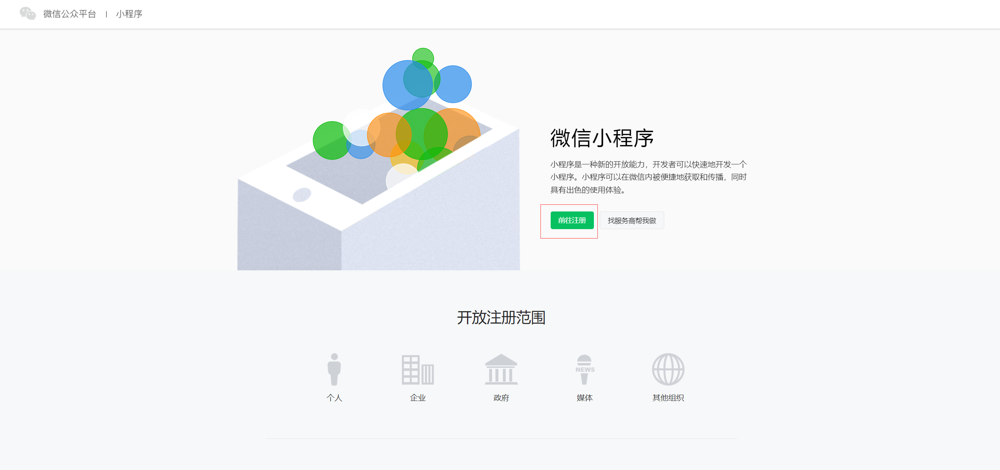


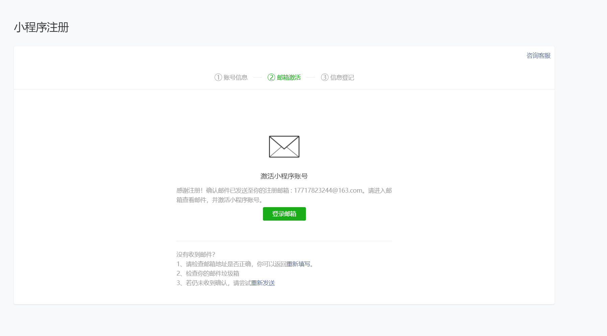


## 2.2 微信小程序信息配置

```python
# 1 注册成功后，需要打开微信公众平台对小程序账号进行一些设置
	-小程序后续需要 提交审核和上线--》提交审核时，小程序账号信息是必填项
	-名称、图标、类目等
    -小程序备案和微信认证
```


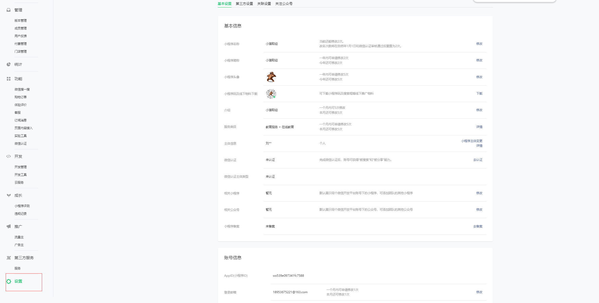

## 2.3 微信小程序开发流程

```python
# 我们目前使用cursor 开发微信小程序---》本地开发
	- 微信小程序端：小程序原生--》cursor
    - 后台：python+django--》cursor
    	-云开发：腾讯提供的可以存储数据的，可以运行少量代码的平台---》花钱
        -自己开发后端，上线--》公司里方式
```


## 2.4 微信小程序成员

```python
# 微信小程序成员分为两种
	-项目成员：表示参与小程序开发（我们）、运营的成员，包括运营者、开发者及数据分析者，项目成员可登陆微信公众后台，管理员可以在成员管理中添加、删除项目成员，并设置项目成员的角色。
	-体验成员：表示参与小程序内测体验的成员，可使用体验版小程序，但不属于项目成员。管理员及项目成员均可添加、删除体验成员。
```


# 3 创建项目

>创建项目流程--必须用微信开发者工具
>
>开发代码使用Cursor
>
>不要使用Cursor直接创建微信小程序
>
>回想：我们开发 后端，是cursor直接创建出项目，并编写的

## 3.1 创建项目流程--必须用微信开发者工具

```python
# 1 获取 小程序id
	-小程序后台--》开发--》开发管理--》开发设置--》开发者ID
    -AppID(小程序ID)	     wx539e097341fc7588	
# 2 下载【微信开发工具】--需要联网才能使用
	-下载地址
    https://developers.weixin.qq.com/miniprogram/dev/devtools/stable.html
        
# 3 一路下一步安装

# 4 创建项目

# 5 配合后端API
```


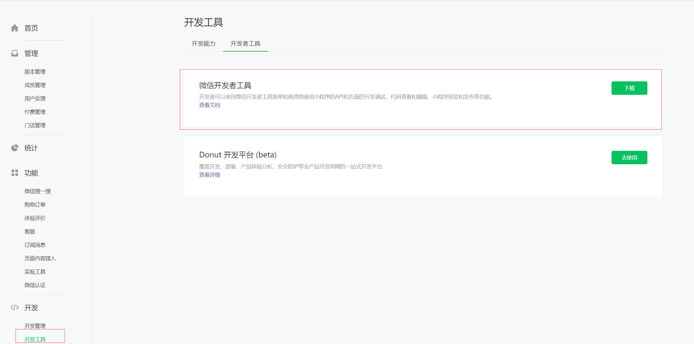

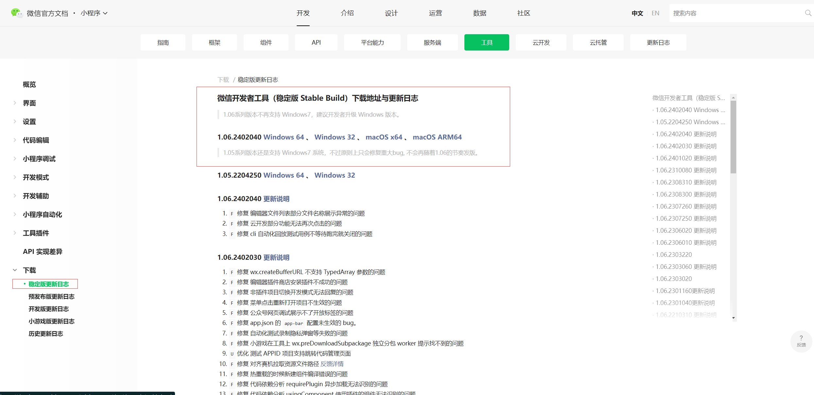


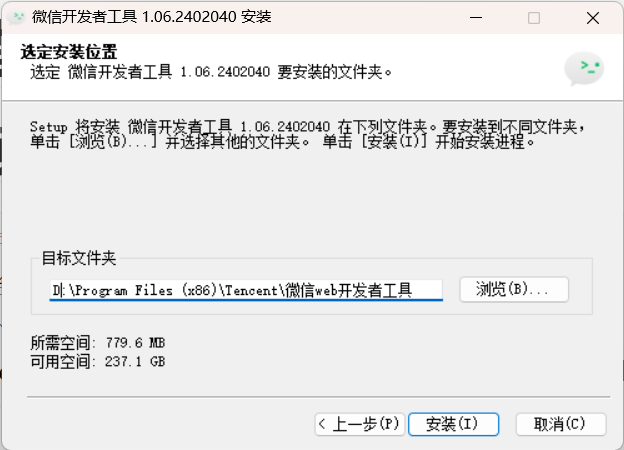

## 3.2 创建项目

```python
# 1 打开微信开发者工具--》使用微信扫描二维码
# 2 创建项目
	-填写名字
    -路径
    -APPID
    -不使用云开发【使用腾讯云的云函数，服务器等等，需要花钱】
    -不使用模版
# 3 创建完成后，界面如下

# 4 设置
	-设置--》编辑器设置--》改变字体大小
    -视图--》外观--》移动模拟器位置
    -可以勾选掉不显示：模拟器，调试器等
```


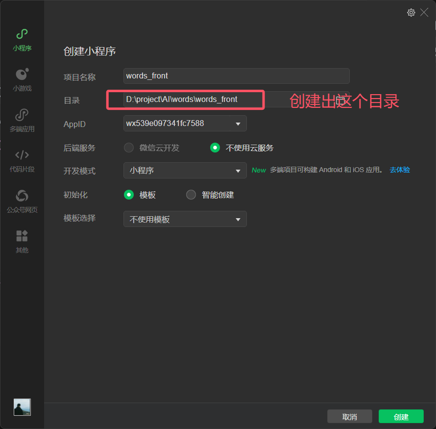


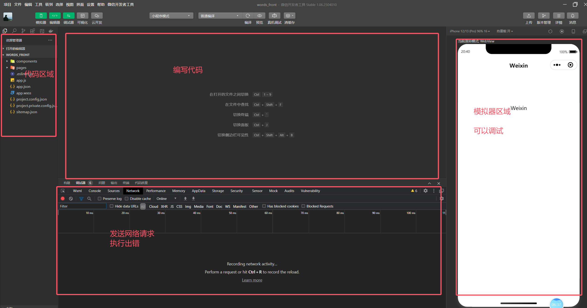

## 3.3 本地开发支持http

```python
# 1 django 运行在 127.0.0.1:8000 的地址
# 2 小程序默认只支持https，我们需要做如下配置，让其支持http，方便我们本地开发
	-右上角--》详情--》本地设置--》不校验合法域名
```


# 4 项目目录结构
## 4.1 项目目录结构
```python
# 1 项目主配置文件
	项目主配置文件必须放到项目的根目录下，控制整个项目
    	- app.js：  小程序入口文件
    	- app.json：小程序的全局配置文件
    	- app.wxss：小程序的全局样式
    	- app.js 和 app.json 文件是必须的，不能没有
        
# 2 页面文件
	小程序有一个个页面，每个页面所需的文件，都存放在 pages 目录下，一个页面一个文件夹
        -xx.js：  页面逻辑  js代码存放位置
        -xx.wxml：页面结构  类html文件存放位置
        -xx.wxss：页面样式  css存放位置
        -xx.json：小页面配置 
        -xx.js 文件和 xx.wxml 文件是必须的，不能没有
```

## 4.2 纯净项目

```python
# 根据视频，不需要用的文件和文件夹都删除
# 保证项目能运行
```

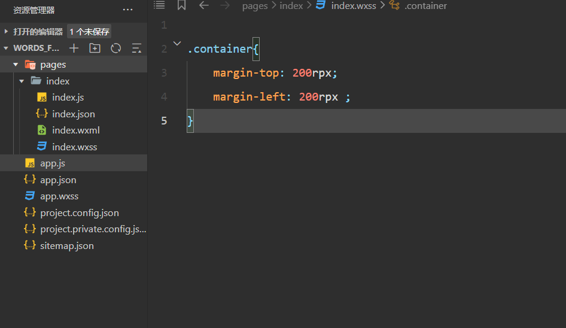

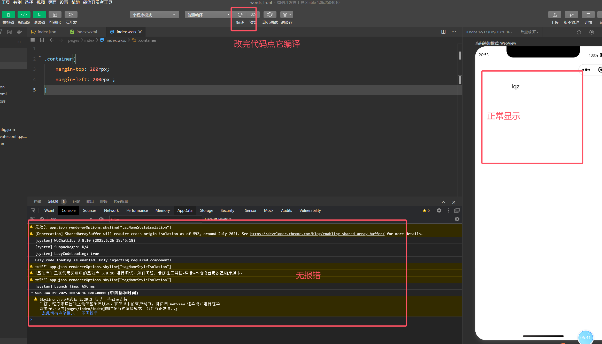


### 4.3 关闭Skyline渲染模式

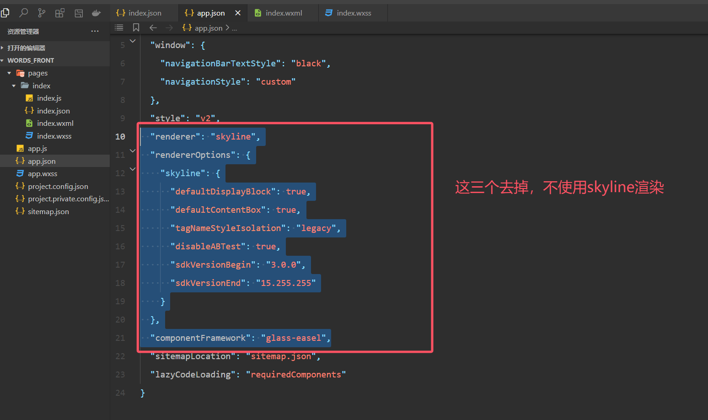

# 5 Cursor开发小程序端

```python
根据项目需求： 和项目小程序架构文档： 和UI设计图:  生成单词量测试小程序端代码
要求：
1.我已经创建了小程序： ，你在这个基础上继续编写，无效的文件和文件夹帮我删除。
2.根据需求帮编写完小程序端代码。
3.接口参考后端项目： ，并正常测试通过，前后端调通。
4.后端链接地址为：http://127.0.0.1:8000。
5.小程序不使用Skyline 渲染模式。
6.小程序端不联网，也能顺利运行。
```


## 5.1 注意：

```python
# 适用于中大型项目

#  后期大家在生成项目时，不要让cursor一次性都把代码写完
# 先写后端 【登录接口 】---》测试通过
# 在写 前端【登录接口 】--->测试通过
---------git把代码管理起来-------
# 在写 【查询单词测试接口】---》测试通过
# 在写 前端【查询单词测试接口 】--->测试通过
---------git把代码管理起来-------
```


# 6 前后端联调

```python
# 1 继续使用cursor 帮咱们联调
帮我把微信小程序所有接口，修改成后端接口服务提供的接口，地址为：127.0.0.1:8000，并能顺利运行
    
    
微信小程序端，单词选对了，但是显示错误，这个问题帮我改掉

```


## 6.1 真机调试

```python
# 1 选择真机调试---》手机微信扫描
	-你手机的网络必须跟后端的服务连同一个路由器
    
# 2 把所有地址，改成你们机器的地址：
	app.js
    utils/app.js
    const API_CONFIG = {
      baseUrl: 'http://192.168.71.100:8000',
      timeout: 10000
    }
    
# 3 后端服务：
	config/settings.py
    ALLOWED_HOSTS = ['*']
```

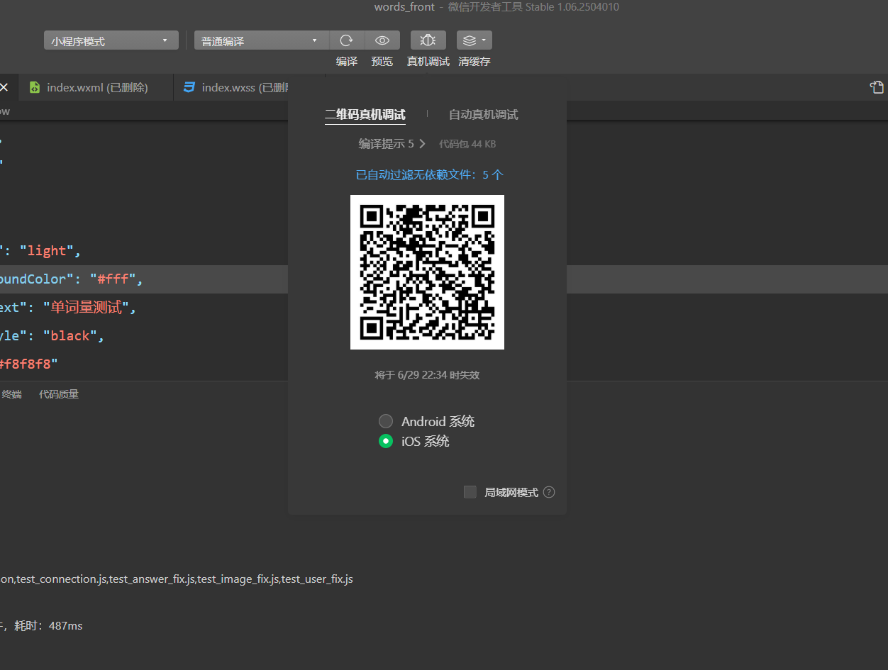


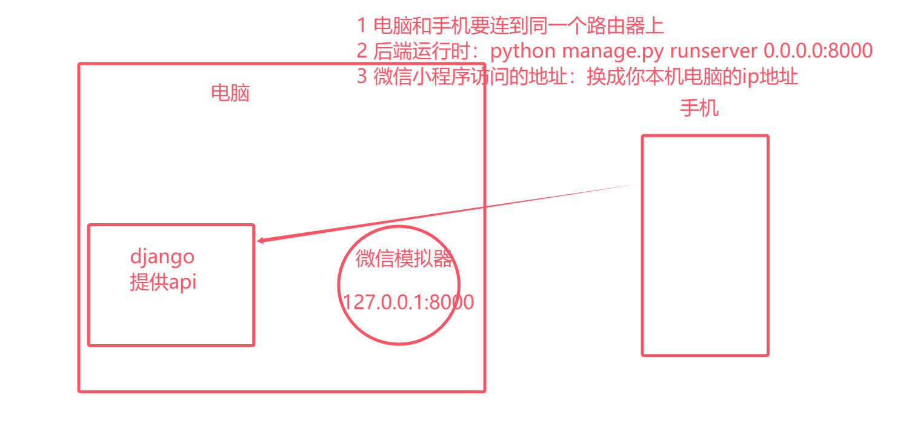


# 7 后端上线

```python
# 1  后端代码：python+django+mysql8(本地)
# 2 前端小程序：微信小程序
# 3 我自己的手机，在同一个网络里，可以正常使用
	-但是我的朋友，不能使用这个小程序，因为没有上架
    -因为没有云服务器，跑后端程序
    -因为没有公网ip--》互联网用户能访问
    
# 4 我们需要购买云服务器---》把我们的后端代码：python+django+mysql8--》跑在云服务器上
	-所有互联网用户都能访问
    -互联网用户在它微信中，使用我们上架的微信小程序
```


## 7.1 购买云服务器（先不要买）

```python
# 内网穿透：不讲

# 云服务器厂商很多，阿里云，腾讯云，华为云---》新用户免费试用几个月
	-几个月的云服务器不允许备案--》小程序上不了架
    -半年以上的云服务器，才能备案
    
# ICP备案（网站，app，小程序）：
	-国内所有的网站，都需要工信部ICP备案
    -早些年，app不需要备案：2024年4
    -备案后，你的所有信息，都会在国家的数据库存留--》做违法的事，直接到你家按头
    -国外：违法
    -云厂商会协助你：身份证，拍照，正反面--》材料---》一个月左右
    
    
# 买云服务器，我们只是测试，我讲课买的是按量付费
	-用几分钟花多少钱
    
 # 正常要上线，备案的，需要包年包月--》半年以上

# 1 访问地址：登录
https://account.aliyun.com/login/login.htm  # 支付宝扫码登录

# 2 购买云服务器
https://ecs.console.aliyun.com/home#/

    
# 3 创建实例
https://ecs-buy.aliyun.com/ecs?spm=5176.ecscore_overview.home-res.buy.787c4df5OJkB1o#/custom/prepay/cn-hangzhou?orderSource=buyWizard-console-overview
    
    
    
# 4 2核2g  服务器，centos9 stream的系统，在阿里云机房

# 5 远程链接：finalshell
```

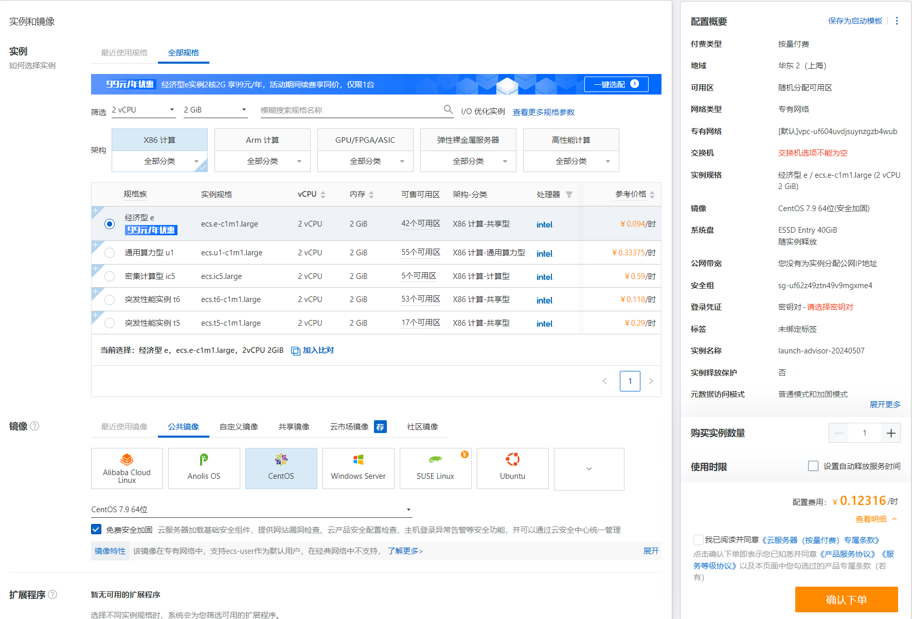


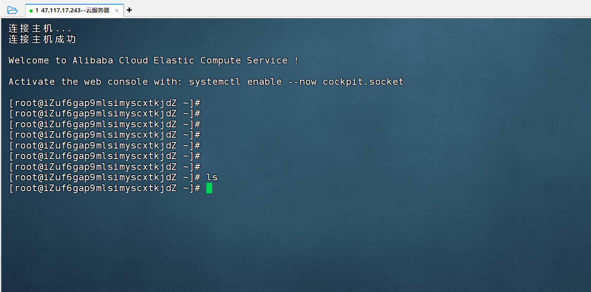


、