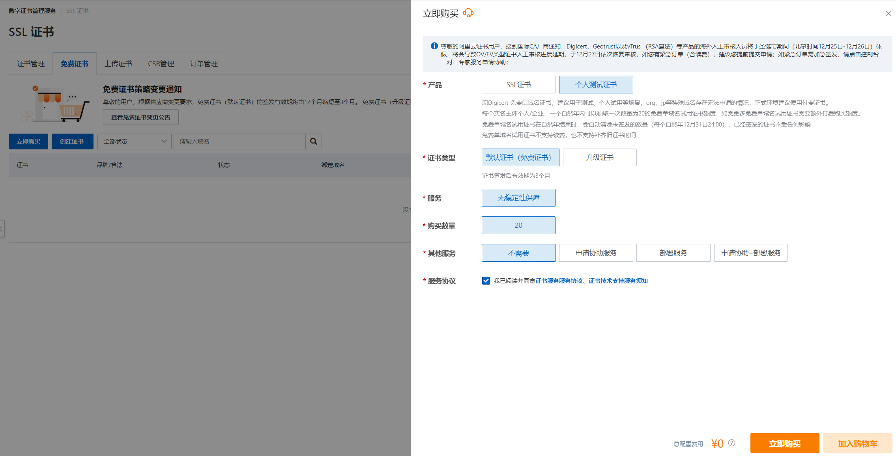
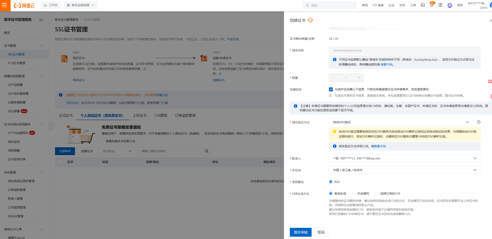
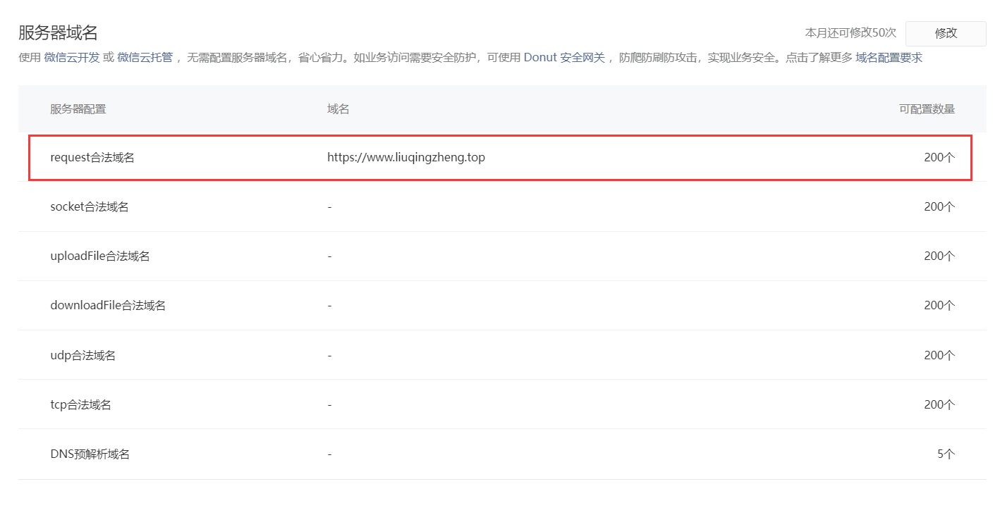
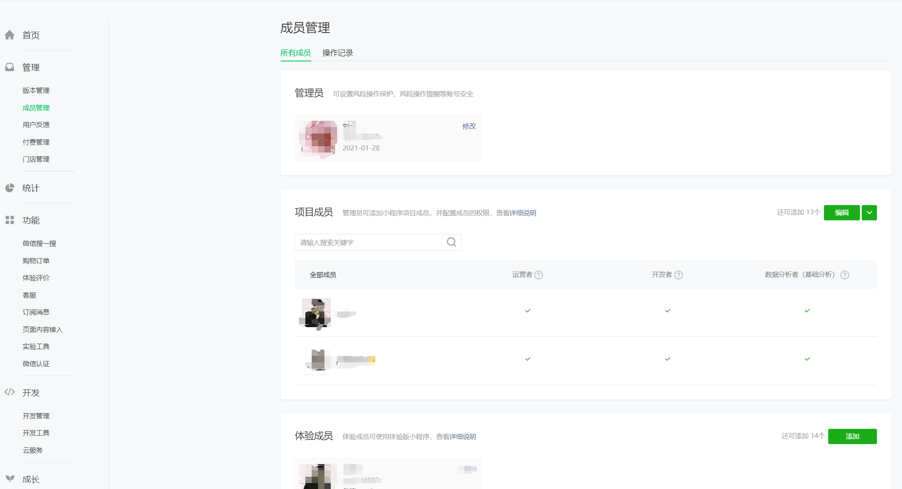

# 1 购买云服务器


# 2 安装python3.11

```python
# 阿里云的centos上有python环境
	- python3.9.21     pip-->python/python3  pip/pip3 都被占了
  
 	-咱们项目开发，在3.11上开发的，需要使用3.11的解释器来运行


# 可以使用yum 安装，不能指定版本（yum install python   咱们不用）
# 源码安装，下载指定版本的源码，编译安装


#### 补充
# 所有linxu和mac，都自带python2：系统服务，是用python写的
# 阿里云的centos默认装了python3.6.8

# python2.7     python3.6.8     python3.9    装模块，不要乱套
   pip             pip             pip

#1  源码安装python，依赖一些第三方zlib* libffi-devel
dnf install openssl-devel bzip2-devel expat-devel readline-devel sqlite-devel psmisc libffi-devel zlib* libffi-devel  -y

# 1前往用户根目录
cd ~

#2 下载  3.11.9 源码 服务器终端
# https://registry.npmmirror.com/binary.html?path=python/
wget https://registry.npmmirror.com/-/binary/python/3.11.9/Python-3.11.9.tgz


#3  解压安装包
tar -xf Python-3.11.9.tgz

#4 进入目标文件
cd Python-3.11.9

#5  配置安装路径：/usr/local/python3
# 把3.11.9 编译安装到/usr/local/python311路径下
./configure --prefix=/usr/local/python311

#6  编译并安装,如果报错，说明缺依赖
yum install openssl-devel bzip2-devel expat-devel gdbm-devel readline-devel sqlite-devel psmisc libffi-devel zlib* libffi-devel  -y
# make只是编译----》可执行文件，没有安装
# 类似于在win上下载了安装包，但是没安装
# make install 安装---》类似于在win上下了安装包，一路下一步安装了，指定安装位置---》/usr/local/python39
make &&  make install

#7  建立软连接：/usr/local/python38路径不在环境变量，终端命令 python3，pip3
ln -s /usr/local/python311/bin/python3 /usr/bin/python3.11
ln -s /usr/local/python311/bin/pip3 /usr/bin/pip3.11

# 机器上有多个python和pip命令，对应关系如下
python       3.9      pip 
python3      3.9      pip3
python3.11   3.11      pip3.11

#8  删除安装包与文件：
rm -rf Python-3.11.9
rm -rf Python-3.11.9.tgz
```


# 3 安装nginx

```python
# 软件：反向代理服务器  （搜一下：什么是正向代理，什么是反向代理）  反向带代理服务器
  - 做请求转发    （前端来了个请求---》打在了80端口上---》转到本地8888端口，或者其他机器的某个端口）
  - 静态资源代理    前端项目直接放在服务器上某个位置----》请求来了，使用nginx拿到访问的内容，直接返回
  - 负载均衡       假设来了1000个请求--》打在nginx上，nginx性能很高，能顶住---》只转发到某个django项目，可能顶不住---》集群化的不是3台django---》均匀的打在3台机器上
    

    
    
# 前往用户根目录
cd ~

#下载nginx 1.28.0
wget https://nginx.org/download/nginx-1.28.0.tar.gz
#解压安装包
tar -xf nginx-1.28.0.tar.gz

#进入目标文件
cd nginx-1.28.0

# 配置安装路径：/usr/local/nginx
# 安装 PCRE 开发包的名称是 pcre-devel，支持https访问
#zlib-devel：用于 gzip 压缩模块。openssl-devel：用于 SSL/TLS 模块（如启用 HTTPS） gcc 和 make：编译工具链
dnf install -y pcre-devel gcc make zlib-devel openssl-devel
./configure --prefix=/usr/local/nginx --with-http_ssl_module
#编译并安装
 make &&  make install

# 建立软连接：终端命令 nginx
ln -s /usr/local/nginx/sbin/nginx /usr/bin/nginx 

#删除安装包与文件：
cd ~
rm -rf nginx-1.28.0
rm -rf nginx-1.28.0.tar.xz

# 测试Nginx环境，服务器运行nginx，本地访问服务器ip
nginx   # 启动nginx服务，监听80端口----》公网ip 80 端口就能看到页面了
服务器绑定的域名 或 ip:80

# 静态文件放的路径
/usr/local/nginx/html

# 查看进程
ps aux | grep nginx


# 关闭和启动
关闭：nginx -s stop 
启动： nginx


# 它有配置文件---》配置监听那些地址，配置代理那些静态文件---》还没讲
```

# 4 安装mysql 8

```python
### 1 官方yum源
https://dev.mysql.com/downloads/repo/yum/

### 2 下载对应版本mysql源到本地，如果系统是centos9，这里选择el9版本
# no architecture的缩写，说明这个包可以在各个不同的cpu上使用
我们选择  mysql84-community-release-el9-1.noarch.rpm

### 3 或者直接来到：https://repo.mysql.com/
找到相应版本下载，我们下载
https://dev.mysql.com/downloads/file/?id=528548
### 4 下载rpm包
wget https://dev.mysql.com/get/mysql84-community-release-el9-1.noarch.rpm

### 5 安装rpm包
dnf install -y mysql84-community-release-el9-1.noarch.rpm

### 6 开始安装
dnf install -y mysql-community-server --nogpgcheck  # 会自动把客户端装上
### 7 启动，查看状态
systemctl start mysqld
systemctl status mysqld

### 8 查看默认密码并登录
grep "password" /var/log/mysqld.log  #    S/dZiJGyL8wM

### 9 修改密码
mysql -uroot -p
SELECT user, host, plugin FROM mysql.user;
ALTER USER 'root'@'localhost' IDENTIFIED BY 'Lqz12345?';

#创建用户
CREATE USER 'lqz'@'localhost' IDENTIFIED BY 'Lqz12345?';
CREATE USER 'lqz'@'%' IDENTIFIED BY 'Lqz12345?';
GRANT ALL PRIVILEGES ON *.* TO 'lqz'@'localhost' WITH GRANT OPTION;
GRANT ALL PRIVILEGES ON *.* TO 'lqz'@'%' WITH GRANT OPTION;

### 10 查看mysql版本
mysql -V


######## 后面上线项目时应该做的## 现在直接做了

#11 创建words库
create database words default charset=utf8mb4;


#### 使用navicat 链接###
如果链接不上，就是安全组没开


# 12 安装mysqlclient
dnf install python3-devel mysql-devel --nogpgcheck -y

pip3.11 install mysqlclient

# 13 
pip3.11 install urllib3==1.26.15
pip3.11 install chardet

#14 
mkdir static
STATIC_ROOT = '/root/words_api/static/'
```

# 5 编写uwsig配置文件

```python
# 0 安装依赖
pip3.11 install -r requirements.txt 

#1 words_api.ini
[uwsgi]
socket = 127.0.0.1:8080
chdir = /root/test_words_api/
wsgi-file = backend.wsgi
processes = 4
threads = 2
master = true
daemonize = uwsgi.log

#2 安装uwsgi 
dnf install -y python3-devel gcc libxml2-devel
pip3.11 install uwsgi
ln -s /usr/local/python311/bin/uwsgi /usr/bin/uwsgi

# 3 启动uwsgi
uwsgi words_api.ini

# 4 查看
ps aux |grep uwsgi

# 5 停止
pkill -9 uwsgi
```


# 6 上传项目

```python
#1 修改配置文件配置文件
DEBUG = False
ALLOWED_HOSTS = ['*']
##数据库配置##
##后台地址 ---》同步修改之前写死的后端地址--》views中
BACKEND_URL='http://127.0.0.1:8000'

#2 生成依赖
pip install pipreqs
pipreqs ./ --encoding=utf-8

baidu_aip==4.16.13
Django==3.2.22
djangorestframework==3.14.0
djangorestframework_simplejwt==5.3.1
Faker==25.0.1
pypinyin==0.51.0
SpeechRecognition==3.10.3
tencentcloud_sdk_python==3.0.1115
mysqlclient

#3 服务器 安装上传和解压模块
yum install lrzsz unzip -y

#4 上传项目
rz

#5 服务器安装依赖
# mysqlclient
yum install python3-devel -y
yum install mysql-devel --nogpgcheck -y
pip install mysqlclient

#6 出现错误：ImportError: urllib3 v2.0 only supports OpenSSL 1.1.1+, currently the 'ssl'
pip install urllib3==1.26.15 
```


# 7 nginx 配置（http访问）

```python
# 6 配置nginx转发
cd /usr/local/nginx/conf
vi nginx.conf
# 新增的server
events {
    worker_connections  1024;
}
http {
    include       mime.types;
    default_type  application/octet-stream;
    sendfile        on;
	server {
        listen 8000;
        server_name  127.0.0.1;
        charset utf-8;
        location / {
            include uwsgi_params;
            uwsgi_pass 127.0.0.1:8080;
            uwsgi_param UWSGI_SCRIPT backend.wsgi; 
            uwsgi_param UWSGI_CHDIR /root/test_words_api/;
            }
        location /static {
            alias /home/static;
       		}
        }
}


# 重启nginx 
nginx -s reload
```

## 7.1 安全组 配置

```python
安全组-云服务器
```


# 8 配置admin访问

```python
# http://47.116.207.103:8000/static/rest_framework/css/bootstrap.min.css

#  1 后端项目，使用uwsgi部署完成，可以访问动态接口，但不能访问静态资源

# 2 uwsgi为了提高效 率，只处理动态请求，静态资源的获取，不管
	-静态资源就是在从服务器把文件，图片，js，css，直接返回
    -如果静态资源也走uwsgi，会影响uwsgi的性能
  
  10     2 个动态接口    8个 拿静态资源
  				usgi只负责处理这两个动态接口
    			静态资源不管---》自行处理
      
      
# 3 动静分离
	-动态请求给uwsgi---》让它处理---》uwsgi资源宝贵，尽量少用
  	动态请求地址： /api/v1....
    -静态请求，使用nginx，直接处理---》nginx来讲，最擅长处理静态资源
  		静态资源地址： /static/...
    
    
# 4 请求发送到nginx监听的 8000 端口上的时候，判断 如果是 / --->转发给uwsgi  ，如果是 /static--->直接去固定的位置，把静态资源直接返回，不走uwsgi了，节约uwsgi的性能


# 5 配置nginx，做静态文件代理---》收集静态资源
	-simpleui
  	-drf   
  	-都在自己app中，我们需要把他们单独收集到某个位置
  
  
  -后期如果部署前后端混合项目必须要做动静分离，收集静态文件
  
  
  
  
# 6 操作步骤

#6.1  收集静态资源，使用nginx代理
# settings.py中加入   把静态资源收集到这个文件夹下
STATIC_ROOT = '/home/static/'


# 6.2 进入虚拟环境
mkdir /home/static
python3.11 manage.py collectstatic


http://106.14.156.208:8000/static/admin/simpleui-x/img/logo.png


# 6.3 修改nginx配置文件
# 新增的配置静态文件

server {

        location /static {
            alias /home/static;
       }
      }
 
 # 6.4 重启nginx
	nginx -s reload
  
```


# 9 阿里云证书

```python
https://yundun.console.aliyun.com/?spm=5176.12818093_47.top-nav.23.57ea16d02gIoxM&p=cas#/certExtend/free/cn-hangzhou
    
#https://help.aliyun.com/zh/ssl-certificate/user-guide/install-ssl-certificates-on-nginx-servers-or-tengine-servers?spm=0.2020520163.0.0.1c20J0IlJ0IlNH
```






## 9.1 配置https访问

```python
events {
    worker_connections  1024;
}
http {
    include       mime.types;
    default_type  application/octet-stream;
    sendfile        on;
    client_max_body_size 20M;
	server {
    	listen 443 ssl;
     	ssl_certificate /usr/local/nginx/cert/liuqingzheng.top.pem;
     	ssl_certificate_key /usr/local/nginx/cert/liuqingzheng.top.key;
        server_name  liuqingzheng.top;
        location / {
            include uwsgi_params;
            uwsgi_pass 127.0.0.1:8080;
            uwsgi_param UWSGI_SCRIPT smart_backend.wsgi;
            uwsgi_param UWSGI_CHDIR /root/smart_backend/;
            }

       location /static {
            alias /home/static;
       }
    }
}
```

# 10 购买域名-备案-配置域名解析

```python
# 1 购买域名

# 2 备案

# 3 配置解析
https://dc.console.aliyun.com/next/index?spm=5176.12818093_47.top-nav.40.3be916d0be3QME#/overview
```


8 小程序上线

```python
# 1 小程序后台
https://mp.weixin.qq.com/wxamp/home/guide?lang=zh_CN&token=1879741752
 
#2  修改小程序地址
const rootUrl = 'https://www.liuqingzheng.top'

# 3 上传，设为体验版,配置体验成员--测试

# 4 备案，提交审核，等待审核通过
```






# 补充：

## 1 Cursor配置多个终端

```python
## 1 打开设置（settings.json）
 Cursor 右上角点击齿轮图标--》“设置”--》打开设置界面
 General--->Edditor Settings--》Open
 右上角点击 “打开设置（JSON）”，进入 settings.json
## 2 添加或更新配置 ###注意：路径应使用双反斜杠（\\），否则 JSON 将解析错误。
在 settings.json 中添加以下内容
{
    "terminal.integrated.profiles.windows": {
        "Command Prompt": {
            "path": "C:\\Windows\\System32\\cmd.exe"
        },
        "PowerShell": {
            "source": "PowerShell"
        },
        "Git Bash": {
            "path": "D:\\Program Files\\Git\\bin\\bash.exe",
            "args": ["--login", "-i"]
        },
        "WSL": {
            "path": "C:\\Windows\\System32\\wsl.exe"
        }
    },
    "terminal.integrated.defaultProfile.windows": "Command Prompt",
    "files.autoSave": "afterDelay"
}

# 3 完成设置后，建议执行以下操作：
关闭所有当前打开的终端窗口
重启 Cursor
再次打开终端，终端应默认使用 CMD（命令提示符）
```

## 2 Ctrl+鼠标滚轮控制字体大小

```python
## 1 打开设置（settings.json）
 Cursor 右上角点击齿轮图标--》“设置”--》打开设置界面
 General--->Edditor Settings--》Open
 右上角点击 “打开设置（JSON）”，进入 settings.json
## 2 添加或更新配置 在配置文件中加入

"editor.mouseWheelZoom": true,

###记得上面一行 后面加逗号

### 下面是编辑器字体大小和cursor的对话框字体大小
"editor.fontSize": 35,
"cursor.composer.textSizeScale": 1.8,
```


