# 今日内容

# 1 云服务器

```python
# 0 如果大家想上线项目，互联网用户都能使用，必须有公网ip---》购买云服务器
	如果大家只是做练习--》在虚拟机中实现即可--》互联网用户无法使用，只有在同一个网段中的人才能使用

# 1 上次课已经带大家买了阿里云服务器---》新用户打折很便宜
	-腾讯云
    -阿里云
    -京东云
    -亚马逊
    -。。。。
# 2 相当于租了一台电脑，上面装了linux【centos stream 9】,放在了远程的机房中[我们无法去看]--》我们可以远程链接

# 3 付费类型
	-包年包月：企业用户，一次性购买3年，几年，比较贵
    -按量付费：个人测试用户，用几分钟，花多少钱，随时取消
    -抢占式实例：特别便宜，空闲资源便宜打折卖，一旦资源不够用了，不跟你商量，直接把你买的给取消掉--测试用
    
    
# 4 镜像
	-电脑上装的操作系统：一般不要装win server
    
# 5 购买网络	
	-按量付费：带宽拉到最大即可
```

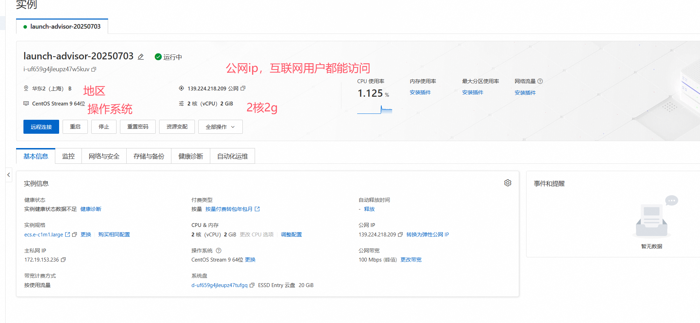


## 1.1 上线架构图

```python
# 1 django项目要运行，需要有个web服务器
	-本地测试我们没有装，自带的：wsgiref，一两个人测试，没问题，性能低
    -我们要上线，承载高并发，必须使用高级的web服务器：uwsgi，Gunicorn。。。
# 2 Nginx
	-1 请求转发：客户端的请求，转发到别的地方
    -2 负载均衡
    -3 代理静态资源：静态的js，css，图片
```


>139.224.218.209


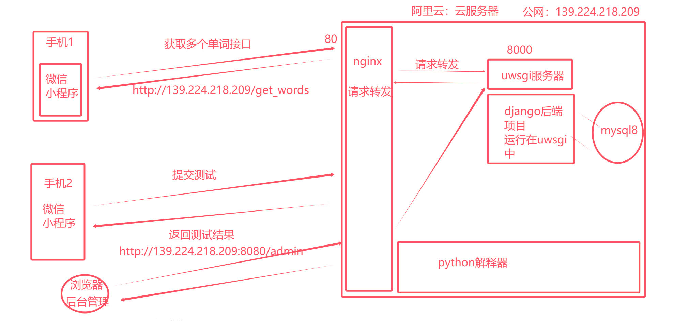


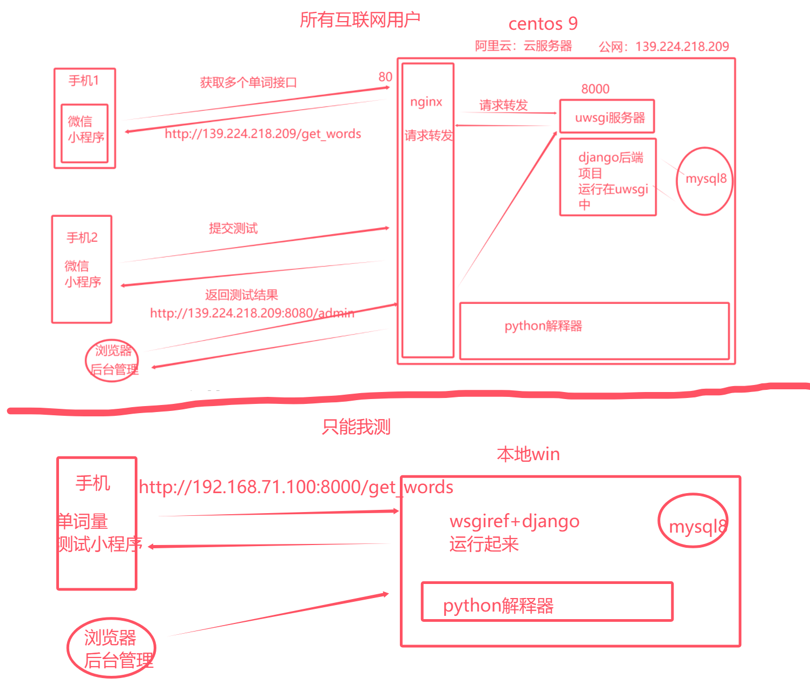


# 2 安装python3.11

```python

# 1 阿里云的centos上有python环境:linux，mac 的很多服务使用了python开发的
	-我们开发项目，使用python11，这个解释器版本，我们不用，这个有点老了
	- python3.9.21     pip-->python/python3  pip/pip3 都被占了
  
 	-咱们项目开发，在3.11上开发的，需要使用3.11的解释器来运行

	-我们目标【多版本共存在同一个机器上，不要用乱了】：
    	python  python3---》代指 python3.9    pip  pip3--》代指 python3.9的pip
        python3.11---》是我们自己装的           pip3.11 --》代指 python3.11的pip
        
# 2 可以使用yum 安装，不能指定版本（yum install python   咱们不用）
# 3 源码安装，下载指定版本的源码，编译安装


######### 安装步骤 ######


#1  源码安装python，依赖一些第三方zlib* libffi-devel
dnf install openssl-devel bzip2-devel expat-devel readline-devel sqlite-devel psmisc libffi-devel zlib* libffi-devel  -y

# 2 前往用户根目录
cd 

#2 下载  3.11.9 源码 服务器终端
# https://registry.npmmirror.com/binary.html?path=python/
wget https://registry.npmmirror.com/-/binary/python/3.11.9/Python-3.11.9.tgz


#3  解压安装包
tar -xf Python-3.11.9.tgz

#4 进入目标文件
cd Python-3.11.9

#5  配置安装路径：/usr/local/python3
# 把3.11.9 编译安装到/usr/local/python311路径下
./configure --prefix=/usr/local/python311

#6  编译并安装,如果报错，说明缺依赖
# yum install openssl-devel bzip2-devel expat-devel gdbm-devel readline-devel sqlite-devel psmisc libffi-devel zlib* libffi-devel  -y
# make只是编译----》可执行文件，没有安装
# 类似于在win上下载了安装包，但是没安装
# make install 安装---》类似于在win上下了安装包，一路下一步安装了，指定安装位置---》/usr/local/python39
make &&  make install

#7  建立软连接：/usr/local/python311路径不在环境变量，终端命令 python3，pip3
ln -s /usr/local/python311/bin/python3 /usr/bin/python3.11
ln -s /usr/local/python311/bin/pip3 /usr/bin/pip3.11

# 机器上有多个python和pip命令，对应关系如下
python       3.9      pip 
python3      3.9      pip3
python3.11   3.11      pip3.11

#8  删除安装包与文件：
rm -rf Python-3.11.9
rm -rf Python-3.11.9.tgz
```


# 3 安装nginx

```python
# 软件：反向代理服务器  （搜一下：什么是正向代理，什么是反向代理）  反向带代理服务器
  - 做请求转发    （前端来了个请求---》打在了80端口上---》转到本地8000端口，或者其他机器的某个端口）
  - 静态资源代理    前端项目直接放在服务器上某个位置----》请求来了，使用nginx拿到访问的内容，直接返回
  - 负载均衡       假设来了1000个请求--》打在nginx上，nginx性能很高，能顶住---》只转发到某个django项目，可能顶不住---》集群化的不是3台django---》均匀的打在3台机器上
    

    
    
# 前往用户根目录
cd ~

#下载nginx 1.28.0
wget https://nginx.org/download/nginx-1.28.0.tar.gz
#解压安装包
tar -xf nginx-1.28.0.tar.gz

#进入目标文件
cd nginx-1.28.0

# 配置安装路径：/usr/local/nginx
# 安装 PCRE 开发包的名称是 pcre-devel，支持https访问
#zlib-devel：用于 gzip 压缩模块。openssl-devel：用于 SSL/TLS 模块（如启用 HTTPS） gcc 和 make：编译工具链
dnf install -y pcre-devel gcc make zlib-devel openssl-devel
./configure --prefix=/usr/local/nginx --with-http_ssl_module
#编译并安装
 make &&  make install

# 建立软连接：终端命令 nginx
ln -s /usr/local/nginx/sbin/nginx /usr/bin/nginx 

#删除安装包与文件：
cd ~
rm -rf nginx-1.28.0
rm -rf nginx-1.28.0.tar.xz

# 测试Nginx环境，服务器运行nginx，本地访问服务器ip
nginx   # 启动nginx服务，监听80端口----》公网ip 80 端口就能看到页面了
服务器绑定的域名 或 ip:80

# 静态文件放的路径
/usr/local/nginx/html

# 查看进程
ps aux | grep nginx


# 关闭和启动
关闭：nginx -s stop 
启动： nginx


# 它有配置文件---》配置监听那些地址，配置代理那些静态文件---》还没讲
```


# 4 安装mysql8

```python
### 1 官方yum源
https://dev.mysql.com/downloads/repo/yum/

### 2 下载对应版本mysql源到本地，如果系统是centos9，这里选择el9版本
# no architecture的缩写，说明这个包可以在各个不同的cpu上使用
我们选择  mysql84-community-release-el9-1.noarch.rpm

### 3 或者直接来到：https://repo.mysql.com/
找到相应版本下载，我们下载
https://dev.mysql.com/downloads/file/?id=528548
    
### 4 下载rpm包
wget https://dev.mysql.com/get/mysql84-community-release-el9-1.noarch.rpm

### 5 安装rpm包
dnf install -y mysql84-community-release-el9-1.noarch.rpm

### 6 开始安装
dnf install -y mysql-community-server --nogpgcheck  # 会自动把客户端装上
### 7 启动，查看状态
systemctl start mysqld
systemctl status mysqld

### 8 查看默认密码并登录
grep "password" /var/log/mysqld.log  #    Vz.o8u)J-&pN

### 9 修改密码
mysql -uroot -p
SELECT user, host, plugin FROM mysql.user;
ALTER USER 'root'@'localhost' IDENTIFIED BY 'Lqz12345?';

#创建用户
CREATE USER 'lqz'@'localhost' IDENTIFIED BY 'Lqz12345?';
CREATE USER 'lqz'@'%' IDENTIFIED BY 'Lqz12345?';
GRANT ALL PRIVILEGES ON *.* TO 'lqz'@'localhost' WITH GRANT OPTION;
GRANT ALL PRIVILEGES ON *.* TO 'lqz'@'%' WITH GRANT OPTION;

### 10 查看mysql版本
mysql -V


######## 后面上线项目时应该做的## 现在直接做了


#### 使用navicat 链接###
如果链接不上，就是安全组没开

## 创建库：words
	-	创建words库(使用navicate创建)
	create database words default charset=utf8mb4;
	-navicat 图形化解密创建，如下图


# 12 安装mysqlclient
dnf install python3-devel mysql-devel --nogpgcheck -y

pip3.11 install mysqlclient

# 13 
pip3.11 install urllib3==1.26.15
pip3.11 install chardet

#14 
mkdir static
STATIC_ROOT = '/root/words_api/static/'
```

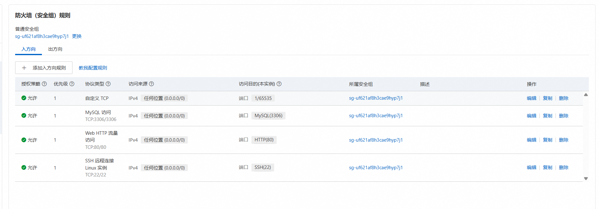


```python
#  安全组：就是防火墙
	-出规则和入规则
    -入方向默认开了：
    	-22---》ssh链接---》finallshell链接
        -80--->浏览器中访问
        -3306--》mysql的端口--》有可能没开
```

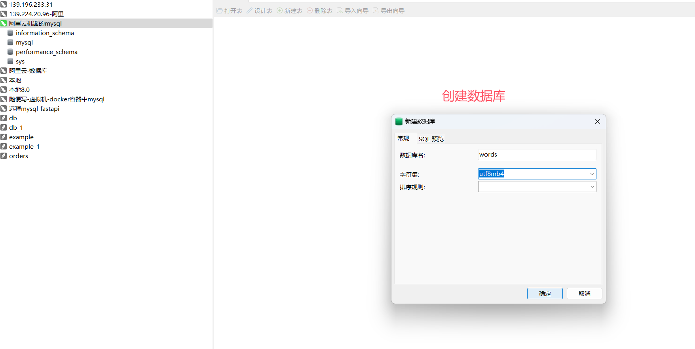

# 5 uwsgi安装和配置文件

```python
#1 安装uwsgi 

dnf install -y python3-devel gcc libxml2-devel
pip3.11 install uwsgi
ln -s /usr/local/python311/bin/uwsgi /usr/bin/uwsgi  # 以后在任意路径下敲uwsgi都能找到

# 2 敲 uwsgi  有反应，就是装好了
```

## 5.1 后台项目中编写uwsgi的配置文件

> words_api.ini   不要带txt后缀

```python
[uwsgi]
socket = 127.0.0.1:8000
chdir = /root/words_api/
wsgi-file = config.wsgi
processes = 4
threads = 2
master = true
daemonize = uwsgi.log
```


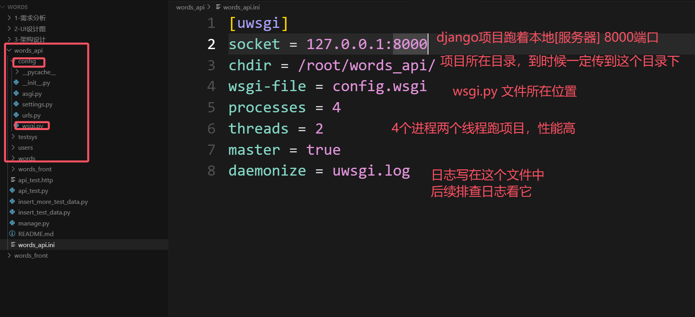

# 6 后端上传项目

```python
#### 1 修改后端项目配置文件 settings.py
# 改3个地方
DEBUG = False
ALLOWED_HOSTS = ['*']
DATABASES = {
    'default': {
        'ENGINE': 'django.db.backends.mysql',
        'NAME': 'words',   # 咱们刚刚创建的库名
        'USER': 'lqz',     # 服务器上mysql中的用户
        'PASSWORD': 'Lqz12345?',
        'HOST': '127.0.0.1', # 一台云服务器放mysql，一台云服务器放django项目，这里要写放mysql的服务器地址
        'PORT': '3306',
        'OPTIONS': {
            'init_command': "SET sql_mode='STRICT_TRANS_TABLES'",
        },
    }
}

### 2 依赖文件： requirements.txt
	-1 可能cursor会生成，它没生成，我们就自己创建
    -2 纯自己创建，写入项目的依赖，cursor的tab会补齐--》可能缺模块
    	Django==4.2.7
        djangorestframework==3.14.0
        Requests==2.32.4
        mysqlclient==2.2.3
        django-simpleui
        
    -3 自动生成：来到words_api目录下
    	pip3 install pipreqs  # 安装生成requirements.txt的模块
		pipreqs ./ --encoding=utf-8 # 会生成requirements.txt
        
        
### 3 打包上传到服务器
	3.1 打包成zip
    3.2 上传到  /root 目录下
    3.3 解压
    dnf install unzip -y
    unzip words_api.zip

    
### 4 在python解释器中安装项目的依赖：注意一定要在项目目录下
yum install python3-devel -y
yum install mysql-devel --nogpgcheck -y
pip3.11 install -r requirements.txt

## 5 查看依赖是否正常装好
pip3.11 list
```

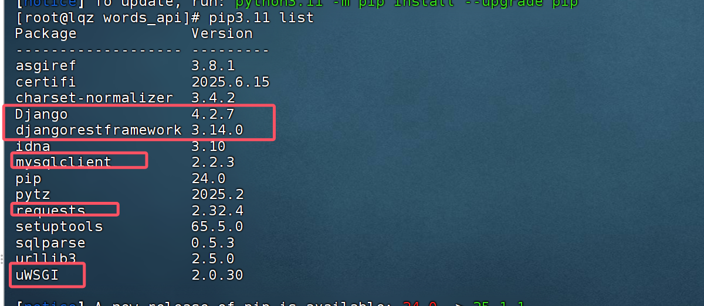


# 7 nginx配置

## 7.1 使用uwsgi运行django

```python
# 1 启动uwsgi:注意目录，项目目录下
uwsgi words_api.ini  # django项目跑在 8000端口了

# 2 查看
ps aux |grep uwsgi

# 3 停止
pkill -9 uwsgi
```

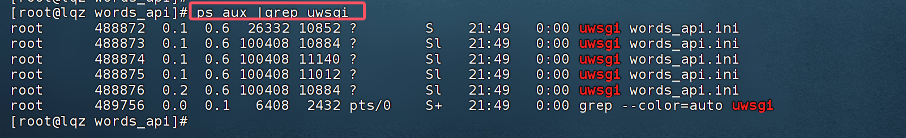

## 7.2 配置请求转发给uwsgi

```python
# 1 配置nginx转发
cd /usr/local/nginx/conf
mv nginx.conf nginx.conf.bak  # 把原来的配置文件备份一下
vi nginx.conf  # 创建一个新的
# 新增的server
events {
    worker_connections  1024;
}
http {
    include       mime.types;
    default_type  application/octet-stream;
    sendfile        on;
	server {
        listen 8080;
        server_name  127.0.0.1;
        charset utf-8;
        location / {
            include uwsgi_params;
            uwsgi_pass 127.0.0.1:8000;
            uwsgi_param UWSGI_SCRIPT config.wsgi; 
            uwsgi_param UWSGI_CHDIR /root/words_api/;
            }
        location /static {
            alias /home/static;
       		}
        }
}


# 2 重启nginx 
nginx -s reload
```

## 7.3 导入数据库假数据

```python

# 1 从原来本地导出【本地当时开发的数据】
	-在本地的数据库上--》右键--》转储成sql--》选数据和结构
    
    
#2 导入到云服务器的mysql中
	-右键---》运行sql文件--》导入
    
# 3 以后我们的数据是从后台管理系统录入
	-增删查改数据，都ok
```

## 7.4 如果django项目没跑起来

```python
# 1 先停止uwsgi
# 2 使用：python3.11 manage.py runserver 0.0.0.0:8000 运行，看到错误，解决掉

# 3 最终：访问 有数据就ok
http://139.224.218.209:8080/api/questions/?difficulty=2&num=10
```


# 8 配置admin访问

```python
# http://139.224.218.209:8080/static/admin/simpleui-x/elementui/theme-chalk/index.css
	不存在

#  1 后端项目，使用uwsgi部署完成，可以访问动态接口，但不能访问静态资源

# 2 uwsgi为了提高效 率，只处理动态请求，静态资源的获取，不管
	-静态资源就是在从服务器把文件，图片，js，css，直接返回
    -如果静态资源也走uwsgi，会影响uwsgi的性能
  
  10     2 个动态接口    8个 拿静态资源
  				usgi只负责处理这两个动态接口
    			静态资源不管---》自行处理
      
      
# 3 动静分离
	-动态请求给uwsgi---》让它处理---》uwsgi资源宝贵，尽量少用
  	动态请求地址： /api/v1....
    -静态请求，使用nginx，直接处理---》nginx来讲，最擅长处理静态资源
  		静态资源地址： /static/...
    
    
# 4 请求发送到nginx监听的 8000 端口上的时候，判断 如果是 / --->转发给uwsgi  ，如果是 /static--->直接去固定的位置，把静态资源直接返回，不走uwsgi了，节约uwsgi的性能


# 5 配置nginx，做静态文件代理---》收集静态资源
	-simpleui
  	-drf   
  	-都在自己app中，我们需要把他们单独收集到某个位置
  
  
  -后期如果部署前后端混合项目必须要做动静分离，收集静态文件
  
  
  
#### 按如下步骤操作##############
# 6 操作步骤

#6.1  收集静态资源，使用nginx代理
# settings.py中加入   把静态资源收集到这个文件夹下
STATIC_ROOT = '/home/static/'


# 6.2 创建文件夹
mkdir /home/static
python3.11 manage.py collectstatic  # 收集完，文件夹下就有很多静态文件
# 上面我们nginx已经配置了代理静态文件

# 6.3 修改nginx配置文件---》之前就写入了
# 新增的配置静态文件

server {

        location /static {
            alias /home/static;
       }
      }
 
 # 6.4 重启nginx
	nginx -s reload
```

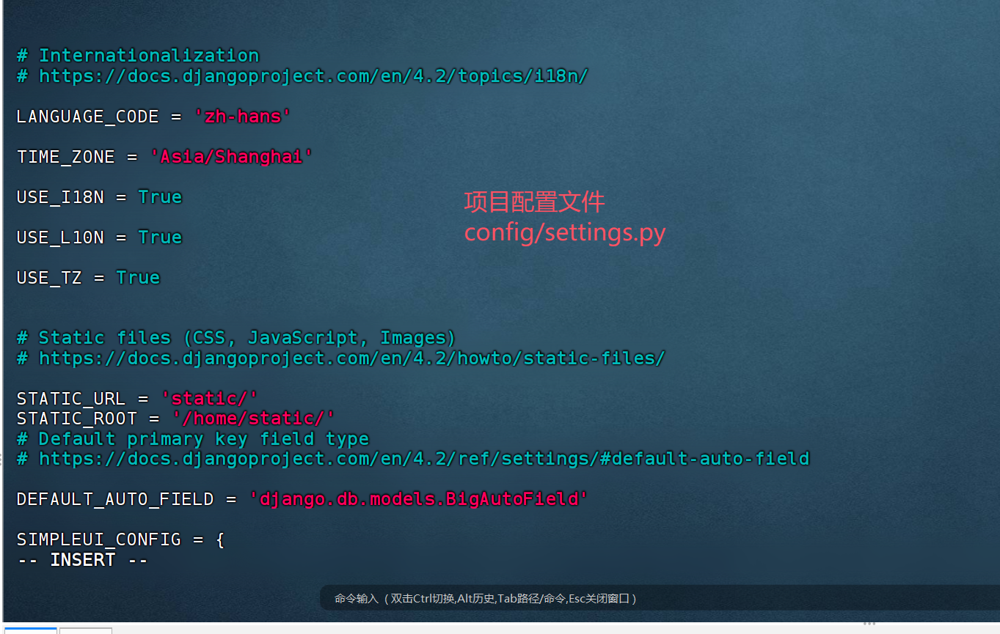

# 9 阿里云证书

```python
# 1 目前我们部署在http上，微信小程序要求，必须是https的地址才可

# 2 要部署https地址，需要使用证书
	-证书是花钱购买，有些免费的
    -阿里云，腾讯云，七牛云，都会卖证书--》不便宜
    
# 3 阿里云有免费的，但只有90天
https://yundun.console.aliyun.com/?spm=5176.12818093_47.top-nav.23.57ea16d02gIoxM&p=cas#/certExtend/free/cn-hangzhou
    
    
# 4 购买证书


# 5 创建证书

# 6 更多--下载--》下载nginx证书

# 7 解压后有两个文件

# 8 把这俩东西传到服务器：服务器创建cert文件夹
	/usr/local/nginx/cert/
    cd /usr/local/nginx/
    mkdir cert

    
# 9 修改nginx配置--》nginx.conf 文件
events {
    worker_connections  1024;
}
http {
    include       mime.types;
    default_type  application/octet-stream;
    sendfile        on;
    client_max_body_size 20M;
	server {
    	listen 443 ssl;
     	ssl_certificate /usr/local/nginx/cert/www.liuqingzheng.top.pem;
     	ssl_certificate_key /usr/local/nginx/cert/www.liuqingzheng.top.key;
        server_name  liuqingzheng.top;
        location / {
            include uwsgi_params;
            uwsgi_pass 127.0.0.1:8000;
            uwsgi_param UWSGI_SCRIPT config.wsgi;
            uwsgi_param UWSGI_CHDIR /root/words_api/;
            }

       location /static {
            alias /home/static;
       }
    }
}

# 10 重启Nginx
nginx -s reload
```

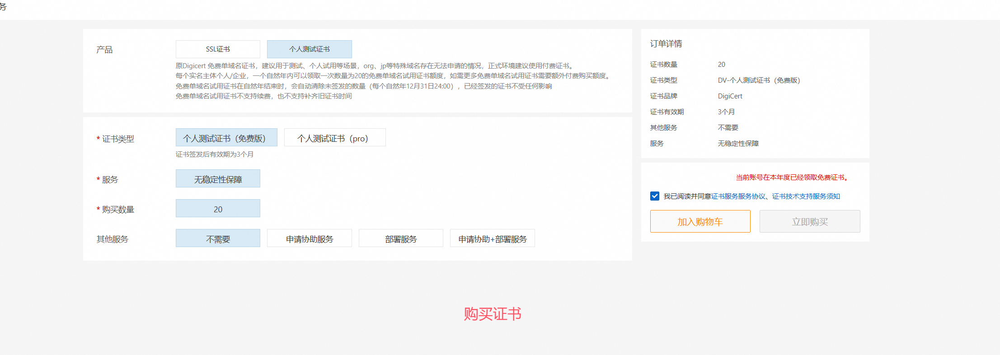


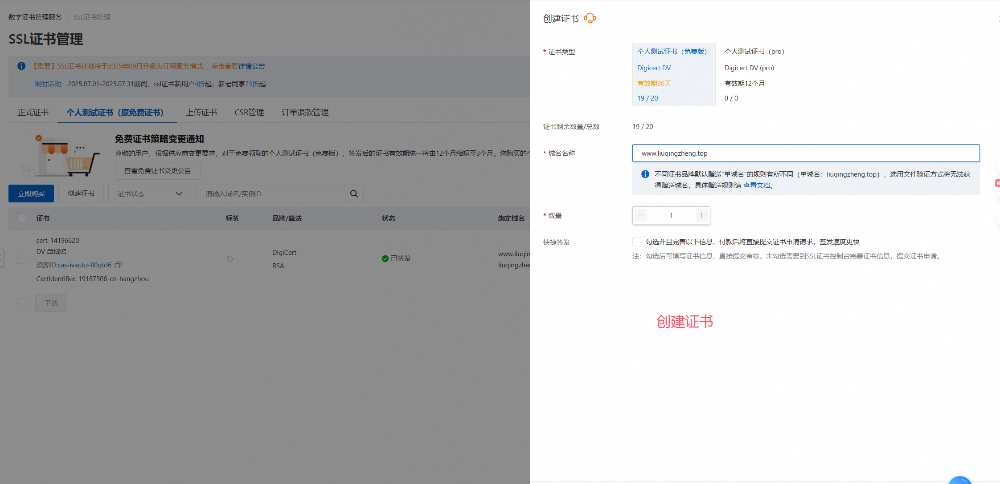

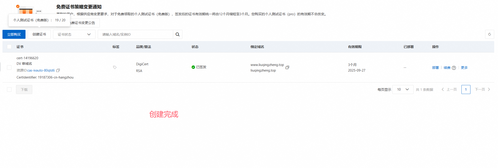

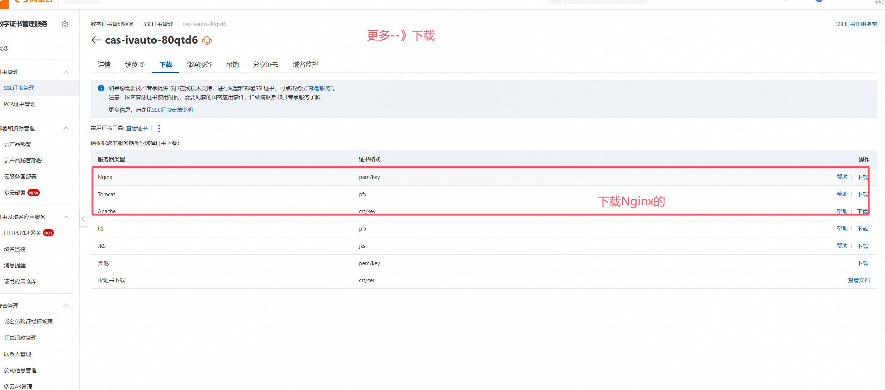

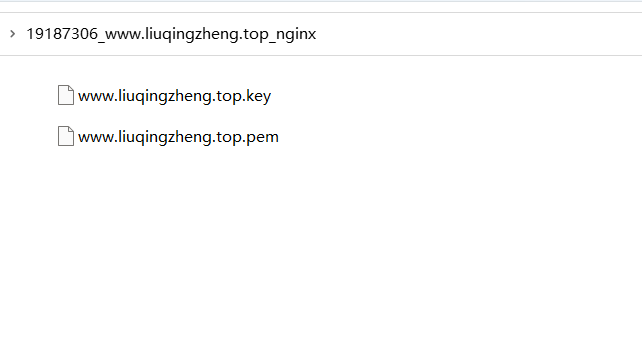

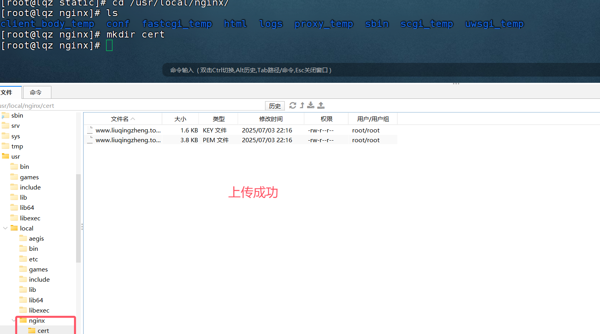

# 10 域名-备案-域名解析

```python
# 1 我们正常都是通过 
www.zzz.com # 域名访问

# 2 域名需要购买--》花钱
www.jd.com
www.短.com  # 贵
www.liuqingzheng.top  # 便宜

# 3 需要备案--》工信部备案--》阿里云协助
	-域名
    -云服务器：3个月以上
    -项目部署好
    -身份证拍照
    -整体时间要一个月左右审核--》工信部审核


# 3 购买地址
https://dc.console.aliyun.com/next/index?spm=5176.2020520154.console-base_search-panel.dtab-product_domain.2c1bAU57AU5717#/overview
    
    
# 4  买好后--》域名列表可以看到
http://dc.console.aliyun.com/next/index?spm=5176.2020520154.console-base_search-panel.dtab-product_domain.2c1bAU57AU5717#/domain-list/all
    
    
# 5 配置解析


# 6 互联网用户访问--》后台管理
https://www.liuqingzheng.top/admin/login/?next=/admin/
```

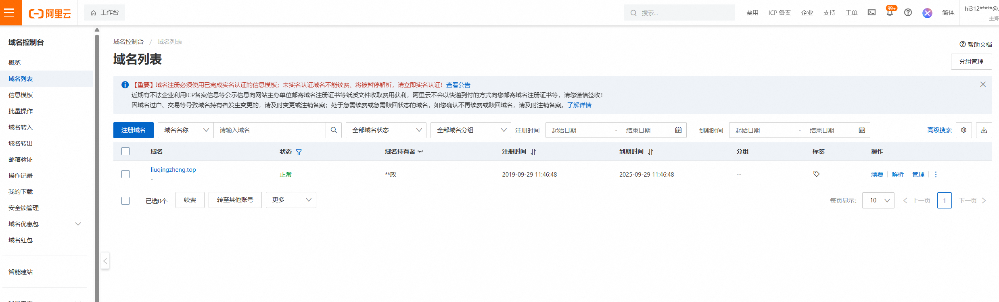


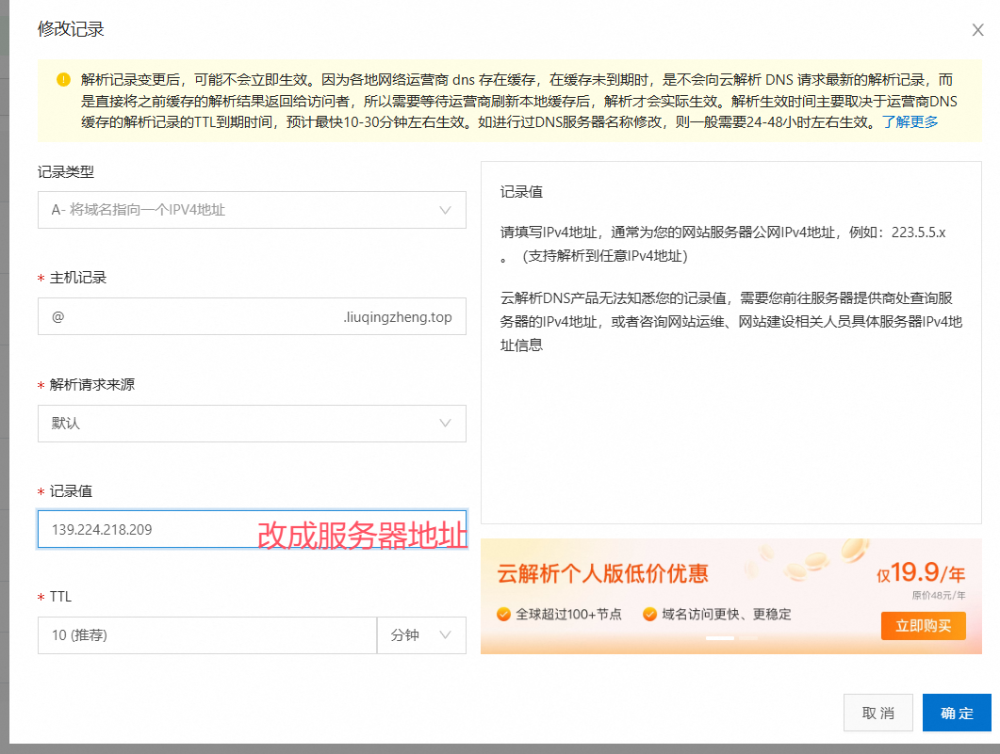

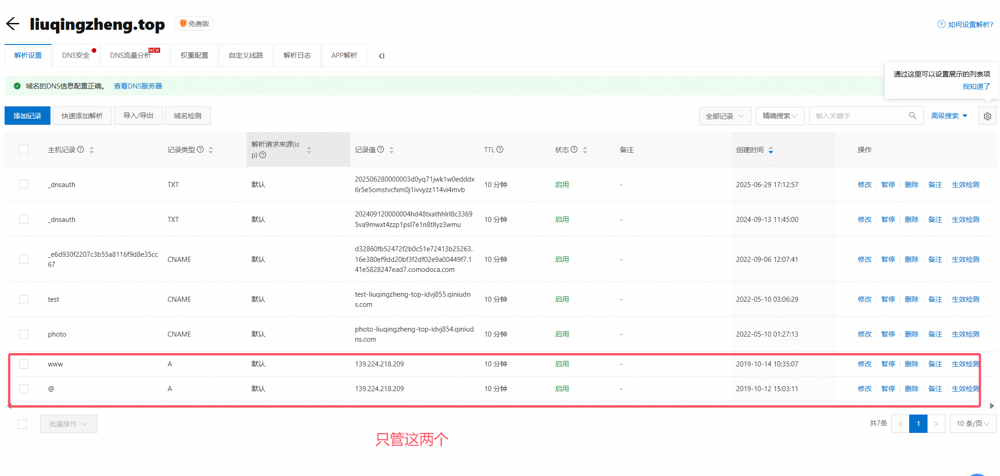

# 11 小程序上线

```python
# 1 小程序后台
https://mp.weixin.qq.com/wxamp/home/guide?lang=zh_CN&token=1879741752
 
#2  修改小程序地址
const rootUrl = 'https://www.liuqingzheng.top'


# 3 上传，设为体验版,配置体验成员--测试

# 4 开发管理--》域名管理--》把我们的域名添加进去
	-如果不添加，我们使用我们小程序时，微信不允许访问：https://www.liuqingzheng.top
        
        
# 4 备案，提交审核，等待审核通过
	-微信协助你在工信部备案
    	-微信小程序也要备案，上面备案的是网站【域名】
        
# 5 所有用户就可以使用了
	根据名字搜索到，就可以用了
    
# 6  设为体验版,配置体验成员--测试
	-最多15个人，目前小程序不能被非体验人使用
    -只要不下线，可以一直体验
```


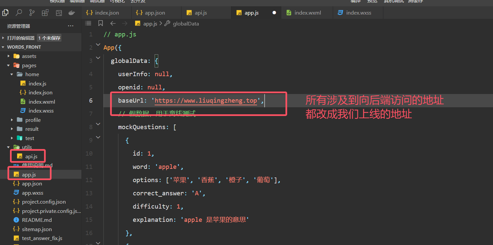

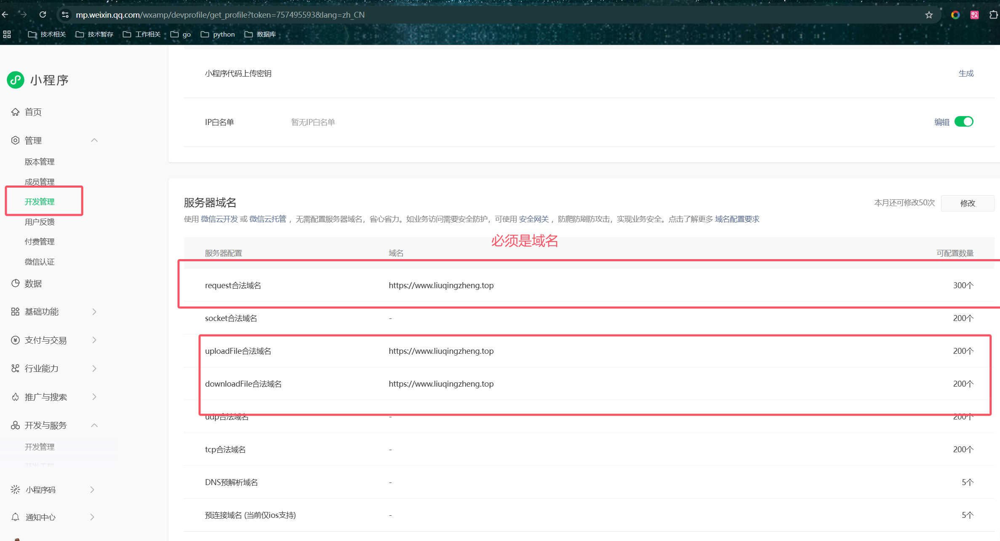

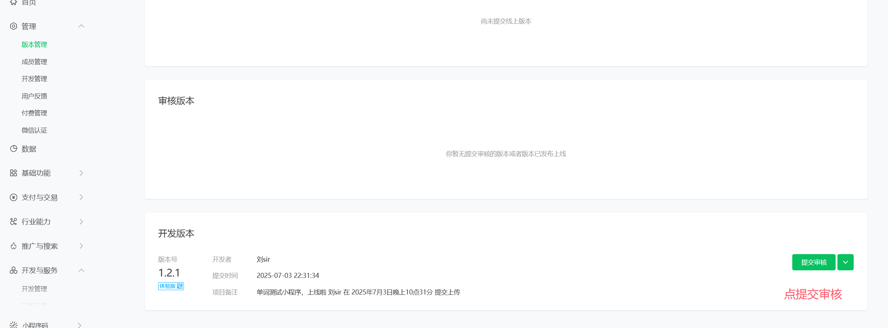

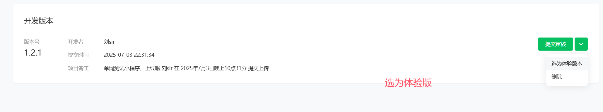
