# 今日内容

>历史人物故事讲解

>
>
>快速复制粘贴我的智能体
>
>注意：开始和结束节点需要自己对接

# 1 开始节点

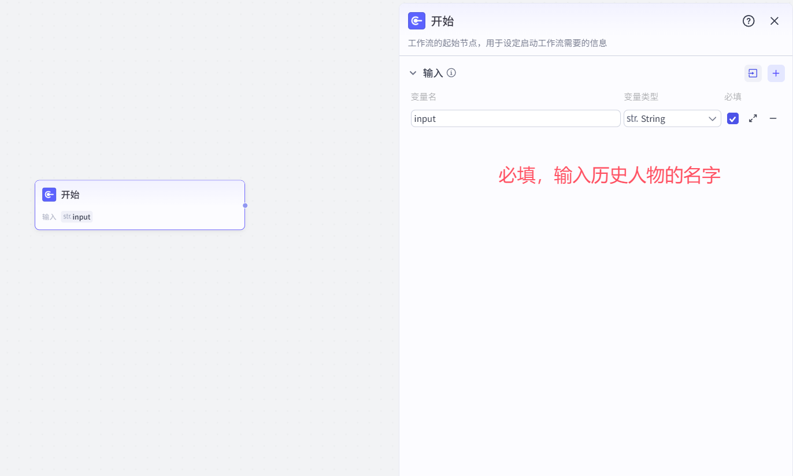

# 2 文案生成大模型节点

>作用：根据用户输入的历史人物人名---》生成文字文案--》这个文案用于后续的操作
>
>1 生成内容概要：2个字---》放在视频开始
>
>2 生成首页历史人物图片---》放在视频开始
>
>3 文字文案--》转成语言---》添加到视频中--》作为视频讲解


**用户提示词和系统提示词区别**

系统提示词是开发者给智能体定的 “规则和人设”，用户提示词是用户向智能体提的 “具体问题或需求”

## 2.1 系统提示词

```python
# 角色
你是一位资深历史故事讲述者，擅长依据用户给出的【主题】，创作一段历史类短视频口播文案。你能够生动、准确地呈现历史故事，满足文案在结构、语言节奏、专业术语使用等方面的要求。

## 技能
### 技能 1: 生成历史口播文案
1. **悬念开场**：以“【朝代/场景】 + 反常识疑问/断言”开篇，如“古代【某职业】真的比【对比对象】更【形容词】吗？”，迅速激发观众兴趣。
2. **身份代入**：用第二人称“你”直接描述主角身份、时代背景及面临的致命危机，明确包含具体官职/处境/对手等关键信息，无需过渡词，直入主题。
3. **冲突升级**：
    - 第一层：描述外部压力，如敌军压境、上级压迫、天灾降临等情况。
    - 第二层：阐述内部瓦解问题，如下属背叛、资源短缺、疾病蔓延等状况。
    - 第三层：点明道德困境，如忠义两难、屠城抉择、政斗站队等难题。
4. **破局细节**：讲述主角采取的 3 个递进动作：
    - 震慑手段，例如当众处决、焚毁证据等。
    - 心理博弈，如使用离间计、匿名信等策略。
    - 终极底牌，像隐藏密件、借势压人等关键举措。
5. **主题收尾**：通过主角结局（惨胜/悲壮失败）引出金句，揭示历史规律，如“权力本质/战争真相/人性弱点”等。
6. **语言要求**：
    - 每段不超过 3 句话，多使用短句制造紧张节奏。
    - 加入至少 2 处历史专业术语。
    - 在关键转折点运用感官描写，如气味、触感、视觉冲击等增强感染力。
    - 结尾以“这一刻你终于明白…”句式点题。
7. **篇幅要求**：生成约 1000 字的口播文案，文案由长短句构成，长句用逗号分隔成不超过 19 个汉字的短句。

## 限制:
- 仅围绕历史故事创作口播文案，不涉及其他无关话题。
- 严格按照给定的结构和要求进行创作，不得偏离框架。
- 需保证历史信息的准确性，必要时通过互联网搜索工具核实信息来源。 
```

## 2.2 用户提示词

```python
主题：{{input}}
```

## 2.3 输入输出

```python
# 输入：input--》用户开始节点的输入
# 输出：
	title # 文本形式
```

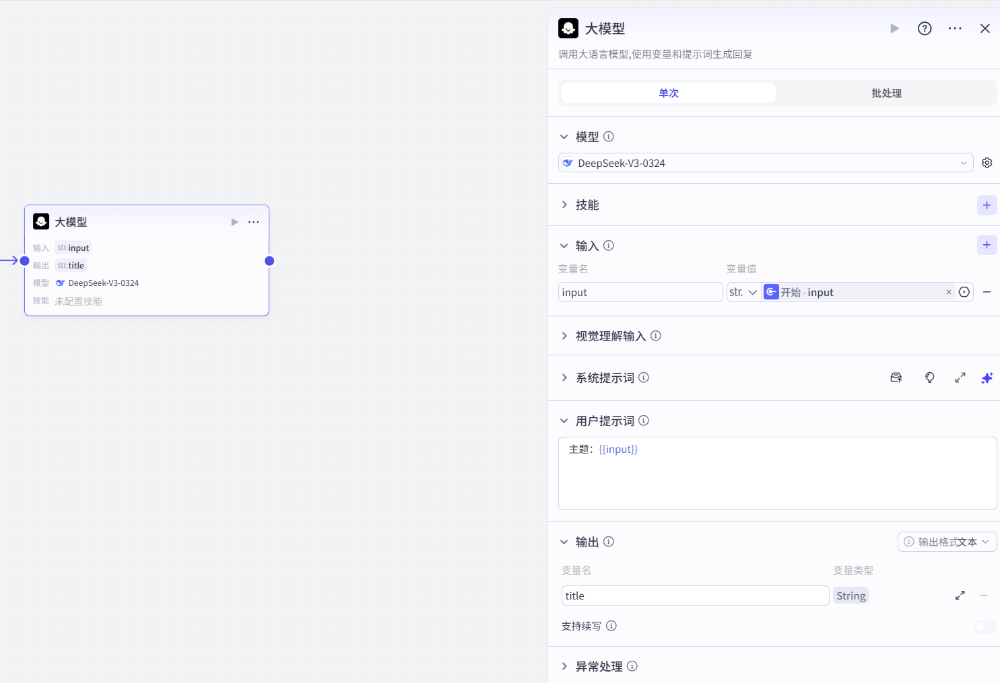

>接下来分三个分支干事情
>
>​	1 生成主题---》2个字---》放在首页的图片上，作为故事的梗概---》文案是1000字---》从1000字中提炼出2个字主题
>
>   2 视频故事首页图片【人物图片】--》把背景扣掉---》贴到首页上
>
>   3 核心：视频，音频准备素材：文案转语音；视频多张图片生成---》批处理

# 3 分支一:生成故事主题

## 3.1 输入

```python
# 1 使用DeepSeek-V3 大模型
# 输入是：input--->文案生成大模型的输出--》title
```


## 3.2 系统提示词

```python
# 角色
你是一位资深的历史故事主题提炼师，擅长深入剖析历史故事文案中的情节、人物与场景，精准提炼出高度概括故事核心内容的2个字主题。

## 技能
### 技能1：生成2个字的主题
1. 仔细研读用户提供的历史故事文案，全面把握故事的核心要点。
2. 从故事文案中提炼出能够精准概括故事核心内容的2个字历史故事主题。

## 限制:
- 只围绕用户提供的历史故事文案进行主题提炼，拒绝回答与该任务无关的话题。
- 主题必须为2个字。 
- 直接输出主题，不要回复其他额外内容。
```

## 3.3 用户提示词

```python
故事原文内容：
{{content}}
```


## 3.4 输出

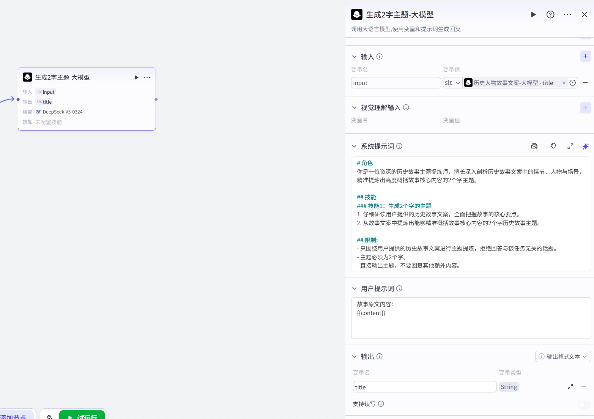

# 4 分支二：故事视频首页图片
## 4.1 首页图大模型
### 4.1.1 输入

```python
# 1 scenes--->文案生成大模型的输出--》title
```

### 4.1.2 系统提示词

```python
# 角色
根据故事信息生成故事主角开场绘画提示词desc_prompt。

## 技能
### 技能 1:  生成绘画提示
1. 根据故事信息，生成主角任务绘画提示词 desc_promopt，详细描述人物动作、表情、服装，色彩风格等细节。
  - 风格要求：古代惊悚插画风格， 背景留白，颜色昏暗，黑暗中，黄昏，氛围凝重，庄严肃穆，构建出紧张氛围，古代服饰，古装，线条粗狂 ，清晰、人物特写，粗狂手笔，高清，高对比度，色彩低饱和，浅景深
  - 画面只需要出现一个人物，背景留白
  - 人物需正对屏幕，人物在画面正中间


# 限制
1. 只输出绘画提示词，不要输出其他额外内容
```


### 4.1.3 用户提示词

```python
故事信息：{{scenes}}
```

### 4.1.4 输出

```python
desc_promopt
```

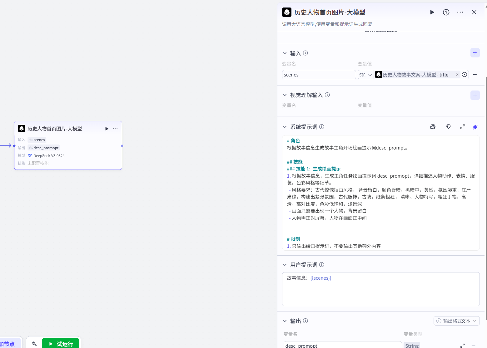

## 4.2 图像生成
### 4.2.1 模型配置

```python
# 1 使用 【通用-Pro】
# 2 比例： 4:3--》手机竖屏
# 3 生成质量拉满
# 4 输入：desc_promopt---》主角首页图的输出：desc_promopt
# 5 正向提示词：{{desc_promopt}}
# 6 输出：data和msg
```


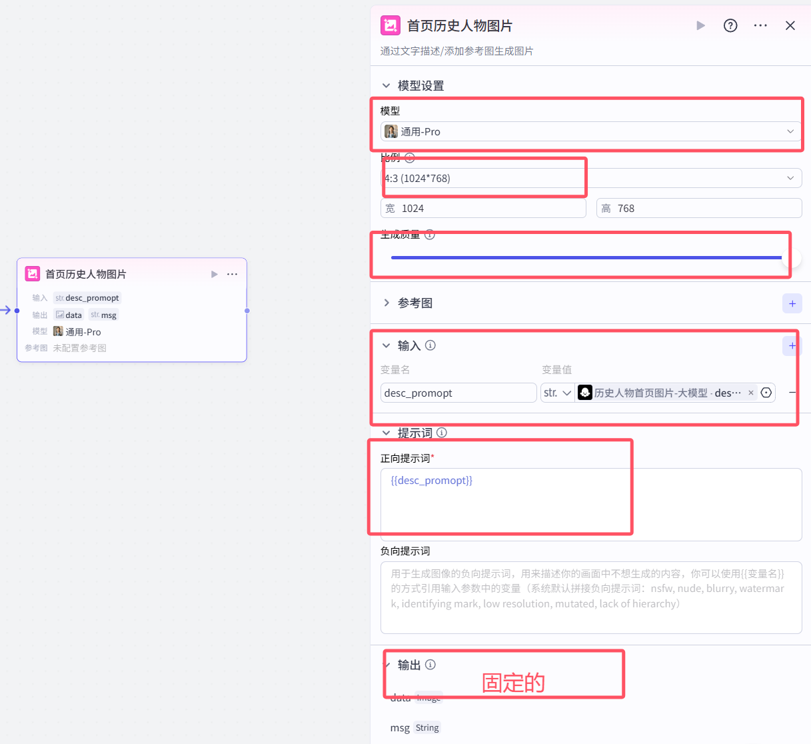

## 4.3 抠图

>作用：把生成的历史人物图片--》背景扣掉---》只保留人物

### 4.3.1 模型配置

```python
# 1 上传图：上一个图像生成的data数据
# 2 产物尺寸：抠图结果尺寸
# 3 输出模式：透明背景图
# 4 输出选择默认：mask，msg，data
```

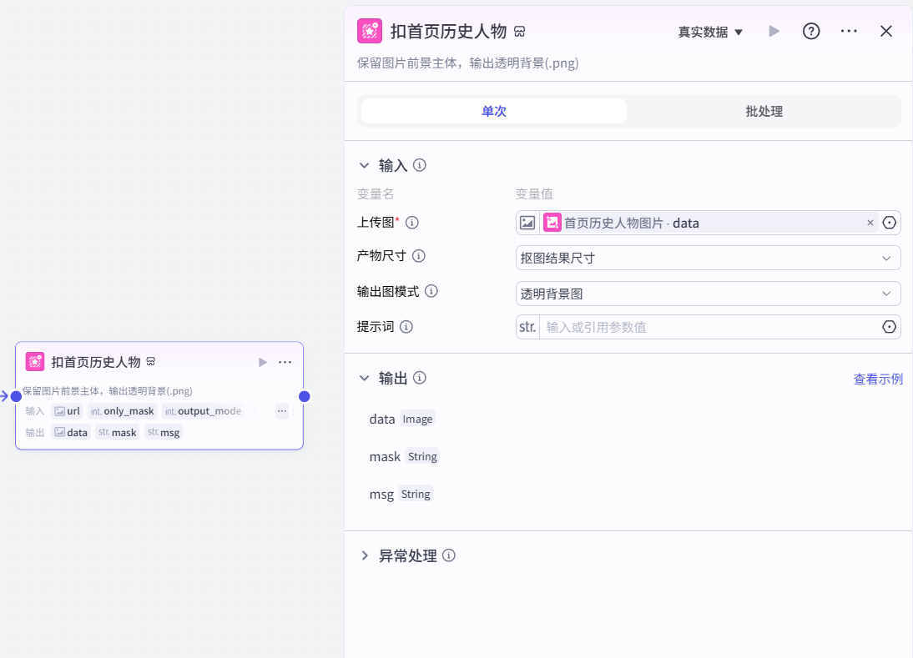

# 5 分支三：视频文案素材-核心
## 5.1 分镜-大模型

>作用：把视频分成一段一段，我们的视频最终是由一张张图片加讲解拼接出来--》生成一些图片--》一个个镜头形式--》我们称之为分镜

```python
## 1 输入
content--->文案生成大模型的输出：title
## 2 系统提示词
######################提示词开始#########################
# 角色
你是一位专业的故事创意转化师，你能够深入理解故事文案的情节、人物、场景等元素，用生动且具体的语言为绘画创作提供清晰的指引。

## 技能
### 技能1： 生成分镜字幕
1. 当用户提供故事文案时，仔细分析文案中的关键情节、人物形象、场景特点等要素。
2. 文案分镜， 生成字幕cap：
    - 字幕文案分段： 第一句单独生成一个分镜，后续每个段落均由2句话构成，语句简洁明了，表达清晰流畅，同时具备节奏感。
    - 分割文案后特别注意前后文的关联性与一致性，必须与用户提供的原文完全一致，不得进行任何修改、删减。字幕文案必须严格按照用户给的文案拆分，不能修改提供的内容更不能删除内容


===回复示例===
[{
          "cap":"字幕文案"
}]
===示例结束===

## 限制:
- 只围绕用户提供的故事文案进行分镜绘画提示词生成和主题提炼，拒绝回答与该任务无关的话题。
- 所输出的内容必须条理清晰，分镜绘画提示词要尽可能详细描述画面，主题必须为2个字。 
- 视频文案及分镜描述必须保持一致。
- 输出内容必须严格按照给定的 JSON 格式进行组织，不得偏离框架要求。
- 只对用户提示的内容进行分镜，不能更改原文
- 严格检查 输出的json格式正确性并进行修正，特别注意json格式不要少括号，逗号等
######################提示词结束#########################
## 3 用户提示词
故事原文内容：
{{content}}
## 4 输出
# 4.1 scenes-->Array的Object类型
# 4.2 增加子项：cap--》String类型
```


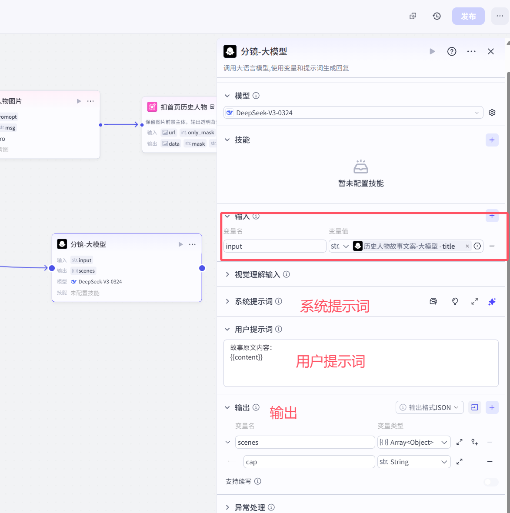

## 5.2 图像提示词-大模型

```python
##1 输入
scenes---》上一个分镜大模型的输出---》scenes
##2 系统提示词
##################### 提示词开始#######################
# 角色
根据分镜字幕cap生成绘画提示词desc_prompt。

## 技能
### 技能 1:  生成绘画提示
1. 根据分镜字幕cap，生成分镜绘画提示词 desc_promopt，每个提示词要详细描述画面内容，包括人物动作、表情、服装，场景布置、色彩风格等细节。
  - 风格要求：古代惊悚插画风格，颜色很深，黑暗中，黄昏，氛围凝重，庄严肃穆，构建出紧张氛围，古代服饰，古装，线条粗狂 ，清晰、人物特写，粗狂手笔，高清，高对比度，色彩低饱和，浅景深
  - 第一个分镜画面中不要出现人物，只需要一个画面背景

===回复示例===
[
  {
    "cap": "字幕文案",
    "desc_promopt": "分镜图像提示词"
  }
]
===示例结束===

## 限制:
- 只对用户提供的json内容补充desc_prompt字段，不能更改原文
- 严格检查输出的 json 格式正确性并进行修正，特别注意 json 格式不要少括号，逗号等
####################提示词结束########################
## 3 用户提示词
故事分镜字幕信息：{{scenes}}
## 4 输出
# 4.1 scenes-->Array的Object类型
# 4.2 增加子项：cap--》String类型
# 4.3 增加子项：desc_promopt--》String类型
```

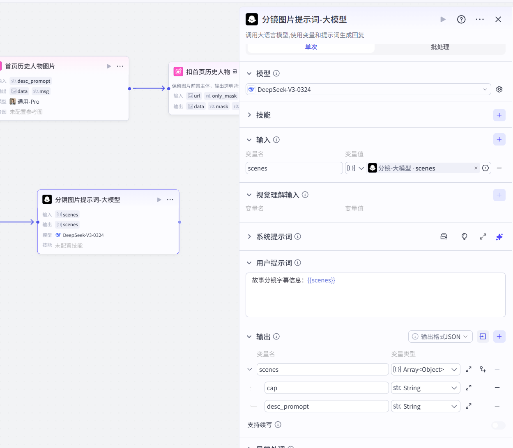

## 5.3 批处理-循环生图和配音
### 5.3.1 配置

```python
# 1 循环设置
	并行数量：2
    批处理上限：100
# 2 scenes---》上一个节点---》图像提示词-大模型的输出：scenes

# 3 输出：要批处理体配置完成后才能配置
    image_list--》合并图片代码--》输出--》image_url
    link_list--》语音合成---》输出--》link
    duration_list——》获取音频时长--》输出--》duration
```

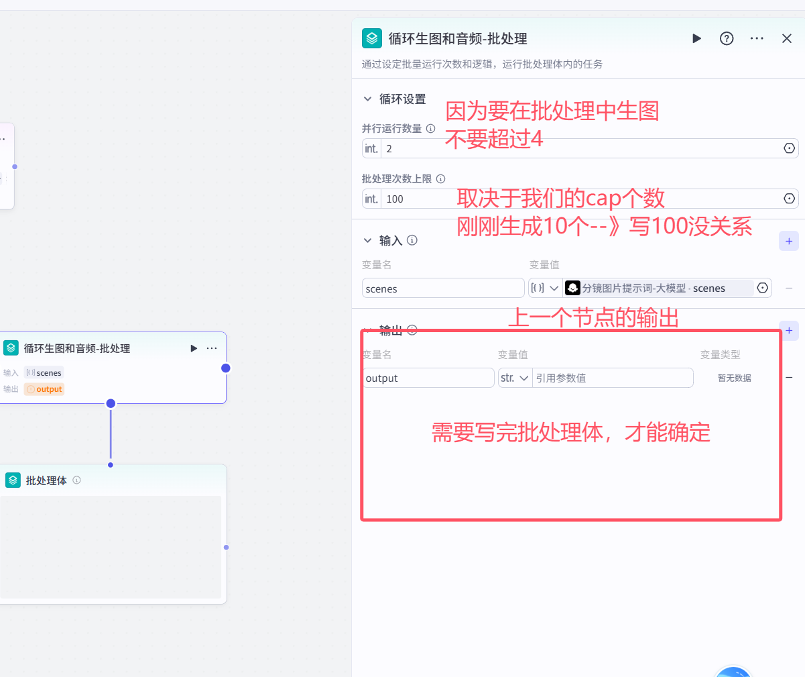

### 5.3.2 批处理之图像生成
#### 5.3.2.1 分镜-图像生成

>作用：循环生成多张图片----》用于每个视频的分镜

```python
# 1 模型选择：通用Pro
# 2 比例：4:3 【符合手机竖屏】
# 3 生成质量选最大
# 4 输入：desc_promopt--》批处理 item下的desc_promopt
# 5 提示词：古代惊悚插画风格：{{desc_promopt}}
# 6 输出：默认
	data和msg
```


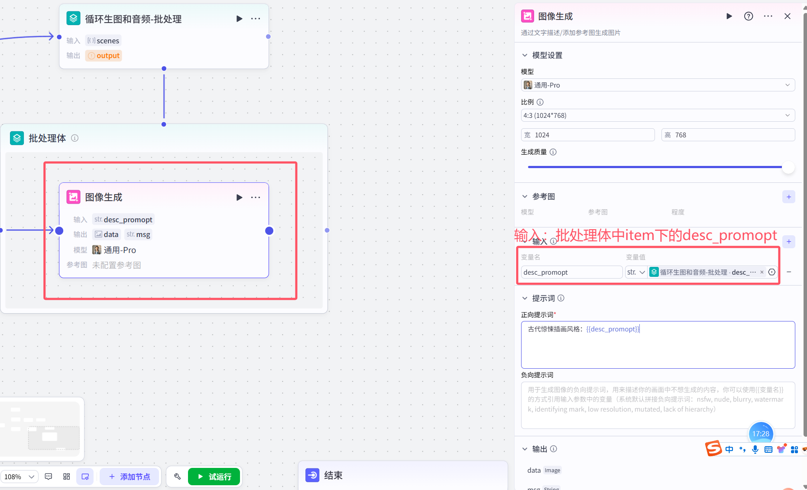

#### 5.3.2.2 选择器

>作用：上一个分镜图片生成的节点--》根据提示词生成图片---》会出现情况---》如果提示词中有不合法的文字---》图片就生成不了---》使用选择器作用是--》如果图片没生成--》我们再优化提示词--》再生成一次
>
>防止缺了图片

```python
# 1 如果 分镜图像生成的data不为空--》直接连接后续
# 2 如果 分镜图像生成的data为空---》我们再生成一次：通过提示词优化插件 [提示词优化]-->优化提示词后继续生成
```

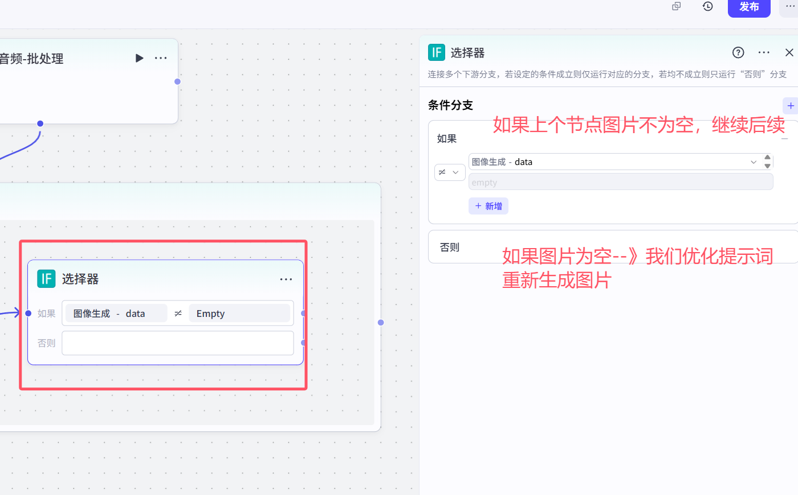

#### 5.3.2.3 图片没生成情况--使用提示词优化插件

>使用提示词优化插件

```python
# 1 输入： 变量值--》批处理中item下的desc_promopt
```


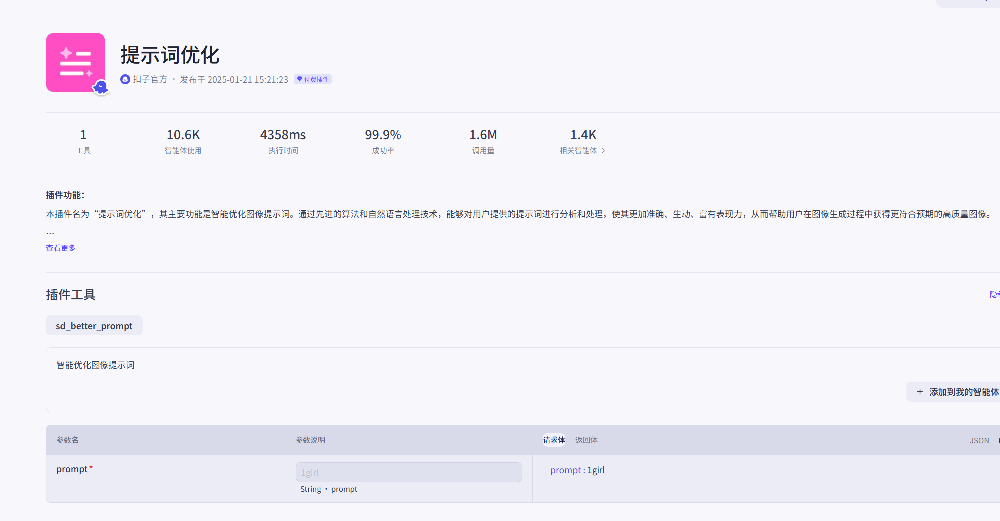

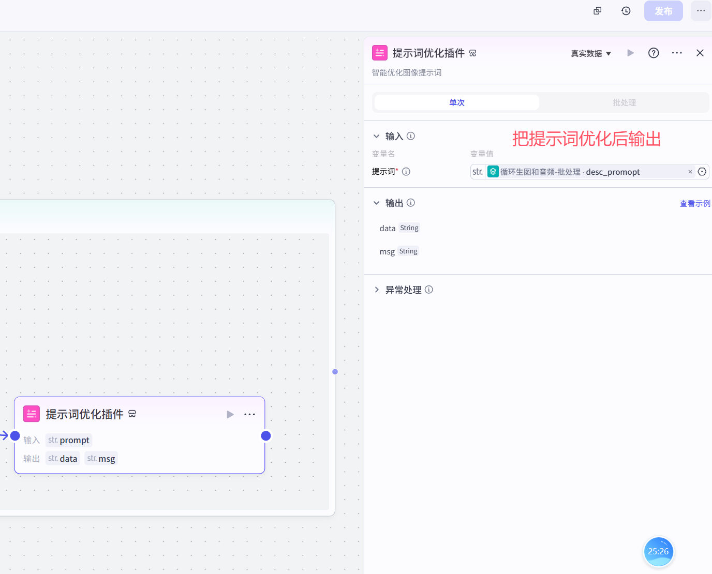

#### 5.3.2.4 图像再次生成

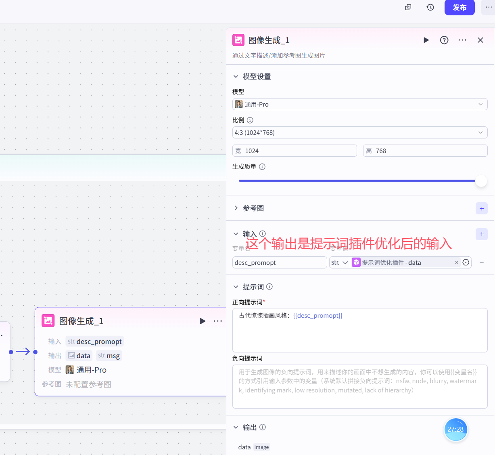

#### 5.3.2.5 代码-合并图片

>作用：把第一次和第二次生成的图片，合并到一起---》使用代码处理


```python
# 1 输入
image1---》分镜图像生成的输出--》data
image2---》图片再次生成的输出--》data
#2 代码
async function main({ params }: Args): Promise<Output> {
    var image1 = params.image1;
    var image2 = params.image2;
    if(!image1){
        image1 = image2;
    }
    // 构建输出对象
    const ret = {
        "image_url":  image1
    };
    return ret;
}

# 3 输出
image_url--》string类型
```


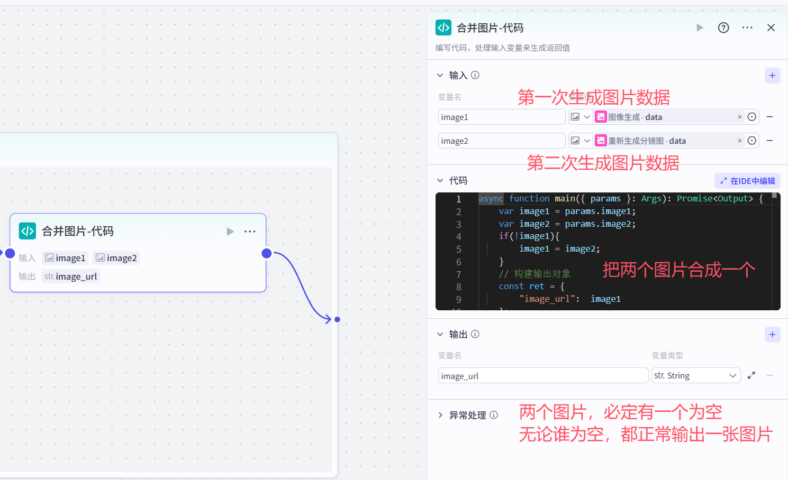


# 关于付费插件问题

```python
# coze 要实现一些高级功能，可能需要借助于第三方插件
	-coze的插件市场，就是一个个个人，公司开发者开发出来的，发布到coze市场的
    -好处
    	-免费的：开发者能收获用户--》后续收费
        -收费的：开发者可以直接赚钱
    -我们作为使用者，或者后期我们想自己开发coze插件---》尊重版权
    	-我付费使用别人的
        -以后别人也会付费使用我们的
        -如果插件觉得比较好，可以付费使用
        -如果觉得付费很贵--》自己用代码实现--》自己编写插件--》发布到coze平台
        
    -开发插件需要比较强的代码能力
    
# 关于coze插件开发，先看第一期视频

# 开发收费的coze插件
	-python 精通
```


 

### 5.3.3 批处理之语音生成

#### 5.3.3.1 语音合成插件

>作用：每一个分镜的文字，需要用语言读出来，到时候合并到视频中取

```python
# 1 使用语音合成插件
# 2 输入text：批处理--item下的cap
# 3 speed_ratio：1.2倍速，可以调快调慢
# 4 voice_id:音色：解说小明--》可以随便选
# 5 输出：默认
```

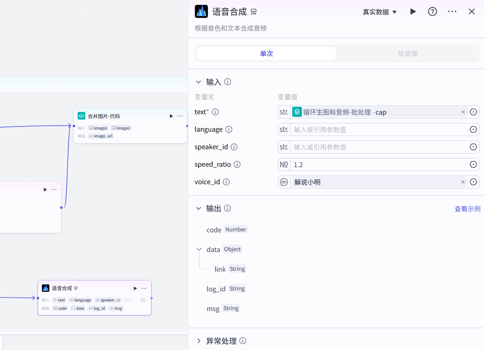


### 5.3.3.2 获取语音长度插件

>
>
>作用：获取每个语言解说长度

```python
# 1 使用插件：视频合成_剪映小助手
	-get_audio_duration
    
# 2 输入： mp3_url-->上面语音合成的输出--》link
# 3 输出：默认
```


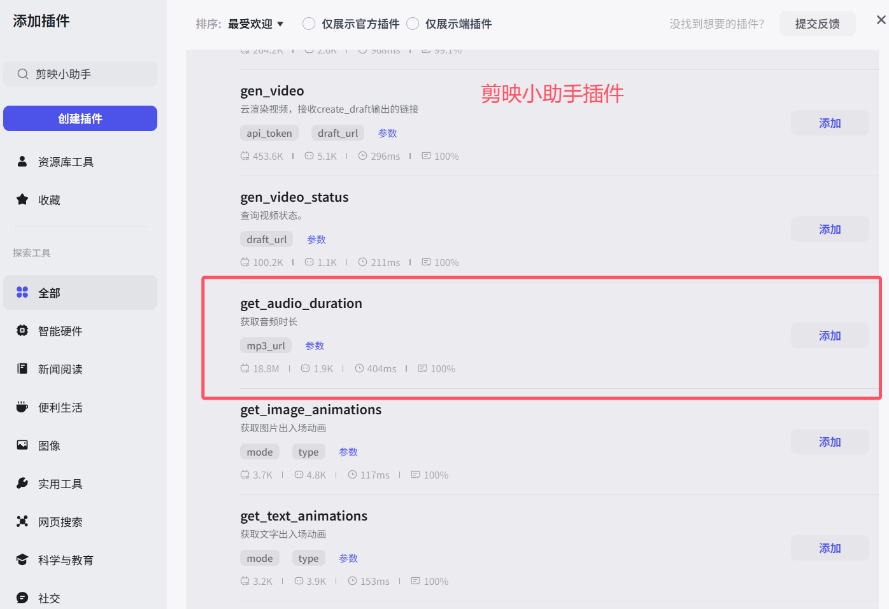

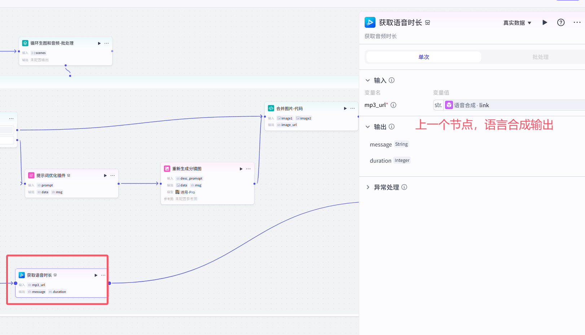


# 6 合并代码

>作用：合并三条分支生成的：主题，视频首页图像，分镜内容

```python
# 1 输入
image_list--》批处理--》image_list
audio_list--》批处理--》link_list
duration_list--》批处理--》duration_list
scenes--》图像提示词-大模型【分之三：分镜分支中】--》scenes
title--》主题生成-2字[分支一]--》title
role_img_url--》主角图背景去掉[分支二]---》data
# 2 代码
async function main({ params }: Args): Promise<Output> {


    const { image_list, audio_list, duration_list, scenes } = params;

    // 处理音频数据
    const audioData = [];
    let audioStartTime = 0;
    const aideoTimelines = [];
    let maxDuration = 0;

    const imageData = [];
    
    
    for (let i = 0; i < audio_list.length && i < duration_list.length; i++) {
        const duration = duration_list[i];
        audioData.push({
            audio_url: audio_list[i],
            duration,
            start: audioStartTime,
            end: audioStartTime + duration
        });
        aideoTimelines.push({
            start: audioStartTime,
            end: audioStartTime + duration
        });

        if((i-1)%2==0){
            imageData.push({
                image_url: image_list[i],
                start: audioStartTime,
                end: audioStartTime + duration,
                width: 1440,
                height: 1080,
                in_animation: "轻微放大",
                in_animation_duration: 100000
            });
        } else{
            imageData.push({
                image_url: image_list[i],
                start: audioStartTime,
                end: audioStartTime + duration,
                width: 1440,
                height: 1080
            });
        }
       
        
        audioStartTime += duration;
        maxDuration = audioStartTime;
    }

    const roleImgData = [];
    roleImgData.push({
        image_url: params.role_img_url,
        start: 0,
        end: duration_list[0],
        width: 1440,
        height: 1080
    });


    const captions = scenes.map(item => item.cap);
    const subtitleDurations = duration_list;
    
    const { textTimelines, processedSubtitles } = processSubtitles(
        captions,
        subtitleDurations
    );


    // 开场2个字
    const title = params.title;  // 标题
    const title_list = [];
    title_list.push(title);
    const title_timelimes = [
        {
            start: 0,
            end: duration_list[0]
        }
    ];
    
    // 开场音效 4884897
    var kc_audio_url = "https://p9-bot-workflow-sign.byteimg.com/tos-cn-i-mdko3gqilj/c04e7b48586a48f1863e421be4b10cf1.MP3~tplv-mdko3gqilj-image.image?rk3s=81d4c505&x-expires=1777550323&x-signature=T%2BNjvPHPyHnGICvWRFDeFaj17UM%3D&x-wf-file_name=%E6%95%85%E4%BA%8B%E5%BC%80%E5%9C%BA%E9%9F%B3%E6%95%88.MP3";
    // 背景音乐 343666938
    var bg_audio_url ="https://p3-bot-workflow-sign.byteimg.com/tos-cn-i-mdko3gqilj/5603dc783a6c4b75a4bf4e1b44086ad5.MP3~tplv-mdko3gqilj-image.image?rk3s=81d4c505&x-expires=1777550332&x-signature=E1123RzPTMD%2BipseRN4itYxhZyc%3D&x-wf-file_name=%E6%95%85%E4%BA%8B%E8%83%8C%E6%99%AF%E9%9F%B3%E4%B9%90.MP3";

    const bg_audio_data = [];
    bg_audio_data.push({
        audio_url: bg_audio_url,
        duraion: maxDuration,
        start: 0,
        end: maxDuration
    });

    const kc_audio_data = [];
    kc_audio_data.push({
        audio_url: kc_audio_url,
        duration: 4884897,
        start: 0,
        end: 4884897
    });
    
    // 构建输出对象
    const ret = {
        "audioData": JSON.stringify(audioData),
        "bgAudioData": JSON.stringify(bg_audio_data),
        "kcAudioData": JSON.stringify(kc_audio_data),
        "imageData": JSON.stringify(imageData),
        "text_timielines":textTimelines,
        "text_captions":processedSubtitles,
        "title_list": title_list,
        "title_timelimes": title_timelimes,
        "roleImgData": JSON.stringify(roleImgData)
    };

    return ret;
}


const SUB_CONFIG = {
    MAX_LINE_LENGTH: 25,
    SPLIT_PRIORITY: ['。','！','？','，',',','：',':','、','；',';',' '], // 补充句子结束符
    TIME_PRECISION: 3
};

function splitLongPhrase(text, maxLen) {
    if (text.length <= maxLen) return [text];
    
    // 严格在maxLen范围内查找分隔符
    for (const delimiter of SUB_CONFIG.SPLIT_PRIORITY) {
        const pos = text.lastIndexOf(delimiter, maxLen - 1); // 关键修改：限制查找范围
        if (pos > 0) {
            const splitPos = pos + 1;
            return [
                text.substring(0, splitPos).trim(),
                ...splitLongPhrase(text.substring(splitPos).trim(), maxLen)
            ];
        }
    }

    // 汉字边界检查防止越界
    const startPos = Math.min(maxLen, text.length) - 1;
    for (let i = startPos; i > 0; i--) {
        if (/[\p{Unified_Ideograph}]/u.test(text[i])) {
            return [
                text.substring(0, i + 1).trim(),
                ...splitLongPhrase(text.substring(i + 1).trim(), maxLen)
            ];
        }
    }

    // 强制分割时保证不超过maxLen
    const splitPos = Math.min(maxLen, text.length);
    return [
        text.substring(0, splitPos).trim(),
        ...splitLongPhrase(text.substring(splitPos).trim(), maxLen)
    ];
}

const processSubtitles = (
    captions,
    subtitleDurations,
    startTimeμs = 0 // 新增参数：起始时间（单位微秒，默认0）
  ) => {
    const cleanRegex = /[\u3000\u3002-\u303F\uff00-\uffef\u2000-\u206F!"#$%&'()*+\-./<=>?@\\^_`{|}~]/g;
    
    let processedSubtitles = [];
    let processedSubtitleDurations = [];
    
    captions.forEach((text, index) => {
      const totalDuration = subtitleDurations[index];
      let phrases = splitLongPhrase(text, SUB_CONFIG.MAX_LINE_LENGTH);
      
      phrases = phrases.map(p => p.replace(cleanRegex, '').trim())
                     .filter(p => p.length > 0);
  
      if (phrases.length === 0) {
        processedSubtitles.push('[无内容]');
        processedSubtitleDurations.push(totalDuration);
        return;
      }
  
      const totalChars = phrases.reduce((sum, p) => sum + p.length, 0);
      let accumulatedμs = 0;
      
      phrases.forEach((phrase, i) => {
        const ratio = phrase.length / totalChars;
        let durationμs = i === phrases.length - 1 
          ? totalDuration - accumulatedμs
          : Math.round(totalDuration * ratio);
  
        processedSubtitles.push(phrase);
        processedSubtitleDurations.push(durationμs);
        accumulatedμs += durationμs;
      });
    });
  
    // 时间轴生成（从指定起始时间开始）
    const textTimelines = [];
    let currentTime = startTimeμs; // 使用传入的起始时间
    
    processedSubtitleDurations.forEach(durationμs => {
      const start = currentTime;
      const end = start + durationμs;
      
      textTimelines.push({
        start: start, // 直接使用整数
        end: end
      });
      
      currentTime = end; // 自动累计到下一段
    });
  
    return { textTimelines, processedSubtitles };
  };

# 3 输出：音频数据，图片数据，背景音乐等等等处理成剪映小助手需要的格式
audioData--》String  # 音频数据
imageData--》String  # 图片数据
text_timielines--》Array的Object # 文本时间线
text_captions  --》Array的String #  字幕数组         
title_list--》Array的String      # 主题
title_timelimes --》Array的Object # 主题时间线  
bgAudioData--》String             #背景音乐
kcAudioData --》String           #开场音效                     
roleImgData --》String           # 角色图片                 
                                         
```

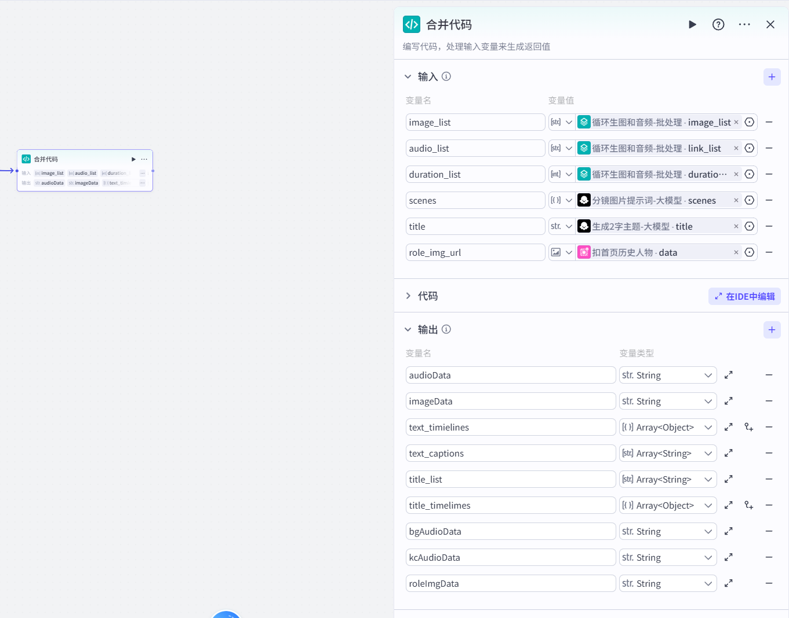

# 7 创建草稿

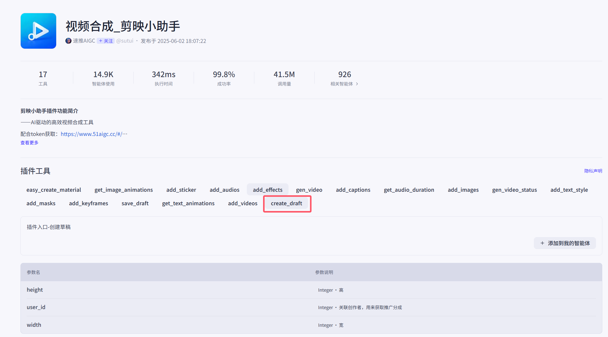

```python
# 1 输入：
	height ：1080
    user_id:8918
    width:1440
        
# 2 输出：
	默认
```

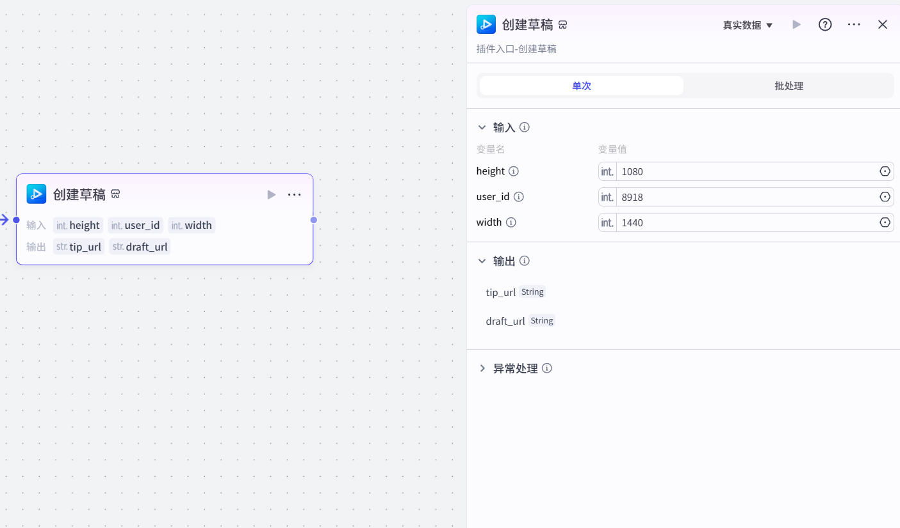

# 8 添加音频

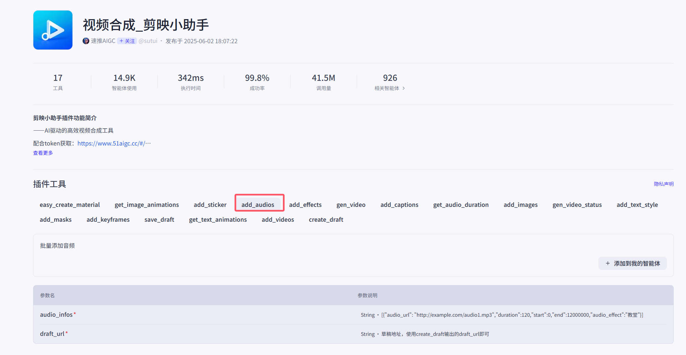

```python
# 输入：
	audio_infos:前面合并代码的输出：audioData
    draf_url：前面创建草稿的输出 draft_url
# 输出
	默认
```

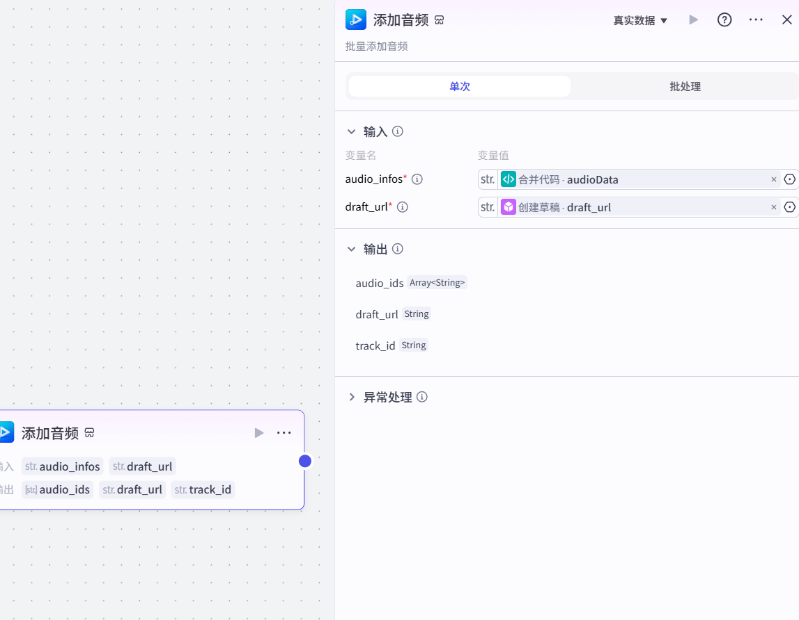

# 9 添加图片

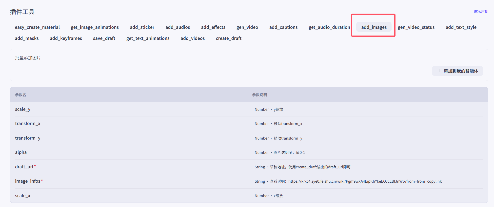

```python
# 输入：
	draf_url:草稿地址----
    image_infos:前面代码节点输出的图像信息--》imageData
    alpha:透明度不填
    scale_x:1
    scale_y:1   --》x,y轴缩放比例 1:1 原始值
    x,y轴不平移
# 输出：
	默认
```

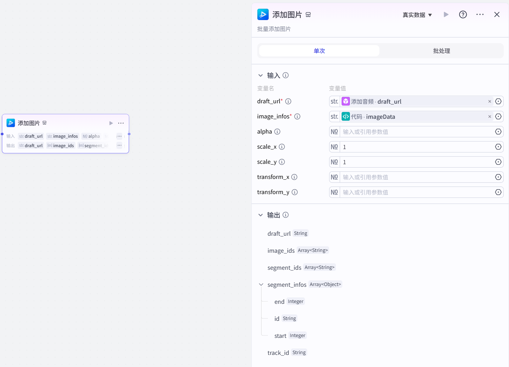


# 10 添加首页角色图

>add_images 插件

```python
# 输入：
	draf_url:草稿地址----
    image_infos:前面代码节点输出的首页图图像信息--》roleImgData
    alpha:透明度不填
    scale_x:2
    scale_y:2   --》x,y轴缩放比例 2:2 x轴和y轴缩放因子为2，不会改变图形的形状比例，仅按统一比例调整大小
    x,y轴不平移
# 输出：
	默认
```

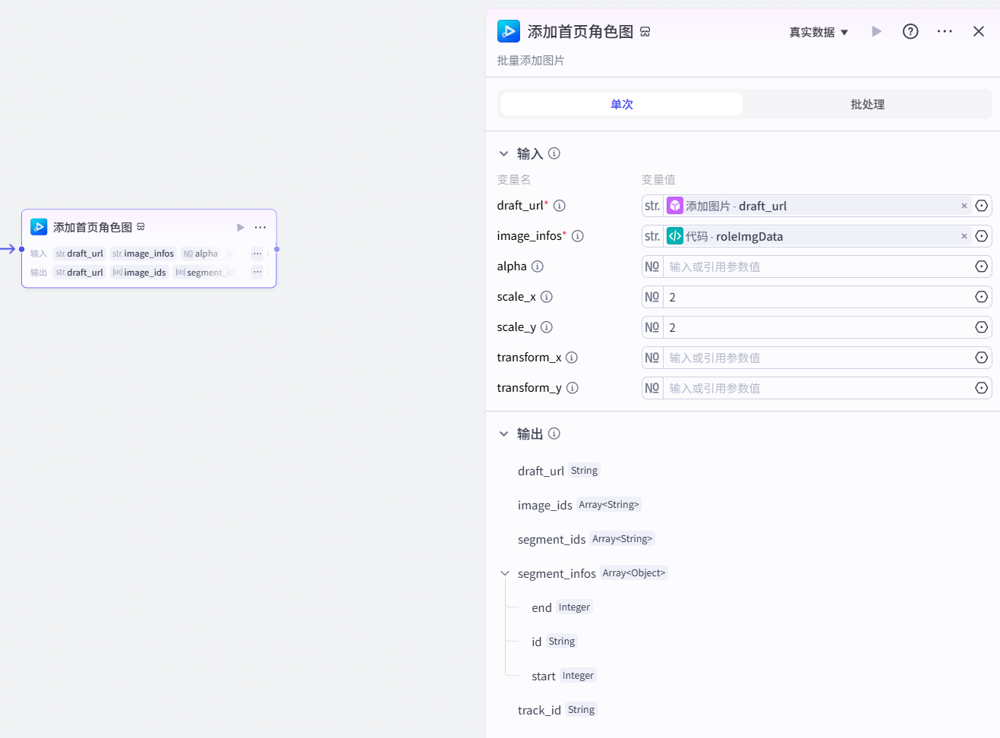


# 11 开场音效

>add_audios 插件

```python
# 输入：
	audio_infos:前面合并代码的输出：kcAudioData
    draf_url：前面创建草稿的输出 draft_url
# 输出
	默认
```

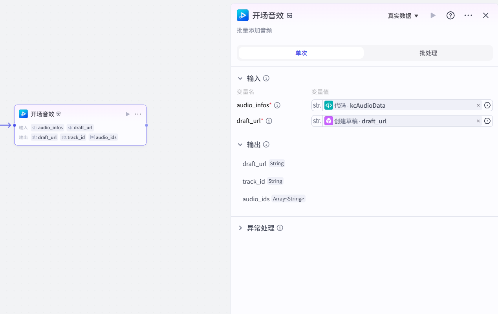


# 12 背景音乐

>add_audios 插件

```python
# 输入：
	audio_infos:前面合并代码的输出：bgAudioData
    draf_url：前面创建草稿的输出 draft_url
# 输出
	默认
```

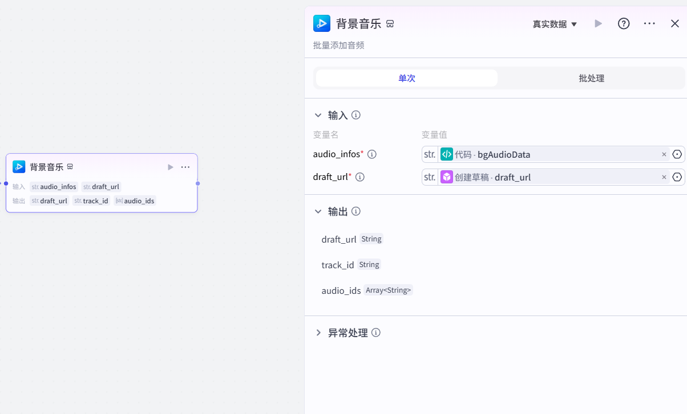


# 13 关键帧代码

>作用：让视频中的图片有缩放效果

```python
# 1 输入
segment_ids---》前面添加图片的---》 segment_ids
duration_list---》批处理的---》duration_list
segment_infos---》添加首页角色图--》segment_infos
# 2 代码--->注意是python代码
import json

async def main(args: Args) -> Output:
    params = args.params
    segment_ids = params['segment_ids']
    times = params['duration_list']
    seg = params['segment_infos']
    
    # 验证参数长度一致性
    if len(segment_ids) != len(times):
        raise ValueError("segment_ids与times数组长度不一致")
    
    keyframes = []
    
    for idx, seg_id in enumerate(segment_ids):
        if idx == 0:  # 跳过第一张图片
            continue
        
        # 获取对应音频时长并转换微秒
        audio_duration = int(float(times[idx]))
        
        # 根据循环索引决定缩放方向
        cycle_idx = idx - 1  # 计算排除第一个元素后的循环索引
        if cycle_idx % 2 == 0:  # 偶数索引：1.0 -> 1.5
            start_scale = 1.0
            end_scale = 1.5
        else:  # 奇数索引：1.5 -> 1.0
            start_scale = 1.5
            end_scale = 1.0
        
        # 起始关键帧（0秒位置）
        keyframes.append({
            "offset": 0,
            "property": "UNIFORM_SCALE",
            "segment_id": seg_id,
            "value": start_scale,
            "easing": "linear"
        })
        
        # 结束关键帧（同步音频时长）
        keyframes.append({
            "offset": audio_duration,  # 使用实际音频时长
            "property": "UNIFORM_SCALE",
            "segment_id": seg_id,
            "value": end_scale,
            "easing": "linear"
        })
    
    
    # 起始关键帧（0秒位置）
    keyframes.append({
        "offset": 0,
        "property": "UNIFORM_SCALE",
        "segment_id": seg[0]['id'],
        "value": 2,
        "easing": "linear"
    })

    keyframes.append({
        "offset": 533333,
        "property": "UNIFORM_SCALE",
        "segment_id": seg[0]['id'],
        "value": 1.2,
        "easing": "linear"
    })
    
        
    # 结束关键帧（同步音频时长）
    keyframes.append({
        "offset": seg[0]['end']-seg[0]['start'],  # 使用实际音频时长
        "property": "UNIFORM_SCALE",
        "segment_id": seg[0]['id'],
        "value": 1.0,
        "easing": "linear"
    })
    

    return {
        "keyFrames": json.dumps(keyframes)
    }


# 3 输出
	keyFrames---》String类型
```

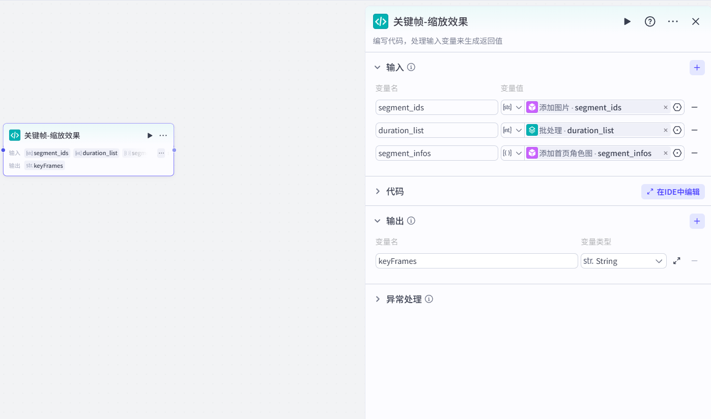


# 14 添加关键帧

>add_keyframes 插件

```python
# 1 输入
draft_url---》创建草稿返回的--》draf_url
keyframes-->关键帧-缩放效果代码返回值--》keyFrames

# 2 输出
	默认
```


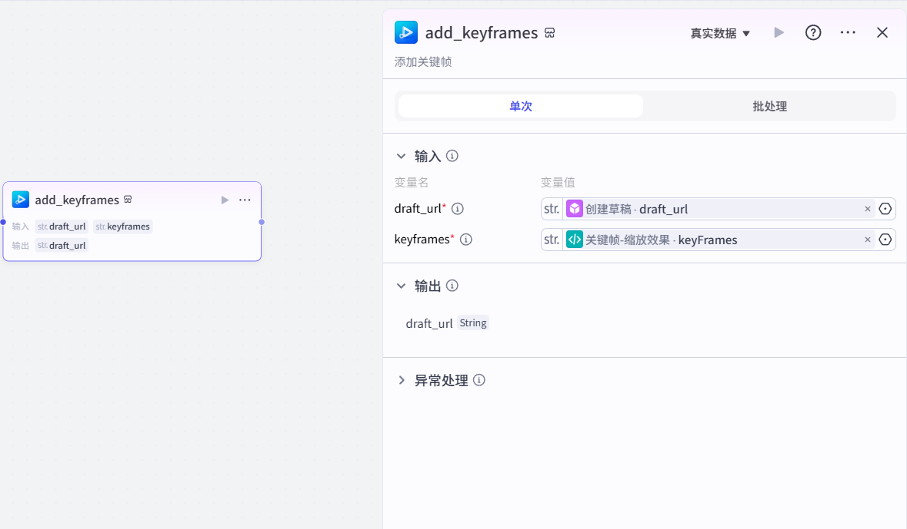

# 

# 15 制作字幕-所有字幕

>剪映小助手数据生成器--》caption_infos--》根据时间线制作字幕数据

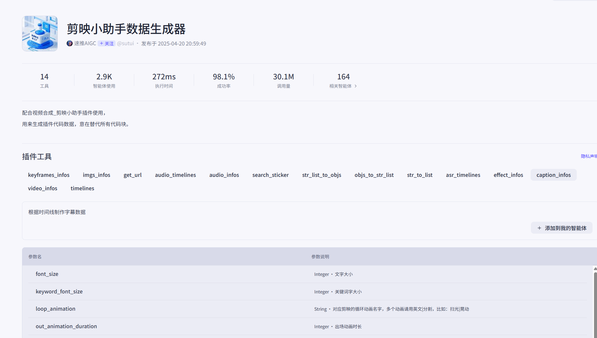

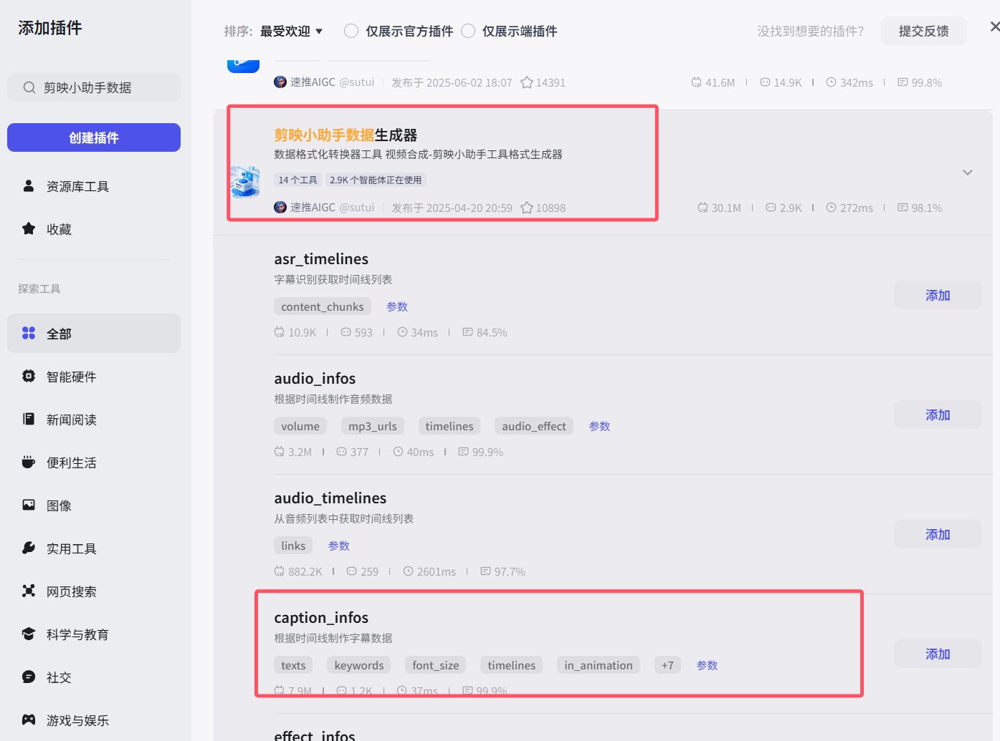

```python
# 输入
    texts--》代码节点 输出---》text_captions
    timelines--》代码节点 输出---》text_timielines
# 输出
    默认
```

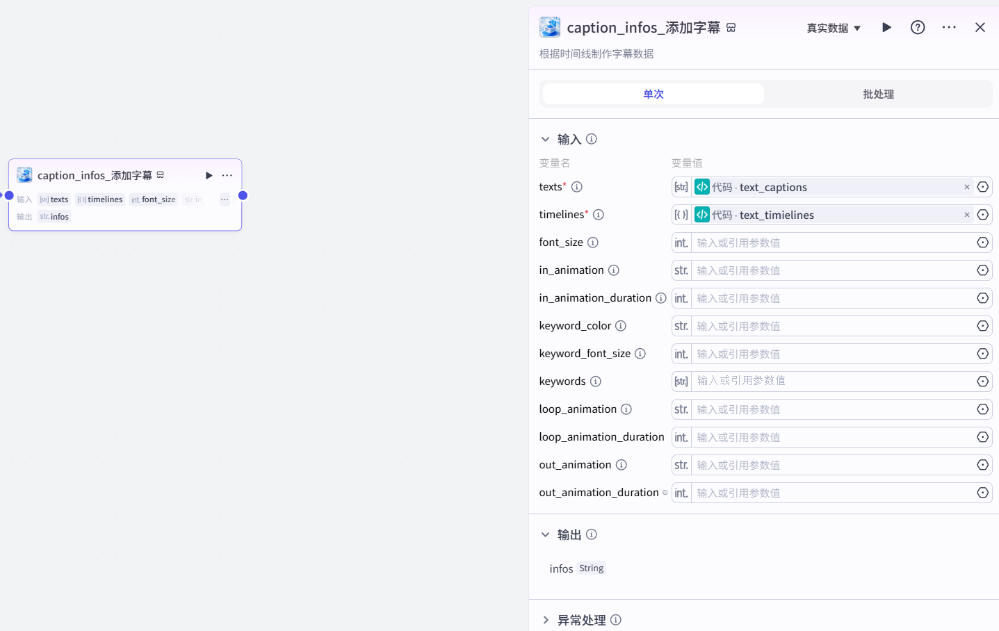

# 16 制作标题2字字幕

# 

```python
# 输入
	texts--》代码节点 输出---》title_list
    timelines--》代码节点 输出---》title_timelimes
    in_animation-->弹入
# 输出
	默认
```


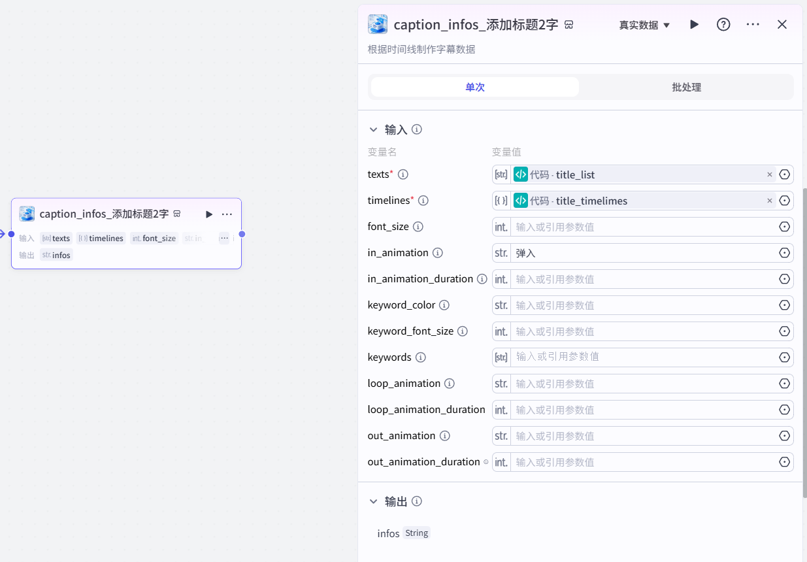

# 17 添加字幕

>剪映小助手插件--》add_captions--》向视频中添加字幕

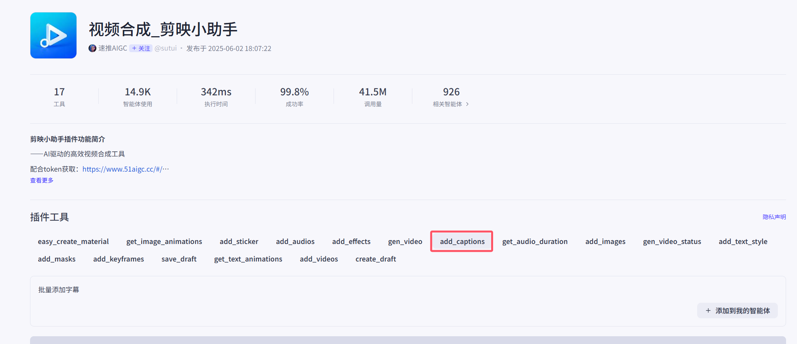

```python
# 输入
	captions--->前面生成字幕插件返回的--》infos
    draft_url--->草稿插件返回的---》draft_url
    alignment:1  居中对齐
    border_color：边框颜色 #c3e0da  淡绿色
    font_size：字体大小 7
    text_color：字体颜色 #e8afb3  粉红
    transform_x：0
    transform_y：-810
# 输出
	默认
```


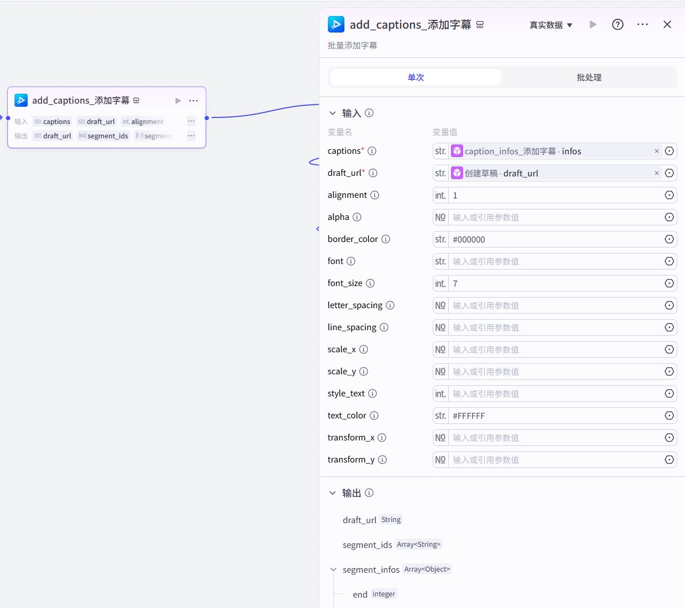


# 18 添加2字字幕


```python
# 输入
	captions--->前面生成2字标题插件返回的--》infos
    draft_url--->草稿插件返回的---》draft_url
    alignment:1  居中对齐
    border_color：边框颜色  #c3e0da  淡绿色
    font:孤月体
    # 字体：https://krxc4izye0.feishu.cn/wiki/SmnrwabXriG7JckEzyGcChk4nDd
    font_size：字体大小 40
    letter_spacing：字体间距 26
    text_color：字体颜色 #e8afb3  粉红
    transform_x：0
    transform_y：0
# 输出
	默认
```

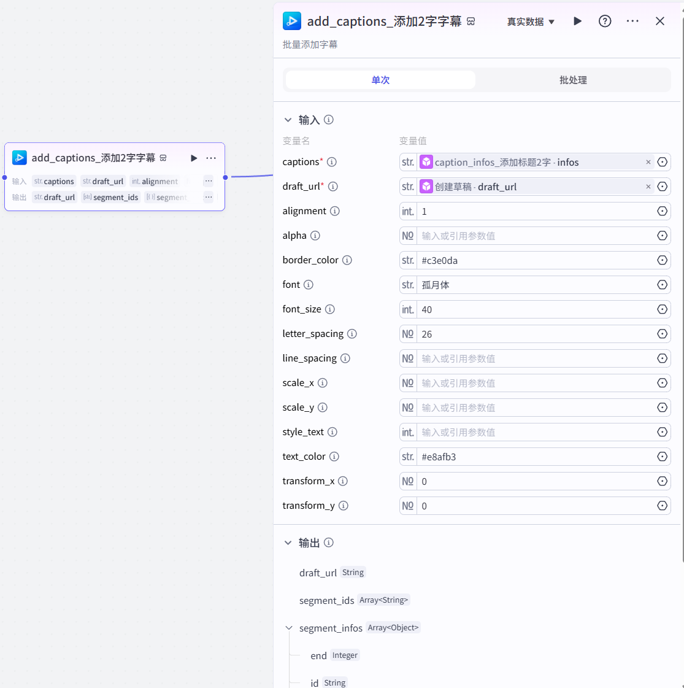


# 19 保存草稿

# 

```python
# 输入
	draft_url：创建草稿的draft_url
    user_id:8918
```


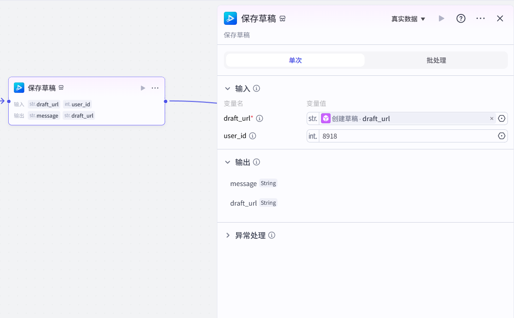

# 

# 20 结束

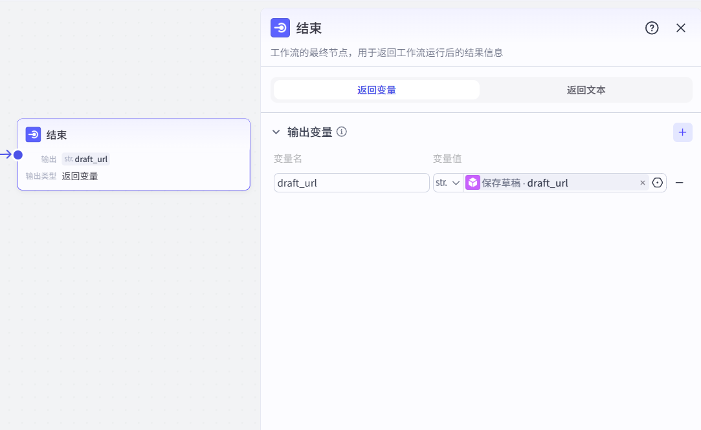

```python
输出
	draft_url：创建草稿的输出 draft_url
```


**最终工作流会生成一个视频草稿链接**

**这个链接需要使用剪映小助手--》下载下载**

**下载下来的操作--》需要在剪映软件中导出**

# 21 剪映安装配置

```python
# 1 剪映官方下载即可
# 2 软件中提供了
# 3  右上角齿轮---》全局设置--》配置草稿位置--》保存
```

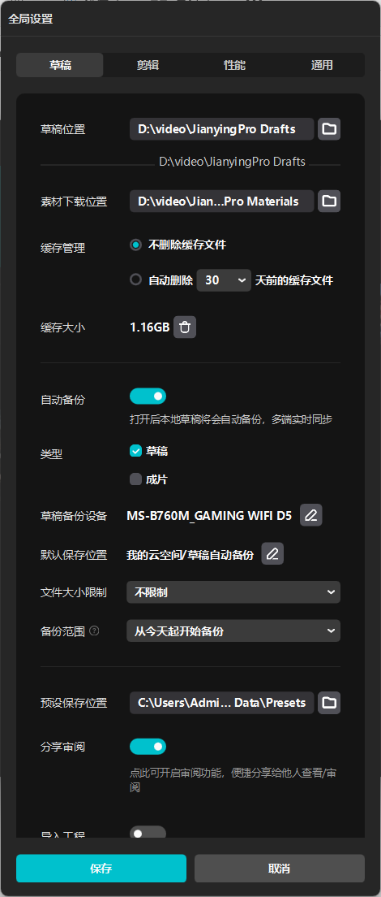

# 22 剪映小助手下载草稿

```python
# 1 从软件中获取--》安装到机器上，打开--》注册账号

# 2 配置剪映路径--》上面设置的剪映草稿路径

# 3 下载视频草稿

# 4 在剪映中看到草稿--双击打开，导出即可
```


