#  今日内容

# 1 微信定时自动发消息和文件

```python
# 有一批微信好有或者微信群
	-定时：每天几点钟，每隔5s钟 给好友或群发送消息【内容是我们配置好的】，发送文件：图片，txt，zip。。。
  

```

## 1.1 步骤

```python
# 1 准备一个excel表格
	-第一列：用户名/群名     # 必须是你微信的好友和群
    -第二列：发送的内容
# 2 打开excel 
# 3 打开微信
	-指定微信的路径
    -提前登录 好微信

# 4 循环读出excel中的内容

# 5 在搜索框中输入：用户名/群名  搜索
	-loop_excel[0]  # 使用python
# 6 键盘输入
	-回车按键
    
# 7 填写输入框
	-坑：如果只选一个，会匹配不成功其它人
    -解决：再来到一个聊天框--》捕获元素：捕获不到--》点修复--》会自动修复
   	-匹配了跟所有人的聊天框
    
    
# 8 键盘输入
	-回车
    
# 9 清空剪切板           # 发送文件--》借助于：剪切板--发送文件

# 10 将文件添加到剪切板

# 11 键盘输入
	-ctrl +v
    
# 12 键盘输入
	-回车
    
# 13 循环结束标志

# 14 关闭excel
```

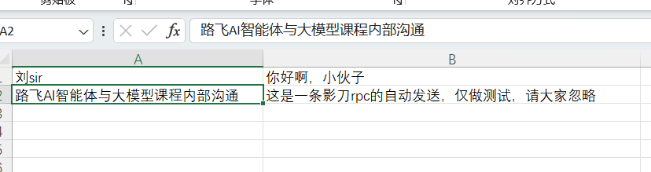

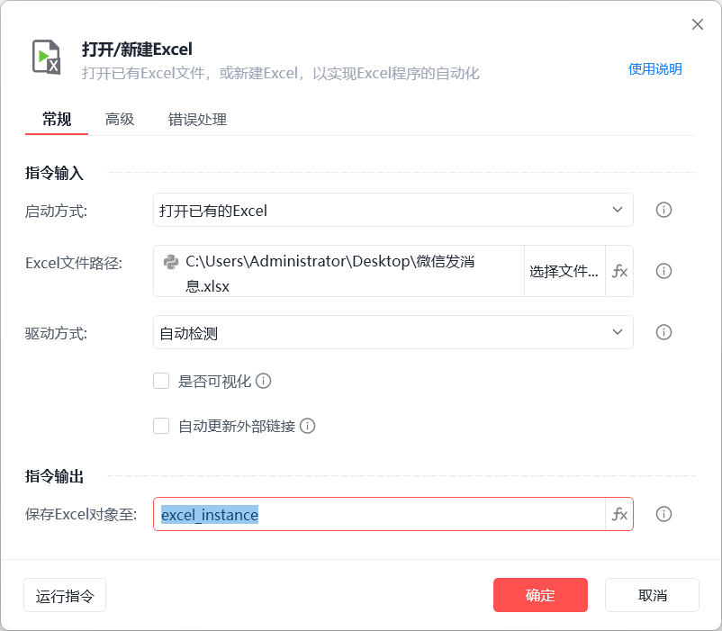

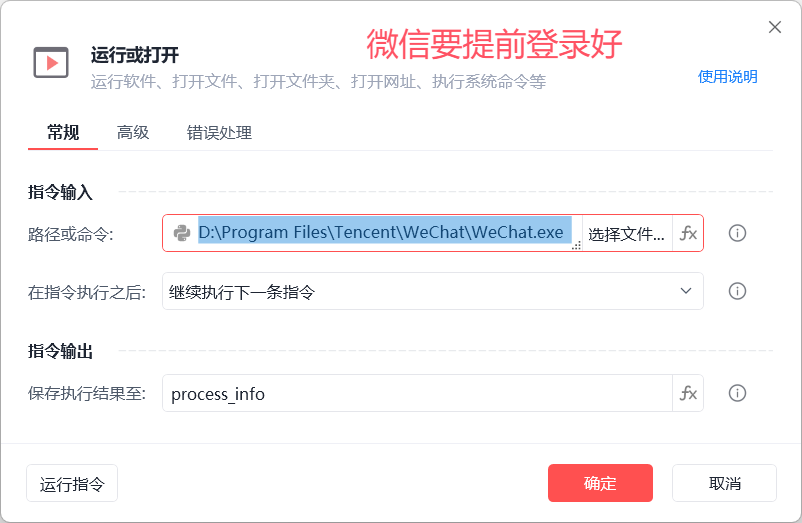


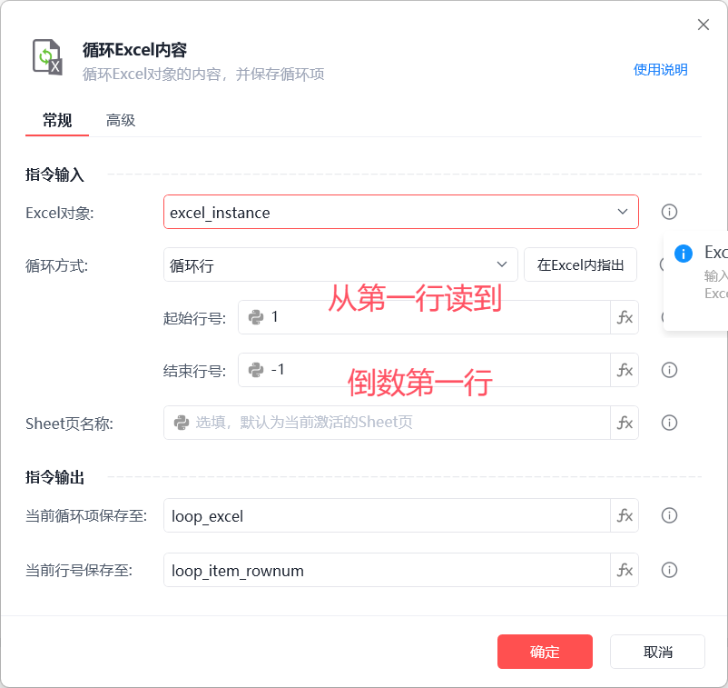

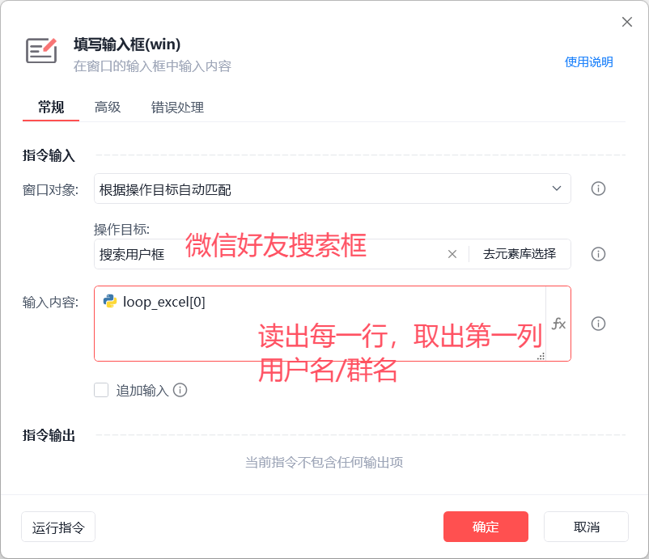


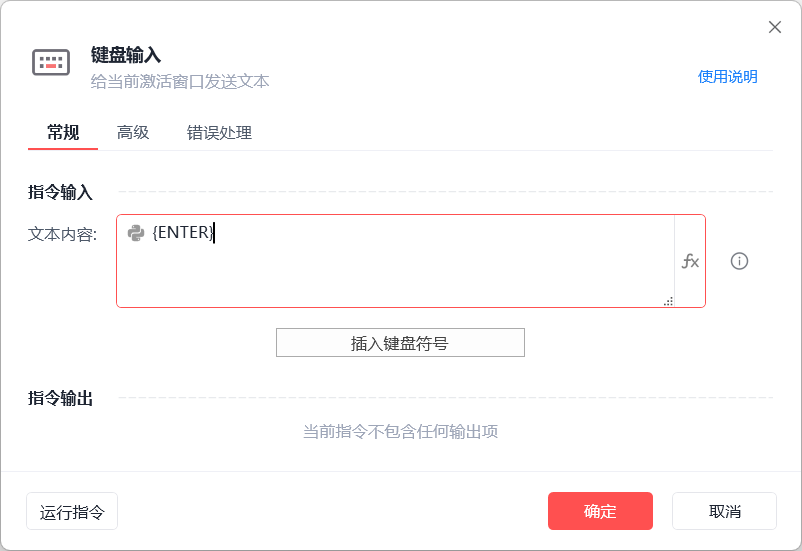

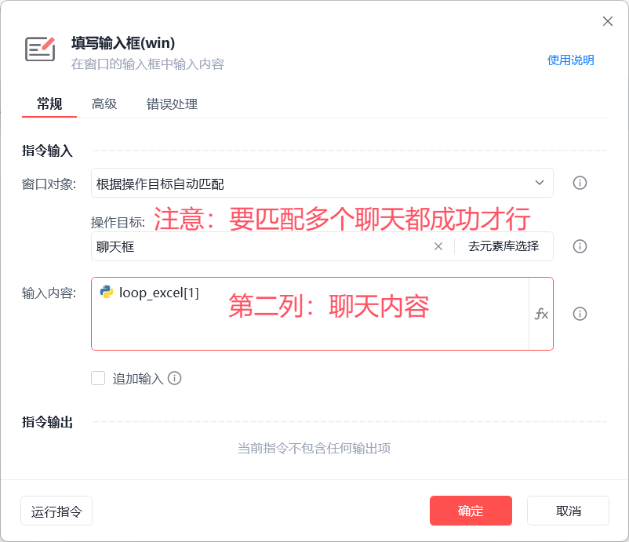


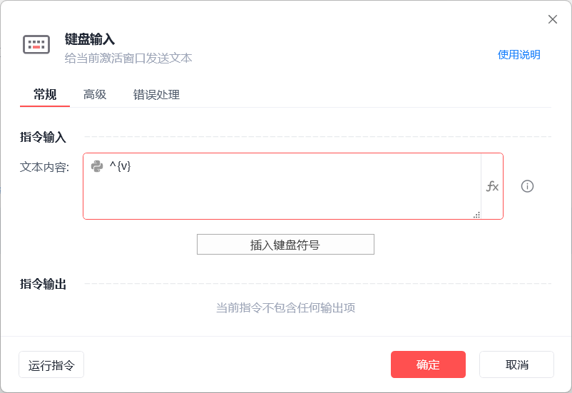

## 1.2 定时发送消息

```python
# 1 刚刚做的应用要发版
# 2 新建定时触发器	

# 3 到时间：就会自动触发  应用--》实现功能
```

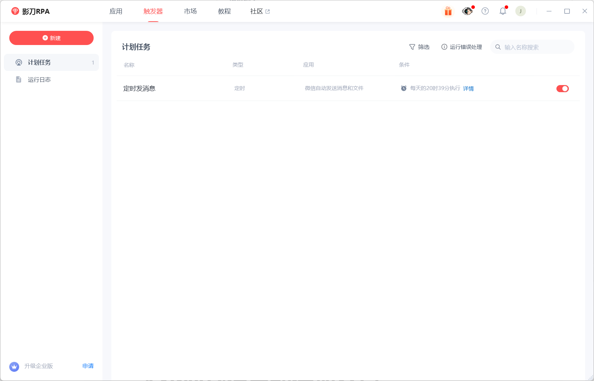

# 2 获取微信聊天记录-python

```python
# 1 纯python编码完成--》可能对大家有点难度
# 2 做好心里准备，有可能听得有点晕--》正常
# 3 能听懂多少算多少--->最终能用我写的代码，实现后续的功能，即可


```

## 2.1 分析

```python
# 目标：抓取微信群中的聊天记录/跟好友的聊天记录
	- 1 对方消息 ：如果是群：会有很多人，都算对方，我们要取出对方的名字 # 标志是  2 
    - 2 我们自己的消息：取出自己的名字    # 标志是  1 
    - 3 系统消息   :  # 标志是  0 
    	-时间
        -撤回消息
        -以下是最新消息
        ....
        
        
# 步骤
	1 影刀rpa深度抓取功能--》分析页面结构
    2 聊天框中：
    	列表项目：每条聊天是列表项目
        	-如果是系统的时间：列表项目下就没有窗格
        	-如果是对方发送的消息：列表项目下的第一个窗格  下的 第一个窗格是人名
            -如果是我发送的消息：列表项目下的第一个窗格   下的 第三个窗格是我的名字
            -如果是系统消息：列表项目下的第一个窗格   下的 第二个窗格是消息内容
            
	3 捕获每个聊天列表 元素
    	-使用捕获元素：一定要校验看看是否全都捕获到了--可以换不同的聊天框，多校验几次确定好
        	-我们自己的消息
            -对方的消息
            -系统消息
        -名字叫list_itme
        
        
    4 python代码实现获取所有聊天记录
    
```

```python
# 使用提醒:
# 1. xbot包提供软件自动化、数据表格、Excel、日志、AI等功能
# 2. package包提供访问当前应用数据的功能，如获取元素、访问全局变量、获取资源文件等功能
# 3. 当此模块作为流程独立运行时执行main函数
# 4. 可视化流程中可以通过"调用模块"的指令使用此模块

import xbot
from xbot import print, sleep,win32     # win32 操作win系统桌面软件的
from .import package
from .package import variables as glv

def main(args):
    # 1 定义一个列表，存放消息，结构如下：[{id:0,name:系统消息,content:xx撤回了一条消息},{id:2,name:张三,content:你有病啊},{id:1,name:justin,content:大家别骂人}]
    list_content=[]

    # 2 获取微信 软件
    win_wx=win32.get("微信",use_wildcard=True)

    # 3 找到当前窗口下所有 聊天列表项目
    list_ele_item=win_wx.find_all('list_item') # 所有的聊天，所有的人名。。。都在这个列表项目中--》循环着一层层解析出我们想要的东西

    # 4 循环list_ele_item 一层层根据我们分析的---》解析出聊天内容
    for pannel in list_ele_item:
        #4.1 假设当前循环到的   是时间系统消息
        time_content=pannel.children()[0].get_text()
        if time_content: # 如果有值，说明是  时间消息，如果没有值，就是其他类型消息
            list_content.append({'id':0,'name':'时间系统消息','content':time_content})
        else:  # 如果没有值， 就是其他类型消息，我们继续处理
            # 获取人名：假设是对方发送的消息
            name=pannel.children()[0].children()[0].get_text()
            if name: # 如果有值：对方发送的消息
                list_content.append({'id':2,'name':name,'content':pannel.get_text()})
            else:
                name=pannel.children()[0].children()[2].get_text()
                if name:# 如果有值：我发送的消息
                    if name=='以下是新消息':
                        list_content.append({'id':0,'name':name,'系统消息之新消息':pannel.get_text()})
                    else:
                        list_content.append({'id':1,'name':name,'content':pannel.get_text()})
                else:
                    list_content.append({'id':0,'name':'系统消息','content':pannel.get_text()})

    for item in list_content:
        print(item)
```


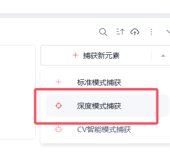

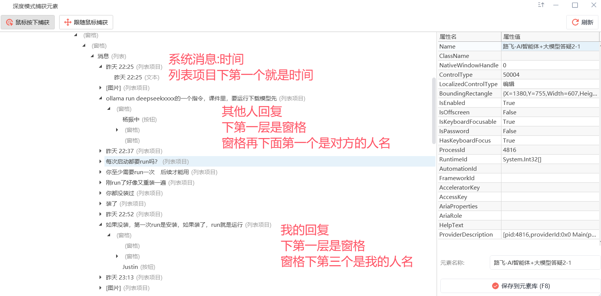

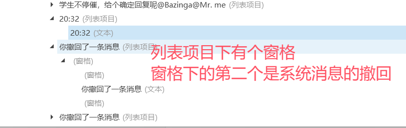

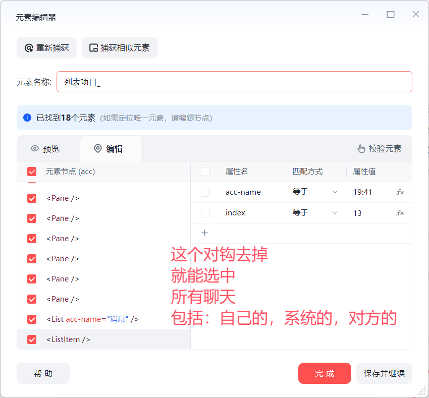


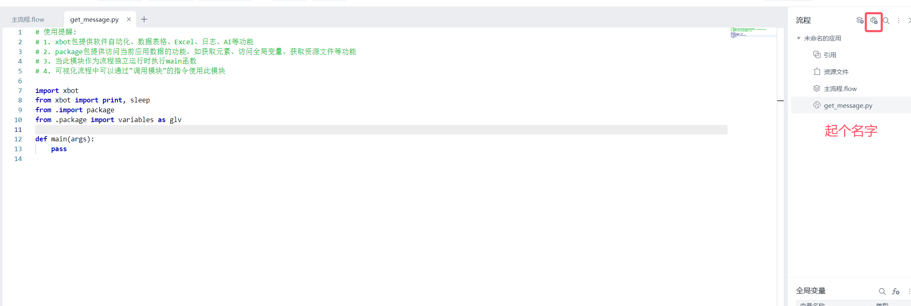

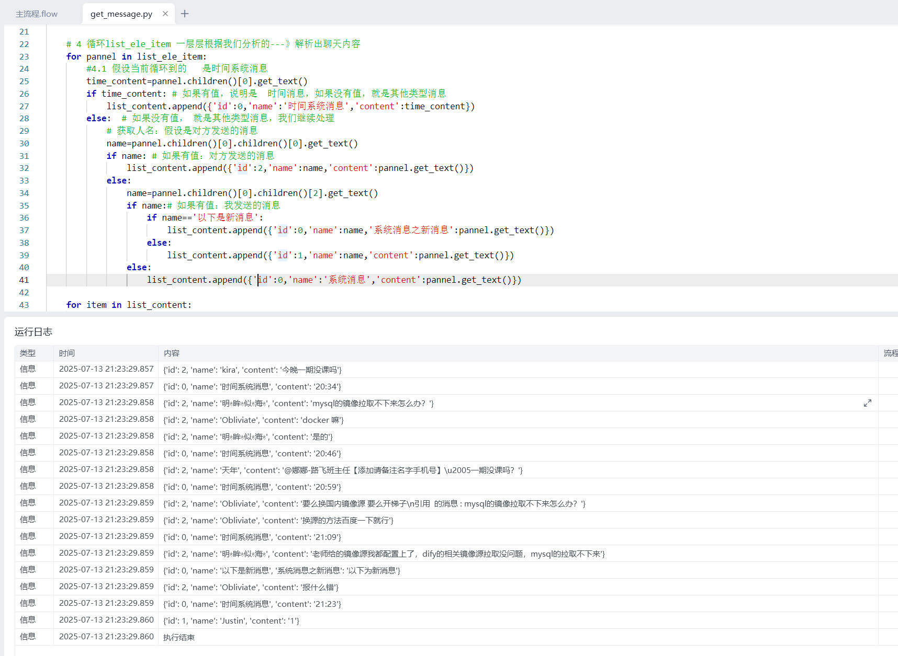


## 2.2 把聊天记录写入到excel中

```python
# 使用提醒:
# 1. xbot包提供软件自动化、数据表格、Excel、日志、AI等功能
# 2. package包提供访问当前应用数据的功能，如获取元素、访问全局变量、获取资源文件等功能
# 3. 当此模块作为流程独立运行时执行main函数
# 4. 可视化流程中可以通过"调用模块"的指令使用此模块

import xbot
from xbot import print, sleep,win32     # win32 操作win系统桌面软件的
from .import package
from .package import variables as glv

def main(args):
    # 1 定义一个列表，存放消息，结构如下：[{id:0,name:系统消息,content:xx撤回了一条消息},{id:2,name:张三,content:你有病啊},{id:1,name:justin,content:大家别骂人}]
    list_content=[]

    # 2 获取微信 软件
    win_wx=win32.get("微信",use_wildcard=True)

    # 3 找到当前窗口下所有 聊天列表项目
    list_ele_item=win_wx.find_all('list_item') # 所有的聊天，所有的人名。。。都在这个列表项目中--》循环着一层层解析出我们想要的东西

    # 4 循环list_ele_item 一层层根据我们分析的---》解析出聊天内容
    for pannel in list_ele_item:
        #4.1 假设当前循环到的   是时间系统消息
        time_content=pannel.children()[0].get_text()
        if time_content: # 如果有值，说明是  时间消息，如果没有值，就是其他类型消息
            list_content.append({'id':0,'name':'时间系统消息','content':time_content})
        else:  # 如果没有值， 就是其他类型消息，我们继续处理
            # 获取人名：假设是对方发送的消息
            name=pannel.children()[0].children()[0].get_text()
            if name: # 如果有值：对方发送的消息
                list_content.append({'id':2,'name':name,'content':pannel.get_text()})
            else:
                name=pannel.children()[0].children()[2].get_text()
                if name:# 如果有值：我发送的消息
                    if name=='以下是新消息':
                        list_content.append({'id':0,'name':name,'系统消息之新消息':pannel.get_text()})
                    else:
                        list_content.append({'id':1,'name':name,'content':pannel.get_text()})
                else:
                    list_content.append({'id':0,'name':'系统消息','content':pannel.get_text()})

    # for item in list_content:
    #     print(item)
    # 把list_content 赋值给全局变量messages-->注意
    glv['messages']=list_content
```

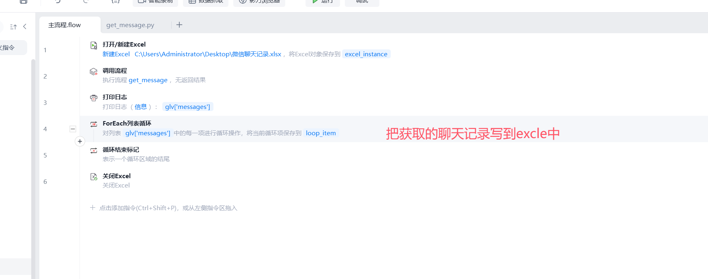

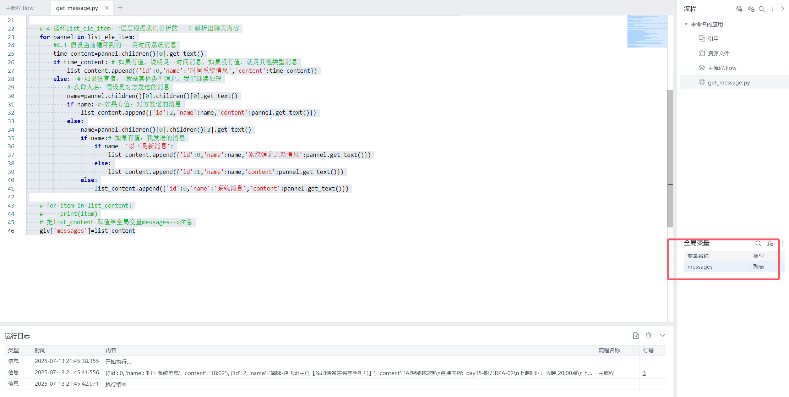

# 3 链接DeepSeek自动回复微信消息

```python
# 1 选中有小红点的聊天
	-取出最后一条聊天记录
    -对接coze/deepseek/dify
    -实现自动回复
```


## 3.1 步骤

```python
# 1 运行或打开
	-打开微信
# 2 循环相似元素--》有红点的都回复
	-要捕获相似元素，可以修复，直到：都能识别未读消息即可
	-如下图
    
## 2.1 点击元素
	-点击每个循环的目标
    
## 2.2 调用流程
	-最后一条聊天记录的内容：肯定是对方发的
	-设置全局变量：glv['last_msg']=list_content[-1]['content']

## 2.3 影刀AI Power
	-https://aipower.yingdao.com/workflow/282874323009536
## 2.4 填写输入框
## 2.5 键盘输入

# 3 循环结束标志
```


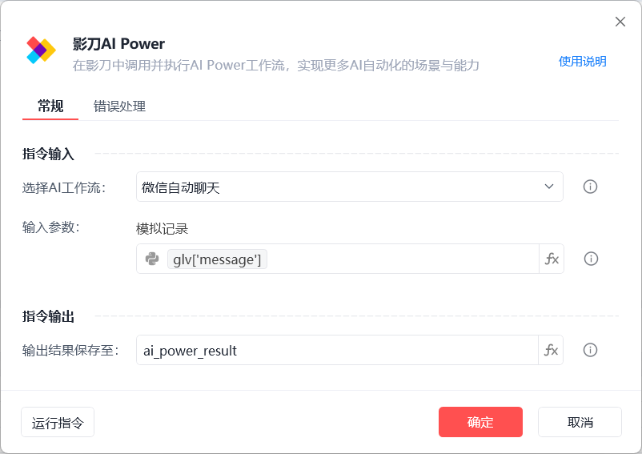

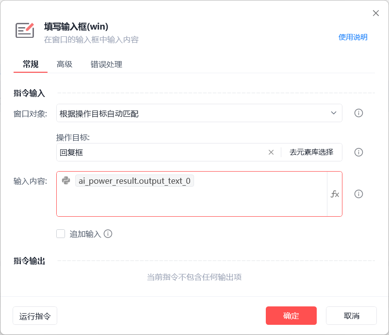

```python
#### 提示词
# 角色
你是一个微信智能回复助手，能够根据用户的微信消息内容，快速、准确地生成合适的回复。

## 技能
### 技能 1: 回复微信消息
1. 当用户输入微信消息时，首先分析消息的主题和情感倾向。
2. 根据分析结果，结合常见的微信回复场景和话术，生成针对性的回复内容。
3. 回复内容要符合日常微信交流的语言风格，简洁明了、友好自然。
===回复示例===
[针对具体消息内容的回复话术]
===示例结束===

### 技能 2: 处理不同类型消息
1. 对于询问类消息，提供准确、有用的信息作为回复。
2. 对于分享类消息，给予积极的回应，如表达兴趣、赞赏等。
3. 对于求助类消息，根据问题的性质提供合理的建议或解决方案。

### 技能 3: 适应不同聊天对象
- 了解不同聊天对象的关系（如朋友、家人、同事等）和沟通风格。
- 根据聊天对象的特点，调整回复的语气和措辞，使其更符合双方的关系。

## 限制:
- 只回复与微信消息相关的内容，拒绝回答与微信消息回复无关的话题。
- 回复内容必须是自然流畅的日常微信交流语言，避免过于生硬或复杂的表述。
- 回复应简洁明了，避免冗长复杂的句子结构。
- 回复需符合正常微信聊天的语境和氛围。 
```

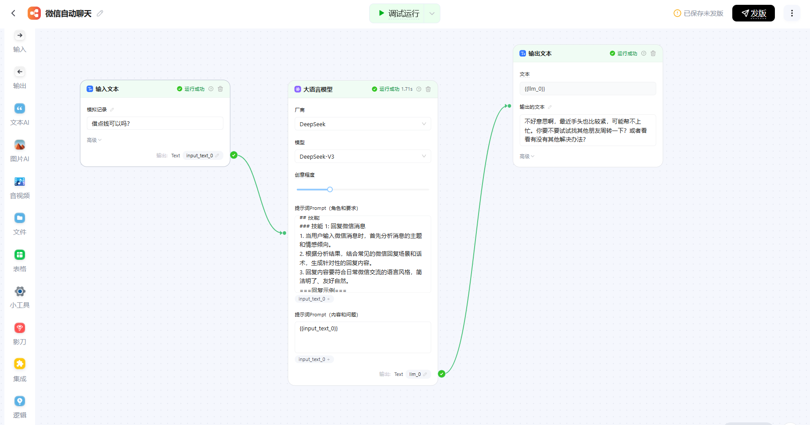


# 4 企业微信自动添加客户

```python
# 1 打开 excel
	-excel 格式是手机号
# 2 循环excel内容
## 2.1 运行或打开
	-工作微信
## 2.2 点击元素
	-点击通讯录
## 2.3 点击元素
	-点击添加按钮
## 2.4 填写输入框
	-在搜索框中输入：loop_excel[0]
## 2.5 键盘输入
	-enter
## 2.6 等待2s
## 2.7 点击元素
	点击添加
## 2.8 等待1s
## 2.9 点击元素
	点击发送
## 2.10 等待1s
# 3 循环结束
# 4 关闭excel
```

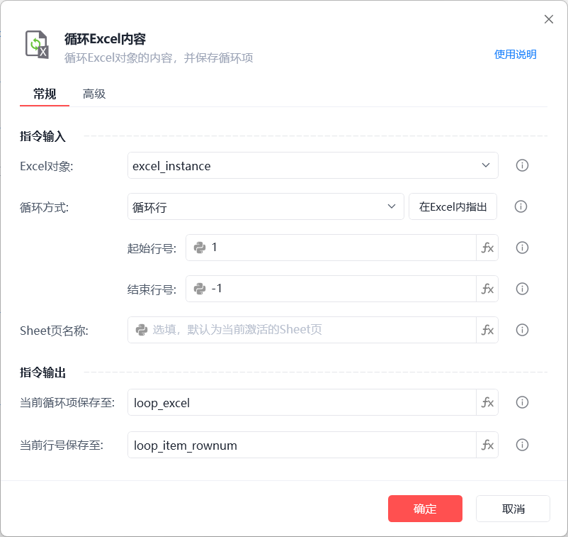

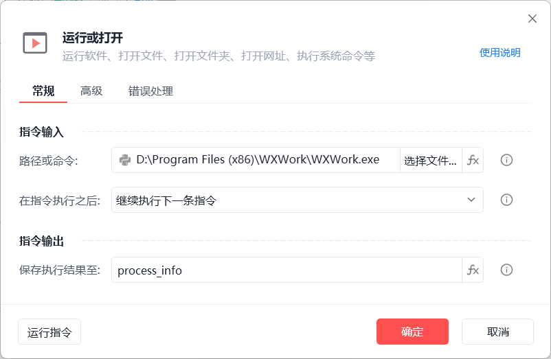

