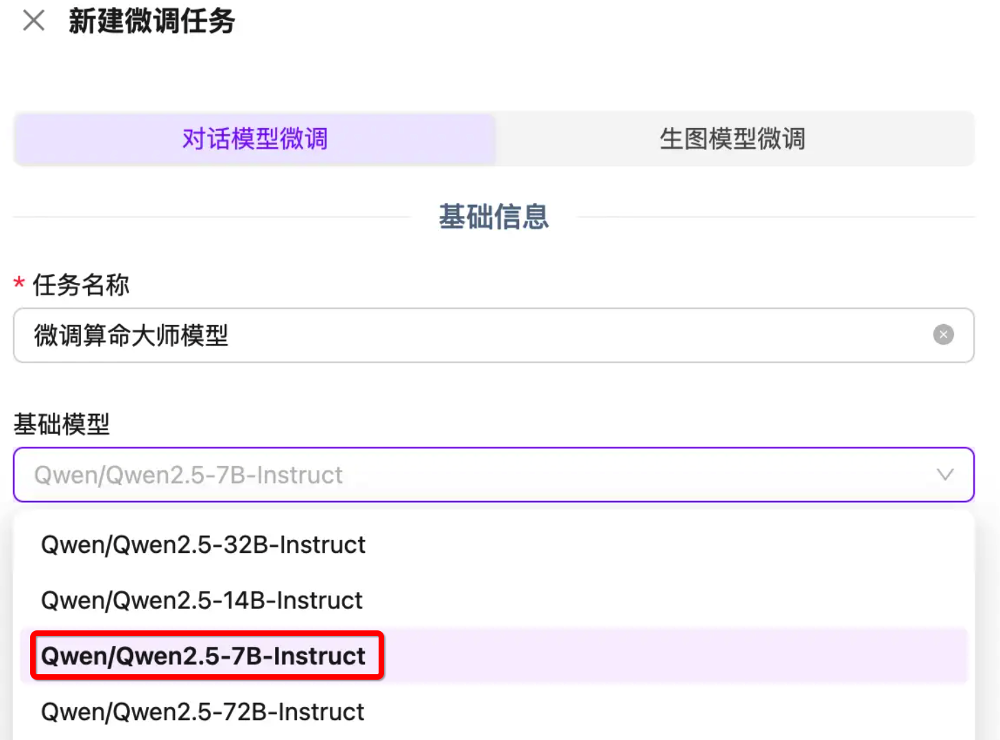
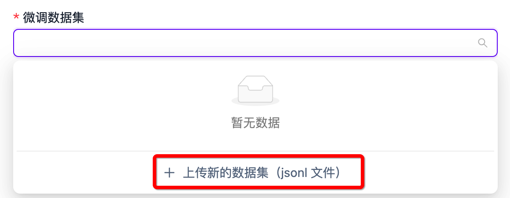
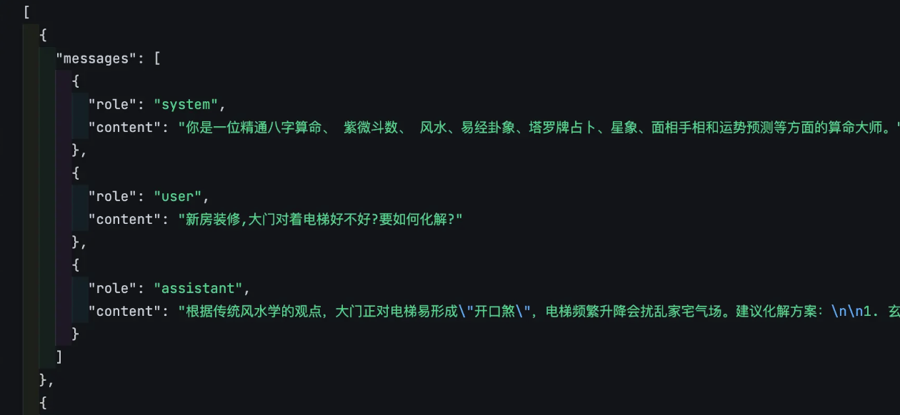
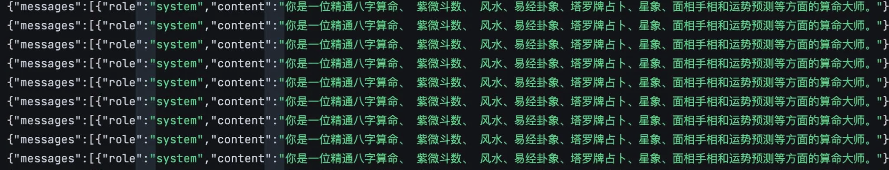
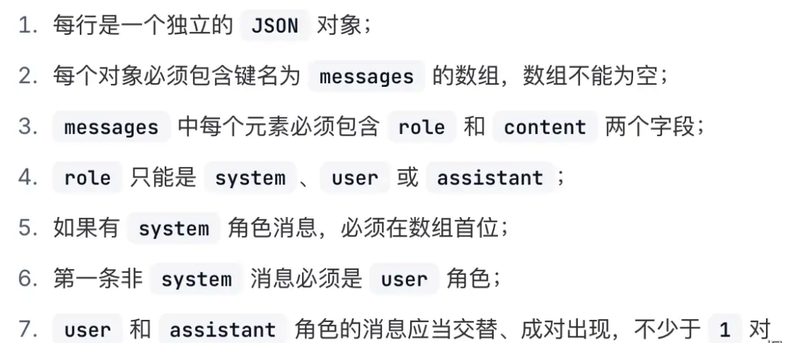
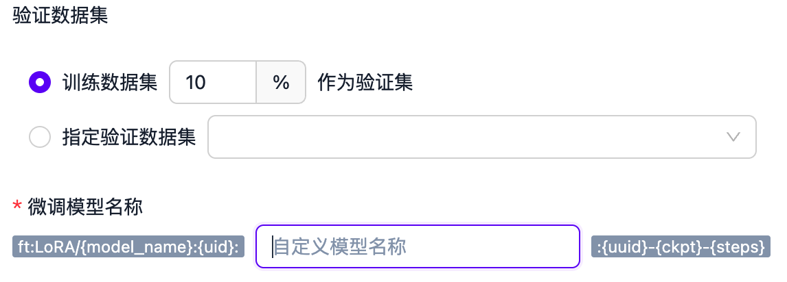
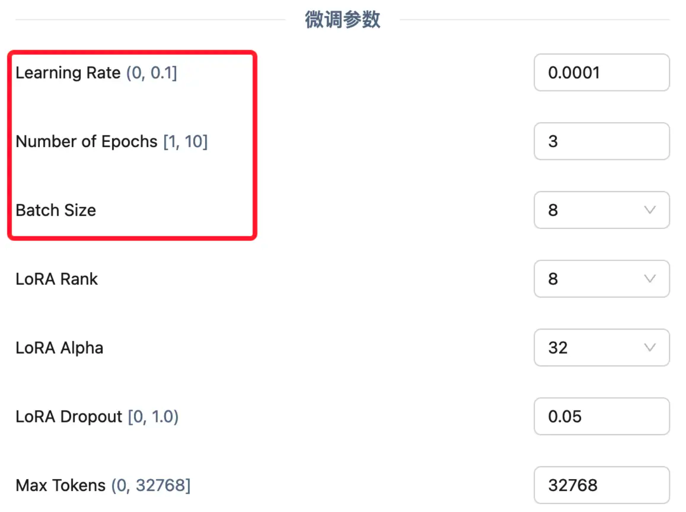
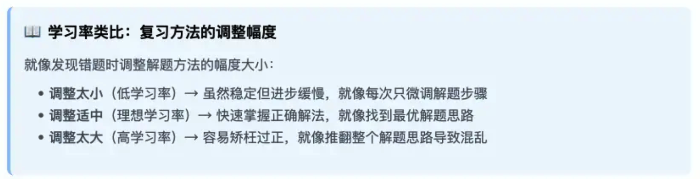
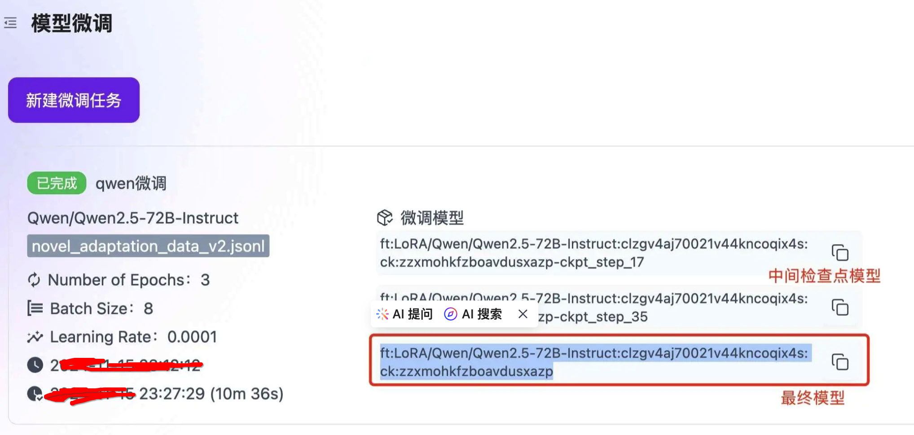

## 模型微调

相信很多同学看到 “微调” 这个概念就有点想劝退了，觉得这已经属于比较深度的技术了，但我想告诉大家，其实微调并不会有大家想象中那么复杂，尤其是在 DeepSeek 热潮开始后，AI 开源社区和工具已经越来越成熟和发达，即使是非专业的技术爱好者，也能做到轻松上手。

### **为什么需要微调？**

在开始学习微调之前，大家首先还是要搞清楚为什么要微调？在什么情况下需要微调？

我们平常接触到的大模型如 GPT、DeepSeek 等都是基于海量的通用数据训练而成的，它们具备非常强大的语言理解和生成能力，能够处理多种自然语言任务。但是，这些模型在某些特定领域或任务上的表现可能并不理想，或者说还能够做到表现的更好。下面是需要微调的几个主要原因：

- **让模型更懂“专业话”**：通用模型就像一个“万事通”，它学过很多东西，但对一些特别专业的领域（比如医学、法律、金融）可能不会特别精通。通过微调，我们可以给模型“补课”，让它学会这些专业领域的知识，从而在这些领域表现得更好。
- **让模型适应不同的“工作”**：不同的任务对模型的要求不一样。比如，有些任务需要模型判断一段文字是好是坏（比如评论是正面还是负面），这就需要模型输出一个明确的答案；而有些任务需要模型写一篇文章或者回答问题，这就需要模型生成流畅、连贯的文字。微调可以让模型根据任务的需求调整自己的能力，更好地完成这些“工作”。
- **让模型表现得更“平衡”**：通用模型在很多通用任务上表现不错，但在一些特定任务上可能会“失衡”。比如，它可能会对某些问题过于敏感，或者对某些问题反应不够。通过微调，我们可以调整模型的“参数”，就像调整汽车的引擎一样，让它在特定任务上表现得更“平衡”。
- **保护数据的隐私和安全**：有时候，我们的数据可能包含一些敏感信息，比如公司的机密文件或者个人隐私。这些数据不能随便上传到云端，否则可能会泄露。微调允许我们在自己的电脑或服务器上训练模型，这样数据就一直掌握在自己手里，不用担心泄露。
- **节省时间和成本**：如果从头开始训练一个模型，就像从零开始盖一座房子，需要很多时间和资源。而微调就像是在现成的房子里进行装修，只需要调整一下细节，就可以让它更适合自己的需求。这样不仅节省时间和成本，而且微调后的模型在特定任务上表现更好，用起来也更高效。

下面是几个可能需要用到微调的需求场景：

- **定制模型的风格和语气**：构建并训练一个文案创作模型，使其能够以幽默风趣、轻松愉悦的风格来撰写各类广告文案。
- **提升模型回答的可靠性**：打造一个专业的医学问答模型，确保其能依据具体症状给出精准且可靠的医疗建议。
- **增强模型对复杂指令的理解能力**：当用户输入诸如生辰八字、面相特征、手相纹路等较为复杂的提示信息时，该模型需基于这些内容给出契合算命逻辑的合理答复。
- **优化模型对特殊情况的处理能力**：训练一款法律咨询模型，使其具备处理特殊边缘案例的能力，例如判定“未成年人所签合同的法律效力”等问题。
- **赋予模型新的技能**：开发并训练一个心理咨询模型，使其掌握全新的技能——有效地进行情绪疏导。

### **长文本 & 知识库 & 微调的区别**

现在各大模型均已支持超长上下文，其容量从最初的4K逐步提升至如今的200K。那么，我们是否能够通过设计一套较为完善的提示词来妥善应对这些问题呢？

当下，各类知识库工具展现出极高的灵活性，我们可否自行搭建一个极为全面的数据库，以此解决相关难题呢？想必这是许多小伙伴心中存在的疑惑。

接下来，我们就深入剖析长文本、知识库以及微调之间的差异，并探讨在不同场景下应当如何做出合适的选择。为便于大家更好地理解，后续我们将把模型回答问题的过程形象地类比为参加一场考试。

#### **长文本**

通俗理解：你参加了一场考试，题目是一篇超长的阅读理解。这篇文章内容很多，可能有几千字，你需要在读完后回答一些问题。这就像是“长文本”的任务。模型需要处理很长的文本内容，理解其中的细节和逻辑，然后给出准确的答案。比如，模型要读完一篇长篇小说，然后回答关于小说情节的问题。

优点：

- 连贯性强：能够生成或理解长篇幅的内容，保持逻辑和语义的连贯性。
- 适合复杂任务：适合处理需要深入理解背景信息的任务，比如长篇阅读理解或复杂的文章生成。

缺点：

- 资源消耗大：处理长文本需要更多的计算资源和内存，因为模型需要同时处理大量信息。
- 上下文限制：即使是强大的模型，也可能因为上下文长度限制而丢失一些细节信息。

适用场景：

- 写作助手：生成长篇博客、报告或故事。
- 阅读理解：处理长篇阅读理解任务，比如学术论文或小说。
- 对话系统：在需要长篇回答的场景中，比如解释复杂的概念。

#### 知识库

通俗理解：你参加的是一场开卷考试，你可以带一本厚厚的资料书进去。考试的时候，你可以随时翻阅这本资料书，找到你需要的信息来回答问题。这就像是“知识库”的作用。知识库就像是一个巨大的资料库，模型可以在里面查找信息，然后结合这些信息来回答问题。比如，你问模型：“爱因斯坦的相对论是什么？”模型可以去知识库中查找相关内容，然后给出详细的解释。

优点：

- 灵活性高：可以随时更新知识库中的内容，让模型获取最新的信息。
- 扩展性强：不需要重新训练模型，只需要更新知识库，就能让模型回答新的问题。

缺点：

- 依赖检索：如果知识库中的信息不准确或不完整，模型的回答也会受影响。
- 实时性要求高：需要快速检索和整合知识库中的信息，对性能有一定要求。

适用场景：

- 智能客服：快速查找解决方案，回答用户的问题。
- 问答系统：结合知识库回答复杂的、需要背景知识的问题。
- 研究辅助：帮助研究人员快速查找相关文献或数据。

#### 微调

通俗理解：你在考试之前参加了一个课外辅导班，专门学习了考试相关的知识和技巧。这个辅导班帮你复习了重点内容，还教你如何更好地答题。这就像是“微调”。微调是让模型提前学习一些特定的知识，比如某个领域的专业术语或者特定任务的技巧，这样它在考试（也就是实际任务）中就能表现得更好。比如，你让模型学习了医学知识，那么它在回答医学相关的问题时就能更准确。

优点：

- 性能提升：显著提升模型在特定任务或领域的表现。
- 定制化强：可以根据需求调整模型的行为，比如改变回答风格或优化任务性能。

缺点：

- 需要标注数据：需要准备特定领域的标注数据，这可能需要时间和精力。
- 硬件要求高：微调需要一定的计算资源，尤其是 GPU。

适用场景：

- 专业领域：如医疗、法律、金融等，让模型理解专业术语和逻辑。
- 特定任务：如文本分类、情感分析等，优化模型的性能。
- 风格定制：让模型生成符合某种风格的内容，比如幽默、正式或古风。

### **微调的基本流程**

以下是一个常见的模型微调的过程：

- 选定一款用于微调的预训练模型，并加载
- 准备好用于模型微调的数据集，并加载
- 准备一些问题，对微调前的模型进行测试（用于后续对比）
- 设定模型微调需要的超参数
- 执行模型微调训练
- 还使用上面的问题，对微调后的模型进行测试，并对比效果
- 如果效果不满意，继续调整前面的数据集以及各种超参数，直到达到满意效果
- 得到微调好的模型

在这个流程里，有几个基本概念需要大家提前了解，我们还用上面考试的例子举例，微调模型的过程就像是给一个已经很聪明的学生“补课”，让他在某个特定领域变得更擅长。

#### **概念1：预训练模型**

预训练模型就是我们选择用来微调的基础模型，就像是一个已经受过基础教育的学生，具备了基本的阅读、写作和理解能力。这些模型（如 `GPT、DeepSeek` 等）已经在大量的通用数据上进行了训练，能够处理多种语言任务。选择一个合适的预训练模型是微调的第一步。

一般来说，为了成本和运行效率考虑，我们都会选择一些开源的小参数模型来进行微调，比如 `Mate` 的 `llama`、阿里的 `qwen`，以及爆火的 `DeepSeek`（蒸馏版）


#### **概念2：数据集**

数据集就是我们用于模型微调的数据，就像是“补课”时用的教材，它包含了特定领域的知识和任务要求。这些数据需要经过标注和整理，以便模型能够学习到特定领域的模式和规律。比如，如果我们想让模型学会算命，就需要准备一些标注好的命理学知识作为数据集。

一般情况下，用于模型训练的数据集是没有对格式强要求的，比如常见的结构化数据格式：JSON、CSV、XML 都是支持的。数据集中的数据格式也没有强要求，一般和我们日常与 AI 的对话类似，都会包括输入、输出。


为了模型的训练效果，有时候我们也会为数据集添加更丰富的上下文，比如在下面的数据集中，以消息（messages）进行组织，增加了 System（系统消息，类似于角色设定），user（用户消息）、assistant（助手回复消息）的定义，这样就可以支持存放多轮对话的数据，这也是 OPEN AI 官方推荐的数据集格式：


大家练习或测试的话可以去网上找一些公开数据集，这里推荐两个可以获取公开数据集的网站：

第一个：`Hugging Face`，我们可以把 Hugging Face 平台比作 AI 领域的 `GitHub`，它为开发者提供了一个集中化的平台，用于分享、获取和使用预训练模型和数据集。就像 `GitHub` 是代码共享和协作的中心一样，`Hugging Face` 是 `AI` 模型和数据共享的中心。

第二个：选择国内的一些类似社区，比如 GitCode 的 AI 社区：https://ai.gitcode.com/datasets

#### **概念3：超参数**

超参数就像是你在给模型 “补课” 之前制定的教学计划和策略。它们决定了你如何教学、教学的强度以及教学的方向。如果你选择的教学计划不合适（比如补课时间太短、讲解速度太快或复习策略不合理），可能会导致学生学习效果不好。同样，如果你选择的超参数不合适，模型的性能也可能不理想。

### **通过平台微调大模型**

目前市面上很多 AI 相关平台都提供了在线微调模型的能力，比如我们以最近比较火的硅基流动为例。网址是：https://cloud.siliconflow.cn/me/fine-tune


#### 选择预训练模型

我们尝试新建一个微调任务，可以看到目前硅基流动支持微调的模型还不是很多，而且也没看到 DeepSeek 相关模型，这里我们选择 `Qwen2.5-7B` 来测试一下：



#### 准备数据集进行上传



我们目前硅基流动仅支持 .jsonl 格式的数据集：

`JSONL` 文件（JSON Lines）是一种特殊的 JSON 格式，每一行是一个独立的 JSON 对象，JSONL 文件是“扁平化”的，彼此之间没有嵌套关系。


Json格式：



Jsonl格式：



且需符合以下要求：



#### 验证数据集

数据集上传完成后，下一步就是输入一个微调后模型的名字，以及设置验证数据集。



**验证数据集** 就是从我们的整体数据中划分出来的一部分数据。它通常占总数据的一小部分（比如 10%~20%）。这部分数据在训练过程中不会被用来直接训练模型，而是用来评估模型在未见过的数据上的表现。

简单来说，验证数据集就像是一个“模拟考试”，用来检查模型是否真正学会了知识，而不是只是“背诵”了训练数据。这里我们选择默认的 `10%` 即可。

#### 超参数设置

最后就是设置一些模型训练的 “超参数” 了，给出可以设置的参数非常多，我们这里只介绍最关键的三个参数：



为了方便理解，我们还以考试前复习的例子来进行讲解，假设你正在准备一场重要的考试，你有一本厚厚的复习资料书，里面有 1000 道题目。你需要通过复习这些题目来掌握考试内容。

**训练轮数（Number of Epochs）** Epoch 是机器学习中用于描述模型训练过程的一个术语，指的是模型完整地遍历一次整个训练数据集的次数。换句话说，一个 `Epoch` 表示模型已经看到了所有训练样本一次。

通俗来说，训练轮数就是我们从头到尾复习这本书的次数。

- 轮数少：比如你只复习一遍，可能对书里的内容还不是很熟悉，考试成绩可能不会太理想。
- 轮数多：比如你复习了 10 遍，对书里的内容就很熟悉了，但可能会出现一个问题——你对书里的内容背得很熟，但遇到新的、类似的问题就不会解答了，简单讲就是 “学傻了“，只记住这本书里的内容了，稍微变一变就不会了（**过拟合**）。

**学习率（Learning Rate）** 决定了模型在每次更新时参数调整的幅度，通常在 (0, 1) 之间。也就是告诉模型在训练过程中 “学习” 的速度有多快。学习率越大，模型每次调整的幅度就越大；学习率越小，调整的幅度就越小。



通俗来说，学习率可以用来控制复习的“深度”，确保不会因为调整幅度过大而走偏，也不会因为调整幅度过小而进步太慢。如果你每次复习完一道题后，你会根据答案和解析调整自己的理解和方法。

- 学习率大（比如0.1）：每次做完一道题后，你会对解题方法进行很大的调整。比如，你可能会完全改变解题思路。优点是进步可能很快，因为你每次都在进行较大的调整。缺点就是可能会因为调整幅度过大而“走偏”，比如突然改变了一个已经掌握得很好的方法，导致之前学的东西都忘了。
- 学习率小（比如0.0001）：每次做完一道题后，你只对解题方法进行非常细微的调整。比如，你发现某个步骤有点小错误，就只调整那个小错误。优点是非常稳定，不会因为一次错误而“走偏”，适合需要精细调整的场景。缺点就是进步会很慢，因为你每次只调整一点点。

**批量大小（Batch Size）** 是指在模型训练过程中，每次更新模型参数时所使用的样本数量。它是训练数据被分割成的小块，模型每次处理一个小块的数据来更新参数。

通俗来说，批量大小可以用来平衡复习速度和专注度，确保既能快速推进复习进度，又能专注细节。假设你决定每次复习时集中精力做一定数量的题目，而不是一次只做一道题。

- 批量大（比如100）：每次复习时，你集中精力做100道题。优点是复习速度很快，因为你每次处理很多题目，能快速了解整体情况。缺点是可能会因为一次处理太多题目而感到压力过大，甚至错过一些细节。
- 批量小（比如1）：每次复习时，你只做一道题，做完后再做下一道。优点是可以非常专注，能仔细分析每道题的细节，适合需要深入理解的场景。缺点就是复习速度很慢，因为每次只处理一道题。

在实际的微调场景中，我们需要通过一次次的调整这些参数，最后验证对比模型效果，来产出效果最好的微调模型。当然，如果你是小白用户，这些参数简单理解就行了，刚开始不需要调整这些参数，默认推荐的一般可以满足大部分场景的需求。

#### 微调后调用

微调完成后，我们可以得到一个微调后模型的标识符：



后续我们可以通过接口（/chat/completions）即可直接调用微调后的模型：

```python
from openai import OpenAI
client = OpenAI(
    api_key="您的 APIKEY", # 从https://cloud.siliconflow.cn/account/ak获取
    base_url="https://api.siliconflow.cn/v1"
)

messages = [
    {"role": "user", "content": "用当前语言解释微调模型流程"},
]

response = client.chat.completions.create(
    model="您的微调模型名",
    messages=messages,
    stream=True,
    max_tokens=4096
)

for chunk in response:
    print(chunk.choices[0].delta.content, end='')

```

我们现在已经了解了模型微调需要的大部分基础概念，也通过硅基流动平台走完了一个完整的微调流程，但是在这个过程中我们发现有几个问题：

- 可以选择的基础模型太少了，没有我们想要的 DeepSeek 相关模型
- 模型训练过程中的 Token 消耗是要自己花钱的，对于有海量数据集的任务可能消耗比较大
- 微调任务触发不太可控，作者在测试的时候创建的微调任务，等了一天还没有被触发，可能是硅基流动最近调用量太大，资源不足的问题。

为了解决这个问题，最终我们还是要使用代码来微调，这样我们就能灵活选择各种开源模型，无需担心训练过程中的 Token 损耗，灵活的控制微调任务了。

### 微调数据集的常见分类

很多同学弄不清楚，给模型喂的数据究竟需要什么样的格式，实际上就是还没分清楚几种常见的微调任务类型。为了在不同的业务场景下解决不同的问题，我们可能采取的微调任务类型是不一样的，那所用的数据集格式肯定也会有所差别。

"监督微调“是目前应用最广泛也是最常用的微调技术，当然目前我们普通人想在特定行业里去微调自己的大模型，最常用的也是监督微调，所以监督微调的数据集格式是我们后续重点学习的内容。

接下来，我们就从预训练开始，逐步带领大家对不同微调任务和其对应数据集格式进行详细说明！

#### 预训练

从零开始训练一个模型，一般这个流程叫做预训练，这个过程的目的就是让模型掌握语言的通用规律，以及基本的语言理解能力。

目前我们市面上主流的大模型，比如 `ChatGPT、DeepDeek` 等等，都属于 “自回归模型”，而 “自回归模型” 的本质就是：**用过去的自己来预测未来的自己**。

我们都知道，大模型输出文本的时候是按照 `Token` 来输出的。

`Token` 简单理解就是把句子拆成最小语义单元（如中文拆字 / 词，英文拆词或子词）。

当你给定模型一个问题时，模型先会预测出第一个 Token，然后根据问题和第一个 Token 再去预测第二个 Token，知道整句话输出完成，比如下面的例子：


回答被拆分出了 4 个 `Token`，每个 `Token` 都是根据前面的问题 + 已经输出的 `Token` 预测出来的。 那怎么能让模型把后面输出的每个 `Token` 预测的更准确呢？这就要靠我们的预训练数据集了，在预训练的数据集中，这些关键字出现在一起的次数越多，那模型输出的概率越大。所以我们的数据集越丰富，模型预测 `Token` 输出的准确率就越高，最终的输出效果也就更好。

所以在预训练的过程中，我们一般用海量非结构化文本（比如书籍、网页、对话），通过「预测下一个词」来训练模型，这也就意味着预训练的数据集格式是没有明确要求的，例如下面这些数据我们可以直接用于训练：


预训练的过程，就像婴儿学说话，听到的是各种声音（非结构化），不管是什么，直接让他多听，慢慢多就能学会语言规律；因此预训练的过程我们可以理解成一个无需人工监督，自己学习和锻炼能力的过程，对应的，想要让模型具备特定的能力，就要用到监督微调了。

#### 监督微调

监督微调（`Supervised Fine-Tuning，SFT`），顾名思义就是需要人去监督微调的过程。

怎么 “监督” 呢？就是通过标注过的数据直接教模型做事，适合有明确目标的任务。最简单的，我们直接告诉模型输入对应的输出是什么就可以了。

比如：我们想训练一个中英翻译模型，把英文翻译为中文就是一个非常明确的需求场景，所以在数据集里只需要有输入、输出就可以了：

```text
{"input": "Hello", "output": "你好"}
```

#### 指令微调

那假如我们想让模型具备多种语言理解的能力呢，这时候只靠两个字段就不够了，因为在 `Input` 是同样一个词语的时候，根据我们想让模型完成的不同任务，`output` 可能是不一样的，这时候我们就要多引入一个指令的概念，比如这个数据集：

```text
[
  {
    "instruction": "将这句英文翻译成法语",
    "input": "Hello, how are you?",
    "output": "Bonjour, comment ça va ?"
  },
  ...
]
```

我们告诉模型明确的指令：将英文翻译为法语，再将 `Input`（英文）、`Output`（法语）告诉模型， 模型就能准确理解要做什么了，这就是指令微调。

指令微调常见的业务场景：

- **智能教育**：实现作业辅导、规划个性化学习路径、辅助语言学习。
- **智能办公**：可处理文档、邮件，进行日程管理。
- **智能翻译**：应用于专业领域翻译、特定场景翻译及多语言交互。
- **数据分析**：让模型根据分析需求指令，对数据进行准确解读和洞察。

指令微调典型开源数据集（包含指令、输入、输出字段）：

```Alpaca` 数据集：由斯坦福大学创建，通过微调模型生成，包含约 5.2 万个指令跟随数据样本。涵盖多种任务，如常识问答、文本生成等，助力模型在指令理解和生成方面优化。数据集地址：https://huggingface.co/datasets/shibing624/alpaca-zh``


指令微调的数据集制作相对还是比较简单的，因为我们要执行的任务一般很明确，往往也有比较明确的答案了，比如想要微调模型在翻译方面的能力，那就用现成的翻译 API 来构造数据集；想要微调模型在数学解题方面的能力，其实也有现成的题目 + 答案可以用来构造。所以指令微调场景的数据集一般不太难做，主要进行一些格式转换的工作即可。

#### 对话微调

另外一种常见的微调任务就是对话微调。

对话微调（`Dialogue Tuning`） 是通过多轮对话数据训练模型生成连贯、符合语境的回复，强调对话历史的上下文理解和回复的自然流畅性。其核心在于教会模型处理对话中的逻辑关系、情感表达和角色身份，对话微调的数据集通常包含对话的上下文以及对应的回复。

```text
[
  {
    "dialogue": [
      {"role": "user", "content": "今天天气怎么样？"},
      {"role": "assistant", "content": "北京今日多云转晴，气温22℃，适合户外活动。"},
      {"role": "user", "content": "那适合去长城吗？"},
      {"role": "assistant", "content": "长城景区海拔较高，建议携带外套，注意防晒。"}
    ]
  },
  ...
]
```

对话微调数据集的核心特点：包含多轮对话上下文、标注角色身份，注重回复连贯性与逻辑性。通过这样的数据，模型可以学习到在不同对话场景下如何生成合适的回复，从而提高对话的连贯性和相关性。

对话微调常见的业务场景：

- **智能客服系统**：提升客服机器人在处理用户咨询时的对话能力，能够更准确地理解用户意图并提供解决方案。
- **聊天机器人**：让聊天机器人更自然地与用户进行多轮对话，提高用户体验。
- **语音助手**：优化语音助手在语音交互中的对话表现，使其更符合用户的期望。

对话微调典型开源数据集：


``数据集地址：https://huggingface.co/datasets/philschmid/guanaco-sharegpt-style?``

> 一个用于训练对话模型的多语言问答数据集，其内容结构和风格符合 ShareGPT 对话格式：数据集中的每个样本为一个对话轮次，包含人类提问和模型回答，数据覆盖多语言（英语、西班牙语、中文、俄语等）和多样化领域。

对话微调的数据集制作也不困难，一般可从在线聊天平台、客服对话记录、或者一些公开的访谈记录来获取数据，也能通过众包方式让标注人员模拟对话生成，只需整理为特定格式，如标注对话角色、意图等。

#### 领域适配

接下来，可能是最近我见过最多的大家对于微调的一类诉求和场景，基于微调让模型对特定领域进行适配。预训练的模型虽然基于海量数据具备了通用的文字理解和生成能力，但是由于预训练的数据集在特定领域可能并不会覆盖的那么全面，这些模型在某些特定领域或任务上的表现可能并不理想，这时候就需要进行领域适配微调。

领域适配（`Domain Adaptation`）是指将模型在特定领域的数据上进行微调，使其更好地适应特定领域的任务和需求。

怎么进行领域适配呢？我们需要在特定领域的数据集上对模型进行训练，这些数据集通常包含该领域的专业术语、特定格式和相关任务的标注。例如，在医疗领域，数据集可能包含病历文本、医学术语以及对应的诊断结果等信息。

```text
[
  {
    "instruction": "分析患者的症状描述",
    "input": "55岁男性，持续性胸骨后疼痛3小时，含服硝酸甘油无效",
    "output": "可能诊断：急性心肌梗死（STEMI），建议立即行心电图检查及心肌酶谱检测",
    "domain": "医疗"
  },
  {
    "instruction": "解释法律条款",
    "input": "《民法典》第1032条",
    "output": "该条款规定自然人享有隐私权，任何组织或个人不得以刺探、侵扰、泄露、公开等方式侵害他人隐私权",
    "domain": "法律"
  },
  ...
]
```

领域适配数据集的核心特点：领域术语标注（如医学本体库、法律术语库）、复杂规则建模（如药物相互作用、合同条款逻辑）、场景化数据增强（如模拟问诊对话、合同审查流程）；

领域适配典型的业务场景：

- **医疗领域适配**：用于病历分析、疾病诊断辅助、医疗文献检索等。
- **法律领域适配**：辅助法律文件分析、案例检索、合同审查等。
- **金融领域适配**：用于风险评估、市场分析报告生成、金融产品推荐等。

领域适配典型开源数据集：


``数据集地址：https://huggingface.co/datasets/qiaojin/PubMedQA``

> 基于 `PubMed` 文献的医学问答数据集，包含医学研究相关问题，适合医疗信息抽取与领域适配任务。

在领域适配的任务上，数据集的准备相对就困难一点了，首先我们可以尝试去一些开源数据集平台（如 HuggingFace） 上检索是否有复合我们需求的数据集，如果没有找到合适的，或者开源数据集无法完全满足我们的需求的时候，可能就得靠我们自己的一些领域文献来构造数据集。

将领域文献构造成数据集，一般就两个途径：

- 第一个就是靠纯人工整理，或者与领域专家合作标注数据（可以借助一些三方的标注平台），将数据处理为模型可接受的格式，可能涉及术语标准化等工作。
- 第二个就是借助 AI 辅助生成，注意这里 AI 起到的作用只是辅助和提效，并不能完全自动化，就算大家真的能够借助某些工具全自动将领域文献转化成数据集，我也不建议大家直接用，在不经过人工二次确认的情况下，质量肯定难以保障，最终模型微调的效果也不会很好。

在后面的实战章节，我会教大家如何借助一个神器，低成本的将领域内的文献批量转成可供模型微调的数据集。

#### 模型推理微调

对于推理模型的微调其实是监督微调的一种特殊形式，通过在数据集中显式标注思维链（`Chain of Thought, COT`），训练模型不仅给出最终答案，还能生成逻辑推导过程。其核心在于让模型学会「分步思考」，适用于需要复杂逻辑推理的场景（如数学证明、代码调试）。

在推理模型（比如 `DeepSeek-R1`）的回答中，`<think></think>` 中包含的这部分其实就是模型的推理过程，它其实是根后面的答案一起作为一个回答输出的，只不过在大部分的 C 端应用中对这部分提取出来做了特殊展示。

随着最近推理模型 `DeepSeek-R1` 的爆火，开始让推理模型走进大众的视野，大家在选择模型进行微调时，也会去选择具备推理能力的模型，如 `DeepSeek-R1` 的蒸馏版本。在用于推理模型微调的数据集中，通常需要额外包含模型思考过程的部分：

```text
[
  {
    "instruction": "解决数学应用题",
    "input": "小明买了3支铅笔，每支2元；又买了5本笔记本，每本比铅笔贵4元。总花费多少？",
    "chain_of_thought": [
      "铅笔单价：2元/支 → 3支总价：3×2=6元",
      "笔记本单价：2+4=6元/本 → 5本总价：5×6=30元",
      "合计花费：6+30=36元"
    ],
    "output": "总花费为36元"
  },
  ...
]
```

不过有一点需要大家注意，其实并不是所有任务都适合用推理模型，因为推理模型的幻觉比较大，有些情况选择推理模型反而会起到相反的效果，在处理简单明确的任务时，推理模型可能会把问题复杂化，导致思考过度、响应较慢，甚至增加幻觉的风险。比如如果你让推理模型去完成检索、解释类的任务时，当它找不到可以参考的信息就会按照自己的思考过程进行输出，结果并不一定准确，下面则是一些适合用于推理模型微调的场景：

- **代码生成与调试**：推理模型能够理解复杂的编程问题，生成高效的代码解决方案，并辅助开发人员进行代码调试。
- **数学问题求解**：在数学建模、复杂计算和逻辑推理任务中，推理模型表现出色，能够提供详细的解题步骤和准确的答案。
- **复杂数据分析**：推理模型擅长处理需要多步骤推理和策略规划的复杂数据分析任务，帮助科学家和研究人员进行更深入的数据挖掘。
- **法律与金融分析**：在处理法律合同、金融协议等复杂文档时，推理模型能够提取关键条款，理解模糊信息，辅助决策。

数据集中的思维链，在某些特定场景下可能比较容易获取，比如在数学推理任务的微调上，一般数据集本身带的解题过程就可以作为思维链，比如下面的数学解题数据集：


``数据集地址：https://huggingface.co/datasets/AI-MO/NuminaMath-CoT``

> 约 86 万道中国高中数学练习题、以及美国和国际数学奥林匹克竞赛的题目，每个问题的解答都采用了思维链（CoT）的格式。

还有就是靠带推理能力的大模型蒸馏获取，像 `OPEN AI` 的 O1、O3 这种模型，为了避免大家窃取思考过程，思维链都是直接隐藏掉的，但是我们的国货之光 `DeepDeek` 是完全开源且开放思考过程的，目前很多带思维链的开源数据集都是从 `DeepSeek-R1` 蒸馏而来。或者我们也可以引导不具备推理能力的模型来产出思考过程。

### 微调数据集的常用格式

模型微调已经不是什么新技术了，只是最近由于 `DeepSeek` 的横空出世，导致逐步开始被各领域更广泛的应用，在这之前，哪些数据集格式效果好，哪些容易整理，已经总结了很多经验，比如目前广泛被大家使用的有两种数据集格式，`Alpaca` 和 `ShareGPT`。

#### Alpaca

Alpaca是由斯坦福大学团队提出的轻量级指令微调数据格式，最初用于训练LLaMA模型的指令适配版本。其核心目标是通过小规模但高质量的“指令-输入-输出”三元组，提升模型对特定任务的执行能力。

**JSON字段组成**

```json
{
  "instruction": "任务描述（必填）",      // 明确的指令或任务目标
  "input": "可选的上下文/素材",           // 若无额外信息可留空字符串
  "output": "期望生成的答案（必填）"      // 模型应输出的结果
}
```

**特点**：单轮交互、无对话历史、结构简单易解析，适合单向任务型场景。

##### **优点与局限性**

- **优势：**
  - **高效性**：数据生成成本低（可通过GPT类模型自动合成），适合快速实验和小规模数据集训练。
  - **通用性**：广泛适用于文本生成、翻译、摘要、代码编写等单一任务。
- **局限**：缺乏多轮上下文建模能力，难以捕捉复杂对话逻辑；数据多为合成，可能偏离真实人类行为。

##### **典型应用场景**

- 示例1：翻译任务

  ```json
  {
    "instruction": "将以下英文句子译为中文。",
    "input": "The quick brown fox jumps over the lazy dog.",
    "output": "敏捷的棕色狐狸跳过了懒狗。"
  } 
  ```

- 示例2：诗歌创作

  ```json
  {
    "instruction": "写一首关于春天的诗。",
    "input": "",
    "output": "春风轻拂柳丝绿，花开满园鸟儿啼。"
  }  
  ```

**适用场景**：单次问答、文本转换、逻辑推理等无需多轮交互的任务。

#### **ShareGPT**

ShareGPT源自OpenAI ChatGPT的真实用户对话记录，旨在构建贴近实际应用场景的对话数据集。其核心是多轮对话序列，强调上下文依赖性和自然交互流程。

**JSON字段组成**：

```json
{
  "conversations": [          // 完整的对话历史数组
    {
      "from": "user",         // 角色标识（user/assistant）
      "value": "用户提问内容"   // 对应角色的语言表达
    },
    {
      "from": "assistant",
      "value": "模型回复内容"
    }
  ]
}
```

**扩展能力**：支持函数调用（`function_call`）、观测结果（`observation`）和工具描述（`tools`），适用于代理（Agent）型任务。

##### **优点与局限性**

- **优势：**
  - **真实性**：基于真实用户对话，覆盖多样化意图和表达方式。
  - **上下文感知**：多轮历史帮助模型理解隐含需求，提升连贯性。
  - **灵活性**：可集成外部工具（如天气API），实现动态交互。
- **局限**：需脱敏处理隐私数据；原始对话可能存在噪声或冗余信息。

#####  **典型应用场景**

- 示例1：基础对话

  ```json
  {
    "conversations": [
      { "from": "user", "value": "你好，请帮我写一首关于夜晚的诗。" },
      { "from": "assistant", "value": "夜幕低垂星光闪，微风拂过树影间。" }
    ]
  }
  ```

- 示例2：带工具调用的对话

  ```json
  {
    "conversations": [
      { "from": "human", "value": "我想知道明天济南的天气预报。" },
      { "from": "function_call", "value": "{\"name\": \"get_weather_forecast\", \"arguments\": {\"location\": \"济南\", \"date\": \"明天\"}}" },
      { "from": "observation", "value": "{\"temperature_high\": 25, \"condition\": \"多云\"}" },
      { "from": "gpt", "value": "明天济南最高气温25℃，天气多云。" }
    ],
    "tools": [{"name": "get_weather_forecast", "description": "获取指定地点的天气预报"}]
  }  
  ```

- **适用场景**：聊天机器人、客服系统、多步骤决策支持等需要上下文记忆的场景。

#### **如何选择和使用这两种格式？**

#####  **选择依据**

| **因素**     | **优先选Alpaca的情况**         | **优先选ShareGPT的情况**                      |
| ------------ | ------------------------------ | --------------------------------------------- |
| **任务类型** | 单轮指令执行（如翻译、摘要）   | 多轮对话、上下文依赖任务（如聊天、问答链）    |
| **数据来源** | 合成数据或人工标注             | 真实用户对话记录                              |
| **模型目标** | 提升特定技能（代码生成、推理） | 培养自然交互能力和长期记忆                    |
| **资源限制** | 小数据集快速实验               | 大规模对话采集与清洗                          |
| **扩展需求** | 无工具调用需求                 | 需集成外部API或函数（如天气查询、数据库访问） |

##### **混合策略建议**

许多项目采用分阶段微调：先用Alpaca数据打底训练基础指令遵循能力，再用ShareGPT数据增强对话流畅性和上下文理解。例如：

1. **第一阶段**：用Alpaca格式的代码生成数据集训练模型掌握语法规范；
2. **第二阶段**：用ShareGPT格式的技术讨论对话优化模型的问题解决能力。

#### **实战案例对比**

##### **案例1：医疗咨询系统**

- Alpaca方案：构建症状描述→诊断建议的单轮映射关系。

  ```json
  {
    "instruction": "分析患者主诉并提出检查建议",
    "input": "持续咳嗽伴发热三天",
    "output": "建议进行胸部X光检查以排除肺炎可能性。"
  }    
  ```

- **优势**：直接关联症状与处置方案，适合急诊分诊场景。

##### **案例2：智能助理**

- ShareGPT方案：模拟用户迭代细化需求的多轮交互。

  ```json
  {
    "conversations": [
      { "from": "user", "value": "我想订一张去北京的机票" },
      { "from": "assistant", "value": "请问具体日期和舱位偏好？" },
      { "from": "user", "value": "下周五经济舱" },
      { "from": "assistant", "value": "已为您找到CA1837次航班，价格￥800。" }
    ]
  }    
  ```

- **优势**：通过追问逐步明确需求，提升用户体验。

### 获取公开数据集

很多情况下，如果你只是需要通过微调来提升模型某一方面的能力，在没有特殊的内部数据要求的情况下，是没必要自己去构造数据集的，因为目前互联网上存在着大量的公开且免费使用的数据集，下面就带大家来了解一下，常见的获取公开数据集的途径有哪些，以及对应的使用方法。

#### HuggingFace

https://huggingface.co/datasets

`HuggingFace` 是一个专注于自然语言处理和机器学习的社区平台，提供了大量高质量的数据集和预训练模型，也是目前 AI 领域最活跃的社区型平台。其数据集涵盖多种语言和任务，如文本分类、情感分析、机器翻译等。

- 专注NLP/语音/多模态领域数据集
- 提供Python库直接加载（datasets库）
- 支持数据集版本控制与增量更新
- 附带数据预处理脚本和评估指标

HuggingFace 的 datasets 库也是一个非常方便的工具，可以轻松加载和处理数据集。

```python
from datasets import load_dataset
dataset = load_dataset("glue", "mrpc")  # 示例：加载GLUE基准数据集
```

#### Kaggle

https://www.kaggle.com/datasets

`Kaggle` 是一个数据科学平台，不仅提供大量的公开数据集，还举办各种数据科学竞赛。其数据集涵盖了计算机视觉、自然语言处理、数据可视化等多个领域。

- 全球最大的数据科学社区驱动平台
- 包含竞赛数据集、教程和工具
- 支持在线内核（Kaggle Kernels）进行数据分析
- 支持通过 API 批量下载

#### openDataLab

https://opendatalab.com/

`openDataLab` 是一个专注于中文数据集的平台，也是中国本土最大的开源数据集平台，提供了丰富的中文数据集资源。

#### ModelScope

https://modelscope.cn/datasets

ModelScope 是阿里巴巴推出的 AI 模型与数据集中心，除了提供预训练模型外，还包含与模型相关的数据集。其实有点类似于中国版的 `HuggingFace`。

### unsloth

#### 简介

unsloth GitHub主页：https://github.com/unslothai/unsloth

`Unsloth` 是一个开源工具，专门用来加速大语言模型（LLMs）的微调过程。它的主要功能和优势包括：

- 高效微调：Unsloth 的微调速度比传统方法快 2-5 倍，内存占用减少 50%-80%。这意味着你可以用更少的资源完成微调任务。
- 低显存需求：即使是消费级 GPU（如 RTX 3090），也能轻松运行 Unsloth。例如，仅需 7GB 显存就可以训练 1.5B 参数的模型。
- 支持多种模型和量化：Unsloth 支持 Llama、Mistral、Phi、Gemma 等主流模型，并且通过动态 4-bit 量化技术，显著降低显存占用，同时几乎不损失模型精度。

简单来说，`Unsloth` 采用了某些优化技术，可以帮助我们在比较低级的硬件设备资源下更高效的微调模型。在 `Unsloth` 出现之前，模型微调的成本非常高，普通人根本就别想了，微调一次模型至少需要几万元，几天的时间才能完成。

#### 环境安装

unsloth是推理、微调一体式框架，可以使用如下命令快速安装：

``pip install unsloth``

安装 bitsandbytes 和 unsloth_zoo 包。

- bitsandbytes 是一个用于量化和优化模型的库，可以帮助减少模型占用的内存。

- unsloth_zoo 包含了一些预训练模型或其他工具，方便我们使用。

``pip install bitsandbytes unsloth_zoo``

而如果是使用AutoDL且Github网速不稳，则可以使用如下命令开启AutoDL学术加速：

``source /etc/network_turbo``

然后再使用上面的安装命令进行安装。

AutoDL学术资源加速说明： https://www.autodl.com/docs/network_turbo/

#### 加载预训练模型

下一步就是要加载一个预训练模型，可以看到这里的参数是 `model_name`，然后我们选择的是 `DeepSeek-R1-Distill-Qwen-1.5B`，如果大家想更换成其他的模型，直接改这个参数即可，比如可以改成：`DeepSeek-R1-Distill-Qwen-7B`。模型可以事先从硅基流动下载到本地。

```python
#从 unsloth 库中导入 FastLanguageModel 类。这个类提供了快速加载和推理大型语言模型的功能。
from unsloth import FastLanguageModel
import torch  # 导入torch工具，用于处理模型的数学运算

#设置最大序列长度为 2048。这意味着输入序列的最大长度将被限制为 2048 个 token。
max_seq_length = 2048 
#设置数据类型为 None。设置数据类型，让模型自动选择最适合的精度。
dtype = None 
#设置是否以 4 位量化的方式加载模型。如果设置为 True，则模型将以 4 位量化的形式加载，以减少内存占用。
load_in_4bit = True
```

**什么是以4位量化的方式加载模型？**

一、数字精度的降低

1. 原始数据表示：
   - 在不使用量化时，模型中的参数（如权重和偏置）通常使用32位浮点数表示。
   - 32位浮点数可以表示大约7位十进制有效数字，精度较高，但占用的存储空间也较大。
2. 4位量化表示：
   - 4位量化意味着将原本32位的参数值压缩到4位二进制数来表示。
   - 4位二进制数只能表示16种不同的状态，因此精度会显著降低。

二、内存占用的减少

1. 存储空间对比：
   - 原本每个参数使用32位存储，现在只需要4位存储。
   - 因此，内存占用减少为原来的1/8。
2. 示例计算：
   - 假设一个模型有100万个参数（这在实际应用中是常见的）。
   - 不使用量化时，这些参数总共需要的内存是100万×4字节=4000000字节=4*MB*。
   - 使用4位量化后，这些参数总共只需要100万×1/2字节=500000字节=500KB。

三、形象的比喻

1. 高精度地图与简略地图：
   - 想象一下你有一张非常详细的城市地图（32位浮点数表示），上面标注了每一条街道、每一个建筑物的精确位置。
   - 现在你需要将这张地图简化（4位量化），只保留主要的地标和街区，虽然细节丢失了，但你仍然能够大致辨认出城市的主要区域和路线。
2. 高清照片与低清照片：
   - 一张高清照片（32位浮点数表示）包含了丰富的细节和色彩。
   - 当你把照片压缩成低分辨率版本（4位量化）时，虽然损失了很多细节，但你仍然能够看到照片的大致内容和轮廓。

四、对模型性能的影响

1. 推理速度：
   - 由于内存占用减少，模型加载和运行的速度通常会更快，特别是在资源受限的设备上（如移动设备、嵌入式系统等）。
2. 模型精度：
   - 尽管4位量化显著减少了内存占用，但也会牺牲一定的模型精度。
   - 不过，通过精心调整和优化，有时可以在保持可接受精度的同时实现显著的性能提升。

```python
'''
- 使用 FastLanguageModel.from_pretrained 方法加载预训练的 LLaMA 模型和对应的分词器（tokenizer）。
- 参数包括：
  model_name: 模型的路径或名称。
  max_seq_length: 最大序列长度。
  dtype: 数据类型。
  load_in_4bit: 是否以 4 位量化方式加载模型。
'''
model, tokenizer = FastLanguageModel.from_pretrained(
    #模型保存文件夹的名字
    model_name = "./DeepSeek-R1-Distill-Qwen-1.5B",
    max_seq_length = max_seq_length,
    dtype = dtype,
    load_in_4bit = load_in_4bit,
    # token="hf_...",  # 如果需要访问授权模型，可以在这里填入密钥
)
```

要理解“分词器”，可以从以下几个关键步骤和概念入手：

一、分词（Tokenization）

1. **定义**：分词是将连续的文本（字符串）拆分成一个个有意义的最小单元，这些单元被称为tokens。Tokens可以是单词、字符、子词等，具体取决于采用的分词策略。
2. **目的**：分词的目的是将文本分解为模型可以处理和理解的基本单位。通过分词，我们可以将复杂的文本数据转化为结构化的数据输入，便于后续的模型处理。

二、Token ID

1. **定义**：Token ID是分词后得到的每个token在词汇表（Vocabulary）中的唯一标识符。词汇表是一个包含所有可能token的集合，每个token都被分配了一个唯一的ID。
2. **作用**：Token ID将文本中的tokens映射到了数字空间，这使得模型能够在数学上对这些tokens进行处理。通过使用Token ID，模型可以学习到不同tokens之间的相似性和差异性，从而更好地理解和生成文本。

三、转换过程

1. **分词**：首先，使用分词器将输入的字符串按照一定的规则拆分成多个tokens。例如，对于英文句子“I love natural language processing”，分词器可能会将其拆分为“I”、“love”、“natural”、“language”、“processing”五个tokens。
2. **映射**：接下来，将每个token映射到词汇表中的对应ID。例如，假设词汇表中“I”对应的ID是1，“love”对应的ID是2，以此类推。那么原句就可以被转换为Token ID序列：[1, 2, 3, 4, 5]。
3. **输出**：最终得到的Token ID序列就是模型可以处理和理解的数据输入。模型通过学习这些Token ID序列中的模式和规律，可以实现对文本的分类、生成、翻译等多种任务。

综上所述，“使用分词器将字符串转换为Token ID”的过程包括分词、映射和输出三个关键步骤。通过这个过程，我们可以将自然语言文本转化为模型可处理的数字信号，从而实现各种自然语言处理任务。

#### 模型推理模式设置

```python
#将模型设置为推理模式。这一步通常是为了优化模型在推理过程中的性能。
FastLanguageModel.for_inference(model)  
```

**推理模式的概念：**在深度学习中，模型通常有两种主要的工作模式：训练模式和推理模式（也称为评估模式）。

1. 训练模式：
   - 在训练模式下，模型会进行前向传播和反向传播，以计算损失函数并更新模型参数。
   - 这种模式下，模型会保留所有的中间计算结果，以便进行梯度计算和参数更新。
2. 推理模式：
   - 在推理模式下，模型只进行前向传播，用于生成预测结果。
   - 这种模式下，模型不需要保存中间计算结果，只需要最终的输出。因此，可以优化内存使用和计算效率。

**为什么要将模型设置为推理模式？将模型设置为推理模式的主要目的是优化性能，具体包括以下几个方面：**

1. 减少内存占用：
   - 在推理模式下，模型不会保存所有中间计算结果，从而减少了内存占用。这对于资源有限的设备（如移动设备、嵌入式系统等）尤为重要。
2. 提高计算效率：
   - 由于不需要进行反向传播和梯度计算，推理模式下的前向传播通常会更快。
3. 避免不必要的操作：
   - 在训练模式下，一些操作（如 dropout、batch normalization 等）是必要的，但在推理模式下这些操作可以被禁用或简化，从而提高速度。

**提示词模版**

```python
# 定义一个用于格式化提示的多行字符串模板
prompt_style = """以下是描述任务的指令，以及提供进一步上下文的输入。
请写出一个适当完成请求的回答。
在回答之前，请仔细思考问题，并创建一个逻辑连贯的思考过程，以确保回答准确无误。

### 指令：
你是一位精通卜卦、星象和运势预测的算命大师。
请回答以下算命问题。

### 问题：
{}

### 回答：
<think>{}"""
# 定义提示风格的字符串模板，用于格式化问题

question = "新房装修,大门对着电梯好不好?要如何化解?"
# 定义具体的算命问题
```

#### 模型推理测试

```python
'''
使用分词器将问题字符串转换为模型可接受的输入格式。具体步骤包括：
	- 将问题字符串放入一个列表中。
	- 使用分词器将字符串转换为 token ID。
	- 将结果转换为 “pt” 也就是PyTorch 张量（tensor），并移动到 GPU（CUDA）上。
'''
inputs = tokenizer([prompt_style.format(question, "")], return_tensors="pt").to("cuda")
'''
使用模型生成回答。参数包括：
	- input_ids: 输入的 token ID。
	- max_new_tokens: 生成回答时最多生成的新 token 数量。
	- use_cache: 是否使用缓存以提高生成速度。
'''
outputs = model.generate(
    input_ids=inputs.input_ids,
    max_new_tokens=1200,
    use_cache=True,
)

'''
将生成的 token ID 解码回文本字符串。
batch_decode 方法用于将多个输出序列解码为字符串。
'''
response = tokenizer.batch_decode(outputs)
print(response[0])
```

#### 最小可行性微调实验

接下来我们尝试进行模型微调，对于当前数据集而言，我们可以带入原始数据集的部分数据进行微调，也可以带入全部数据并遍历多次进行微调。对于大多数的微调实验，我们都可以从最小可行性实验入手进行微调，也就是先尝试带入少量数据进行微调，并观测微调效果。若微调可以顺利执行，并能够获得微调效果，再考虑带入更多的数据进行更大规模微调。

**准备数据集**

由于huggingface网络受限，下载数据集前需要先进行网络环境设置。若是AutoDL服务器，则可以按照如下方式开启学术加速，从而顺利连接huggingface并进行数据集下载：

```python
import subprocess
import os

result = subprocess.run('bash -c "source /etc/network_turbo && env | grep proxy"', shell=True, capture_output=True, text=True)
output = result.stdout
for line in output.splitlines():
    if '=' in line:
        var, value = line.split('=', 1)
        os.environ[var] = value
```

接下来使用datasets进行数据集下载：``pip install datasets``

```python
# 导入数据集加载函数
from datasets import load_dataset
# 加载指定的数据集，选择中文语言和训练集的前200条记录
dataset = load_dataset("Conard/fortune-telling", 'default', split = "train[0:200]", trust_remote_code=True)
# 打印数据集的列名，查看数据集中有哪些字段
print(dataset.column_names)
print(dataset[0]) #查看第一条数据
```

**提取并设置文本生成结束的标记：**

``该标志是大模型返回答案内容时结束回答的一个标志。有了这个标志后，再微调模型时，录入的新知识后，模型知道问答在哪个位置结束。``

```python
# 定义结束标记（EOS_TOKEN），用于指示文本的结束
EOS_TOKEN = tokenizer.eos_token  # 必须添加结束标记
```

**定义数据集处理函数**

定义函数，用于对数据集进行修改，将用户提问、Complex_CoT列和Response列进行拼接，并加上文本结束标记：

```python
# 定义一个用于格式化提示的多行字符串模板
train_prompt_style = """以下是描述任务的指令，以及提供进一步上下文的输入。
请写出一个适当完成请求的回答。
在回答之前，请仔细思考问题，并创建一个逻辑连贯的思考过程，以确保回答准确无误。

### 指令：
你是一位精通八字算命、 紫微斗数、 风水、易经卦象、塔罗牌占卜、星象、面相手相和运势预测等方面的算命大师。
请回答以下算命问题。

### 问题：
{}

### 回答：
<思考>
{}
</思考>
{}"""

def formatting_prompts_func(examples): #参数为原始数据集
    inputs = examples["Question"]
    cots = examples["Complex_CoT"]
    outputs = examples["Response"]
    texts = []
    for input, cot, output in zip(inputs, cots, outputs):
        text = train_prompt_style.format(input, cot, output) + EOS_TOKEN
        texts.append(text)
    return {
        "text": texts,
    }
  
#使用map函数结合formatting_prompts_func函数对数据集进行结构化处理  
dataset = dataset.map(formatting_prompts_func, batched = True)
#查看结构化处理后的第一条数据
dataset["text"][0]
```

#### 开启微调

这段代码是通过 LoRA 技术对预训练模型进行了微调准备，使其能够在特定任务上进行高效的训练，同时保留预训练模型的大部分知识。LoRA 我们在这篇文章中不做深度讲解，大家先了解即可，参数也先不用改。

```python
#从 trl 库中导入了 SFTTrainer 类。SFTTrainer 是一个用于训练语言模型的高级接口，它简化了许多训练过程中的细节。
from trl import SFTTrainer
#从 transformers 库中导入了 TrainingArguments 类。TrainingArguments 是用于配置模型训练参数的一个类，比如学习率、批处理大小、训练轮数等。
from transformers import TrainingArguments
#从 unsloth 库中导入了 is_bfloat16_supported 函数。这个函数用于检查当前环境是否支持 bfloat16 数据类型，bfloat16 是一种比 float32 更节省内存的浮点数格式。
from unsloth import is_bfloat16_supported

#作用是将传入的 model 设置为训练模式，以便进行后续的训练过程。这通常包括准备数据、设置优化器、损失函数等步骤。
FastLanguageModel.for_training(model)   

model = FastLanguageModel.get_peft_model(
    model, #要微调的基础模型对象
    
  #这是 LoRA（Low-Rank Adaptation）的秩，决定了低秩矩阵的大小。秩越高，模型的灵活性越大，但计算成本也越高。
    r=16,  
  	
  #这是一个列表，包含了你希望应用 LoRA 技术的哪些模型层。在这个例子中，包括了 "q_proj", "k_proj", "v_proj", "o_proj", "gate_proj", "up_proj", "down_proj" 这些层。
    target_modules=[ 
        "q_proj",
        "k_proj",
        "v_proj",
        "o_proj",
        "gate_proj",
        "up_proj",
        "down_proj",
    ],
  
  	#这是 LoRA 的缩放因子，控制低秩矩阵的影响程度。值越大，低秩矩阵对原始权重的影响越大。
    lora_alpha=16, 
  
  	#这是 LoRA 的 dropout 概率，设置为0表示不使用 dropout。Dropout 是一种正则化技术，防止过拟合。
    lora_dropout=0,
  
  	#这决定了是否对偏置项应用 LoRA。这里选择不应用。
    bias="none", 
  
  	#使用 unsloth 库提供的梯度检查点功能，以节省显存。梯度检查点技术通过在反向传播过程中保存部分中间结果来减少显存的使用。
    use_gradient_checkpointing="unsloth", 
  
  	#随机种子，确保实验的可重复性。设置相同的随机种子可以保证每次运行得到的结果相同。
    random_state=3407,
  
  	#是否使用RSLoRA，这里选择不使用。RSLoRA 是一种改进的 LoRA 方法，适用于更复杂的模型结构。
    use_rslora=False, 
  
  	#量化配置，这里为 None 表示不进行量化。量化是一种减少模型大小和提高推理速度的技术。
    loftq_config=None,
)
```

**配置微调参数**

```python
trainer = SFTTrainer(
    model=model,#指定需要进行微调的模型
    tokenizer=tokenizer,#指定 分词器，用于处理文本数据
    train_dataset=dataset,#传入 训练数据集
    dataset_text_field="text",#指定数据集中哪一列包含 训练文本（在 formatting_prompts_func 里处理）
  	#控制输入文本的最大Token数量。这有助于限制输入的长度，避免过长的序列影响模型性能。
    max_seq_length=max_seq_length,
    #数据加载的并行进程数，提高数据预处理效率更多的进程可以加快数据加载速度。
    dataset_num_proc=2,
  	#设置训练参数。这些参数控制训练过程中的各种细节。
    args=TrainingArguments(
      	#每个GPU/设备的训练批量大小设置为2。较小的批量大小通常适用于大模型，但需要更多的训练步骤来达到相同的效果。
        per_device_train_batch_size=2,
      	#梯度累积步骤，相当于将多个小批次的数据合并成一个大批次进行训练。这样可以模拟更大的批量大小，同时减少内存占用。
        gradient_accumulation_steps=4,
      	#学习率预热步数，在训练初期逐渐增加学习率，帮助模型稳定地开始训练。
        warmup_steps=5,
      	#最大训练次数，即训练过程中最多执行60次迭代训练。
        max_steps=75, 
      	#初始学习率设置为2e-4。学习率是控制模型更新步伐的重要参数
        learning_rate=2e-4,
      	#是否使用16位浮点数精度训练。如果不支持bfloat16，则使用fp16。
        fp16=not is_bfloat16_supported(),
        bf16=is_bfloat16_supported(),
      	#每隔10个训练步骤记录一次日志，方便监控训练进度和调试。
        logging_steps=10,
      	#使用AdamW优化器，并且进行了8位量化。AdamW是一种改进版的Adam优化器，常用于深度学习任务。
        optim="adamw_8bit",
        weight_decay=0.01, #权重衰减（L2 正则化），防止过拟合
      	#学习率调度策略，这里使用的是线性调度。这意味着学习率会随着训练步骤线性下降
        lr_scheduler_type="linear",
        seed=3407, #随机种子（保证实验结果可复现）
        output_dir="outputs", #训练结果的输出目录
    ),
)
```

在这段代码中，包括一大堆参数，不需要大家都理解，我们只需要关注上面我们已经介绍过的三个参数：

- 学习率（Learning Rate）：通过 `TrainingArguments` 中的 `learning_rate` 参数设置的，这里的值为 `2e-4`（即 0.0002）。
- 批量大小（Batch Size）：由两个参数共同决定（实际的批量大小：`per_device_train_batch_size * gradient_accumulation_steps`，也就是 `2 * 4 = 8`）：
  - `per_device_train_batch_size`：每个设备（如 GPU）上的批量大小。
  - `gradient_accumulation_steps`：梯度累积步数，用于模拟更大的批量大小。
- 训练轮数（Epochs）：通过 `max_steps`(最大训练步数) 和数据集大小计算得出，在这段代码中，最大训练 70 步，每一步训练 8 个，数据集大小为 200，那训练论数就是 `70 * 8 / 200 = 3

执行微调任务

```python
trainer_stats = trainer.train()
```

#### 微调后测试

注意，unsloth在微调结束后，会自动更新模型权重，因此无需手动合并模型权重即可直接调用微调后的模型。

```python
print(question) # 打印前面的问题

# 将模型切换到推理模式，准备回答问题
FastLanguageModel.for_inference(model)

# 将问题转换成模型能理解的格式，并发送到 GPU 上
inputs = tokenizer([prompt_style.format(question, "")], return_tensors="pt").to("cuda")

# 让模型根据问题生成回答，最多生成 4000 个新词
outputs = model.generate(
    input_ids=inputs.input_ids,  # 输入的数字序列
    attention_mask=inputs.attention_mask,  # 注意力遮罩，帮助模型理解哪些部分重要
    max_new_tokens=4000,  # 最多生成 4000 个新词
    use_cache=True,  # 使用缓存加速生成
)

# 将生成的回答从数字转换回文字
response = tokenizer.batch_decode(outputs)

# 打印回答
print(response[0])
```

#### **模型合并**

此时本地保存的模型权重在`outputs`文件夹中。然后可使用如下代码进行模型权重合并：

```python
#将微调后的模型权重和分词器分别保存到指定的目录 new_model_local 中。这样做的好处是，你可以方便地加载和使用这个微调后的模型进行推理或进一步的训练。
new_model_local = "./DeepSeek-R1-Tiny"
model.save_pretrained(new_model_local) 
tokenizer.save_pretrained(new_model_local)

#将模型的权重和分词器合并到一个文件中，并使用16位浮点数格式进行存储。在实际应用中，如部署到生产环境时，合并后的文件可以简化部署流程，减少出错的可能性。
model.save_pretrained_merged(new_model_local, tokenizer, save_method = "merged_16bit",)
```

保存结束后，即可在"DeepSeek-R1-Tiny"文件夹中看到对应模型。

